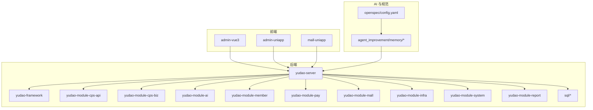
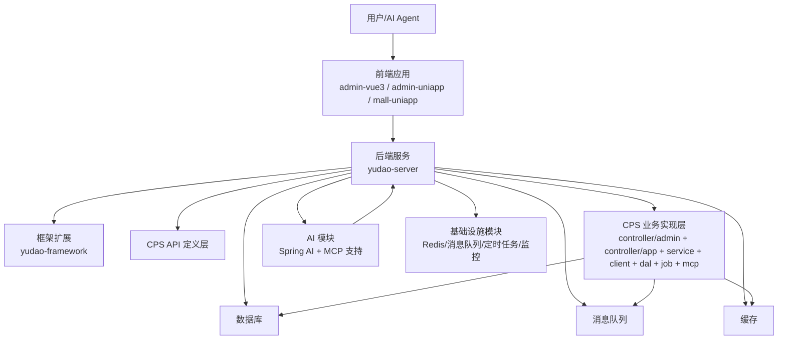
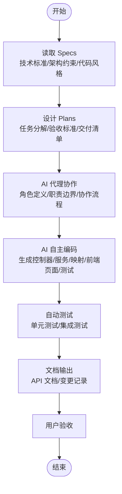
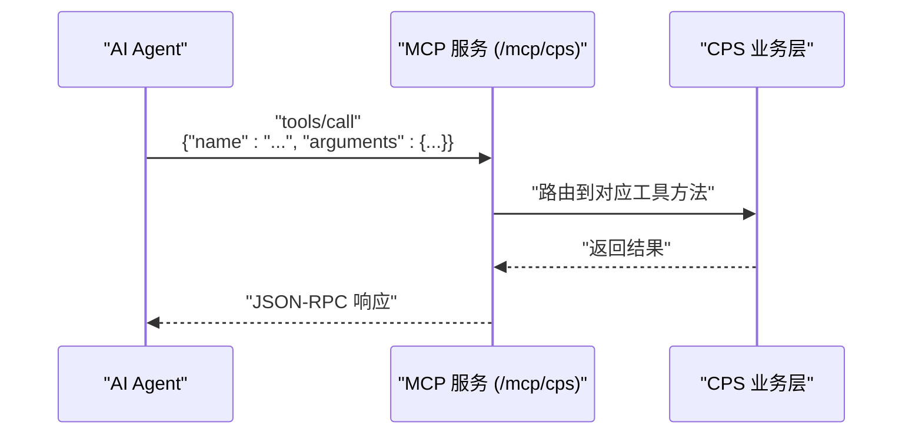
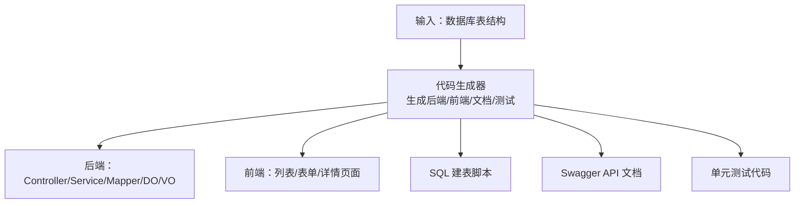
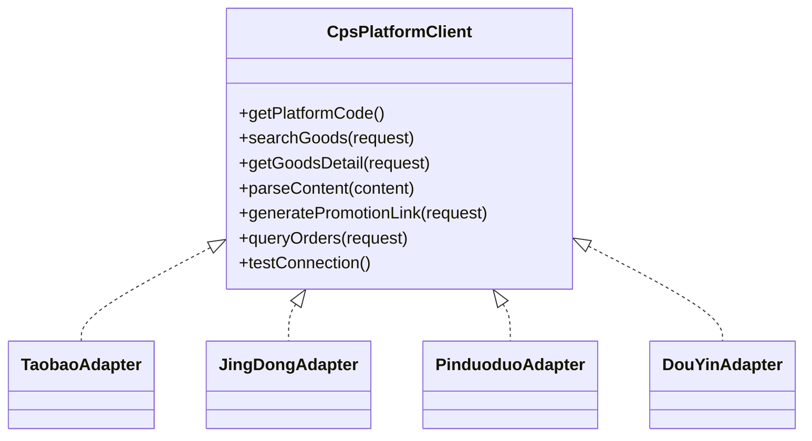
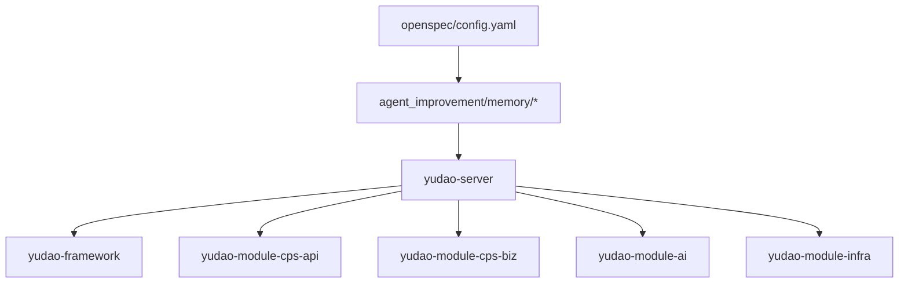

# AI 自主编程平台

<cite>
**本文引用的文件**
- [README.md](file://README.md)
- [AGENTS.md](file://AGENTS.md)
- [openspec/config.yaml](file://openspec/config.yaml)
- [agent_improvement/memory/MEMORY.md](file://agent_improvement/memory/MEMORY.md)
- [agent_improvement/memory/codegen-rules.md](file://agent_improvement/memory/codegen-rules.md)
</cite>

## 目录
1. [简介](#简介)
2. [项目结构](#项目结构)
3. [核心组件](#核心组件)
4. [架构总览](#架构总览)
5. [详细组件分析](#详细组件分析)
6. [依赖关系分析](#依赖关系分析)
7. [性能考量](#性能考量)
8. [故障排查指南](#故障排查指南)
9. [结论](#结论)
10. [附录](#附录)

## 简介
本项目是一个“AI 自主编程平台”，以 Vibe Coding（氛围编程）为核心开发范式，融合“低代码 + AI 自主编程”，目标是让一个人也能拥有“产品经理 + 架构师 + 全栈开发 + 测试工程师 + 运维工程师”的综合能力。平台通过规范化 AI 编程工作流（Specs/Plans）、AI 代理协作、MCP（Model Context Protocol）协议集成，实现“用自然语言描述需求，AI 自动完成从编码到测试再到交付”的闭环。

- 平台特性
  - Vibe Coding：以“意图”驱动，AI 自动理解 → 编码 → 测试 → 交付
  - 规范化 AI 编程：Specs/Plans/Agents/Skills 四大要素，确保质量与一致性
  - MCP 零代码接入：AI Agent 无需写代码即可调用平台工具
  - 低代码：代码生成器、可视化工作流、报表与大屏设计器
  - CPS 联盟返利系统：聚合淘宝、京东、拼多多、抖音等平台，提供搜索、比价、推广链接生成、订单追踪与结算

- 适用人群
  - 想做电商返利副业但不会写代码的人
  - 一人公司（OPC）创业者
  - 自由职业者/数字游民
  - 个人开发者/小型工作室

- 项目定位
  - 开箱即用的智能 CPS 联盟返利与导购平台
  - 100% 由 AI 自主编程完成的 CPS 核心模块（20,000+ 行代码）

**章节来源**
- [README.md:1-523](file://README.md#L1-L523)

## 项目结构
项目采用多模块分层架构，后端基于 Spring Boot 3.x，前端包含 Vue3 管理后台与 UniApp 移动端，基础设施模块提供缓存、消息队列、定时任务等能力。CPS 模块是平台的核心业务域，包含 API 定义层、业务实现层、平台适配器、数据访问层、定时任务与 MCP 接口层。

- 后端模块概览
  - yudao-dependencies：Maven 依赖版本管理
  - yudao-framework：框架扩展（安全、缓存、权限、多租户等）
  - yudao-server：主服务容器
  - yudao-module-*：各业务模块（系统管理、会员中心、支付、商城、AI、报表、CPS 等）
  - sql：各模块数据库脚本
- 前端模块概览
  - admin-vue3：Vue3 管理后台
  - admin-uniapp：uni-app 移动端管理
  - mall-uniapp：电商移动端应用
- AI 与规范
  - openspec：规范驱动的项目上下文与规则
  - agent_improvement/memory：代码生成规则与 Claude 记忆

**图表来源**
- [AGENTS.md:11-57](file://AGENTS.md#L11-L57)
- [README.md:229-249](file://README.md#L229-L249)

**章节来源**
- [AGENTS.md:11-57](file://AGENTS.md#L11-L57)
- [README.md:229-249](file://README.md#L229-L249)

## 核心组件
- 规范化 AI 编程工作流
  - Specs：技术标准、架构约束、代码风格
  - Plans：任务分解、验收标准、交付清单
  - Agents：角色定义、职责边界、协作流程
  - Skills：可复用技能、代码模板、最佳实践
- AI 代理协作
  - 基于角色与职责的协作流程，确保 AI 在理解需求后按计划执行
- MCP（Model Context Protocol）集成
  - 通过 JSON-RPC 2.0 over Streamable HTTP 在 /mcp/cps 提供 AI 工具与资源
  - 提供搜索、比价、推广链接生成、订单查询、返利汇总等工具
- 低代码能力
  - 代码生成器：一键生成前后端代码、SQL、Swagger 文档、单元测试
  - 可视化工作流：基于 Flowable 在线设计审批流程
  - 报表与大屏：拖拽生成数据报表、图形报表、大屏与打印模板
- CPS 联盟返利系统
  - 多平台接入：淘宝、京东、拼多多、抖音
  - 核心能力：商品搜索与比价、会员返利体系、订单全链路追踪、提现管理、风控管理
  - 定时任务：订单同步、状态更新、结算入账
  - MCP 接口：AI Agent 直接调用

**章节来源**
- [README.md:113-210](file://README.md#L113-L210)
- [AGENTS.md:161-169](file://AGENTS.md#L161-L169)

## 架构总览
平台整体采用分层架构，后端以 Spring Boot 为核心，前端采用 Vue3 + Element Plus 和 UniApp，基础设施模块提供缓存、消息队列、定时任务、监控等能力。CPS 模块通过策略模式接入多个平台适配器，并通过 MCP 提供 AI 工具与资源。

**图表来源**
- [AGENTS.md:11-57](file://AGENTS.md#L11-L57)
- [README.md:229-249](file://README.md#L229-L249)

**章节来源**
- [AGENTS.md:11-57](file://AGENTS.md#L11-L57)
- [README.md:229-249](file://README.md#L229-L249)

## 详细组件分析

### Vibe Coding 开发范式
- 核心理念
  - 以“意图”驱动，AI 自动完成从理解 → 编码 → 测试 → 交付的全过程
  - 通过 Specs/Plans/Agents/Skills 四大要素，确保 AI 编程的质量与一致性
- 工作流程
  - 需求对齐 → 方案设计 → 自主编码 → 验收交付
  - 用户参与需求与方案确认，AI 自动完成编码与测试，最终输出文档与可运行代码

**图表来源**
- [README.md:113-144](file://README.md#L113-L144)

**章节来源**
- [README.md:113-144](file://README.md#L113-L144)

### 规范化 AI 编程工作流（Specs/Plans）
- Specs：定义技术标准、架构约束与代码风格，确保 AI 输出符合项目规范
- Plans：明确任务分解、验收标准与交付清单，避免“AI 乱写代码”
- 优势
  - 需求精准对齐：避免偏差
  - 方案先行：先设计再编码，零返工
  - 纯 AI 自主编程：效率提升 10 倍以上
  - 质量可保障：自动测试 + 规范约束 + 验收标准
  - 持续自进化：每次项目反馈优化 Specs/Plans

**章节来源**
- [README.md:113-144](file://README.md#L113-L144)

### AI 代理协作流程
- 角色与职责
  - 不同 AI 代理负责不同领域（如编码、测试、文档、运维），通过明确的职责边界协作
- 协作机制
  - 基于 Plans 的任务分解与验收标准，确保各代理按计划协同
  - 通过规范化的工具与接口，降低协作成本

**章节来源**
- [README.md:113-144](file://README.md#L113-L144)

### MCP（Model Context Protocol）集成实现
- 协议与端点
  - 基于 JSON-RPC 2.0 over Streamable HTTP，端点为 /mcp/cps
- 工具与资源
  - Tools：AI 可调用函数（搜索、比价、生成链接、查询订单、返利汇总）
  - Resources：只读数据源（平台配置、返利规则、统计数据）
  - Prompts：预定义交互模板
- 零代码接入
  - AI Agent 可直接调用工具，无需任何开发

**图表来源**
- [AGENTS.md:161-169](file://AGENTS.md#L161-L169)
- [README.md:185-209](file://README.md#L185-L209)

**章节来源**
- [AGENTS.md:161-169](file://AGENTS.md#L161-L169)
- [README.md:185-209](file://README.md#L185-L209)

### AI 编码助手与代码生成器
- AI 编码助手
  - 全栈 AI 程序员，支持“加一个商品收藏功能”、“接入唯品会联盟”、“优化搜索性能”等场景
- 代码生成器
  - 输入数据库表结构，一键生成：Java 控制器/服务/映射/DO/VO、Vue3 前端页面、SQL 建表脚本、Swagger 文档、单元测试代码
  - 支持单表、树表、主子表三种模式
- 代码生成规则
  - 基于 Velocity 模板库，定义分层结构、命名约定、DO/Mapper/Service/Controller/VO 规范、模板类型（通用/树表/ERP 主表）等
  - 前端支持 Vue3 Element Plus、Vben Admin、Vben5 Antd、UniApp 移动端模板

**图表来源**
- [README.md:147-166](file://README.md#L147-L166)
- [agent_improvement/memory/codegen-rules.md:1-788](file://agent_improvement/memory/codegen-rules.md#L1-L788)

**章节来源**
- [README.md:147-166](file://README.md#L147-L166)
- [agent_improvement/memory/codegen-rules.md:1-788](file://agent_improvement/memory/codegen-rules.md#L1-L788)

### CPS 联盟返利系统
- 多平台接入
  - 淘宝、京东、拼多多、抖音联盟适配器，策略模式可插拔扩展
- 核心能力
  - 商品搜索与比价、推广链接生成、订单全链路追踪、会员返利体系、提现管理、风控管理
- 定时任务
  - 订单同步、状态更新、结算入账
- MCP 工具
  - cps_search_goods、cps_compare_prices、cps_generate_link、cps_query_orders、cps_get_rebate_summary

**图表来源**
- [AGENTS.md:143-159](file://AGENTS.md#L143-L159)

**章节来源**
- [AGENTS.md:143-159](file://AGENTS.md#L143-L159)

## 依赖关系分析
- 模块耦合
  - yudao-server 作为容器，聚合各业务模块；CPS 模块通过 API 定义层与业务实现层解耦
  - 基础设施模块（缓存、消息队列、定时任务、监控）被各模块复用
- 外部依赖
  - Spring Boot 3.5.9、Spring Security 6.5.2、MyBatis Plus 3.5.12、Redis/Redisson、Flowable、Vue3/UniApp、MySQL、Quartz、SkyWalking
- 规范与规则
  - openspec/config.yaml 定义规范驱动的项目上下文与规则
  - agent_improvement/memory 提供代码生成规则与 Claude 记忆

**图表来源**
- [AGENTS.md:11-57](file://AGENTS.md#L11-L57)
- [openspec/config.yaml:1-21](file://openspec/config.yaml#L1-L21)
- [agent_improvement/memory/MEMORY.md:1-21](file://agent_improvement/memory/MEMORY.md#L1-L21)

**章节来源**
- [AGENTS.md:11-57](file://AGENTS.md#L11-L57)
- [openspec/config.yaml:1-21](file://openspec/config.yaml#L1-L21)
- [agent_improvement/memory/MEMORY.md:1-21](file://agent_improvement/memory/MEMORY.md#L1-L21)

## 性能考量
- 性能指标
  - 单平台搜索：<2 秒（P99）
  - 多平台比价：<5 秒（P99）
  - 转链生成：<1 秒
  - 订单同步延迟：<30 分钟
  - 返利入账：平台结算后 24 小时内
  - MCP Tool 调用：<3 秒（搜索类）/<1 秒（查询类）
- 优化方向
  - 缓存策略：热点数据缓存、分布式锁控制并发
  - 异步处理：订单同步、结算入账使用消息队列异步化
  - 压测与监控：结合 SkyWalking 与压测工具，持续优化关键路径

**章节来源**
- [README.md:332-342](file://README.md#L332-L342)

## 故障排查指南
- 常见问题
  - 数据库连接：检查 application-local.yaml 中的 MySQL 连接配置
  - 缓存连接：检查 Redis 连接配置
  - MCP 工具不可用：确认 /mcp/cps 端点可达，工具注册正常
  - 平台 API 密钥：确保各平台（淘宝/京东/拼多多/抖音）密钥正确配置
- 排查步骤
  - 启动日志：查看 yudao-server 启动日志，确认模块加载成功
  - 定时任务：检查 Quartz 任务是否正常触发
  - 监控平台：通过 SkyWalking 查看链路与日志中心定位问题
- 配置参考
  - application-local.yaml：本地开发配置（数据库、Redis、MCP、平台密钥等）
  - Docker 环境：通过环境变量配置服务端口与连接信息

**章节来源**
- [AGENTS.md:214-234](file://AGENTS.md#L214-L234)

## 结论
AgenticCPS 以 Vibe Coding 为核心，结合规范化 AI 编程工作流、AI 代理协作与 MCP 协议，实现了“自然语言描述 → AI 自动编码 → 测试 → 交付”的完整闭环。平台不仅具备强大的低代码能力（代码生成器、可视化工作流、报表与大屏），还在 CPS 联盟返利系统上实现了多平台接入与自动化运营。通过规范驱动与持续自进化，平台能够以极低的成本快速扩展新功能，适合个人开发者、自由职业者与小型工作室使用。

## 附录
- 快速开始
  - 环境要求：JDK 17/21、MySQL 5.7/8.0+、Redis 5.0+、Maven 3.8+、Node.js 16+
  - 三步启动：克隆项目 → 初始化数据库 → 启动后端主类
- 使用示例
  - 接入新平台：实现 CpsPlatformClient 接口并注册为 Spring Bean
  - 调用 MCP 工具：通过 /mcp/cps 的 JSON-RPC 调用工具方法
  - 生成代码：输入数据库表结构，一键生成前后端代码与测试
- 扩展指南
  - 新增平台适配器：遵循策略模式，实现接口并注册 Bean
  - 新增 MCP 工具：在 mcp 层注册工具，定义参数与返回结构
  - 优化代码生成：基于 Velocity 模板库扩展模板类型与前端框架支持

**章节来源**
- [README.md:305-342](file://README.md#L305-L342)
- [AGENTS.md:143-169](file://AGENTS.md#L143-L169)
- [agent_improvement/memory/codegen-rules.md:1-788](file://agent_improvement/memory/codegen-rules.md#L1-L788)