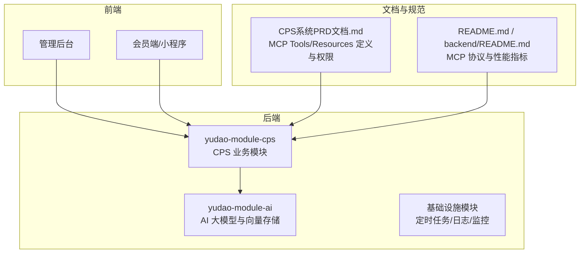
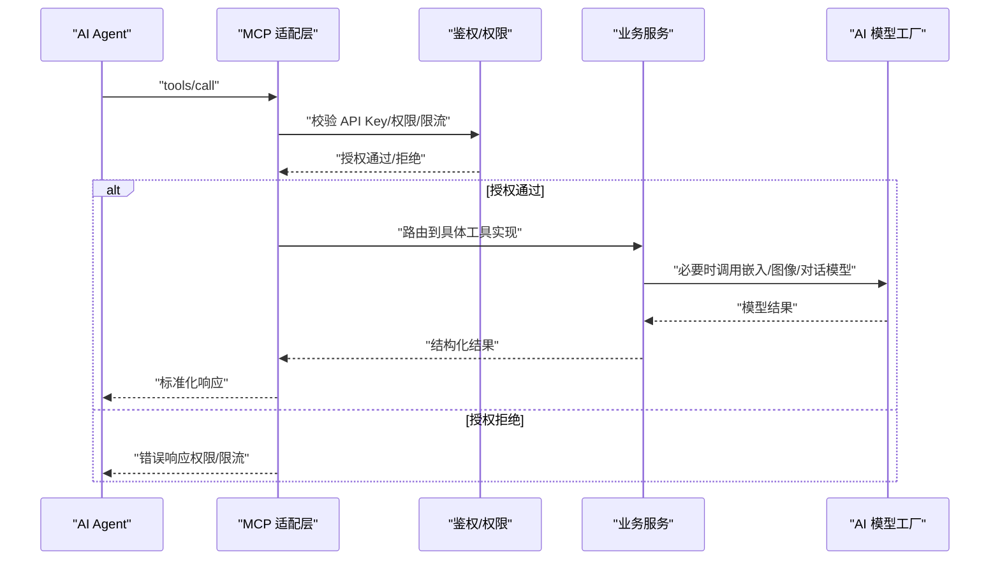
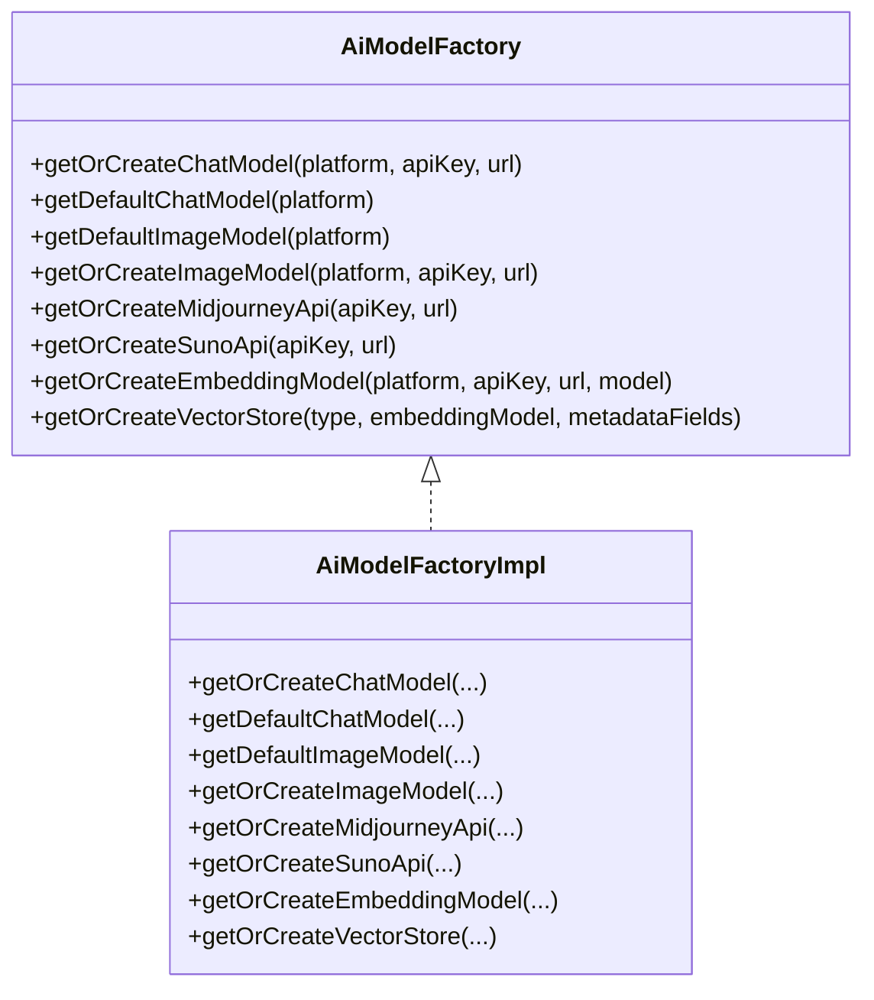
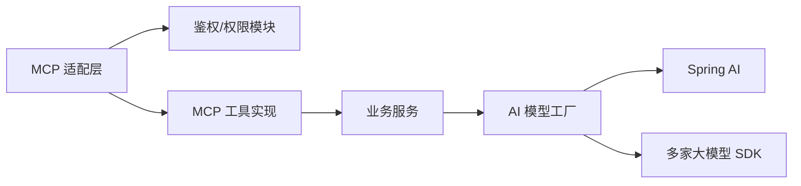

# MCP 协议集成

<cite>
**本文引用的文件**
- [README.md](file://README.md)
- [backend/README.md](file://backend/README.md)
- [docs/CPS系统PRD文档.md](file://docs/CPS系统PRD文档.md)
- [backend/yudao-module-ai/src/main/java/cn/iocoder/yudao/module/ai/framework/ai/core/model/AiModelFactory.java](file://backend/yudao-module-ai/src/main/java/cn/iocoder/yudao/module/ai/framework/ai/core/model/AiModelFactory.java)
- [backend/yudao-module-ai/src/main/java/cn/iocoder/yudao/module/ai/framework/ai/core/model/AiModelFactoryImpl.java](file://backend/yudao-module-ai/src/main/java/cn/iocoder/yudao/module/ai/framework/ai/core/model/AiModelFactoryImpl.java)
- [backend/yudao-module-ai/src/main/java/cn/iocoder/yudao/module/ai/framework/ai/config/YudaoAiProperties.java](file://backend/yudao-module-ai/src/main/java/cn/iocoder/yudao/module/ai/framework/ai/config/YudaoAiProperties.java)
- [backend/sql/mysql/ruoyi-vue-pro.sql](file://backend/sql/mysql/ruoyi-vue-pro.sql)
- [backend/sql/sqlserver/ruoyi-vue-pro.sql](file://backend/sql/sqlserver/ruoyi-vue-pro.sql)
</cite>

## 目录
1. [简介](#简介)
2. [项目结构](#项目结构)
3. [核心组件](#核心组件)
4. [架构总览](#架构总览)
5. [详细组件分析](#详细组件分析)
6. [依赖关系分析](#依赖关系分析)
7. [性能考量](#性能考量)
8. [故障排查指南](#故障排查指南)
9. [结论](#结论)
10. [附录](#附录)

## 简介
本文件面向希望在 AgenticCPS 中实现并集成 MCP（Model Context Protocol）协议的开发者，系统性阐述 AI Agent 零代码接入机制的设计与实现，包括：
- MCP 协议核心概念与工具函数定义规范
- 访问权限管理机制与 API Key 策略
- AI 模块架构设计：生命周期管理、资源访问接口、协议适配层
- 通过 MCP 协议与不同 AI 模型的集成方式：协议转换、消息路由、错误处理
- 具体集成示例、配置参数说明、安全与性能优化建议

## 项目结构
AgenticCPS 采用多模块分层架构，MCP 协议集成位于后端模块中，结合 AI 大模型能力与 CPS 业务模块协同工作。关键位置如下：
- 后端模块：yudao-module-ai（AI 大模型与向量检索能力）、yudao-module-cps（CPS 业务模块，包含 mcp 子模块）
- 文档与规范：docs/CPS系统PRD文档.md（定义 MCP Tools 与 Resources 的交互流程、权限与日志）
- README 与后端说明：README.md、backend/README.md（MCP 协议介绍与性能指标）

**章节来源**
- [README.md: 185-210:185-210](file://README.md#L185-L210)
- [README.md: 229-249:229-249](file://README.md#L229-L249)
- [docs/CPS系统PRD文档.md: 650-757:650-757](file://docs/CPS系统PRD文档.md#L650-L757)

## 核心组件
围绕 MCP 协议集成，核心组件包括：
- MCP 工具与资源：商品搜索、跨平台比价、推广链接生成、订单查询、返利汇总等
- 访问控制与 API Key 管理：权限级别（public/member/admin）、限流配置、使用统计
- 协议适配层：基于 Spring AI 的工具调用管理与模型工厂
- AI 模型工厂：统一管理多种大模型与嵌入模型，支持工具调用与向量检索

**章节来源**
- [README.md: 185-210:185-210](file://README.md#L185-L210)
- [docs/CPS系统PRD文档.md: 694-737:694-737](file://docs/CPS系统PRD文档.md#L694-L737)
- [backend/yudao-module-ai/src/main/java/cn/iocoder/yudao/module/ai/framework/ai/core/model/AiModelFactory.java: 1-114:1-114](file://backend/yudao-module-ai/src/main/java/cn/iocoder/yudao/module/ai/framework/ai/core/model/AiModelFactory.java#L1-L114)
- [backend/yudao-module-ai/src/main/java/cn/iocoder/yudao/module/ai/framework/ai/core/model/AiModelFactoryImpl.java: 141-228:141-228](file://backend/yudao-module-ai/src/main/java/cn/iocoder/yudao/module/ai/framework/ai/core/model/AiModelFactoryImpl.java#L141-L228)

## 架构总览
MCP 协议集成的整体架构如下：
- AI Agent 通过 MCP 工具调用（tools/call）与资源访问（resources/*）与系统交互
- 系统侧进行 API Key 校验、权限分级与限流控制
- 工具调用经由协议适配层路由到具体业务实现（如商品搜索、比价、订单查询）
- 返回结果以结构化数据与自然语言摘要呈现

**图表来源**
- [docs/CPS系统PRD文档.md: 662-693:662-693](file://docs/CPS系统PRD文档.md#L662-L693)
- [docs/CPS系统PRD文档.md: 694-737:694-737](file://docs/CPS系统PRD文档.md#L694-L737)

**章节来源**
- [docs/CPS系统PRD文档.md: 662-693:662-693](file://docs/CPS系统PRD文档.md#L662-L693)
- [docs/CPS系统PRD文档.md: 694-737:694-737](file://docs/CPS系统PRD文档.md#L694-L737)

## 详细组件分析

### MCP 工具与资源规范
- 工具（Tools）：用于执行具体业务动作，如商品搜索、跨平台比价、生成推广链接、查询订单、汇总返利
- 资源（Resources）：用于查询状态或数据，如订单状态资源
- 参数与权限：工具与资源均支持配置权限级别（public/member/admin）与默认参数限制
- 输出格式：结构化商品信息列表、推荐理由与比价分析、订单状态与返利进度

**章节来源**
- [README.md: 185-210:185-210](file://README.md#L185-L210)
- [docs/CPS系统PRD文档.md: 650-661:650-661](file://docs/CPS系统PRD文档.md#L650-L661)
- [docs/CPS系统PRD文档.md: 662-677:662-677](file://docs/CPS系统PRD文档.md#L662-L677)
- [docs/CPS系统PRD文档.md: 678-693:678-693](file://docs/CPS系统PRD文档.md#L678-L693)
- [docs/CPS系统PRD文档.md: 717-734:717-734](file://docs/CPS系统PRD文档.md#L717-L734)

### 访问权限与 API Key 管理
- API Key 管理：支持创建、更新、删除；配置权限级别（public/member/admin）、限流规则、状态与备注
- 权限分级：public 仅查询；member 支持会员级操作；admin 支持管理权限
- 访问日志：记录请求时间、API Key、方法名、输入参数（脱敏）、响应状态、耗时、用户ID、来源IP，并支持筛选

**章节来源**
- [docs/CPS系统PRD文档.md: 694-716:694-716](file://docs/CPS系统PRD文档.md#L694-L716)
- [docs/CPS系统PRD文档.md: 735-757:735-757](file://docs/CPS系统PRD文档.md#L735-L757)

### 协议适配层与工具调用管理
- 工具调用管理：基于 Spring AI 的 ToolCallingManager，支持工具注册与调用
- 模型工厂：统一管理多种大模型（如通义、文心、DeepSeek、豆包、混元、SiliconFlow、智谱、MiniMax、Moonshot、讯飞星火、百川、OpenAI、Azure OpenAI、Anthropic、Gemini、Ollama、Grok）与图像/嵌入/向量存储
- 缓存与重试：模型实例按平台/密钥/URL 缓存；提供默认重试模板与观测注册

**图表来源**
- [backend/yudao-module-ai/src/main/java/cn/iocoder/yudao/module/ai/framework/ai/core/model/AiModelFactory.java: 18-114:18-114](file://backend/yudao-module-ai/src/main/java/cn/iocoder/yudao/module/ai/framework/ai/core/model/AiModelFactory.java#L18-L114)
- [backend/yudao-module-ai/src/main/java/cn/iocoder/yudao/module/ai/framework/ai/core/model/AiModelFactoryImpl.java: 141-335:141-335](file://backend/yudao-module-ai/src/main/java/cn/iocoder/yudao/module/ai/framework/ai/core/model/AiModelFactoryImpl.java#L141-L335)

**章节来源**
- [backend/yudao-module-ai/src/main/java/cn/iocoder/yudao/module/ai/framework/ai/core/model/AiModelFactory.java: 1-114:1-114](file://backend/yudao-module-ai/src/main/java/cn/iocoder/yudao/module/ai/framework/ai/core/model/AiModelFactory.java#L1-L114)
- [backend/yudao-module-ai/src/main/java/cn/iocoder/yudao/module/ai/framework/ai/core/model/AiModelFactoryImpl.java: 141-335:141-335](file://backend/yudao-module-ai/src/main/java/cn/iocoder/yudao/module/ai/framework/ai/core/model/AiModelFactoryImpl.java#L141-L335)

### AI 模型配置与平台支持
- 配置项：针对 Gemini、豆包、混元、SiliconFlow、讯飞星火、百川、Midjourney、Suno、网络搜索等平台的启用开关、API Key、模型、温度、最大 Token、TopP、基础 URL 等
- 平台枚举：AiPlatformEnum 与模型工厂 switch 分支对应，确保新增平台可按规范接入

**章节来源**
- [backend/yudao-module-ai/src/main/java/cn/iocoder/yudao/module/ai/framework/ai/config/YudaoAiProperties.java: 12-187:12-187](file://backend/yudao-module-ai/src/main/java/cn/iocoder/yudao/module/ai/framework/ai/config/YudaoAiProperties.java#L12-L187)
- [backend/yudao-module-ai/src/main/java/cn/iocoder/yudao/module/ai/framework/ai/core/model/AiModelFactoryImpl.java: 148-186:148-186](file://backend/yudao-module-ai/src/main/java/cn/iocoder/yudao/module/ai/framework/ai/core/model/AiModelFactoryImpl.java#L148-L186)

### 数据字典与平台映射
- 平台字典：系统字典中包含“硅基流动”等平台标识，用于前端与后端统一识别
- 字段来源：MySQL 与 SQLServer 脚本中包含平台字典数据插入

**章节来源**
- [backend/sql/mysql/ruoyi-vue-pro.sql: 2931-2939:2931-2939](file://backend/sql/mysql/ruoyi-vue-pro.sql#L2931-L2939)
- [backend/sql/sqlserver/ruoyi-vue-pro.sql: 2931-2939:2931-2939](file://backend/sql/sqlserver/ruoyi-vue-pro.sql#L2931-L2939)

## 依赖关系分析
- 模块耦合：MCP 适配层依赖鉴权与权限模块；工具实现依赖业务服务；业务服务依赖 AI 模型工厂与向量存储
- 外部依赖：Spring AI（工具调用、模型封装）、多种大模型 SDK（DashScope、QianFan、DeepSeek、ZhiPuAi、MiniMax、Moonshot、Ollama、OpenAI、Azure OpenAI、Anthropic、Gemini 等）
- 配置依赖：YudaoAiProperties 提供统一的平台配置入口，AiModelFactoryImpl 依据配置创建模型实例

**图表来源**
- [backend/yudao-module-ai/src/main/java/cn/iocoder/yudao/module/ai/framework/ai/core/model/AiModelFactoryImpl.java: 141-335:141-335](file://backend/yudao-module-ai/src/main/java/cn/iocoder/yudao/module/ai/framework/ai/core/model/AiModelFactoryImpl.java#L141-L335)

**章节来源**
- [backend/yudao-module-ai/src/main/java/cn/iocoder/yudao/module/ai/framework/ai/core/model/AiModelFactoryImpl.java: 141-335:141-335](file://backend/yudao-module-ai/src/main/java/cn/iocoder/yudao/module/ai/framework/ai/core/model/AiModelFactoryImpl.java#L141-L335)

## 性能考量
- 性能目标：单平台搜索 P99 < 2 秒、多平台比价 P99 < 5 秒、转链生成 < 1 秒、订单同步延迟 < 30 分钟、MCP Tool 调用 < 3 秒（搜索类）/ < 1 秒（查询类）
- 优化建议：
  - 工具调用并发化：跨平台比价等场景采用并发查询，减少总体等待时间
  - 结果缓存：对热点商品与比价结果进行缓存，降低重复查询压力
  - 模型实例缓存：按平台/密钥/URL 缓存模型实例，避免重复初始化
  - 限流与熔断：结合 API Key 限流策略，防止突发流量冲击
  - 观测与日志：利用工具调用管理器与观测注册，记录耗时与错误，支撑性能分析

**章节来源**
- [README.md: 332-342:332-342](file://README.md#L332-L342)
- [docs/CPS系统PRD文档.md: 662-677:662-677](file://docs/CPS系统PRD文档.md#L662-L677)

## 故障排查指南
- 常见问题定位：
  - 工具调用失败：检查 API Key 权限级别与限流配置，确认工具参数是否符合默认值与限制
  - 模型初始化异常：核对平台配置（API Key、URL、模型名、温度等），确认 SDK 依赖可用
  - 性能不达标：核查并发策略、缓存命中率、限流阈值与观测日志
- 日志与审计：
  - 访问日志包含请求时间、API Key、方法名、输入参数（脱敏）、响应状态、耗时、用户ID、来源IP，支持按条件筛选定位问题

**章节来源**
- [docs/CPS系统PRD文档.md: 735-757:735-757](file://docs/CPS系统PRD文档.md#L735-L757)

## 结论
通过 MCP 协议，AgenticCPS 实现了 AI Agent 的零代码接入，将工具与资源以标准化方式暴露给外部系统。配合完善的权限管理、API Key 控制与访问日志，系统在保证安全性的同时实现了高并发与高性能。AI 模型工厂与 Spring AI 的结合，使得多平台模型的接入与工具调用具备良好的扩展性与可观测性。

## 附录

### 集成示例与配置要点
- 示例请求（工具调用）：AI Agent 直接发送 tools/call 请求，无需额外开发
- 配置要点：
  - 在管理后台配置 API Key 权限级别与限流规则
  - 在 Tools 配置中启用/禁用工具并设置默认参数
  - 在模型配置中为各平台设置 API Key、URL、模型与推理参数

**章节来源**
- [README.md: 185-210:185-210](file://README.md#L185-L210)
- [docs/CPS系统PRD文档.md: 694-716:694-716](file://docs/CPS系统PRD文档.md#L694-L716)
- [docs/CPS系统PRD文档.md: 717-734:717-734](file://docs/CPS系统PRD文档.md#L717-L734)
- [backend/yudao-module-ai/src/main/java/cn/iocoder/yudao/module/ai/framework/ai/config/YudaoAiProperties.java: 12-187:12-187](file://backend/yudao-module-ai/src/main/java/cn/iocoder/yudao/module/ai/framework/ai/config/YudaoAiProperties.java#L12-L187)