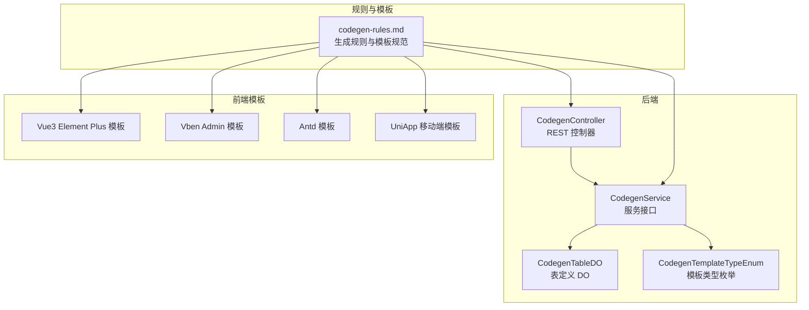
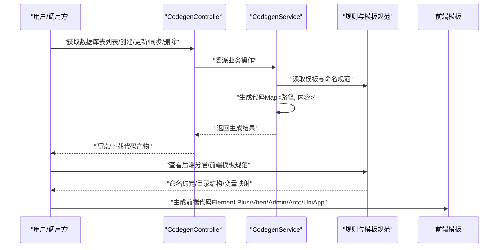
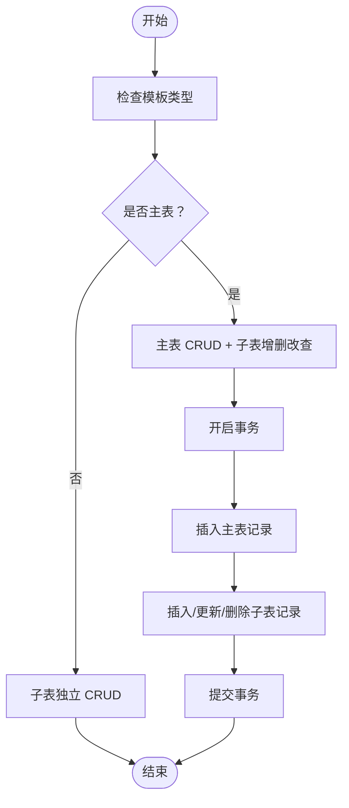
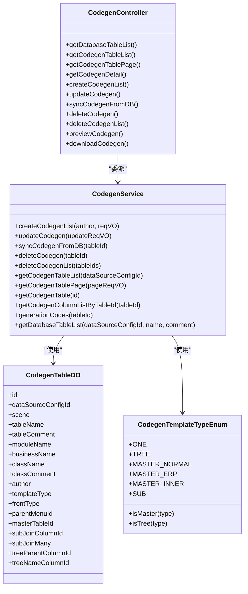
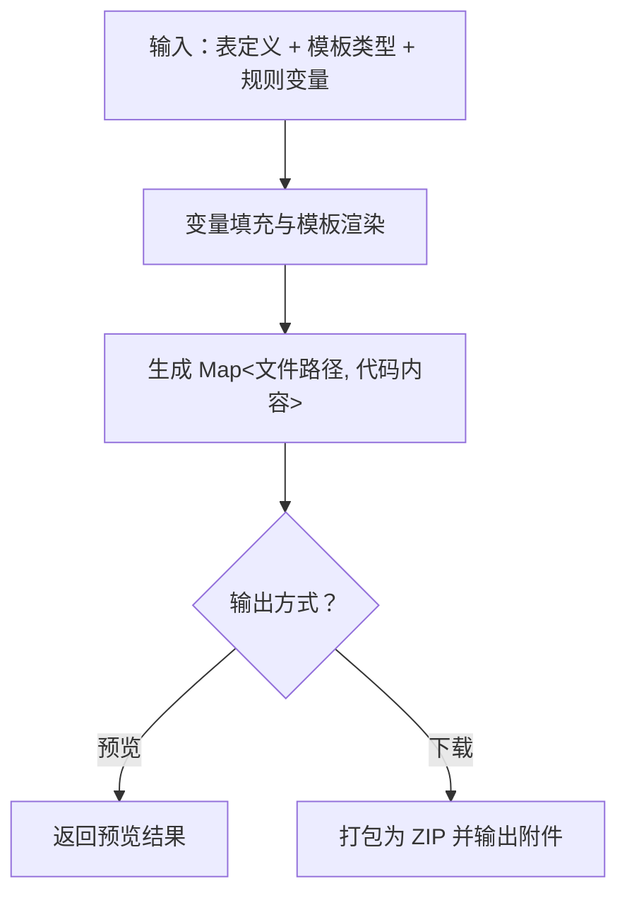
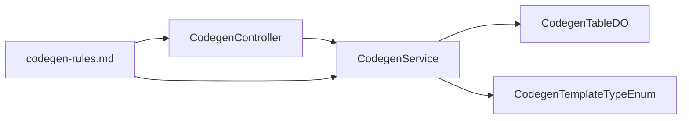

# Vibe Coding 开发范式

<cite>
**本文引用的文件**   
- [codegen-rules.md](file://agent_improvement/memory/codegen-rules.md)
- [CodegenController.java](file://backend/yudao-module-infra/src/main/java/cn/iocoder/yudao/module/infra/controller/admin/codegen/CodegenController.java)
- [CodegenService.java](file://backend/yudao-module-infra/src/main/java/cn/iocoder/yudao/module/infra/service/codegen/CodegenService.java)
- [CodegenTableDO.java](file://backend/yudao-module-infra/src/main/java/cn/iocoder/yudao/module/infra/dal/dataobject/codegen/CodegenTableDO.java)
- [CodegenTemplateTypeEnum.java](file://backend/yudao-module-infra/src/main/java/cn/iocoder/yudao/module/infra/enums/codegen/CodegenTemplateTypeEnum.java)
</cite>

## 目录
1. [引言](#引言)
2. [项目结构](#项目结构)
3. [核心组件](#核心组件)
4. [架构总览](#架构总览)
5. [详细组件分析](#详细组件分析)
6. [依赖关系分析](#依赖关系分析)
7. [性能考量](#性能考量)
8. [故障排查指南](#故障排查指南)
9. [结论](#结论)
10. [附录](#附录)

## 引言
本技术文档围绕“Vibe Coding 开发范式”展开，系统阐述规范化 AI 编程工作流的设计理念与实现方式，重点覆盖以下方面：
- 规范化的 Specs/Plans 管理机制：通过“表与字段定义 + 模板类型 + 场景配置”的标准化 Specs，驱动 AI 代理按既定规则生成代码。
- AI 代理协作流程：以“表结构解析 → 规划生成策略 → 模板渲染 → 产物输出”的流水线，确保前后端一致性与可扩展性。
- 代码生成器实现原理：基于后端 DO/Mapper/Service/Controller/VO 分层与前端 Vue3 Element Plus/Vben Admin/Antd/UniApp 模板的统一命名与结构约定，结合 Velocity 风格的模板变量体系，实现高复用、低歧义的代码生成。

同时，文档详细解释 yudao-module-infra 代码生成器的模板规则，包括：
- 后端 DO/Mapper/Service/Controller/VO 分层结构与命名约定
- 前端多套模板的目录结构、API 定义与页面组件规范
- 主子表处理逻辑与 VO 类型规范（PageReqVO/ListReqVO/SaveReqVO/RespVO）
- 基于 Velocity 模板库的代码生成机制与变量体系

并提供使用示例、配置说明与最佳实践，帮助开发者快速理解并应用这一创新的开发范式。

## 项目结构
本项目采用“后端模块 + 前端多模板 + 文档与规则”的组织方式。与代码生成器直接相关的核心位置如下：
- 后端 yudao-module-infra：提供代码生成器的控制器、服务接口、数据对象与模板类型枚举
- agent_improvement/memory：存放代码生成规则文档，定义后端分层、前端模板、命名与变量映射
- frontend：包含 admin-vue3、admin-uniapp 等前端模板工程，作为生成目标

**图示来源**
- [CodegenController.java:40-161](file://backend/yudao-module-infra/src/main/java/cn/iocoder/yudao/module/infra/controller/admin/codegen/CodegenController.java#L40-L161)
- [CodegenService.java:14-109](file://backend/yudao-module-infra/src/main/java/cn/iocoder/yudao/module/infra/service/codegen/CodegenService.java#L14-L109)
- [CodegenTableDO.java:15-157](file://backend/yudao-module-infra/src/main/java/cn/iocoder/yudao/module/infra/dal/dataobject/codegen/CodegenTableDO.java#L15-L157)
- [CodegenTemplateTypeEnum.java:9-54](file://backend/yudao-module-infra/src/main/java/cn/iocoder/yudao/module/infra/enums/codegen/CodegenTemplateTypeEnum.java#L9-L54)
- [codegen-rules.md:1-788](file://agent_improvement/memory/codegen-rules.md#L1-L788)

**章节来源**
- [CodegenController.java:40-161](file://backend/yudao-module-infra/src/main/java/cn/iocoder/yudao/module/infra/controller/admin/codegen/CodegenController.java#L40-L161)
- [CodegenService.java:14-109](file://backend/yudao-module-infra/src/main/java/cn/iocoder/yudao/module/infra/service/codegen/CodegenService.java#L14-L109)
- [CodegenTableDO.java:15-157](file://backend/yudao-module-infra/src/main/java/cn/iocoder/yudao/module/infra/dal/dataobject/codegen/CodegenTableDO.java#L15-L157)
- [CodegenTemplateTypeEnum.java:9-54](file://backend/yudao-module-infra/src/main/java/cn/iocoder/yudao/module/infra/enums/codegen/CodegenTemplateTypeEnum.java#L9-L54)
- [codegen-rules.md:1-788](file://agent_improvement/memory/codegen-rules.md#L1-L788)

## 核心组件
- 规则与模板规范（codegen-rules.md）
  - 定义后端分层结构、命名约定、DO/Mapper/Service/Controller/VO 规范
  - 定义前端三套模板（Element Plus/Vben Admin/Antd/UniApp）的目录结构、API 与页面组件规范
  - 明确模板类型（单表、树表、主子表）与变量映射
- 后端控制器（CodegenController）
  - 提供表定义查询、创建、更新、同步、删除、预览与下载等接口
  - 支持基于数据库表结构的批量创建与同步
- 服务接口（CodegenService）
  - 定义生成器核心能力：创建/更新/同步/删除、分页查询、生成代码、获取数据库表列表
- 数据对象（CodegenTableDO）
  - 表定义的数据模型，包含场景、模板类型、前端类型、主子表关联、树表字段等
- 模板类型枚举（CodegenTemplateTypeEnum）
  - 定义模板类型常量与判断方法（是否主表、是否树表）

**章节来源**
- [codegen-rules.md:1-788](file://agent_improvement/memory/codegen-rules.md#L1-L788)
- [CodegenController.java:40-161](file://backend/yudao-module-infra/src/main/java/cn/iocoder/yudao/module/infra/controller/admin/codegen/CodegenController.java#L40-L161)
- [CodegenService.java:14-109](file://backend/yudao-module-infra/src/main/java/cn/iocoder/yudao/module/infra/service/codegen/CodegenService.java#L14-L109)
- [CodegenTableDO.java:15-157](file://backend/yudao-module-infra/src/main/java/cn/iocoder/yudao/module/infra/dal/dataobject/codegen/CodegenTableDO.java#L15-L157)
- [CodegenTemplateTypeEnum.java:9-54](file://backend/yudao-module-infra/src/main/java/cn/iocoder/yudao/module/infra/enums/codegen/CodegenTemplateTypeEnum.java#L9-L54)

## 架构总览
下图展示了从“表与字段定义”到“前后端代码生成”的整体流程，体现 AI 代理如何依据规范执行生成任务：

**图示来源**
- [CodegenController.java:40-161](file://backend/yudao-module-infra/src/main/java/cn/iocoder/yudao/module/infra/controller/admin/codegen/CodegenController.java#L40-L161)
- [CodegenService.java:14-109](file://backend/yudao-module-infra/src/main/java/cn/iocoder/yudao/module/infra/service/codegen/CodegenService.java#L14-L109)
- [codegen-rules.md:1-788](file://agent_improvement/memory/codegen-rules.md#L1-L788)

## 详细组件分析

### 后端分层与命名规范
- 分层结构
  - module-{moduleName}/controller/{sceneEnum.basePackage}/{businessName}/{ClassName}Controller.java
  - module-{moduleName}/service/{businessName}/{ClassName}Service.java / {ClassName}ServiceImpl.java
  - module-{moduleName}/dal/dataobject/{businessName}/{ClassName}DO.java（含主子表 DO）
  - module-{moduleName}/dal/mysql/{businessName}/{ClassName}Mapper.java（含主子表 Mapper）
- 命名约定
  - 模块名：module-{moduleName}
  - 业务名：小写中划线
  - 类名：PascalCase
  - 包路径：小写点分隔
  - HTTP 路径：/{moduleName}/{className_strike_case}

- DO 规范
  - 继承基类，排除基类已包含字段；主键使用注解标识；树表/主子表/枚举/时间字段有特殊标注
- Mapper 规范
  - 默认分页/列表查询方法；条件操作符映射（=、!=、>、>=、<、<=、LIKE、BETWEEN）
- Service 接口与实现
  - 标准 CRUD + 分页/列表；事务控制（主子表必须）；树表校验（父级有效性、名称唯一性、无子节点校验）
- Controller 规范
  - 注解与权限控制；标准 CRUD + 导出 Excel；分页/列表路由区分
- VO 规范
  - PageReqVO：继承分页参数；BETWEEN 条件使用数组 + 日期格式化
  - ListReqVO：树表列表查询
  - SaveReqVO：新增/修改请求，必填校验
  - RespVO：响应 VO，支持导出字段标注

**章节来源**
- [codegen-rules.md:5-30](file://agent_improvement/memory/codegen-rules.md#L5-L30)
- [codegen-rules.md:31-50](file://agent_improvement/memory/codegen-rules.md#L31-L50)
- [codegen-rules.md:51-75](file://agent_improvement/memory/codegen-rules.md#L51-L75)
- [codegen-rules.md:76-110](file://agent_improvement/memory/codegen-rules.md#L76-L110)
- [codegen-rules.md:111-182](file://agent_improvement/memory/codegen-rules.md#L111-L182)
- [codegen-rules.md:204-261](file://agent_improvement/memory/codegen-rules.md#L204-L261)
- [codegen-rules.md:263-305](file://agent_improvement/memory/codegen-rules.md#L263-L305)

### 前端模板与变量体系
- Vue3 Element Plus 模板
  - 目录结构：src/api/{moduleName}/{businessName}/index.ts 与 views 下的 index.vue、{ClassName}Form.vue、components 子表组件
  - API 定义：基础 CRUD 与导出
  - 页面组件：搜索表单、表格、分页、对话框表单
  - 树表特殊处理：列表使用树形转换，表单使用树选择组件
- Vben Admin 模板
  - 目录结构：index.vue、{ClassName}Modal.vue、{ClassName}.data.ts 配置
  - 配置数据：columns、searchFormSchema、createFormSchema
  - 列表页：BasicTable + Modal + 表单 Schema
- Vben5 Antd 模板
  - 使用 Ant Design Vue 组件，表格与分页风格
- UniApp 移动端模板
  - 目录结构：api/{moduleName}/{businessName}.ts 与 pages-{moduleName}/{businessName}/index.vue、form/index.vue、detail/index.vue
  - API 定义：分页/详情/增删改
  - 列表页：上拉加载、导航跳转

- 模板变量
  - ${moduleName}/${businessName}/${className}/${classNameVar}/${simpleClassName_strikeCase}/${permissionPrefix}/${primaryColumn.javaType} 等
- HTML 类型映射
  - 字符串/整数/布尔/时间/上传/富文本等在不同前端框架中的组件映射

**章节来源**
- [codegen-rules.md:327-491](file://agent_improvement/memory/codegen-rules.md#L327-L491)
- [codegen-rules.md:492-630](file://agent_improvement/memory/codegen-rules.md#L492-L630)
- [codegen-rules.md:631-660](file://agent_improvement/memory/codegen-rules.md#L631-L660)
- [codegen-rules.md:661-745](file://agent_improvement/memory/codegen-rules.md#L661-L745)
- [codegen-rules.md:746-788](file://agent_improvement/memory/codegen-rules.md#L746-L788)

### 主子表处理逻辑
- 模板类型
  - 主表：普通模式、ERP 模式、内嵌模式
  - 子表：独立子表
- 关联关系
  - 主表与子表通过 join 字段关联；一对多/一对一由配置决定
- 生成策略
  - 主表：完整 CRUD + 子表增删改查
  - 子表：独立 CRUD；在主表页面内嵌子表组件
- 事务与一致性
  - 主子表操作需在事务中执行，保证原子性

**图示来源**
- [CodegenTemplateTypeEnum.java:14-54](file://backend/yudao-module-infra/src/main/java/cn/iocoder/yudao/module/infra/enums/codegen/CodegenTemplateTypeEnum.java#L14-L54)
- [codegen-rules.md:307-315](file://agent_improvement/memory/codegen-rules.md#L307-L315)
- [codegen-rules.md:127-137](file://agent_improvement/memory/codegen-rules.md#L127-L137)
- [codegen-rules.md:184-202](file://agent_improvement/memory/codegen-rules.md#L184-L202)

**章节来源**
- [CodegenTemplateTypeEnum.java:14-54](file://backend/yudao-module-infra/src/main/java/cn/iocoder/yudao/module/infra/enums/codegen/CodegenTemplateTypeEnum.java#L14-L54)
- [codegen-rules.md:307-315](file://agent_improvement/memory/codegen-rules.md#L307-L315)
- [codegen-rules.md:127-137](file://agent_improvement/memory/codegen-rules.md#L127-L137)
- [codegen-rules.md:184-202](file://agent_improvement/memory/codegen-rules.md#L184-L202)

### 代码生成器实现原理（后端）
- 控制器职责
  - 提供表定义查询、创建、更新、同步、删除、预览与下载接口
  - 预览与下载均基于服务层生成的 Map<String, String> 结果
- 服务接口职责
  - 定义生成器核心能力：创建/更新/同步/删除、分页查询、生成代码、获取数据库表列表
  - generationCodes 返回文件路径到代码内容的映射
- 数据对象与模板类型
  - CodegenTableDO 承载表定义、场景、模板类型、前端类型、主子表与树表字段等
  - CodegenTemplateTypeEnum 提供模板类型判断（主表/树表）

**图示来源**
- [CodegenController.java:40-161](file://backend/yudao-module-infra/src/main/java/cn/iocoder/yudao/module/infra/controller/admin/codegen/CodegenController.java#L40-L161)
- [CodegenService.java:14-109](file://backend/yudao-module-infra/src/main/java/cn/iocoder/yudao/module/infra/service/codegen/CodegenService.java#L14-L109)
- [CodegenTableDO.java:15-157](file://backend/yudao-module-infra/src/main/java/cn/iocoder/yudao/module/infra/dal/dataobject/codegen/CodegenTableDO.java#L15-L157)
- [CodegenTemplateTypeEnum.java:14-54](file://backend/yudao-module-infra/src/main/java/cn/iocoder/yudao/module/infra/enums/codegen/CodegenTemplateTypeEnum.java#L14-L54)

**章节来源**
- [CodegenController.java:40-161](file://backend/yudao-module-infra/src/main/java/cn/iocoder/yudao/module/infra/controller/admin/codegen/CodegenController.java#L40-L161)
- [CodegenService.java:14-109](file://backend/yudao-module-infra/src/main/java/cn/iocoder/yudao/module/infra/service/codegen/CodegenService.java#L14-L109)
- [CodegenTableDO.java:15-157](file://backend/yudao-module-infra/src/main/java/cn/iocoder/yudao/module/infra/dal/dataobject/codegen/CodegenTableDO.java#L15-L157)
- [CodegenTemplateTypeEnum.java:14-54](file://backend/yudao-module-infra/src/main/java/cn/iocoder/yudao/module/infra/enums/codegen/CodegenTemplateTypeEnum.java#L14-L54)

### 基于 Velocity 模板库的代码生成机制
- 模板变量体系
  - 通过规则文档定义的变量（如 ${className}、${classNameVar}、${simpleClassName_strikeCase}、${permissionPrefix}、${primaryColumn.javaType} 等）驱动模板渲染
- 渲染流程
  - 服务层根据表定义与模板类型，填充变量并渲染模板，输出 Map<路径, 内容>
  - 控制器将渲染结果进行预览或打包下载
- 产物组织
  - 后端：按模块/业务/层级生成 DO/Mapper/Service/Controller/VO
  - 前端：按 Element Plus/Vben/Admin/Antd/UniApp 模板生成 API 与页面组件

**图示来源**
- [codegen-rules.md:746-788](file://agent_improvement/memory/codegen-rules.md#L746-L788)
- [CodegenController.java:134-158](file://backend/yudao-module-infra/src/main/java/cn/iocoder/yudao/module/infra/controller/admin/codegen/CodegenController.java#L134-L158)
- [CodegenService.java:90-96](file://backend/yudao-module-infra/src/main/java/cn/iocoder/yudao/module/infra/service/codegen/CodegenService.java#L90-L96)

**章节来源**
- [codegen-rules.md:746-788](file://agent_improvement/memory/codegen-rules.md#L746-L788)
- [CodegenController.java:134-158](file://backend/yudao-module-infra/src/main/java/cn/iocoder/yudao/module/infra/controller/admin/codegen/CodegenController.java#L134-L158)
- [CodegenService.java:90-96](file://backend/yudao-module-infra/src/main/java/cn/iocoder/yudao/module/infra/service/codegen/CodegenService.java#L90-L96)

## 依赖关系分析
- 控制器依赖服务接口，服务接口依赖数据对象与模板类型枚举
- 规则文档为生成器提供统一的命名与结构约束，贯穿前后端模板
- 模板类型枚举用于判断生成策略（主表/树表/子表）

**图示来源**
- [CodegenController.java:40-161](file://backend/yudao-module-infra/src/main/java/cn/iocoder/yudao/module/infra/controller/admin/codegen/CodegenController.java#L40-L161)
- [CodegenService.java:14-109](file://backend/yudao-module-infra/src/main/java/cn/iocoder/yudao/module/infra/service/codegen/CodegenService.java#L14-L109)
- [CodegenTableDO.java:15-157](file://backend/yudao-module-infra/src/main/java/cn/iocoder/yudao/module/infra/dal/dataobject/codegen/CodegenTableDO.java#L15-L157)
- [CodegenTemplateTypeEnum.java:14-54](file://backend/yudao-module-infra/src/main/java/cn/iocoder/yudao/module/infra/enums/codegen/CodegenTemplateTypeEnum.java#L14-L54)
- [codegen-rules.md:1-788](file://agent_improvement/memory/codegen-rules.md#L1-L788)

**章节来源**
- [CodegenController.java:40-161](file://backend/yudao-module-infra/src/main/java/cn/iocoder/yudao/module/infra/controller/admin/codegen/CodegenController.java#L40-L161)
- [CodegenService.java:14-109](file://backend/yudao-module-infra/src/main/java/cn/iocoder/yudao/module/infra/service/codegen/CodegenService.java#L14-L109)
- [CodegenTableDO.java:15-157](file://backend/yudao-module-infra/src/main/java/cn/iocoder/yudao/module/infra/dal/dataobject/codegen/CodegenTableDO.java#L15-L157)
- [CodegenTemplateTypeEnum.java:14-54](file://backend/yudao-module-infra/src/main/java/cn/iocoder/yudao/module/infra/enums/codegen/CodegenTemplateTypeEnum.java#L14-L54)
- [codegen-rules.md:1-788](file://agent_improvement/memory/codegen-rules.md#L1-L788)

## 性能考量
- 生成性能
  - 生成过程主要为模板渲染与字符串拼接，复杂度与表字段数量近似线性
  - 建议对大量表批量生成时分批执行，避免一次性占用过多内存
- IO 性能
  - 预览与下载阶段需要构建 ZIP 包，建议在内存中聚合后再输出，减少磁盘 IO
- 数据访问
  - 获取表与字段列表时建议使用分页查询，避免一次性加载全部数据

## 故障排查指南
- 生成结果为空或路径异常
  - 检查模板类型与场景配置是否正确
  - 确认规则文档中的变量是否完整填充
- 预览失败或下载异常
  - 确认服务层 generationCodes 返回的 Map 不为空
  - 检查控制器预览/下载接口的路径与参数
- 主子表事务问题
  - 确保主子表操作在事务中执行，避免部分成功导致数据不一致
- 树表校验失败
  - 确认父级有效性、名称唯一性与无子节点校验逻辑

**章节来源**
- [CodegenController.java:134-158](file://backend/yudao-module-infra/src/main/java/cn/iocoder/yudao/module/infra/controller/admin/codegen/CodegenController.java#L134-L158)
- [CodegenService.java:90-96](file://backend/yudao-module-infra/src/main/java/cn/iocoder/yudao/module/infra/service/codegen/CodegenService.java#L90-L96)
- [codegen-rules.md:148-182](file://agent_improvement/memory/codegen-rules.md#L148-L182)

## 结论
Vibe Coding 开发范式通过“规范化的 Specs/Plans + AI 代理协作 + 统一模板与变量体系”，实现了前后端代码的高一致性与高复用性。yudao-module-infra 的代码生成器以规则文档为纲，以控制器/服务/数据对象/模板类型为目，形成闭环的生成流水线。借助该范式，团队可以快速落地新功能，降低重复劳动，提升交付效率与质量。

## 附录
- 使用示例（步骤概述）
  - 在管理后台选择数据源，获取数据库表列表
  - 基于表结构创建代码生成定义（含场景、模板类型、前端类型、作者等）
  - 预览生成代码，确认无误后下载 ZIP 包
  - 将后端产物复制到对应模块，前端产物复制到前端工程对应目录
- 配置说明
  - 模板类型：单表、树表、主子表（普通/ERP/内嵌）、子表
  - 前端类型：Element Plus/Vben/Admin/Antd/UniApp
  - 命名与变量：严格遵循规则文档中的命名约定与变量映射
- 最佳实践
  - 优先使用树表/主子表模板，确保数据一致性与可维护性
  - 在生成前先设计好表结构与字段注释，提高生成质量
  - 对生成后的代码进行二次审查与优化，结合业务实际调整