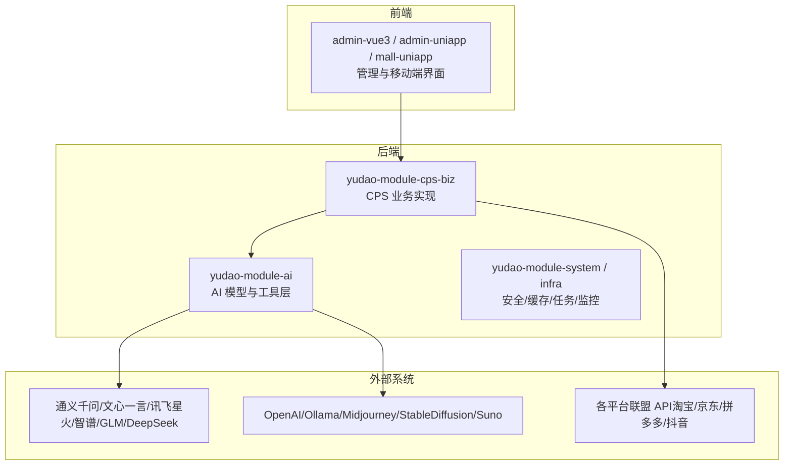
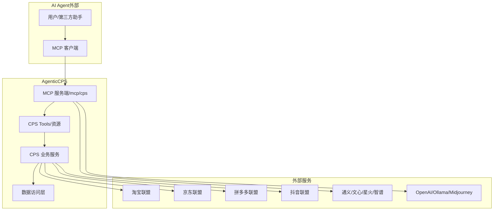
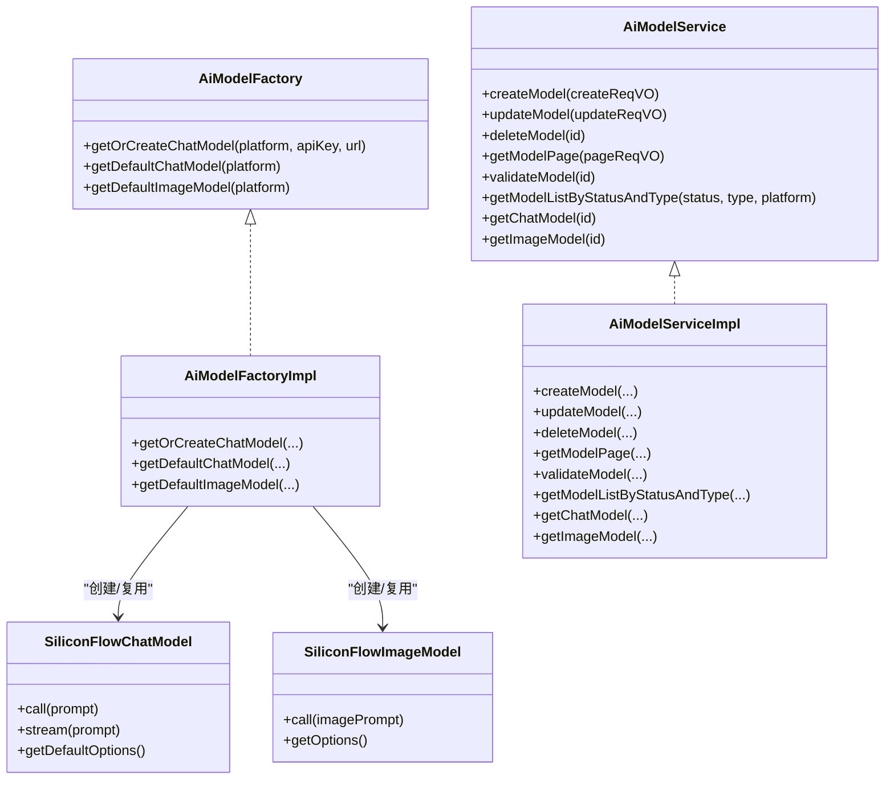
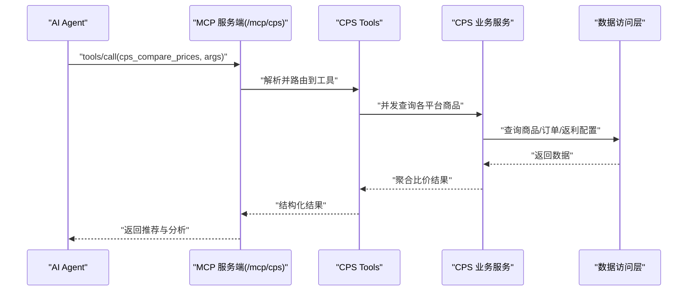
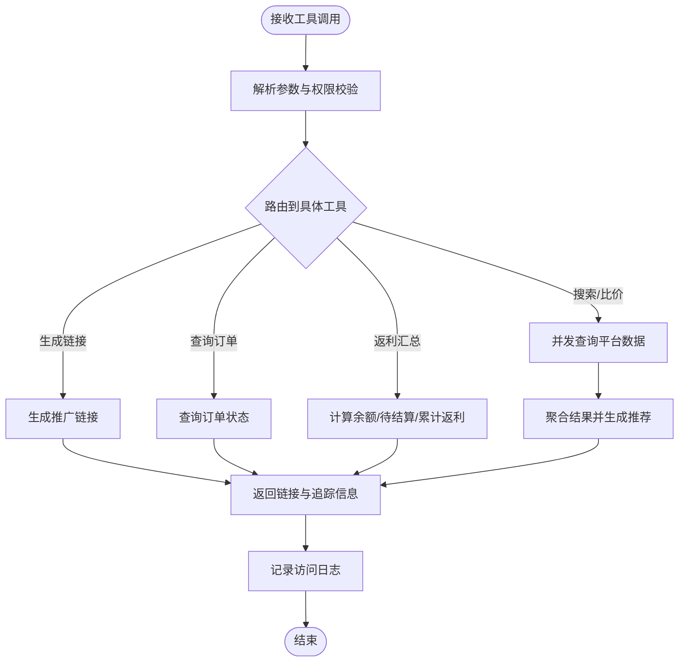
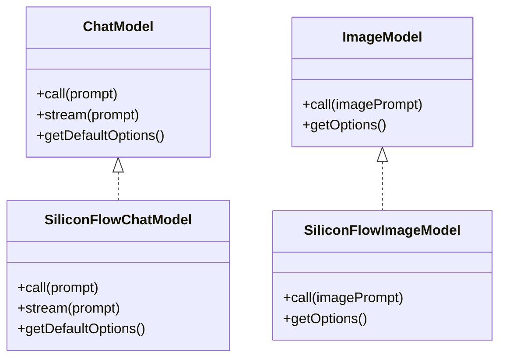
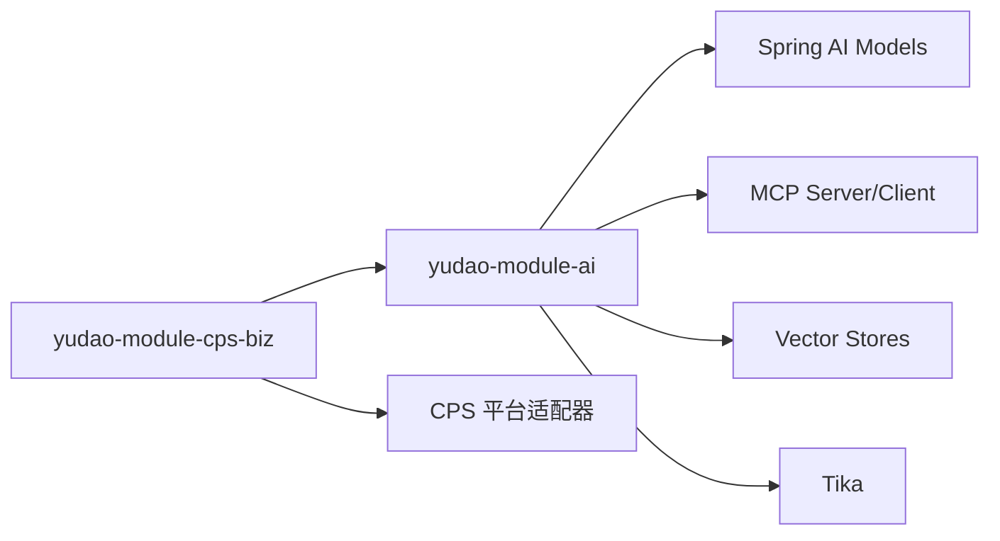

# AI Agent 功能

<cite>
**本文引用的文件**
- [AGENTS.md](file://AGENTS.md)
- [README.md](file://README.md)
- [pom.xml](file://backend/yudao-module-ai/pom.xml)
- [AiModelService.java](file://backend/yudao-module-ai/src/main/java/cn/iocoder/yudao/module/ai/service/model/AiModelService.java)
- [AiModelServiceImpl.java](file://backend/yudao-module-ai/src/main/java/cn/iocoder/yudao/module/ai/service/model/AiModelServiceImpl.java)
- [AiModelFactory.java](file://backend/yudao-module-ai/src/main/java/cn/iocoder/yudao/module/ai/framework/ai/core/model/AiModelFactory.java)
- [AiModelFactoryImpl.java](file://backend/yudao-module-ai/src/main/java/cn/iocoder/yudao/module/ai/framework/ai/core/model/AiModelFactoryImpl.java)
- [SiliconFlowChatModel.java](file://backend/yudao-module-ai/src/main/java/cn/iocoder/yudao/module/ai/framework/ai/core/model/siliconflow/SiliconFlowChatModel.java)
- [SiliconFlowImageModel.java](file://backend/yudao-module-ai/src/main/java/cn/iocoder/yudao/module/ai/framework/ai/core/model/siliconflow/SiliconFlowImageModel.java)
- [SiliconFlowImageModelTests.java](file://backend/yudao-module-ai/src/test/java/cn/iocoder/yudao/module/ai/framework/ai/core/model/image/SiliconFlowImageModelTests.java)
- [CpsMcpAccessLogDO.java](file://backend/yudao-module-cps/yudao-module-cps-biz/src/main/java/cn/iocoder/yudao/module/cps/dal/dataobject/mcp/CpsMcpAccessLogDO.java)
- [MEMORY.md](file://agent_improvement/memory/MEMORY.md)
- [codegen-rules.md](file://agent_improvement/memory/codegen-rules.md)
- [CPS系统PRD文档.md](file://docs/CPS系统PRD文档.md)
</cite>

## 目录
1. [简介](#简介)
2. [项目结构](#项目结构)
3. [核心组件](#核心组件)
4. [架构总览](#架构总览)
5. [详细组件分析](#详细组件分析)
6. [依赖关系分析](#依赖关系分析)
7. [性能考量](#性能考量)
8. [故障排查指南](#故障排查指南)
9. [结论](#结论)
10. [附录](#附录)

## 简介
本文件系统化阐述 AgenticCPS 中的 AI Agent 能力与架构，重点覆盖：
- AI Agent 的整体架构与模块划分
- 聊天机器人、文本写作、图像生成、音乐创作等 AI 服务能力的实现原理
- 与 CPS 业务系统的集成方式、数据流转与状态管理
- AI 模型选择策略、配置参数与性能调优
- 使用示例、错误处理与监控方案
- 在 CPS 系统中的具体应用场景与价值体现

## 项目结构
AgenticCPS 以“模块化 + MCP 协议”为核心，AI 能力通过 yudao-module-ai 模块接入 Spring AI 生态，并在 yudao-module-cps-biz 的 mcp 层提供对外工具与资源，实现“AI Agent 零代码接入”。

**章节来源**
- [AGENTS.md: 11-57:11-57](file://AGENTS.md#L11-L57)
- [README.md: 229-249:229-249](file://README.md#L229-L249)

## 核心组件
- AI 模型工厂与服务
  - 工厂负责按平台/密钥/地址创建或复用 ChatModel/ImageModel 等模型实例
  - 服务层提供模型的增删改查、分页、可用性校验与与 Spring AI 的集成方法
- MCP 接口层（CPS）
  - 提供 AI Tools（搜索、比价、生成链接、查询订单、返利汇总）与资源（如订单状态）
  - 访问日志记录工具调用、耗时、错误等，支撑可观测性
- 低代码与 AI 记忆
  - 通过 codegen-rules 与 MEMORY.md 管理 AI 编码与改进规则，支撑持续演进

**章节来源**
- [AiModelFactory.java:1-44](file://backend/yudao-module-ai/src/main/java/cn/iocoder/yudao/module/ai/framework/ai/core/model/AiModelFactory.java#L1-L44)
- [AiModelService.java:1-49](file://backend/yudao-module-ai/src/main/java/cn/iocoder/yudao/module/ai/service/model/AiModelService.java#L1-L49)
- [AiModelServiceImpl.java:103-140](file://backend/yudao-module-ai/src/main/java/cn/iocoder/yudao/module/ai/service/model/AiModelServiceImpl.java#L103-L140)
- [CpsMcpAccessLogDO.java:1-62](file://backend/yudao-module-cps/yudao-module-cps-biz/src/main/java/cn/iocoder/yudao/module/cps/dal/dataobject/mcp/CpsMcpAccessLogDO.java#L1-L62)
- [MEMORY.md:1-21](file://agent_improvement/memory/MEMORY.md#L1-L21)
- [codegen-rules.md:1-788](file://agent_improvement/memory/codegen-rules.md#L1-L788)

## 架构总览
AI Agent 在系统中的位置与交互如下：

**图示来源**
- [AGENTS.md: 161-169:161-169](file://AGENTS.md#L161-L169)
- [README.md: 185-209:185-209](file://README.md#L185-L209)

**章节来源**
- [AGENTS.md: 161-169:161-169](file://AGENTS.md#L161-L169)
- [README.md: 185-209:185-209](file://README.md#L185-L209)

## 详细组件分析

### AI 模型工厂与服务
- 工厂接口
  - 提供按平台/密钥/地址获取 ChatModel/ImageModel 的能力；支持默认配置与显式配置两种模式
- 工厂实现
  - 基于平台枚举与密钥配置，构造兼容 OpenAI 接口的 ChatModel（如硅基流动）
  - 提供 ImageModel 的实现（如硅基流动图像模型），复用 OpenAI 图像模型的实现思路
- 服务层
  - 提供模型的创建/更新/删除/分页/校验
  - 与 Spring AI 集成：按模型 ID 获取 ChatModel/ImageModel，内部校验密钥与平台合法性

**图示来源**
- [AiModelFactory.java:1-44](file://backend/yudao-module-ai/src/main/java/cn/iocoder/yudao/module/ai/framework/ai/core/model/AiModelFactory.java#L1-L44)
- [AiModelFactoryImpl.java:1-22](file://backend/yudao-module-ai/src/main/java/cn/iocoder/yudao/module/ai/framework/ai/core/model/AiModelFactoryImpl.java#L1-L22)
- [AiModelService.java:1-49](file://backend/yudao-module-ai/src/main/java/cn/iocoder/yudao/module/ai/service/model/AiModelService.java#L1-L49)
- [AiModelServiceImpl.java:103-140](file://backend/yudao-module-ai/src/main/java/cn/iocoder/yudao/module/ai/service/model/AiModelServiceImpl.java#L103-L140)
- [SiliconFlowChatModel.java:1-43](file://backend/yudao-module-ai/src/main/java/cn/iocoder/yudao/module/ai/framework/ai/core/model/siliconflow/SiliconFlowChatModel.java#L1-L43)
- [SiliconFlowImageModel.java:29-67](file://backend/yudao-module-ai/src/main/java/cn/iocoder/yudao/module/ai/framework/ai/core/model/siliconflow/SiliconFlowImageModel.java#L29-L67)

**章节来源**
- [AiModelFactory.java:1-44](file://backend/yudao-module-ai/src/main/java/cn/iocoder/yudao/module/ai/framework/ai/core/model/AiModelFactory.java#L1-L44)
- [AiModelFactoryImpl.java:1-22](file://backend/yudao-module-ai/src/main/java/cn/iocoder/yudao/module/ai/framework/ai/core/model/AiModelFactoryImpl.java#L1-L22)
- [AiModelService.java:1-49](file://backend/yudao-module-ai/src/main/java/cn/iocoder/yudao/module/ai/service/model/AiModelService.java#L1-L49)
- [AiModelServiceImpl.java:103-140](file://backend/yudao-module-ai/src/main/java/cn/iocoder/yudao/module/ai/service/model/AiModelServiceImpl.java#L103-L140)
- [SiliconFlowChatModel.java:1-43](file://backend/yudao-module-ai/src/main/java/cn/iocoder/yudao/module/ai/framework/ai/core/model/siliconflow/SiliconFlowChatModel.java#L1-L43)
- [SiliconFlowImageModel.java:29-67](file://backend/yudao-module-ai/src/main/java/cn/iocoder/yudao/module/ai/framework/ai/core/model/siliconflow/SiliconFlowImageModel.java#L29-L67)

### MCP 工具与资源（CPS）
- 工具（Tools）
  - cps_search_goods：在淘宝/京东/拼多多搜索商品
  - cps_compare_prices：跨平台比价
  - cps_generate_link：生成带返利追踪的推广链接
  - cps_query_orders：查询用户返利订单状态
  - cps_get_rebate_summary：查看余额、待结算、累计返利
- 资源（Resources）
  - 订单状态资源等只读数据源
- 访问日志
  - 记录 API Key、工具名、请求参数、响应摘要、状态、错误信息、耗时、客户端 IP 等

**图示来源**
- [README.md: 185-209:185-209](file://README.md#L185-L209)
- [CPS系统PRD文档.md: 662-677:662-677](file://docs/CPS系统PRD文档.md#L662-L677)
- [CpsMcpAccessLogDO.java:1-62](file://backend/yudao-module-cps/yudao-module-cps-biz/src/main/java/cn/iocoder/yudao/module/cps/dal/dataobject/mcp/CpsMcpAccessLogDO.java#L1-L62)

**章节来源**
- [README.md: 185-209:185-209](file://README.md#L185-L209)
- [CPS系统PRD文档.md: 662-677:662-677](file://docs/CPS系统PRD文档.md#L662-L677)
- [CpsMcpAccessLogDO.java:1-62](file://backend/yudao-module-cps/yudao-module-cps-biz/src/main/java/cn/iocoder/yudao/module/cps/dal/dataobject/mcp/CpsMcpAccessLogDO.java#L1-L62)

### AI Agent 工作流与状态管理
- 工具调用流程
  - Agent 发起工具调用 → MCP 服务端路由 → 业务服务执行 → 返回结构化结果
- 状态与日志
  - 访问日志包含状态、错误信息、耗时，用于监控与排障
- 配置与权限
  - 管理后台可配置 API Key 权限级别、限流规则与工具使用统计

**图示来源**
- [CPS系统PRD文档.md: 662-677:662-677](file://docs/CPS系统PRD文档.md#L662-L677)
- [CpsMcpAccessLogDO.java:1-62](file://backend/yudao-module-cps/yudao-module-cps-biz/src/main/java/cn/iocoder/yudao/module/cps/dal/dataobject/mcp/CpsMcpAccessLogDO.java#L1-L62)

**章节来源**
- [CPS系统PRD文档.md: 662-677:662-677](file://docs/CPS系统PRD文档.md#L662-L677)
- [CPS系统PRD文档.md: 678-693:678-693](file://docs/CPS系统PRD文档.md#L678-L693)
- [CpsMcpAccessLogDO.java:1-62](file://backend/yudao-module-cps/yudao-module-cps-biz/src/main/java/cn/iocoder/yudao/module/cps/dal/dataobject/mcp/CpsMcpAccessLogDO.java#L1-L62)

### AI 能力实现要点（聊天/图像/音乐）
- 聊天模型
  - 通过工厂创建兼容 OpenAI 接口的 ChatModel（如硅基流动），支持同步与流式调用
- 图像模型
  - 通过工厂创建兼容 OpenAI 图像接口的 ImageModel（如硅基流动），支持重试与观测
- 音乐创作
  - 项目已声明对 Suno 等音乐模型的依赖，结合业务工具可实现音乐创作能力

**图示来源**
- [SiliconFlowChatModel.java:1-43](file://backend/yudao-module-ai/src/main/java/cn/iocoder/yudao/module/ai/framework/ai/core/model/siliconflow/SiliconFlowChatModel.java#L1-L43)
- [SiliconFlowImageModel.java:29-67](file://backend/yudao-module-ai/src/main/java/cn/iocoder/yudao/module/ai/framework/ai/core/model/siliconflow/SiliconFlowImageModel.java#L29-L67)

**章节来源**
- [SiliconFlowChatModel.java:1-43](file://backend/yudao-module-ai/src/main/java/cn/iocoder/yudao/module/ai/framework/ai/core/model/siliconflow/SiliconFlowChatModel.java#L1-L43)
- [SiliconFlowImageModel.java:29-67](file://backend/yudao-module-ai/src/main/java/cn/iocoder/yudao/module/ai/framework/ai/core/model/siliconflow/SiliconFlowImageModel.java#L29-L67)
- [SiliconFlowImageModelTests.java:1-35](file://backend/yudao-module-ai/src/test/java/cn/iocoder/yudao/module/ai/framework/ai/core/model/image/SiliconFlowImageModelTests.java#L1-L35)

## 依赖关系分析
- 模块依赖
  - yudao-module-ai 依赖 yudao-module-system 与 yudao-module-infra，提供安全、缓存、任务、Excel、Redis 等基础设施
  - yudao-module-cps-biz 依赖 yudao-module-ai 以使用模型与向量存储等能力
- 外部依赖
  - Spring AI Starter（OpenAI/Azure/OpenAI Anthropic/DeepSeek/Ollama/Stability AI/ZhiPu/GLM/Minimax）
  - MCP 服务端/客户端（Spring AI Starter MCP）
  - 向量存储（Qdrant/Redis/Milvus）
  - 内容解析（Tika）

**图示来源**
- [pom.xml:28-261](file://backend/yudao-module-ai/pom.xml#L28-L261)

**章节来源**
- [pom.xml:28-261](file://backend/yudao-module-ai/pom.xml#L28-L261)

## 性能考量
- 搜索与比价
  - 搜索类工具 P99 < 3 秒，查询类工具 P99 < 1 秒
  - 比价并发查询多平台商品，计算实付价格（券后价 - 预估返利）
- 订单同步与入账
  - 订单同步延迟 < 30 分钟，返利入账平台结算后 24 小时内
- MCP 工具调用
  - 搜索类 < 3 秒，查询类 < 1 秒
- 模型调用
  - 通过工厂复用模型实例，减少初始化开销；图像模型支持重试与观测

**章节来源**
- [README.md: 332-341:332-341](file://README.md#L332-L341)
- [CPS系统PRD文档.md: 662-677:662-677](file://docs/CPS系统PRD文档.md#L662-L677)

## 故障排查指南
- 访问日志定位
  - 通过 MCP 访问日志表字段（API Key、工具名、请求参数、响应摘要、状态、错误信息、耗时、客户端 IP）快速定位问题
- 模型可用性检查
  - 服务层提供 validateModel 校验模型状态；若禁用则抛出异常
- 图像模型测试
  - 提供集成测试样例，可参考 SiliconFlowImageModelTests 进行本地验证

**章节来源**
- [CpsMcpAccessLogDO.java:1-62](file://backend/yudao-module-cps/yudao-module-cps-biz/src/main/java/cn/iocoder/yudao/module/cps/dal/dataobject/mcp/CpsMcpAccessLogDO.java#L1-L62)
- [AiModelServiceImpl.java:112-119](file://backend/yudao-module-ai/src/main/java/cn/iocoder/yudao/module/ai/service/model/AiModelServiceImpl.java#L112-L119)
- [SiliconFlowImageModelTests.java:1-35](file://backend/yudao-module-ai/src/test/java/cn/iocoder/yudao/module/ai/framework/ai/core/model/image/SiliconFlowImageModelTests.java#L1-L35)

## 结论
AgenticCPS 通过“模块化 + MCP 协议 + Spring AI”的组合，实现了 AI Agent 与 CPS 业务的无缝集成。AI 模型工厂与服务提供了灵活的模型接入与复用能力，MCP 工具与资源为外部 Agent 提供开箱即用的能力，配合完善的访问日志与性能指标，确保系统在高并发场景下的稳定性与可观测性。该架构在 CPS 场景中具备极高的扩展性与价值，能够支撑从聊天导购到多平台比价、从链接生成到订单追踪的全链路智能化。

## 附录
- AI 模型选择策略
  - 按平台与地域选择：国内优先通义/文心/星火/智谱/GLM，海外优先 OpenAI/Ollama
  - 按任务类型选择：对话/推理用 ChatModel，图像/音乐用 ImageModel/MusicModel
- 配置参数
  - API Key、URL、模型名称、温度、最大生成长度等通过服务层与工厂注入
- 监控与日志
  - MCP 访问日志记录工具调用、耗时与错误，结合管理后台 API Key 限流与权限控制

**章节来源**
- [AiModelService.java:1-49](file://backend/yudao-module-ai/src/main/java/cn/iocoder/yudao/module/ai/service/model/AiModelService.java#L1-L49)
- [AiModelServiceImpl.java:126-140](file://backend/yudao-module-ai/src/main/java/cn/iocoder/yudao/module/ai/service/model/AiModelServiceImpl.java#L126-L140)
- [CpsMcpAccessLogDO.java:1-62](file://backend/yudao-module-cps/yudao-module-cps-biz/src/main/java/cn/iocoder/yudao/module/cps/dal/dataobject/mcp/CpsMcpAccessLogDO.java#L1-L62)
- [README.md: 185-209:185-209](file://README.md#L185-L209)