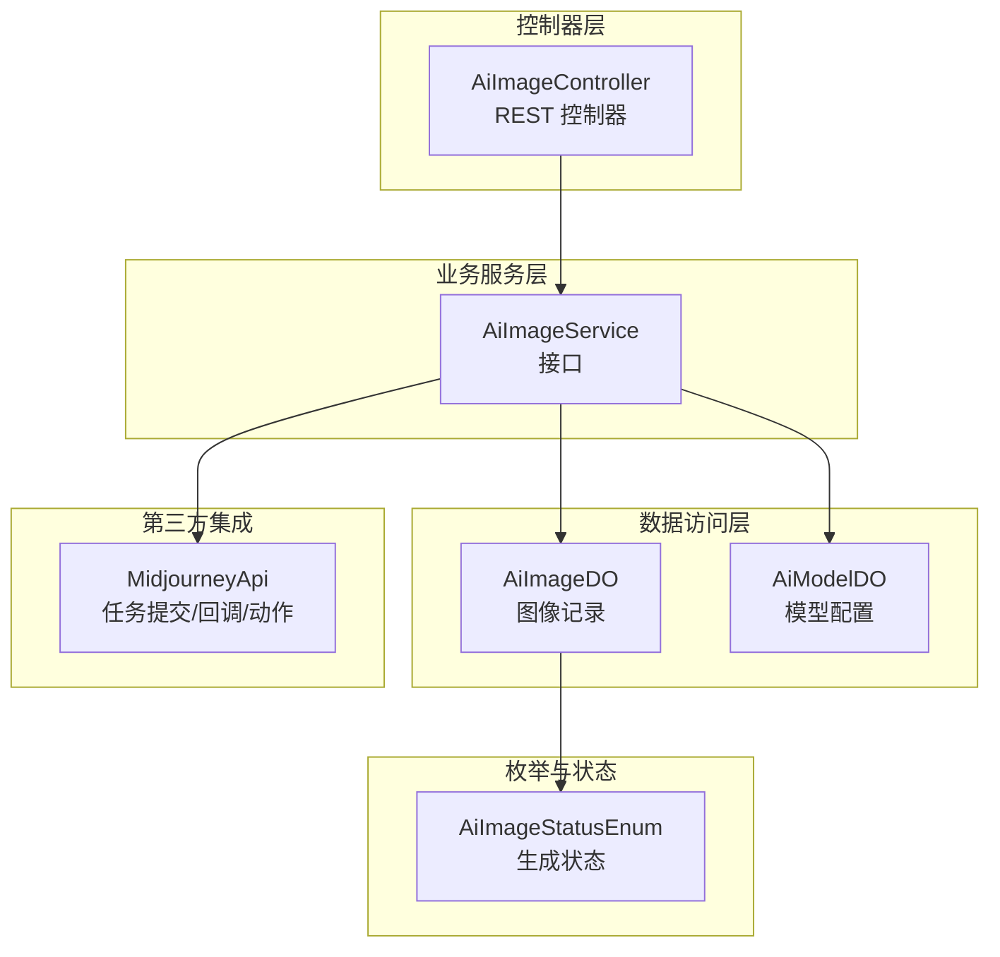
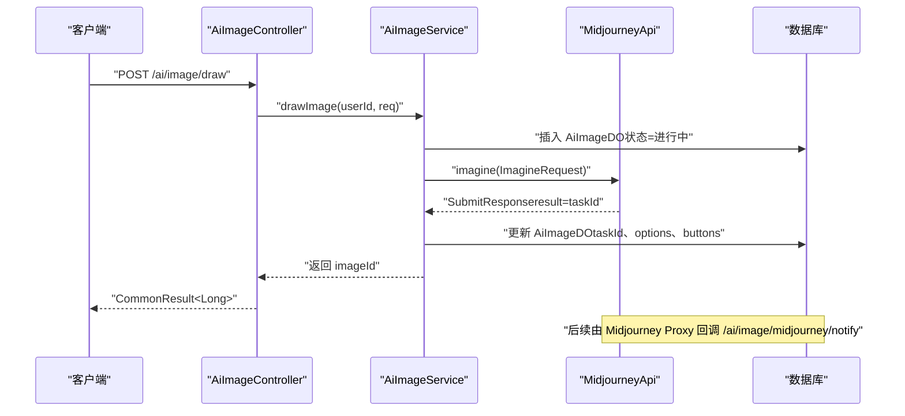
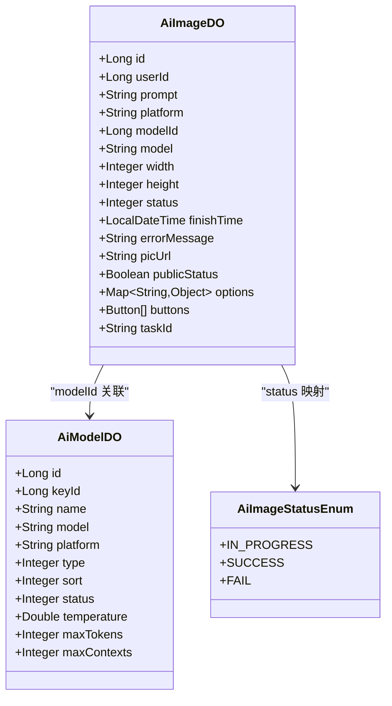
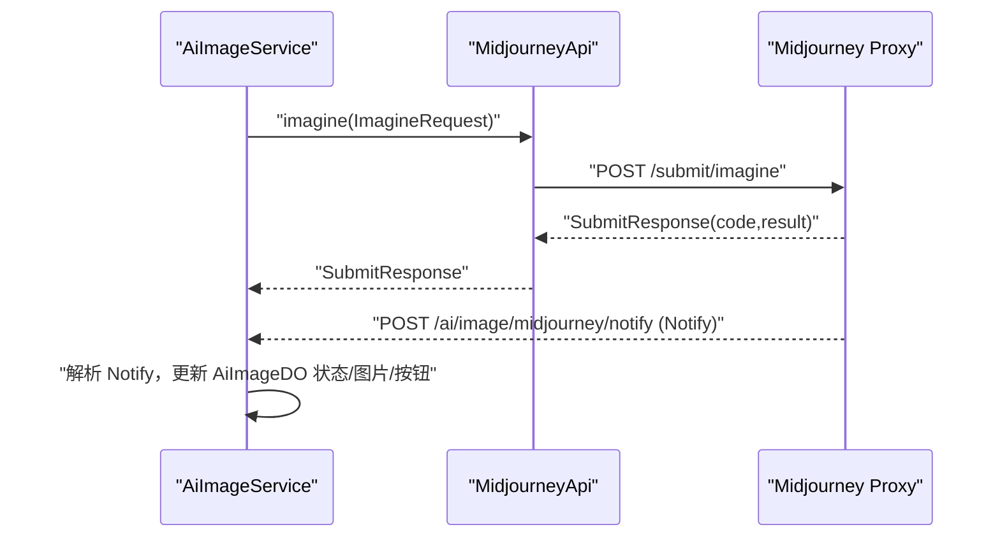
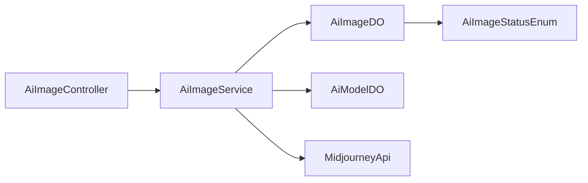

# AI 图像生成服务

<cite>
**本文引用的文件**
- [AiImageController.java](file://backend/yudao-module-ai/src/main/java/cn/iocoder/yudao/module/ai/controller/admin/image/AiImageController.java)
- [AiImageService.java](file://backend/yudao-module-ai/src/main/java/cn/iocoder/yudao/module/ai/service/image/AiImageService.java)
- [AiImageDO.java](file://backend/yudao-module-ai/src/main/java/cn/iocoder/yudao/module/ai/dal/dataobject/image/AiImageDO.java)
- [AiModelDO.java](file://backend/yudao-module-ai/src/main/java/cn/iocoder/yudao/module/ai/dal/dataobject/model/AiModelDO.java)
- [AiImageStatusEnum.java](file://backend/yudao-module-ai/src/main/java/cn/iocoder/yudao/module/ai/enums/image/AiImageStatusEnum.java)
- [MidjourneyApi.java](file://backend/yudao-module-ai/src/main/java/cn/iocoder/yudao/module/ai/framework/ai/core/model/midjourney/api/MidjourneyApi.java)
</cite>

## 目录
1. [简介](#简介)
2. [项目结构](#项目结构)
3. [核心组件](#核心组件)
4. [架构总览](#架构总览)
5. [组件详解](#组件详解)
6. [依赖关系分析](#依赖关系分析)
7. [性能与优化](#性能与优化)
8. [故障排查指南](#故障排查指南)
9. [结论](#结论)
10. [附录](#附录)

## 简介
本文件面向“AI 图像生成服务”的使用者与维护者，系统化阐述该服务的技术原理、支持的模型与风格配置、参数与尺寸规格、质量控制机制、存储与缓存策略、性能优化方案、接口使用示例与批量/异步任务管理方法，并给出在商品图片、营销素材、视觉设计等场景的应用建议，以及版权管理、内容安全审核与合规保障的实现思路。

## 项目结构
AI 图像生成服务位于后端模块 yudao-module-ai 中，采用典型的分层架构：
- 控制器层：对外暴露 REST API，负责鉴权、参数校验与结果封装
- 业务服务层：编排生成流程、对接第三方平台（如 Midjourney Proxy）
- 数据对象层：持久化图像生成记录、模型配置与状态
- 枚举与工具：统一状态、平台、模型类型等常量与约定
- 第三方集成：Midjourney API 封装，支持任务提交、回调与动作操作

图表来源
- [AiImageController.java:34-139](file://backend/yudao-module-ai/src/main/java/cn/iocoder/yudao/module/ai/controller/admin/image/AiImageController.java#L34-L139)
- [AiImageService.java:18-126](file://backend/yudao-module-ai/src/main/java/cn/iocoder/yudao/module/ai/service/image/AiImageService.java#L18-L126)
- [AiImageDO.java:30-126](file://backend/yudao-module-ai/src/main/java/cn/iocoder/yudao/module/ai/dal/dataobject/image/AiImageDO.java#L30-L126)
- [AiModelDO.java:26-88](file://backend/yudao-module-ai/src/main/java/cn/iocoder/yudao/module/ai/dal/dataobject/model/AiModelDO.java#L26-L88)
- [AiImageStatusEnum.java:13-37](file://backend/yudao-module-ai/src/main/java/cn/iocoder/yudao/module/ai/enums/image/AiImageStatusEnum.java#L13-L37)
- [MidjourneyApi.java:31-351](file://backend/yudao-module-ai/src/main/java/cn/iocoder/yudao/module/ai/framework/ai/core/model/midjourney/api/MidjourneyApi.java#L31-L351)

章节来源
- [AiImageController.java:34-139](file://backend/yudao-module-ai/src/main/java/cn/iocoder/yudao/module/ai/controller/admin/image/AiImageController.java#L34-L139)
- [AiImageService.java:18-126](file://backend/yudao-module-ai/src/main/java/cn/iocoder/yudao/module/ai/service/image/AiImageService.java#L18-L126)
- [AiImageDO.java:30-126](file://backend/yudao-module-ai/src/main/java/cn/iocoder/yudao/module/ai/dal/dataobject/image/AiImageDO.java#L30-L126)
- [AiModelDO.java:26-88](file://backend/yudao-module-ai/src/main/java/cn/iocoder/yudao/module/ai/dal/dataobject/model/AiModelDO.java#L26-L88)
- [AiImageStatusEnum.java:13-37](file://backend/yudao-module-ai/src/main/java/cn/iocoder/yudao/module/ai/enums/image/AiImageStatusEnum.java#L13-L37)
- [MidjourneyApi.java:31-351](file://backend/yudao-module-ai/src/main/java/cn/iocoder/yudao/module/ai/framework/ai/core/model/midjourney/api/MidjourneyApi.java#L31-L351)

## 核心组件
- 控制器：提供“我的/公开分页、详情、批量查询、生成、删除”等接口；同时提供 Midjourney 专属接口（生成、回调、动作）
- 服务接口：定义生成、分页、更新、删除、Midjourney 任务提交/同步/回调/动作等能力
- 数据对象：AiImageDO 记录用户、提示词、平台/模型、尺寸、状态、错误信息、图片地址、公开状态、参数、按钮、任务 ID 等；AiModelDO 记录模型名称、标识、平台、类型、排序、状态及对话参数
- 枚举：AiImageStatusEnum 统一生成状态（进行中/已完成/已失败）

章节来源
- [AiImageController.java:34-139](file://backend/yudao-module-ai/src/main/java/cn/iocoder/yudao/module/ai/controller/admin/image/AiImageController.java#L34-L139)
- [AiImageService.java:18-126](file://backend/yudao-module-ai/src/main/java/cn/iocoder/yudao/module/ai/service/image/AiImageService.java#L18-L126)
- [AiImageDO.java:30-126](file://backend/yudao-module-ai/src/main/java/cn/iocoder/yudao/module/ai/dal/dataobject/image/AiImageDO.java#L30-L126)
- [AiModelDO.java:26-88](file://backend/yudao-module-ai/src/main/java/cn/iocoder/yudao/module/ai/dal/dataobject/model/AiModelDO.java#L26-L88)
- [AiImageStatusEnum.java:13-37](file://backend/yudao-module-ai/src/main/java/cn/iocoder/yudao/module/ai/enums/image/AiImageStatusEnum.java#L13-L37)

## 架构总览
服务通过控制器接收请求，调用服务层编排逻辑，持久化生成记录，必要时调用 Midjourney API 提交任务并处理回调，最终返回结果。整体遵循“接口-服务-数据-第三方”的分层解耦。

图表来源
- [AiImageController.java:74-103](file://backend/yudao-module-ai/src/main/java/cn/iocoder/yudao/module/ai/controller/admin/image/AiImageController.java#L74-L103)
- [AiImageService.java:60-124](file://backend/yudao-module-ai/src/main/java/cn/iocoder/yudao/module/ai/service/image/AiImageService.java#L60-L124)
- [MidjourneyApi.java:67-87](file://backend/yudao-module-ai/src/main/java/cn/iocoder/yudao/module/ai/framework/ai/core/model/midjourney/api/MidjourneyApi.java#L67-L87)
- [AiImageDO.java:110-124](file://backend/yudao-module-ai/src/main/java/cn/iocoder/yudao/module/ai/dal/dataobject/image/AiImageDO.java#L110-L124)

## 组件详解

### 控制器：AiImageController
- 主要职责
  - 提供“我的/公开分页、详情、批量查询、生成、删除”等接口
  - 提供 Midjourney 专属接口：生成、回调、动作
  - 进行参数校验与权限控制
- 关键接口
  - GET /ai/image/my-page：获取“我的”绘图分页
  - GET /ai/image/public-page：获取公开绘图分页
  - GET /ai/image/get-my：按 id 获取“我的”绘图记录
  - GET /ai/image/my-list-by-ids：按 id 列表获取“我的”绘图列表
  - POST /ai/image/draw：生成图片
  - DELETE /ai/image/delete-my：删除“我的”绘图记录
  - POST /ai/image/midjourney/imagine：Midjourney 生成
  - POST /ai/image/midjourney/notify：Midjourney 回调
  - POST /ai/image/midjourney/action：Midjourney 动作（放大/变体/重试等）
  - GET /ai/image/page、PUT /ai/image/update、DELETE /ai/image/delete：管理员管理接口

章节来源
- [AiImageController.java:34-139](file://backend/yudao-module-ai/src/main/java/cn/iocoder/yudao/module/ai/controller/admin/image/AiImageController.java#L34-L139)

### 服务接口：AiImageService
- 主要职责
  - 定义生成、分页、更新、删除、Midjourney 任务提交/同步/回调/动作等抽象能力
- 关键方法
  - drawImage：生成图片
  - midjourneyImagine、midjourneyNotify、midjourneyAction：Midjourney 相关
  - 分页与管理：getImagePageMy、getImagePagePublic、getImage、getImageList、getImagePage、updateImage、deleteImage、deleteImageMy

章节来源
- [AiImageService.java:18-126](file://backend/yudao-module-ai/src/main/java/cn/iocoder/yudao/module/ai/service/image/AiImageService.java#L18-L126)

### 数据模型：AiImageDO 与 AiModelDO
- AiImageDO 字段要点
  - 用户、提示词、平台、模型、尺寸(width/height)、状态、完成时间、错误信息、图片地址、公开状态、绘制参数(options)、按钮(buttons)、任务 ID(taskId)
  - options 支持不同平台的参数结构（如 OpenAI、StabilityAI 的图像选项）
- AiModelDO 字段要点
  - 名称、模型标识(model)、平台(platform)、类型(type)、排序(sort)、状态(status)
  - 对话参数：temperature、maxTokens、maxContexts（虽为对话参数，但作为模型配置的一部分）

图表来源
- [AiImageDO.java:30-126](file://backend/yudao-module-ai/src/main/java/cn/iocoder/yudao/module/ai/dal/dataobject/image/AiImageDO.java#L30-L126)
- [AiModelDO.java:26-88](file://backend/yudao-module-ai/src/main/java/cn/iocoder/yudao/module/ai/dal/dataobject/model/AiModelDO.java#L26-L88)
- [AiImageStatusEnum.java:13-37](file://backend/yudao-module-ai/src/main/java/cn/iocoder/yudao/module/ai/enums/image/AiImageStatusEnum.java#L13-L37)

章节来源
- [AiImageDO.java:30-126](file://backend/yudao-module-ai/src/main/java/cn/iocoder/yudao/module/ai/dal/dataobject/image/AiImageDO.java#L30-L126)
- [AiModelDO.java:26-88](file://backend/yudao-module-ai/src/main/java/cn/iocoder/yudao/module/ai/dal/dataobject/model/AiModelDO.java#L26-L88)
- [AiImageStatusEnum.java:13-37](file://backend/yudao-module-ai/src/main/java/cn/iocoder/yudao/module/ai/enums/image/AiImageStatusEnum.java#L13-L37)

### Midjourney 集成：MidjourneyApi
- 能力范围
  - 提交生成任务（imagine）
  - 提交动作任务（action：放大、变体、重试等）
  - 批量查询任务（task list）
  - 回调通知（Notify）结构定义
- 关键结构
  - ImagineRequest：支持 base64Array、prompt、notifyHook、state
  - ActionRequest：customId、taskId、notifyHook
  - SubmitResponse：code、description、properties、result
  - Notify：id、action、status、prompt/promptEn、description、state、submitTime/startTime/finishTime、imageUrl、progress、failReason、buttons
  - ModelEnum：模型标识（midjourney、niji）
  - TaskActionEnum：任务动作（IMAGINE、UPSCALE、VARIATION、REROLL、DESCRIBE、BLEND）
  - TaskStatusEnum：任务状态（NOT_START、SUBMITTED、IN_PROGRESS、FAILURE、SUCCESS）

图表来源
- [MidjourneyApi.java:67-108](file://backend/yudao-module-ai/src/main/java/cn/iocoder/yudao/module/ai/framework/ai/core/model/midjourney/api/MidjourneyApi.java#L67-L108)
- [AiImageController.java:96-103](file://backend/yudao-module-ai/src/main/java/cn/iocoder/yudao/module/ai/controller/admin/image/AiImageController.java#L96-L103)

章节来源
- [MidjourneyApi.java:31-351](file://backend/yudao-module-ai/src/main/java/cn/iocoder/yudao/module/ai/framework/ai/core/model/midjourney/api/MidjourneyApi.java#L31-L351)
- [AiImageController.java:88-110](file://backend/yudao-module-ai/src/main/java/cn/iocoder/yudao/module/ai/controller/admin/image/AiImageController.java#L88-L110)

### 技术原理与参数配置
- 技术原理
  - 通过控制器接收请求，服务层根据平台与模型选择合适的参数，调用第三方 API 提交任务，异步等待回调更新状态
- 支持的模型与风格
  - 平台与模型：AiModelDO 记录 platform 与 model；MidjourneyApi.ModelEnum 提供 midjourney/niji
  - 风格参数：通过 options 或 state 传递（如尺寸宽高比、版本号等），MidjourneyApi 提供构建 state 的工具方法
- 参数设置
  - 提示词(prompt)、尺寸(width/height)、平台(platform)、模型(modelId/model)、公开(publicStatus)、绘制参数(options)
- 尺寸规格与质量控制
  - 宽高由 AiImageDO.width/height 管理；MidjourneyApi 的 state 构建包含宽高比参数
  - 生成状态由 AiImageStatusEnum 统一管理（进行中/已完成/已失败）
- 存储与持久化
  - 使用 MyBatis Plus 注解映射数据库表，AiImageDO.options 与 AiImageDO.buttons 使用 JSON 序列化存储复杂结构

章节来源
- [AiImageDO.java:110-124](file://backend/yudao-module-ai/src/main/java/cn/iocoder/yudao/module/ai/dal/dataobject/image/AiImageDO.java#L110-L124)
- [AiModelDO.java:48-68](file://backend/yudao-module-ai/src/main/java/cn/iocoder/yudao/module/ai/dal/dataobject/model/AiModelDO.java#L48-L68)
- [MidjourneyApi.java:142-153](file://backend/yudao-module-ai/src/main/java/cn/iocoder/yudao/module/ai/framework/ai/core/model/midjourney/api/MidjourneyApi.java#L142-L153)
- [AiImageStatusEnum.java:13-37](file://backend/yudao-module-ai/src/main/java/cn/iocoder/yudao/module/ai/enums/image/AiImageStatusEnum.java#L13-L37)

### 接口使用示例与批量/异步管理
- 生成图片
  - 调用 POST /ai/image/draw，返回 imageId；随后可通过轮询或回调获取结果
- 批量处理
  - 可结合“我的列表按 id 查询”接口批量获取结果
- 异步任务管理
  - Midjourney 回调 /ai/image/midjourney/notify 由第三方代理触发，服务端据此更新状态与图片链接
  - 也可通过 MidjourneyApi.getTaskList 批量查询任务状态

章节来源
- [AiImageController.java:74-103](file://backend/yudao-module-ai/src/main/java/cn/iocoder/yudao/module/ai/controller/admin/image/AiImageController.java#L74-L103)
- [MidjourneyApi.java:95-98](file://backend/yudao-module-ai/src/main/java/cn/iocoder/yudao/module/ai/framework/ai/core/model/midjourney/api/MidjourneyApi.java#L95-L98)

### 场景应用
- 商品图片：通过提示词与尺寸参数生成符合规格的商品主图或场景图
- 营销素材：快速产出主题风格一致的海报、Banner 等
- 视觉设计：利用 Midjourney 的变体与放大功能进行二次创作与细节优化

（本节为概念性说明，无需代码来源）

## 依赖关系分析
- 控制器依赖服务接口，服务接口依赖数据对象与第三方 MidjourneyApi
- AiImageDO 与 AiModelDO 通过外键/冗余字段关联，统一状态由 AiImageStatusEnum 管理
- MidjourneyApi 以 WebClient 方式调用第三方代理，回调通过控制器入口进入服务层

图表来源
- [AiImageController.java:34-139](file://backend/yudao-module-ai/src/main/java/cn/iocoder/yudao/module/ai/controller/admin/image/AiImageController.java#L34-L139)
- [AiImageService.java:18-126](file://backend/yudao-module-ai/src/main/java/cn/iocoder/yudao/module/ai/service/image/AiImageService.java#L18-L126)
- [AiImageDO.java:30-126](file://backend/yudao-module-ai/src/main/java/cn/iocoder/yudao/module/ai/dal/dataobject/image/AiImageDO.java#L30-L126)
- [AiModelDO.java:26-88](file://backend/yudao-module-ai/src/main/java/cn/iocoder/yudao/module/ai/dal/dataobject/model/AiModelDO.java#L26-L88)
- [AiImageStatusEnum.java:13-37](file://backend/yudao-module-ai/src/main/java/cn/iocoder/yudao/module/ai/enums/image/AiImageStatusEnum.java#L13-L37)
- [MidjourneyApi.java:31-351](file://backend/yudao-module-ai/src/main/java/cn/iocoder/yudao/module/ai/framework/ai/core/model/midjourney/api/MidjourneyApi.java#L31-L351)

## 性能与优化
- 异步回调驱动状态更新，避免阻塞式轮询
- 使用分页接口与批量 id 查询减少网络开销
- 通过 options/buttons 等 JSON 字段承载复杂参数，降低额外查询次数
- 建议对回调接口进行幂等处理与去重（如基于 taskId 去重）
- 对高频任务可考虑本地缓存最近任务状态，结合定时同步

（本节为通用性能建议，无需代码来源）

## 故障排查指南
- 生成失败
  - 检查 AiImageDO.errorMessage 与 AiImageStatusEnum.FAIL
  - 核对提示词、尺寸、平台/模型配置是否正确
- Midjourney 回调未生效
  - 确认回调地址可达且未被拦截
  - 核对 AiImageDO.taskId 与回调中的 id 是否一致
- 任务状态异常
  - 使用 MidjourneyApi.getTaskList 批量查询任务状态，核对 TaskStatusEnum

章节来源
- [AiImageDO.java:92-93](file://backend/yudao-module-ai/src/main/java/cn/iocoder/yudao/module/ai/dal/dataobject/image/AiImageDO.java#L92-L93)
- [AiImageStatusEnum.java:13-37](file://backend/yudao-module-ai/src/main/java/cn/iocoder/yudao/module/ai/enums/image/AiImageStatusEnum.java#L13-L37)
- [MidjourneyApi.java:95-98](file://backend/yudao-module-ai/src/main/java/cn/iocoder/yudao/module/ai/framework/ai/core/model/midjourney/api/MidjourneyApi.java#L95-L98)

## 结论
该服务以清晰的分层架构实现了从提示词到图像的生成闭环，支持 Midjourney 等平台的任务提交与回调，具备良好的扩展性与可维护性。通过统一的状态枚举、JSON 参数存储与异步回调机制，能够满足商品图片、营销素材与视觉设计等多场景需求。建议在生产环境中完善幂等与重试、监控与告警、内容安全与版权合规等机制。

## 附录
- 版权管理与内容安全审核
  - 建议在生成前对提示词进行关键词过滤与敏感内容检测
  - 对生成结果进行水印或元数据标记，便于溯源与版权保护
  - 建立人工复核与自动审核相结合的内容安全体系
- 合规性保障
  - 明确使用条款与免责声明
  - 对特定场景（如商标、肖像）设定限制与白名单
  - 定期审计日志与生成记录，确保可追溯

（本节为通用实践建议，无需代码来源）