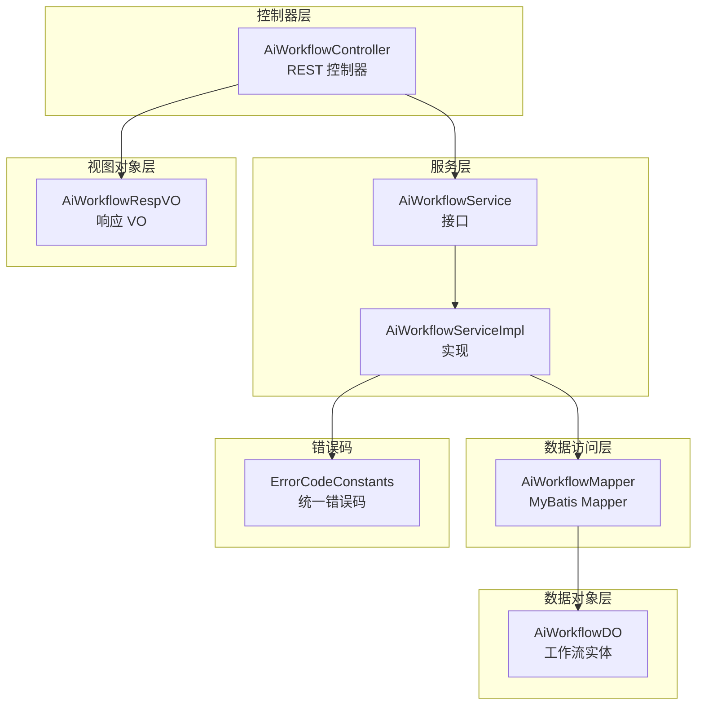
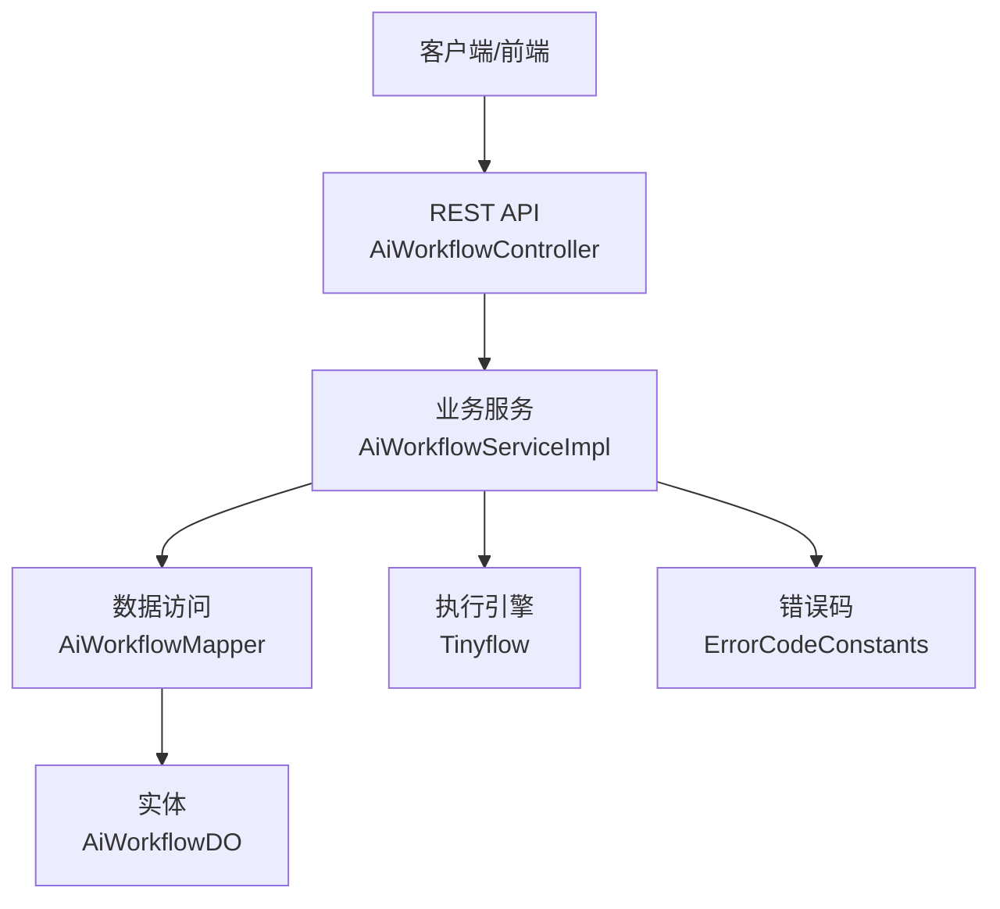
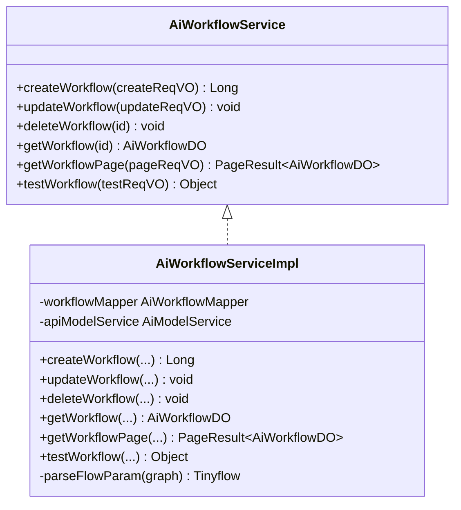
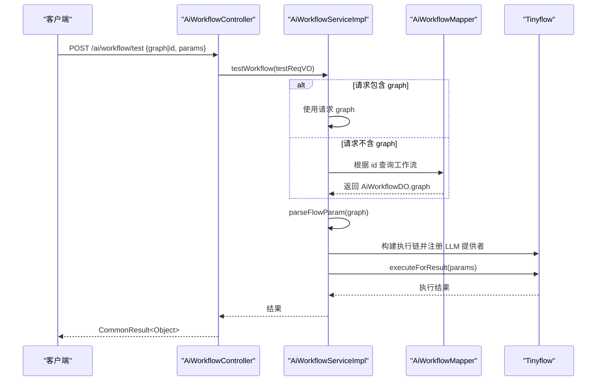
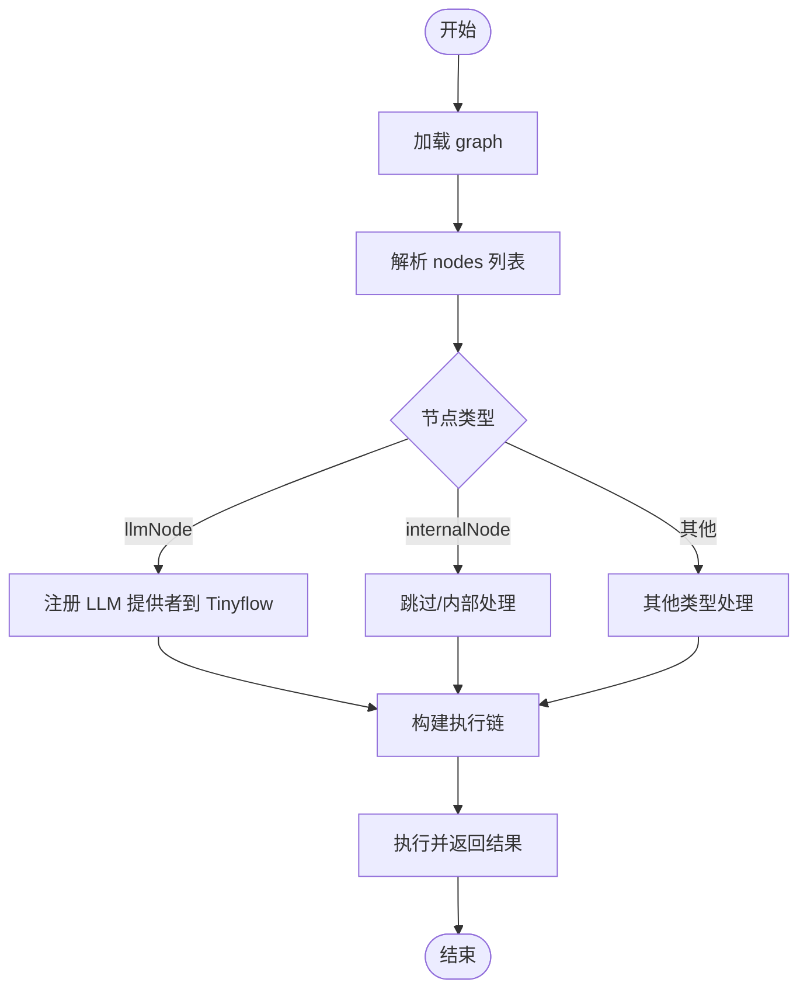
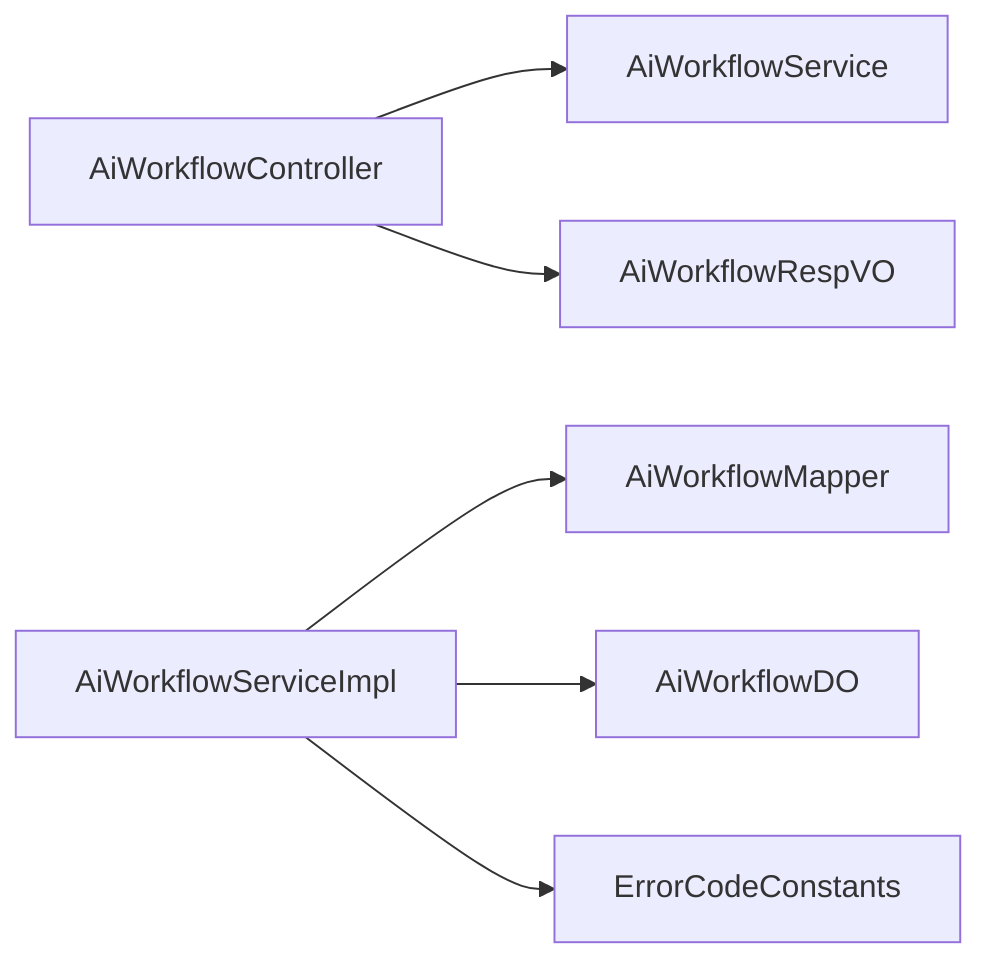

# AI 工作流编排服务

<cite>
**本文引用的文件**
- [AiWorkflowService.java](file://backend/yudao-module-ai/src/main/java/cn/iocoder/yudao/module/ai/service/workflow/AiWorkflowService.java)
- [AiWorkflowServiceImpl.java](file://backend/yudao-module-ai/src/main/java/cn/iocoder/yudao/module/ai/service/workflow/AiWorkflowServiceImpl.java)
- [AiWorkflowController.java](file://backend/yudao-module-ai/src/main/java/cn/iocoder/yudao/module/ai/controller/admin/workflow/AiWorkflowController.java)
- [AiWorkflowDO.java](file://backend/yudao-module-ai/src/main/java/cn/iocoder/yudao/module/ai/dal/dataobject/workflow/AiWorkflowDO.java)
- [AiWorkflowMapper.java](file://backend/yudao-module-ai/src/main/java/cn/iocoder/yudao/module/ai/dal/mysql/workflow/AiWorkflowMapper.java)
- [AiWorkflowRespVO.java](file://backend/yudao-module-ai/src/main/java/cn/iocoder/yudao/module/ai/controller/admin/workflow/vo/AiWorkflowRespVO.java)
- [ErrorCodeConstants.java](file://backend/yudao-module-ai/src/main/java/cn/iocoder/yudao/module/ai/enums/ErrorCodeConstants.java)
</cite>

## 目录
1. [简介](#简介)
2. [项目结构](#项目结构)
3. [核心组件](#核心组件)
4. [架构总览](#架构总览)
5. [组件详细分析](#组件详细分析)
6. [依赖关系分析](#依赖关系分析)
7. [性能与并发特性](#性能与并发特性)
8. [故障排查指南](#故障排查指南)
9. [结论](#结论)
10. [附录](#附录)

## 简介
本文件面向“AI 工作流编排服务”，系统性梳理其设计架构、节点编排与执行引擎实现，文档化可视化编辑、节点配置与依赖关系管理方式；解释调度机制、状态跟踪与异常处理策略；给出接口使用示例、并行执行与结果聚合方案；并提供监控、性能分析与优化建议，以及在复杂业务场景自动化与多步骤任务协调中的应用价值。

## 项目结构
AI 工作流编排服务位于后端模块 yudao-module-ai 中，采用典型的分层架构：
- 控制器层：对外暴露 REST API，负责请求参数接收与响应封装
- 服务层：业务逻辑编排，包含工作流的创建、更新、删除、查询、测试等
- 数据访问层：基于 MyBatis 的 Mapper，提供持久化能力
- 数据对象层：DO 封装实体字段，含工作流标识、名称、状态与模型 JSON
- 视图对象层：VO 用于控制器返回给前端的数据结构
- 错误码常量：统一错误码定义，便于异常处理与国际化提示

图表来源
- [AiWorkflowController.java:20-77](file://backend/yudao-module-ai/src/main/java/cn/iocoder/yudao/module/ai/controller/admin/workflow/AiWorkflowController.java#L20-L77)
- [AiWorkflowService.java:10-62](file://backend/yudao-module-ai/src/main/java/cn/iocoder/yudao/module/ai/service/workflow/AiWorkflowService.java#L10-L62)
- [AiWorkflowServiceImpl.java:31-144](file://backend/yudao-module-ai/src/main/java/cn/iocoder/yudao/module/ai/service/workflow/AiWorkflowServiceImpl.java#L31-L144)
- [AiWorkflowMapper.java:10-30](file://backend/yudao-module-ai/src/main/java/cn/iocoder/yudao/module/ai/dal/mysql/workflow/AiWorkflowMapper.java#L10-L30)
- [AiWorkflowDO.java:10-51](file://backend/yudao-module-ai/src/main/java/cn/iocoder/yudao/module/ai/dal/dataobject/workflow/AiWorkflowDO.java#L10-L51)
- [AiWorkflowRespVO.java:8-33](file://backend/yudao-module-ai/src/main/java/cn/iocoder/yudao/module/ai/controller/admin/workflow/vo/AiWorkflowRespVO.java#L8-L33)
- [ErrorCodeConstants.java:10-68](file://backend/yudao-module-ai/src/main/java/cn/iocoder/yudao/module/ai/enums/ErrorCodeConstants.java#L10-L68)

章节来源
- [AiWorkflowController.java:20-77](file://backend/yudao-module-ai/src/main/java/cn/iocoder/yudao/module/ai/controller/admin/workflow/AiWorkflowController.java#L20-L77)
- [AiWorkflowService.java:10-62](file://backend/yudao-module-ai/src/main/java/cn/iocoder/yudao/module/ai/service/workflow/AiWorkflowService.java#L10-L62)
- [AiWorkflowServiceImpl.java:31-144](file://backend/yudao-module-ai/src/main/java/cn/iocoder/yudao/module/ai/service/workflow/AiWorkflowServiceImpl.java#L31-L144)
- [AiWorkflowMapper.java:10-30](file://backend/yudao-module-ai/src/main/java/cn/iocoder/yudao/module/ai/dal/mysql/workflow/AiWorkflowMapper.java#L10-L30)
- [AiWorkflowDO.java:10-51](file://backend/yudao-module-ai/src/main/java/cn/iocoder/yudao/module/ai/dal/dataobject/workflow/AiWorkflowDO.java#L10-L51)
- [AiWorkflowRespVO.java:8-33](file://backend/yudao-module-ai/src/main/java/cn/iocoder/yudao/module/ai/controller/admin/workflow/vo/AiWorkflowRespVO.java#L8-L33)
- [ErrorCodeConstants.java:10-68](file://backend/yudao-module-ai/src/main/java/cn/iocoder/yudao/module/ai/enums/ErrorCodeConstants.java#L10-L68)

## 核心组件
- 控制器：提供工作流的创建、更新、删除、查询、分页与测试接口，统一返回 CommonResult 包裹的结果
- 服务接口与实现：负责参数校验、唯一性校验、持久化调用、Tinyflow 执行链构建与测试执行
- 数据访问：基于 MyBatis 的通用 Mapper，支持按条件分页查询与按 code 查询
- 数据对象：持久化实体，包含工作流标识、名称、状态与 graph JSON 字段
- 视图对象：用于控制器返回给前端的结构化数据
- 错误码：统一的工作流相关错误码，如工作流不存在、标识重复等

章节来源
- [AiWorkflowController.java:20-77](file://backend/yudao-module-ai/src/main/java/cn/iocoder/yudao/module/ai/controller/admin/workflow/AiWorkflowController.java#L20-L77)
- [AiWorkflowService.java:10-62](file://backend/yudao-module-ai/src/main/java/cn/iocoder/yudao/module/ai/service/workflow/AiWorkflowService.java#L10-L62)
- [AiWorkflowServiceImpl.java:31-144](file://backend/yudao-module-ai/src/main/java/cn/iocoder/yudao/module/ai/service/workflow/AiWorkflowServiceImpl.java#L31-L144)
- [AiWorkflowMapper.java:10-30](file://backend/yudao-module-ai/src/main/java/cn/iocoder/yudao/module/ai/dal/mysql/workflow/AiWorkflowMapper.java#L10-L30)
- [AiWorkflowDO.java:10-51](file://backend/yudao-module-ai/src/main/java/cn/iocoder/yudao/module/ai/dal/dataobject/workflow/AiWorkflowDO.java#L10-L51)
- [AiWorkflowRespVO.java:8-33](file://backend/yudao-module-ai/src/main/java/cn/iocoder/yudao/module/ai/controller/admin/workflow/vo/AiWorkflowRespVO.java#L8-L33)
- [ErrorCodeConstants.java:60-68](file://backend/yudao-module-ai/src/main/java/cn/iocoder/yudao/module/ai/enums/ErrorCodeConstants.java#L60-L68)

## 架构总览
整体采用“控制器-服务-数据访问-实体”的分层设计，结合 Tinyflow 执行引擎完成工作流的解析与执行。控制器负责权限校验与参数封装，服务层负责业务规则与执行链构建，数据访问层负责持久化，实体与 VO 负责数据传输。

图表来源
- [AiWorkflowController.java:20-77](file://backend/yudao-module-ai/src/main/java/cn/iocoder/yudao/module/ai/controller/admin/workflow/AiWorkflowController.java#L20-L77)
- [AiWorkflowServiceImpl.java:31-144](file://backend/yudao-module-ai/src/main/java/cn/iocoder/yudao/module/ai/service/workflow/AiWorkflowServiceImpl.java#L31-L144)
- [AiWorkflowMapper.java:10-30](file://backend/yudao-module-ai/src/main/java/cn/iocoder/yudao/module/ai/dal/mysql/workflow/AiWorkflowMapper.java#L10-L30)
- [AiWorkflowDO.java:10-51](file://backend/yudao-module-ai/src/main/java/cn/iocoder/yudao/module/ai/dal/dataobject/workflow/AiWorkflowDO.java#L10-L51)
- [ErrorCodeConstants.java:60-68](file://backend/yudao-module-ai/src/main/java/cn/iocoder/yudao/module/ai/enums/ErrorCodeConstants.java#L60-L68)

## 组件详细分析

### 控制器层：AiWorkflowController
- 职责：提供 REST 接口，进行权限控制与参数校验，调用服务层并返回统一结果包装
- 关键接口：
  - 创建：POST /ai/workflow/create
  - 更新：PUT /ai/workflow/update
  - 删除：DELETE /ai/workflow/delete
  - 获取：GET /ai/workflow/get
  - 分页：GET /ai/workflow/page
  - 测试：POST /ai/workflow/test
- 权限注解：使用 @PreAuthorize 进行细粒度权限控制

章节来源
- [AiWorkflowController.java:20-77](file://backend/yudao-module-ai/src/main/java/cn/iocoder/yudao/module/ai/controller/admin/workflow/AiWorkflowController.java#L20-L77)

### 服务层：AiWorkflowService 与 AiWorkflowServiceImpl
- 接口职责：定义工作流的 CRUD、分页查询与测试方法
- 实现要点：
  - 唯一性校验：工作流标识 code 在新增与更新时需保证唯一
  - 存在性校验：删除与更新前校验记录是否存在
  - 测试执行：从请求或数据库加载 graph，构建 Tinyflow 执行链并执行
  - 执行链构建：遍历 nodes，根据节点类型注册 LLM 提供者到 Tinyflow

图表来源
- [AiWorkflowService.java:10-62](file://backend/yudao-module-ai/src/main/java/cn/iocoder/yudao/module/ai/service/workflow/AiWorkflowService.java#L10-L62)
- [AiWorkflowServiceImpl.java:31-144](file://backend/yudao-module-ai/src/main/java/cn/iocoder/yudao/module/ai/service/workflow/AiWorkflowServiceImpl.java#L31-L144)

章节来源
- [AiWorkflowService.java:10-62](file://backend/yudao-module-ai/src/main/java/cn/iocoder/yudao/module/ai/service/workflow/AiWorkflowService.java#L10-L62)
- [AiWorkflowServiceImpl.java:31-144](file://backend/yudao-module-ai/src/main/java/cn/iocoder/yudao/module/ai/service/workflow/AiWorkflowServiceImpl.java#L31-L144)

### 数据访问层：AiWorkflowMapper
- 能力：提供按 code 查询与分页查询能力，分页查询支持按状态、名称、标识与创建时间范围过滤
- 设计：继承通用基类，使用 LambdaQueryWrapperX 构建动态查询条件

章节来源
- [AiWorkflowMapper.java:10-30](file://backend/yudao-module-ai/src/main/java/cn/iocoder/yudao/module/ai/dal/mysql/workflow/AiWorkflowMapper.java#L10-L30)

### 数据对象层：AiWorkflowDO
- 字段：id、name、code、graph、remark、status
- 约束：继承基础 DO，包含通用创建/更新时间字段
- 用途：持久化工作流配置与模型 JSON

章节来源
- [AiWorkflowDO.java:10-51](file://backend/yudao-module-ai/src/main/java/cn/iocoder/yudao/module/ai/dal/dataobject/workflow/AiWorkflowDO.java#L10-L51)

### 视图对象层：AiWorkflowRespVO
- 用途：控制器返回给前端的响应结构，包含工作流基本信息与创建时间
- 设计：与 DO 字段映射，便于前后端交互

章节来源
- [AiWorkflowRespVO.java:8-33](file://backend/yudao-module-ai/src/main/java/cn/iocoder/yudao/module/ai/controller/admin/workflow/vo/AiWorkflowRespVO.java#L8-L33)

### 执行链构建与测试流程
- 输入：测试请求包含 graph 或工作流 id，以及执行参数 params
- 步骤：
  1) 若请求未提供 graph，则从数据库加载对应工作流的 graph
  2) 解析 graph，构建 Tinyflow 执行链
  3) 注册节点类型对应的 LLM 提供者
  4) 以 params 作为变量执行，返回执行结果

图表来源
- [AiWorkflowController.java:70-75](file://backend/yudao-module-ai/src/main/java/cn/iocoder/yudao/module/ai/controller/admin/workflow/AiWorkflowController.java#L70-L75)
- [AiWorkflowServiceImpl.java:109-142](file://backend/yudao-module-ai/src/main/java/cn/iocoder/yudao/module/ai/service/workflow/AiWorkflowServiceImpl.java#L109-L142)
- [AiWorkflowMapper.java:18-20](file://backend/yudao-module-ai/src/main/java/cn/iocoder/yudao/module/ai/dal/mysql/workflow/AiWorkflowMapper.java#L18-L20)

章节来源
- [AiWorkflowController.java:70-75](file://backend/yudao-module-ai/src/main/java/cn/iocoder/yudao/module/ai/controller/admin/workflow/AiWorkflowController.java#L70-L75)
- [AiWorkflowServiceImpl.java:109-142](file://backend/yudao-module-ai/src/main/java/cn/iocoder/yudao/module/ai/service/workflow/AiWorkflowServiceImpl.java#L109-L142)
- [AiWorkflowMapper.java:18-20](file://backend/yudao-module-ai/src/main/java/cn/iocoder/yudao/module/ai/dal/mysql/workflow/AiWorkflowMapper.java#L18-L20)

### 节点编排与依赖关系管理
- graph 模型：通过 nodes 数组描述节点集合，每个节点包含 type 与 data 字段
- 节点类型：
  - llmNode：绑定 LLM 提供者，由 AiModelService 注入到 Tinyflow
  - internalNode：预留内部节点类型
- 依赖关系：通过 nodes 的顺序与 Tinyflow 的链式执行体现，不同节点类型可组合形成串并行组合

图表来源
- [AiWorkflowServiceImpl.java:123-142](file://backend/yudao-module-ai/src/main/java/cn/iocoder/yudao/module/ai/service/workflow/AiWorkflowServiceImpl.java#L123-L142)

章节来源
- [AiWorkflowServiceImpl.java:123-142](file://backend/yudao-module-ai/src/main/java/cn/iocoder/yudao/module/ai/service/workflow/AiWorkflowServiceImpl.java#L123-L142)

### 可视化编辑与节点配置
- 可视化编辑：graph 字段承载节点与连线的 JSON 模型，前端负责图形化编辑与保存
- 节点配置：nodes 中每个节点的 data 字段承载具体配置（如 llmId），服务侧据此注册对应提供者
- 依赖关系：通过节点拓扑顺序与 Tinyflow 执行链表达

章节来源
- [AiWorkflowServiceImpl.java:123-142](file://backend/yudao-module-ai/src/main/java/cn/iocoder/yudao/module/ai/service/workflow/AiWorkflowServiceImpl.java#L123-L142)
- [AiWorkflowDO.java:34-37](file://backend/yudao-module-ai/src/main/java/cn/iocoder/yudao/module/ai/dal/dataobject/workflow/AiWorkflowDO.java#L34-L37)

### 调度机制、状态跟踪与异常处理
- 调度机制：当前实现为同步执行，通过 Tinyflow 的链式执行完成工作流调度
- 状态跟踪：工作流实体包含 status 字段，可用于启用/停用状态管理；分页查询支持按状态过滤
- 异常处理：统一错误码定义，包括工作流不存在、标识重复等；服务层在关键路径抛出相应异常

章节来源
- [AiWorkflowServiceImpl.java:72-97](file://backend/yudao-module-ai/src/main/java/cn/iocoder/yudao/module/ai/service/workflow/AiWorkflowServiceImpl.java#L72-L97)
- [AiWorkflowMapper.java:22-28](file://backend/yudao-module-ai/src/main/java/cn/iocoder/yudao/module/ai/dal/mysql/workflow/AiWorkflowMapper.java#L22-L28)
- [AiWorkflowDO.java:44-49](file://backend/yudao-module-ai/src/main/java/cn/iocoder/yudao/module/ai/dal/dataobject/workflow/AiWorkflowDO.java#L44-L49)
- [ErrorCodeConstants.java:64-68](file://backend/yudao-module-ai/src/main/java/cn/iocoder/yudao/module/ai/enums/ErrorCodeConstants.java#L64-L68)

### 并行执行与结果聚合方案
- 并行执行：可通过在 graph 中将多个节点并行接入，或在节点内部实现并行分支（具体取决于 Tinyflow 支持）
- 结果聚合：在下游节点中合并上游输出，或通过统一的聚合节点收集结果
- 注意事项：并行执行需关注资源竞争与幂等性，建议在节点层引入幂等键与重试策略

[本节为概念性说明，不直接分析具体文件]

### 监控、性能分析与优化建议
- 监控：对关键接口埋点统计 QPS、延迟与错误率；对 Tinyflow 执行链记录耗时与节点耗时
- 性能：缓存热点工作流 graph；对 LLM 调用增加连接池与超时控制；对大 graph 做分片执行
- 优化：减少不必要的序列化/反序列化；对重复节点进行去重；对长链路执行做断点续跑

[本节为概念性说明，不直接分析具体文件]

## 依赖关系分析
- 控制器依赖服务接口
- 服务实现依赖 Mapper 与模型服务
- Mapper 依赖实体 DO
- 控制器与服务依赖统一错误码

图表来源
- [AiWorkflowController.java:20-77](file://backend/yudao-module-ai/src/main/java/cn/iocoder/yudao/module/ai/controller/admin/workflow/AiWorkflowController.java#L20-L77)
- [AiWorkflowService.java:10-62](file://backend/yudao-module-ai/src/main/java/cn/iocoder/yudao/module/ai/service/workflow/AiWorkflowService.java#L10-L62)
- [AiWorkflowServiceImpl.java:31-144](file://backend/yudao-module-ai/src/main/java/cn/iocoder/yudao/module/ai/service/workflow/AiWorkflowServiceImpl.java#L31-L144)
- [AiWorkflowMapper.java:10-30](file://backend/yudao-module-ai/src/main/java/cn/iocoder/yudao/module/ai/dal/mysql/workflow/AiWorkflowMapper.java#L10-L30)
- [AiWorkflowDO.java:10-51](file://backend/yudao-module-ai/src/main/java/cn/iocoder/yudao/module/ai/dal/dataobject/workflow/AiWorkflowDO.java#L10-L51)
- [AiWorkflowRespVO.java:8-33](file://backend/yudao-module-ai/src/main/java/cn/iocoder/yudao/module/ai/controller/admin/workflow/vo/AiWorkflowRespVO.java#L8-L33)
- [ErrorCodeConstants.java:10-68](file://backend/yudao-module-ai/src/main/java/cn/iocoder/yudao/module/ai/enums/ErrorCodeConstants.java#L10-L68)

章节来源
- [AiWorkflowController.java:20-77](file://backend/yudao-module-ai/src/main/java/cn/iocoder/yudao/module/ai/controller/admin/workflow/AiWorkflowController.java#L20-L77)
- [AiWorkflowServiceImpl.java:31-144](file://backend/yudao-module-ai/src/main/java/cn/iocoder/yudao/module/ai/service/workflow/AiWorkflowServiceImpl.java#L31-L144)
- [AiWorkflowMapper.java:10-30](file://backend/yudao-module-ai/src/main/java/cn/iocoder/yudao/module/ai/dal/mysql/workflow/AiWorkflowMapper.java#L10-L30)
- [AiWorkflowDO.java:10-51](file://backend/yudao-module-ai/src/main/java/cn/iocoder/yudao/module/ai/dal/dataobject/workflow/AiWorkflowDO.java#L10-L51)
- [AiWorkflowRespVO.java:8-33](file://backend/yudao-module-ai/src/main/java/cn/iocoder/yudao/module/ai/controller/admin/workflow/vo/AiWorkflowRespVO.java#L8-L33)
- [ErrorCodeConstants.java:10-68](file://backend/yudao-module-ai/src/main/java/cn/iocoder/yudao/module/ai/enums/ErrorCodeConstants.java#L10-L68)

## 性能与并发特性
- 当前实现为同步执行，适合中小规模工作流
- 对于大规模并发，建议：
  - 引入异步执行与队列（如消息队列）
  - 对 LLM 调用增加连接池与超时控制
  - 对 graph 做分片与并行化改造
  - 对热点 graph 做本地缓存

[本节为概念性说明，不直接分析具体文件]

## 故障排查指南
- 常见问题与定位：
  - 工作流不存在：检查 id 是否正确，或 code 是否拼写错误
  - 标识重复：确保 code 唯一性，避免重复提交
  - graph 解析失败：确认 nodes 结构与节点类型是否符合预期
  - LLM 提供者缺失：确认节点 data 中 llmId 是否有效且已注册
- 日志与监控：
  - 启用控制器与服务层日志，定位参数与执行链问题
  - 对 Tinyflow 执行链记录耗时与节点耗时，便于性能分析

章节来源
- [AiWorkflowServiceImpl.java:72-97](file://backend/yudao-module-ai/src/main/java/cn/iocoder/yudao/module/ai/service/workflow/AiWorkflowServiceImpl.java#L72-L97)
- [ErrorCodeConstants.java:64-68](file://backend/yudao-module-ai/src/main/java/cn/iocoder/yudao/module/ai/enums/ErrorCodeConstants.java#L64-L68)

## 结论
AI 工作流编排服务以清晰的分层架构为基础，结合 Tinyflow 执行引擎实现了工作流的可视化建模与执行。通过 graph JSON 模型与节点类型扩展，能够灵活表达复杂的多步骤任务；配合统一错误码与权限控制，具备良好的可维护性与安全性。未来可在异步执行、并行优化与监控体系方面进一步增强，以支撑更复杂的业务自动化场景。

## 附录
- 接口使用示例（路径参考）：
  - 创建工作流：POST /ai/workflow/create
  - 更新工作流：PUT /ai/workflow/update
  - 删除工作流：DELETE /ai/workflow/delete
  - 获取工作流：GET /ai/workflow/get?id=xxx
  - 分页查询：GET /ai/workflow/page
  - 测试工作流：POST /ai/workflow/test

章节来源
- [AiWorkflowController.java:29-75](file://backend/yudao-module-ai/src/main/java/cn/iocoder/yudao/module/ai/controller/admin/workflow/AiWorkflowController.java#L29-L75)