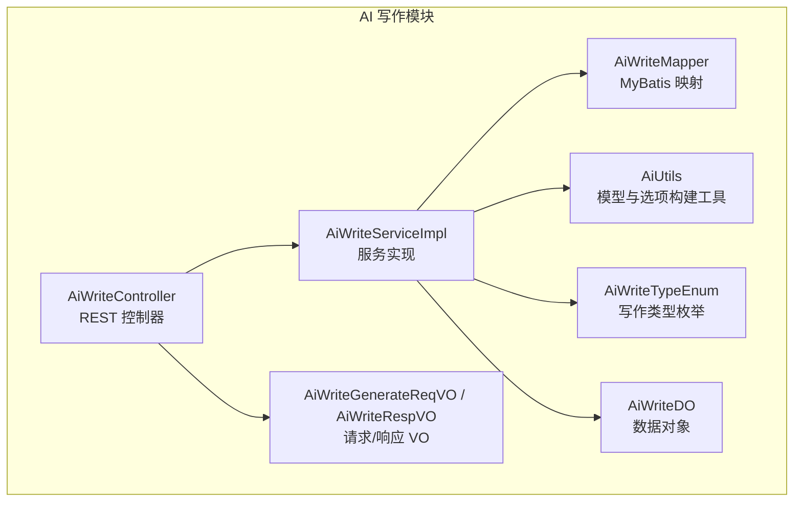
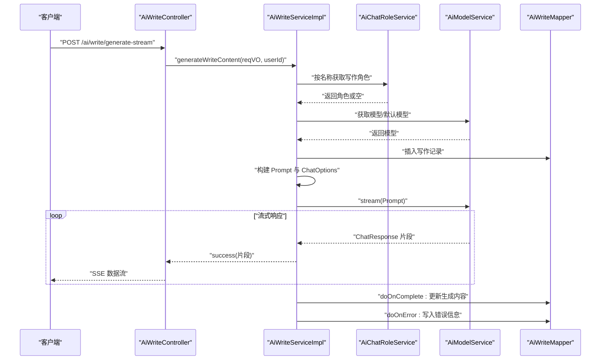
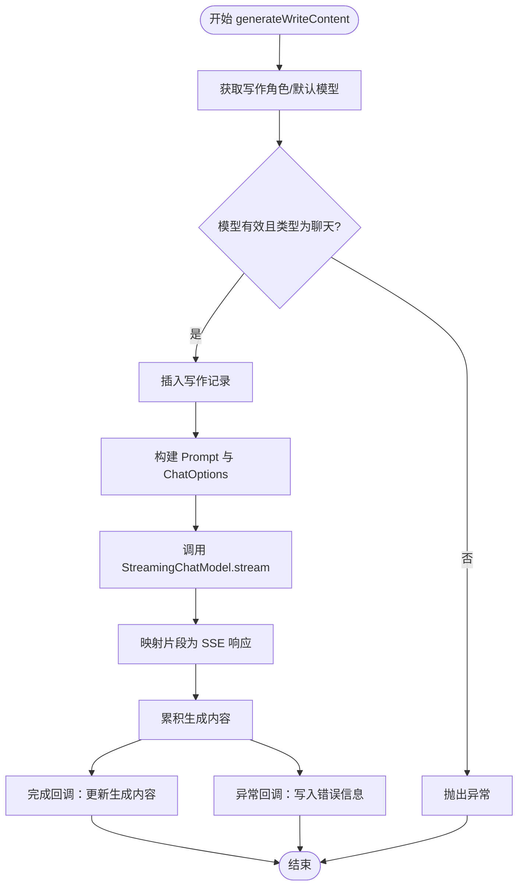
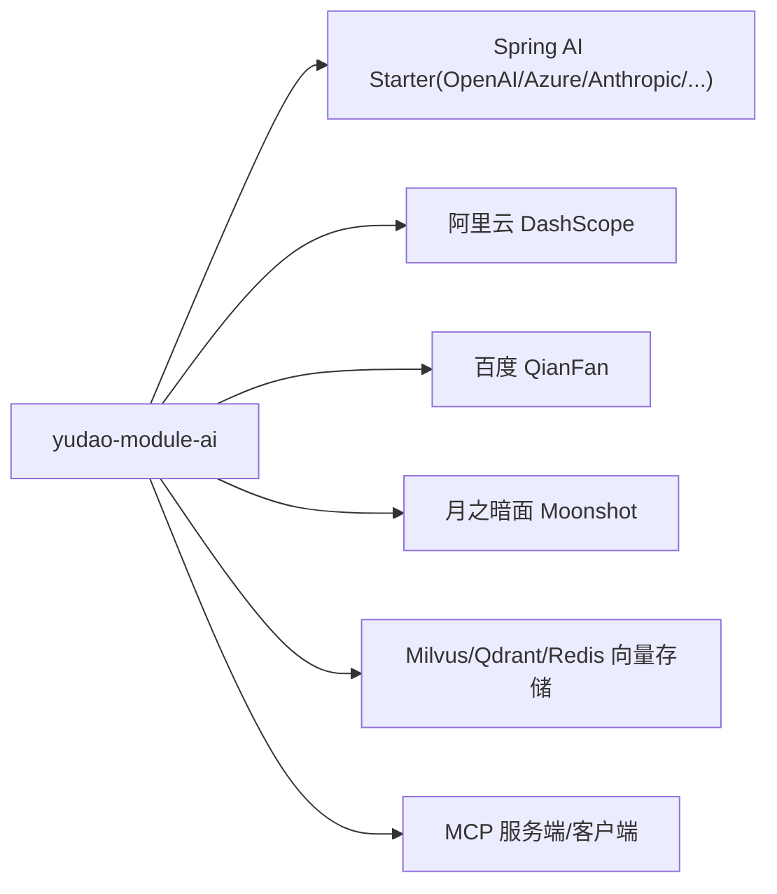

# AI 文本写作服务

<cite>
**本文引用的文件**
- [pom.xml](file://backend/yudao-module-ai/pom.xml)
- [AiWriteController.java](file://backend/yudao-module-ai/src/main/java/cn/iocoder/yudao/module/ai/controller/admin/write/AiWriteController.java)
- [AiWriteService.java](file://backend/yudao-module-ai/src/main/java/cn/iocoder/yudao/module/ai/service/write/AiWriteService.java)
- [AiWriteServiceImpl.java](file://backend/yudao-module-ai/src/main/java/cn/iocoder/yudao/module/ai/service/write/AiWriteServiceImpl.java)
- [AiWriteGenerateReqVO.java](file://backend/yudao-module-ai/src/main/java/cn/iocoder/yudao/module/ai/controller/admin/write/vo/AiWriteGenerateReqVO.java)
- [AiWriteRespVO.java](file://backend/yudao-module-ai/src/main/java/cn/iocoder/yudao/module/ai/controller/admin/write/vo/AiWriteRespVO.java)
- [AiWriteTypeEnum.java](file://backend/yudao-module-ai/src/main/java/cn/iocoder/yudao/module/ai/enums/write/AiWriteTypeEnum.java)
- [AiWriteDO.java](file://backend/yudao-module-ai/src/main/java/cn/iocoder/yudao/module/ai/dal/dataobject/write/AiWriteDO.java)
- [AiUtils.java](file://backend/yudao-module-ai/src/main/java/cn/iocoder/yudao/module/ai/util/AiUtils.java)
</cite>

## 目录
1. [简介](#简介)
2. [项目结构](#项目结构)
3. [核心组件](#核心组件)
4. [架构总览](#架构总览)
5. [详细组件分析](#详细组件分析)
6. [依赖关系分析](#依赖关系分析)
7. [性能考量](#性能考量)
8. [故障排查指南](#故障排查指南)
9. [结论](#结论)
10. [附录](#附录)

## 简介
本文件面向“AI 文本写作服务”的综合技术文档，围绕后端模块 yudao-module-ai 中的写作能力展开，系统性阐述以下内容：
- 写作能力的实现架构与数据流
- 支持的写作类型与内容生成算法
- 配置参数、模板管理与质量控制机制
- 与业务系统的集成方式、内容审核与安全策略
- 写作接口的使用方法、批量处理与异步执行模式
- 质量评估、内容优化与个性化定制方案
- 在营销文案、产品描述、活动策划等场景的应用价值

## 项目结构
AI 写作能力位于 yudao-module-ai 模块中，采用“控制器-服务-持久层-枚举-工具类”分层设计，结合 Spring AI 与多平台大模型适配器，提供统一的流式写作接口。

图表来源
- [AiWriteController.java:1-58](file://backend/yudao-module-ai/src/main/java/cn/iocoder/yudao/module/ai/controller/admin/write/AiWriteController.java#L1-L58)
- [AiWriteServiceImpl.java:1-179](file://backend/yudao-module-ai/src/main/java/cn/iocoder/yudao/module/ai/service/write/AiWriteServiceImpl.java#L1-L179)
- [AiWriteDO.java:1-104](file://backend/yudao-module-ai/src/main/java/cn/iocoder/yudao/module/ai/dal/dataobject/write/AiWriteDO.java#L1-L104)
- [AiWriteTypeEnum.java:1-43](file://backend/yudao-module-ai/src/main/java/cn/iocoder/yudao/module/ai/enums/write/AiWriteTypeEnum.java#L1-L43)
- [AiUtils.java:1-134](file://backend/yudao-module-ai/src/main/java/cn/iocoder/yudao/module/ai/util/AiUtils.java#L1-L134)
- [AiWriteGenerateReqVO.java:1-39](file://backend/yudao-module-ai/src/main/java/cn/iocoder/yudao/module/ai/controller/admin/write/vo/AiWriteGenerateReqVO.java#L1-L39)
- [AiWriteRespVO.java:1-38](file://backend/yudao-module-ai/src/main/java/cn/iocoder/yudao/module/ai/controller/admin/write/vo/AiWriteRespVO.java#L1-L38)

章节来源
- [pom.xml:1-265](file://backend/yudao-module-ai/pom.xml#L1-L265)

## 核心组件
- 控制器层：提供流式写作接口，支持 SSE 返回，便于前端实时展示生成内容。
- 服务层：负责模型选择、角色设定注入、Prompt 构建、流式调用与结果聚合，以及持久化记录与错误回写。
- 数据对象层：封装写作记录的字段，包括用户、平台、模型、提示词、生成内容、原始内容及字典项等。
- 枚举与工具：定义写作类型模板、构建 ChatOptions 与消息类型，统一平台差异。

章节来源
- [AiWriteController.java:1-58](file://backend/yudao-module-ai/src/main/java/cn/iocoder/yudao/module/ai/controller/admin/write/AiWriteController.java#L1-L58)
- [AiWriteService.java:1-41](file://backend/yudao-module-ai/src/main/java/cn/iocoder/yudao/module/ai/service/write/AiWriteService.java#L1-L41)
- [AiWriteServiceImpl.java:1-179](file://backend/yudao-module-ai/src/main/java/cn/iocoder/yudao/module/ai/service/write/AiWriteServiceImpl.java#L1-L179)
- [AiWriteDO.java:1-104](file://backend/yudao-module-ai/src/main/java/cn/iocoder/yudao/module/ai/dal/dataobject/write/AiWriteDO.java#L1-L104)
- [AiWriteTypeEnum.java:1-43](file://backend/yudao-module-ai/src/main/java/cn/iocoder/yudao/module/ai/enums/write/AiWriteTypeEnum.java#L1-L43)
- [AiUtils.java:1-134](file://backend/yudao-module-ai/src/main/java/cn/iocoder/yudao/module/ai/util/AiUtils.java#L1-L134)

## 架构总览
AI 写作服务通过控制器接收请求，服务层根据“写作类型 + 字典项”动态拼装 Prompt，选择合适的模型与平台，调用 Spring AI 的 StreamingChatModel 进行流式生成，并将中间片段以 SSE 方式返回给客户端。完成后异步更新生成内容或错误信息到数据库。

图表来源
- [AiWriteController.java:32-36](file://backend/yudao-module-ai/src/main/java/cn/iocoder/yudao/module/ai/controller/admin/write/AiWriteController.java#L32-L36)
- [AiWriteServiceImpl.java:64-105](file://backend/yudao-module-ai/src/main/java/cn/iocoder/yudao/module/ai/service/write/AiWriteServiceImpl.java#L64-L105)

## 详细组件分析

### 控制器：AiWriteController
- 提供流式写作接口 generate-stream，返回类型为 TEXT_EVENT_STREAM，便于前端逐段接收生成内容。
- 提供写作记录的删除与分页查询接口，配合权限注解进行访问控制。

章节来源
- [AiWriteController.java:1-58](file://backend/yudao-module-ai/src/main/java/cn/iocoder/yudao/module/ai/controller/admin/write/AiWriteController.java#L1-L58)

### 服务：AiWriteService 与 AiWriteServiceImpl
- 模型选择：优先使用“写作助手”角色绑定的模型，否则回退到默认聊天模型；并校验模型类型为聊天类。
- 角色注入：从角色中读取 systemMessage，作为系统提示注入到 Prompt。
- Prompt 构建：依据 AiWriteTypeEnum 与字典项（格式、语气、语言、长度）拼装最终提示词。
- 流式生成：调用 StreamingChatModel.stream，逐片返回，同时累积生成内容。
- 结果落盘：完成回调中更新生成内容；异常回调中记录错误信息。

图表来源
- [AiWriteServiceImpl.java:64-105](file://backend/yudao-module-ai/src/main/java/cn/iocoder/yudao/module/ai/service/write/AiWriteServiceImpl.java#L64-L105)
- [AiWriteServiceImpl.java:107-123](file://backend/yudao-module-ai/src/main/java/cn/iocoder/yudao/module/ai/service/write/AiWriteServiceImpl.java#L107-L123)
- [AiWriteServiceImpl.java:125-157](file://backend/yudao-module-ai/src/main/java/cn/iocoder/yudao/module/ai/service/write/AiWriteServiceImpl.java#L125-L157)

章节来源
- [AiWriteService.java:1-41](file://backend/yudao-module-ai/src/main/java/cn/iocoder/yudao/module/ai/service/write/AiWriteService.java#L1-L41)
- [AiWriteServiceImpl.java:1-179](file://backend/yudao-module-ai/src/main/java/cn/iocoder/yudao/module/ai/service/write/AiWriteServiceImpl.java#L1-L179)

### 数据模型：AiWriteDO
- 字段覆盖：用户、平台、模型、提示词、生成内容、原始内容、长度/格式/语气/语言等字典项，以及错误信息。
- 用于持久化写作记录，支撑审计、重放与二次编辑。

章节来源
- [AiWriteDO.java:1-104](file://backend/yudao-module-ai/src/main/java/cn/iocoder/yudao/module/ai/dal/dataobject/write/AiWriteDO.java#L1-L104)

### 枚举与模板：AiWriteTypeEnum
- 定义两类写作类型：撰写与回复，分别对应不同的 Prompt 模板。
- 通过占位符将“主题/格式/语气/语言/长度”注入模板，形成具体 Prompt。

章节来源
- [AiWriteTypeEnum.java:1-43](file://backend/yudao-module-ai/src/main/java/cn/iocoder/yudao/module/ai/enums/write/AiWriteTypeEnum.java#L1-L43)

### 请求/响应 VO：AiWriteGenerateReqVO 与 AiWriteRespVO
- 请求 VO：包含写作类型、提示词、原文、长度、格式、语气、语言等必填项与校验。
- 响应 VO：包含生成记录的完整信息，便于管理端查看与导出。

章节来源
- [AiWriteGenerateReqVO.java:1-39](file://backend/yudao-module-ai/src/main/java/cn/iocoder/yudao/module/ai/controller/admin/write/vo/AiWriteGenerateReqVO.java#L1-L39)
- [AiWriteRespVO.java:1-38](file://backend/yudao-module-ai/src/main/java/cn/iocoder/yudao/module/ai/controller/admin/write/vo/AiWriteRespVO.java#L1-L38)

### 工具类：AiUtils
- 统一封装不同平台的 ChatOptions 构建逻辑，屏蔽平台差异。
- 提供消息类型构建与通用工具上下文（登录用户、租户 ID），便于工具链扩展。

章节来源
- [AiUtils.java:1-134](file://backend/yudao-module-ai/src/main/java/cn/iocoder/yudao/module/ai/util/AiUtils.java#L1-L134)

## 依赖关系分析
- 模块依赖：yudao-module-ai 依赖 yudao-module-system 与 yudao-module-infra，以及 Spring AI Starter 与多家大模型厂商适配器。
- 平台适配：通过 AiUtils 的 ChatOptions 构建，统一对接通义、文心、智谱、DeepSeek、OpenAI、Azure OpenAI、Anthropic、Ollama 等。
- 向量存储与工具链：预留向量存储与 MCP 工具链依赖，便于后续检索增强与工具调用扩展。

图表来源
- [pom.xml:77-221](file://backend/yudao-module-ai/pom.xml#L77-L221)

章节来源
- [pom.xml:1-265](file://backend/yudao-module-ai/pom.xml#L1-L265)

## 性能考量
- 流式传输：采用 Reactor Flux 与 SSE，降低首字节延迟，提升交互体验。
- 异步落盘：使用 doOnComplete/doOnError 在异步流结束后更新数据库，避免阻塞流式输出。
- 模型选择：优先角色绑定模型，减少无效切换；默认模型校验避免类型不匹配导致的失败重试。
- 平台参数：温度与最大 token 数由模型配置决定，建议按场景调优以平衡质量与成本。

## 故障排查指南
- 模型不存在或类型不匹配：服务层会抛出相应异常，需检查模型配置与类型。
- 平台不支持：AiUtils 的 ChatOptions 构建对未知平台会抛出异常，需确认平台枚举值。
- 流式异常：服务层捕获异常并返回统一错误码，同时将错误信息写入数据库，便于定位。
- 租户上下文：异步更新时使用忽略租户执行，避免上下文丢失导致的权限问题。

章节来源
- [AiWriteServiceImpl.java:107-123](file://backend/yudao-module-ai/src/main/java/cn/iocoder/yudao/module/ai/service/write/AiWriteServiceImpl.java#L107-L123)
- [AiWriteServiceImpl.java:99-104](file://backend/yudao-module-ai/src/main/java/cn/iocoder/yudao/module/ai/service/write/AiWriteServiceImpl.java#L99-L104)
- [AiUtils.java:36-86](file://backend/yudao-module-ai/src/main/java/cn/iocoder/yudao/module/ai/util/AiUtils.java#L36-L86)

## 结论
AI 文本写作服务以清晰的分层架构与统一的平台适配工具，实现了“类型化 Prompt + 流式生成 + 可追溯记录”的写作能力。通过字典项与枚举模板，满足多场景个性化需求；借助 SSE 与异步落盘，兼顾性能与可靠性。未来可在检索增强、工具链扩展、内容审核与安全策略方面持续演进，进一步提升在营销文案、产品描述、活动策划等领域的应用价值。

## 附录

### 接口定义与使用方法
- 流式生成接口
  - 方法：POST
  - 路径：/ai/write/generate-stream
  - 响应：text/event-stream
  - 用途：实时展示生成内容，适合长文本与交互式写作
- 写作记录管理
  - 删除：DELETE /ai/write/delete?id={id}
  - 分页：GET /ai/write/page

章节来源
- [AiWriteController.java:32-55](file://backend/yudao-module-ai/src/main/java/cn/iocoder/yudao/module/ai/controller/admin/write/AiWriteController.java#L32-L55)

### 配置参数与模板
- 请求参数（AiWriteGenerateReqVO）
  - type：写作类型（撰写/回复）
  - prompt：主题或指令
  - originalContent：原文（回复场景）
  - length/format/tone/language：字典项（长度/格式/语气/语言）
- 模板（AiWriteTypeEnum）
  - 撰写：基于主题生成文章，包含格式、语气、语言、长度约束
  - 回复：基于原文与指令生成回复，包含格式、语气、语言、长度约束

章节来源
- [AiWriteGenerateReqVO.java:1-39](file://backend/yudao-module-ai/src/main/java/cn/iocoder/yudao/module/ai/controller/admin/write/vo/AiWriteGenerateReqVO.java#L1-L39)
- [AiWriteTypeEnum.java:18-19](file://backend/yudao-module-ai/src/main/java/cn/iocoder/yudao/module/ai/enums/write/AiWriteTypeEnum.java#L18-L19)

### 质量控制与个性化定制
- 角色设定：通过“写作助手”角色注入 systemMessage，统一风格与规范
- 字典项：通过字典类型（长度/格式/语气/语言）实现可配置的个性化输出
- 平台参数：通过 ChatOptions 的温度与最大 token 控制创造性与长度

章节来源
- [AiWriteServiceImpl.java:67-76](file://backend/yudao-module-ai/src/main/java/cn/iocoder/yudao/module/ai/service/write/AiWriteServiceImpl.java#L67-L76)
- [AiUtils.java:36-86](file://backend/yudao-module-ai/src/main/java/cn/iocoder/yudao/module/ai/util/AiUtils.java#L36-L86)

### 应用场景与价值
- 营销文案：通过“撰写”模板快速生成广告语、软文与品牌故事
- 产品描述：结合“格式/语气/语言”字典项，输出符合目标市场的商品详情
- 活动策划：利用“回复”模板对用户反馈进行标准化回复与引导