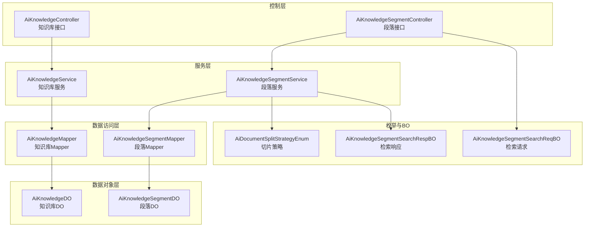
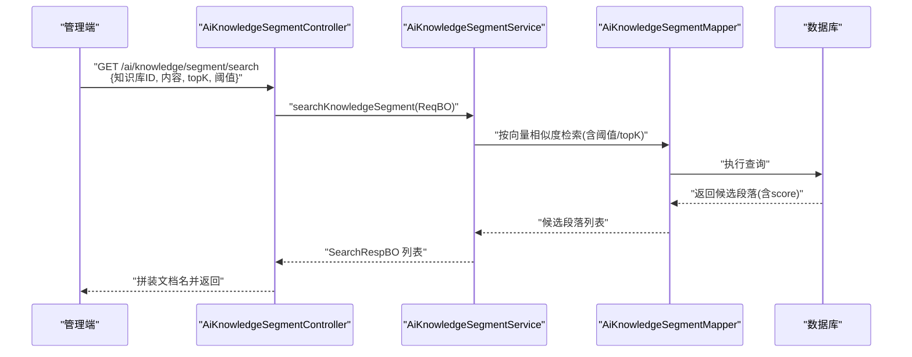
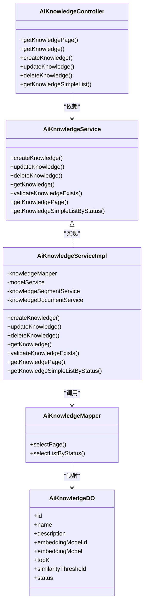
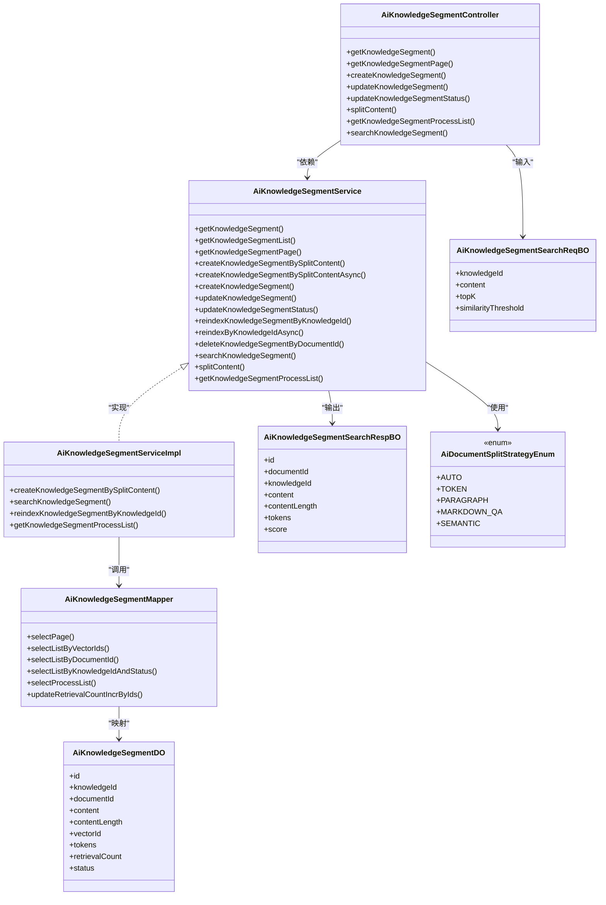
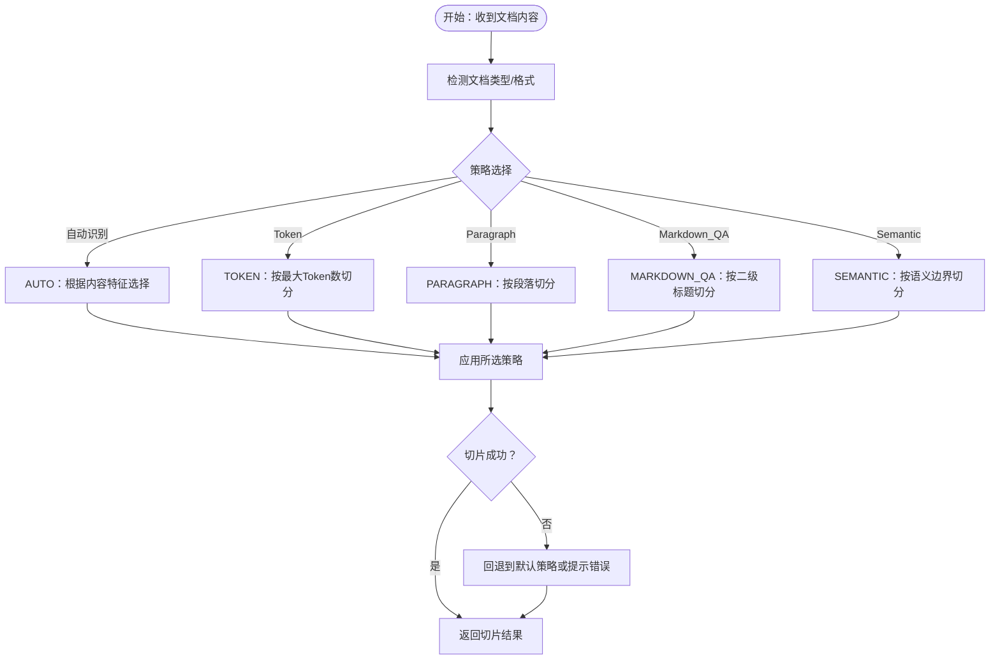
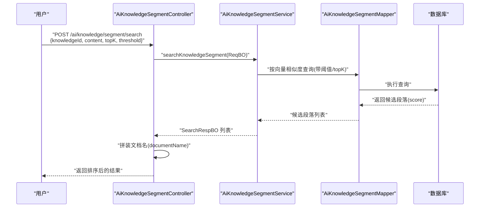
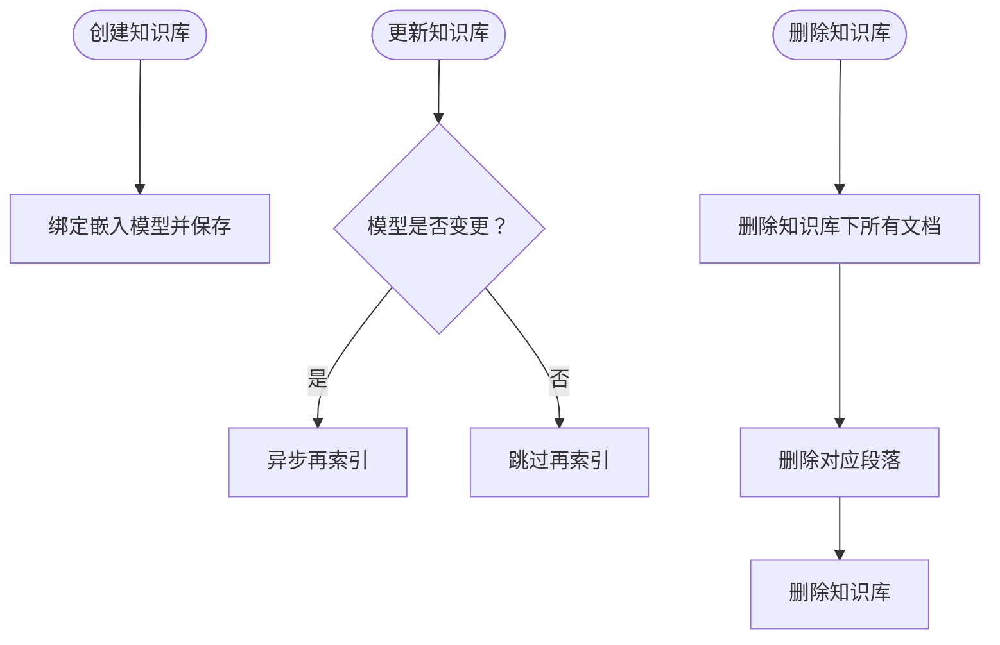
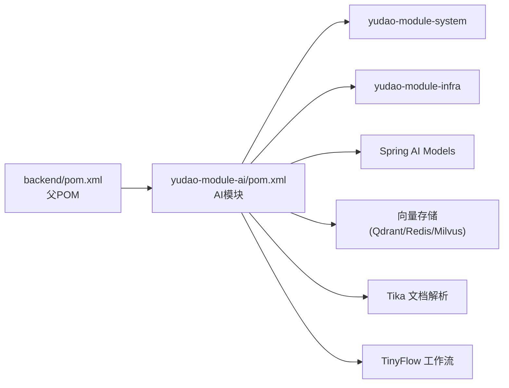

# AI 知识管理服务

<cite>
**本文引用的文件**
- [backend/pom.xml](file://backend/pom.xml)
- [backend/yudao-module-ai/pom.xml](file://backend/yudao-module-ai/pom.xml)
- [AiKnowledgeService.java](file://backend/yudao-module-ai/src/main/java/cn/iocoder/yudao/module/ai/service/knowledge/AiKnowledgeService.java)
- [AiKnowledgeServiceImpl.java](file://backend/yudao-module-ai/src/main/java/cn/iocoder/yudao/module/ai/service/knowledge/AiKnowledgeServiceImpl.java)
- [AiKnowledgeController.java](file://backend/yudao-module-ai/src/main/java/cn/iocoder/yudao/module/ai/controller/admin/knowledge/AiKnowledgeController.java)
- [AiKnowledgeDO.java](file://backend/yudao-module-ai/src/main/java/cn/iocoder/yudao/module/ai/dal/dataobject/knowledge/AiKnowledgeDO.java)
- [AiKnowledgeMapper.java](file://backend/yudao-module-ai/src/main/java/cn/iocoder/yudao/module/ai/dal/mysql/knowledge/AiKnowledgeMapper.java)
- [AiKnowledgeSegmentService.java](file://backend/yudao-module-ai/src/main/java/cn/iocoder/yudao/module/ai/service/knowledge/AiKnowledgeSegmentService.java)
- [AiKnowledgeSegmentServiceImpl.java](file://backend/yudao-module-ai/src/main/java/cn/iocoder/yudao/module/ai/service/knowledge/AiKnowledgeSegmentServiceImpl.java)
- [AiKnowledgeSegmentController.java](file://backend/yudao-module-ai/src/main/java/cn/iocoder/yudao/module/ai/controller/admin/knowledge/AiKnowledgeSegmentController.java)
- [AiKnowledgeSegmentDO.java](file://backend/yudao-module-ai/src/main/java/cn/iocoder/yudao/module/ai/dal/dataobject/knowledge/AiKnowledgeSegmentDO.java)
- [AiKnowledgeSegmentMapper.java](file://backend/yudao-module-ai/src/main/java/cn/iocoder/yudao/module/ai/dal/mysql/knowledge/AiKnowledgeSegmentMapper.java)
- [AiKnowledgeSegmentSearchReqBO.java](file://backend/yudao-module-ai/src/main/java/cn/iocoder/yudao/module/ai/service/knowledge/bo/AiKnowledgeSegmentSearchReqBO.java)
- [AiKnowledgeSegmentSearchRespBO.java](file://backend/yudao-module-ai/src/main/java/cn/iocoder/yudao/module/ai/service/knowledge/bo/AiKnowledgeSegmentSearchRespBO.java)
- [AiDocumentSplitStrategyEnum.java](file://backend/yudao-module-ai/src/main/java/cn/iocoder/yudao/module/ai/enums/AiDocumentSplitStrategyEnum.java)
</cite>

## 目录
1. [简介](#简介)
2. [项目结构](#项目结构)
3. [核心组件](#核心组件)
4. [架构总览](#架构总览)
5. [详细组件分析](#详细组件分析)
6. [依赖关系分析](#依赖关系分析)
7. [性能考量](#性能考量)
8. [故障排查指南](#故障排查指南)
9. [结论](#结论)
10. [附录](#附录)

## 简介
本文件面向“AI 知识管理服务”，系统性阐述知识库构建、文档处理与信息检索的技术实现。重点覆盖以下方面：
- 知识入库流程：从知识库创建、文档导入到段落切分与向量化索引的完整链路
- 文档分割策略：多策略（自动、Token、段落、Markdown QA、语义）的适用场景与差异
- 向量索引机制：向量 ID、召回计数、相似度阈值与 topK 的协同工作方式
- 分类与标签：当前代码中以状态字段为主，建议扩展标签体系以增强检索能力
- 查询接口与排序：基于相似度分数的检索与结果拼装
- 应用场景：智能问答、文档检索、业务咨询中的检索增强生成（RAG）
- 质量评估与维护：内容去重、增量更新与再索引策略

## 项目结构
AI 知识管理服务位于后端模块 yudao-module-ai 中，采用分层架构：
- 控制层：Admin 管理端控制器，提供知识库与段落的 CRUD、切片、检索等接口
- 服务层：知识库与段落的服务接口与实现，封装业务逻辑与事务控制
- 数据访问层：MyBatis Mapper，提供分页、统计与聚合查询
- 数据对象层：DO 对象定义知识库、段落等实体字段
- 枚举与 BO：切片策略枚举、检索请求/响应 BO

图表来源
- [AiKnowledgeController.java:1-85](file://backend/yudao-module-ai/src/main/java/cn/iocoder/yudao/module/ai/controller/admin/knowledge/AiKnowledgeController.java#L1-L85)
- [AiKnowledgeSegmentController.java:1-131](file://backend/yudao-module-ai/src/main/java/cn/iocoder/yudao/module/ai/controller/admin/knowledge/AiKnowledgeSegmentController.java#L1-L131)
- [AiKnowledgeService.java:1-71](file://backend/yudao-module-ai/src/main/java/cn/iocoder/yudao/module/ai/service/knowledge/AiKnowledgeService.java#L1-L71)
- [AiKnowledgeServiceImpl.java:1-110](file://backend/yudao-module-ai/src/main/java/cn/iocoder/yudao/module/ai/service/knowledge/AiKnowledgeServiceImpl.java#L1-L110)
- [AiKnowledgeMapper.java:1-32](file://backend/yudao-module-ai/src/main/java/cn/iocoder/yudao/module/ai/dal/mysql/knowledge/AiKnowledgeMapper.java#L1-L32)
- [AiKnowledgeSegmentService.java:1-151](file://backend/yudao-module-ai/src/main/java/cn/iocoder/yudao/module/ai/service/knowledge/AiKnowledgeSegmentService.java#L1-L151)
- [AiKnowledgeSegmentServiceImpl.java:1-21](file://backend/yudao-module-ai/src/main/java/cn/iocoder/yudao/module/ai/service/knowledge/AiKnowledgeSegmentServiceImpl.java#L1-L21)
- [AiKnowledgeSegmentMapper.java:1-67](file://backend/yudao-module-ai/src/main/java/cn/iocoder/yudao/module/ai/dal/mysql/knowledge/AiKnowledgeSegmentMapper.java#L1-L67)
- [AiKnowledgeSegmentSearchReqBO.java:1-39](file://backend/yudao-module-ai/src/main/java/cn/iocoder/yudao/module/ai/service/knowledge/bo/AiKnowledgeSegmentSearchReqBO.java#L1-L39)
- [AiKnowledgeSegmentSearchRespBO.java:1-45](file://backend/yudao-module-ai/src/main/java/cn/iocoder/yudao/module/ai/service/knowledge/bo/AiKnowledgeSegmentSearchRespBO.java#L1-L45)
- [AiDocumentSplitStrategyEnum.java:1-54](file://backend/yudao-module-ai/src/main/java/cn/iocoder/yudao/module/ai/enums/AiDocumentSplitStrategyEnum.java#L1-L54)

章节来源
- [backend/pom.xml:1-176](file://backend/pom.xml#L1-L176)
- [backend/yudao-module-ai/pom.xml:1-265](file://backend/yudao-module-ai/pom.xml#L1-L265)

## 核心组件
- 知识库服务与控制器：提供知识库的创建、更新、删除、分页查询与启用状态列表
- 段落服务与控制器：提供段落的分页、创建、更新、状态变更、切片、检索与处理进度查询
- 数据对象与映射：知识库与段落的数据模型，以及分页、统计与聚合查询
- 检索 BO：统一的检索请求与响应对象，便于跨层传递
- 切片策略枚举：定义多种文档切片策略，支撑不同内容类型的最优切分

章节来源
- [AiKnowledgeService.java:1-71](file://backend/yudao-module-ai/src/main/java/cn/iocoder/yudao/module/ai/service/knowledge/AiKnowledgeService.java#L1-L71)
- [AiKnowledgeServiceImpl.java:1-110](file://backend/yudao-module-ai/src/main/java/cn/iocoder/yudao/module/ai/service/knowledge/AiKnowledgeServiceImpl.java#L1-L110)
- [AiKnowledgeController.java:1-85](file://backend/yudao-module-ai/src/main/java/cn/iocoder/yudao/module/ai/controller/admin/knowledge/AiKnowledgeController.java#L1-L85)
- [AiKnowledgeSegmentService.java:1-151](file://backend/yudao-module-ai/src/main/java/cn/iocoder/yudao/module/ai/service/knowledge/AiKnowledgeSegmentService.java#L1-L151)
- [AiKnowledgeSegmentController.java:1-131](file://backend/yudao-module-ai/src/main/java/cn/iocoder/yudao/module/ai/controller/admin/knowledge/AiKnowledgeSegmentController.java#L1-L131)
- [AiKnowledgeSegmentSearchReqBO.java:1-39](file://backend/yudao-module-ai/src/main/java/cn/iocoder/yudao/module/ai/service/knowledge/bo/AiKnowledgeSegmentSearchReqBO.java#L1-L39)
- [AiKnowledgeSegmentSearchRespBO.java:1-45](file://backend/yudao-module-ai/src/main/java/cn/iocoder/yudao/module/ai/service/knowledge/bo/AiKnowledgeSegmentSearchRespBO.java#L1-L45)
- [AiDocumentSplitStrategyEnum.java:1-54](file://backend/yudao-module-ai/src/main/java/cn/iocoder/yudao/module/ai/enums/AiDocumentSplitStrategyEnum.java#L1-L54)

## 架构总览
AI 知识管理服务围绕“知识库—文档—段落—向量索引”的链路组织，结合检索请求中的 topK 与相似度阈值，完成从内容到语义检索再到结果排序的闭环。

图表来源
- [AiKnowledgeSegmentController.java:110-128](file://backend/yudao-module-ai/src/main/java/cn/iocoder/yudao/module/ai/controller/admin/knowledge/AiKnowledgeSegmentController.java#L110-L128)
- [AiKnowledgeSegmentService.java:126-131](file://backend/yudao-module-ai/src/main/java/cn/iocoder/yudao/module/ai/service/knowledge/AiKnowledgeSegmentService.java#L126-L131)
- [AiKnowledgeSegmentMapper.java:25-31](file://backend/yudao-module-ai/src/main/java/cn/iocoder/yudao/module/ai/dal/mysql/knowledge/AiKnowledgeSegmentMapper.java#L25-L31)
- [AiKnowledgeSegmentSearchReqBO.java:14-39](file://backend/yudao-module-ai/src/main/java/cn/iocoder/yudao/module/ai/service/knowledge/bo/AiKnowledgeSegmentSearchReqBO.java#L14-L39)
- [AiKnowledgeSegmentSearchRespBO.java:10-45](file://backend/yudao-module-ai/src/main/java/cn/iocoder/yudao/module/ai/service/knowledge/bo/AiKnowledgeSegmentSearchRespBO.java#L10-L45)

## 详细组件分析

### 知识库管理
- 职责：创建/更新/删除知识库；分页查询；按状态获取可用知识库列表
- 关键点：
  - 更新时若嵌入模型变更，触发异步再索引
  - 删除时先清理知识库下的文档与段落，最后删除知识库本身
- 接口示例路径：
  - [创建:52-57](file://backend/yudao-module-ai/src/main/java/cn/iocoder/yudao/module/ai/controller/admin/knowledge/AiKnowledgeController.java#L52-L57)
  - [更新:59-64](file://backend/yudao-module-ai/src/main/java/cn/iocoder/yudao/module/ai/controller/admin/knowledge/AiKnowledgeController.java#L59-L64)
  - [删除:67-74](file://backend/yudao-module-ai/src/main/java/cn/iocoder/yudao/module/ai/controller/admin/knowledge/AiKnowledgeController.java#L67-L74)
  - [分页:35-41](file://backend/yudao-module-ai/src/main/java/cn/iocoder/yudao/module/ai/controller/admin/knowledge/AiKnowledgeController.java#L35-L41)
  - [启用列表:76-82](file://backend/yudao-module-ai/src/main/java/cn/iocoder/yudao/module/ai/controller/admin/knowledge/AiKnowledgeController.java#L76-L82)

图表来源
- [AiKnowledgeController.java:1-85](file://backend/yudao-module-ai/src/main/java/cn/iocoder/yudao/module/ai/controller/admin/knowledge/AiKnowledgeController.java#L1-L85)
- [AiKnowledgeService.java:1-71](file://backend/yudao-module-ai/src/main/java/cn/iocoder/yudao/module/ai/service/knowledge/AiKnowledgeService.java#L1-L71)
- [AiKnowledgeServiceImpl.java:1-110](file://backend/yudao-module-ai/src/main/java/cn/iocoder/yudao/module/ai/service/knowledge/AiKnowledgeServiceImpl.java#L1-L110)
- [AiKnowledgeMapper.java:1-32](file://backend/yudao-module-ai/src/main/java/cn/iocoder/yudao/module/ai/dal/mysql/knowledge/AiKnowledgeMapper.java#L1-L32)
- [AiKnowledgeDO.java:1-64](file://backend/yudao-module-ai/src/main/java/cn/iocoder/yudao/module/ai/dal/dataobject/knowledge/AiKnowledgeDO.java#L1-L64)

章节来源
- [AiKnowledgeController.java:1-85](file://backend/yudao-module-ai/src/main/java/cn/iocoder/yudao/module/ai/controller/admin/knowledge/AiKnowledgeController.java#L1-L85)
- [AiKnowledgeService.java:1-71](file://backend/yudao-module-ai/src/main/java/cn/iocoder/yudao/module/ai/service/knowledge/AiKnowledgeService.java#L1-L71)
- [AiKnowledgeServiceImpl.java:1-110](file://backend/yudao-module-ai/src/main/java/cn/iocoder/yudao/module/ai/service/knowledge/AiKnowledgeServiceImpl.java#L1-L110)
- [AiKnowledgeMapper.java:1-32](file://backend/yudao-module-ai/src/main/java/cn/iocoder/yudao/module/ai/dal/mysql/knowledge/AiKnowledgeMapper.java#L1-L32)
- [AiKnowledgeDO.java:1-64](file://backend/yudao-module-ai/src/main/java/cn/iocoder/yudao/module/ai/dal/dataobject/knowledge/AiKnowledgeDO.java#L1-L64)

### 段落管理与检索
- 职责：段落 CRUD、批量处理、切片策略、检索与处理进度统计
- 关键点：
  - 支持基于 URL 的在线内容切片
  - 提供异步再索引能力，适配模型切换
  - 检索返回段落与相似度分数，控制器侧补充文档名
- 接口示例路径：
  - [分页:53-60](file://backend/yudao-module-ai/src/main/java/cn/iocoder/yudao/module/ai/controller/admin/knowledge/AiKnowledgeSegmentController.java#L53-L60)
  - [创建/更新/状态变更:62-84](file://backend/yudao-module-ai/src/main/java/cn/iocoder/yudao/module/ai/controller/admin/knowledge/AiKnowledgeSegmentController.java#L62-L84)
  - [切片:86-98](file://backend/yudao-module-ai/src/main/java/cn/iocoder/yudao/module/ai/controller/admin/knowledge/AiKnowledgeSegmentController.java#L86-L98)
  - [检索:110-128](file://backend/yudao-module-ai/src/main/java/cn/iocoder/yudao/module/ai/controller/admin/knowledge/AiKnowledgeSegmentController.java#L110-L128)
  - [处理进度:100-108](file://backend/yudao-module-ai/src/main/java/cn/iocoder/yudao/module/ai/controller/admin/knowledge/AiKnowledgeSegmentController.java#L100-L108)

图表来源
- [AiKnowledgeSegmentController.java:1-131](file://backend/yudao-module-ai/src/main/java/cn/iocoder/yudao/module/ai/controller/admin/knowledge/AiKnowledgeSegmentController.java#L1-L131)
- [AiKnowledgeSegmentService.java:1-151](file://backend/yudao-module-ai/src/main/java/cn/iocoder/yudao/module/ai/service/knowledge/AiKnowledgeSegmentService.java#L1-L151)
- [AiKnowledgeSegmentServiceImpl.java:1-21](file://backend/yudao-module-ai/src/main/java/cn/iocoder/yudao/module/ai/service/knowledge/AiKnowledgeSegmentServiceImpl.java#L1-L21)
- [AiKnowledgeSegmentMapper.java:1-67](file://backend/yudao-module-ai/src/main/java/cn/iocoder/yudao/module/ai/dal/mysql/knowledge/AiKnowledgeSegmentMapper.java#L1-L67)
- [AiKnowledgeSegmentDO.java:1-73](file://backend/yudao-module-ai/src/main/java/cn/iocoder/yudao/module/ai/dal/dataobject/knowledge/AiKnowledgeSegmentDO.java#L1-L73)
- [AiKnowledgeSegmentSearchReqBO.java:1-39](file://backend/yudao-module-ai/src/main/java/cn/iocoder/yudao/module/ai/service/knowledge/bo/AiKnowledgeSegmentSearchReqBO.java#L1-L39)
- [AiKnowledgeSegmentSearchRespBO.java:1-45](file://backend/yudao-module-ai/src/main/java/cn/iocoder/yudao/module/ai/service/knowledge/bo/AiKnowledgeSegmentSearchRespBO.java#L1-L45)
- [AiDocumentSplitStrategyEnum.java:1-54](file://backend/yudao-module-ai/src/main/java/cn/iocoder/yudao/module/ai/enums/AiDocumentSplitStrategyEnum.java#L1-L54)

章节来源
- [AiKnowledgeSegmentController.java:1-131](file://backend/yudao-module-ai/src/main/java/cn/iocoder/yudao/module/ai/controller/admin/knowledge/AiKnowledgeSegmentController.java#L1-L131)
- [AiKnowledgeSegmentService.java:1-151](file://backend/yudao-module-ai/src/main/java/cn/iocoder/yudao/module/ai/service/knowledge/AiKnowledgeSegmentService.java#L1-L151)
- [AiKnowledgeSegmentServiceImpl.java:1-21](file://backend/yudao-module-ai/src/main/java/cn/iocoder/yudao/module/ai/service/knowledge/AiKnowledgeSegmentServiceImpl.java#L1-L21)
- [AiKnowledgeSegmentMapper.java:1-67](file://backend/yudao-module-ai/src/main/java/cn/iocoder/yudao/module/ai/dal/mysql/knowledge/AiKnowledgeSegmentMapper.java#L1-L67)
- [AiKnowledgeSegmentDO.java:1-73](file://backend/yudao-module-ai/src/main/java/cn/iocoder/yudao/module/ai/dal/dataobject/knowledge/AiKnowledgeSegmentDO.java#L1-L73)
- [AiKnowledgeSegmentSearchReqBO.java:1-39](file://backend/yudao-module-ai/src/main/java/cn/iocoder/yudao/module/ai/service/knowledge/bo/AiKnowledgeSegmentSearchReqBO.java#L1-L39)
- [AiKnowledgeSegmentSearchRespBO.java:1-45](file://backend/yudao-module-ai/src/main/java/cn/iocoder/yudao/module/ai/service/knowledge/bo/AiKnowledgeSegmentSearchRespBO.java#L1-L45)
- [AiDocumentSplitStrategyEnum.java:1-54](file://backend/yudao-module-ai/src/main/java/cn/iocoder/yudao/module/ai/enums/AiDocumentSplitStrategyEnum.java#L1-L54)

### 文档分割策略
- 策略类型：
  - 自动识别（AUTO）：根据文档类型选择最佳切片策略
  - Token 切分（TOKEN）：按最大 Token 数机械切分，默认策略
  - 段落切分（PARAGRAPH）：以双换行符为分隔
  - Markdown QA 切分（MARKDOWN_QA）：识别二级标题作为问题，保持问答对完整性
  - 语义切分（SEMANTIC）：在段落与句子边界处切分，避免截断
- 适用场景：
  - 技术文档、长文本：优先语义或段落切分，保证上下文完整性
  - QA/FAQ：优先 Markdown QA 切分，保留问题-答案对
  - 大规模通用文本：优先 Token 切分，兼顾性能与可控性

图表来源
- [AiDocumentSplitStrategyEnum.java:11-42](file://backend/yudao-module-ai/src/main/java/cn/iocoder/yudao/module/ai/enums/AiDocumentSplitStrategyEnum.java#L11-L42)

章节来源
- [AiDocumentSplitStrategyEnum.java:1-54](file://backend/yudao-module-ai/src/main/java/cn/iocoder/yudao/module/ai/enums/AiDocumentSplitStrategyEnum.java#L1-L54)

### 向量索引与检索
- 向量 ID：段落对象中维护 vectorId 字段，用于标识向量库中的记录
- 相似度与阈值：检索请求支持传入相似度阈值，仅返回高于阈值的结果
- topK：限制返回的候选段落数量
- 召回计数：检索命中后对段落的 retrievalCount 进行累加，可用于后续质量评估
- 结果排序：以相似度分数降序排列，控制器侧补充文档名

图表来源
- [AiKnowledgeSegmentController.java:110-128](file://backend/yudao-module-ai/src/main/java/cn/iocoder/yudao/module/ai/controller/admin/knowledge/AiKnowledgeSegmentController.java#L110-L128)
- [AiKnowledgeSegmentService.java:126-131](file://backend/yudao-module-ai/src/main/java/cn/iocoder/yudao/module/ai/service/knowledge/AiKnowledgeSegmentService.java#L126-L131)
- [AiKnowledgeSegmentMapper.java:25-31](file://backend/yudao-module-ai/src/main/java/cn/iocoder/yudao/module/ai/dal/mysql/knowledge/AiKnowledgeSegmentMapper.java#L25-L31)
- [AiKnowledgeSegmentDO.java:20-71](file://backend/yudao-module-ai/src/main/java/cn/iocoder/yudao/module/ai/dal/dataobject/knowledge/AiKnowledgeSegmentDO.java#L20-L71)
- [AiKnowledgeSegmentSearchReqBO.java:14-39](file://backend/yudao-module-ai/src/main/java/cn/iocoder/yudao/module/ai/service/knowledge/bo/AiKnowledgeSegmentSearchReqBO.java#L14-L39)
- [AiKnowledgeSegmentSearchRespBO.java:10-45](file://backend/yudao-module-ai/src/main/java/cn/iocoder/yudao/module/ai/service/knowledge/bo/AiKnowledgeSegmentSearchRespBO.java#L10-L45)

章节来源
- [AiKnowledgeSegmentController.java:110-128](file://backend/yudao-module-ai/src/main/java/cn/iocoder/yudao/module/ai/controller/admin/knowledge/AiKnowledgeSegmentController.java#L110-L128)
- [AiKnowledgeSegmentService.java:126-131](file://backend/yudao-module-ai/src/main/java/cn/iocoder/yudao/module/ai/service/knowledge/AiKnowledgeSegmentService.java#L126-L131)
- [AiKnowledgeSegmentMapper.java:25-31](file://backend/yudao-module-ai/src/main/java/cn/iocoder/yudao/module/ai/dal/mysql/knowledge/AiKnowledgeSegmentMapper.java#L25-L31)
- [AiKnowledgeSegmentDO.java:20-71](file://backend/yudao-module-ai/src/main/java/cn/iocoder/yudao/module/ai/dal/dataobject/knowledge/AiKnowledgeSegmentDO.java#L20-L71)
- [AiKnowledgeSegmentSearchReqBO.java:14-39](file://backend/yudao-module-ai/src/main/java/cn/iocoder/yudao/module/ai/service/knowledge/bo/AiKnowledgeSegmentSearchReqBO.java#L14-L39)
- [AiKnowledgeSegmentSearchRespBO.java:10-45](file://backend/yudao-module-ai/src/main/java/cn/iocoder/yudao/module/ai/service/knowledge/bo/AiKnowledgeSegmentSearchRespBO.java#L10-L45)

### 知识入库流程与维护
- 入库流程要点：
  - 创建知识库时绑定嵌入模型（embeddingModelId），并冗余保存模型标识
  - 更新知识库时若模型变更，触发异步再索引，确保向量空间一致
  - 删除知识库时先删除其下的文档与段落，最后删除知识库自身
- 增量更新与再索引：
  - 支持按知识库 ID 触发再索引（异步），适用于模型切换或批量修复
  - 支持按文档 ID 删除段落，便于内容更新后的重建

图表来源
- [AiKnowledgeServiceImpl.java:41-83](file://backend/yudao-module-ai/src/main/java/cn/iocoder/yudao/module/ai/service/knowledge/AiKnowledgeServiceImpl.java#L41-L83)
- [AiKnowledgeSegmentService.java:102-116](file://backend/yudao-module-ai/src/main/java/cn/iocoder/yudao/module/ai/service/knowledge/AiKnowledgeSegmentService.java#L102-L116)

章节来源
- [AiKnowledgeServiceImpl.java:41-83](file://backend/yudao-module-ai/src/main/java/cn/iocoder/yudao/module/ai/service/knowledge/AiKnowledgeServiceImpl.java#L41-L83)
- [AiKnowledgeSegmentService.java:102-116](file://backend/yudao-module-ai/src/main/java/cn/iocoder/yudao/module/ai/service/knowledge/AiKnowledgeSegmentService.java#L102-L116)

## 依赖关系分析
- 模块依赖：yudao-module-ai 作为独立模块，聚合系统与基础设施模块
- 第三方依赖：Spring AI Starter（OpenAI、Azure OpenAI、Anthropic、DeepSeek、Ollama、Stability AI、Zhipu、Minimax）、向量存储（Qdrant、Redis、Milvus）、Tika（文档解析）、TinyFlow（工作流）

图表来源
- [backend/pom.xml:10-25](file://backend/pom.xml#L10-L25)
- [backend/yudao-module-ai/pom.xml:28-262](file://backend/yudao-module-ai/pom.xml#L28-L262)

章节来源
- [backend/pom.xml:1-176](file://backend/pom.xml#L1-L176)
- [backend/yudao-module-ai/pom.xml:1-265](file://backend/yudao-module-ai/pom.xml#L1-L265)

## 性能考量
- 切片策略选择：针对不同内容类型选择最优策略，减少无效切分带来的向量化与检索成本
- Token 控制：通过 segmentMaxTokens 控制段落长度，平衡召回与延迟
- 异步再索引：模型切换或大规模修复时使用异步再索引，避免阻塞主线程
- 召回计数统计：利用 retrievalCount 追踪高频命中段落，辅助热点内容优化
- 相似度阈值与 topK：合理设置阈值与 topK，减少无效候选，提升检索效率

## 故障排查指南
- 知识库不存在：当操作知识库时，若校验失败会抛出异常，需检查知识库 ID 是否正确
- 模型配置：更新知识库时需校验嵌入模型是否存在且有效
- 向量索引缺失：若 vectorId 为空或为空字符串，表示尚未向量化，需触发切片与索引流程
- 检索无结果：检查相似度阈值是否过高、topK 是否过小，或内容是否过短导致无法切片
- 处理进度异常：通过处理进度接口确认文档切片与向量化完成情况

章节来源
- [AiKnowledgeServiceImpl.java:90-97](file://backend/yudao-module-ai/src/main/java/cn/iocoder/yudao/module/ai/service/knowledge/AiKnowledgeServiceImpl.java#L90-L97)
- [AiKnowledgeSegmentDO.java:20-24](file://backend/yudao-module-ai/src/main/java/cn/iocoder/yudao/module/ai/dal/dataobject/knowledge/AiKnowledgeSegmentDO.java#L20-L24)
- [AiKnowledgeSegmentMapper.java:50-58](file://backend/yudao-module-ai/src/main/java/cn/iocoder/yudao/module/ai/dal/mysql/knowledge/AiKnowledgeSegmentMapper.java#L50-L58)

## 结论
AI 知识管理服务提供了从知识库配置、文档切片、向量索引到语义检索的完整能力。通过多策略切片与灵活的检索参数（topK、相似度阈值），可在不同业务场景下取得良好的召回与效率平衡。建议后续扩展标签体系与内容去重机制，进一步提升检索质量与维护效率。

## 附录
- 接口清单（示例路径）
  - 知识库：[分页:35-41](file://backend/yudao-module-ai/src/main/java/cn/iocoder/yudao/module/ai/controller/admin/knowledge/AiKnowledgeController.java#L35-L41)、[详情:43-50](file://backend/yudao-module-ai/src/main/java/cn/iocoder/yudao/module/ai/controller/admin/knowledge/AiKnowledgeController.java#L43-L50)、[创建:52-57](file://backend/yudao-module-ai/src/main/java/cn/iocoder/yudao/module/ai/controller/admin/knowledge/AiKnowledgeController.java#L52-L57)、[更新:59-64](file://backend/yudao-module-ai/src/main/java/cn/iocoder/yudao/module/ai/controller/admin/knowledge/AiKnowledgeController.java#L59-L64)、[删除:67-74](file://backend/yudao-module-ai/src/main/java/cn/iocoder/yudao/module/ai/controller/admin/knowledge/AiKnowledgeController.java#L67-L74)、[启用列表:76-82](file://backend/yudao-module-ai/src/main/java/cn/iocoder/yudao/module/ai/controller/admin/knowledge/AiKnowledgeController.java#L76-L82)
  - 段落：[分页:53-60](file://backend/yudao-module-ai/src/main/java/cn/iocoder/yudao/module/ai/controller/admin/knowledge/AiKnowledgeSegmentController.java#L53-L60)、[详情:44-51](file://backend/yudao-module-ai/src/main/java/cn/iocoder/yudao/module/ai/controller/admin/knowledge/AiKnowledgeSegmentController.java#L44-L51)、[创建/更新/状态变更:62-84](file://backend/yudao-module-ai/src/main/java/cn/iocoder/yudao/module/ai/controller/admin/knowledge/AiKnowledgeSegmentController.java#L62-L84)、[切片:86-98](file://backend/yudao-module-ai/src/main/java/cn/iocoder/yudao/module/ai/controller/admin/knowledge/AiKnowledgeSegmentController.java#L86-L98)、[检索:110-128](file://backend/yudao-module-ai/src/main/java/cn/iocoder/yudao/module/ai/controller/admin/knowledge/AiKnowledgeSegmentController.java#L110-L128)、[处理进度:100-108](file://backend/yudao-module-ai/src/main/java/cn/iocoder/yudao/module/ai/controller/admin/knowledge/AiKnowledgeSegmentController.java#L100-L108)