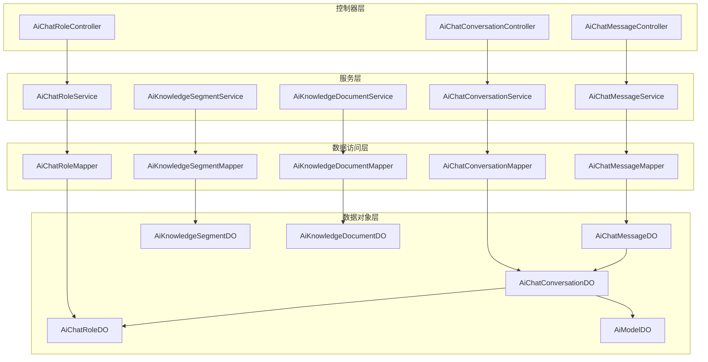
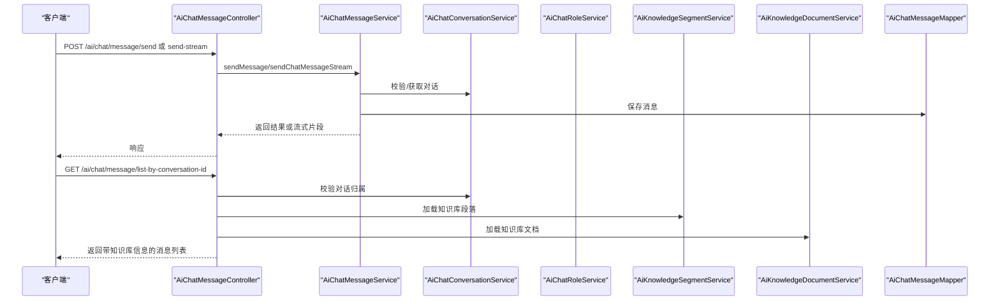
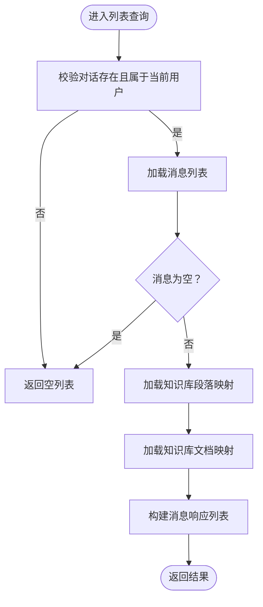
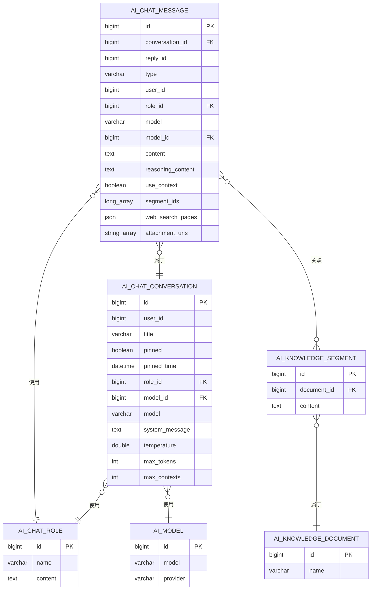
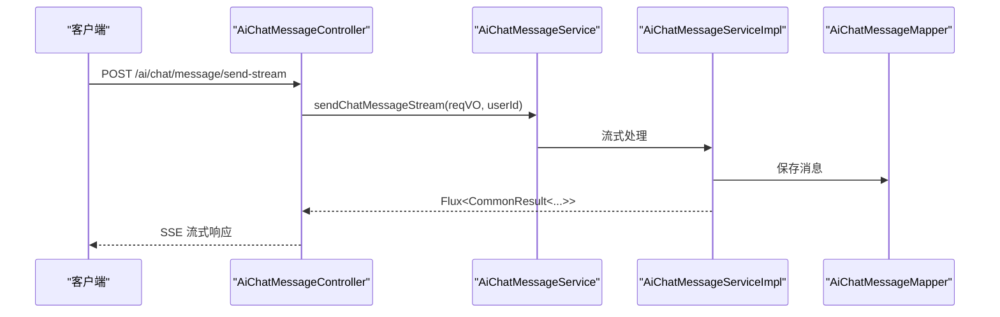
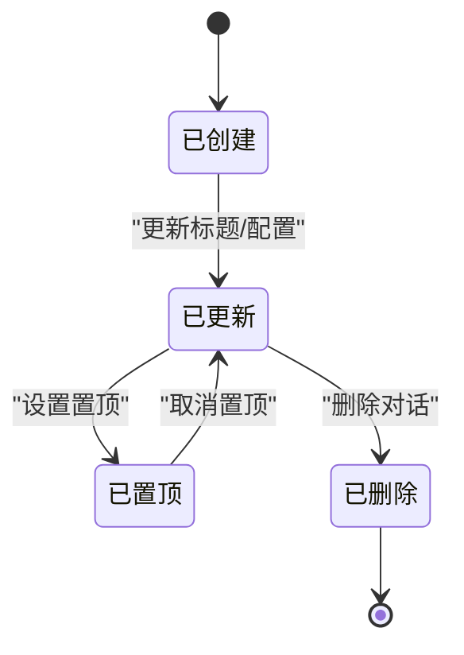
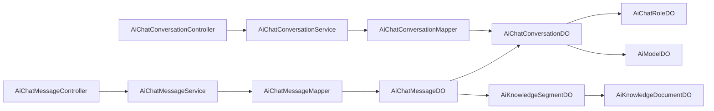

# AI 聊天服务

<cite>
**本文引用的文件**
- [AiChatMessageController.java](file://backend/yudao-module-ai/src/main/java/cn/iocoder/yudao/module/ai/controller/admin/chat/AiChatMessageController.java)
- [AiChatConversationController.java](file://backend/yudao-module-ai/src/main/java/cn/iocoder/yudao/module/ai/controller/admin/chat/AiChatConversationController.java)
- [AiChatMessageService.java](file://backend/yudao-module-ai/src/main/java/cn/iocoder/yudao/module/ai/service/chat/AiChatMessageService.java)
- [AiChatConversationService.java](file://backend/yudao-module-ai/src/main/java/cn/iocoder/yudao/module/ai/service/chat/AiChatConversationService.java)
- [AiChatMessageDO.java](file://backend/yudao-module-ai/src/main/java/cn/iocoder/yudao/module/ai/dal/dataobject/chat/AiChatMessageDO.java)
- [AiChatConversationDO.java](file://backend/yudao-module-ai/src/main/java/cn/iocoder/yudao/module/ai/dal/dataobject/chat/AiChatConversationDO.java)
- [AiChatMessageServiceImpl.java](file://backend/yudao-module-ai/src/main/java/cn/iocoder/yudao/module/ai/service/chat/impl/AiChatMessageServiceImpl.java)
- [AiChatConversationServiceImpl.java](file://backend/yudao-module-ai/src/main/java/cn/iocoder/yudao/module/ai/service/chat/impl/AiChatConversationServiceImpl.java)
- [AiChatRoleService.java](file://backend/yudao-module-ai/src/main/java/cn/iocoder/yudao/module/ai/service/model/AiChatRoleService.java)
- [AiKnowledgeSegmentService.java](file://backend/yudao-module-ai/src/main/java/cn/iocoder/yudao/module/ai/service/knowledge/AiKnowledgeSegmentService.java)
- [AiKnowledgeDocumentService.java](file://backend/yudao-module-ai/src/main/java/cn/iocoder/yudao/module/ai/service/knowledge/AiKnowledgeDocumentService.java)
- [AiChatRoleController.java](file://backend/yudao-module-ai/src/main/java/cn/iocoder/yudao/module/ai/controller/admin/model/AiChatRoleController.java)
- [AiChatRoleDO.java](file://backend/yudao-module-ai/src/main/java/cn/iocoder/yudao/module/ai/dal/dataobject/model/AiChatRoleDO.java)
- [AiModelDO.java](file://backend/yudao-module-ai/src/main/java/cn/iocoder/yudao/module/ai/dal/dataobject/model/AiModelDO.java)
- [AiWebSearchResponse.java](file://backend/yudao-module-ai/src/main/java/cn/iocoder/yudao/module/ai/framework/ai/core/webserch/AiWebSearchResponse.java)
- [AiChatMessageSendReqVO.java](file://backend/yudao-module-ai/src/main/java/cn/iocoder/yudao/module/ai/controller/admin/chat/vo/message/AiChatMessageSendReqVO.java)
- [AiChatMessagePageReqVO.java](file://backend/yudao-module-ai/src/main/java/cn/iocoder/yudao/module/ai/controller/admin/chat/vo/message/AiChatMessagePageReqVO.java)
- [AiChatConversationCreateMyReqVO.java](file://backend/yudao-module-ai/src/main/java/cn/iocoder/yudao/module/ai/controller/admin/chat/vo/conversation/AiChatConversationCreateMyReqVO.java)
- [AiChatConversationUpdateMyReqVO.java](file://backend/yudao-module-ai/src/main/java/cn/iocoder/yudao/module/ai/controller/admin/chat/vo/conversation/AiChatConversationUpdateMyReqVO.java)
- [AiChatConversationPageReqVO.java](file://backend/yudao-module-ai/src/main/java/cn/iocoder/yudao/module/ai/controller/admin/chat/vo/conversation/AiChatConversationPageReqVO.java)
- [AiChatMessageSendRespVO.java](file://backend/yudao-module-ai/src/main/java/cn/iocoder/yudao/module/ai/controller/admin/chat/vo/message/AiChatMessageSendRespVO.java)
- [AiChatMessageRespVO.java](file://backend/yudao-module-ai/src/main/java/cn/iocoder/yudao/module/ai/controller/admin/chat/vo/message/AiChatMessageRespVO.java)
- [AiChatConversationRespVO.java](file://backend/yudao-module-ai/src/main/java/cn/iocoder/yudao/module/ai/controller/admin/chat/vo/conversation/AiChatConversationRespVO.java)
- [AiChatMessageMapper.java](file://backend/yudao-module-ai/src/main/java/cn/iocoder/yudao/module/ai/dal/mapper/chat/AiChatMessageMapper.java)
- [AiChatConversationMapper.java](file://backend/yudao-module-ai/src/main/java/cn/iocoder/yudao/module/ai/dal/mapper/chat/AiChatConversationMapper.java)
- [AiChatRoleMapper.java](file://backend/yudao-module-ai/src/main/java/cn/iocoder/yudao/module/ai/dal/mapper/model/AiChatRoleMapper.java)
- [AiKnowledgeSegmentMapper.java](file://backend/yudao-module-ai/src/main/java/cn/iocoder/yudao/module/ai/dal/mapper/knowledge/AiKnowledgeSegmentMapper.java)
- [AiKnowledgeDocumentMapper.java](file://backend/yudao-module-ai/src/main/java/cn/iocoder/yudao/module/ai/dal/mapper/knowledge/AiKnowledgeDocumentMapper.java)
- [AiChatMessageServiceImpl.java](file://backend/yudao-module-ai/src/test/java/cn/iocoder/yudao/module/ai/framework/ai/core/model/mcp/DouBaoMcpTests.java)
</cite>

## 目录
1. [简介](#简介)
2. [项目结构](#项目结构)
3. [核心组件](#核心组件)
4. [架构总览](#架构总览)
5. [详细组件分析](#详细组件分析)
6. [依赖分析](#依赖分析)
7. [性能考虑](#性能考虑)
8. [故障排查指南](#故障排查指南)
9. [结论](#结论)
10. [附录](#附录)

## 简介
本文件面向 AgenticCPS 项目中的 AI 聊天服务，系统性阐述聊天机器人的实现原理、对话管理机制与消息处理流程；文档化聊天会话生命周期管理、消息存储与检索机制；说明聊天服务的配置选项、模型选择与参数调优；提供聊天接口的使用示例、错误处理与性能优化策略；解释聊天服务在 CPS 系统中的应用场景（如客服助手、业务咨询），并给出聊天历史记录管理、上下文保持与多轮对话的实现细节。

## 项目结构
AI 聊天模块采用后端分层设计，主要包含以下层次：
- 控制器层：对外暴露 REST API，负责请求参数解析、鉴权与响应封装
- 服务层：定义业务接口与实现，协调领域对象与数据访问层
- 数据访问层：MyBatis Mapper，负责与数据库交互
- 数据对象层：DO/VO/DTO，承载实体与传输数据结构
- 知识库与角色服务：支撑上下文增强与角色设定
- 流式与一次性响应：支持 SSE 流式输出与一次性响应两种模式

图表来源
- [AiChatMessageController.java:42-158](file://backend/yudao-module-ai/src/main/java/cn/iocoder/yudao/module/ai/controller/admin/chat/AiChatMessageController.java#L42-L158)
- [AiChatConversationController.java:32-78](file://backend/yudao-module-ai/src/main/java/cn/iocoder/yudao/module/ai/controller/admin/chat/AiChatConversationController.java#L32-L78)
- [AiChatRoleController.java:31-31](file://backend/yudao-module-ai/src/main/java/cn/iocoder/yudao/module/ai/controller/admin/model/AiChatRoleController.java#L31-L31)

章节来源
- [AiChatMessageController.java:42-158](file://backend/yudao-module-ai/src/main/java/cn/iocoder/yudao/module/ai/controller/admin/chat/AiChatMessageController.java#L42-L158)
- [AiChatConversationController.java:32-78](file://backend/yudao-module-ai/src/main/java/cn/iocoder/yudao/module/ai/controller/admin/chat/AiChatConversationController.java#L32-L78)
- [AiChatRoleController.java:31-31](file://backend/yudao-module-ai/src/main/java/cn/iocoder/yudao/module/ai/controller/admin/model/AiChatRoleController.java#L31-L31)

## 核心组件
- 聊天消息控制器：提供消息发送（一次性/流式）、消息列表查询、消息删除、消息分页等功能
- 聊天对话控制器：提供对话创建、更新、查询、删除、分页等功能
- 聊天消息服务接口：定义消息发送、流式发送、消息列表查询、分页、删除等契约
- 聊天对话服务接口：定义对话创建、更新、查询、删除、分页、校验等契约
- 数据对象：AiChatMessageDO、AiChatConversationDO、AiChatRoleDO、AiModelDO、AiKnowledgeSegmentDO、AiKnowledgeDocumentDO
- 知识库与角色服务：为消息列表拼接知识库段落与角色名称，提升上下文质量
- VO/DTO：AiChatMessageSendReqVO、AiChatMessagePageReqVO、AiChatConversationCreateMyReqVO 等，用于请求与响应的数据结构

章节来源
- [AiChatMessageController.java:42-158](file://backend/yudao-module-ai/src/main/java/cn/iocoder/yudao/module/ai/controller/admin/chat/AiChatMessageController.java#L42-L158)
- [AiChatConversationController.java:32-78](file://backend/yudao-module-ai/src/main/java/cn/iocoder/yudao/module/ai/controller/admin/chat/AiChatConversationController.java#L32-L78)
- [AiChatMessageService.java:15-45](file://backend/yudao-module-ai/src/main/java/cn/iocoder/yudao/module/ai/service/chat/AiChatMessageService.java#L15-L45)
- [AiChatConversationService.java:12-90](file://backend/yudao-module-ai/src/main/java/cn/iocoder/yudao/module/ai/service/chat/AiChatConversationService.java#L12-L90)
- [AiChatMessageDO.java:23-127](file://backend/yudao-module-ai/src/main/java/cn/iocoder/yudao/module/ai/dal/dataobject/chat/AiChatMessageDO.java#L23-L127)
- [AiChatConversationDO.java:13-101](file://backend/yudao-module-ai/src/main/java/cn/iocoder/yudao/module/ai/dal/dataobject/chat/AiChatConversationDO.java#L13-L101)

## 架构总览
AI 聊天服务遵循典型的分层架构，控制器负责接入与安全控制，服务层编排业务逻辑，数据访问层负责持久化，数据对象承载模型与传输结构。消息发送支持一次性与流式两种模式，分别适用于不同场景的用户体验与性能需求。

图表来源
- [AiChatMessageController.java:59-112](file://backend/yudao-module-ai/src/main/java/cn/iocoder/yudao/module/ai/controller/admin/chat/AiChatMessageController.java#L59-L112)
- [AiChatMessageService.java:22-38](file://backend/yudao-module-ai/src/main/java/cn/iocoder/yudao/module/ai/service/chat/AiChatMessageService.java#L22-L38)
- [AiChatConversationService.java:19-50](file://backend/yudao-module-ai/src/main/java/cn/iocoder/yudao/module/ai/service/chat/AiChatConversationService.java#L19-L50)
- [AiChatRoleService.java:20-20](file://backend/yudao-module-ai/src/main/java/cn/iocoder/yudao/module/ai/service/model/AiChatRoleService.java#L20-L20)
- [AiKnowledgeSegmentService.java:20-20](file://backend/yudao-module-ai/src/main/java/cn/iocoder/yudao/module/ai/service/knowledge/AiKnowledgeSegmentService.java#L20-L20)
- [AiKnowledgeDocumentService.java:20-20](file://backend/yudao-module-ai/src/main/java/cn/iocoder/yudao/module/ai/service/knowledge/AiKnowledgeDocumentService.java#L20-L20)

## 详细组件分析

### 聊天消息控制器（AiChatMessageController）
- 功能要点
  - 发送消息：支持一次性响应与流式响应两种模式，分别通过普通 POST 与 SSE 流式输出
  - 查询消息列表：按对话编号查询消息列表，并拼接知识库段落与文档信息
  - 删除消息：支持按消息编号删除与按对话批量删除
  - 管理员功能：提供消息分页与管理员删除能力
- 安全与权限
  - 使用注解进行登录态与权限校验，确保仅本人可见与操作自己的对话
- 错误处理
  - 当对话不存在或非本人对话时，查询消息列表返回空列表，避免越权

图表来源
- [AiChatMessageController.java:71-112](file://backend/yudao-module-ai/src/main/java/cn/iocoder/yudao/module/ai/controller/admin/chat/AiChatMessageController.java#L71-L112)

章节来源
- [AiChatMessageController.java:42-158](file://backend/yudao-module-ai/src/main/java/cn/iocoder/yudao/module/ai/controller/admin/chat/AiChatMessageController.java#L42-L158)

### 聊天对话控制器（AiChatConversationController）
- 功能要点
  - 创建对话：支持“我的”对话创建
  - 更新对话：支持“我的”对话更新
  - 查询对话：支持“我的”对话列表与单个对话查询
  - 删除对话：支持“我的”对话删除与管理员删除
  - 分页查询：支持管理员视角的对话分页
- 权限与安全
  - 通过登录用户 ID 进行数据隔离，防止越权访问

章节来源
- [AiChatConversationController.java:32-78](file://backend/yudao-module-ai/src/main/java/cn/iocoder/yudao/module/ai/controller/admin/chat/AiChatConversationController.java#L32-L78)

### 聊天消息服务接口（AiChatMessageService）
- 功能要点
  - sendMessage：一次性发送消息，返回完整结果
  - sendChatMessageStream：流式发送消息，返回 Flux 流
  - getChatMessageListByConversationId：按对话查询消息列表
  - getChatMessagePage：消息分页查询
  - deleteChatMessage：按消息编号删除
  - deleteChatMessageByConversationId：按对话批量删除
  - deleteChatMessageByAdmin：管理员删除消息

章节来源
- [AiChatMessageService.java:15-45](file://backend/yudao-module-ai/src/main/java/cn/iocoder/yudao/module/ai/service/chat/AiChatMessageService.java#L15-L45)

### 聊天对话服务接口（AiChatConversationService）
- 功能要点
  - createChatConversationMy：创建“我的”对话
  - updateChatConversationMy：更新“我的”对话
  - getChatConversationListByUserId：获取“我的”对话列表
  - getChatConversation：获取单个对话
  - deleteChatConversationMy：删除“我的”对话
  - deleteChatConversationByAdmin：管理员删除对话
  - validateChatConversationExists：校验对话存在
  - deleteChatConversationMyByUnpinned：删除“我的”未置顶对话
  - getChatConversationPage：管理员分页查询

章节来源
- [AiChatConversationService.java:12-90](file://backend/yudao-module-ai/src/main/java/cn/iocoder/yudao/module/ai/service/chat/AiChatConversationService.java#L12-L90)

### 数据模型与关系
- AiChatMessageDO：承载消息内容、消息类型、用户与角色、模型、推理内容、上下文开关、知识库段落、网络搜索结果、附件等
- AiChatConversationDO：承载对话标题、置顶状态、角色、模型、系统提示、温度、最大 Token、上下文数量等
- 关系约束：消息关联对话；对话冗余模型与角色信息；消息可关联多个知识库段落

图表来源
- [AiChatMessageDO.java:23-127](file://backend/yudao-module-ai/src/main/java/cn/iocoder/yudao/module/ai/dal/dataobject/chat/AiChatMessageDO.java#L23-L127)
- [AiChatConversationDO.java:13-101](file://backend/yudao-module-ai/src/main/java/cn/iocoder/yudao/module/ai/dal/dataobject/chat/AiChatConversationDO.java#L13-L101)
- [AiChatRoleDO.java:1-200](file://backend/yudao-module-ai/src/main/java/cn/iocoder/yudao/module/ai/dal/dataobject/model/AiChatRoleDO.java#L1-L200)
- [AiModelDO.java:1-200](file://backend/yudao-module-ai/src/main/java/cn/iocoder/yudao/module/ai/dal/dataobject/model/AiModelDO.java#L1-L200)
- [AiKnowledgeSegmentDO.java:1-200](file://backend/yudao-module-ai/src/main/java/cn/iocoder/yudao/module/ai/dal/dataobject/knowledge/AiKnowledgeSegmentDO.java#L1-L200)
- [AiKnowledgeDocumentDO.java:1-200](file://backend/yudao-module-ai/src/main/java/cn/iocoder/yudao/module/ai/dal/dataobject/knowledge/AiKnowledgeDocumentDO.java#L1-L200)

章节来源
- [AiChatMessageDO.java:23-127](file://backend/yudao-module-ai/src/main/java/cn/iocoder/yudao/module/ai/dal/dataobject/chat/AiChatMessageDO.java#L23-L127)
- [AiChatConversationDO.java:13-101](file://backend/yudao-module-ai/src/main/java/cn/iocoder/yudao/module/ai/dal/dataobject/chat/AiChatConversationDO.java#L13-L101)

### 流式消息发送流程
- 控制器层：AiChatMessageController 提供 /ai/chat/message/send-stream 接口，返回 TEXT_EVENT_STREAM
- 服务层：AiChatMessageService 定义 sendChatMessageStream，返回 Flux<CommonResult<...>>
- 实现层：AiChatMessageServiceImpl 负责实际的流式调用与分片返回
- 上下文与知识库：在消息列表查询时，拼接知识库段落与文档信息，增强回答质量

图表来源
- [AiChatMessageController.java:65-69](file://backend/yudao-module-ai/src/main/java/cn/iocoder/yudao/module/ai/controller/admin/chat/AiChatMessageController.java#L65-L69)
- [AiChatMessageService.java:31-38](file://backend/yudao-module-ai/src/main/java/cn/iocoder/yudao/module/ai/service/chat/AiChatMessageService.java#L31-L38)
- [AiChatMessageServiceImpl.java:1-200](file://backend/yudao-module-ai/src/main/java/cn/iocoder/yudao/module/ai/service/chat/impl/AiChatMessageServiceImpl.java#L1-L200)

章节来源
- [AiChatMessageController.java:42-158](file://backend/yudao-module-ai/src/main/java/cn/iocoder/yudao/module/ai/controller/admin/chat/AiChatMessageController.java#L42-L158)
- [AiChatMessageService.java:15-45](file://backend/yudao-module-ai/src/main/java/cn/iocoder/yudao/module/ai/service/chat/AiChatMessageService.java#L15-L45)

### 对话生命周期管理
- 创建：用户发起对话即创建 AiChatConversationDO，默认标题、可置顶、角色与模型配置
- 更新：支持修改标题、置顶状态、角色与模型、系统提示、温度、最大 Token、上下文数量等
- 查询：按用户维度隔离，支持分页与筛选
- 删除：支持“我的”删除与管理员删除；支持清理未置顶对话

图表来源
- [AiChatConversationDO.java:27-101](file://backend/yudao-module-ai/src/main/java/cn/iocoder/yudao/module/ai/dal/dataobject/chat/AiChatConversationDO.java#L27-L101)
- [AiChatConversationService.java:19-80](file://backend/yudao-module-ai/src/main/java/cn/iocoder/yudao/module/ai/service/chat/AiChatConversationService.java#L19-L80)

章节来源
- [AiChatConversationDO.java:13-101](file://backend/yudao-module-ai/src/main/java/cn/iocoder/yudao/module/ai/dal/dataobject/chat/AiChatConversationDO.java#L13-L101)
- [AiChatConversationService.java:12-90](file://backend/yudao-module-ai/src/main/java/cn/iocoder/yudao/module/ai/service/chat/AiChatConversationService.java#L12-L90)

### 多轮对话与上下文保持
- 上下文开关：AiChatMessageDO.useContext 控制是否携带上下文
- 上下文数量：AiChatConversationDO.maxContexts 控制上下文保留的消息数量
- 系统提示：AiChatConversationDO.systemMessage 作为角色设定与系统提示
- 流式与一次性：根据用户体验选择合适模式，流式更利于实时反馈

章节来源
- [AiChatMessageDO.java:102-104](file://backend/yudao-module-ai/src/main/java/cn/iocoder/yudao/module/ai/dal/dataobject/chat/AiChatMessageDO.java#L102-L104)
- [AiChatConversationDO.java:81-99](file://backend/yudao-module-ai/src/main/java/cn/iocoder/yudao/module/ai/dal/dataobject/chat/AiChatConversationDO.java#L81-L99)

### 知识库增强与消息拼接
- 列表查询时，根据消息中的 segmentIds 加载知识库段落与文档，拼接到响应中
- 支持管理员视角的角色名称回填，便于管理端查看

章节来源
- [AiChatMessageController.java:86-111](file://backend/yudao-module-ai/src/main/java/cn/iocoder/yudao/module/ai/controller/admin/chat/AiChatMessageController.java#L86-L111)
- [AiKnowledgeSegmentService.java:20-20](file://backend/yudao-module-ai/src/main/java/cn/iocoder/yudao/module/ai/service/knowledge/AiKnowledgeSegmentService.java#L20-L20)
- [AiKnowledgeDocumentService.java:20-20](file://backend/yudao-module-ai/src/main/java/cn/iocoder/yudao/module/ai/service/knowledge/AiKnowledgeDocumentService.java#L20-L20)

## 依赖分析
- 控制器依赖服务接口，服务接口依赖 Mapper 与领域对象
- 消息与对话之间存在外键关联，对话冗余角色与模型信息以减少联表查询
- 知识库段落与文档通过消息中的 segmentIds 关联，支持检索增强

图表来源
- [AiChatMessageController.java:42-158](file://backend/yudao-module-ai/src/main/java/cn/iocoder/yudao/module/ai/controller/admin/chat/AiChatMessageController.java#L42-L158)
- [AiChatConversationController.java:32-78](file://backend/yudao-module-ai/src/main/java/cn/iocoder/yudao/module/ai/controller/admin/chat/AiChatConversationController.java#L32-L78)
- [AiChatMessageDO.java:23-127](file://backend/yudao-module-ai/src/main/java/cn/iocoder/yudao/module/ai/dal/dataobject/chat/AiChatMessageDO.java#L23-L127)
- [AiChatConversationDO.java:13-101](file://backend/yudao-module-ai/src/main/java/cn/iocoder/yudao/module/ai/dal/dataobject/chat/AiChatConversationDO.java#L13-L101)

章节来源
- [AiChatMessageController.java:42-158](file://backend/yudao-module-ai/src/main/java/cn/iocoder/yudao/module/ai/controller/admin/chat/AiChatMessageController.java#L42-L158)
- [AiChatConversationController.java:32-78](file://backend/yudao-module-ai/src/main/java/cn/iocoder/yudao/module/ai/controller/admin/chat/AiChatConversationController.java#L32-L78)

## 性能考虑
- 流式响应：优先使用 /ai/chat/message/send-stream，降低首字节延迟，提升交互体验
- 上下文裁剪：合理设置 AiChatConversationDO.maxContexts，避免过长上下文导致延迟与成本上升
- 温度与 Token：根据场景调整 temperature 与 max_tokens，平衡创造性与稳定性
- 知识库拼接：仅在需要时加载 segmentIds 对应的知识库段落与文档，避免不必要的联表
- 缓存策略：对常用角色与模型配置进行缓存，减少重复查询
- 数据库索引：为 conversationId、userId、roleId、modelId 等常用查询字段建立索引

## 故障排查指南
- 权限问题：若查询消息列表为空，检查对话是否存在且属于当前用户
- 流式失败：确认客户端正确处理 TEXT_EVENT_STREAM，避免提前断开连接
- 知识库缺失：若消息列表缺少知识库段落信息，检查 segmentIds 是否正确、段落与文档是否加载成功
- 管理员权限：管理员分页与删除需具备相应权限，否则返回空或失败

章节来源
- [AiChatMessageController.java:76-84](file://backend/yudao-module-ai/src/main/java/cn/iocoder/yudao/module/ai/controller/admin/chat/AiChatMessageController.java#L76-L84)
- [AiChatMessageController.java:132-155](file://backend/yudao-module-ai/src/main/java/cn/iocoder/yudao/module/ai/controller/admin/chat/AiChatMessageController.java#L132-L155)

## 结论
AI 聊天服务通过清晰的分层设计与完善的对话管理机制，实现了从消息发送到历史检索的全链路能力。结合知识库增强与流式响应，能够满足客服助手、业务咨询等多样化的 CPS 场景需求。通过合理的参数调优与性能优化策略，可在保证用户体验的同时控制成本与延迟。

## 附录

### 接口清单与使用示例（路径指引）
- 发送消息（一次性）
  - 请求：POST /ai/chat/message/send
  - 请求体：AiChatMessageSendReqVO
  - 响应：AiChatMessageSendRespVO
  - 参考路径：[AiChatMessageController.java:59-63](file://backend/yudao-module-ai/src/main/java/cn/iocoder/yudao/module/ai/controller/admin/chat/AiChatMessageController.java#L59-L63)
- 发送消息（流式）
  - 请求：POST /ai/chat/message/send-stream
  - 响应：TEXT_EVENT_STREAM，逐帧返回 AiChatMessageSendRespVO
  - 参考路径：[AiChatMessageController.java:65-69](file://backend/yudao-module-ai/src/main/java/cn/iocoder/yudao/module/ai/controller/admin/chat/AiChatMessageController.java#L65-L69)
- 查询消息列表
  - 请求：GET /ai/chat/message/list-by-conversation-id?conversationId=...
  - 响应：AiChatMessageRespVO 列表（含知识库段落信息）
  - 参考路径：[AiChatMessageController.java:71-112](file://backend/yudao-module-ai/src/main/java/cn/iocoder/yudao/module/ai/controller/admin/chat/AiChatMessageController.java#L71-L112)
- 删除消息
  - 请求：DELETE /ai/chat/message/delete?id=...
  - 参考路径：[AiChatMessageController.java:114-120](file://backend/yudao-module-ai/src/main/java/cn/iocoder/yudao/module/ai/controller/admin/chat/AiChatMessageController.java#L114-L120)
- 删除对话消息
  - 请求：DELETE /ai/chat/message/delete-by-conversation-id?conversationId=...
  - 参考路径：[AiChatMessageController.java:122-128](file://backend/yudao-module-ai/src/main/java/cn/iocoder/yudao/module/ai/controller/admin/chat/AiChatMessageController.java#L122-L128)
- 创建对话
  - 请求：POST /ai/chat/conversation/create-my
  - 请求体：AiChatConversationCreateMyReqVO
  - 参考路径：[AiChatConversationController.java:43-47](file://backend/yudao-module-ai/src/main/java/cn/iocoder/yudao/module/ai/controller/admin/chat/AiChatConversationController.java#L43-L47)
- 更新对话
  - 请求：PUT /ai/chat/conversation/update-my
  - 请求体：AiChatConversationUpdateMyReqVO
  - 参考路径：[AiChatConversationController.java:49-54](file://backend/yudao-module-ai/src/main/java/cn/iocoder/yudao/module/ai/controller/admin/chat/AiChatConversationController.java#L49-L54)
- 查询对话列表
  - 请求：GET /ai/chat/conversation/my-list
  - 参考路径：[AiChatConversationController.java:56-62](file://backend/yudao-module-ai/src/main/java/cn/iocoder/yudao/module/ai/controller/admin/chat/AiChatConversationController.java#L56-L62)
- 查询对话详情
  - 请求：GET /ai/chat/conversation/get-my?id=...
  - 参考路径：[AiChatConversationController.java:64-74](file://backend/yudao-module-ai/src/main/java/cn/iocoder/yudao/module/ai/controller/admin/chat/AiChatConversationController.java#L64-L74)
- 删除对话
  - 请求：DELETE /ai/chat/conversation/delete-my?id=...
  - 参考路径：[AiChatConversationController.java:76-78](file://backend/yudao-module-ai/src/main/java/cn/iocoder/yudao/module/ai/controller/admin/chat/AiChatConversationController.java#L76-L78)

### 配置项与参数调优
- 对话配置
  - systemMessage：系统提示词，影响模型行为
  - temperature：温度参数，控制生成多样性
  - maxTokens：单条回复最大 Token 数
  - maxContexts：上下文保留的消息数量
- 模型选择
  - model/modelId：选择具体模型与提供商
- 上下文与增强
  - useContext：是否携带上下文
  - segmentIds：知识库段落 ID 数组，用于检索增强

章节来源
- [AiChatConversationDO.java:81-99](file://backend/yudao-module-ai/src/main/java/cn/iocoder/yudao/module/ai/dal/dataobject/chat/AiChatConversationDO.java#L81-L99)
- [AiChatMessageDO.java:102-118](file://backend/yudao-module-ai/src/main/java/cn/iocoder/yudao/module/ai/dal/dataobject/chat/AiChatMessageDO.java#L102-L118)