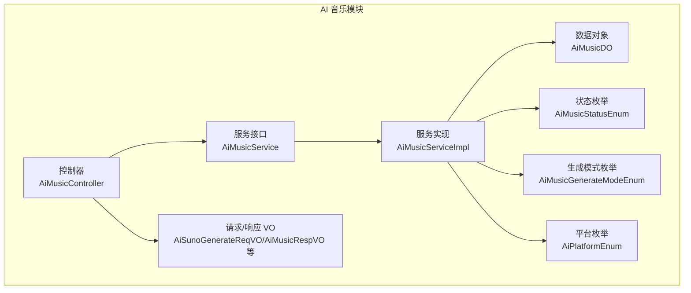
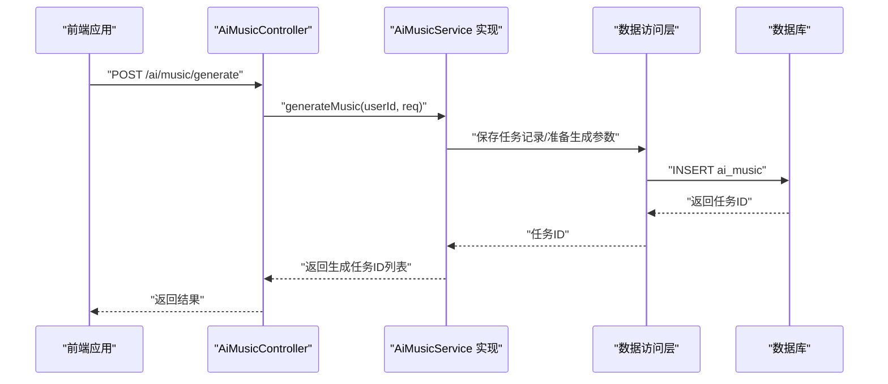
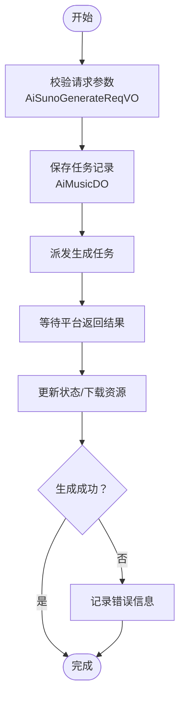
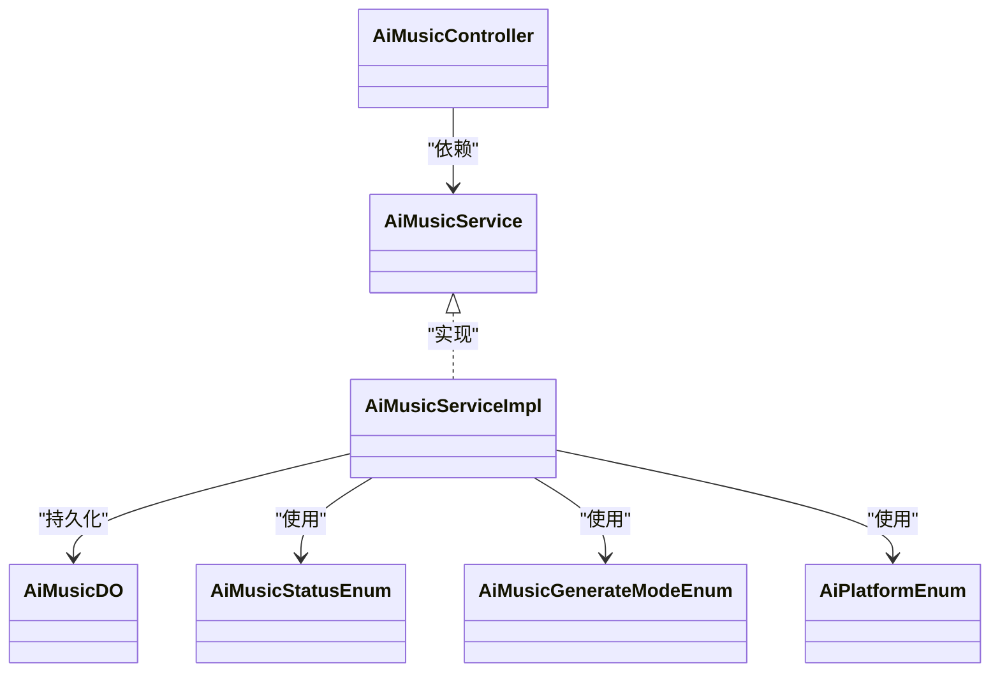

# AI 音乐创作服务

<cite>
**本文引用的文件**
- [AiMusicController.java](file://backend/yudao-module-ai/src/main/java/cn/iocoder/yudao/module/ai/controller/admin/music/AiMusicController.java)
- [AiMusicService.java](file://backend/yudao-module-ai/src/main/java/cn/iocoder/yudao/module/ai/service/music/AiMusicService.java)
- [AiMusicServiceImpl.java](file://backend/yudao-module-ai/src/main/java/cn/iocoder/yudao/module/ai/service/music/AiMusicServiceImpl.java)
- [AiMusicDO.java](file://backend/yudao-module-ai/src/main/java/cn/iocoder/yudao/module/ai/dal/dataobject/music/AiMusicDO.java)
- [AiSunoGenerateReqVO.java](file://backend/yudao-module-ai/src/main/java/cn/iocoder/yudao/module/ai/controller/admin/music/vo/AiSunoGenerateReqVO.java)
- [AiMusicPageReqVO.java](file://backend/yudao-module-ai/src/main/java/cn/iocoder/yudao/module/ai/controller/admin/music/vo/AiMusicPageReqVO.java)
- [AiMusicRespVO.java](file://backend/yudao-module-ai/src/main/java/cn/iocoder/yudao/module/ai/controller/admin/music/vo/AiMusicRespVO.java)
- [AiMusicUpdateReqVO.java](file://backend/yudao-module-ai/src/main/java/cn/iocoder/yudao/module/ai/controller/admin/music/vo/AiMusicUpdateReqVO.java)
- [AiMusicUpdateMyReqVO.java](file://backend/yudao-module-ai/src/main/java/cn/iocoder/yudao/module/ai/controller/admin/music/vo/AiMusicUpdateMyReqVO.java)
- [AiMusicStatusEnum.java](file://backend/yudao-module-ai/src/main/java/cn/iocoder/yudao/module/ai/enums/music/AiMusicStatusEnum.java)
- [AiMusicGenerateModeEnum.java](file://backend/yudao-module-ai/src/main/java/cn/iocoder/yudao/module/ai/enums/music/AiMusicGenerateModeEnum.java)
- [AiPlatformEnum.java](file://backend/yudao-module-ai/src/main/java/cn/iocoder/yudao/module/ai/enums/model/AiPlatformEnum.java)
</cite>

## 目录
1. [简介](#简介)
2. [项目结构](#项目结构)
3. [核心组件](#核心组件)
4. [架构总览](#架构总览)
5. [详细组件分析](#详细组件分析)
6. [依赖分析](#依赖分析)
7. [性能考虑](#性能考虑)
8. [故障排除指南](#故障排除指南)
9. [结论](#结论)
10. [附录](#附录)

## 简介
本文件为“AI 音乐创作服务”的综合技术文档，面向开发者与产品运营人员，系统性阐述音乐生成的技术架构、支持的音乐风格与创作参数配置、工作流程、音频处理与质量评估机制、存储管理与格式转换、播放优化策略、接口使用方法（含批量生成与异步处理）、版权与内容审核、用户体验优化以及在营销推广、活动背景音乐、个性化音效等场景的应用价值。

## 项目结构
后端采用模块化分层设计，AI 音乐模块位于 yudao-module-ai 下，遵循 Controller-Service-DAL 的分层架构，配合 VO/DTO 对象进行请求与响应的数据传输控制。

图表来源
- [AiMusicController.java:1-99](file://backend/yudao-module-ai/src/main/java/cn/iocoder/yudao/module/ai/controller/admin/music/AiMusicController.java#L1-L99)
- [AiMusicService.java:1-88](file://backend/yudao-module-ai/src/main/java/cn/iocoder/yudao/module/ai/service/music/AiMusicService.java#L1-L88)
- [AiMusicServiceImpl.java](file://backend/yudao-module-ai/src/main/java/cn/iocoder/yudao/module/ai/service/music/AiMusicServiceImpl.java)
- [AiMusicDO.java:1-120](file://backend/yudao-module-ai/src/main/java/cn/iocoder/yudao/module/ai/dal/dataobject/music/AiMusicDO.java#L1-L120)
- [AiSunoGenerateReqVO.java](file://backend/yudao-module-ai/src/main/java/cn/iocoder/yudao/module/ai/controller/admin/music/vo/AiSunoGenerateReqVO.java)
- [AiMusicStatusEnum.java](file://backend/yudao-module-ai/src/main/java/cn/iocoder/yudao/module/ai/enums/music/AiMusicStatusEnum.java)
- [AiMusicGenerateModeEnum.java](file://backend/yudao-module-ai/src/main/java/cn/iocoder/yudao/module/ai/enums/music/AiMusicGenerateModeEnum.java)
- [AiPlatformEnum.java](file://backend/yudao-module-ai/src/main/java/cn/iocoder/yudao/module/ai/enums/model/AiPlatformEnum.java)

章节来源
- [AiMusicController.java:1-99](file://backend/yudao-module-ai/src/main/java/cn/iocoder/yudao/module/ai/controller/admin/music/AiMusicController.java#L1-L99)
- [AiMusicService.java:1-88](file://backend/yudao-module-ai/src/main/java/cn/iocoder/yudao/module/ai/service/music/AiMusicService.java#L1-L88)
- [AiMusicServiceImpl.java](file://backend/yudao-module-ai/src/main/java/cn/iocoder/yudao/module/ai/service/music/AiMusicServiceImpl.java)
- [AiMusicDO.java:1-120](file://backend/yudao-module-ai/src/main/java/cn/iocoder/yudao/module/ai/dal/dataobject/music/AiMusicDO.java#L1-L120)

## 核心组件
- 控制器层：提供 REST 接口，负责鉴权、参数校验、调用服务层并返回结果。
- 服务层：定义业务契约（生成、同步、分页、更新、删除等），实现具体流程编排。
- 数据访问层：以 DO 表示音乐实体，承载字段如用户 ID、标题、歌词、图片/音频/视频地址、状态、生成模式、描述词、平台、模型、标签、时长、公开状态、任务编号、错误信息等。
- VO 层：封装请求与响应参数，确保接口输入输出清晰可控。
- 枚举层：统一状态、生成模式与平台标识，保证一致性与可维护性。

章节来源
- [AiMusicController.java:23-99](file://backend/yudao-module-ai/src/main/java/cn/iocoder/yudao/module/ai/controller/admin/music/AiMusicController.java#L23-L99)
- [AiMusicService.java:10-88](file://backend/yudao-module-ai/src/main/java/cn/iocoder/yudao/module/ai/service/music/AiMusicService.java#L10-L88)
- [AiMusicDO.java:16-119](file://backend/yudao-module-ai/src/main/java/cn/iocoder/yudao/module/ai/dal/dataobject/music/AiMusicDO.java#L16-L119)

## 架构总览
AI 音乐服务采用典型的分层架构，前端通过 HTTP 接口与后端交互；后端控制器接收请求，调用服务层执行业务逻辑；服务层协调数据持久化与外部平台对接；数据对象映射到数据库表 ai_music。

图表来源
- [AiMusicController.java:38-42](file://backend/yudao-module-ai/src/main/java/cn/iocoder/yudao/module/ai/controller/admin/music/AiMusicController.java#L38-L42)
- [AiMusicService.java:17-24](file://backend/yudao-module-ai/src/main/java/cn/iocoder/yudao/module/ai/service/music/AiMusicService.java#L17-L24)
- [AiMusicServiceImpl.java](file://backend/yudao-module-ai/src/main/java/cn/iocoder/yudao/module/ai/service/music/AiMusicServiceImpl.java)
- [AiMusicDO.java:24-119](file://backend/yudao-module-ai/src/main/java/cn/iocoder/yudao/module/ai/dal/dataobject/music/AiMusicDO.java#L24-L119)

## 详细组件分析

### 控制器层（AiMusicController）
- 提供以下接口能力：
  - 生成音乐：POST /ai/music/generate
  - 获取我的音乐分页：GET /ai/music/my-page
  - 获取我的单条音乐：GET /ai/music/get-my
  - 修改我的音乐（仅标题）：POST /ai/music/update-my
  - 删除我的音乐：DELETE /ai/music/delete-my
  - 管理员视角：分页查询、更新、删除音乐（权限控制）

- 关键特性
  - 使用 VO 进行参数校验与封装
  - 基于登录用户上下文进行数据隔离
  - 权限注解保障管理员操作安全

章节来源
- [AiMusicController.java:31-99](file://backend/yudao-module-ai/src/main/java/cn/iocoder/yudao/module/ai/controller/admin/music/AiMusicController.java#L31-L99)

### 服务层（AiMusicService 与 AiMusicServiceImpl）
- 服务接口定义了核心业务契约：
  - generateMusic：发起音乐生成任务，返回任务ID列表
  - syncMusic：同步音乐任务状态
  - updateMusic / updateMyMusic：更新音乐信息（标题等）
  - deleteMusic / deleteMusicMy：删除音乐记录
  - getMusic / getMusicPage / getMusicMyPage：查询音乐

- 实现要点
  - 与数据对象 AiMusicDO 对接，完成持久化
  - 统一使用枚举值控制状态与生成模式
  - 与平台枚举对接，适配不同生成平台

章节来源
- [AiMusicService.java:10-88](file://backend/yudao-module-ai/src/main/java/cn/iocoder/yudao/module/ai/service/music/AiMusicService.java#L10-L88)
- [AiMusicServiceImpl.java](file://backend/yudao-module-ai/src/main/java/cn/iocoder/yudao/module/ai/service/music/AiMusicServiceImpl.java)

### 数据对象层（AiMusicDO）
- 字段说明（节选）
  - 基础信息：id、userId、title、lyric、imageUrl、audioUrl、videoUrl
  - 业务状态：status（AiMusicStatusEnum）、generateMode（AiMusicGenerateModeEnum）、publicStatus
  - 生成参数：description、platform（AiPlatformEnum）、model、tags（List<String>）、duration
  - 任务与异常：taskId、errorMessage
  - 时间戳：BaseDO 中的创建/更新时间

- 设计特点
  - tags 使用 JacksonTypeHandler 存储 JSON 数组
  - 支持多数据库序列号配置

章节来源
- [AiMusicDO.java:16-119](file://backend/yudao-module-ai/src/main/java/cn/iocoder/yudao/module/ai/dal/dataobject/music/AiMusicDO.java#L16-L119)

### 枚举层（AiMusicStatusEnum、AiMusicGenerateModeEnum、AiPlatformEnum）
- 状态枚举：统一管理音乐生成状态（如待生成、生成中、成功、失败等）
- 生成模式枚举：区分不同生成策略或模式
- 平台枚举：标识对接的 AI 音乐生成平台

章节来源
- [AiMusicStatusEnum.java](file://backend/yudao-module-ai/src/main/java/cn/iocoder/yudao/module/ai/enums/music/AiMusicStatusEnum.java)
- [AiMusicGenerateModeEnum.java](file://backend/yudao-module-ai/src/main/java/cn/iocoder/yudao/module/ai/enums/music/AiMusicGenerateModeEnum.java)
- [AiPlatformEnum.java](file://backend/yudao-module-ai/src/main/java/cn/iocoder/yudao/module/ai/enums/model/AiPlatformEnum.java)

### VO 层（请求/响应参数）
- 生成请求：AiSunoGenerateReqVO（包含描述词、风格标签、时长、平台、模型等）
- 分页请求：AiMusicPageReqVO
- 响应对象：AiMusicRespVO（封装展示字段）
- 管理更新：AiMusicUpdateReqVO
- 我的音乐更新：AiMusicUpdateMyReqVO

章节来源
- [AiSunoGenerateReqVO.java](file://backend/yudao-module-ai/src/main/java/cn/iocoder/yudao/module/ai/controller/admin/music/vo/AiSunoGenerateReqVO.java)
- [AiMusicPageReqVO.java](file://backend/yudao-module-ai/src/main/java/cn/iocoder/yudao/module/ai/controller/admin/music/vo/AiMusicPageReqVO.java)
- [AiMusicRespVO.java](file://backend/yudao-module-ai/src/main/java/cn/iocoder/yudao/module/ai/controller/admin/music/vo/AiMusicRespVO.java)
- [AiMusicUpdateReqVO.java](file://backend/yudao-module-ai/src/main/java/cn/iocoder/yudao/module/ai/controller/admin/music/vo/AiMusicUpdateReqVO.java)
- [AiMusicUpdateMyReqVO.java](file://backend/yudao-module-ai/src/main/java/cn/iocoder/yudao/module/ai/controller/admin/music/vo/AiMusicUpdateMyReqVO.java)

### 音乐生成工作流程

图表来源
- [AiMusicController.java:38-42](file://backend/yudao-module-ai/src/main/java/cn/iocoder/yudao/module/ai/controller/admin/music/AiMusicController.java#L38-L42)
- [AiMusicService.java:17-31](file://backend/yudao-module-ai/src/main/java/cn/iocoder/yudao/module/ai/service/music/AiMusicService.java#L17-L31)
- [AiMusicDO.java:67-117](file://backend/yudao-module-ai/src/main/java/cn/iocoder/yudao/module/ai/dal/dataobject/music/AiMusicDO.java#L67-L117)

## 依赖分析
- 控制器依赖服务接口，服务实现依赖数据对象与枚举
- VO 对象作为接口契约，避免直接暴露 DO
- 枚举统一状态与模式，降低耦合度

图表来源
- [AiMusicController.java:28-29](file://backend/yudao-module-ai/src/main/java/cn/iocoder/yudao/module/ai/controller/admin/music/AiMusicController.java#L28-L29)
- [AiMusicService.java:15-15](file://backend/yudao-module-ai/src/main/java/cn/iocoder/yudao/module/ai/service/music/AiMusicService.java#L15-L15)
- [AiMusicServiceImpl.java](file://backend/yudao-module-ai/src/main/java/cn/iocoder/yudao/module/ai/service/music/AiMusicServiceImpl.java)
- [AiMusicDO.java:24-119](file://backend/yudao-module-ai/src/main/java/cn/iocoder/yudao/module/ai/dal/dataobject/music/AiMusicDO.java#L24-L119)
- [AiMusicStatusEnum.java](file://backend/yudao-module-ai/src/main/java/cn/iocoder/yudao/module/ai/enums/music/AiMusicStatusEnum.java)
- [AiMusicGenerateModeEnum.java](file://backend/yudao-module-ai/src/main/java/cn/iocoder/yudao/module/ai/enums/music/AiMusicGenerateModeEnum.java)
- [AiPlatformEnum.java](file://backend/yudao-module-ai/src/main/java/cn/iocoder/yudao/module/ai/enums/model/AiPlatformEnum.java)

## 性能考虑
- 批量生成：接口支持一次提交多个生成请求，服务层按批次派发，减少往返开销
- 异步处理：生成过程建议采用消息队列或定时任务异步推进，避免阻塞请求线程
- 分页查询：对大表分页查询时，建议结合索引与筛选条件，控制每页大小
- 缓存策略：对热门风格标签、平台配置等静态数据进行缓存，降低重复计算
- 存储优化：音频/视频资源建议使用对象存储并开启 CDN 加速，缩短播放延迟

## 故障排除指南
- 常见问题
  - 生成失败：检查 AiMusicDO.errorMessage 字段，定位平台返回的错误原因
  - 权限不足：管理员接口需具备相应权限注解，确认登录用户角色
  - 参数校验失败：核对 AiSunoGenerateReqVO 字段是否完整且符合规范
- 建议排查步骤
  - 查看服务日志与链路追踪
  - 核对数据库 ai_music 记录的状态与任务编号
  - 验证平台接入配置与凭据有效性

章节来源
- [AiMusicDO.java:115-117](file://backend/yudao-module-ai/src/main/java/cn/iocoder/yudao/module/ai/dal/dataobject/music/AiMusicDO.java#L115-L117)
- [AiMusicController.java:75-88](file://backend/yudao-module-ai/src/main/java/cn/iocoder/yudao/module/ai/controller/admin/music/AiMusicController.java#L75-L88)

## 结论
AI 音乐创作服务通过清晰的分层架构与标准化的 VO/DO/枚举设计，实现了从请求到生成再到存储的完整闭环。结合异步与缓存策略，可在保证用户体验的同时提升系统吞吐与稳定性。未来可进一步完善风格标签体系、质量评估指标与版权合规机制，以满足更广泛的商业化应用场景。

## 附录

### 接口使用方法与参数说明
- 生成音乐
  - 方法：POST /ai/music/generate
  - 请求体：AiSunoGenerateReqVO（描述词、风格标签、时长、平台、模型等）
  - 返回：生成任务ID列表
- 获取我的音乐分页
  - 方法：GET /ai/music/my-page
  - 查询参数：AiMusicPageReqVO
  - 返回：分页结果 AiMusicRespVO
- 获取我的单条音乐
  - 方法：GET /ai/music/get-my?id=xxx
  - 返回：AiMusicRespVO 或空
- 修改我的音乐（仅标题）
  - 方法：POST /ai/music/update-my
  - 请求体：AiMusicUpdateMyReqVO
- 删除我的音乐
  - 方法：DELETE /ai/music/delete-my?id=xxx
- 管理员接口（需权限）
  - 分页查询：GET /ai/music/page
  - 更新音乐：PUT /ai/music/update
  - 删除音乐：DELETE /ai/music/delete

章节来源
- [AiMusicController.java:31-99](file://backend/yudao-module-ai/src/main/java/cn/iocoder/yudao/module/ai/controller/admin/music/AiMusicController.java#L31-L99)
- [AiSunoGenerateReqVO.java](file://backend/yudao-module-ai/src/main/java/cn/iocoder/yudao/module/ai/controller/admin/music/vo/AiSunoGenerateReqVO.java)
- [AiMusicPageReqVO.java](file://backend/yudao-module-ai/src/main/java/cn/iocoder/yudao/module/ai/controller/admin/music/vo/AiMusicPageReqVO.java)
- [AiMusicRespVO.java](file://backend/yudao-module-ai/src/main/java/cn/iocoder/yudao/module/ai/controller/admin/music/vo/AiMusicRespVO.java)
- [AiMusicUpdateMyReqVO.java](file://backend/yudao-module-ai/src/main/java/cn/iocoder/yudao/module/ai/controller/admin/music/vo/AiMusicUpdateMyReqVO.java)

### 支持的音乐风格与创作参数配置
- 风格标签：AiMusicDO.tags（List<String>），用于表达音乐风格、情绪、场景等
- 创作参数：AiSunoGenerateReqVO（描述词、时长、平台、模型等）
- 状态与模式：AiMusicStatusEnum、AiMusicGenerateModeEnum
- 平台：AiPlatformEnum（用于选择不同生成平台）

章节来源
- [AiMusicDO.java:96-97](file://backend/yudao-module-ai/src/main/java/cn/iocoder/yudao/module/ai/dal/dataobject/music/AiMusicDO.java#L96-L97)
- [AiSunoGenerateReqVO.java](file://backend/yudao-module-ai/src/main/java/cn/iocoder/yudao/module/ai/controller/admin/music/vo/AiSunoGenerateReqVO.java)
- [AiMusicStatusEnum.java](file://backend/yudao-module-ai/src/main/java/cn/iocoder/yudao/module/ai/enums/music/AiMusicStatusEnum.java)
- [AiMusicGenerateModeEnum.java](file://backend/yudao-module-ai/src/main/java/cn/iocoder/yudao/module/ai/enums/music/AiMusicGenerateModeEnum.java)
- [AiPlatformEnum.java](file://backend/yudao-module-ai/src/main/java/cn/iocoder/yudao/module/ai/enums/model/AiPlatformEnum.java)

### 存储管理、格式转换与播放优化
- 存储管理：使用对象存储保存音频/视频资源，数据库仅存元数据与资源地址
- 格式转换：根据平台能力与播放端需求，统一转换为目标格式（如 MP3、M4A）
- 播放优化：CDN 加速、分片加载、预加载策略、自适应码率（视前端播放器而定）

### 版权管理与内容审核
- 内容审核：生成前对敏感词与违规内容进行过滤；生成后对音频进行合规检测
- 版权标注：在 AiMusicDO 中记录平台、模型、任务编号等溯源信息
- 用户授权：仅允许本人查看与修改自己的音乐记录

章节来源
- [AiMusicController.java:52-61](file://backend/yudao-module-ai/src/main/java/cn/iocoder/yudao/module/ai/controller/admin/music/AiMusicController.java#L52-L61)
- [AiMusicDO.java:37-117](file://backend/yudao-module-ai/src/main/java/cn/iocoder/yudao/module/ai/dal/dataobject/music/AiMusicDO.java#L37-L117)

### 应用场景价值
- 营销推广：为短视频、直播、电商带货提供背景音乐与品牌音效
- 活动背景音乐：节日庆典、促销活动、品牌发布会等定制化音乐
- 个性化音效：游戏、APP、小程序等场景的动态音效与主题曲