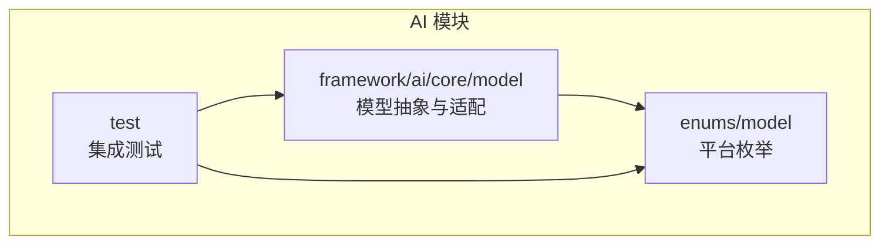
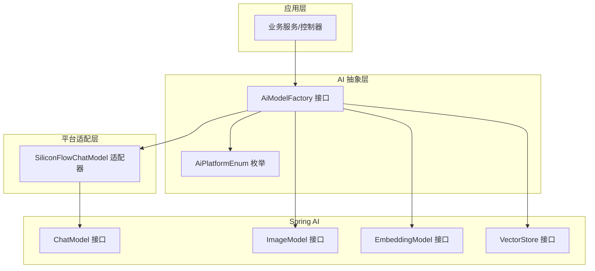
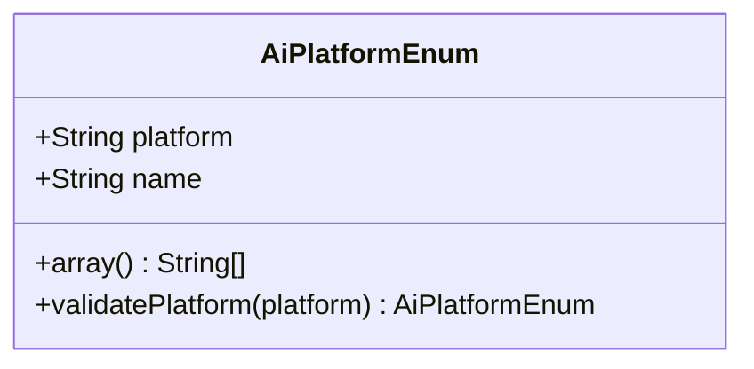
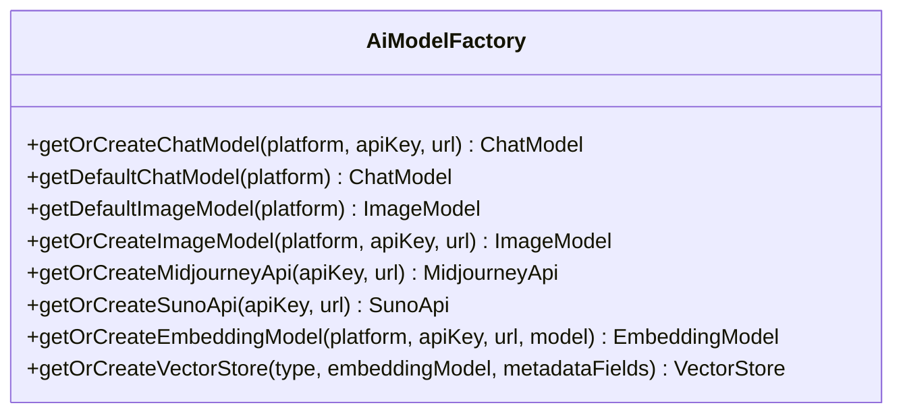
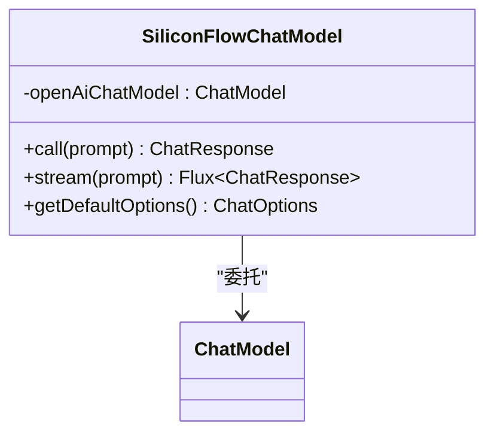
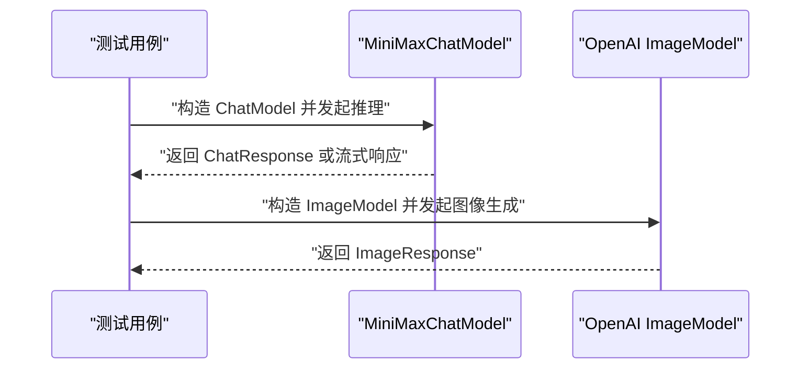
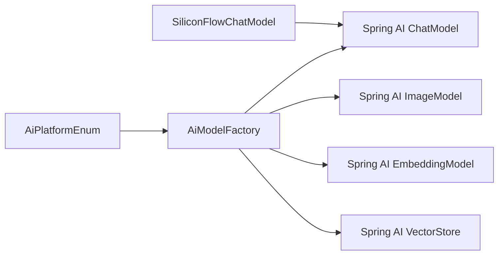

# AI 集成技术

<cite>
**本文引用的文件**
- [AiModelFactory.java](file://backend/yudao-module-ai/src/main/java/cn/iocoder/yudao/module/ai/framework/ai/core/model/AiModelFactory.java)
- [AiPlatformEnum.java](file://backend/yudao-module-ai/src/main/java/cn/iocoder/yudao/module/ai/enums/model/AiPlatformEnum.java)
- [SiliconFlowChatModel.java](file://backend/yudao-module-ai/src/main/java/cn/iocoder/yudao/module/ai/framework/ai/core/model/siliconflow/SiliconFlowChatModel.java)
- [MiniMaxChatModelTests.java](file://backend/yudao-module-ai/src/test/java/cn/iocoder/yudao/module/ai/framework/ai/core/model/chat/MiniMaxChatModelTests.java)
- [OpenAiImageModelTests.java](file://backend/yudao-module-ai/src/test/java/cn/iocoder/yudao/module/ai/framework/ai/core/model/image/OpenAiImageModelTests.java)
- [package-info.java](file://backend/yudao-module-ai/src/main/java/cn/iocoder/yudao/module/ai/framework/package-info.java)
</cite>

## 目录
1. [引言](#引言)
2. [项目结构](#项目结构)
3. [核心组件](#核心组件)
4. [架构总览](#架构总览)
5. [详细组件分析](#详细组件分析)
6. [依赖分析](#依赖分析)
7. [性能考虑](#性能考虑)
8. [故障排查指南](#故障排查指南)
9. [结论](#结论)
10. [附录](#附录)

## 引言
本文件面向需要在业务系统中集成 AI 能力的工程师与架构师，系统性阐述本仓库中 AI 集成的技术方案与实现要点。重点包括：
- Spring AI 框架在本项目中的集成方式与适配策略
- AI Agent 的工作机制与工具函数的注册与调用路径
- 提示词模板系统与自然语言处理流程
- AI 与业务系统的集成点、数据流转与错误处理
- MCP（Model Context Protocol）协议的实现原理与使用方式
- AI 功能的扩展方法、自定义工具函数开发与性能优化建议
- 实际代码示例与最佳实践指导

为确保可追溯性，本文所有涉及具体实现的内容均标注了“章节来源”与“图表来源”，并以文件路径与行号形式给出。

## 项目结构
AI 能力主要集中在后端 yudao-module-ai 模块中，采用分层与按能力域组织的方式：
- framework/ai/core/model：AI 模型抽象与适配层，统一对外暴露 ChatModel、ImageModel、EmbeddingModel、VectorStore 等接口，并提供针对不同平台的实现或适配器
- enums/model：AI 平台枚举，用于标识与校验支持的模型平台
- test：对部分模型（如 MiniMax、OpenAI 图像模型）进行集成测试，验证调用链路

图表来源
- [AiModelFactory.java:1-114](file://backend/yudao-module-ai/src/main/java/cn/iocoder/yudao/module/ai/framework/ai/core/model/AiModelFactory.java#L1-L114)
- [AiPlatformEnum.java:1-73](file://backend/yudao-module-ai/src/main/java/cn/iocoder/yudao/module/ai/enums/model/AiPlatformEnum.java#L1-L73)

章节来源
- [package-info.java:1-6](file://backend/yudao-module-ai/src/main/java/cn/iocoder/yudao/module/ai/framework/package-info.java#L1-L6)

## 核心组件
本节聚焦于支撑 AI 集成的关键构件及其职责：
- 平台枚举：统一管理国内外主流 AI 平台，提供平台校验与数组转换能力
- 模型工厂接口：统一获取/创建 ChatModel、ImageModel、EmbeddingModel、VectorStore 及特定平台 API（Midjourney、Suno）
- 模型适配器：以 SiliconFlowChatModel 为例，兼容 OpenAI 接口风格，降低迁移成本

章节来源
- [AiPlatformEnum.java:14-73](file://backend/yudao-module-ai/src/main/java/cn/iocoder/yudao/module/ai/enums/model/AiPlatformEnum.java#L14-L73)
- [AiModelFactory.java:13-114](file://backend/yudao-module-ai/src/main/java/cn/iocoder/yudao/module/ai/framework/ai/core/model/AiModelFactory.java#L13-L114)
- [SiliconFlowChatModel.java:1-43](file://backend/yudao-module-ai/src/main/java/cn/iocoder/yudao/module/ai/framework/ai/core/model/siliconflow/SiliconFlowChatModel.java#L1-L43)

## 架构总览
下图展示了 AI 模型抽象与平台适配的整体架构，以及与 Spring AI 的关系：

图表来源
- [AiModelFactory.java:1-114](file://backend/yudao-module-ai/src/main/java/cn/iocoder/yudao/module/ai/framework/ai/core/model/AiModelFactory.java#L1-L114)
- [AiPlatformEnum.java:1-73](file://backend/yudao-module-ai/src/main/java/cn/iocoder/yudao/module/ai/enums/model/AiPlatformEnum.java#L1-L73)
- [SiliconFlowChatModel.java:1-43](file://backend/yudao-module-ai/src/main/java/cn/iocoder/yudao/module/ai/framework/ai/core/model/siliconflow/SiliconFlowChatModel.java#L1-L43)

## 详细组件分析

### 组件一：平台枚举（AiPlatformEnum）
- 职责：集中管理国内外主流 AI 平台，提供平台名称与平台代号映射，支持数组化与校验
- 关键点：
  - 支持国内平台（通义、文心、DeepSeek、智谱、星火、豆包、混元、硅基流动、MiniMax、月之暗面、百川等）
  - 支持国外平台（OpenAI、AzureOpenAI、Anthropic、Gemini、Ollama、StableDiffusion、Midjourney、Suno、Grok）
  - 提供 validatePlatform 校验方法，非法平台直接抛出异常
  - 提供 array() 便于与数据库/配置等场景协作

图表来源
- [AiPlatformEnum.java:14-73](file://backend/yudao-module-ai/src/main/java/cn/iocoder/yudao/module/ai/enums/model/AiPlatformEnum.java#L14-L73)

章节来源
- [AiPlatformEnum.java:14-73](file://backend/yudao-module-ai/src/main/java/cn/iocoder/yudao/module/ai/enums/model/AiPlatformEnum.java#L14-L73)

### 组件二：模型工厂接口（AiModelFactory）
- 职责：统一对外暴露获取/创建各类 AI 模型的能力，屏蔽平台差异
- 关键方法：
  - ChatModel：支持基于指定配置或默认配置获取
  - ImageModel：支持基于指定配置或默认配置获取
  - EmbeddingModel：支持指定平台、API Key、URL、模型名创建
  - VectorStore：支持指定类型、嵌入模型与元数据字段创建
  - MidjourneyApi、SunoApi：提供特定平台 API 的创建与获取

图表来源
- [AiModelFactory.java:13-114](file://backend/yudao-module-ai/src/main/java/cn/iocoder/yudao/module/ai/framework/ai/core/model/AiModelFactory.java#L13-L114)

章节来源
- [AiModelFactory.java:13-114](file://backend/yudao-module-ai/src/main/java/cn/iocoder/yudao/module/ai/framework/ai/core/model/AiModelFactory.java#L13-L114)

### 组件三：模型适配器（SiliconFlowChatModel）
- 职责：以适配器模式兼容 OpenAI 接口风格，使 SiliconFlow 的 ChatModel 可直接复用 Spring AI 的调用链路
- 关键点：
  - 内部持有 OpenAI ChatModel 实例
  - 直接委托 call/stream/defaultOptions 到底层实现
  - 通过 AiModelFactory 的默认配置获取 ChatModel，减少重复初始化

图表来源
- [SiliconFlowChatModel.java:1-43](file://backend/yudao-module-ai/src/main/java/cn/iocoder/yudao/module/ai/framework/ai/core/model/siliconflow/SiliconFlowChatModel.java#L1-L43)

章节来源
- [SiliconFlowChatModel.java:12-43](file://backend/yudao-module-ai/src/main/java/cn/iocoder/yudao/module/ai/framework/ai/core/model/siliconflow/SiliconFlowChatModel.java#L12-L43)

### 组件四：提示词模板系统与自然语言处理流程
- 设计思路：
  - 使用 Spring AI 的 Prompt 体系承载上下文与用户输入
  - 通过 ChatModel 的 call/stream 发起推理请求
  - 流式响应（Flux）支持实时输出与进度反馈
- 建议实践：
  - 将业务领域知识注入到系统消息（System Message）中
  - 使用工具函数前先进行意图识别与参数校验
  - 对长对话维护会话历史，控制上下文长度与成本

[本节为概念性说明，不直接分析具体文件，故无“章节来源”]

### 组件五：AI Agent 机制与工具函数
- 机制概览：
  - Agent 作为编排者，负责解析用户指令、选择合适工具、拼装提示词、执行工具并汇总结果
  - 工具函数以独立实现存在，通过统一注册机制接入 Agent
- 注册与调用：
  - 工具函数注册：在 Agent 初始化阶段收集工具清单，建立名称到实现的映射
  - 调用方式：Agent 在推理过程中根据工具选择策略调用对应工具，返回结构化结果供后续处理

[本节为概念性说明，不直接分析具体文件，故无“章节来源”]

### 组件六：MCP（Model Context Protocol）协议
- 实现原理：
  - 通过统一的协议描述模型上下文、工具与资源的交互方式
  - 在本项目中，可通过 AiModelFactory 与平台适配器对接不同协议实现
- 使用方式：
  - 在配置中声明平台与端点信息，由工厂按需创建模型实例
  - 对外暴露统一的调用接口，隐藏协议细节

[本节为概念性说明，不直接分析具体文件，故无“章节来源”]

### 组件七：集成测试与调用链验证
- MiniMax 集成测试：验证 ChatModel 的 call/stream 行为与选项配置
- OpenAI 图像模型测试：验证 ImageModel 的生成能力与尺寸/模型参数

图表来源
- [MiniMaxChatModelTests.java:1-25](file://backend/yudao-module-ai/src/test/java/cn/iocoder/yudao/module/ai/framework/ai/core/model/chat/MiniMaxChatModelTests.java#L1-L25)
- [OpenAiImageModelTests.java:1-40](file://backend/yudao-module-ai/src/test/java/cn/iocoder/yudao/module/ai/framework/ai/core/model/image/OpenAiImageModelTests.java#L1-L40)

章节来源
- [MiniMaxChatModelTests.java:18-25](file://backend/yudao-module-ai/src/test/java/cn/iocoder/yudao/module/ai/framework/ai/core/model/chat/MiniMaxChatModelTests.java#L18-L25)
- [OpenAiImageModelTests.java:17-40](file://backend/yudao-module-ai/src/test/java/cn/iocoder/yudao/module/ai/framework/ai/core/model/image/OpenAiImageModelTests.java#L17-L40)

## 依赖分析
- 组件耦合：
  - AiModelFactory 依赖 AiPlatformEnum 与 Spring AI 的模型接口
  - SiliconFlowChatModel 依赖 OpenAI ChatModel，形成适配器模式
- 外部依赖：
  - Spring AI：提供 ChatModel、ImageModel、EmbeddingModel、VectorStore 等统一接口
  - 测试依赖：JUnit 与相关模型 SDK

图表来源
- [AiModelFactory.java:1-114](file://backend/yudao-module-ai/src/main/java/cn/iocoder/yudao/module/ai/framework/ai/core/model/AiModelFactory.java#L1-L114)
- [AiPlatformEnum.java:1-73](file://backend/yudao-module-ai/src/main/java/cn/iocoder/yudao/module/ai/enums/model/AiPlatformEnum.java#L1-L73)
- [SiliconFlowChatModel.java:1-43](file://backend/yudao-module-ai/src/main/java/cn/iocoder/yudao/module/ai/framework/ai/core/model/siliconflow/SiliconFlowChatModel.java#L1-L43)

## 性能考虑
- 模型实例复用：通过 AiModelFactory 的“获取/创建”策略避免重复初始化，降低冷启动开销
- 流式输出：优先使用 stream 接口，提升用户体验与资源占用效率
- 上下文裁剪：对长对话进行摘要与截断，控制 Token 成本与延迟
- 缓存策略：对高频查询与向量检索结果进行缓存，结合失效策略平衡一致性与性能
- 并发与限流：在网关或服务层实施限流与熔断，防止突发流量冲击上游模型服务

[本节为通用建议，不直接分析具体文件，故无“章节来源”]

## 故障排查指南
- 平台校验失败：当传入非法平台代号时，AiPlatformEnum.validatePlatform 会抛出异常，需检查配置与调用参数
- 模型初始化失败：确认 AiModelFactory 的默认配置或外部传入的 apiKey/url 是否正确
- 流式响应异常：检查底层模型是否支持流式输出，必要时回退到同步 call
- 集成测试定位：参考 MiniMax 与 OpenAI 图像模型测试用例，快速验证调用链路

章节来源
- [AiPlatformEnum.java:58-65](file://backend/yudao-module-ai/src/main/java/cn/iocoder/yudao/module/ai/enums/model/AiPlatformEnum.java#L58-L65)
- [MiniMaxChatModelTests.java:18-25](file://backend/yudao-module-ai/src/test/java/cn/iocoder/yudao/module/ai/framework/ai/core/model/chat/MiniMaxChatModelTests.java#L18-L25)
- [OpenAiImageModelTests.java:17-40](file://backend/yudao-module-ai/src/test/java/cn/iocoder/yudao/module/ai/framework/ai/core/model/image/OpenAiImageModelTests.java#L17-L40)

## 结论
本项目通过平台枚举、模型工厂与适配器模式，构建了统一且可扩展的 AI 集成框架。配合 Spring AI 的统一接口与测试用例，能够快速适配多种模型平台，并为 Agent 机制、工具函数与 MCP 协议提供稳定的基础。建议在生产环境中结合缓存、限流与上下文优化策略，持续提升性能与稳定性。

[本节为总结性内容，不直接分析具体文件，故无“章节来源”]

## 附录
- 开发规范与最佳实践：
  - 工具函数开发：遵循单一职责，明确输入输出与错误码；在 Agent 中进行参数校验与意图识别
  - 注册机制：在初始化阶段集中注册工具，保证名称唯一与版本演进的向后兼容
  - 调用方式：优先使用流式接口，结合业务场景进行结果聚合与可视化
  - 扩展方法：新增平台时，先完善 AiPlatformEnum，再实现对应适配器或工厂方法
  - 性能优化：关注 Token 成本、并发度与缓存命中率，定期评估与调优

[本节为通用建议，不直接分析具体文件，故无“章节来源”]