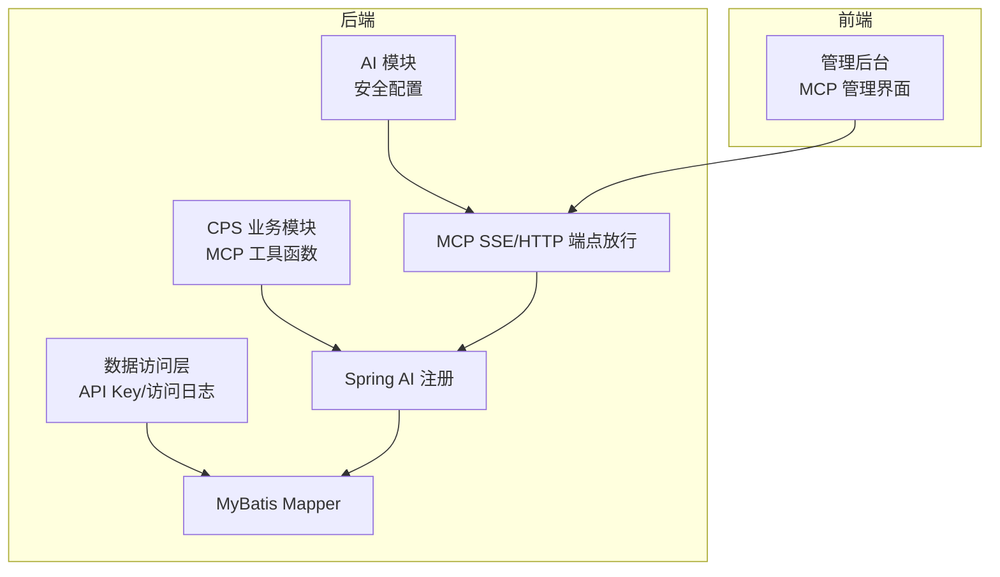
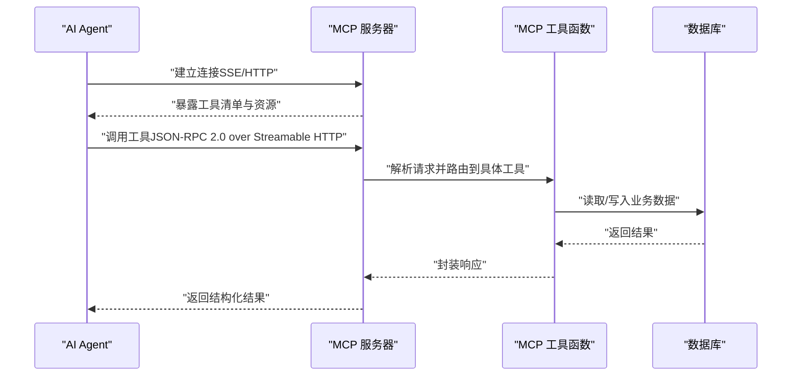
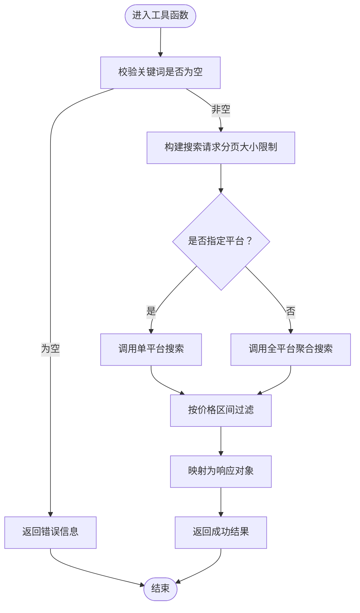
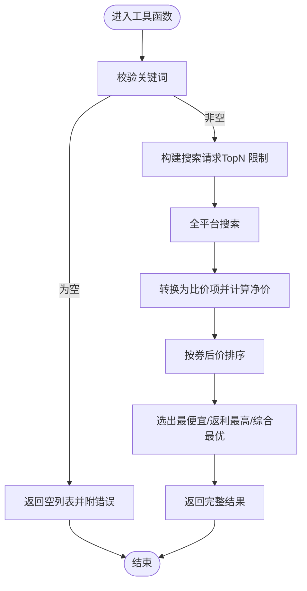
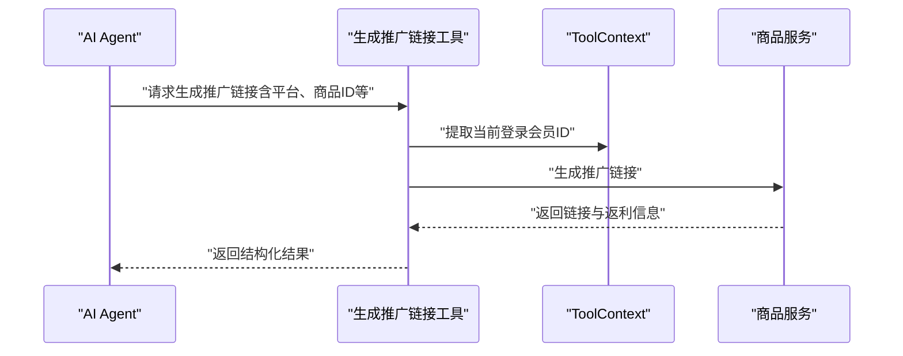
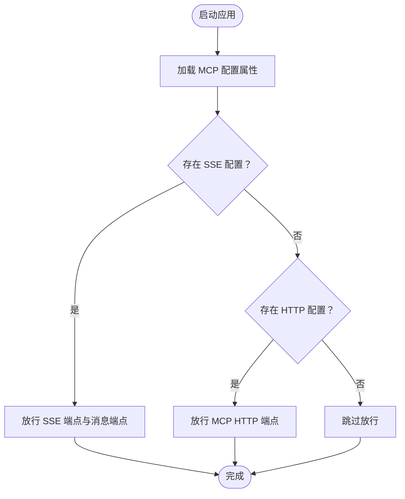
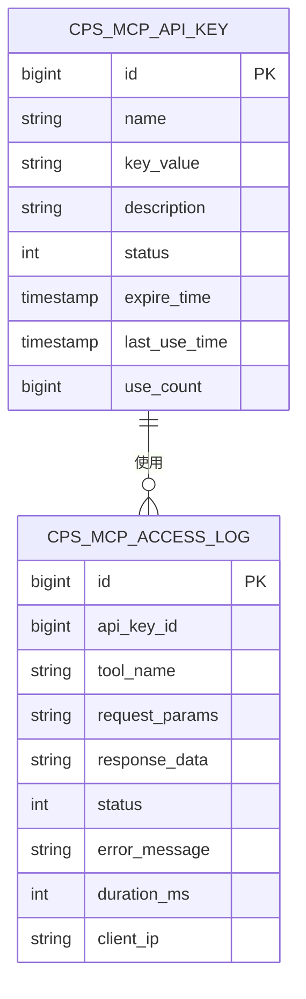
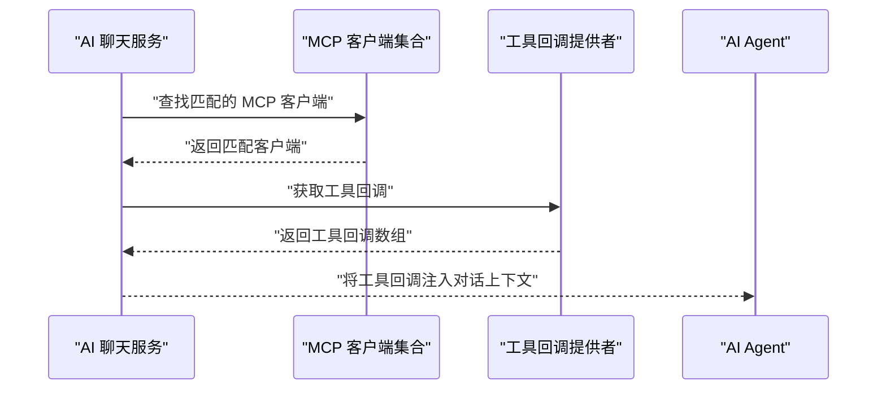
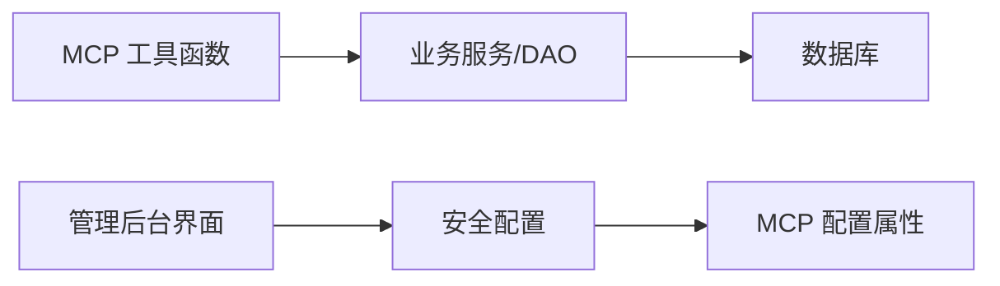

# MCP 协议实现

<cite>
**本文档引用的文件**
- [AGENTS.md](file://AGENTS.md)
- [README.md](file://README.md)
- [CpsSearchGoodsToolFunction.java](file://backend/yudao-module-cps/yudao-module-cps-biz/src/main/java/cn/iocoder/yudao/module/cps/mcp/tool/CpsSearchGoodsToolFunction.java)
- [CpsComparePricesToolFunction.java](file://backend/yudao-module-cps/yudao-module-cps-biz/src/main/java/cn/iocoder/yudao/module/cps/mcp/tool/CpsComparePricesToolFunction.java)
- [CpsGenerateLinkToolFunction.java](file://backend/yudao-module-cps/yudao-module-cps-biz/src/main/java/cn/iocoder/yudao/module/cps/mcp/tool/CpsGenerateLinkToolFunction.java)
- [CpsQueryOrdersToolFunction.java](file://backend/yudao-module-cps/yudao-module-cps-biz/src/main/java/cn/iocoder/yudao/module/cps/mcp/tool/CpsQueryOrdersToolFunction.java)
- [CpsGetRebateSummaryToolFunction.java](file://backend/yudao-module-cps/yudao-module-cps-biz/src/main/java/cn/iocoder/yudao/module/cps/mcp/tool/CpsGetRebateSummaryToolFunction.java)
- [CpsMcpApiKeyDO.java](file://backend/yudao-module-cps/yudao-module-cps-biz/src/main/java/cn/iocoder/yudao/module/cps/dal/dataobject/mcp/CpsMcpApiKeyDO.java)
- [CpsMcpAccessLogDO.java](file://backend/yudao-module-cps/yudao-module-cps-biz/src/main/java/cn/iocoder/yudao/module/cps/dal/dataobject/mcp/CpsMcpAccessLogDO.java)
- [CpsMcpApiKeyMapper.java](file://backend/yudao-module-cps/yudao-module-cps-biz/src/main/java/cn/iocoder/yudao/module/cps/dal/mysql/mcp/CpsMcpApiKeyMapper.java)
- [CpsMcpAccessLogMapper.java](file://backend/yudao-module-cps/yudao-module-cps-biz/src/main/java/cn/iocoder/yudao/module/cps/dal/mysql/mcp/CpsMcpAccessLogMapper.java)
- [SecurityConfiguration.java](file://backend/yudao-module-ai/src/main/java/cn/iocoder/yudao/module/ai/framework/security/config/SecurityConfiguration.java)
- [AiChatMessageServiceImpl.java](file://backend/yudao-module-ai/src/main/java/cn/iocoder/yudao/module/ai/service/chat/AiChatMessageServiceImpl.java)
- [CPS系统PRD文档.md](file://docs/CPS系统PRD文档.md)
</cite>

## 目录
1. [简介](#简介)
2. [项目结构](#项目结构)
3. [核心组件](#核心组件)
4. [架构总览](#架构总览)
5. [详细组件分析](#详细组件分析)
6. [依赖关系分析](#依赖关系分析)
7. [性能考虑](#性能考虑)
8. [故障排查指南](#故障排查指南)
9. [结论](#结论)
10. [附录](#附录)

## 简介
本文件面向希望理解并使用 MCP（Model Context Protocol）协议在 AgenticCPS 系统中的实现与集成的读者。文档覆盖以下主题：
- MCP 协议核心概念与在本项目中的落地方式
- 服务器端与客户端的配置、连接与通信机制
- 工具函数注册、资源管理与消息传递格式
- 与 Spring MVC/Spring AI 的集成方式
- SSE 服务器配置与异常处理
- 实际使用示例、调试方法与性能优化建议
- 在 AI Agent 中的应用场景与价值

## 项目结构
AgenticCPS 将 MCP 作为 AI Agent 与业务系统交互的桥梁，主要分布在以下位置：
- 后端模块：yudao-module-cps-biz/mcp/tool 下定义了多个 MCP 工具函数
- 安全与路由：yudao-module-ai/framework/security 下对 MCP SSE 与 Streamable HTTP 端点进行放行
- 数据模型与持久化：yudao-module-cps-biz/dal 下的 MCP API Key 与访问日志实体与 Mapper
- 文档与配置：AGENTS.md 与 PRD 文档明确了 MCP 的端点、权限与管理界面

**图表来源**
- [AGENTS.md:161-169](file://AGENTS.md#L161-L169)
- [SecurityConfiguration.java:25-40](file://backend/yudao-module-ai/src/main/java/cn/iocoder/yudao/module/ai/framework/security/config/SecurityConfiguration.java#L25-L40)

**章节来源**
- [AGENTS.md:161-169](file://AGENTS.md#L161-L169)
- [AGENTS.md:224-225](file://AGENTS.md#L224-L225)

## 核心组件
- MCP 工具函数：提供搜索商品、跨平台比价、生成推广链接、查询订单、返利汇总等能力
- 安全配置：对 MCP SSE 与 Streamable HTTP 端点进行放行，允许 AI Agent 连接
- 数据模型：API Key 与访问日志，支撑鉴权、限流与审计
- 集成服务：AI Chat 服务在对话流程中动态发现并绑定 MCP 工具回调

**章节来源**
- [CpsSearchGoodsToolFunction.java:28](file://backend/yudao-module-cps/yudao-module-cps-biz/src/main/java/cn/iocoder/yudao/module/cps/mcp/tool/CpsSearchGoodsToolFunction.java#L28)
- [CpsComparePricesToolFunction.java:30](file://backend/yudao-module-cps/yudao-module-cps-biz/src/main/java/cn/iocoder/yudao/module/cps/mcp/tool/CpsComparePricesToolFunction.java#L30)
- [CpsGenerateLinkToolFunction.java:27](file://backend/yudao-module-cps/yudao-module-cps-biz/src/main/java/cn/iocoder/yudao/module/cps/mcp/tool/CpsGenerateLinkToolFunction.java#L27)
- [CpsQueryOrdersToolFunction.java:33](file://backend/yudao-module-cps/yudao-module-cps-biz/src/main/java/cn/iocoder/yudao/module/cps/mcp/tool/CpsQueryOrdersToolFunction.java#L33)
- [CpsGetRebateSummaryToolFunction.java:32](file://backend/yudao-module-cps/yudao-module-cps-biz/src/main/java/cn/iocoder/yudao/module/cps/mcp/tool/CpsGetRebateSummaryToolFunction.java#L32)
- [SecurityConfiguration.java:25-40](file://backend/yudao-module-ai/src/main/java/cn/iocoder/yudao/module/ai/framework/security/config/SecurityConfiguration.java#L25-L40)
- [AiChatMessageServiceImpl.java:414-425](file://backend/yudao-module-ai/src/main/java/cn/iocoder/yudao/module/ai/service/chat/AiChatMessageServiceImpl.java#L414-L425)

## 架构总览
MCP 在本项目中的运行方式如下：
- 服务器端：基于 Spring AI 的 MCP Server，通过 Streamable HTTP 提供 JSON-RPC 2.0 接口，端点为 /mcp/cps
- 客户端：AI Agent 通过该端点注册工具、请求资源与执行工具调用
- 安全控制：对 SSE 与 Streamable HTTP 端点进行放行，配合 API Key 与权限控制
- 数据与日志：API Key 与访问日志用于鉴权、限流与审计

**图表来源**
- [AGENTS.md:167-169](file://AGENTS.md#L167-L169)
- [SecurityConfiguration.java:30-37](file://backend/yudao-module-ai/src/main/java/cn/iocoder/yudao/module/ai/framework/security/config/SecurityConfiguration.java#L30-L37)

## 详细组件分析

### MCP 工具函数：商品搜索
- 功能：在淘宝/京东/拼多多/抖音平台搜索商品，支持关键词、平台筛选、分页与价格区间过滤
- 输入参数：关键词、平台编码、分页大小、价格上下限
- 输出结构：总数、商品列表（含平台编码、标题、图片、原价、券后价、返利等）
- 错误处理：空关键词直接返回错误；异常捕获并返回错误信息

**图表来源**
- [CpsSearchGoodsToolFunction.java:120-174](file://backend/yudao-module-cps/yudao-module-cps-biz/src/main/java/cn/iocoder/yudao/module/cps/mcp/tool/CpsSearchGoodsToolFunction.java#L120-L174)

**章节来源**
- [CpsSearchGoodsToolFunction.java:28](file://backend/yudao-module-cps/yudao-module-cps-biz/src/main/java/cn/iocoder/yudao/module/cps/mcp/tool/CpsSearchGoodsToolFunction.java#L28)
- [CpsSearchGoodsToolFunction.java:37-59](file://backend/yudao-module-cps/yudao-module-cps-biz/src/main/java/cn/iocoder/yudao/module/cps/mcp/tool/CpsSearchGoodsToolFunction.java#L37-L59)
- [CpsSearchGoodsToolFunction.java:64-118](file://backend/yudao-module-cps/yudao-module-cps-biz/src/main/java/cn/iocoder/yudao/module/cps/mcp/tool/CpsSearchGoodsToolFunction.java#L64-L118)

### MCP 工具函数：跨平台比价
- 功能：在所有启用平台搜索同一关键词，按券后价、返利、净价排序，推荐最优购买方案
- 输入参数：关键词、TopN
- 输出结构：总数量、最便宜商品、返利最高商品、综合最优商品、完整列表

**图表来源**
- [CpsComparePricesToolFunction.java:113-173](file://backend/yudao-module-cps/yudao-module-cps-biz/src/main/java/cn/iocoder/yudao/module/cps/mcp/tool/CpsComparePricesToolFunction.java#L113-L173)

**章节来源**
- [CpsComparePricesToolFunction.java:30](file://backend/yudao-module-cps/yudao-module-cps-biz/src/main/java/cn/iocoder/yudao/module/cps/mcp/tool/CpsComparePricesToolFunction.java#L30)
- [CpsComparePricesToolFunction.java:39-49](file://backend/yudao-module-cps/yudao-module-cps-biz/src/main/java/cn/iocoder/yudao/module/cps/mcp/tool/CpsComparePricesToolFunction.java#L39-L49)
- [CpsComparePricesToolFunction.java:54-111](file://backend/yudao-module-cps/yudao-module-cps-biz/src/main/java/cn/iocoder/yudao/module/cps/mcp/tool/CpsComparePricesToolFunction.java#L54-L111)

### MCP 工具函数：生成推广链接
- 功能：为指定商品生成带返利追踪的推广链接，支持短链、长链、口令、移动端链接等
- 输入参数：平台编码、商品ID、商品签名（拼多多）、会员ID（可选）、推广位ID（可选）
- 上下文：通过 ToolContext 获取当前登录会员ID，实现订单归因
- 输出结构：短链、长链、口令、移动端链接、券后价、返利信息

**图表来源**
- [CpsGenerateLinkToolFunction.java:97-139](file://backend/yudao-module-cps/yudao-module-cps-biz/src/main/java/cn/iocoder/yudao/module/cps/mcp/tool/CpsGenerateLinkToolFunction.java#L97-L139)

**章节来源**
- [CpsGenerateLinkToolFunction.java:27](file://backend/yudao-module-cps/yudao-module-cps-biz/src/main/java/cn/iocoder/yudao/module/cps/mcp/tool/CpsGenerateLinkToolFunction.java#L27)
- [CpsGenerateLinkToolFunction.java:39-61](file://backend/yudao-module-cps/yudao-module-cps-biz/src/main/java/cn/iocoder/yudao/module/cps/mcp/tool/CpsGenerateLinkToolFunction.java#L39-L61)
- [CpsGenerateLinkToolFunction.java:66-95](file://backend/yudao-module-cps/yudao-module-cps-biz/src/main/java/cn/iocoder/yudao/module/cps/mcp/tool/CpsGenerateLinkToolFunction.java#L66-L95)

### MCP 工具函数：查询会员订单
- 功能：查询当前登录会员的订单列表及返利状态
- 输入参数：平台编码（可选）、订单状态（可选）、页码、分页大小
- 上下文：通过 ToolContext 获取当前登录会员ID
- 输出结构：总记录数、订单列表（含平台订单号、商品信息、返利金额、状态等）

**章节来源**
- [CpsQueryOrdersToolFunction.java:33](file://backend/yudao-module-cps/yudao-module-cps-biz/src/main/java/cn/iocoder/yudao/module/cps/mcp/tool/CpsQueryOrdersToolFunction.java#L33)
- [CpsQueryOrdersToolFunction.java:44-62](file://backend/yudao-module-cps/yudao-module-cps-biz/src/main/java/cn/iocoder/yudao/module/cps/mcp/tool/CpsQueryOrdersToolFunction.java#L44-L62)
- [CpsQueryOrdersToolFunction.java:67-117](file://backend/yudao-module-cps/yudao-module-cps-biz/src/main/java/cn/iocoder/yudao/module/cps/mcp/tool/CpsQueryOrdersToolFunction.java#L67-L117)

### MCP 工具函数：返利账户汇总
- 功能：查询当前登录会员的返利账户余额、待结算金额、累计返利总额、最近返利记录
- 输入参数：最近记录条数（可选）
- 上下文：通过 ToolContext 获取当前登录会员ID
- 输出结构：可用余额、冻结余额、累计返利、已提现金额、账户状态、最近记录列表

**章节来源**
- [CpsGetRebateSummaryToolFunction.java:32](file://backend/yudao-module-cps/yudao-module-cps-biz/src/main/java/cn/iocoder/yudao/module/cps/mcp/tool/CpsGetRebateSummaryToolFunction.java#L32)
- [CpsGetRebateSummaryToolFunction.java:46-52](file://backend/yudao-module-cps/yudao-module-cps-biz/src/main/java/cn/iocoder/yudao/module/cps/mcp/tool/CpsGetRebateSummaryToolFunction.java#L46-L52)
- [CpsGetRebateSummaryToolFunction.java:57-105](file://backend/yudao-module-cps/yudao-module-cps-biz/src/main/java/cn/iocoder/yudao/module/cps/mcp/tool/CpsGetRebateSummaryToolFunction.java#L57-L105)

### 安全与路由配置（Spring Security）
- 放行路径：根据 MCP SSE 与 Streamable HTTP 配置，对 SSE 端点与消息端点、MCP HTTP 端点进行放行
- 作用：允许 AI Agent 以无认证方式建立连接与传输消息，同时结合 API Key 实现业务级鉴权

**图表来源**
- [SecurityConfiguration.java:25-40](file://backend/yudao-module-ai/src/main/java/cn/iocoder/yudao/module/ai/framework/security/config/SecurityConfiguration.java#L25-L40)

**章节来源**
- [SecurityConfiguration.java:25-40](file://backend/yudao-module-ai/src/main/java/cn/iocoder/yudao/module/ai/framework/security/config/SecurityConfiguration.java#L25-L40)

### 数据模型与持久化
- API Key 实体：包含名称、密钥值、状态、过期时间、最后使用时间、累计调用次数等字段
- 访问日志实体：包含 API Key ID、调用工具名、请求参数、响应摘要、状态、错误信息、耗时、客户端IP 等字段
- Mapper：提供按密钥值查询 API Key 与通用的基础 Mapper 能力

**图表来源**
- [CpsMcpApiKeyDO.java:24-60](file://backend/yudao-module-cps/yudao-module-cps-biz/src/main/java/cn/iocoder/yudao/module/cps/dal/dataobject/mcp/CpsMcpApiKeyDO.java#L24-L60)
- [CpsMcpAccessLogDO.java:22-62](file://backend/yudao-module-cps/yudao-module-cps-biz/src/main/java/cn/iocoder/yudao/module/cps/dal/dataobject/mcp/CpsMcpAccessLogDO.java#L22-L62)
- [CpsMcpApiKeyMapper.java:13-19](file://backend/yudao-module-cps/yudao-module-cps-biz/src/main/java/cn/iocoder/yudao/module/cps/dal/mysql/mcp/CpsMcpApiKeyMapper.java#L13-L19)
- [CpsMcpAccessLogMapper.java:12-15](file://backend/yudao-module-cps/yudao-module-cps-biz/src/main/java/cn/iocoder/yudao/module/cps/dal/mysql/mcp/CpsMcpAccessLogMapper.java#L12-L15)

**章节来源**
- [CpsMcpApiKeyDO.java:24-60](file://backend/yudao-module-cps/yudao-module-cps-biz/src/main/java/cn/iocoder/yudao/module/cps/dal/dataobject/mcp/CpsMcpApiKeyDO.java#L24-L60)
- [CpsMcpAccessLogDO.java:22-62](file://backend/yudao-module-cps/yudao-module-cps-biz/src/main/java/cn/iocoder/yudao/module/cps/dal/dataobject/mcp/CpsMcpAccessLogDO.java#L22-L62)
- [CpsMcpApiKeyMapper.java:13-19](file://backend/yudao-module-cps/yudao-module-cps-biz/src/main/java/cn/iocoder/yudao/module/cps/dal/mysql/mcp/CpsMcpApiKeyMapper.java#L13-L19)
- [CpsMcpAccessLogMapper.java:12-15](file://backend/yudao-module-cps/yudao-module-cps-biz/src/main/java/cn/iocoder/yudao/module/cps/dal/mysql/mcp/CpsMcpAccessLogMapper.java#L12-L15)

### 与 Spring MVC 的集成与工具注册
- AI Chat 服务在对话流程中，会根据配置匹配对应的 MCP 客户端，并动态收集工具回调，注入到对话上下文中
- 这使得 AI Agent 可以在运行时发现并调用 MCP 工具，无需硬编码

**图表来源**
- [AiChatMessageServiceImpl.java:414-425](file://backend/yudao-module-ai/src/main/java/cn/iocoder/yudao/module/ai/service/chat/AiChatMessageServiceImpl.java#L414-L425)

**章节来源**
- [AiChatMessageServiceImpl.java:414-425](file://backend/yudao-module-ai/src/main/java/cn/iocoder/yudao/module/ai/service/chat/AiChatMessageServiceImpl.java#L414-L425)

## 依赖关系分析
- 工具函数依赖：各工具函数通过服务层（如商品服务、订单 Mapper、返利服务）访问业务数据
- 安全配置依赖：Spring Security 的 AuthorizeRequestsCustomizer 依赖 MCP 配置属性以决定放行哪些端点
- 数据访问依赖：API Key 与访问日志通过 MyBatis Mapper 进行持久化

**图表来源**
- [CpsSearchGoodsToolFunction.java:32-33](file://backend/yudao-module-cps/yudao-module-cps-biz/src/main/java/cn/iocoder/yudao/module/cps/mcp/tool/CpsSearchGoodsToolFunction.java#L32-L33)
- [SecurityConfiguration.java:20-24](file://backend/yudao-module-ai/src/main/java/cn/iocoder/yudao/module/ai/framework/security/config/SecurityConfiguration.java#L20-L24)

**章节来源**
- [CpsSearchGoodsToolFunction.java:32-33](file://backend/yudao-module-cps/yudao-module-cps-biz/src/main/java/cn/iocoder/yudao/module/cps/mcp/tool/CpsSearchGoodsToolFunction.java#L32-L33)
- [SecurityConfiguration.java:20-24](file://backend/yudao-module-ai/src/main/java/cn/iocoder/yudao/module/ai/framework/security/config/SecurityConfiguration.java#L20-L24)

## 性能考虑
- 工具调用性能：搜索与比价工具对分页与价格过滤进行了限制，避免超大数据集返回
- 端点放行：仅对必要的 SSE 与 HTTP 端点放行，减少不必要的安全开销
- 日志与审计：访问日志记录耗时与状态，便于定位慢调用与错误
- 建议：
  - 对高频工具增加缓存（如热门关键词搜索结果）
  - 对跨平台聚合搜索设置合理的 TopN 与超时阈值
  - 对工具参数进行更严格的校验与默认值约束

[本节为通用指导，无需特定文件来源]

## 故障排查指南
- 端点不可访问：确认安全配置是否放行了 SSE 与 MCP HTTP 端点
- 工具调用失败：检查工具输入参数是否符合要求（如关键词、平台编码、商品ID）
- 订单/返利相关工具报“未登录”：确认 ToolContext 是否正确传递了登录用户ID
- 访问日志缺失：检查 API Key 是否正确配置且未过期

**章节来源**
- [SecurityConfiguration.java:30-37](file://backend/yudao-module-ai/src/main/java/cn/iocoder/yudao/module/ai/framework/security/config/SecurityConfiguration.java#L30-L37)
- [CpsGenerateLinkToolFunction.java:98-101](file://backend/yudao-module-cps/yudao-module-cps-biz/src/main/java/cn/iocoder/yudao/module/cps/mcp/tool/CpsGenerateLinkToolFunction.java#L98-L101)
- [CpsQueryOrdersToolFunction.java:121-126](file://backend/yudao-module-cps/yudao-module-cps-biz/src/main/java/cn/iocoder/yudao/module/cps/mcp/tool/CpsQueryOrdersToolFunction.java#L121-L126)
- [CpsGetRebateSummaryToolFunction.java:108-112](file://backend/yudao-module-cps/yudao-module-cps-biz/src/main/java/cn/iocoder/yudao/module/cps/mcp/tool/CpsGetRebateSummaryToolFunction.java#L108-L112)
- [CPS系统PRD文档.md:735-757](file://docs/CPS系统PRD文档.md#L735-L757)

## 结论
AgenticCPS 将 MCP 协议深度集成到系统中，通过工具函数为 AI Agent 提供搜索、比价、推广链接生成、订单查询与返利汇总等能力。配合安全配置、API Key 与访问日志，实现了可审计、可限流、可扩展的 MCP 服务。借助 Spring AI 的工具注册机制，AI Agent 可在运行时动态发现并调用这些工具，真正实现“零代码接入”。

[本节为总结性内容，无需特定文件来源]

## 附录

### MCP 端点与权限说明
- 端点：/mcp/cps（Streamable HTTP）
- SSE 端点：用于实时消息推送
- 权限：API Key 管理与权限级别（public/member/admin）在管理后台配置

**章节来源**
- [AGENTS.md:167-169](file://AGENTS.md#L167-L169)
- [CPS系统PRD文档.md:694-716](file://docs/CPS系统PRD文档.md#L694-L716)