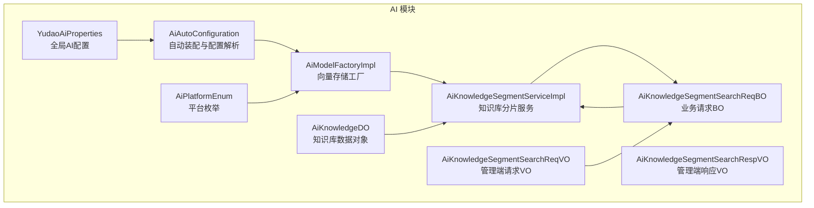
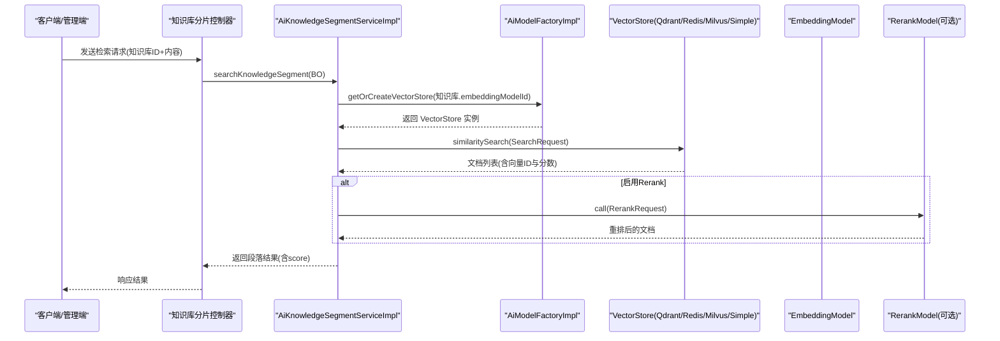
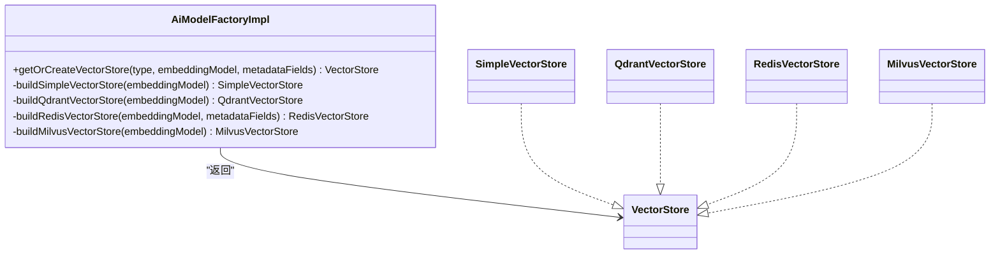
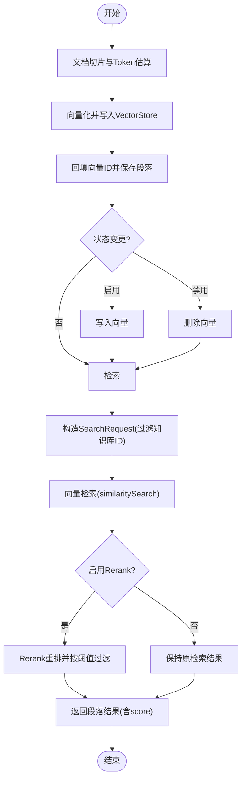
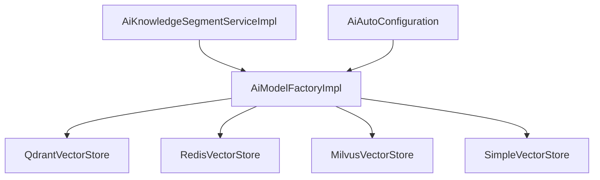

# 向量存储集成

<cite>
**本文引用的文件**
- [AiModelFactoryImpl.java](file://backend/yudao-module-ai/src/main/java/cn/iocoder/yudao/module/ai/framework/ai/core/model/AiModelFactoryImpl.java)
- [AiKnowledgeSegmentServiceImpl.java](file://backend/yudao-module-ai/src/main/java/cn/iocoder/yudao/module/ai/service/knowledge/AiKnowledgeSegmentServiceImpl.java)
- [AiAutoConfiguration.java](file://backend/yudao-module-ai/src/main/java/cn/iocoder/yudao/module/ai/framework/ai/config/AiAutoConfiguration.java)
- [YudaoAiProperties.java](file://backend/yudao-module-ai/src/main/java/cn/iocoder/yudao/module/ai/framework/ai/config/YudaoAiProperties.java)
- [AiKnowledgeSegmentSearchReqBO.java](file://backend/yudao-module-ai/src/main/java/cn/iocoder/yudao/module/ai/service/knowledge/bo/AiKnowledgeSegmentSearchReqBO.java)
- [AiKnowledgeSegmentSearchReqVO.java](file://backend/yudao-module-ai/src/main/java/cn/iocoder/yudao/module/ai/controller/admin/knowledge/vo/segment/AiKnowledgeSegmentSearchReqVO.java)
- [AiKnowledgeSegmentSearchRespVO.java](file://backend/yudao-module-ai/src/main/java/cn/iocoder/yudao/module/ai/controller/admin/knowledge/vo/segment/AiKnowledgeSegmentSearchRespVO.java)
- [AiKnowledgeDO.java](file://backend/yudao-module-ai/src/main/java/cn/iocoder/yudao/module/ai/dal/dataobject/knowledge/AiKnowledgeDO.java)
- [AiPlatformEnum.java](file://backend/yudao-module-ai/src/main/java/cn/iocoder/yudao/module/ai/enums/model/AiPlatformEnum.java)
</cite>

## 目录
1. [简介](#简介)
2. [项目结构](#项目结构)
3. [核心组件](#核心组件)
4. [架构总览](#架构总览)
5. [详细组件分析](#详细组件分析)
6. [依赖分析](#依赖分析)
7. [性能考虑](#性能考虑)
8. [故障排查指南](#故障排查指南)
9. [结论](#结论)
10. [附录](#附录)

## 简介
本文件系统化阐述本项目的向量存储集成方案，重点覆盖以下方面：
- 向量存储在 AI 应用中的作用与价值：支撑知识检索、语义搜索、Rerank 重排序等能力。
- 支持的向量数据库类型：Qdrant、Redis、Milvus、SimpleVectorStore（本地 JSON）。
- 配置方式、索引策略与查询优化：包括元数据字段、过滤条件、TopK 与相似度阈值、批处理策略。
- 向量嵌入生成、批量导入与增量更新：文档切片、向量化、写入与删除、重新索引。
- 性能调优、容量规划与故障恢复：批处理、持久化、重试与可观测性。
- 场景应用：知识检索、语义搜索、Rerank 提升召回质量。

## 项目结构
围绕向量存储的关键模块与文件如下：
- 工厂与自动装配：AiAutoConfiguration、AiModelFactoryImpl
- 知识库分片服务：AiKnowledgeSegmentServiceImpl
- 请求/响应对象：AiKnowledgeSegmentSearchReqBO、AiKnowledgeSegmentSearchReqVO、AiKnowledgeSegmentSearchRespVO
- 知识库数据对象：AiKnowledgeDO
- 平台枚举：AiPlatformEnum
- 配置类：YudaoAiProperties

图表来源
- [AiAutoConfiguration.java:54-61](file://backend/yudao-module-ai/src/main/java/cn/iocoder/yudao/module/ai/framework/ai/config/AiAutoConfiguration.java#L54-L61)
- [AiModelFactoryImpl.java:315-335](file://backend/yudao-module-ai/src/main/java/cn/iocoder/yudao/module/ai/framework/ai/core/model/AiModelFactoryImpl.java#L315-L335)
- [AiKnowledgeSegmentServiceImpl.java:227-295](file://backend/yudao-module-ai/src/main/java/cn/iocoder/yudao/module/ai/service/knowledge/AiKnowledgeSegmentServiceImpl.java#L227-L295)
- [AiKnowledgeSegmentSearchReqBO.java:14-39](file://backend/yudao-module-ai/src/main/java/cn/iocoder/yudao/module/ai/service/knowledge/bo/AiKnowledgeSegmentSearchReqBO.java#L14-L39)
- [AiKnowledgeSegmentSearchReqVO.java:10-27](file://backend/yudao-module-ai/src/main/java/cn/iocoder/yudao/module/ai/controller/admin/knowledge/vo/segment/AiKnowledgeSegmentSearchReqVO.java#L10-L27)
- [AiKnowledgeSegmentSearchRespVO.java:6-16](file://backend/yudao-module-ai/src/main/java/cn/iocoder/yudao/module/ai/controller/admin/knowledge/vo/segment/AiKnowledgeSegmentSearchRespVO.java#L6-L16)
- [AiKnowledgeDO.java:16-64](file://backend/yudao-module-ai/src/main/java/cn/iocoder/yudao/module/ai/dal/dataobject/knowledge/AiKnowledgeDO.java#L16-L64)
- [AiPlatformEnum.java:14-73](file://backend/yudao-module-ai/src/main/java/cn/iocoder/yudao/module/ai/enums/model/AiPlatformEnum.java#L14-L73)
- [YudaoAiProperties.java:12-187](file://backend/yudao-module-ai/src/main/java/cn/iocoder/yudao/module/ai/framework/ai/config/YudaoAiProperties.java#L12-L187)

章节来源
- [AiAutoConfiguration.java:54-61](file://backend/yudao-module-ai/src/main/java/cn/iocoder/yudao/module/ai/framework/ai/config/AiAutoConfiguration.java#L54-L61)
- [AiModelFactoryImpl.java:315-335](file://backend/yudao-module-ai/src/main/java/cn/iocoder/yudao/module/ai/framework/ai/core/model/AiModelFactoryImpl.java#L315-L335)
- [AiKnowledgeSegmentServiceImpl.java:227-295](file://backend/yudao-module-ai/src/main/java/cn/iocoder/yudao/module/ai/service/knowledge/AiKnowledgeSegmentServiceImpl.java#L227-L295)

## 核心组件
- 向量存储工厂（AiModelFactoryImpl）
  - 统一创建与缓存 EmbeddingModel 与 VectorStore 实例，支持 SimpleVectorStore、QdrantVectorStore、RedisVectorStore、MilvusVectorStore。
  - 提供定时持久化 SimpleVectorStore、初始化索引 afterPropertiesSet 等能力。
- 知识库分片服务（AiKnowledgeSegmentServiceImpl）
  - 文档切片与向量化、批量导入、增量更新、删除、重新索引。
  - 基于 Embedding + Rerank 的检索流程，支持 TopK 与相似度阈值控制。
- 自动装配与配置（AiAutoConfiguration、YudaoAiProperties）
  - 解析 Qdrant、Redis、Milvus 等向量存储配置，注册 ObservationRegistry、TokenCountEstimator 等基础设施。
- 请求/响应对象与数据对象
  - 管理端请求/响应 VO 与业务请求 BO，知识库 DO 维护 embeddingModelId、topK、相似度阈值等关键参数。

章节来源
- [AiModelFactoryImpl.java:315-335](file://backend/yudao-module-ai/src/main/java/cn/iocoder/yudao/module/ai/framework/ai/core/model/AiModelFactoryImpl.java#L315-L335)
- [AiKnowledgeSegmentServiceImpl.java:94-123](file://backend/yudao-module-ai/src/main/java/cn/iocoder/yudao/module/ai/service/knowledge/AiKnowledgeSegmentServiceImpl.java#L94-L123)
- [AiAutoConfiguration.java:54-61](file://backend/yudao-module-ai/src/main/java/cn/iocoder/yudao/module/ai/framework/ai/config/AiAutoConfiguration.java#L54-L61)
- [YudaoAiProperties.java:12-187](file://backend/yudao-module-ai/src/main/java/cn/iocoder/yudao/module/ai/framework/ai/config/YudaoAiProperties.java#L12-L187)
- [AiKnowledgeSegmentSearchReqBO.java:14-39](file://backend/yudao-module-ai/src/main/java/cn/iocoder/yudao/module/ai/service/knowledge/bo/AiKnowledgeSegmentSearchReqBO.java#L14-L39)
- [AiKnowledgeSegmentSearchReqVO.java:10-27](file://backend/yudao-module-ai/src/main/java/cn/iocoder/yudao/module/ai/controller/admin/knowledge/vo/segment/AiKnowledgeSegmentSearchReqVO.java#L10-L27)
- [AiKnowledgeSegmentSearchRespVO.java:6-16](file://backend/yudao-module-ai/src/main/java/cn/iocoder/yudao/module/ai/controller/admin/knowledge/vo/segment/AiKnowledgeSegmentSearchRespVO.java#L6-L16)
- [AiKnowledgeDO.java:16-64](file://backend/yudao-module-ai/src/main/java/cn/iocoder/yudao/module/ai/dal/dataobject/knowledge/AiKnowledgeDO.java#L16-L64)

## 架构总览
向量存储在系统中的位置与交互如下：

图表来源
- [AiKnowledgeSegmentServiceImpl.java:227-295](file://backend/yudao-module-ai/src/main/java/cn/iocoder/yudao/module/ai/service/knowledge/AiKnowledgeSegmentServiceImpl.java#L227-L295)
- [AiModelFactoryImpl.java:315-335](file://backend/yudao-module-ai/src/main/java/cn/iocoder/yudao/module/ai/framework/ai/core/model/AiModelFactoryImpl.java#L315-L335)

## 详细组件分析

### 向量存储工厂与多数据库支持
- 支持类型
  - SimpleVectorStore：本地 JSON 文件，适合开发/测试；具备定时持久化与启动加载。
  - QdrantVectorStore：通过 QdrantGrpcClient 连接，支持 TLS、API Key；afterPropertiesSet 初始化索引。
  - RedisVectorStore：基于 JedisPooled，支持 metadataFields 类型映射（数值/布尔/文本）；可配置索引名与前缀。
  - MilvusVectorStore：通过 MilvusServiceClient 连接，支持服务端与客户端属性配置；afterPropertiesSet 初始化索引。
- 元数据字段
  - 知识库分片服务中定义了标准元数据键：知识库ID、文档ID、段落ID，并统一以字符串形式写入，兼容不同 VectorStore 的限制。
- 批处理与观测
  - 工厂统一注入 BatchingStrategy、ObservationRegistry、自定义观测约定，提升吞吐与可观测性。

图表来源
- [AiModelFactoryImpl.java:315-335](file://backend/yudao-module-ai/src/main/java/cn/iocoder/yudao/module/ai/framework/ai/core/model/AiModelFactoryImpl.java#L315-L335)
- [AiModelFactoryImpl.java:685-711](file://backend/yudao-module-ai/src/main/java/cn/iocoder/yudao/module/ai/framework/ai/core/model/AiModelFactoryImpl.java#L685-L711)
- [AiModelFactoryImpl.java:717-733](file://backend/yudao-module-ai/src/main/java/cn/iocoder/yudao/module/ai/framework/ai/core/model/AiModelFactoryImpl.java#L717-L733)
- [AiModelFactoryImpl.java:738-767](file://backend/yudao-module-ai/src/main/java/cn/iocoder/yudao/module/ai/framework/ai/core/model/AiModelFactoryImpl.java#L738-L767)
- [AiModelFactoryImpl.java:773-800](file://backend/yudao-module-ai/src/main/java/cn/iocoder/yudao/module/ai/framework/ai/core/model/AiModelFactoryImpl.java#L773-L800)

章节来源
- [AiModelFactoryImpl.java:315-335](file://backend/yudao-module-ai/src/main/java/cn/iocoder/yudao/module/ai/framework/ai/core/model/AiModelFactoryImpl.java#L315-L335)
- [AiModelFactoryImpl.java:685-711](file://backend/yudao-module-ai/src/main/java/cn/iocoder/yudao/module/ai/framework/ai/core/model/AiModelFactoryImpl.java#L685-L711)
- [AiModelFactoryImpl.java:717-733](file://backend/yudao-module-ai/src/main/java/cn/iocoder/yudao/module/ai/framework/ai/core/model/AiModelFactoryImpl.java#L717-L733)
- [AiModelFactoryImpl.java:738-767](file://backend/yudao-module-ai/src/main/java/cn/iocoder/yudao/module/ai/framework/ai/core/model/AiModelFactoryImpl.java#L738-L767)
- [AiModelFactoryImpl.java:773-800](file://backend/yudao-module-ai/src/main/java/cn/iocoder/yudao/module/ai/framework/ai/core/model/AiModelFactoryImpl.java#L773-L800)

### 知识库分片服务：向量化与检索
- 文档切片与向量化
  - 支持自动策略检测（Markdown QA、Markdown、段落、Token），并估算 Token 数。
  - 将切片写入数据库后，向量写入 VectorStore，并回填向量ID。
- 增量更新与删除
  - 更新状态为启用则写入向量；禁用则删除向量。
  - 支持按文档批量删除向量。
- 重新索引
  - 针对知识库下所有启用段落执行删除旧向量与重建向量的流程。
- 检索流程
  - 构造 SearchRequest，设置 TopK 与相似度阈值，支持按知识库ID过滤。
  - 若启用 Rerank，则扩大检索 TopK 并重排，再按阈值过滤。

图表来源
- [AiKnowledgeSegmentServiceImpl.java:94-123](file://backend/yudao-module-ai/src/main/java/cn/iocoder/yudao/module/ai/service/knowledge/AiKnowledgeSegmentServiceImpl.java#L94-L123)
- [AiKnowledgeSegmentServiceImpl.java:160-177](file://backend/yudao-module-ai/src/main/java/cn/iocoder/yudao/module/ai/service/knowledge/AiKnowledgeSegmentServiceImpl.java#L160-L177)
- [AiKnowledgeSegmentServiceImpl.java:180-201](file://backend/yudao-module-ai/src/main/java/cn/iocoder/yudao/module/ai/service/knowledge/AiKnowledgeSegmentServiceImpl.java#L180-L201)
- [AiKnowledgeSegmentServiceImpl.java:227-295](file://backend/yudao-module-ai/src/main/java/cn/iocoder/yudao/module/ai/service/knowledge/AiKnowledgeSegmentServiceImpl.java#L227-L295)

章节来源
- [AiKnowledgeSegmentServiceImpl.java:94-123](file://backend/yudao-module-ai/src/main/java/cn/iocoder/yudao/module/ai/service/knowledge/AiKnowledgeSegmentServiceImpl.java#L94-L123)
- [AiKnowledgeSegmentServiceImpl.java:160-177](file://backend/yudao-module-ai/src/main/java/cn/iocoder/yudao/module/ai/service/knowledge/AiKnowledgeSegmentServiceImpl.java#L160-L177)
- [AiKnowledgeSegmentServiceImpl.java:180-201](file://backend/yudao-module-ai/src/main/java/cn/iocoder/yudao/module/ai/service/knowledge/AiKnowledgeSegmentServiceImpl.java#L180-L201)
- [AiKnowledgeSegmentServiceImpl.java:227-295](file://backend/yudao-module-ai/src/main/java/cn/iocoder/yudao/module/ai/service/knowledge/AiKnowledgeSegmentServiceImpl.java#L227-L295)

### 配置方式与索引策略
- 配置解析
  - AiAutoConfiguration 使用 EnableConfigurationProperties 注册 Qdrant、Redis、Milvus 配置类，确保工厂可从 Spring 获取对应属性。
- 索引初始化
  - 各 VectorStore 在工厂中调用 afterPropertiesSet 完成索引初始化。
- 元数据与过滤
  - 检索时通过 FilterExpressionBuilder 按知识库ID过滤，保证跨知识库隔离。
- 批处理与观测
  - 工厂注入 BatchingStrategy、ObservationRegistry、自定义观测约定，提升吞吐与可观测性。

章节来源
- [AiAutoConfiguration.java:54-61](file://backend/yudao-module-ai/src/main/java/cn/iocoder/yudao/module/ai/framework/ai/config/AiAutoConfiguration.java#L54-L61)
- [AiModelFactoryImpl.java:731-732](file://backend/yudao-module-ai/src/main/java/cn/iocoder/yudao/module/ai/framework/ai/core/model/AiModelFactoryImpl.java#L731-L732)
- [AiModelFactoryImpl.java:765-766](file://backend/yudao-module-ai/src/main/java/cn/iocoder/yudao/module/ai/framework/ai/core/model/AiModelFactoryImpl.java#L765-L766)
- [AiModelFactoryImpl.java:799-800](file://backend/yudao-module-ai/src/main/java/cn/iocoder/yudao/module/ai/framework/ai/core/model/AiModelFactoryImpl.java#L799-L800)
- [AiKnowledgeSegmentServiceImpl.java:279-281](file://backend/yudao-module-ai/src/main/java/cn/iocoder/yudao/module/ai/service/knowledge/AiKnowledgeSegmentServiceImpl.java#L279-L281)

### 查询优化要点
- TopK 与阈值
  - 检索时根据请求或知识库默认值设置 TopK 与相似度阈值；启用 Rerank 时扩大检索 TopK，再重排过滤。
- 过滤表达式
  - 通过知识库ID过滤，避免跨知识库扫描。
- 批量写入与删除
  - 使用批量 add/delete，结合批处理策略提升吞吐。
- Rerank 与 Token 估算
  - 通过 TokenCountEstimator 控制分段大小，减少无效向量；Rerank 提升最终排序质量。

章节来源
- [AiKnowledgeSegmentServiceImpl.java:268-295](file://backend/yudao-module-ai/src/main/java/cn/iocoder/yudao/module/ai/service/knowledge/AiKnowledgeSegmentServiceImpl.java#L268-L295)
- [AiKnowledgeSegmentServiceImpl.java:279-281](file://backend/yudao-module-ai/src/main/java/cn/iocoder/yudao/module/ai/service/knowledge/AiKnowledgeSegmentServiceImpl.java#L279-L281)
- [AiKnowledgeSegmentServiceImpl.java:439-447](file://backend/yudao-module-ai/src/main/java/cn/iocoder/yudao/module/ai/service/knowledge/AiKnowledgeSegmentServiceImpl.java#L439-L447)

### 向量嵌入生成、批量导入与增量更新
- 嵌入模型
  - 工厂支持多种平台的 EmbeddingModel（如通义、文心、智谱、MiniMax、OpenAI、AzureOpenAI、Ollama），并缓存复用。
- 批量导入
  - 文档切片完成后，逐段向量化并批量写入 VectorStore，同时回填向量ID。
- 增量更新
  - 更新状态为启用则写入向量；禁用则删除向量；支持按文档批量删除。
- 重新索引
  - 针对知识库下所有启用段落执行删除旧向量与重建向量的流程。

章节来源
- [AiModelFactoryImpl.java:291-313](file://backend/yudao-module-ai/src/main/java/cn/iocoder/yudao/module/ai/framework/ai/core/model/AiModelFactoryImpl.java#L291-L313)
- [AiKnowledgeSegmentServiceImpl.java:94-123](file://backend/yudao-module-ai/src/main/java/cn/iocoder/yudao/module/ai/service/knowledge/AiKnowledgeSegmentServiceImpl.java#L94-L123)
- [AiKnowledgeSegmentServiceImpl.java:160-177](file://backend/yudao-module-ai/src/main/java/cn/iocoder/yudao/module/ai/service/knowledge/AiKnowledgeSegmentServiceImpl.java#L160-L177)
- [AiKnowledgeSegmentServiceImpl.java:180-201](file://backend/yudao-module-ai/src/main/java/cn/iocoder/yudao/module/ai/service/knowledge/AiKnowledgeSegmentServiceImpl.java#L180-L201)

### 场景应用：知识检索与语义搜索
- 管理端检索接口
  - 管理端请求 VO 包含知识库ID、内容、TopK、相似度阈值，服务层转换为 BO 并执行检索。
- 结果封装
  - 响应 VO 包含文档名称与相似度分数，便于前端展示。

章节来源
- [AiKnowledgeSegmentSearchReqVO.java:10-27](file://backend/yudao-module-ai/src/main/java/cn/iocoder/yudao/module/ai/controller/admin/knowledge/vo/segment/AiKnowledgeSegmentSearchReqVO.java#L10-L27)
- [AiKnowledgeSegmentSearchRespVO.java:6-16](file://backend/yudao-module-ai/src/main/java/cn/iocoder/yudao/module/ai/controller/admin/knowledge/vo/segment/AiKnowledgeSegmentSearchRespVO.java#L6-L16)
- [AiKnowledgeSegmentServiceImpl.java:227-259](file://backend/yudao-module-ai/src/main/java/cn/iocoder/yudao/module/ai/service/knowledge/AiKnowledgeSegmentServiceImpl.java#L227-L259)

## 依赖分析
- 组件耦合
  - AiKnowledgeSegmentServiceImpl 依赖 AiModelFactoryImpl 获取 VectorStore 实例，依赖知识库与文档服务进行数据一致性校验。
  - AiAutoConfiguration 作为装配入口，负责配置解析与基础设施 Bean 注册。
- 外部依赖
  - Qdrant、Redis、Milvus 客户端；Spring AI VectorStore 抽象；ObservationRegistry 与 BatchingStrategy。

图表来源
- [AiKnowledgeSegmentServiceImpl.java:333-340](file://backend/yudao-module-ai/src/main/java/cn/iocoder/yudao/module/ai/service/knowledge/AiKnowledgeSegmentServiceImpl.java#L333-L340)
- [AiModelFactoryImpl.java:315-335](file://backend/yudao-module-ai/src/main/java/cn/iocoder/yudao/module/ai/framework/ai/core/model/AiModelFactoryImpl.java#L315-L335)
- [AiAutoConfiguration.java:54-61](file://backend/yudao-module-ai/src/main/java/cn/iocoder/yudao/module/ai/framework/ai/config/AiAutoConfiguration.java#L54-L61)

章节来源
- [AiKnowledgeSegmentServiceImpl.java:333-340](file://backend/yudao-module-ai/src/main/java/cn/iocoder/yudao/module/ai/service/knowledge/AiKnowledgeSegmentServiceImpl.java#L333-L340)
- [AiModelFactoryImpl.java:315-335](file://backend/yudao-module-ai/src/main/java/cn/iocoder/yudao/module/ai/framework/ai/core/model/AiModelFactoryImpl.java#L315-L335)
- [AiAutoConfiguration.java:54-61](file://backend/yudao-module-ai/src/main/java/cn/iocoder/yudao/module/ai/framework/ai/config/AiAutoConfiguration.java#L54-L61)

## 性能考虑
- 批处理策略
  - 工厂注入 BatchingStrategy，配合 VectorStore 的批处理能力，显著提升写入/查询吞吐。
- 观测与指标
  - 通过 ObservationRegistry 与自定义观测约定，采集向量操作指标，便于定位性能瓶颈。
- Rerank 优化
  - 启用 Rerank 时扩大检索 TopK，再重排过滤，平衡召回质量与性能。
- 本地存储与持久化
  - SimpleVectorStore 定时持久化（每分钟）与关闭钩子，保障数据安全但需评估磁盘 IO。
- Token 估算与分段
  - 使用 TokenCountEstimator 控制分段大小，避免过长导致向量质量下降与内存压力。

章节来源
- [AiModelFactoryImpl.java:699-710](file://backend/yudao-module-ai/src/main/java/cn/iocoder/yudao/module/ai/framework/ai/core/model/AiModelFactoryImpl.java#L699-L710)
- [AiKnowledgeSegmentServiceImpl.java:274-275](file://backend/yudao-module-ai/src/main/java/cn/iocoder/yudao/module/ai/service/knowledge/AiKnowledgeSegmentServiceImpl.java#L274-L275)
- [AiKnowledgeSegmentServiceImpl.java:439-447](file://backend/yudao-module-ai/src/main/java/cn/iocoder/yudao/module/ai/service/knowledge/AiKnowledgeSegmentServiceImpl.java#L439-L447)

## 故障排查指南
- 向量检索无结果
  - 检查知识库ID过滤是否正确；确认 TopK 与相似度阈值设置；若启用 Rerank，确认扩大检索 TopK 是否生效。
- 向量写入失败
  - 校验向量存储初始化是否成功（afterPropertiesSet）；检查元数据字段类型映射（Redis）；确认批处理策略与网络连接。
- SimpleVectorStore 数据丢失
  - 检查定时持久化任务与关闭钩子是否正常；确认 JSON 文件路径与权限。
- Rerank 不生效
  - 确认 RerankModel 是否注入成功；检查 Rerank 请求参数与阈值过滤逻辑。

章节来源
- [AiKnowledgeSegmentServiceImpl.java:279-295](file://backend/yudao-module-ai/src/main/java/cn/iocoder/yudao/module/ai/service/knowledge/AiKnowledgeSegmentServiceImpl.java#L279-L295)
- [AiModelFactoryImpl.java:731-732](file://backend/yudao-module-ai/src/main/java/cn/iocoder/yudao/module/ai/framework/ai/core/model/AiModelFactoryImpl.java#L731-L732)
- [AiModelFactoryImpl.java:765-766](file://backend/yudao-module-ai/src/main/java/cn/iocoder/yudao/module/ai/framework/ai/core/model/AiModelFactoryImpl.java#L765-L766)
- [AiModelFactoryImpl.java:699-710](file://backend/yudao-module-ai/src/main/java/cn/iocoder/yudao/module/ai/framework/ai/core/model/AiModelFactoryImpl.java#L699-L710)

## 结论
本项目通过统一的向量存储工厂与知识库分片服务，实现了对多种向量数据库的无缝接入与统一管理。结合批处理、观测、Rerank 等手段，在保证检索质量的同时兼顾性能与可维护性。生产环境建议优先采用 Qdrant、Redis、Milvus 等分布式向量数据库，SimpleVectorStore 仅用于开发/测试场景。

## 附录
- 关键配置项（示例）
  - 向量存储类型：Simple/Qdrant/Redis/Milvus
  - Qdrant：host、port、useTls、apiKey
  - Redis：indexName、prefix、initializeSchema、metadataFields
  - Milvus：服务端与客户端属性（host/port）
- 平台枚举与嵌入模型
  - 支持平台：通义、文心、智谱、MiniMax、OpenAI、AzureOpenAI、Ollama 等
  - 工厂按平台创建对应 EmbeddingModel 并缓存

章节来源
- [AiAutoConfiguration.java:54-61](file://backend/yudao-module-ai/src/main/java/cn/iocoder/yudao/module/ai/framework/ai/config/AiAutoConfiguration.java#L54-L61)
- [AiPlatformEnum.java:14-73](file://backend/yudao-module-ai/src/main/java/cn/iocoder/yudao/module/ai/enums/model/AiPlatformEnum.java#L14-L73)
- [YudaoAiProperties.java:12-187](file://backend/yudao-module-ai/src/main/java/cn/iocoder/yudao/module/ai/framework/ai/config/YudaoAiProperties.java#L12-L187)