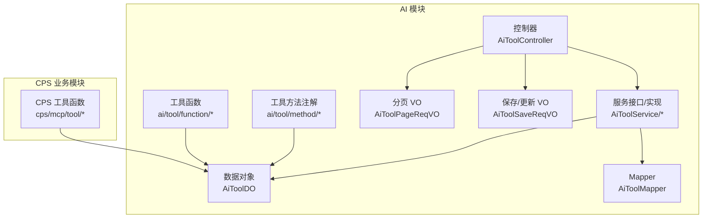
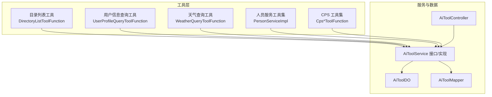
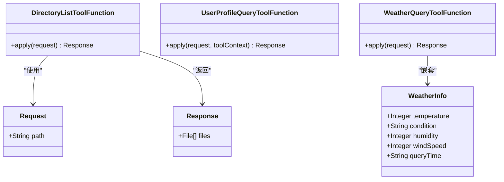
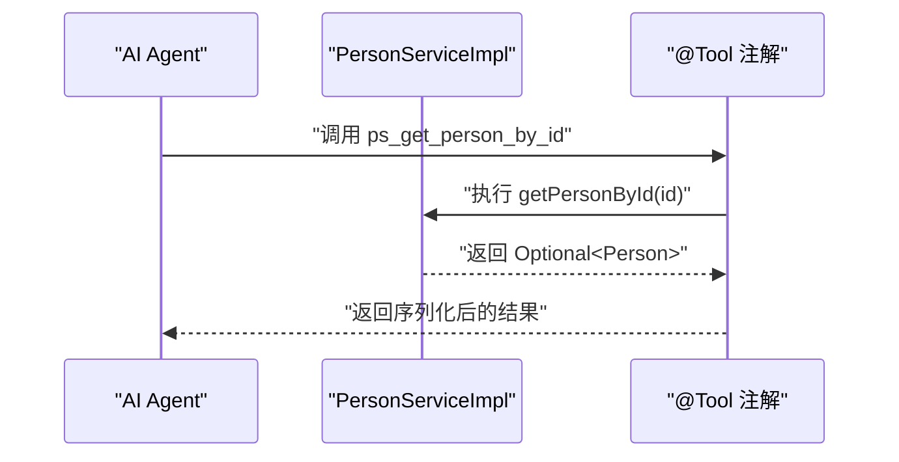
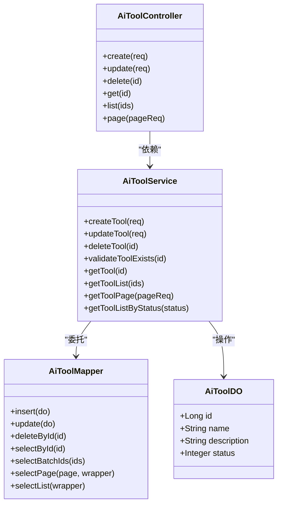
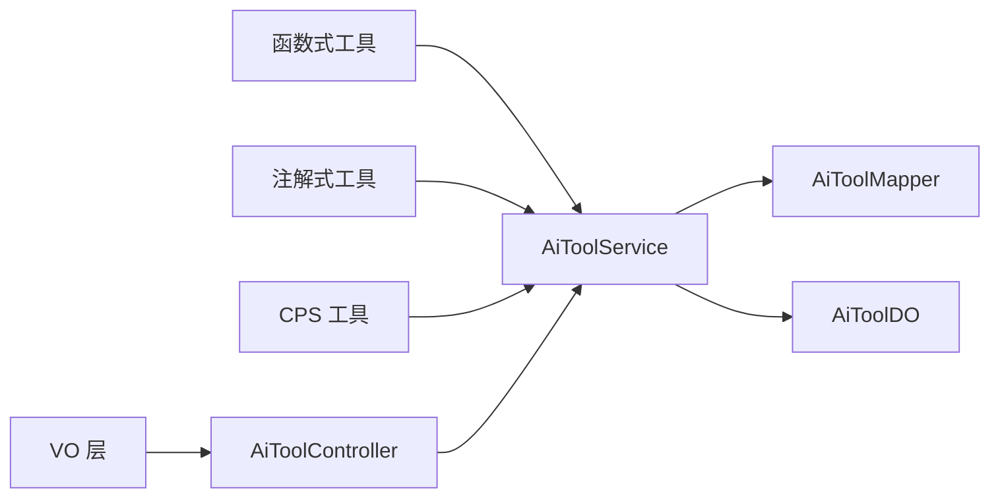

# 工具函数管理

<cite>
**本文引用的文件**
- [DirectoryListToolFunction.java](file://backend/yudao-module-ai/src/main/java/cn/iocoder/yudao/module/ai/tool/function/DirectoryListToolFunction.java)
- [UserProfileQueryToolFunction.java](file://backend/yudao-module-ai/src/main/java/cn/iocoder/yudao/module/ai/tool/function/UserProfileQueryToolFunction.java)
- [WeatherQueryToolFunction.java](file://backend/yudao-module-ai/src/main/java/cn/iocoder/yudao/module/ai/tool/function/WeatherQueryToolFunction.java)
- [AiToolDO.java](file://backend/yudao-module-ai/src/main/java/cn/iocoder/yudao/module/ai/dal/dataobject/model/AiToolDO.java)
- [AiToolService.java](file://backend/yudao-module-ai/src/main/java/cn/iocoder/yudao/module/ai/service/model/AiToolService.java)
- [AiToolSaveReqVO.java](file://backend/yudao-module-ai/src/main/java/cn/iocoder/yudao/module/ai/controller/admin/model/vo/tool/AiToolSaveReqVO.java)
- [AiToolPageReqVO.java](file://backend/yudao-module-ai/src/main/java/cn/iocoder/yudao/module/ai/controller/admin/model/vo/tool/AiToolPageReqVO.java)
- [PersonServiceImpl.java](file://backend/yudao-module-ai/src/main/java/cn/iocoder/yudao/module/ai/tool/method/PersonServiceImpl.java)
- [AiToolController.java](file://backend/yudao-module-ai/src/main/java/cn/iocoder/yudao/module/ai/controller/admin/model/AiToolController.java)
- [AiToolMapper.java](file://backend/yudao-module-ai/src/main/java/cn/iocoder/yudao/module/ai/dal/mysql/model/AiToolMapper.java)
- [AiToolServiceImpl.java](file://backend/yudao-module-ai/src/main/java/cn/iocoder/yudao/module/ai/service/model/AiToolServiceImpl.java)
- [CpsComparePricesToolFunction.java](file://backend/yudao-module-cps/yudao-module-cps-biz/src/main/java/cn/iocoder/yudao/module/cps/mcp/tool/CpsComparePricesToolFunction.java)
- [CpsGenerateLinkToolFunction.java](file://backend/yudao-module-cps/yudao-module-cps-biz/src/main/java/cn/iocoder/yudao/module/cps/mcp/tool/CpsGenerateLinkToolFunction.java)
- [CpsGetRebateSummaryToolFunction.java](file://backend/yudao-module-cps/yudao-module-cps-biz/src/main/java/cn/iocoder/yudao/module/cps/mcp/tool/CpsGetRebateSummaryToolFunction.java)
- [CpsQueryOrdersToolFunction.java](file://backend/yudao-module-cps/yudao-module-cps-biz/src/main/java/cn/iocoder/yudao/module/cps/mcp/tool/CpsQueryOrdersToolFunction.java)
- [CpsSearchGoodsToolFunction.java](file://backend/yudao-module-cps/yudao-module-cps-biz/src/main/java/cn/iocoder/yudao/module/cps/mcp/tool/CpsSearchGoodsToolFunction.java)
</cite>

## 目录
1. [引言](#引言)
2. [项目结构](#项目结构)
3. [核心组件](#核心组件)
4. [架构总览](#架构总览)
5. [详细组件分析](#详细组件分析)
6. [依赖分析](#依赖分析)
7. [性能考虑](#性能考虑)
8. [故障排查指南](#故障排查指南)
9. [结论](#结论)
10. [附录](#附录)

## 引言
本文件系统性阐述 AgenticCPS 项目中的“工具函数管理”体系，覆盖设计理念、注册机制、调用方式、开发规范、参数与返回值约定、与业务系统的集成点、数据验证与错误处理、分类与生命周期管理、开发示例、测试方法与性能优化技巧，以及在 AI Agent 工作流中的作用与最佳实践。目标是帮助开发者快速理解并高效扩展工具函数能力。

## 项目结构
工具函数管理主要分布在以下模块与包中：
- AI 模块工具函数：位于 ai/tool/function 与 ai/tool/method，分别承载基于 Spring AI 的函数式工具与基于注解的工具方法。
- CPS 业务工具函数：位于 cps/mcp/tool，封装电商场景的工具能力。
- 数据模型与服务：AI 工具的数据对象、服务接口与实现、控制器与 Mapper，支撑工具的持久化与管理。
- VO 层：管理后台对工具的新增/编辑、分页查询等请求体对象。

图表来源
- [AiToolDO.java:1-48](file://backend/yudao-module-ai/src/main/java/cn/iocoder/yudao/module/ai/dal/dataobject/model/AiToolDO.java#L1-L48)
- [AiToolService.java:1-80](file://backend/yudao-module-ai/src/main/java/cn/iocoder/yudao/module/ai/service/model/AiToolService.java#L1-L80)
- [AiToolController.java](file://backend/yudao-module-ai/src/main/java/cn/iocoder/yudao/module/ai/controller/admin/model/AiToolController.java)
- [AiToolMapper.java](file://backend/yudao-module-ai/src/main/java/cn/iocoder/yudao/module/ai/dal/mysql/model/AiToolMapper.java)
- [AiToolSaveReqVO.java:1-27](file://backend/yudao-module-ai/src/main/java/cn/iocoder/yudao/module/ai/controller/admin/model/vo/tool/AiToolSaveReqVO.java#L1-L27)
- [AiToolPageReqVO.java:1-34](file://backend/yudao-module-ai/src/main/java/cn/iocoder/yudao/module/ai/controller/admin/model/vo/tool/AiToolPageReqVO.java#L1-L34)
- [DirectoryListToolFunction.java:1-99](file://backend/yudao-module-ai/src/main/java/cn/iocoder/yudao/module/ai/tool/function/DirectoryListToolFunction.java#L1-L99)
- [UserProfileQueryToolFunction.java:1-93](file://backend/yudao-module-ai/src/main/java/cn/iocoder/yudao/module/ai/tool/function/UserProfileQueryToolFunction.java#L1-L93)
- [WeatherQueryToolFunction.java:1-118](file://backend/yudao-module-ai/src/main/java/cn/iocoder/yudao/module/ai/tool/function/WeatherQueryToolFunction.java#L1-L118)
- [PersonServiceImpl.java:1-336](file://backend/yudao-module-ai/src/main/java/cn/iocoder/yudao/module/ai/tool/method/PersonServiceImpl.java#L1-L336)
- [CpsComparePricesToolFunction.java](file://backend/yudao-module-cps/yudao-module-cps-biz/src/main/java/cn/iocoder/yudao/module/cps/mcp/tool/CpsComparePricesToolFunction.java)
- [CpsGenerateLinkToolFunction.java](file://backend/yudao-module-cps/yudao-module-cps-biz/src/main/java/cn/iocoder/yudao/module/cps/mcp/tool/CpsGenerateLinkToolFunction.java)
- [CpsGetRebateSummaryToolFunction.java](file://backend/yudao-module-cps/yudao-module-cps-biz/src/main/java/cn/iocoder/yudao/module/cps/mcp/tool/CpsGetRebateSummaryToolFunction.java)
- [CpsQueryOrdersToolFunction.java](file://backend/yudao-module-cps/yudao-module-cps-biz/src/main/java/cn/iocoder/yudao/module/cps/mcp/tool/CpsQueryOrdersToolFunction.java)
- [CpsSearchGoodsToolFunction.java](file://backend/yudao-module-cps/yudao-module-cps-biz/src/main/java/cn/iocoder/yudao/module/cps/mcp/tool/CpsSearchGoodsToolFunction.java)

章节来源
- [AiToolDO.java:1-48](file://backend/yudao-module-ai/src/main/java/cn/iocoder/yudao/module/ai/dal/dataobject/model/AiToolDO.java#L1-L48)
- [AiToolService.java:1-80](file://backend/yudao-module-ai/src/main/java/cn/iocoder/yudao/module/ai/service/model/AiToolService.java#L1-L80)
- [AiToolController.java](file://backend/yudao-module-ai/src/main/java/cn/iocoder/yudao/module/ai/controller/admin/model/AiToolController.java)
- [AiToolMapper.java](file://backend/yudao-module-ai/src/main/java/cn/iocoder/yudao/module/ai/dal/mysql/model/AiToolMapper.java)
- [AiToolSaveReqVO.java:1-27](file://backend/yudao-module-ai/src/main/java/cn/iocoder/yudao/module/ai/controller/admin/model/vo/tool/AiToolSaveReqVO.java#L1-L27)
- [AiToolPageReqVO.java:1-34](file://backend/yudao-module-ai/src/main/java/cn/iocoder/yudao/module/ai/controller/admin/model/vo/tool/AiToolPageReqVO.java#L1-L34)

## 核心组件
- 工具函数（函数式）：以函数式接口实现，通过组件名暴露给 AI 引擎，支持请求/响应结构化定义与 JSON Schema 注解。
- 工具方法（注解式）：以服务类方法配合注解声明，由 Spring AI 自动发现并注册为工具。
- 数据模型与服务：AiToolDO 描述工具元数据；AiToolService 提供 CRUD 与分页查询；AiToolController 提供管理后台接口；AiToolMapper 负责持久化。
- VO 层：AiToolSaveReqVO 与 AiToolPageReqVO 提供参数校验与分页查询能力。
- CPS 工具函数：面向电商场景的工具集合，如价格对比、生成推广链接、返佣汇总、订单查询、商品检索等。

章节来源
- [DirectoryListToolFunction.java:1-99](file://backend/yudao-module-ai/src/main/java/cn/iocoder/yudao/module/ai/tool/function/DirectoryListToolFunction.java#L1-L99)
- [UserProfileQueryToolFunction.java:1-93](file://backend/yudao-module-ai/src/main/java/cn/iocoder/yudao/module/ai/tool/function/UserProfileQueryToolFunction.java#L1-L93)
- [WeatherQueryToolFunction.java:1-118](file://backend/yudao-module-ai/src/main/java/cn/iocoder/yudao/module/ai/tool/function/WeatherQueryToolFunction.java#L1-L118)
- [AiToolDO.java:1-48](file://backend/yudao-module-ai/src/main/java/cn/iocoder/yudao/module/ai/dal/dataobject/model/AiToolDO.java#L1-L48)
- [AiToolService.java:1-80](file://backend/yudao-module-ai/src/main/java/cn/iocoder/yudao/module/ai/service/model/AiToolService.java#L1-L80)
- [AiToolSaveReqVO.java:1-27](file://backend/yudao-module-ai/src/main/java/cn/iocoder/yudao/module/ai/controller/admin/model/vo/tool/AiToolSaveReqVO.java#L1-L27)
- [AiToolPageReqVO.java:1-34](file://backend/yudao-module-ai/src/main/java/cn/iocoder/yudao/module/ai/controller/admin/model/vo/tool/AiToolPageReqVO.java#L1-L34)
- [PersonServiceImpl.java:1-336](file://backend/yudao-module-ai/src/main/java/cn/iocoder/yudao/module/ai/tool/method/PersonServiceImpl.java#L1-L336)
- [CpsComparePricesToolFunction.java](file://backend/yudao-module-cps/yudao-module-cps-biz/src/main/java/cn/iocoder/yudao/module/cps/mcp/tool/CpsComparePricesToolFunction.java)
- [CpsGenerateLinkToolFunction.java](file://backend/yudao-module-cps/yudao-module-cps-biz/src/main/java/cn/iocoder/yudao/module/cps/mcp/tool/CpsGenerateLinkToolFunction.java)
- [CpsGetRebateSummaryToolFunction.java](file://backend/yudao-module-cps/yudao-module-cps-biz/src/main/java/cn/iocoder/yudao/module/cps/mcp/tool/CpsGetRebateSummaryToolFunction.java)
- [CpsQueryOrdersToolFunction.java](file://backend/yudao-module-cps/yudao-module-cps-biz/src/main/java/cn/iocoder/yudao/module/cps/mcp/tool/CpsQueryOrdersToolFunction.java)
- [CpsSearchGoodsToolFunction.java](file://backend/yudao-module-cps/yudao-module-cps-biz/src/main/java/cn/iocoder/yudao/module/cps/mcp/tool/CpsSearchGoodsToolFunction.java)

## 架构总览
工具函数管理采用“函数式工具 + 注解式工具 + 数据模型 + 服务层 + 控制器”的分层设计，结合 Spring AI 的工具注册与上下文传递能力，形成统一的工具生态。

图表来源
- [DirectoryListToolFunction.java:1-99](file://backend/yudao-module-ai/src/main/java/cn/iocoder/yudao/module/ai/tool/function/DirectoryListToolFunction.java#L1-L99)
- [UserProfileQueryToolFunction.java:1-93](file://backend/yudao-module-ai/src/main/java/cn/iocoder/yudao/module/ai/tool/function/UserProfileQueryToolFunction.java#L1-L93)
- [WeatherQueryToolFunction.java:1-118](file://backend/yudao-module-ai/src/main/java/cn/iocoder/yudao/module/ai/tool/function/WeatherQueryToolFunction.java#L1-L118)
- [PersonServiceImpl.java:1-336](file://backend/yudao-module-ai/src/main/java/cn/iocoder/yudao/module/ai/tool/method/PersonServiceImpl.java#L1-L336)
- [CpsComparePricesToolFunction.java](file://backend/yudao-module-cps/yudao-module-cps-biz/src/main/java/cn/iocoder/yudao/module/cps/mcp/tool/CpsComparePricesToolFunction.java)
- [AiToolService.java:1-80](file://backend/yudao-module-ai/src/main/java/cn/iocoder/yudao/module/ai/service/model/AiToolService.java#L1-L80)
- [AiToolDO.java:1-48](file://backend/yudao-module-ai/src/main/java/cn/iocoder/yudao/module/ai/dal/dataobject/model/AiToolDO.java#L1-L48)
- [AiToolMapper.java](file://backend/yudao-module-ai/src/main/java/cn/iocoder/yudao/module/ai/dal/mysql/model/AiToolMapper.java)
- [AiToolController.java](file://backend/yudao-module-ai/src/main/java/cn/iocoder/yudao/module/ai/controller/admin/model/AiToolController.java)

## 详细组件分析

### 函数式工具组件
- 设计理念：以函数式接口实现工具逻辑，通过组件名暴露给 AI 引擎；请求/响应对象采用 JSON Schema 注解，便于 LLM 理解参数与返回结构。
- 注册机制：Spring 容器扫描到带组件名的类即自动注册为可用工具。
- 调用方式：AI 引擎根据工具描述与参数进行调用，工具内部完成参数校验与业务处理。
- 开发规范：
  - 请求对象字段使用 JSON 注解明确必填与描述。
  - 响应对象字段保持简洁，必要时嵌套子对象。
  - 工具内部进行输入校验与边界处理，返回空结果或默认值时保持一致的结构。
- 示例：
  - 目录列表工具：接收目录路径，返回文件/目录清单。
  - 用户信息查询工具：接收用户编号（可为空代表当前用户），结合 ToolContext 获取租户与登录用户上下文，远程查询用户信息并转换为响应对象。
  - 天气查询工具：接收城市名称，生成模拟天气数据（温度、湿度、风速、天气状况、查询时间）。

图表来源
- [DirectoryListToolFunction.java:1-99](file://backend/yudao-module-ai/src/main/java/cn/iocoder/yudao/module/ai/tool/function/DirectoryListToolFunction.java#L1-L99)
- [UserProfileQueryToolFunction.java:1-93](file://backend/yudao-module-ai/src/main/java/cn/iocoder/yudao/module/ai/tool/function/UserProfileQueryToolFunction.java#L1-L93)
- [WeatherQueryToolFunction.java:1-118](file://backend/yudao-module-ai/src/main/java/cn/iocoder/yudao/module/ai/tool/function/WeatherQueryToolFunction.java#L1-L118)

章节来源
- [DirectoryListToolFunction.java:1-99](file://backend/yudao-module-ai/src/main/java/cn/iocoder/yudao/module/ai/tool/function/DirectoryListToolFunction.java#L1-L99)
- [UserProfileQueryToolFunction.java:1-93](file://backend/yudao-module-ai/src/main/java/cn/iocoder/yudao/module/ai/tool/function/UserProfileQueryToolFunction.java#L1-L93)
- [WeatherQueryToolFunction.java:1-118](file://backend/yudao-module-ai/src/main/java/cn/iocoder/yudao/module/ai/tool/function/WeatherQueryToolFunction.java#L1-L118)

### 注解式工具组件
- 设计理念：通过注解声明工具方法，由 Spring AI 自动发现并注册，适合将现有服务方法直接暴露为工具。
- 注册机制：服务类上标注服务注解，方法上使用工具注解声明名称与描述。
- 调用方式：AI 引擎根据工具名称调用对应方法，传入参数并接收返回值。
- 开发规范：
  - 方法参数尽量简单且可序列化，避免复杂对象。
  - 返回值建议为简单类型或可序列化的对象。
  - 对空参数与异常情况进行显式处理，保证输出稳定。
- 示例：人员服务工具集包含创建、查询、更新、删除、按职位/性别/年龄过滤等方法，均通过注解暴露。

图表来源
- [PersonServiceImpl.java:195-230](file://backend/yudao-module-ai/src/main/java/cn/iocoder/yudao/module/ai/tool/method/PersonServiceImpl.java#L195-L230)

章节来源
- [PersonServiceImpl.java:1-336](file://backend/yudao-module-ai/src/main/java/cn/iocoder/yudao/module/ai/tool/method/PersonServiceImpl.java#L1-L336)

### 数据模型与服务组件
- 数据模型：AiToolDO 记录工具的名称、描述与状态，名称与 Spring 组件名一一对应，便于引擎识别。
- 服务接口：AiToolService 提供创建、更新、删除、校验存在、查询、分页、按状态查询等能力。
- 控制器：AiToolController 提供管理后台的工具管理接口。
- Mapper：AiToolMapper 负责持久化操作。
- 开发规范：
  - 工具名称必须唯一且与组件名一致。
  - 状态枚举遵循通用状态枚举。
  - 分页查询支持名称、描述、状态、创建时间范围等条件。

图表来源
- [AiToolDO.java:1-48](file://backend/yudao-module-ai/src/main/java/cn/iocoder/yudao/module/ai/dal/dataobject/model/AiToolDO.java#L1-L48)
- [AiToolService.java:1-80](file://backend/yudao-module-ai/src/main/java/cn/iocoder/yudao/module/ai/service/model/AiToolService.java#L1-L80)
- [AiToolController.java](file://backend/yudao-module-ai/src/main/java/cn/iocoder/yudao/module/ai/controller/admin/model/AiToolController.java)
- [AiToolMapper.java](file://backend/yudao-module-ai/src/main/java/cn/iocoder/yudao/module/ai/dal/mysql/model/AiToolMapper.java)

章节来源
- [AiToolDO.java:1-48](file://backend/yudao-module-ai/src/main/java/cn/iocoder/yudao/module/ai/dal/dataobject/model/AiToolDO.java#L1-L48)
- [AiToolService.java:1-80](file://backend/yudao-module-ai/src/main/java/cn/iocoder/yudao/module/ai/service/model/AiToolService.java#L1-L80)
- [AiToolSaveReqVO.java:1-27](file://backend/yudao-module-ai/src/main/java/cn/iocoder/yudao/module/ai/controller/admin/model/vo/tool/AiToolSaveReqVO.java#L1-L27)
- [AiToolPageReqVO.java:1-34](file://backend/yudao-module-ai/src/main/java/cn/iocoder/yudao/module/ai/controller/admin/model/vo/tool/AiToolPageReqVO.java#L1-L34)

### CPS 工具函数组件
- 设计理念：面向电商场景的工具集合，封装价格对比、推广链接生成、返佣汇总、订单查询、商品检索等业务能力。
- 注册与调用：与 AI 工具一致，通过组件名或注解暴露给引擎。
- 开发规范：
  - 参数与返回值结构清晰，便于 LLM 理解。
  - 内部进行必要的参数校验与异常处理。
  - 与外部系统交互时注意超时与重试策略。

章节来源
- [CpsComparePricesToolFunction.java](file://backend/yudao-module-cps/yudao-module-cps-biz/src/main/java/cn/iocoder/yudao/module/cps/mcp/tool/CpsComparePricesToolFunction.java)
- [CpsGenerateLinkToolFunction.java](file://backend/yudao-module-cps/yudao-module-cps-biz/src/main/java/cn/iocoder/yudao/module/cps/mcp/tool/CpsGenerateLinkToolFunction.java)
- [CpsGetRebateSummaryToolFunction.java](file://backend/yudao-module-cps/yudao-module-cps-biz/src/main/java/cn/iocoder/yudao/module/cps/mcp/tool/CpsGetRebateSummaryToolFunction.java)
- [CpsQueryOrdersToolFunction.java](file://backend/yudao-module-cps/yudao-module-cps-biz/src/main/java/cn/iocoder/yudao/module/cps/mcp/tool/CpsQueryOrdersToolFunction.java)
- [CpsSearchGoodsToolFunction.java](file://backend/yudao-module-cps/yudao-module-cps-biz/src/main/java/cn/iocoder/yudao/module/cps/mcp/tool/CpsSearchGoodsToolFunction.java)

## 依赖分析
- 工具函数与服务层解耦：工具函数通过组件名或注解暴露，服务层负责工具的生命周期与管理。
- 数据访问层：AiToolMapper 与 MyBatis Plus 集成，支持分页与批量查询。
- 参数校验：VO 层使用注解进行非空与枚举校验，确保输入质量。
- 上下文传递：工具函数可通过 ToolContext 获取租户、登录用户等上下文信息，实现多租户与权限控制。

图表来源
- [AiToolService.java:1-80](file://backend/yudao-module-ai/src/main/java/cn/iocoder/yudao/module/ai/service/model/AiToolService.java#L1-L80)
- [AiToolMapper.java](file://backend/yudao-module-ai/src/main/java/cn/iocoder/yudao/module/ai/dal/mysql/model/AiToolMapper.java)
- [AiToolDO.java:1-48](file://backend/yudao-module-ai/src/main/java/cn/iocoder/yudao/module/ai/dal/dataobject/model/AiToolDO.java#L1-L48)
- [AiToolController.java](file://backend/yudao-module-ai/src/main/java/cn/iocoder/yudao/module/ai/controller/admin/model/AiToolController.java)
- [AiToolSaveReqVO.java:1-27](file://backend/yudao-module-ai/src/main/java/cn/iocoder/yudao/module/ai/controller/admin/model/vo/tool/AiToolSaveReqVO.java#L1-L27)
- [AiToolPageReqVO.java:1-34](file://backend/yudao-module-ai/src/main/java/cn/iocoder/yudao/module/ai/controller/admin/model/vo/tool/AiToolPageReqVO.java#L1-L34)

章节来源
- [AiToolService.java:1-80](file://backend/yudao-module-ai/src/main/java/cn/iocoder/yudao/module/ai/service/model/AiToolService.java#L1-L80)
- [AiToolMapper.java](file://backend/yudao-module-ai/src/main/java/cn/iocoder/yudao/module/ai/dal/mysql/model/AiToolMapper.java)
- [AiToolDO.java:1-48](file://backend/yudao-module-ai/src/main/java/cn/iocoder/yudao/module/ai/dal/dataobject/model/AiToolDO.java#L1-L48)
- [AiToolController.java](file://backend/yudao-module-ai/src/main/java/cn/iocoder/yudao/module/ai/controller/admin/model/AiToolController.java)
- [AiToolSaveReqVO.java:1-27](file://backend/yudao-module-ai/src/main/java/cn/iocoder/yudao/module/ai/controller/admin/model/vo/tool/AiToolSaveReqVO.java#L1-L27)
- [AiToolPageReqVO.java:1-34](file://backend/yudao-module-ai/src/main/java/cn/iocoder/yudao/module/ai/controller/admin/model/vo/tool/AiToolPageReqVO.java#L1-L34)

## 性能考虑
- 工具函数内部的 IO 与网络调用应设置合理的超时与重试策略，避免阻塞 AI Agent。
- 对于需要遍历或聚合的工具，建议在服务层引入缓存与分页，减少重复计算。
- 注解式工具方法应避免在热路径上进行重型操作，必要时异步化或延迟执行。
- 数据模型与服务层的分页查询应合理使用索引，避免全表扫描。
- 工具函数的参数校验应在入口处尽早完成，减少无效调用。

## 故障排查指南
- 工具未被识别：检查组件名或注解是否正确配置，确保名称与 AiToolDO.name 一致。
- 参数校验失败：确认 VO 层注解与前端传参一致，查看具体报错字段。
- 上下文缺失：在使用 ToolContext 的工具中，确认上下文键值是否存在，必要时添加默认分支。
- 数据访问异常：检查 Mapper 与数据库连接配置，关注分页与批量操作的边界条件。
- CPS 工具调用失败：检查外部系统连通性与鉴权配置，增加日志与熔断保护。

章节来源
- [AiToolDO.java:1-48](file://backend/yudao-module-ai/src/main/java/cn/iocoder/yudao/module/ai/dal/dataobject/model/AiToolDO.java#L1-L48)
- [UserProfileQueryToolFunction.java:74-90](file://backend/yudao-module-ai/src/main/java/cn/iocoder/yudao/module/ai/tool/function/UserProfileQueryToolFunction.java#L74-L90)
- [AiToolSaveReqVO.java:1-27](file://backend/yudao-module-ai/src/main/java/cn/iocoder/yudao/module/ai/controller/admin/model/vo/tool/AiToolSaveReqVO.java#L1-L27)
- [AiToolPageReqVO.java:1-34](file://backend/yudao-module-ai/src/main/java/cn/iocoder/yudao/module/ai/controller/admin/model/vo/tool/AiToolPageReqVO.java#L1-L34)

## 结论
工具函数管理通过“函数式工具 + 注解式工具 + 统一数据模型 + 服务层 + 控制器”的架构，实现了与 AI Agent 的无缝集成。开发者只需遵循统一的参数与返回值规范、严格的数据验证与错误处理，即可快速扩展各类业务工具，提升 Agent 的智能化服务能力。

## 附录

### 开发示例与最佳实践
- 新增工具步骤
  - 实现工具类：选择函数式或注解式实现，定义请求/响应对象，添加 JSON 注解与描述。
  - 注册工具：确保组件名或注解名称唯一且与 AiToolDO.name 一致。
  - 管理工具：通过 AiToolController 进行新增/编辑/删除/分页查询。
  - 测试工具：编写单元测试与集成测试，覆盖正常与异常路径。
- 参数与返回值规范
  - 请求对象字段使用 JSON 注解标明必填与描述。
  - 响应对象字段保持简洁，必要时嵌套子对象。
  - 对空输入与边界条件进行显式处理，返回稳定的结构。
- 错误处理
  - 工具内部捕获异常并返回默认值或空集合。
  - 控制器层对参数校验失败进行统一处理。
  - 服务层对业务异常进行包装与日志记录。
- 性能优化
  - 工具内部设置超时与重试。
  - 服务层引入缓存与分页。
  - 注解式工具避免重型操作，必要时异步化。

章节来源
- [DirectoryListToolFunction.java:1-99](file://backend/yudao-module-ai/src/main/java/cn/iocoder/yudao/module/ai/tool/function/DirectoryListToolFunction.java#L1-L99)
- [UserProfileQueryToolFunction.java:1-93](file://backend/yudao-module-ai/src/main/java/cn/iocoder/yudao/module/ai/tool/function/UserProfileQueryToolFunction.java#L1-L93)
- [WeatherQueryToolFunction.java:1-118](file://backend/yudao-module-ai/src/main/java/cn/iocoder/yudao/module/ai/tool/function/WeatherQueryToolFunction.java#L1-L118)
- [PersonServiceImpl.java:195-334](file://backend/yudao-module-ai/src/main/java/cn/iocoder/yudao/module/ai/tool/method/PersonServiceImpl.java#L195-L334)
- [AiToolController.java](file://backend/yudao-module-ai/src/main/java/cn/iocoder/yudao/module/ai/controller/admin/model/AiToolController.java)
- [AiToolService.java:1-80](file://backend/yudao-module-ai/src/main/java/cn/iocoder/yudao/module/ai/service/model/AiToolService.java#L1-L80)
- [AiToolSaveReqVO.java:1-27](file://backend/yudao-module-ai/src/main/java/cn/iocoder/yudao/module/ai/controller/admin/model/vo/tool/AiToolSaveReqVO.java#L1-L27)
- [AiToolPageReqVO.java:1-34](file://backend/yudao-module-ai/src/main/java/cn/iocoder/yudao/module/ai/controller/admin/model/vo/tool/AiToolPageReqVO.java#L1-L34)