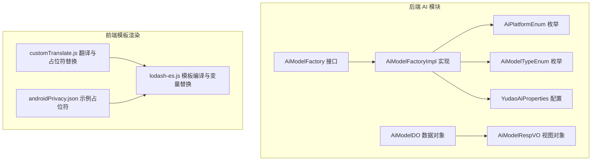
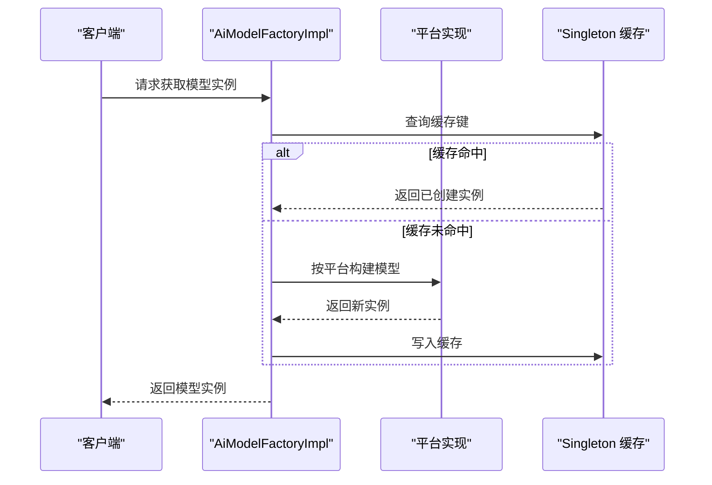
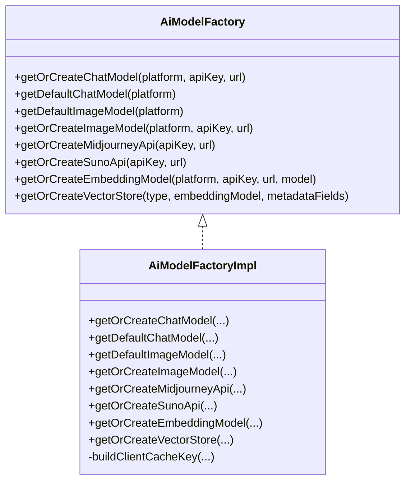
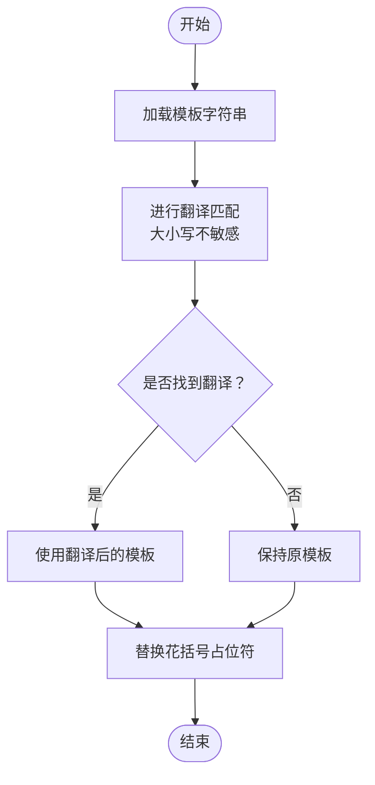
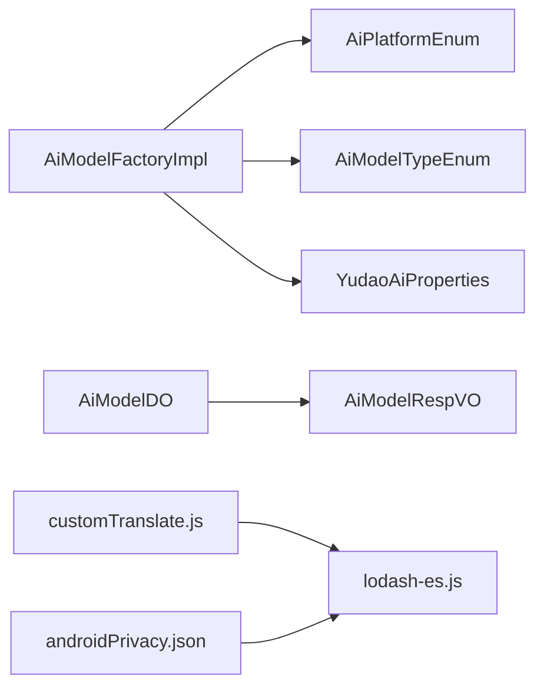

# 提示词模板系统

<cite>
**本文档引用的文件**
- [AiModelFactory.java](file://backend/yudao-module-ai/src/main/java/cn/iocoder/yudao/module/ai/framework/ai/core/model/AiModelFactory.java)
- [AiModelFactoryImpl.java](file://backend/yudao-module-ai/src/main/java/cn/iocoder/yudao/module/ai/framework/ai/core/model/AiModelFactoryImpl.java)
- [AiPlatformEnum.java](file://backend/yudao-module-ai/src/main/java/cn/iocoder/yudao/module/ai/enums/model/AiPlatformEnum.java)
- [AiModelTypeEnum.java](file://backend/yudao-module-ai/src/main/java/cn/iocoder/yudao/module/ai/enums/model/AiModelTypeEnum.java)
- [YudaoAiProperties.java](file://backend/yudao-module-ai/src/main/java/cn/iocoder/yudao/module/ai/framework/ai/config/YudaoAiProperties.java)
- [AiModelDO.java](file://backend/yudao-module-ai/src/main/java/cn/iocoder/yudao/module/ai/dal/dataobject/model/AiModelDO.java)
- [AiModelRespVO.java](file://backend/yudao-module-ai/src/main/java/cn/iocoder/yudao/module/ai/controller/admin/model/vo/model/AiModelRespVO.java)
- [customTranslate.js](file://frontend/admin-vue3/src/components/bpmnProcessDesigner/package/designer/plugins/translate/customTranslate.js)
- [lodash-es.js](file://frontend/mall-uniapp/unpackage/dist/cache/.vite/deps/lodash-es.js)
- [androidPrivacy.json](file://frontend/mall-uniapp/androidPrivacy.json)
</cite>

## 目录
1. [简介](#简介)
2. [项目结构](#项目结构)
3. [核心组件](#核心组件)
4. [架构总览](#架构总览)
5. [详细组件分析](#详细组件分析)
6. [依赖关系分析](#依赖关系分析)
7. [性能考虑](#性能考虑)
8. [故障排查指南](#故障排查指南)
9. [结论](#结论)
10. [附录](#附录)

## 简介
本文件系统性阐述提示词模板系统的设计与实现，涵盖模板语法与变量替换机制、模板分类与版本控制、动态加载策略、跨模型兼容与适配、性能优化与缓存、热更新机制、开发最佳实践与测试策略，以及在 AI Agent 中的应用场景与效果优化。该系统以后端 AI 模型工厂为核心，结合前端模板渲染能力，形成从模板定义到执行调用的完整链路。

## 项目结构
提示词模板系统主要分布在后端 AI 模块与前端组件中：
- 后端：AI 模型工厂负责按平台创建与复用模型实例，支持多种国内外大模型与图像/嵌入/向量存储等能力。
- 前端：提供模板占位符替换与国际化翻译能力，支撑模板在界面层的动态渲染与展示。

**图表来源**
- [AiModelFactory.java:1-114](file://backend/yudao-module-ai/src/main/java/cn/iocoder/yudao/module/ai/framework/ai/core/model/AiModelFactory.java#L1-L114)
- [AiModelFactoryImpl.java:1-846](file://backend/yudao-module-ai/src/main/java/cn/iocoder/yudao/module/ai/framework/ai/core/model/AiModelFactoryImpl.java#L1-L846)
- [AiPlatformEnum.java:1-73](file://backend/yudao-module-ai/src/main/java/cn/iocoder/yudao/module/ai/enums/model/AiPlatformEnum.java#L1-L73)
- [AiModelTypeEnum.java:1-42](file://backend/yudao-module-ai/src/main/java/cn/iocoder/yudao/module/ai/enums/model/AiModelTypeEnum.java#L1-L42)
- [YudaoAiProperties.java:1-75](file://backend/yudao-module-ai/src/main/java/cn/iocoder/yudao/module/ai/framework/ai/config/YudaoAiProperties.java#L1-L75)
- [AiModelDO.java:46-88](file://backend/yudao-module-ai/src/main/java/cn/iocoder/yudao/module/ai/dal/dataobject/model/AiModelDO.java#L46-L88)
- [AiModelRespVO.java:1-48](file://backend/yudao-module-ai/src/main/java/cn/iocoder/yudao/module/ai/controller/admin/model/vo/model/AiModelRespVO.java#L1-L48)
- [customTranslate.js:1-42](file://frontend/admin-vue3/src/components/bpmnProcessDesigner/package/designer/plugins/translate/customTranslate.js#L1-L42)
- [lodash-es.js:6496-6604](file://frontend/mall-uniapp/unpackage/dist/cache/.vite/deps/lodash-es.js#L6496-L6604)
- [androidPrivacy.json:1-3](file://frontend/mall-uniapp/androidPrivacy.json#L1-L3)

**章节来源**
- [AiModelFactory.java:1-114](file://backend/yudao-module-ai/src/main/java/cn/iocoder/yudao/module/ai/framework/ai/core/model/AiModelFactory.java#L1-L114)
- [AiModelFactoryImpl.java:1-846](file://backend/yudao-module-ai/src/main/java/cn/iocoder/yudao/module/ai/framework/ai/core/model/AiModelFactoryImpl.java#L1-L846)
- [AiPlatformEnum.java:1-73](file://backend/yudao-module-ai/src/main/java/cn/iocoder/yudao/module/ai/enums/model/AiPlatformEnum.java#L1-L73)
- [AiModelTypeEnum.java:1-42](file://backend/yudao-module-ai/src/main/java/cn/iocoder/yudao/module/ai/enums/model/AiModelTypeEnum.java#L1-L42)
- [YudaoAiProperties.java:1-75](file://backend/yudao-module-ai/src/main/java/cn/iocoder/yudao/module/ai/framework/ai/config/YudaoAiProperties.java#L1-L75)
- [AiModelDO.java:46-88](file://backend/yudao-module-ai/src/main/java/cn/iocoder/yudao/module/ai/dal/dataobject/model/AiModelDO.java#L46-L88)
- [AiModelRespVO.java:1-48](file://backend/yudao-module-ai/src/main/java/cn/iocoder/yudao/module/ai/controller/admin/model/vo/model/AiModelRespVO.java#L1-L48)
- [customTranslate.js:1-42](file://frontend/admin-vue3/src/components/bpmnProcessDesigner/package/designer/plugins/translate/customTranslate.js#L1-L42)
- [lodash-es.js:6496-6604](file://frontend/mall-uniapp/unpackage/dist/cache/.vite/deps/lodash-es.js#L6496-L6604)
- [androidPrivacy.json:1-3](file://frontend/mall-uniapp/androidPrivacy.json#L1-L3)

## 核心组件
- 模型工厂接口与实现：统一抽象不同平台的模型创建与获取逻辑，支持按需创建与默认配置获取，并内置缓存与复用。
- 平台与类型枚举：标准化平台与模型类型，便于扩展与跨模型适配。
- 配置与数据对象：集中管理各平台的 API Key、模型参数、温度、最大 Token 等配置项。
- 前端模板渲染：提供占位符替换与国际化翻译能力，支撑模板在界面层的动态展示。

**章节来源**
- [AiModelFactory.java:18-114](file://backend/yudao-module-ai/src/main/java/cn/iocoder/yudao/module/ai/framework/ai/core/model/AiModelFactory.java#L18-L114)
- [AiModelFactoryImpl.java:141-342](file://backend/yudao-module-ai/src/main/java/cn/iocoder/yudao/module/ai/framework/ai/core/model/AiModelFactoryImpl.java#L141-L342)
- [AiPlatformEnum.java:16-73](file://backend/yudao-module-ai/src/main/java/cn/iocoder/yudao/module/ai/enums/model/AiPlatformEnum.java#L16-L73)
- [AiModelTypeEnum.java:16-42](file://backend/yudao-module-ai/src/main/java/cn/iocoder/yudao/module/ai/enums/model/AiModelTypeEnum.java#L16-L42)
- [YudaoAiProperties.java:12-75](file://backend/yudao-module-ai/src/main/java/cn/iocoder/yudao/module/ai/framework/ai/config/YudaoAiProperties.java#L12-L75)
- [AiModelDO.java:46-88](file://backend/yudao-module-ai/src/main/java/cn/iocoder/yudao/module/ai/dal/dataobject/model/AiModelDO.java#L46-L88)
- [AiModelRespVO.java:10-48](file://backend/yudao-module-ai/src/main/java/cn/iocoder/yudao/module/ai/controller/admin/model/vo/model/AiModelRespVO.java#L10-L48)

## 架构总览
提示词模板系统通过“后端模型工厂 + 前端模板渲染”的双端协同实现：
- 后端：根据平台与配置创建 ChatModel/ImageModel/EmbeddingModel/VectorStore 等实例，支持缓存与定时持久化。
- 前端：提供模板占位符替换与翻译能力，支持动态渲染与预览。

**图表来源**
- [AiModelFactoryImpl.java:141-187](file://backend/yudao-module-ai/src/main/java/cn/iocoder/yudao/module/ai/framework/ai/core/model/AiModelFactoryImpl.java#L141-L187)
- [AiModelFactoryImpl.java:337-342](file://backend/yudao-module-ai/src/main/java/cn/iocoder/yudao/module/ai/framework/ai/core/model/AiModelFactoryImpl.java#L337-L342)

**章节来源**
- [AiModelFactoryImpl.java:141-342](file://backend/yudao-module-ai/src/main/java/cn/iocoder/yudao/module/ai/framework/ai/core/model/AiModelFactoryImpl.java#L141-L342)

## 详细组件分析

### 模型工厂与缓存机制
- 工厂接口定义了获取 ChatModel、ImageModel、EmbeddingModel、VectorStore 的统一入口，并区分“按配置创建”和“默认配置获取”两种模式。
- 工厂实现基于平台枚举分发到具体平台的构建方法，使用单例缓存避免重复创建，提升性能并降低外部 API 调用压力。
- 向量存储支持多种实现（内存、Qdrant、Redis、Milvus），并提供定时持久化与关闭钩子，确保数据安全。

**图表来源**
- [AiModelFactory.java:18-114](file://backend/yudao-module-ai/src/main/java/cn/iocoder/yudao/module/ai/framework/ai/core/model/AiModelFactory.java#L18-L114)
- [AiModelFactoryImpl.java:141-342](file://backend/yudao-module-ai/src/main/java/cn/iocoder/yudao/module/ai/framework/ai/core/model/AiModelFactoryImpl.java#L141-L342)

**章节来源**
- [AiModelFactory.java:18-114](file://backend/yudao-module-ai/src/main/java/cn/iocoder/yudao/module/ai/framework/ai/core/model/AiModelFactory.java#L18-L114)
- [AiModelFactoryImpl.java:141-342](file://backend/yudao-module-ai/src/main/java/cn/iocoder/yudao/module/ai/framework/ai/core/model/AiModelFactoryImpl.java#L141-L342)

### 模板语法与变量替换
- 前端自定义翻译函数支持模板字符串与占位符替换，先进行大小写不敏感的翻译匹配，再对花括号占位符进行替换。
- Lodash 模板引擎提供标准的模板编译能力，支持转义、插值与求值三种分隔符，可作为通用模板渲染基础。
- 示例 JSON 文件展示了占位符键的命名方式，可用于模板占位符的约定与校验。

**图表来源**
- [customTranslate.js:24-42](file://frontend/admin-vue3/src/components/bpmnProcessDesigner/package/designer/plugins/translate/customTranslate.js#L24-L42)
- [lodash-es.js:6544-6604](file://frontend/mall-uniapp/unpackage/dist/cache/.vite/deps/lodash-es.js#L6544-L6604)
- [androidPrivacy.json:1-3](file://frontend/mall-uniapp/androidPrivacy.json#L1-L3)

**章节来源**
- [customTranslate.js:24-42](file://frontend/admin-vue3/src/components/bpmnProcessDesigner/package/designer/plugins/translate/customTranslate.js#L24-L42)
- [lodash-es.js:6496-6604](file://frontend/mall-uniapp/unpackage/dist/cache/.vite/deps/lodash-es.js#L6496-L6604)
- [androidPrivacy.json:1-3](file://frontend/mall-uniapp/androidPrivacy.json#L1-L3)

### 模板分类管理与版本控制
- 平台与类型枚举提供了清晰的分类维度：平台（国内/国外）、模型类型（对话/图片/语音/视频/向量/重排序）。
- 数据对象与视图对象承载了模型配置信息（如温度、最大 Token、上下文消息数等），可作为模板参数的来源。
- 版本控制可通过平台与模型标识组合实现，配合缓存键生成规则，确保不同版本模板的隔离与复用。

**章节来源**
- [AiPlatformEnum.java:16-73](file://backend/yudao-module-ai/src/main/java/cn/iocoder/yudao/module/ai/enums/model/AiPlatformEnum.java#L16-L73)
- [AiModelTypeEnum.java:16-42](file://backend/yudao-module-ai/src/main/java/cn/iocoder/yudao/module/ai/enums/model/AiModelTypeEnum.java#L16-L42)
- [AiModelDO.java:46-88](file://backend/yudao-module-ai/src/main/java/cn/iocoder/yudao/module/ai/dal/dataobject/model/AiModelDO.java#L46-L88)
- [AiModelRespVO.java:10-48](file://backend/yudao-module-ai/src/main/java/cn/iocoder/yudao/module/ai/controller/admin/model/vo/model/AiModelRespVO.java#L10-L48)

### 动态加载与热更新机制
- 工厂实现采用单例缓存与按平台/配置键生成缓存键的方式，实现动态加载与复用。
- 向量存储提供定时持久化与关闭钩子，确保运行期变更可持久化，具备热更新的基础能力。
- 建议在模板参数或配置变更时，重建对应缓存键的实例，以实现平滑热更新。

**章节来源**
- [AiModelFactoryImpl.java:337-342](file://backend/yudao-module-ai/src/main/java/cn/iocoder/yudao/module/ai/framework/ai/core/model/AiModelFactoryImpl.java#L337-L342)
- [AiModelFactoryImpl.java:685-711](file://backend/yudao-module-ai/src/main/java/cn/iocoder/yudao/module/ai/framework/ai/core/model/AiModelFactoryImpl.java#L685-L711)

### 跨模型兼容与适配策略
- 平台枚举覆盖国内外主流模型平台，工厂实现针对每个平台提供独立构建方法，保证兼容性。
- 配置类集中管理各平台的 API Key、模型参数、温度、最大 Token 等，便于统一适配与切换。
- 对于需要工具调用的模型，工厂注入工具调用管理器，增强 Agent 场景下的能力。

**章节来源**
- [AiPlatformEnum.java:16-73](file://backend/yudao-module-ai/src/main/java/cn/iocoder/yudao/module/ai/enums/model/AiPlatformEnum.java#L16-L73)
- [YudaoAiProperties.java:12-75](file://backend/yudao-module-ai/src/main/java/cn/iocoder/yudao/module/ai/framework/ai/config/YudaoAiProperties.java#L12-L75)
- [AiModelFactoryImpl.java:141-342](file://backend/yudao-module-ai/src/main/java/cn/iocoder/yudao/module/ai/framework/ai/core/model/AiModelFactoryImpl.java#L141-L342)

## 依赖关系分析
- 工厂实现依赖平台枚举与配置类，通过条件分支选择具体平台实现。
- 数据对象与视图对象为模板参数提供结构化数据来源。
- 前端模板渲染依赖自定义翻译函数与模板引擎，实现占位符替换与国际化。

**图表来源**
- [AiModelFactoryImpl.java:141-342](file://backend/yudao-module-ai/src/main/java/cn/iocoder/yudao/module/ai/framework/ai/core/model/AiModelFactoryImpl.java#L141-L342)
- [AiPlatformEnum.java:16-73](file://backend/yudao-module-ai/src/main/java/cn/iocoder/yudao/module/ai/enums/model/AiPlatformEnum.java#L16-L73)
- [AiModelTypeEnum.java:16-42](file://backend/yudao-module-ai/src/main/java/cn/iocoder/yudao/module/ai/enums/model/AiModelTypeEnum.java#L16-L42)
- [YudaoAiProperties.java:12-75](file://backend/yudao-module-ai/src/main/java/cn/iocoder/yudao/module/ai/framework/ai/config/YudaoAiProperties.java#L12-L75)
- [AiModelDO.java:46-88](file://backend/yudao-module-ai/src/main/java/cn/iocoder/yudao/module/ai/dal/dataobject/model/AiModelDO.java#L46-L88)
- [AiModelRespVO.java:10-48](file://backend/yudao-module-ai/src/main/java/cn/iocoder/yudao/module/ai/controller/admin/model/vo/model/AiModelRespVO.java#L10-L48)
- [customTranslate.js:24-42](file://frontend/admin-vue3/src/components/bpmnProcessDesigner/package/designer/plugins/translate/customTranslate.js#L24-L42)
- [lodash-es.js:6496-6604](file://frontend/mall-uniapp/unpackage/dist/cache/.vite/deps/lodash-es.js#L6496-L6604)
- [androidPrivacy.json:1-3](file://frontend/mall-uniapp/androidPrivacy.json#L1-L3)

**章节来源**
- [AiModelFactoryImpl.java:141-342](file://backend/yudao-module-ai/src/main/java/cn/iocoder/yudao/module/ai/framework/ai/core/model/AiModelFactoryImpl.java#L141-L342)
- [AiPlatformEnum.java:16-73](file://backend/yudao-module-ai/src/main/java/cn/iocoder/yudao/module/ai/enums/model/AiPlatformEnum.java#L16-L73)
- [AiModelTypeEnum.java:16-42](file://backend/yudao-module-ai/src/main/java/cn/iocoder/yudao/module/ai/enums/model/AiModelTypeEnum.java#L16-L42)
- [YudaoAiProperties.java:12-75](file://backend/yudao-module-ai/src/main/java/cn/iocoder/yudao/module/ai/framework/ai/config/YudaoAiProperties.java#L12-L75)
- [AiModelDO.java:46-88](file://backend/yudao-module-ai/src/main/java/cn/iocoder/yudao/module/ai/dal/dataobject/model/AiModelDO.java#L46-L88)
- [AiModelRespVO.java:10-48](file://backend/yudao-module-ai/src/main/java/cn/iocoder/yudao/module/ai/controller/admin/model/vo/model/AiModelRespVO.java#L10-L48)
- [customTranslate.js:24-42](file://frontend/admin-vue3/src/components/bpmnProcessDesigner/package/designer/plugins/translate/customTranslate.js#L24-L42)
- [lodash-es.js:6496-6604](file://frontend/mall-uniapp/unpackage/dist/cache/.vite/deps/lodash-es.js#L6496-L6604)
- [androidPrivacy.json:1-3](file://frontend/mall-uniapp/androidPrivacy.json#L1-L3)

## 性能考虑
- 缓存复用：通过单例缓存与缓存键生成，避免重复创建模型实例，显著降低外部 API 调用频率。
- 定时持久化：向量存储定时保存，减少频繁 IO 操作，同时在进程退出时进行持久化，保障数据一致性。
- 批处理与观察：嵌入模型与向量存储支持批处理与观测配置，便于性能监控与优化。

**章节来源**
- [AiModelFactoryImpl.java:337-342](file://backend/yudao-module-ai/src/main/java/cn/iocoder/yudao/module/ai/framework/ai/core/model/AiModelFactoryImpl.java#L337-L342)
- [AiModelFactoryImpl.java:685-711](file://backend/yudao-module-ai/src/main/java/cn/iocoder/yudao/module/ai/framework/ai/core/model/AiModelFactoryImpl.java#L685-L711)
- [AiModelFactoryImpl.java:826-843](file://backend/yudao-module-ai/src/main/java/cn/iocoder/yudao/module/ai/framework/ai/core/model/AiModelFactoryImpl.java#L826-L843)

## 故障排查指南
- 平台校验：平台枚举提供非法平台校验方法，若传入非法平台会抛出异常，便于快速定位配置错误。
- 配置检查：确认配置类中的 API Key、模型参数、温度、最大 Token 等是否正确设置。
- 缓存问题：若出现实例异常，可清理对应缓存键或重启服务，确保重新创建实例。
- 前端模板：检查占位符格式与翻译字典，确保花括号占位符与翻译键一致。

**章节来源**
- [AiPlatformEnum.java:58-65](file://backend/yudao-module-ai/src/main/java/cn/iocoder/yudao/module/ai/enums/model/AiPlatformEnum.java#L58-L65)
- [YudaoAiProperties.java:12-75](file://backend/yudao-module-ai/src/main/java/cn/iocoder/yudao/module/ai/framework/ai/config/YudaoAiProperties.java#L12-L75)
- [AiModelFactoryImpl.java:337-342](file://backend/yudao-module-ai/src/main/java/cn/iocoder/yudao/module/ai/framework/ai/core/model/AiModelFactoryImpl.java#L337-L342)
- [customTranslate.js:24-42](file://frontend/admin-vue3/src/components/bpmnProcessDesigner/package/designer/plugins/translate/customTranslate.js#L24-L42)

## 结论
提示词模板系统通过后端模型工厂与前端模板渲染的协同，实现了跨模型、可扩展、高性能的提示词模板管理与执行。系统具备完善的缓存与持久化机制、灵活的模板语法与变量替换能力，以及清晰的分类与版本控制策略，适用于复杂的 AI Agent 应用场景。

## 附录
- 开发最佳实践
  - 使用平台与类型枚举约束模板分类，确保扩展性与一致性。
  - 在配置类中集中管理模板相关参数，便于统一适配与切换。
  - 前端模板采用花括号占位符与翻译字典，确保多语言支持与可维护性。
- 测试策略
  - 单元测试：验证工厂按平台创建实例的正确性与缓存命中率。
  - 集成测试：模拟模板渲染流程，验证占位符替换与翻译结果。
  - 性能测试：评估缓存命中、定时持久化与批处理对性能的影响。
- 在 AI Agent 中的应用
  - 将模板参数与模型配置解耦，支持动态切换不同平台与模型。
  - 结合工具调用管理器，增强 Agent 的工具使用能力与交互效果。