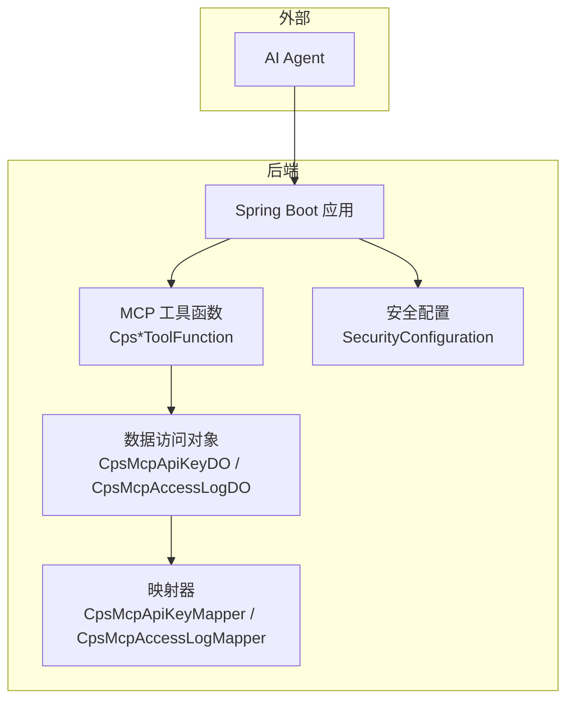
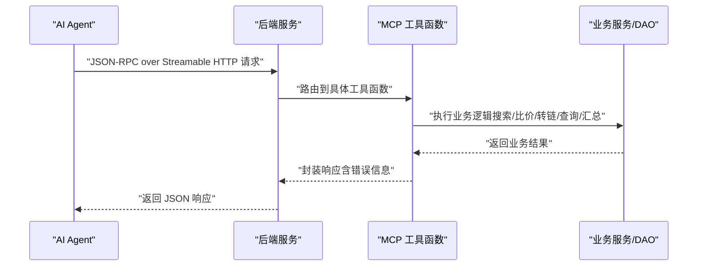
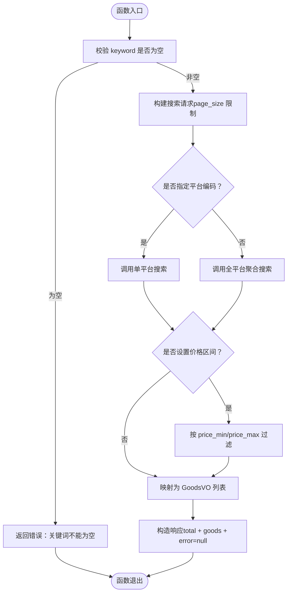
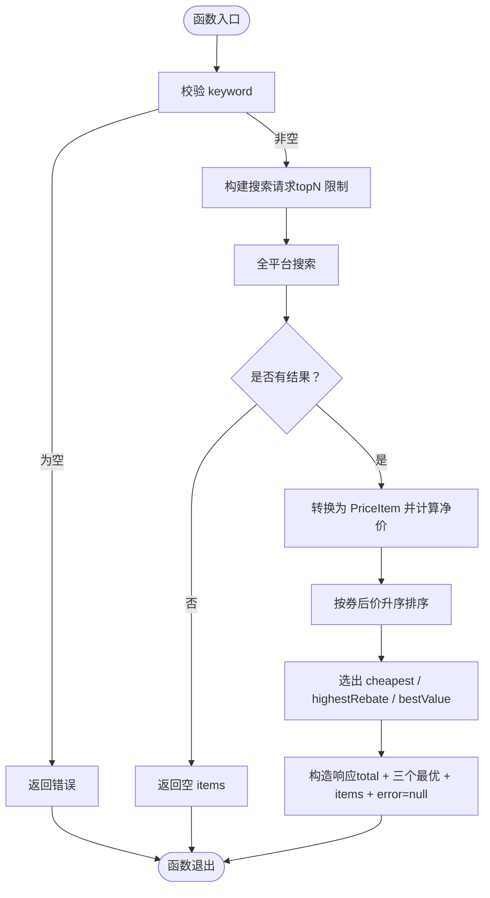
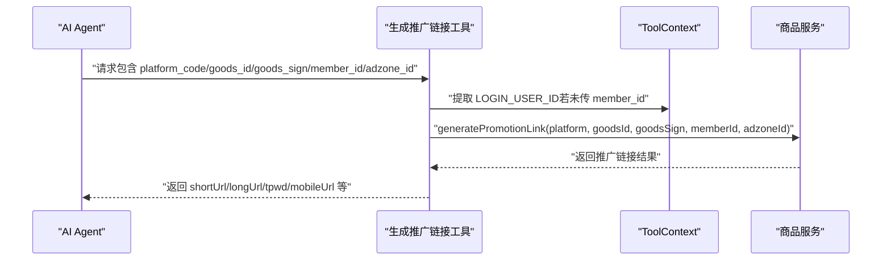
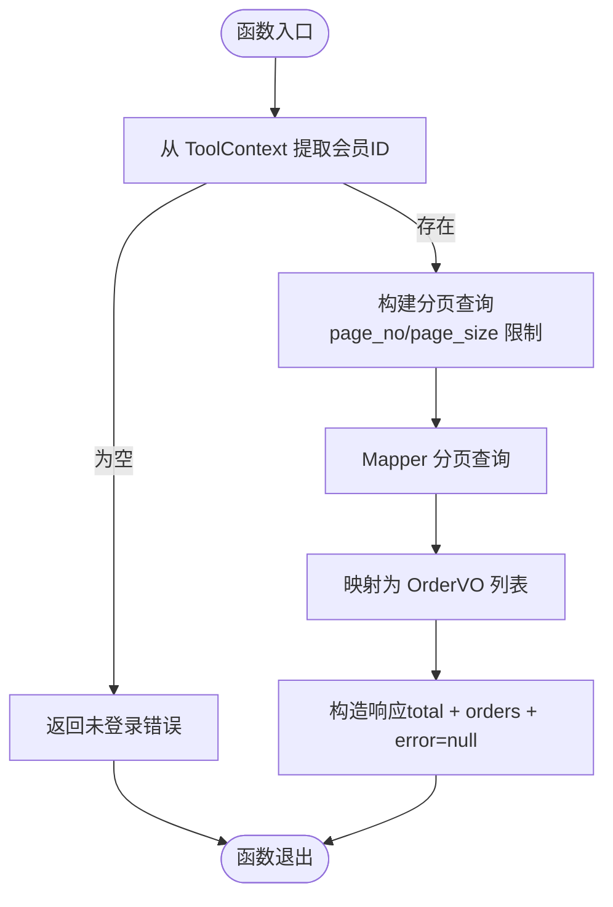
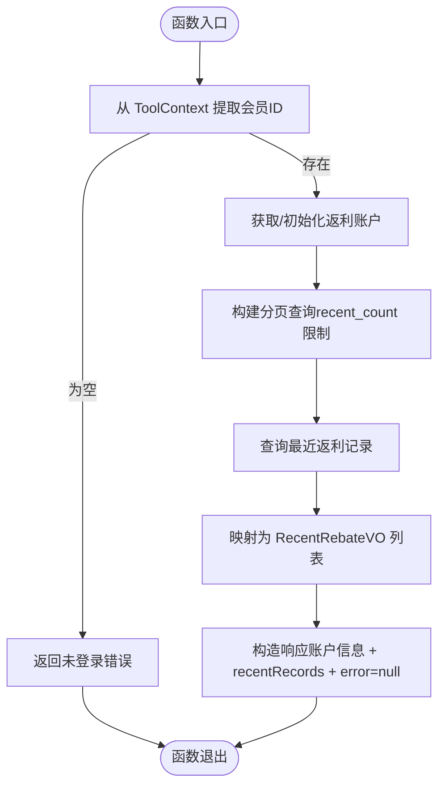
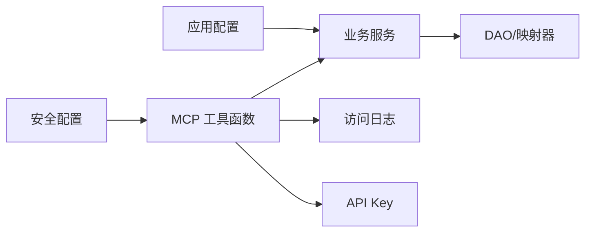

# AI MCP 接口

<cite>
**本文引用的文件**
- [README.md](file://README.md)
- [AGENTS.md](file://AGENTS.md)
- [CpsSearchGoodsToolFunction.java](file://backend/yudao-module-cps/yudao-module-cps-biz/src/main/java/cn/iocoder/yudao/module/cps/mcp/tool/CpsSearchGoodsToolFunction.java)
- [CpsComparePricesToolFunction.java](file://backend/yudao-module-cps/yudao-module-cps-biz/src/main/java/cn/iocoder/yudao/module/cps/mcp/tool/CpsComparePricesToolFunction.java)
- [CpsGenerateLinkToolFunction.java](file://backend/yudao-module-cps/yudao-module-cps-biz/src/main/java/cn/iocoder/yudao/module/cps/mcp/tool/CpsGenerateLinkToolFunction.java)
- [CpsQueryOrdersToolFunction.java](file://backend/yudao-module-cps/yudao-module-cps-biz/src/main/java/cn/iocoder/yudao/module/cps/mcp/tool/CpsQueryOrdersToolFunction.java)
- [CpsGetRebateSummaryToolFunction.java](file://backend/yudao-module-cps/yudao-module-cps-biz/src/main/java/cn/iocoder/yudao/module/cps/mcp/tool/CpsGetRebateSummaryToolFunction.java)
- [CpsMcpApiKeyDO.java](file://backend/yudao-module-cps/yudao-module-cps-biz/src/main/java/cn/iocoder/yudao/module/cps/dal/dataobject/mcp/CpsMcpApiKeyDO.java)
- [CpsMcpAccessLogDO.java](file://backend/yudao-module-cps/yudao-module-cps-biz/src/main/java/cn/iocoder/yudao/module/cps/dal/dataobject/mcp/CpsMcpAccessLogDO.java)
- [CpsMcpApiKeyMapper.java](file://backend/yudao-module-cps/yudao-module-cps-biz/src/main/java/cn/iocoder/yudao/module/cps/dal/mysql/mcp/CpsMcpApiKeyMapper.java)
- [CpsMcpAccessLogMapper.java](file://backend/yudao-module-cps/yudao-module-cps-biz/src/main/java/cn/iocoder/yudao/module/cps/dal/mysql/mcp/CpsMcpAccessLogMapper.java)
- [application-local.yaml](file://backend/yudao-server/src/main/resources/application-local.yaml)
- [SecurityConfiguration.java](file://backend/yudao-module-ai/src/main/java/cn/iocoder/yudao/module/ai/framework/security/config/SecurityConfiguration.java)
- [CPS系统PRD文档.md](file://docs/CPS系统PRD文档.md)
</cite>

## 目录
1. [简介](#简介)
2. [项目结构](#项目结构)
3. [核心组件](#核心组件)
4. [架构总览](#架构总览)
5. [详细组件分析](#详细组件分析)
6. [依赖关系分析](#依赖关系分析)
7. [性能考量](#性能考量)
8. [故障排查指南](#故障排查指南)
9. [结论](#结论)
10. [附录](#附录)

## 简介
本文件面向希望在 AgenticCPS 中集成 AI Agent 的开发者，系统化地文档化基于 Model Context Protocol（MCP）的 AI Agent 接口规范。内容涵盖：
- MCP 工具函数定义：参数说明、返回值格式、调用示例与错误处理
- 资源管理接口与提示词模板管理（基于 PRD 的现有能力）
- 工具调用协议与生命周期管理
- 资源访问控制与安全配置
- 集成示例、性能优化建议与调试方法

## 项目结构
AgenticCPS 的 MCP 接口位于 CPS 模块的业务实现层，工具函数以 Spring Bean 形式注册，通过 JSON-RPC over Streamable HTTP 暴露，端点为 /mcp/cps。API Key 与访问日志用于访问控制与审计。

**图表来源**
- [CpsSearchGoodsToolFunction.java:1-177](file://backend/yudao-module-cps/yudao-module-cps-biz/src/main/java/cn/iocoder/yudao/module/cps/mcp/tool/CpsSearchGoodsToolFunction.java#L1-L177)
- [CpsMcpApiKeyDO.java:1-61](file://backend/yudao-module-cps/yudao-module-cps-biz/src/main/java/cn/iocoder/yudao/module/cps/dal/dataobject/mcp/CpsMcpApiKeyDO.java#L1-L61)
- [CpsMcpAccessLogDO.java:1-63](file://backend/yudao-module-cps/yudao-module-cps-biz/src/main/java/cn/iocoder/yudao/module/cps/dal/dataobject/mcp/CpsMcpAccessLogDO.java#L1-L63)
- [SecurityConfiguration.java:30-42](file://backend/yudao-module-ai/src/main/java/cn/iocoder/yudao/module/ai/framework/security/config/SecurityConfiguration.java#L30-L42)

**章节来源**
- [AGENTS.md:161-169](file://AGENTS.md#L161-L169)
- [application-local.yaml:1-294](file://backend/yudao-server/src/main/resources/application-local.yaml#L1-L294)

## 核心组件
- MCP 工具函数（5 个开箱即用）
  - cps_search_goods：商品搜索
  - cps_compare_prices：跨平台比价
  - cps_generate_link：生成推广链接（转链）
  - cps_query_orders：查询会员返利订单
  - cps_get_rebate_summary：返利账户汇总
- 资源与访问控制
  - API Key 管理与权限级别
  - 访问日志与审计
- 安全与端点
  - MCP 端点与 SSE/Streamable HTTP 配置
  - 匿名访问与鉴权策略

**章节来源**
- [README.md:185-209](file://README.md#L185-L209)
- [AGENTS.md:161-169](file://AGENTS.md#L161-L169)

## 架构总览
MCP 工具函数通过 Spring Bean 注册，接收 JSON-RPC over Streamable HTTP 请求，内部调用业务服务完成数据查询与计算，并将结果封装为统一响应格式返回。API Key 与访问日志用于访问控制与审计。

**图表来源**
- [CpsSearchGoodsToolFunction.java:120-174](file://backend/yudao-module-cps/yudao-module-cps-biz/src/main/java/cn/iocoder/yudao/module/cps/mcp/tool/CpsSearchGoodsToolFunction.java#L120-L174)
- [CpsComparePricesToolFunction.java:113-173](file://backend/yudao-module-cps/yudao-module-cps-biz/src/main/java/cn/iocoder/yudao/module/cps/mcp/tool/CpsComparePricesToolFunction.java#L113-L173)
- [CpsGenerateLinkToolFunction.java:97-139](file://backend/yudao-module-cps/yudao-module-cps-biz/src/main/java/cn/iocoder/yudao/module/cps/mcp/tool/CpsGenerateLinkToolFunction.java#L97-L139)
- [CpsQueryOrdersToolFunction.java:120-157](file://backend/yudao-module-cps/yudao-module-cps-biz/src/main/java/cn/iocoder/yudao/module/cps/mcp/tool/CpsQueryOrdersToolFunction.java#L120-L157)
- [CpsGetRebateSummaryToolFunction.java:107-149](file://backend/yudao-module-cps/yudao-module-cps-biz/src/main/java/cn/iocoder/yudao/module/cps/mcp/tool/CpsGetRebateSummaryToolFunction.java#L107-L149)

## 详细组件分析

### 工具函数：cps_search_goods（商品搜索）
- 功能概述
  - 在淘宝/京东/拼多多/抖音平台搜索商品，支持关键词、平台筛选、分页与价格区间过滤，返回结构化商品列表及价格信息。
- 参数说明
  - keyword（必需）：搜索关键词
  - platform_code（可选）：平台编码（taobao/jd/pdd/douyin），不传则全平台聚合
  - page_size（可选）：每页数量，默认10，最大20
  - price_min（可选）：最低价格（元）
  - price_max（可选）：最高价格（元）
- 返回值格式
  - total：结果总数
  - goods：商品列表（包含 goodsId、platformCode、title、mainPic、originalPrice、actualPrice、couponPrice、commissionRate、commissionAmount、monthSales、shopName、goodsSign）
  - error：错误信息（成功时为 null）
- 调用示例
  - 请求示例（JSON-RPC over Streamable HTTP）
    - method: "tools/call"
    - params: { "name": "cps_search_goods", "arguments": { "keyword": "iPhone 16 手机壳", "priceMax": 50 } }
  - 响应示例
    - { "result": { "total": 12, "goods": [...], "error": null }, "error": null, "id": 1 }
- 错误处理
  - 关键词为空：返回错误信息
  - 搜索异常：捕获异常并返回错误信息
- 生命周期与资源访问
  - 生命周期：请求进入 → 参数校验 → 服务调用 → 结果封装 → 返回响应
  - 资源访问：调用商品服务，按平台或全平台聚合，必要时进行价格过滤

**图表来源**
- [CpsSearchGoodsToolFunction.java:120-174](file://backend/yudao-module-cps/yudao-module-cps-biz/src/main/java/cn/iocoder/yudao/module/cps/mcp/tool/CpsSearchGoodsToolFunction.java#L120-L174)

**章节来源**
- [CpsSearchGoodsToolFunction.java:1-177](file://backend/yudao-module-cps/yudao-module-cps-biz/src/main/java/cn/iocoder/yudao/module/cps/mcp/tool/CpsSearchGoodsToolFunction.java#L1-L177)
- [README.md:189-198](file://README.md#L189-L198)

### 工具函数：cps_compare_prices（跨平台比价）
- 功能概述
  - 在所有已启用平台搜索同一关键词，按券后价、返利金额与“净价（券后价-返利）”综合排序，推荐最优购买方案。
- 参数说明
  - keyword（必需）：商品关键词
  - topN（可选）：每个平台返回前 N 条结果参与比价，默认5，最大10
- 返回值格式
  - total：参与比价的商品总数
  - cheapest：价格最低的商品（按券后价）
  - highestRebate：返利最高的商品（按佣金）
  - bestValue：综合最优（按净价）
  - items：完整比价列表（按券后价升序）
  - error：错误信息
- 调用示例
  - 请求示例
    - method: "tools/call"
    - params: { "name": "cps_compare_prices", "arguments": { "keyword": "iPhone 16", "topN": 5 } }
  - 响应示例
    - { "result": { "total": 20, "cheapest": {...}, "highestRebate": {...}, "bestValue": {...}, "items": [...], "error": null }, "error": null, "id": 1 }
- 错误处理
  - 关键词为空：返回错误
  - 搜索无结果：返回空列表
  - 比价异常：捕获异常并返回错误信息
- 生命周期与资源访问
  - 生命周期：请求进入 → 参数校验 → 全平台搜索 → 转换与排序 → 选出三种最优 → 返回响应
  - 资源访问：调用商品服务进行全平台搜索，计算净价并排序

**图表来源**
- [CpsComparePricesToolFunction.java:113-173](file://backend/yudao-module-cps/yudao-module-cps-biz/src/main/java/cn/iocoder/yudao/module/cps/mcp/tool/CpsComparePricesToolFunction.java#L113-L173)

**章节来源**
- [CpsComparePricesToolFunction.java:1-176](file://backend/yudao-module-cps/yudao-module-cps-biz/src/main/java/cn/iocoder/yudao/module/cps/mcp/tool/CpsComparePricesToolFunction.java#L1-L176)
- [README.md:189-198](file://README.md#L189-L198)

### 工具函数：cps_generate_link（生成推广链接）
- 功能概述
  - 为指定商品生成带返利追踪的推广链接（短链、长链、淘口令、移动端链接等），支持平台差异化字段（如拼多多 goodsSign）。
- 参数说明
  - platform_code（必需）：平台编码（taobao/jd/pdd/douyin）
  - goods_id（必需）：平台商品ID
  - goods_sign（可选）：拼多多必填，其他平台可不填
  - member_id（可选）：会员ID；未传时从 ToolContext 获取（LOGIN_USER_ID）
  - adzone_id（可选）：推广位ID；未传则使用平台默认
- 返回值格式
  - shortUrl、longUrl、tpwd（淘口令）、mobileUrl（移动端链接）
  - actualPrice、commissionRate、commissionAmount、couponInfo
  - error：错误信息
- 调用示例
  - 请求示例
    - method: "tools/call"
    - params: { "name": "cps_generate_link", "arguments": { "platform_code": "taobao", "goods_id": "123456789", "member_id": 1001 } }
  - 响应示例
    - { "result": { "shortUrl": "...", "longUrl": "...", "tpwd": "...", "actualPrice": 5990, "commissionAmount": 200, "error": null }, "error": null, "id": 1 }
- 错误处理
  - 缺少必需参数：返回错误
  - 生成失败：返回错误
  - 异常：捕获并返回错误信息
- 生命周期与资源访问
  - 生命周期：请求进入 → 参数校验 → 从 ToolContext 提取会员ID → 调用商品服务生成推广链接 → 封装响应
  - 资源访问：调用商品服务生成推广链接，返回多形态链接与价格/返利信息

**图表来源**
- [CpsGenerateLinkToolFunction.java:97-139](file://backend/yudao-module-cps/yudao-module-cps-biz/src/main/java/cn/iocoder/yudao/module/cps/mcp/tool/CpsGenerateLinkToolFunction.java#L97-L139)

**章节来源**
- [CpsGenerateLinkToolFunction.java:1-142](file://backend/yudao-module-cps/yudao-module-cps-biz/src/main/java/cn/iocoder/yudao/module/cps/mcp/tool/CpsGenerateLinkToolFunction.java#L1-L142)
- [AGENTS.md:31-32](file://AGENTS.md#L31-L32)

### 工具函数：cps_query_orders（查询会员返利订单）
- 功能概述
  - 查询当前登录会员的订单列表及返利状态，支持按平台与状态筛选，分页返回。
- 参数说明
  - platform_code（可选）：平台编码（taobao/jd/pdd/douyin）
  - order_status（可选）：订单状态（ordered/paid/received/settled/rebate_received/refunded/invalid）
  - page_no（可选）：页码，默认1
  - page_size（可选）：每页数量，默认10，最大20
- 返回值格式
  - total：总记录数
  - orders：订单列表（包含 id、platformCode、platformOrderId、itemTitle、itemPic、finalPrice、estimateRebate、realRebate、orderStatus、rebateTime、createTime）
  - error：错误信息
- 调用示例
  - 请求示例
    - method: "tools/call"
    - params: { "name": "cps_query_orders", "arguments": { "platform_code": "taobao", "page_size": 10 } }
  - 响应示例
    - { "result": { "total": 150, "orders": [...], "error": null }, "error": null, "id": 1 }
- 错误处理
  - 未登录或无法获取用户信息：返回错误
  - 查询异常：捕获并返回错误信息
- 生命周期与资源访问
  - 生命周期：请求进入 → 从 ToolContext 提取会员ID → 构建分页查询 → 调用订单Mapper → 封装响应
  - 资源访问：订单Mapper分页查询，返回订单VO列表

**图表来源**
- [CpsQueryOrdersToolFunction.java:120-157](file://backend/yudao-module-cps/yudao-module-cps-biz/src/main/java/cn/iocoder/yudao/module/cps/mcp/tool/CpsQueryOrdersToolFunction.java#L120-L157)

**章节来源**
- [CpsQueryOrdersToolFunction.java:1-169](file://backend/yudao-module-cps/yudao-module-cps-biz/src/main/java/cn/iocoder/yudao/module/cps/mcp/tool/CpsQueryOrdersToolFunction.java#L1-L169)
- [AGENTS.md:37-37](file://AGENTS.md#L37-L37)

### 工具函数：cps_get_rebate_summary（返利账户汇总）
- 功能概述
  - 查询当前登录会员的返利账户余额、待结算金额、累计返利总额、已提现金额及最近返利记录。
- 参数说明
  - recent_count（可选）：查询最近 N 条返利记录，默认5，最大20
- 返回值格式
  - availableBalance、frozenBalance、totalRebate、withdrawnAmount、accountStatus（normal/frozen）
  - recentRecords：最近返利记录（包含 itemTitle、platformCode、rebateAmount、rebateType、rebateStatus、createTime）
  - error：错误信息
- 调用示例
  - 请求示例
    - method: "tools/call"
    - params: { "name": "cps_get_rebate_summary", "arguments": { "recent_count": 5 } }
  - 响应示例
    - { "result": { "availableBalance": 1200, "frozenBalance": 0, "totalRebate": 5000, "withdrawnAmount": 3800, "accountStatus": "normal", "recentRecords": [...], "error": null }, "error": null, "id": 1 }
- 错误处理
  - 未登录或无法获取用户信息：返回错误
  - 查询异常：捕获并返回错误信息
- 生命周期与资源访问
  - 生命周期：请求进入 → 从 ToolContext 提取会员ID → 获取/初始化返利账户 → 查询最近返利记录 → 封装响应
  - 资源访问：返利账户服务与返利记录Mapper

**图表来源**
- [CpsGetRebateSummaryToolFunction.java:107-149](file://backend/yudao-module-cps/yudao-module-cps-biz/src/main/java/cn/iocoder/yudao/module/cps/mcp/tool/CpsGetRebateSummaryToolFunction.java#L107-L149)

**章节来源**
- [CpsGetRebateSummaryToolFunction.java:1-162](file://backend/yudao-module-cps/yudao-module-cps-biz/src/main/java/cn/iocoder/yudao/module/cps/mcp/tool/CpsGetRebateSummaryToolFunction.java#L1-L162)
- [AGENTS.md:36-36](file://AGENTS.md#L36-L36)

### 资源管理与提示词模板管理
- API Key 管理
  - 字段：name、keyValue、description、status、expireTime、lastUseTime、useCount
  - 权限级别：public（仅查询）/ member（会员级操作）/ admin（管理权限）
  - 限流配置：每分钟/小时/天的最大请求数
- 访问日志
  - 字段：apiKeyId、toolName、requestParams、responseData、status、errorMessage、durationMs、clientIp
- 提示词模板管理
  - PRD 中明确存在“MCP Tools配置”页面，支持查看工具列表、配置权限、查看使用统计与性能指标、配置参数默认值与限制
  - 管理后台还提供“MCP访问日志”页面，用于审计与监控

**章节来源**
- [CpsMcpApiKeyDO.java:1-61](file://backend/yudao-module-cps/yudao-module-cps-biz/src/main/java/cn/iocoder/yudao/module/cps/dal/dataobject/mcp/CpsMcpApiKeyDO.java#L1-L61)
- [CpsMcpAccessLogDO.java:1-63](file://backend/yudao-module-cps/yudao-module-cps-biz/src/main/java/cn/iocoder/yudao/module/cps/dal/dataobject/mcp/CpsMcpAccessLogDO.java#L1-L63)
- [CPS系统PRD文档.md:698-737](file://docs/CPS系统PRD文档.md#L698-L737)

### 工具调用协议与生命周期
- 协议与端点
  - JSON-RPC 2.0 over Streamable HTTP
  - 端点：/mcp/cps
- 生命周期
  - 请求进入：参数校验与权限检查
  - 业务执行：调用相应服务与DAO
  - 响应封装：统一返回格式，包含错误信息
  - 审计记录：访问日志入库
- 资源访问控制
  - API Key：用于鉴权与限流
  - ToolContext：传递登录用户上下文（如 LOGIN_USER_ID）

**章节来源**
- [AGENTS.md:161-169](file://AGENTS.md#L161-L169)
- [CpsMcpApiKeyMapper.java:1-19](file://backend/yudao-module-cps/yudao-module-cps-biz/src/main/java/cn/iocoder/yudao/module/cps/dal/mysql/mcp/CpsMcpApiKeyMapper.java#L1-L19)
- [CpsMcpAccessLogMapper.java:1-15](file://backend/yudao-module-cps/yudao-module-cps-biz/src/main/java/cn/iocoder/yudao/module/cps/dal/mysql/mcp/CpsMcpAccessLogMapper.java#L1-L15)

## 依赖关系分析
- 组件耦合
  - 工具函数依赖业务服务与DAO，保持高内聚、低耦合
  - API Key 与访问日志作为横切关注点，贯穿工具函数调用链
- 外部依赖
  - Spring AI（MCP 支持）
  - 平台适配器（淘宝/京东/拼多多/抖音）
- 安全与配置
  - 安全配置对 MCP SSE/Streamable HTTP 端点放行
  - 应用配置中包含平台 API Key 与默认推广位等

**图表来源**
- [CpsSearchGoodsToolFunction.java:1-177](file://backend/yudao-module-cps/yudao-module-cps-biz/src/main/java/cn/iocoder/yudao/module/cps/mcp/tool/CpsSearchGoodsToolFunction.java#L1-L177)
- [CpsMcpApiKeyDO.java:1-61](file://backend/yudao-module-cps/yudao-module-cps-biz/src/main/java/cn/iocoder/yudao/module/cps/dal/dataobject/mcp/CpsMcpApiKeyDO.java#L1-L61)
- [CpsMcpAccessLogDO.java:1-63](file://backend/yudao-module-cps/yudao-module-cps-biz/src/main/java/cn/iocoder/yudao/module/cps/dal/dataobject/mcp/CpsMcpAccessLogDO.java#L1-L63)
- [SecurityConfiguration.java:30-42](file://backend/yudao-module-ai/src/main/java/cn/iocoder/yudao/module/ai/framework/security/config/SecurityConfiguration.java#L30-L42)
- [application-local.yaml:240-258](file://backend/yudao-server/src/main/resources/application-local.yaml#L240-L258)

**章节来源**
- [SecurityConfiguration.java:30-42](file://backend/yudao-module-ai/src/main/java/cn/iocoder/yudao/module/ai/framework/security/config/SecurityConfiguration.java#L30-L42)
- [application-local.yaml:240-258](file://backend/yudao-server/src/main/resources/application-local.yaml#L240-L258)

## 性能考量
- 搜索与比价
  - 单平台搜索 P99 < 2 秒，多平台比价 P99 < 5 秒
  - 转链生成 < 1 秒
- 查询类
  - 订单查询与返利汇总 P99 < 1 秒
- 其他
  - MCP Tool 调用 P99 < 3 秒（搜索类）/ < 1 秒（查询类）
- 优化建议
  - 合理设置 page_size/topN，避免过大导致延迟上升
  - 使用缓存与索引优化热点查询
  - 并行搜索平台时注意超时控制与资源隔离

**章节来源**
- [README.md:332-341](file://README.md#L332-L341)

## 故障排查指南
- 常见错误
  - 关键词为空：工具函数直接返回错误信息
  - 未登录或无法获取用户信息：查询订单与返利汇总工具返回错误
  - 参数缺失（如生成推广链接缺少 platform_code/goods_id）：返回错误
  - 平台接口异常：捕获异常并返回错误信息
- 审计与定位
  - 通过访问日志表字段（apiKeyId、toolName、requestParams、errorMessage、durationMs、clientIp）定位问题
  - 检查 API Key 状态与过期时间
- 安全与权限
  - 确认 MCP 端点已放行
  - 核对工具权限级别与调用方 API Key 权限匹配

**章节来源**
- [CpsSearchGoodsToolFunction.java:120-174](file://backend/yudao-module-cps/yudao-module-cps-biz/src/main/java/cn/iocoder/yudao/module/cps/mcp/tool/CpsSearchGoodsToolFunction.java#L120-L174)
- [CpsComparePricesToolFunction.java:113-173](file://backend/yudao-module-cps/yudao-module-cps-biz/src/main/java/cn/iocoder/yudao/module/cps/mcp/tool/CpsComparePricesToolFunction.java#L113-L173)
- [CpsGenerateLinkToolFunction.java:97-139](file://backend/yudao-module-cps/yudao-module-cps-biz/src/main/java/cn/iocoder/yudao/module/cps/mcp/tool/CpsGenerateLinkToolFunction.java#L97-L139)
- [CpsQueryOrdersToolFunction.java:120-157](file://backend/yudao-module-cps/yudao-module-cps-biz/src/main/java/cn/iocoder/yudao/module/cps/mcp/tool/CpsQueryOrdersToolFunction.java#L120-L157)
- [CpsGetRebateSummaryToolFunction.java:107-149](file://backend/yudao-module-cps/yudao-module-cps-biz/src/main/java/cn/iocoder/yudao/module/cps/mcp/tool/CpsGetRebateSummaryToolFunction.java#L107-L149)
- [CpsMcpAccessLogDO.java:1-63](file://backend/yudao-module-cps/yudao-module-cps-biz/src/main/java/cn/iocoder/yudao/module/cps/dal/dataobject/mcp/CpsMcpAccessLogDO.java#L1-L63)
- [CPS系统PRD文档.md:698-737](file://docs/CPS系统PRD文档.md#L698-L737)

## 结论
AgenticCPS 的 MCP 接口提供了开箱即用的 5 个 AI 工具函数，覆盖商品搜索、跨平台比价、推广链接生成、订单查询与返利汇总等核心场景。通过 API Key 与访问日志实现访问控制与审计，结合 Spring AI 的 MCP 支持，AI Agent 可直接调用这些工具而无需额外开发。建议在集成时关注参数校验、权限配置与性能优化，并利用访问日志进行问题定位与监控。

## 附录
- 集成步骤建议
  - 申请 API Key 并配置权限级别与限流
  - 在 AI Agent 中配置 MCP 端点与认证方式
  - 依据工具函数参数与返回值格式编写调用逻辑
  - 使用访问日志与性能指标进行监控与优化
- 参考配置
  - 平台 API Key 与默认推广位配置参考应用配置文件

**章节来源**
- [application-local.yaml:240-258](file://backend/yudao-server/src/main/resources/application-local.yaml#L240-L258)
- [AGENTS.md:161-169](file://AGENTS.md#L161-L169)