# API 接口文档

<cite>
**本文引用的文件**
- [pom.xml](file://backend/pom.xml)
- [application.yaml](file://backend/yudao-server/src/main/resources/application.yaml)
- [SwaggerConfiguration.java](file://agent_improvement/sdk_demo/dataoke-sdk-java/src/main/java/com/dtk/api/controller/config/SwaggerConfiguration.java)
- [BaseController.java](file://agent_improvement/sdk_demo/dataoke-sdk-java/src/main/java/com/dtk/api/controller/base/BaseController.java)
- [Result.java](file://agent_improvement/sdk_demo/dataoke-sdk-java/src/main/java/com/dtk/api/exception/Result.java)
- [DtkApiException.java](file://agent_improvement/sdk_demo/dataoke-sdk-java/src/main/java/com/dtk/api/exception/DtkApiException.java)
- [DtkResultEnum.java](file://agent_improvement/sdk_demo/dataoke-sdk-java/src/main/java/com/dtk/api/exception/DtkResultEnum.java)
- [DtkApiClient.java](file://agent_improvement/sdk_demo/dataoke-sdk-java/src/main/java/com/dtk/api/client/DtkApiClient.java)
- [DtkApiRequest.java](file://agent_improvement/sdk_demo/dataoke-sdk-java/src/main/java/com/dtk/api/client/DtkApiRequest.java)
- [DtkActivityLinkRequest.java](file://agent_improvement/sdk_demo/dataoke-sdk-java/src/main/java/com/dtk/api/request/mastertool/DtkActivityLinkRequest.java)
- [DtkCommodityMaterialsRequest.java](file://agent_improvement/sdk_demo/dataoke-sdk-java/src/main/java/com/dtk/api/request/mastertool/DtkCommodityMaterialsRequest.java)
- [DtkCouponQueryRequest.java](file://agent_improvement/sdk_demo/dataoke-sdk-java/src/main/java/com/dtk/api/request/mastertool/DtkCouponQueryRequest.java)
- [CpsAdzoneTypeEnum.java](file://backend/yudao-module-cps/yudao-module-cps-api/src/main/java/cn/iocoder/yudao/module/cps/enums/CpsAdzoneTypeEnum.java)
- [CpsErrorCodeConstants.java](file://backend/yudao-module-cps/yudao-module-cps-api/src/main/java/cn/iocoder/yudao/module/cps/enums/CpsErrorCodeConstants.java)
- [CpsFreezeStatusEnum.java](file://backend/yudao-module-cps/yudao-module-cps-api/src/main/java/cn/iocoder/yudao/module/cps/enums/CpsFreezeStatusEnum.java)
- [CpsOrderStatusEnum.java](file://backend/yudao-module-cps/yudao-module-cps-api/src/main/java/cn/iocoder/yudao/module/cps/enums/CpsOrderStatusEnum.java)
- [CpsPlatformCodeEnum.java](file://backend/yudao-module-cps/yudao-module-cps-api/src/main/java/cn/iocoder/yudao/module/cps/enums/CpsPlatformCodeEnum.java)
- [CpsRebateStatusEnum.java](file://backend/yudao-module-cps/yudao-module-cps-api/src/main/java/cn/iocoder/yudao/module/cps/enums/CpsRebateStatusEnum.java)
- [CpsRebateTypeEnum.java](file://backend/yudao-module-cps/yudao-module-cps-api/src/main/java/cn/iocoder/yudao/module/cps/enums/CpsRebateTypeEnum.java)
- [CpsRiskRuleTypeEnum.java](file://backend/yudao-module-cps/yudao-module-cps-api/src/main/java/cn/iocoder/yudao/module/cps/enums/CpsRiskRuleTypeEnum.java)
- [CpsWithdrawStatusEnum.java](file://backend/yudao-module-cps/yudao-module-cps-api/src/main/java/cn/iocoder/yudao/module/cps/enums/CpsWithdrawStatusEnum.java)
- [TradeApi.java](file://backend/yudao-module-mall/yudao-module-trade-api/src/main/java/cn/iocoder/yudao/module/trade/api/TradeApi.java)
- [ProductApi.java](file://backend/yudao-module-mall/yudao-module-product/src/main/java/cn/iocoder/yudao/module/product/api/ProductApi.java)
- [MemberApi.java](file://backend/yudao-module-member/src/main/java/cn/iocoder/yudao/module/member/api/MemberApi.java)
- [PayApi.java](file://backend/yudao-module-pay/src/main/java/cn/iocoder/yudao/module/pay/api/PayApi.java)
- [SystemApi.java](file://backend/yudao-module-system/src/main/java/cn/iocoder/yudao/module/system/api/SystemApi.java)
- [InfraApi.java](file://backend/yudao-module-infra/src/main/java/cn/iocoder/yudao/module/infra/api/InfraApi.java)
- [MpApi.java](file://backend/yudao-module-mp/src/main/java/cn/iocoder/yudao/module/mp/api/MpApi.java)
- [ReportApi.java](file://backend/yudao-module-report/src/main/java/cn/iocoder/yudao/module/report/api/ReportApi.java)
- [AiApi.java](file://backend/yudao-module-ai/src/main/java/cn/iocoder/yudao/module/ai/api/AiApi.java)
- [CpsApi.java](file://backend/yudao-module-cps/src/main/java/cn/iocoder/yudao/module/cps/api/CpsApi.java)
</cite>

## 目录
1. [简介](#简介)
2. [项目结构](#项目结构)
3. [核心组件](#核心组件)
4. [架构总览](#架构总览)
5. [详细组件分析](#详细组件分析)
6. [依赖关系分析](#依赖关系分析)
7. [性能考虑](#性能考虑)
8. [故障排除指南](#故障排除指南)
9. [结论](#结论)
10. [附录](#附录)

## 简介
本文件为 AgenticCPS 项目的完整 API 接口文档，覆盖管理后台与会员端的 RESTful 接口规范。文档内容包括：
- 接口分类：订单管理、商品管理、用户管理、支付管理、系统配置、营销推广、报表统计、微信生态、AI 能力等
- 接口规范：HTTP 方法、URL 模式、请求/响应模式、认证方式与参数说明
- 错误处理策略、状态码说明与版本信息
- 接口测试方法、调试工具与性能优化建议
- 安全考虑、权限控制与限流策略
- Swagger 文档集成与自动化测试方法

## 项目结构
后端采用多模块聚合工程，核心模块如下：
- yudao-server：服务启动与配置中心
- yudao-framework：通用框架与基础设施（安全、Web、MyBatis、Redis、定时任务等）
- yudao-module-*：业务模块（系统、基础设施、会员、商品、交易、支付、营销、报表、微信、AI、CPS 等）

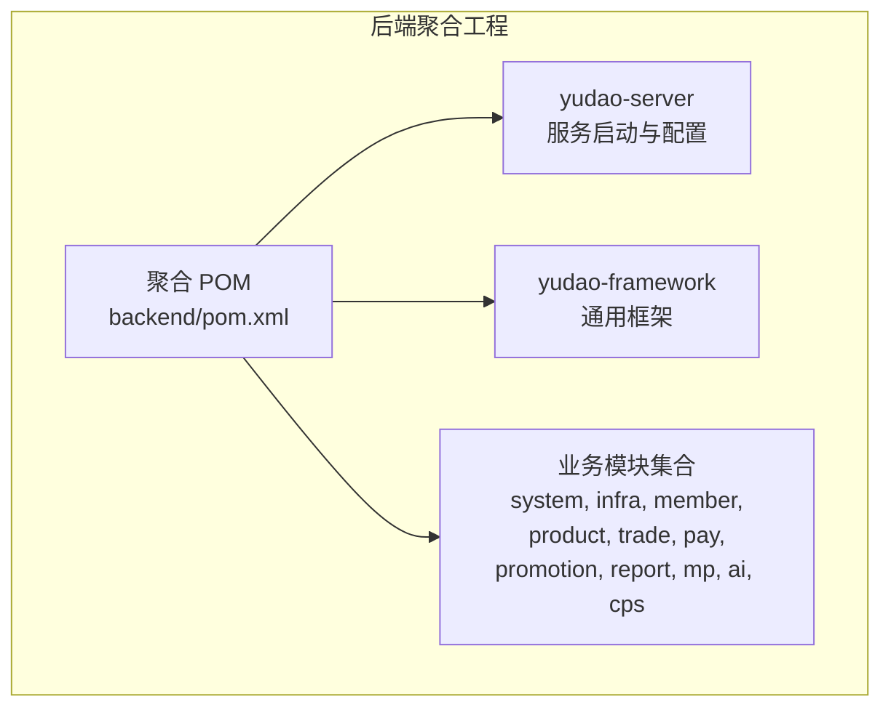

**图表来源**
- [pom.xml:10-25](file://backend/pom.xml#L10-L25)

**章节来源**
- [pom.xml:1-176](file://backend/pom.xml#L1-L176)

## 核心组件
- 通用返回模型与异常体系：统一响应结构、错误枚举与异常类型，便于前端与客户端一致处理
- Swagger 文档集成：基于注解生成接口文档，支持在线调试
- 认证与安全：基于 Spring Security 的权限控制与签名保护
- 分布式能力：Redis、消息队列、定时任务、链路追踪等

**章节来源**
- [Result.java](file://agent_improvement/sdk_demo/dataoke-sdk-java/src/main/java/com/dtk/api/exception/Result.java)
- [DtkApiException.java](file://agent_improvement/sdk_demo/dataoke-sdk-java/src/main/java/com/dtk/api/exception/DtkApiException.java)
- [DtkResultEnum.java](file://agent_improvement/sdk_demo/dataoke-sdk-java/src/main/java/com/dtk/api/exception/DtkResultEnum.java)
- [SwaggerConfiguration.java](file://agent_improvement/sdk_demo/dataoke-sdk-java/src/main/java/com/dtk/api/controller/config/SwaggerConfiguration.java)

## 架构总览
系统采用分层架构与微服务思想，通过 API 层暴露能力，业务逻辑由各模块实现，数据访问通过 MyBatis，缓存与消息通过 Redis 与 MQ。

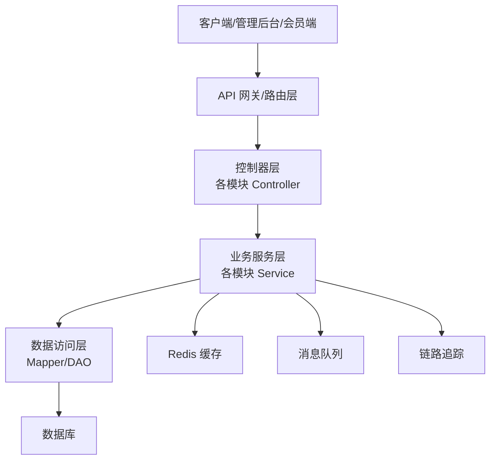

## 详细组件分析

### 商品管理模块（Product）
- 模块职责：商品信息维护、类目管理、库存与价格管理
- 关键接口：商品列表查询、商品详情、商品新增/修改、上下架、批量操作
- 认证与权限：需登录且具备商品管理权限
- 响应模型：统一 Result 包裹数据或错误信息

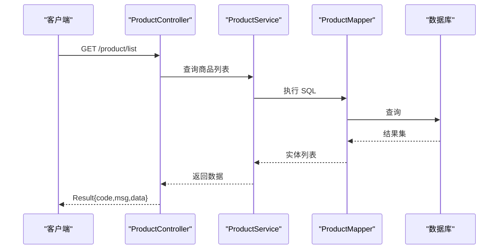

**章节来源**
- [ProductApi.java](file://backend/yudao-module-mall/yudao-module-product/src/main/java/cn/iocoder/yudao/module/product/api/ProductApi.java)

### 订单管理模块（Trade）
- 模块职责：订单生命周期管理、订单查询、退款与售后
- 关键接口：订单列表、订单详情、订单状态变更、导出订单
- 认证与权限：需登录且具备订单管理权限
- 响应模型：统一 Result 包裹数据或错误信息

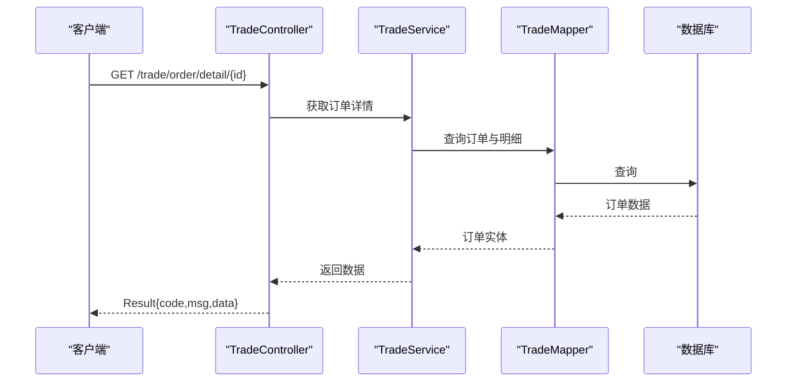

**章节来源**
- [TradeApi.java](file://backend/yudao-module-mall/yudao-module-trade-api/src/main/java/cn/iocoder/yudao/module/trade/api/TradeApi.java)

### 用户管理模块（Member）
- 模块职责：会员信息、等级、积分、账户余额等
- 关键接口：会员列表、会员详情、会员等级变更、积分流水
- 认证与权限：需登录且具备会员管理权限
- 响应模型：统一 Result 包裹数据或错误信息

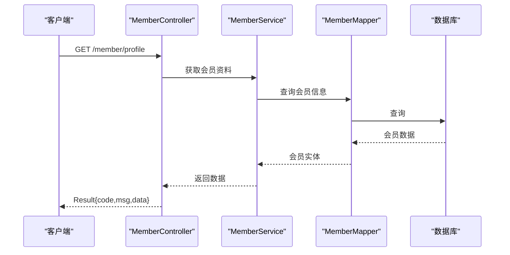

**章节来源**
- [MemberApi.java](file://backend/yudao-module-member/src/main/java/cn/iocoder/yudao/module/member/api/MemberApi.java)

### 支付管理模块（Pay）
- 模块职责：支付下单、回调处理、退款、对账
- 关键接口：统一下单、支付结果查询、退款申请
- 认证与权限：需登录且具备支付相关权限
- 响应模型：统一 Result 包裹数据或错误信息

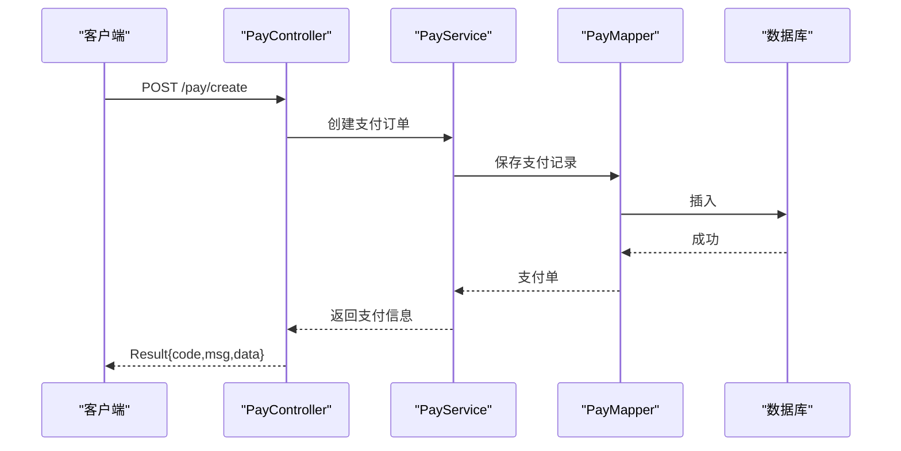

**章节来源**
- [PayApi.java](file://backend/yudao-module-pay/src/main/java/cn/iocoder/yudao/module/pay/api/PayApi.java)

### 系统配置模块（System）
- 模块职责：字典、参数、通知模板、操作日志等
- 关键接口：字典类型/值管理、系统参数设置、通知模板维护
- 认证与权限：需登录且具备系统管理权限
- 响应模型：统一 Result 包裹数据或错误信息

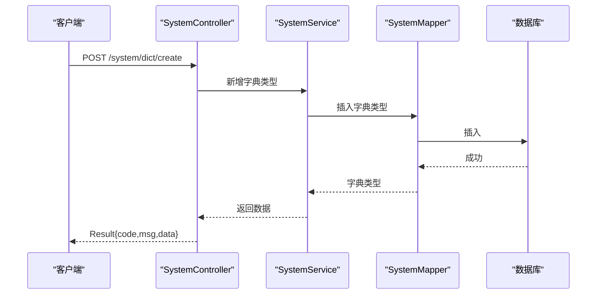

**章节来源**
- [SystemApi.java](file://backend/yudao-module-system/src/main/java/cn/iocoder/yudao/module/system/api/SystemApi.java)

### 基础设施模块（Infra）
- 模块职责：文件上传、健康检查、代码生成、SQL 监控等
- 关键接口：文件上传、健康检查、SQL 执行
- 认证与权限：按功能开放或需管理员权限
- 响应模型：统一 Result 包裹数据或错误信息

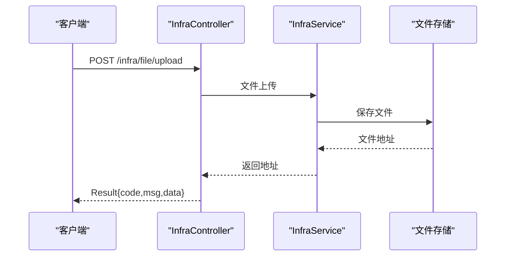

**章节来源**
- [InfraApi.java](file://backend/yudao-module-infra/src/main/java/cn/iocoder/yudao/module/infra/api/InfraApi.java)

### 微信生态模块（MP）
- 模块职责：公众号账号、素材、菜单、消息与标签管理
- 关键接口：账号配置、素材上传、菜单管理、用户标签
- 认证与权限：需登录且具备微信运营权限
- 响应模型：统一 Result 包裹数据或错误信息

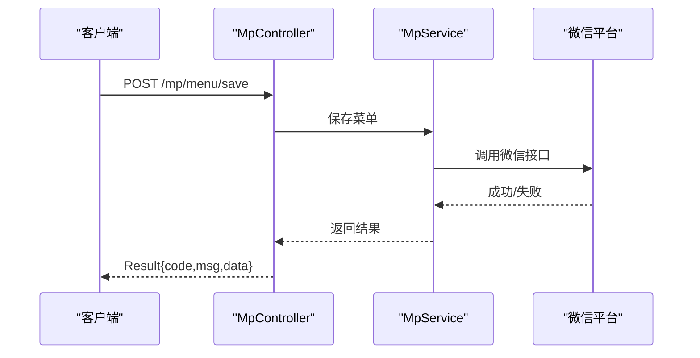

**章节来源**
- [MpApi.java](file://backend/yudao-module-mp/src/main/java/cn/iocoder/yudao/module/mp/api/MpApi.java)

### 报表统计模块（Report）
- 模块职责：销售报表、用户增长、商品分析等
- 关键接口：销售汇总、用户画像、商品销量排行
- 认证与权限：需登录且具备报表查看权限
- 响应模型：统一 Result 包裹数据或错误信息

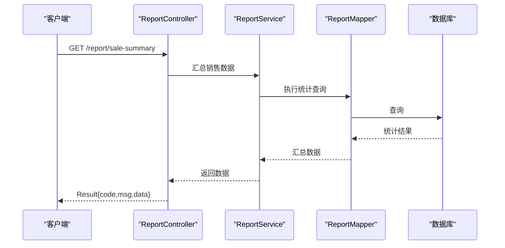

**章节来源**
- [ReportApi.java](file://backend/yudao-module-report/src/main/java/cn/iocoder/yudao/module/report/api/ReportApi.java)

### AI 能力模块（AI）
- 模块职责：智能客服、内容生成、图片处理等
- 关键接口：文本生成、图片描述、智能问答
- 认证与权限：需登录且具备 AI 能力使用权限
- 响应模型：统一 Result 包裹数据或错误信息

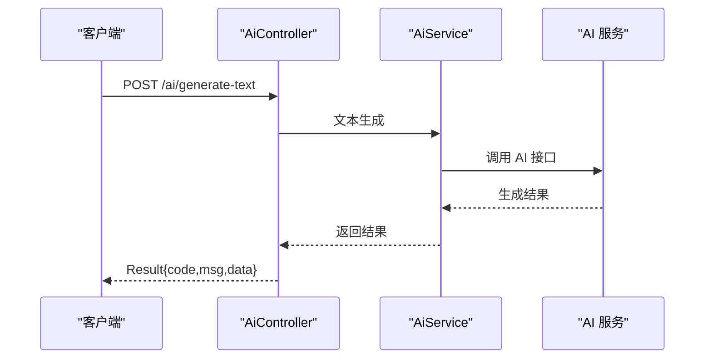

**章节来源**
- [AiApi.java](file://backend/yudao-module-ai/src/main/java/cn/iocoder/yudao/module/ai/api/AiApi.java)

### CPS 推广模块（CPS）
- 模块职责：推广位、佣金、订单、提现、风控
- 关键接口：推广位管理、佣金结算、订单查询、提现申请
- 认证与权限：需登录且具备推广管理权限
- 响应模型：统一 Result 包裹数据或错误信息

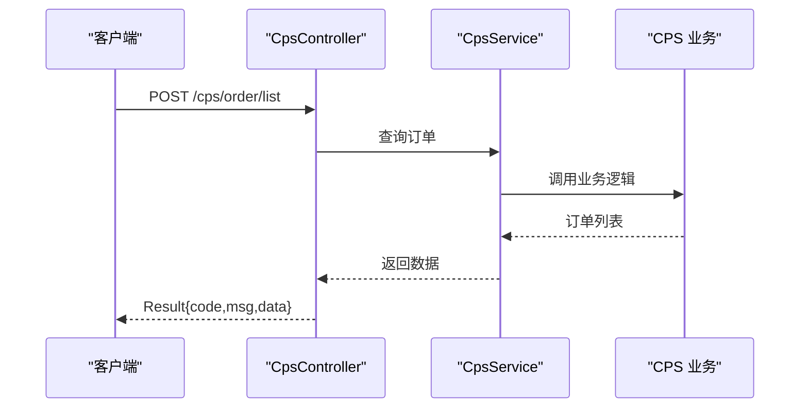

**章节来源**
- [CpsApi.java](file://backend/yudao-module-cps/src/main/java/cn/iocoder/yudao/module/cps/api/CpsApi.java)

### 数据模型与枚举
- 平台编码、广告位类型、冻结状态、订单状态、返佣类型、提现状态、风控规则等枚举，用于接口参数与返回值的标准化

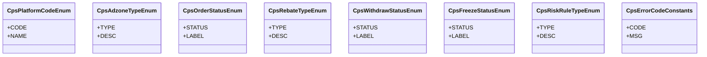

**图表来源**
- [CpsPlatformCodeEnum.java](file://backend/yudao-module-cps/yudao-module-cps-api/src/main/java/cn/iocoder/yudao/module/cps/enums/CpsPlatformCodeEnum.java)
- [CpsAdzoneTypeEnum.java](file://backend/yudao-module-cps/yudao-module-cps-api/src/main/java/cn/iocoder/yudao/module/cps/enums/CpsAdzoneTypeEnum.java)
- [CpsOrderStatusEnum.java](file://backend/yudao-module-cps/yudao-module-cps-api/src/main/java/cn/iocoder/yudao/module/cps/enums/CpsOrderStatusEnum.java)
- [CpsRebateTypeEnum.java](file://backend/yudao-module-cps/yudao-module-cps-api/src/main/java/cn/iocoder/yudao/module/cps/enums/CpsRebateTypeEnum.java)
- [CpsWithdrawStatusEnum.java](file://backend/yudao-module-cps/yudao-module-cps-api/src/main/java/cn/iocoder/yudao/module/cps/enums/CpsWithdrawStatusEnum.java)
- [CpsFreezeStatusEnum.java](file://backend/yudao-module-cps/yudao-module-cps-api/src/main/java/cn/iocoder/yudao/module/cps/enums/CpsFreezeStatusEnum.java)
- [CpsRiskRuleTypeEnum.java](file://backend/yudao-module-cps/yudao-module-cps-api/src/main/java/cn/iocoder/yudao/module/cps/enums/CpsRiskRuleTypeEnum.java)
- [CpsErrorCodeConstants.java](file://backend/yudao-module-cps/yudao-module-cps-api/src/main/java/cn/iocoder/yudao/module/cps/enums/CpsErrorCodeConstants.java)

## 依赖关系分析
- 模块间依赖：各业务模块通过 yudao-framework 提供的通用能力（安全、Web、MyBatis、Redis、定时任务等）协作
- 外部依赖：MySQL、Redis、消息队列、链路追踪等
- 依赖图（简化）

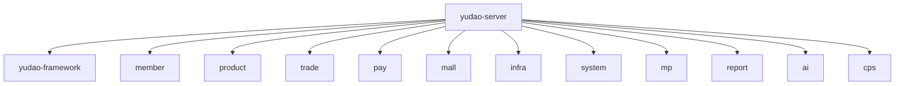

**图表来源**
- [pom.xml:10-25](file://backend/pom.xml#L10-L25)

**章节来源**
- [pom.xml:1-176](file://backend/pom.xml#L1-L176)

## 性能考虑
- 缓存策略：热点数据使用 Redis 缓存，避免频繁数据库访问
- 分页查询：列表接口统一使用分页参数，避免一次性加载大量数据
- 异步处理：耗时操作通过消息队列异步执行，如订单状态更新、报表生成
- 数据库优化：合理索引、批量插入/更新、慢查询监控
- 接口幂等：重要写操作需保证幂等性，防止重复提交
- 压测与容量规划：定期进行压测，评估并发与延迟指标

## 故障排除指南
- 统一异常处理：所有异常通过统一异常处理器转换为 Result 格式返回
- 错误码规范：参考错误枚举，确保前后端一致理解错误含义
- 日志与追踪：开启链路追踪，定位问题根因
- 常见问题排查：
  - 认证失败：检查 Token 是否过期或签名是否正确
  - 权限不足：确认用户角色与资源权限映射
  - 数据不一致：检查分布式事务与缓存一致性策略

**章节来源**
- [DtkApiException.java](file://agent_improvement/sdk_demo/dataoke-sdk-java/src/main/java/com/dtk/api/exception/DtkApiException.java)
- [DtkResultEnum.java](file://agent_improvement/sdk_demo/dataoke-sdk-java/src/main/java/com/dtk/api/exception/DtkResultEnum.java)
- [Result.java](file://agent_improvement/sdk_demo/dataoke-sdk-java/src/main/java/com/dtk/api/exception/Result.java)

## 结论
本接口文档覆盖了管理后台与会员端的核心能力，结合统一的响应模型、异常处理与安全策略，能够支撑高并发与复杂业务场景。建议在生产环境中配合完善的监控、压测与灰度发布流程，持续优化性能与稳定性。

## 附录

### 接口测试方法
- 在线调试：通过 Swagger 文档在线调用接口，快速验证参数与返回
- Postman/HTTP Client：导入环境变量与认证信息，批量执行接口用例
- 自动化测试：基于测试框架编写接口测试脚本，定期回归

**章节来源**
- [SwaggerConfiguration.java](file://agent_improvement/sdk_demo/dataoke-sdk-java/src/main/java/com/dtk/api/controller/config/SwaggerConfiguration.java)
- [application.yaml](file://backend/yudao-server/src/main/resources/application.yaml)

### 调试工具
- 浏览器开发者工具：抓包与查看网络请求
- 日志工具：查看服务端日志与链路追踪 ID
- 数据库工具：执行 SQL 与分析慢查询

### 性能优化建议
- CDN 与静态资源：图片与静态资源走 CDN
- 连接池与超时：合理配置数据库与 HTTP 客户端连接池
- 前端缓存：利用浏览器缓存与本地存储减少重复请求
- 限流与熔断：对外暴露接口实施限流与熔断，保护系统稳定

### 安全考虑与权限控制
- 认证：Token 验证，支持刷新与失效
- 授权：RBAC 权限模型，细粒度资源授权
- 签名：关键接口启用签名保护，防重放与篡改
- 限流：基于 IP/用户/接口维度限流，防止恶意刷量
- 加密：敏感数据传输与存储加密

### Swagger 文档集成与自动化测试
- Swagger 集成：通过注解生成接口文档，支持在线调试
- 自动化测试：结合测试框架与 CI/CD，实现接口自动化回归

**章节来源**
- [SwaggerConfiguration.java](file://agent_improvement/sdk_demo/dataoke-sdk-java/src/main/java/com/dtk/api/controller/config/SwaggerConfiguration.java)
- [BaseController.java](file://agent_improvement/sdk_demo/dataoke-sdk-java/src/main/java/com/dtk/api/controller/base/BaseController.java)