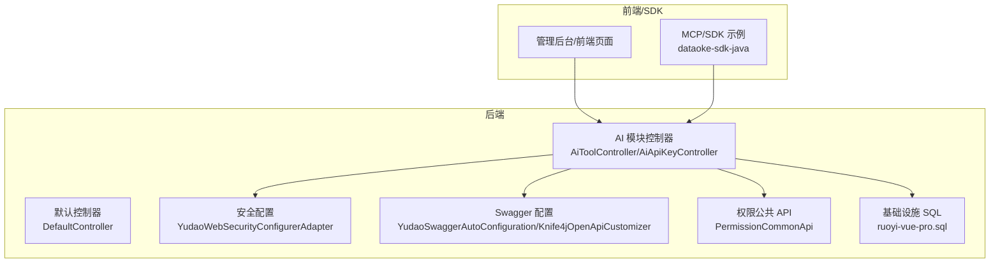
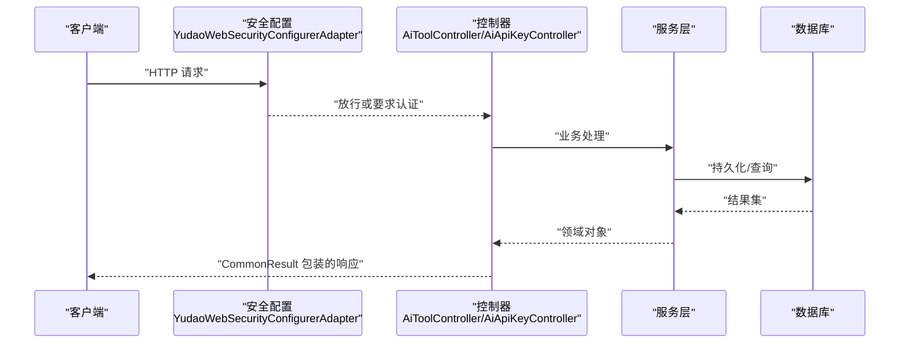
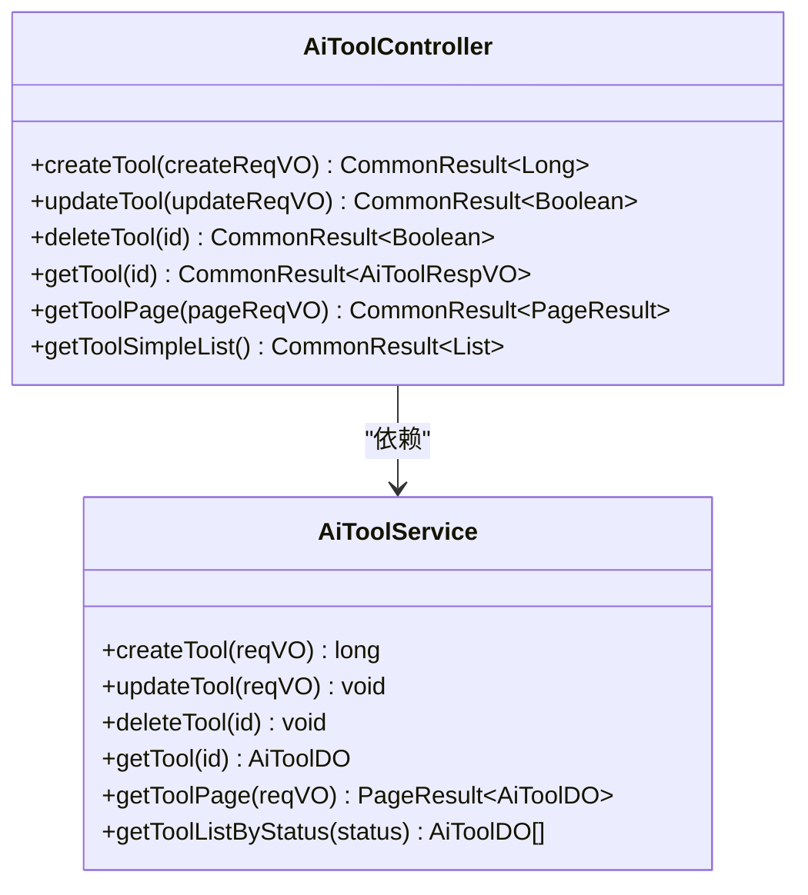
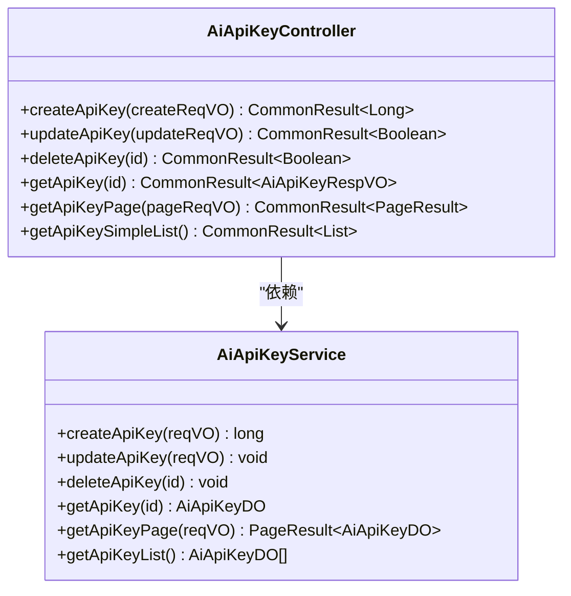
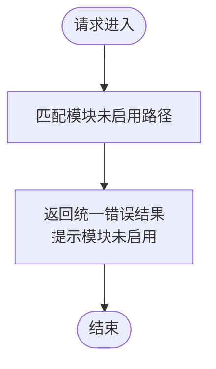
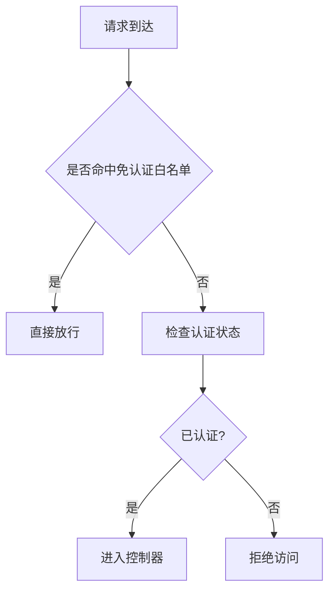
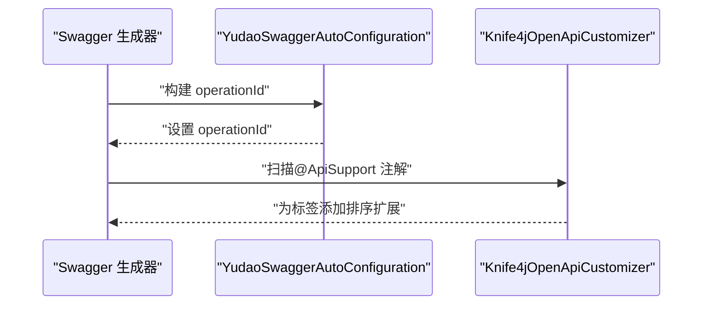
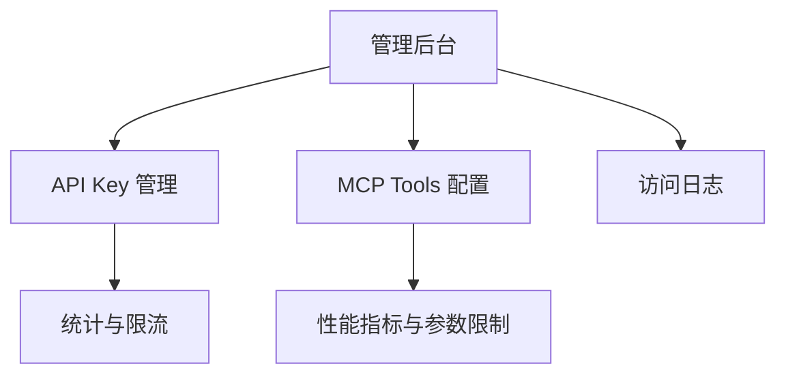
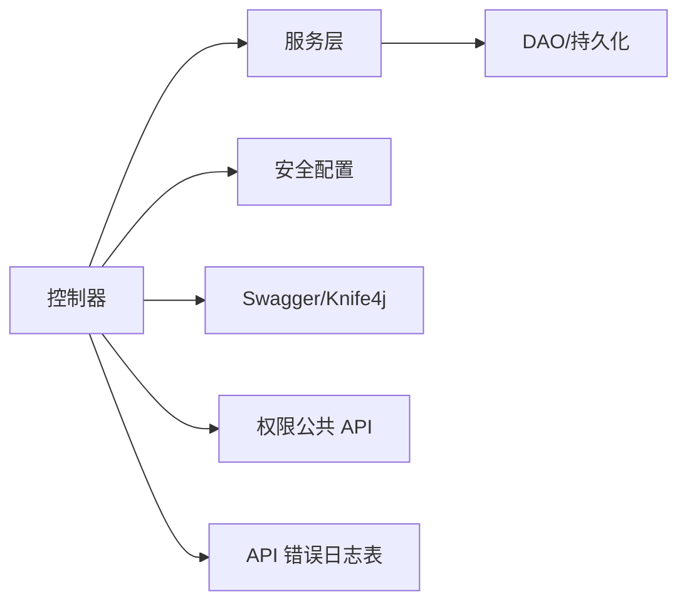

# API 接口文档

<cite>
**本文引用的文件**   
- [AiToolController.java](file://backend/yudao-module-ai/src/main/java/cn/iocoder/yudao/module/ai/controller/admin/model/AiToolController.java)
- [AiApiKeyController.java](file://backend/yudao-module-ai/src/main/java/cn/iocoder/yudao/module/ai/controller/admin/model/AiApiKeyController.java)
- [DefaultController.java](file://backend/yudao-server/src/main/java/cn/iocoder/yudao/server/controller/DefaultController.java)
- [YudaoSwaggerAutoConfiguration.java](file://backend/yudao-framework/yudao-spring-boot-starter-web/src/main/java/cn/iocoder/yudao/framework/swagger/config/YudaoSwaggerAutoConfiguration.java)
- [Knife4jOpenApiCustomizer.java](file://backend/yudao-framework/yudao-spring-boot-starter-web/src/main/java/cn/iocoder/yudao/framework/swagger/config/Knife4jOpenApiCustomizer.java)
- [YudaoWebSecurityConfigurerAdapter.java](file://backend/yudao-framework/yudao-spring-boot-starter-security/src/main/java/cn/iocoder/yudao/framework/security/config/YudaoWebSecurityConfigurerAdapter.java)
- [PermissionCommonApi.java](file://backend/yudao-framework/yudao-common/src/main/java/cn/iocoder/yudao/framework/common/biz/system/permission/PermissionCommonApi.java)
- [CPS系统PRD文档.md](file://docs/CPS系统PRD文档.md)
- [ruoyi-vue-pro.sql](file://backend/sql/sqlserver/ruoyi-vue-pro.sql)
- [BaseController.java](file://agent_improvement/sdk_demo/dataoke-sdk-java/src/main/java/com/dtk/api/controller/base/BaseController.java)
- [DtkJavaOpenPlatformSdkApplication.java](file://agent_improvement/sdk_demo/dataoke-sdk-java/src/main/java/com/dtk/api/DtkJavaOpenPlatformSdkApplication.java)
- [pom.xml](file://agent_improvement/sdk_demo/dataoke-sdk-java/pom.xml)
- [README.md](file://agent_improvement/sdk_demo/dataoke-sdk-java/README.md)
</cite>

## 目录
1. [简介](#简介)
2. [项目结构](#项目结构)
3. [核心组件](#核心组件)
4. [架构总览](#架构总览)
5. [详细组件分析](#详细组件分析)
6. [依赖分析](#依赖分析)
7. [性能考虑](#性能考虑)
8. [故障排查指南](#故障排查指南)
9. [结论](#结论)
10. [附录](#附录)

## 简介
本文件面向后端 RESTful API 设计与实现，覆盖控制器层设计、权限控制策略、错误处理机制、接口文档规范、MCP 协议相关能力（基于 PRD 的工具与密钥管理）、接口测试建议、SDK 使用指南与集成最佳实践。目标是帮助开发者快速理解并正确使用系统提供的 API。

## 项目结构
后端采用模块化分层架构，API 主要集中在各业务模块的 controller 层，并通过统一的 Web 与安全配置提供文档化、鉴权与通用返回封装。AI 模块提供工具与 API Key 的管理接口；系统默认控制器用于在模块未启用时提供一致的 404 提示；安全配置提供免认证白名单与强制认证兜底规则；Swagger 自动配置负责接口文档生成与排序增强；权限公共 API 提供通用权限判断能力；PRD 文档描述了 MCP 相关的工具与密钥管理需求；SQL 脚本包含 API 错误日志等基础设施表结构。

**图示来源**
- [AiToolController.java:1-84](file://backend/yudao-module-ai/src/main/java/cn/iocoder/yudao/module/ai/controller/admin/model/AiToolController.java#L1-L84)
- [AiApiKeyController.java:1-83](file://backend/yudao-module-ai/src/main/java/cn/iocoder/yudao/module/ai/controller/admin/model/AiApiKeyController.java#L1-L83)
- [DefaultController.java:1-36](file://backend/yudao-server/src/main/java/cn/iocoder/yudao/server/controller/DefaultController.java#L1-L36)
- [YudaoSwaggerAutoConfiguration.java:166-186](file://backend/yudao-framework/yudao-spring-boot-starter-web/src/main/java/cn/iocoder/yudao/framework/swagger/config/YudaoSwaggerAutoConfiguration.java#L166-L186)
- [Knife4jOpenApiCustomizer.java:84-113](file://backend/yudao-framework/yudao-spring-boot-starter-web/src/main/java/cn/iocoder/yudao/framework/swagger/config/Knife4jOpenApiCustomizer.java#L84-L113)
- [YudaoWebSecurityConfigurerAdapter.java:134-149](file://backend/yudao-framework/yudao-spring-boot-starter-security/src/main/java/cn/iocoder/yudao/framework/security/config/YudaoWebSecurityConfigurerAdapter.java#L134-L149)
- [PermissionCommonApi.java:1-38](file://backend/yudao-framework/yudao-common/src/main/java/cn/iocoder/yudao/framework/common/biz/system/permission/PermissionCommonApi.java#L1-L38)
- [ruoyi-vue-pro.sql:366-416](file://backend/sql/sqlserver/ruoyi-vue-pro.sql#L366-L416)

**章节来源**
- [AiToolController.java:1-84](file://backend/yudao-module-ai/src/main/java/cn/iocoder/yudao/module/ai/controller/admin/model/AiToolController.java#L1-L84)
- [AiApiKeyController.java:1-83](file://backend/yudao-module-ai/src/main/java/cn/iocoder/yudao/module/ai/controller/admin/model/AiApiKeyController.java#L1-L83)
- [DefaultController.java:1-36](file://backend/yudao-server/src/main/java/cn/iocoder/yudao/server/controller/DefaultController.java#L1-L36)
- [YudaoSwaggerAutoConfiguration.java:166-186](file://backend/yudao-framework/yudao-spring-boot-starter-web/src/main/java/cn/iocoder/yudao/framework/swagger/config/YudaoSwaggerAutoConfiguration.java#L166-L186)
- [Knife4jOpenApiCustomizer.java:84-113](file://backend/yudao-framework/yudao-spring-boot-starter-web/src/main/java/cn/iocoder/yudao/framework/swagger/config/Knife4jOpenApiCustomizer.java#L84-L113)
- [YudaoWebSecurityConfigurerAdapter.java:134-149](file://backend/yudao-framework/yudao-spring-boot-starter-security/src/main/java/cn/iocoder/yudao/framework/security/config/YudaoWebSecurityConfigurerAdapter.java#L134-L149)
- [PermissionCommonApi.java:1-38](file://backend/yudao-framework/yudao-common/src/main/java/cn/iocoder/yudao/framework/common/biz/system/permission/PermissionCommonApi.java#L1-L38)
- [CPS系统PRD文档.md:698-737](file://docs/CPS系统PRD文档.md#L698-L737)
- [ruoyi-vue-pro.sql:366-416](file://backend/sql/sqlserver/ruoyi-vue-pro.sql#L366-L416)

## 核心组件
- 控制器层：AI 工具与 API Key 的增删改查、分页与简单列表接口，均标注权限注解与 Swagger 元数据。
- 默认控制器：对未启用模块的路径提供统一 404 错误提示，避免歧义。
- 安全配置：支持免认证白名单与强制认证兜底，满足公开接口与受保护接口的混合场景。
- 文档配置：自动装配 Swagger/OpenAPI，支持按注解生成与排序增强。
- 权限公共 API：提供角色/权限判断与数据权限查询能力。
- 基础设施：API 错误日志等表结构支撑接口可观测性与审计。

**章节来源**
- [AiToolController.java:26-84](file://backend/yudao-module-ai/src/main/java/cn/iocoder/yudao/module/ai/controller/admin/model/AiToolController.java#L26-L84)
- [AiApiKeyController.java:26-83](file://backend/yudao-module-ai/src/main/java/cn/iocoder/yudao/module/ai/controller/admin/model/AiApiKeyController.java#L26-L83)
- [DefaultController.java:19-36](file://backend/yudao-server/src/main/java/cn/iocoder/yudao/server/controller/DefaultController.java#L19-L36)
- [YudaoWebSecurityConfigurerAdapter.java:134-149](file://backend/yudao-framework/yudao-spring-boot-starter-security/src/main/java/cn/iocoder/yudao/framework/security/config/YudaoWebSecurityConfigurerAdapter.java#L134-L149)
- [PermissionCommonApi.java:10-38](file://backend/yudao-framework/yudao-common/src/main/java/cn/iocoder/yudao/framework/common/biz/system/permission/PermissionCommonApi.java#L10-L38)
- [ruoyi-vue-pro.sql:366-416](file://backend/sql/sqlserver/ruoyi-vue-pro.sql#L366-L416)

## 架构总览
以下序列图展示了典型 API 请求从客户端到控制器、鉴权、服务与返回的整体流程。

**图示来源**
- [YudaoWebSecurityConfigurerAdapter.java:134-149](file://backend/yudao-framework/yudao-spring-boot-starter-security/src/main/java/cn/iocoder/yudao/framework/security/config/YudaoWebSecurityConfigurerAdapter.java#L134-L149)
- [AiToolController.java:30-84](file://backend/yudao-module-ai/src/main/java/cn/iocoder/yudao/module/ai/controller/admin/model/AiToolController.java#L30-L84)
- [AiApiKeyController.java:30-83](file://backend/yudao-module-ai/src/main/java/cn/iocoder/yudao/module/ai/controller/admin/model/AiApiKeyController.java#L30-L83)

## 详细组件分析

### AI 工具接口（管理后台）
- 接口前缀：/admin-api/ai/tool
- 功能：创建、更新、删除、查询单个、分页查询、获取简单列表
- 权限：基于注解的权限校验，需具备 ai:tool:* 对应权限
- 返回：统一 CommonResult 包裹，分页使用 PageResult

**图示来源**
- [AiToolController.java:30-84](file://backend/yudao-module-ai/src/main/java/cn/iocoder/yudao/module/ai/controller/admin/model/AiToolController.java#L30-L84)

**章节来源**
- [AiToolController.java:26-84](file://backend/yudao-module-ai/src/main/java/cn/iocoder/yudao/module/ai/controller/admin/model/AiToolController.java#L26-L84)

### AI API Key 接口（管理后台）
- 接口前缀：/admin-api/ai/api-key
- 功能：创建、更新、删除、查询单个、分页查询、获取简单列表
- 权限：基于注解的权限校验，需具备 ai:api-key:* 对应权限
- 返回：统一 CommonResult 包裹，分页使用 PageResult

**图示来源**
- [AiApiKeyController.java:30-83](file://backend/yudao-module-ai/src/main/java/cn/iocoder/yudao/module/ai/controller/admin/model/AiApiKeyController.java#L30-L83)

**章节来源**
- [AiApiKeyController.java:26-83](file://backend/yudao-module-ai/src/main/java/cn/iocoder/yudao/module/ai/controller/admin/model/AiApiKeyController.java#L26-L83)

### 默认控制器与模块未启用提示
- 路由模式：/admin-api/bpm/**、/admin-api/mp/**、/admin-api/product/**、/admin-api/trade/** 等
- 行为：返回统一错误结果，提示对应模块未启用及参考文档

**图示来源**
- [DefaultController.java:23-36](file://backend/yudao-server/src/main/java/cn/iocoder/yudao/server/controller/DefaultController.java#L23-L36)

**章节来源**
- [DefaultController.java:19-36](file://backend/yudao-server/src/main/java/cn/iocoder/yudao/server/controller/DefaultController.java#L19-L36)

### 权限控制策略
- 免认证白名单：通过配置项声明允许匿名访问的 URL 列表
- 强制认证兜底：除白名单外，其余请求必须认证
- 控制器权限：使用注解声明所需权限标识，结合安全适配器生效

**图示来源**
- [YudaoWebSecurityConfigurerAdapter.java:134-149](file://backend/yudao-framework/yudao-spring-boot-starter-security/src/main/java/cn/iocoder/yudao/framework/security/config/YudaoWebSecurityConfigurerAdapter.java#L134-L149)

**章节来源**
- [YudaoWebSecurityConfigurerAdapter.java:134-149](file://backend/yudao-framework/yudao-spring-boot-starter-security/src/main/java/cn/iocoder/yudao/framework/security/config/YudaoWebSecurityConfigurerAdapter.java#L134-L149)

### 接口文档与排序增强
- 自动装配：根据控制器类名与方法名生成 operationId
- 标签排序：基于 ApiSupport 注解的 order 值为 OpenAPI 标签增加扩展排序字段

**图示来源**
- [YudaoSwaggerAutoConfiguration.java:166-186](file://backend/yudao-framework/yudao-spring-boot-starter-web/src/main/java/cn/iocoder/yudao/framework/swagger/config/YudaoSwaggerAutoConfiguration.java#L166-L186)
- [Knife4jOpenApiCustomizer.java:84-113](file://backend/yudao-framework/yudao-spring-boot-starter-web/src/main/java/cn/iocoder/yudao/framework/swagger/config/Knife4jOpenApiCustomizer.java#L84-L113)

**章节来源**
- [YudaoSwaggerAutoConfiguration.java:166-186](file://backend/yudao-framework/yudao-spring-boot-starter-web/src/main/java/cn/iocoder/yudao/framework/swagger/config/YudaoSwaggerAutoConfiguration.java#L166-L186)
- [Knife4jOpenApiCustomizer.java:84-113](file://backend/yudao-framework/yudao-spring-boot-starter-web/src/main/java/cn/iocoder/yudao/framework/swagger/config/Knife4jOpenApiCustomizer.java#L84-L113)

### MCP 协议相关能力（基于 PRD）
- API Key 管理：列表、创建、更新、删除、权限级别、限流配置、状态与统计
- MCP Tools 配置：工具列表、访问权限、使用统计与性能指标、参数默认值与限制
- 访问日志：记录 MCP 访问行为，便于审计与问题定位

**图示来源**
- [CPS系统PRD文档.md:698-737](file://docs/CPS系统PRD文档.md#L698-L737)

**章节来源**
- [CPS系统PRD文档.md:698-737](file://docs/CPS系统PRD文档.md#L698-L737)

## 依赖分析
- 控制器依赖服务层，服务层依赖 DAO/持久化层，形成清晰的分层边界
- 安全配置与权限注解共同保障接口访问控制
- Swagger 配置与 Knife4j 扩展提升接口文档质量与可维护性
- 基础设施 SQL 提供 API 错误日志等可观测性支撑

**图示来源**
- [AiToolController.java:30-84](file://backend/yudao-module-ai/src/main/java/cn/iocoder/yudao/module/ai/controller/admin/model/AiToolController.java#L30-L84)
- [AiApiKeyController.java:30-83](file://backend/yudao-module-ai/src/main/java/cn/iocoder/yudao/module/ai/controller/admin/model/AiApiKeyController.java#L30-L83)
- [YudaoWebSecurityConfigurerAdapter.java:134-149](file://backend/yudao-framework/yudao-spring-boot-starter-security/src/main/java/cn/iocoder/yudao/framework/security/config/YudaoWebSecurityConfigurerAdapter.java#L134-L149)
- [Knife4jOpenApiCustomizer.java:84-113](file://backend/yudao-framework/yudao-spring-boot-starter-web/src/main/java/cn/iocoder/yudao/framework/swagger/config/Knife4jOpenApiCustomizer.java#L84-L113)
- [ruoyi-vue-pro.sql:366-416](file://backend/sql/sqlserver/ruoyi-vue-pro.sql#L366-L416)

**章节来源**
- [AiToolController.java:30-84](file://backend/yudao-module-ai/src/main/java/cn/iocoder/yudao/module/ai/controller/admin/model/AiToolController.java#L30-L84)
- [AiApiKeyController.java:30-83](file://backend/yudao-module-ai/src/main/java/cn/iocoder/yudao/module/ai/controller/admin/model/AiApiKeyController.java#L30-L83)
- [YudaoWebSecurityConfigurerAdapter.java:134-149](file://backend/yudao-framework/yudao-spring-boot-starter-security/src/main/java/cn/iocoder/yudao/framework/security/config/YudaoWebSecurityConfigurerAdapter.java#L134-L149)
- [Knife4jOpenApiCustomizer.java:84-113](file://backend/yudao-framework/yudao-spring-boot-starter-web/src/main/java/cn/iocoder/yudao/framework/swagger/config/Knife4jOpenApiCustomizer.java#L84-L113)
- [ruoyi-vue-pro.sql:366-416](file://backend/sql/sqlserver/ruoyi-vue-pro.sql#L366-L416)

## 性能考虑
- 接口文档生成与排序增强：通过自定义 operationId 与标签排序，减少重复扫描与排序成本
- 权限校验：优先使用免认证白名单，减少不必要的认证开销
- 分页查询：建议在高频查询场景使用分页接口，避免一次性返回大量数据
- 日志与监控：利用 API 错误日志表进行异常追踪与性能瓶颈定位

[本节为通用指导，无需特定文件来源]

## 故障排查指南
- 404 未启用模块：确认模块是否启用，查看默认控制器返回的提示信息
- 权限不足：检查控制器上的权限注解与用户实际权限，确认安全配置中的白名单与认证规则
- 文档未更新：确认 Swagger/Knife4j 配置是否生效，operationId 与标签排序是否正确
- API 错误定位：通过 API 错误日志表字段（异常名、消息、栈轨迹等）进行根因分析

**章节来源**
- [DefaultController.java:23-36](file://backend/yudao-server/src/main/java/cn/iocoder/yudao/server/controller/DefaultController.java#L23-L36)
- [YudaoWebSecurityConfigurerAdapter.java:134-149](file://backend/yudao-framework/yudao-spring-boot-starter-security/src/main/java/cn/iocoder/yudao/framework/security/config/YudaoWebSecurityConfigurerAdapter.java#L134-L149)
- [Knife4jOpenApiCustomizer.java:84-113](file://backend/yudao-framework/yudao-spring-boot-starter-web/src/main/java/cn/iocoder/yudao/framework/swagger/config/Knife4jOpenApiCustomizer.java#L84-L113)
- [ruoyi-vue-pro.sql:366-416](file://backend/sql/sqlserver/ruoyi-vue-pro.sql#L366-L416)

## 结论
本项目通过清晰的分层架构、完善的权限控制、统一的返回封装与良好的接口文档体系，为开发者提供了稳定可靠的 API 使用体验。针对 MCP 协议相关能力，PRD 中明确了工具与密钥管理、访问日志与性能指标等关键需求，建议在后续迭代中完善对应的接口与监控埋点，以满足生产环境的可观测性与可运维性要求。

[本节为总结性内容，无需特定文件来源]

## 附录

### 接口设计规范与示例
- HTTP 方法与 URL 模式
  - 创建工具：POST /admin-api/ai/tool/create
  - 更新工具：PUT /admin-api/ai/tool/update
  - 删除工具：DELETE /admin-api/ai/tool/delete?id={id}
  - 查询工具：GET /admin-api/ai/tool/get?id={id}
  - 工具分页：GET /admin-api/ai/tool/page
  - 工具简单列表：GET /admin-api/ai/tool/simple-list
  - API Key 创建：POST /admin-api/ai/api-key/create
  - API Key 更新：PUT /admin-api/ai/api-key/update
  - API Key 删除：DELETE /admin-api/ai/api-key/delete?id={id}
  - API Key 查询：GET /admin-api/ai/api-key/get?id={id}
  - API Key 分页：GET /admin-api/ai/api-key/page
  - API Key 简单列表：GET /admin-api/ai/api-key/simple-list
- 请求/响应格式
  - 统一返回：CommonResult<T>，分页使用 PageResult<T>
  - 参数校验：使用 @Valid 与 VO 对象承载参数
- 权限控制
  - 工具接口：ai:tool:create/update/query/delete
  - API Key 接口：ai:api-key:create/update/query/delete
- 错误处理
  - 默认控制器对未启用模块返回统一错误
  - API 错误日志表提供异常追踪能力

**章节来源**
- [AiToolController.java:35-82](file://backend/yudao-module-ai/src/main/java/cn/iocoder/yudao/module/ai/controller/admin/model/AiToolController.java#L35-L82)
- [AiApiKeyController.java:35-81](file://backend/yudao-module-ai/src/main/java/cn/iocoder/yudao/module/ai/controller/admin/model/AiApiKeyController.java#L35-L81)
- [DefaultController.java:23-36](file://backend/yudao-server/src/main/java/cn/iocoder/yudao/server/controller/DefaultController.java#L23-L36)
- [ruoyi-vue-pro.sql:366-416](file://backend/sql/sqlserver/ruoyi-vue-pro.sql#L366-L416)

### 接口测试用例建议
- 正向用例：创建/更新成功、分页与列表返回正确数据、权限满足时可访问
- 异常用例：未登录访问受保护接口、权限不足、参数缺失/非法、模块未启用
- 性能用例：大数据量分页、高并发下的响应时间与吞吐量

[本节为通用指导，无需特定文件来源]

### SDK 使用指南与集成最佳实践
- SDK 仓库与依赖
  - 仓库：dataoke-sdk-java
  - 依赖：pom.xml 中声明的模块与版本
  - 启动类：DtkJavaOpenPlatformSdkApplication
- 基础控制器
  - BaseController 提供通用的请求/响应封装与工具方法
- 最佳实践
  - 在应用启动类中初始化 SDK 并配置认证信息
  - 使用 BaseController 的工具方法统一处理请求参数与响应格式
  - 将 SDK 集成到现有权限体系中，确保接口访问符合安全策略

**章节来源**
- [pom.xml](file://agent_improvement/sdk_demo/dataoke-sdk-java/pom.xml)
- [DtkJavaOpenPlatformSdkApplication.java](file://agent_improvement/sdk_demo/dataoke-sdk-java/src/main/java/com/dtk/api/DtkJavaOpenPlatformSdkApplication.java)
- [BaseController.java](file://agent_improvement/sdk_demo/dataoke-sdk-java/src/main/java/com/dtk/api/controller/base/BaseController.java)
- [README.md](file://agent_improvement/sdk_demo/dataoke-sdk-java/README.md)