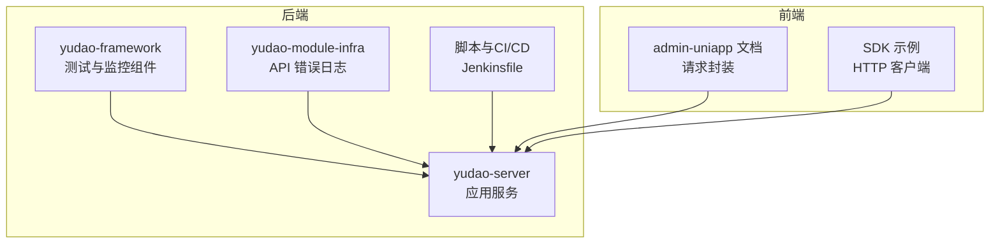
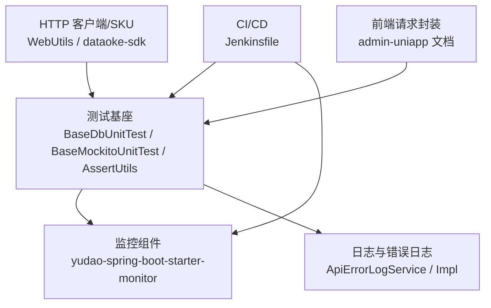
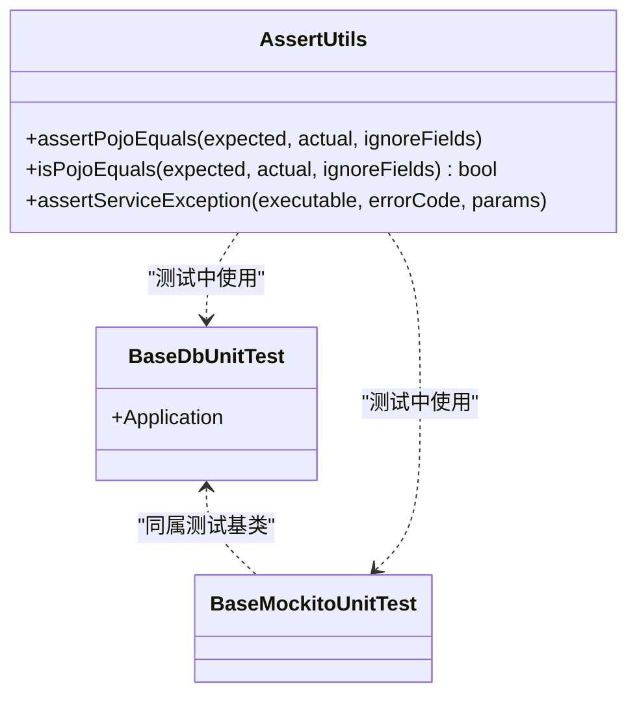
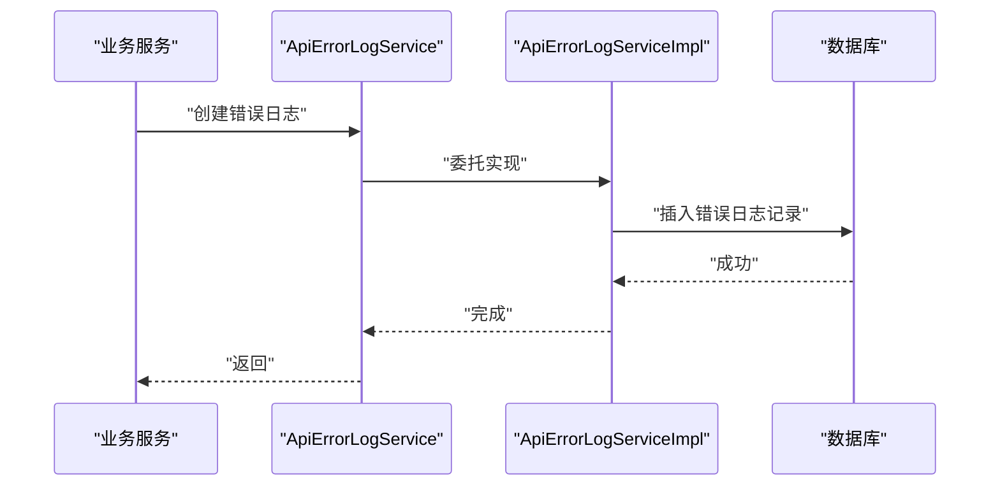
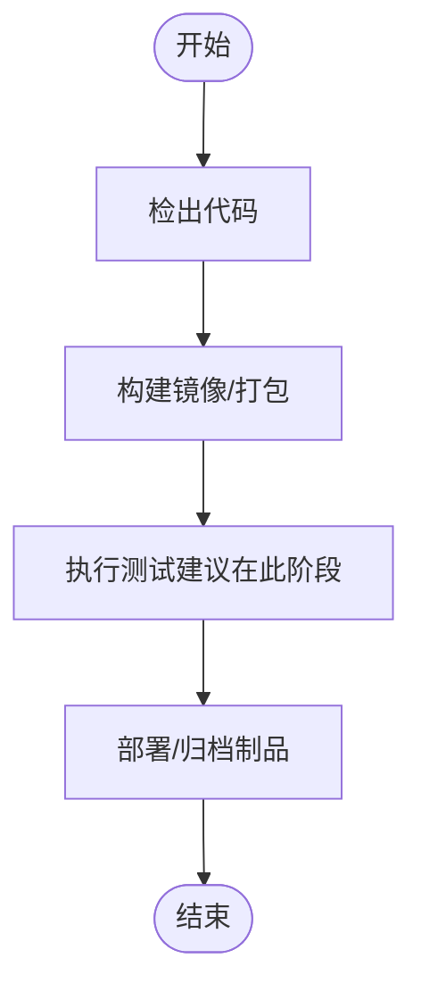
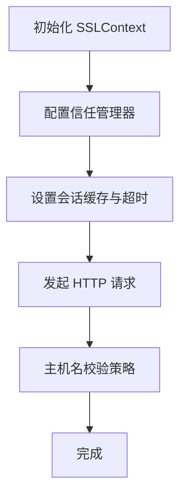
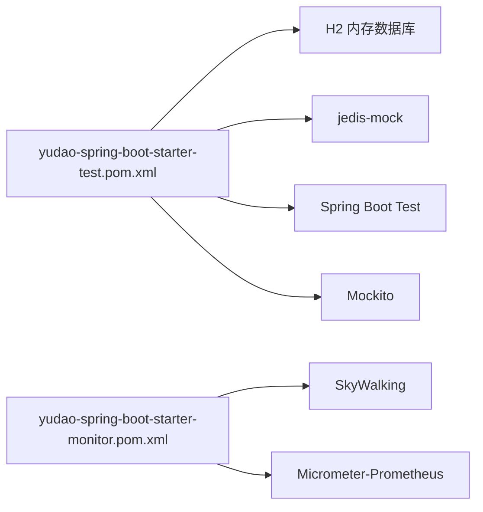
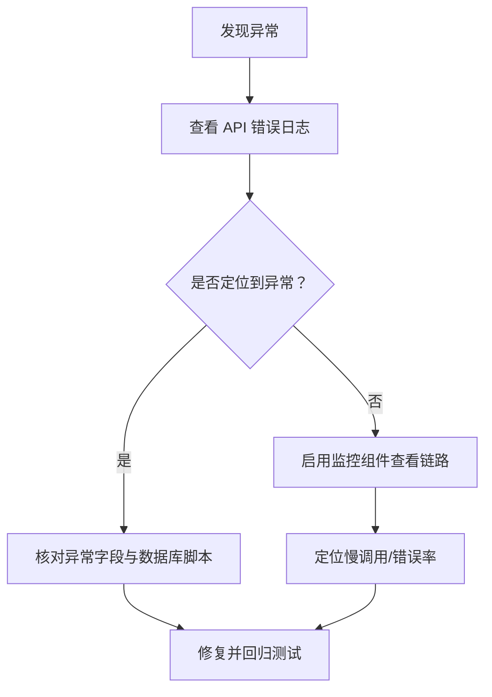

# API 测试与调试

<cite>
**本文引用的文件**
- [http-client.env.json](file://backend/script/idea/http-client.env.json)
- [Jenkinsfile](file://backend/script/jenkins/Jenkinsfile)
- [BaseDbUnitTest.java](file://backend/yudao-framework/yudao-spring-boot-starter-test/src/main/java/cn/iocoder/yudao/framework/test/core/ut/BaseDbUnitTest.java)
- [BaseMockitoUnitTest.java](file://backend/yudao-framework/yudao-spring-boot-starter-test/src/main/java/cn/iocoder/yudao/framework/test/core/ut/BaseMockitoUnitTest.java)
- [AssertUtils.java](file://backend/yudao-framework/yudao-spring-boot-starter-test/src/main/java/cn/iocoder/yudao/framework/test/core/util/AssertUtils.java)
- [yudao-spring-boot-starter-test.pom.xml](file://backend/yudao-framework/yudao-spring-boot-starter-test/pom.xml)
- [yudao-spring-boot-starter-monitor.pom.xml](file://backend/yudao-framework/yudao-spring-boot-starter-monitor/pom.xml)
- [ApiErrorLogService.java](file://backend/yudao-module-infra/src/main/java/cn/iocoder/yudao/module/infra/service/logger/ApiErrorLogService.java)
- [ApiErrorLogServiceImpl.java](file://backend/yudao-module-infra/src/main/java/cn/iocoder/yudao/module/infra/service/logger/ApiErrorLogServiceImpl.java)
- [WebUtils.java](file://agent_improvement/sdk_demo/dataoke-sdk-java/src/main/java/com/dtk/api/http/WebUtils.java)
- [dataoke-sdk-java 构建脚本](file://agent_improvement/sdk_demo/dataoke-sdk-java/pom.xml)
- [8-request.md](file://frontend/admin-uniapp/docs/base/8-request.md)
- [ruoyi-vue-pro.sql](file://backend/sql/sqlserver/ruoyi-vue-pro.sql)
</cite>

## 目录
1. [简介](#简介)
2. [项目结构](#项目结构)
3. [核心组件](#核心组件)
4. [架构总览](#架构总览)
5. [详细组件分析](#详细组件分析)
6. [依赖分析](#依赖分析)
7. [性能考虑](#性能考虑)
8. [故障排查指南](#故障排查指南)
9. [结论](#结论)
10. [附录](#附录)

## 简介
本指南面向后端与全栈工程师，系统化阐述该代码库中 API 的测试与调试方法论与实操实践，覆盖单元测试、集成测试、性能与负载测试、Postman 与 HTTP 客户端配置、测试环境设置、接口监控与日志分析、故障排查、API 版本管理与向后兼容、回归测试策略，以及自动化测试与持续集成中的 API 测试实践。内容基于仓库现有测试框架、监控与日志能力、HTTP 客户端与 SDK 工具，结合前端请求封装文档，形成可落地的工程化方案。

## 项目结构
该项目采用前后端分离与多模块聚合的 Maven 结构，后端以 Spring Boot 为基础，提供统一测试与监控组件，并在基础设施模块中内置 API 错误日志能力；前端提供多套前端工程与文档，便于接口联调与调试；CI/CD 通过 Jenkinsfile 提供基础流水线骨架。

**图表来源**
- [yudao-spring-boot-starter-test.pom.xml:1-61](file://backend/yudao-framework/yudao-spring-boot-starter-test/pom.xml#L1-L61)
- [yudao-spring-boot-starter-monitor.pom.xml:1-79](file://backend/yudao-framework/yudao-spring-boot-starter-monitor/pom.xml#L1-L79)
- [Jenkinsfile:1-61](file://backend/script/jenkins/Jenkinsfile#L1-L61)
- [8-request.md:149-189](file://frontend/admin-uniapp/docs/base/8-request.md#L149-L189)
- [WebUtils.java:72-119](file://agent_improvement/sdk_demo/dataoke-sdk-java/src/main/java/com/dtk/api/http/WebUtils.java#L72-L119)

**章节来源**
- [yudao-spring-boot-starter-test.pom.xml:1-61](file://backend/yudao-framework/yudao-spring-boot-starter-test/pom.xml#L1-L61)
- [yudao-spring-boot-starter-monitor.pom.xml:1-79](file://backend/yudao-framework/yudao-spring-boot-starter-monitor/pom.xml#L1-L79)
- [Jenkinsfile:1-61](file://backend/script/jenkins/Jenkinsfile#L1-L61)
- [8-request.md:149-189](file://frontend/admin-uniapp/docs/base/8-request.md#L149-L189)
- [WebUtils.java:72-119](file://agent_improvement/sdk_demo/dataoke-sdk-java/src/main/java/com/dtk/api/http/WebUtils.java#L72-L119)

## 核心组件
- 测试基座与断言工具
  - 基于 Spring Boot Test 的内存数据库单元测试基类，配合 H2 与内嵌 Redis，实现快速、隔离的单元测试。
  - 提供断言工具类，支持对象字段对比与业务异常断言，提升测试可读性与稳定性。
- 监控与日志
  - 监控组件提供链路追踪与指标采集能力，便于定位慢调用与异常。
  - 基础设施模块提供 API 错误日志服务接口与实现，支持分页查询、处理状态更新与定时清理。
- CI/CD
  - Jenkinsfile 提供基础构建与部署骨架，可扩展测试阶段与制品归档。
- HTTP 客户端与 SDK
  - 后端 SDK 示例展示 HTTP 客户端配置、超时与证书信任策略等，便于外部系统对接与联调。
  - 前端文档说明请求封装与多后端代理映射、Header 传递等，便于前端侧调试与联调。

**章节来源**
- [BaseDbUnitTest.java:1-48](file://backend/yudao-framework/yudao-spring-boot-starter-test/src/main/java/cn/iocoder/yudao/framework/test/core/ut/BaseDbUnitTest.java#L1-L48)
- [BaseMockitoUnitTest.java:1-14](file://backend/yudao-framework/yudao-spring-boot-starter-test/src/main/java/cn/iocoder/yudao/framework/test/core/ut/BaseMockitoUnitTest.java#L1-L14)
- [AssertUtils.java:1-102](file://backend/yudao-framework/yudao-spring-boot-starter-test/src/main/java/cn/iocoder/yudao/framework/test/core/util/AssertUtils.java#L1-L102)
- [ApiErrorLogService.java:1-55](file://backend/yudao-module-infra/src/main/java/cn/iocoder/yudao/module/infra/service/logger/ApiErrorLogService.java#L1-L55)
- [ApiErrorLogServiceImpl.java:1-25](file://backend/yudao-module-infra/src/main/java/cn/iocoder/yudao/module/infra/service/logger/ApiErrorLogServiceImpl.java#L1-L25)
- [Jenkinsfile:1-61](file://backend/script/jenkins/Jenkinsfile#L1-L61)
- [WebUtils.java:72-119](file://agent_improvement/sdk_demo/dataoke-sdk-java/src/main/java/com/dtk/api/http/WebUtils.java#L72-L119)
- [8-request.md:149-189](file://frontend/admin-uniapp/docs/base/8-request.md#L149-L189)

## 架构总览
下图展示了 API 测试与调试在整体系统中的位置与交互关系：测试基座负责执行单元与集成测试；监控与日志组件提供可观测性；CI/CD 负责自动化流水线；HTTP 客户端与 SDK 为外部系统提供对接能力。

**图表来源**
- [BaseDbUnitTest.java:1-48](file://backend/yudao-framework/yudao-spring-boot-starter-test/src/main/java/cn/iocoder/yudao/framework/test/core/ut/BaseDbUnitTest.java#L1-L48)
- [BaseMockitoUnitTest.java:1-14](file://backend/yudao-framework/yudao-spring-boot-starter-test/src/main/java/cn/iocoder/yudao/framework/test/core/ut/BaseMockitoUnitTest.java#L1-L14)
- [AssertUtils.java:1-102](file://backend/yudao-framework/yudao-spring-boot-starter-test/src/main/java/cn/iocoder/yudao/framework/test/core/util/AssertUtils.java#L1-L102)
- [yudao-spring-boot-starter-monitor.pom.xml:1-79](file://backend/yudao-framework/yudao-spring-boot-starter-monitor/pom.xml#L1-L79)
- [ApiErrorLogService.java:1-55](file://backend/yudao-module-infra/src/main/java/cn/iocoder/yudao/module/infra/service/logger/ApiErrorLogService.java#L1-L55)
- [ApiErrorLogServiceImpl.java:1-25](file://backend/yudao-module-infra/src/main/java/cn/iocoder/yudao/module/infra/service/logger/ApiErrorLogServiceImpl.java#L1-L25)
- [Jenkinsfile:1-61](file://backend/script/jenkins/Jenkinsfile#L1-L61)
- [WebUtils.java:72-119](file://agent_improvement/sdk_demo/dataoke-sdk-java/src/main/java/com/dtk/api/http/WebUtils.java#L72-L119)
- [8-request.md:149-189](file://frontend/admin-uniapp/docs/base/8-request.md#L149-L189)

## 详细组件分析

### 测试基座与断言工具
- 内存数据库单元测试基类
  - 通过导入数据源、MyBatis Plus 与 H2，确保每个测试在独立内存数据库中执行，测试结束后自动清理。
  - 适用于 Service 层与 DAO 层的单元测试，保证隔离性与可重复性。
- 纯 Mockito 单元测试基类
  - 为纯逻辑单元测试提供 Mockito 扩展，便于对依赖进行 Mock。
- 断言工具
  - 支持 POJO 字段逐项对比（可忽略指定字段），减少冗余断言。
  - 支持业务异常断言，校验错误码与消息格式化结果。

**图表来源**
- [BaseDbUnitTest.java:1-48](file://backend/yudao-framework/yudao-spring-boot-starter-test/src/main/java/cn/iocoder/yudao/framework/test/core/ut/BaseDbUnitTest.java#L1-L48)
- [BaseMockitoUnitTest.java:1-14](file://backend/yudao-framework/yudao-spring-boot-starter-test/src/main/java/cn/iocoder/yudao/framework/test/core/ut/BaseMockitoUnitTest.java#L1-L14)
- [AssertUtils.java:1-102](file://backend/yudao-framework/yudao-spring-boot-starter-test/src/main/java/cn/iocoder/yudao/framework/test/core/util/AssertUtils.java#L1-L102)

**章节来源**
- [BaseDbUnitTest.java:1-48](file://backend/yudao-framework/yudao-spring-boot-starter-test/src/main/java/cn/iocoder/yudao/framework/test/core/ut/BaseDbUnitTest.java#L1-L48)
- [BaseMockitoUnitTest.java:1-14](file://backend/yudao-framework/yudao-spring-boot-starter-test/src/main/java/cn/iocoder/yudao/framework/test/core/ut/BaseMockitoUnitTest.java#L1-L14)
- [AssertUtils.java:1-102](file://backend/yudao-framework/yudao-spring-boot-starter-test/src/main/java/cn/iocoder/yudao/framework/test/core/util/AssertUtils.java#L1-L102)

### 监控与日志
- 监控组件
  - 提供链路追踪与指标采集能力，便于在 CI/CD 与生产环境中定位慢调用与异常。
- API 错误日志
  - 提供创建、查询、分页、处理状态更新与定时清理等能力，支撑接口问题闭环管理。
  - 数据库表结构定义位于 SQL 脚本中，包含异常堆栈、类名、方法名等字段，便于回溯。

**图表来源**
- [ApiErrorLogService.java:1-55](file://backend/yudao-module-infra/src/main/java/cn/iocoder/yudao/module/infra/service/logger/ApiErrorLogService.java#L1-L55)
- [ApiErrorLogServiceImpl.java:1-25](file://backend/yudao-module-infra/src/main/java/cn/iocoder/yudao/module/infra/service/logger/ApiErrorLogServiceImpl.java#L1-L25)
- [ruoyi-vue-pro.sql:366-416](file://backend/sql/sqlserver/ruoyi-vue-pro.sql#L366-L416)

**章节来源**
- [yudao-spring-boot-starter-monitor.pom.xml:1-79](file://backend/yudao-framework/yudao-spring-boot-starter-monitor/pom.xml#L1-L79)
- [ApiErrorLogService.java:1-55](file://backend/yudao-module-infra/src/main/java/cn/iocoder/yudao/module/infra/service/logger/ApiErrorLogService.java#L1-L55)
- [ApiErrorLogServiceImpl.java:1-25](file://backend/yudao-module-infra/src/main/java/cn/iocoder/yudao/module/infra/service/logger/ApiErrorLogServiceImpl.java#L1-L25)
- [ruoyi-vue-pro.sql:366-416](file://backend/sql/sqlserver/ruoyi-vue-pro.sql#L366-L416)

### CI/CD 与自动化测试
- Jenkinsfile
  - 提供基础构建与部署骨架，建议在此基础上增加“测试”阶段，执行 Maven 单元测试与集成测试，并将报告归档。
  - 可扩展 Docker 化测试环境与数据库初始化脚本，确保测试一致性。

**图表来源**
- [Jenkinsfile:1-61](file://backend/script/jenkins/Jenkinsfile#L1-L61)

**章节来源**
- [Jenkinsfile:1-61](file://backend/script/jenkins/Jenkinsfile#L1-L61)

### HTTP 客户端与 SDK 配置
- SDK 示例中的 HTTP 客户端
  - 展示了 TLS 上下文初始化、会话缓存与超时配置、信任管理器与主机名校验策略，便于对接第三方服务或自建网关。
- 前端请求封装
  - 文档说明了多后端地址映射、拦截器处理、Header 传递等，有助于前端联调与调试。

**图表来源**
- [WebUtils.java:72-119](file://agent_improvement/sdk_demo/dataoke-sdk-java/src/main/java/com/dtk/api/http/WebUtils.java#L72-L119)

**章节来源**
- [WebUtils.java:72-119](file://agent_improvement/sdk_demo/dataoke-sdk-java/src/main/java/com/dtk/api/http/WebUtils.java#L72-L119)
- [8-request.md:149-189](file://frontend/admin-uniapp/docs/base/8-request.md#L149-L189)

## 依赖分析
- 测试组件依赖
  - 测试组件依赖 H2 内存数据库与内嵌 Redis 模拟库，确保测试隔离与高性能。
  - 依赖 Spring Boot Test 与 Mockito，提供断言与 Mock 能力。
- 监控组件依赖
  - 提供 OpenTracing/SkyWalking 与 Micrometer-Prometheus 等可选依赖，按需启用。
- 基础设施日志
  - API 错误日志服务接口与实现，配合数据库脚本，形成完整的错误日志闭环。

**图表来源**
- [yudao-spring-boot-starter-test.pom.xml:1-61](file://backend/yudao-framework/yudao-spring-boot-starter-test/pom.xml#L1-L61)
- [yudao-spring-boot-starter-monitor.pom.xml:1-79](file://backend/yudao-framework/yudao-spring-boot-starter-monitor/pom.xml#L1-L79)

**章节来源**
- [yudao-spring-boot-starter-test.pom.xml:1-61](file://backend/yudao-framework/yudao-spring-boot-starter-test/pom.xml#L1-L61)
- [yudao-spring-boot-starter-monitor.pom.xml:1-79](file://backend/yudao-framework/yudao-spring-boot-starter-monitor/pom.xml#L1-L79)

## 性能考虑
- 单元测试性能
  - 使用内存数据库与内嵌 Redis，避免真实 IO，提高测试执行速度。
  - 合理拆分测试用例，避免长链路测试进入单元测试范畴。
- 集成测试与负载测试
  - 在 CI/CD 中新增“集成测试”阶段，使用真实数据库与最小化依赖启动，验证关键路径。
  - 负载测试建议在独立环境执行，结合监控组件观察链路耗时与错误率。
- 前端联调
  - 使用前端文档中的多后端映射与 Header 传递能力，减少跨域与鉴权带来的额外开销。

[本节为通用指导，无需列出章节来源]

## 故障排查指南
- 接口错误日志
  - 通过 API 错误日志服务接口查询与分页，定位异常时间、异常名、异常消息与栈轨迹，结合数据库脚本字段进行回溯。
- 监控与日志
  - 启用监控组件，结合链路追踪与指标面板，定位慢调用与异常峰值。
- HTTP 客户端
  - 检查 SDK 中的 SSL/TLS 配置、超时与主机名校验策略，确保与目标服务一致。
- 环境变量与配置
  - 使用 IDEA HTTP 客户端环境配置文件，确保本地与网关环境的一致性。

**图表来源**
- [ApiErrorLogService.java:1-55](file://backend/yudao-module-infra/src/main/java/cn/iocoder/yudao/module/infra/service/logger/ApiErrorLogService.java#L1-L55)
- [ApiErrorLogServiceImpl.java:1-25](file://backend/yudao-module-infra/src/main/java/cn/iocoder/yudao/module/infra/service/logger/ApiErrorLogServiceImpl.java#L1-L25)
- [ruoyi-vue-pro.sql:366-416](file://backend/sql/sqlserver/ruoyi-vue-pro.sql#L366-L416)
- [yudao-spring-boot-starter-monitor.pom.xml:1-79](file://backend/yudao-framework/yudao-spring-boot-starter-monitor/pom.xml#L1-L79)

**章节来源**
- [ApiErrorLogService.java:1-55](file://backend/yudao-module-infra/src/main/java/cn/iocoder/yudao/module/infra/service/logger/ApiErrorLogService.java#L1-L55)
- [ApiErrorLogServiceImpl.java:1-25](file://backend/yudao-module-infra/src/main/java/cn/iocoder/yudao/module/infra/service/logger/ApiErrorLogServiceImpl.java#L1-L25)
- [ruoyi-vue-pro.sql:366-416](file://backend/sql/sqlserver/ruoyi-vue-pro.sql#L366-L416)
- [yudao-spring-boot-starter-monitor.pom.xml:1-79](file://backend/yudao-framework/yudao-spring-boot-starter-monitor/pom.xml#L1-L79)

## 结论
本指南基于仓库现有的测试、监控、日志与前端文档，给出了从单元测试到集成测试、从本地调试到 CI/CD 自动化的完整 API 测试与调试实践路径。建议在现有基础上补充“集成测试”阶段与“负载测试”场景，完善版本管理与向后兼容策略，并将 API 测试纳入常规迭代流程，持续提升系统质量与稳定性。

[本节为总结性内容，无需列出章节来源]

## 附录

### Postman 集成与 HTTP 客户端配置
- Postman 环境
  - 可参考 IDEA HTTP 客户端环境配置文件，建立本地与网关环境，统一 baseUrl、token 与租户信息。
- HTTP 客户端
  - 建议在 Postman 中配置全局变量与预请求脚本，模拟鉴权与 Header 传递，便于批量执行与回归测试。

**章节来源**
- [http-client.env.json:1-21](file://backend/script/idea/http-client.env.json#L1-L21)

### 单元测试编写与集成测试策略
- 单元测试
  - 使用内存数据库与内嵌 Redis，断言业务异常与对象字段一致性。
- 集成测试
  - 在 CI/CD 中新增“集成测试”阶段，启动最小化依赖，验证关键路径与外部依赖。

**章节来源**
- [BaseDbUnitTest.java:1-48](file://backend/yudao-framework/yudao-spring-boot-starter-test/src/main/java/cn/iocoder/yudao/framework/test/core/ut/BaseDbUnitTest.java#L1-L48)
- [BaseMockitoUnitTest.java:1-14](file://backend/yudao-framework/yudao-spring-boot-starter-test/src/main/java/cn/iocoder/yudao/framework/test/core/ut/BaseMockitoUnitTest.java#L1-L14)
- [AssertUtils.java:1-102](file://backend/yudao-framework/yudao-spring-boot-starter-test/src/main/java/cn/iocoder/yudao/framework/test/core/util/AssertUtils.java#L1-L102)
- [Jenkinsfile:1-61](file://backend/script/jenkins/Jenkinsfile#L1-L61)

### 性能测试与负载测试
- 建议在独立环境执行，结合监控组件观察链路耗时与错误率，逐步提升并发与数据规模。

[本节为通用指导，无需列出章节来源]

### 接口监控、日志分析与故障排查
- 监控组件与 API 错误日志配合使用，形成“异常发现—定位—修复—回归”的闭环。

**章节来源**
- [yudao-spring-boot-starter-monitor.pom.xml:1-79](file://backend/yudao-framework/yudao-spring-boot-starter-monitor/pom.xml#L1-L79)
- [ApiErrorLogService.java:1-55](file://backend/yudao-module-infra/src/main/java/cn/iocoder/yudao/module/infra/service/logger/ApiErrorLogService.java#L1-L55)
- [ApiErrorLogServiceImpl.java:1-25](file://backend/yudao-module-infra/src/main/java/cn/iocoder/yudao/module/infra/service/logger/ApiErrorLogServiceImpl.java#L1-L25)

### API 版本管理、向后兼容与回归测试
- 版本管理
  - 建议在路由或 Header 中引入版本标识，保持旧版本接口一段时间的向后兼容。
- 回归测试
  - 将关键接口纳入回归测试清单，结合断言工具与错误日志，确保变更不影响既有行为。

[本节为通用指导，无需列出章节来源]

### 自动化测试与持续集成中的 API 测试实践
- 在 Jenkinsfile 中新增“测试”阶段，执行 Maven 测试并归档报告；在“部署”阶段保留制品以便回溯。

**章节来源**
- [Jenkinsfile:1-61](file://backend/script/jenkins/Jenkinsfile#L1-L61)