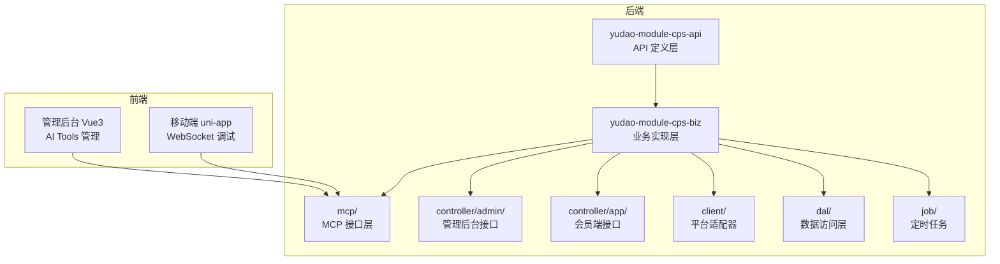
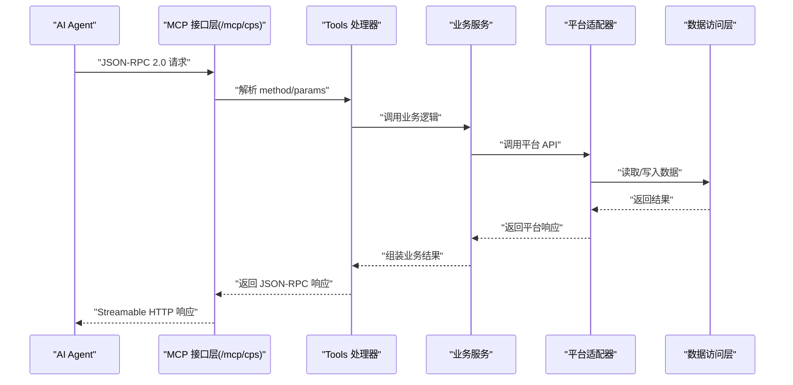
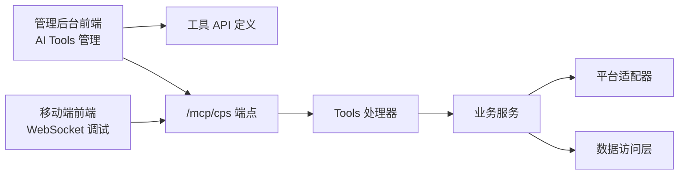

# MCP 协议接口

<cite>
**本文引用的文件**
- [README.md](file://README.md)
- [backend/README.md](file://backend/README.md)
- [AGENTS.md](file://AGENTS.md)
- [CPS系统PRD文档.md](file://docs/CPS系统PRD文档.md)
- [frontend/admin-vue3/src/api/ai/model/tool/index.ts](file://frontend/admin-vue3/src/api/ai/model/tool/index.ts)
- [frontend/admin-vue3/src/views/ai/chat/index/components/message/MessageList.vue](file://frontend/admin-vue3/src/views/ai/chat/index/components/message/MessageList.vue)
- [frontend/admin-uniapp/src/pages-infra/web-socket/index.vue](file://frontend/admin-uniapp/src/pages-infra/web-socket/index.vue)
</cite>

## 目录
1. [简介](#简介)
2. [项目结构](#项目结构)
3. [核心组件](#核心组件)
4. [架构总览](#架构总览)
5. [详细组件分析](#详细组件分析)
6. [依赖关系分析](#依赖关系分析)
7. [性能考量](#性能考量)
8. [故障排查指南](#故障排查指南)
9. [结论](#结论)
10. [附录](#附录)

## 简介
本文件面向 MCP（Model Context Protocol）协议接口的使用者与维护者，系统化阐述 AgenticCPS 中 MCP 的技术规范、工具函数定义、资源访问接口、消息格式规范，并给出 AI Agent 的零代码接入流程、工具注册机制、权限控制策略、会话管理方式。同时提供 MCP 客户端 SDK 使用指南、连接建立过程、消息交互模式、错误处理机制，以及工具调用示例、Agent 配置方法、性能监控指标与调试技巧，最后说明与现有系统的集成方式、兼容性考虑与扩展性设计。

## 项目结构
AgenticCPS 的 MCP 接口位于后端模块 yudao-module-cps 的业务实现层，采用 Spring AI 与 MCP 协议对接，提供 Tools（可调用函数）、Resources（只读数据源）与 Prompts（预设交互模板）。前端通过管理后台提供 MCP 服务状态、API Key 管理、Tools 配置与访问日志等运维能力。

**图表来源**
- [AGENTS.md:161-168](file://AGENTS.md#L161-L168)
- [README.md:223-243](file://README.md#L223-L243)

**章节来源**
- [AGENTS.md:161-168](file://AGENTS.md#L161-L168)
- [README.md:223-243](file://README.md#L223-L243)

## 核心组件
- MCP 接口层：提供 JSON-RPC 2.0 over Streamable HTTP 的 /mcp/cps 端点，承载 Tools 与 Resources 的调用入口。
- Tools：AI 可直接调用的函数集合，如商品搜索、跨平台比价、推广链接生成、订单查询、返利汇总等。
- Resources：只读数据源，如平台配置、返利规则、统计数据等。
- Prompts：预定义交互模板，辅助 AI Agent 更好地与系统交互。
- 管理后台：提供 MCP 服务状态、API Key 管理、Tools 配置、访问日志等运维能力。

**章节来源**
- [AGENTS.md:161-168](file://AGENTS.md#L161-L168)
- [backend/README.md:179-205](file://backend/README.md#L179-L205)
- [CPS系统PRD文档.md:698-737](file://docs/CPS系统PRD文档.md#L698-L737)

## 架构总览
MCP 在 AgenticCPS 中以“协议 + 接口层 + 管理后台”的方式呈现，AI Agent 通过标准 MCP 消息与后端交互；后端将消息路由到对应的 Tools/Resource 处理器，结合平台适配器与业务服务完成实际操作，并通过管理后台提供可观测性与治理能力。

**图表来源**
- [AGENTS.md:161-168](file://AGENTS.md#L161-L168)
- [backend/README.md:179-205](file://backend/README.md#L179-L205)

## 详细组件分析

### MCP 技术规范与消息格式
- 协议：JSON-RPC 2.0 over Streamable HTTP
- 端点：/mcp/cps
- 方法命名空间：tools/call、resources/read 等（示例见后文）
- 请求体字段：
  - method：调用方法名（如 tools/call）
  - params：参数对象（如 name、arguments）
  - id：请求标识（JSON-RPC 2.0 标准）
- 响应体字段：
  - result：成功结果
  - error：错误对象（包含 code、message 等）
  - id：与请求一致

示例请求（工具调用）：
- method: "tools/call"
- params:
  - name: "cps_search_goods"
  - arguments: { keyword: "...", priceMax: 50 }

示例响应（成功）：
- result: { ... }
- id: 请求 id

示例响应（错误）：
- error: { code: -32600..-32603, message: "..." }
- id: 请求 id

**章节来源**
- [backend/README.md:179-205](file://backend/README.md#L179-L205)
- [AGENTS.md:161-168](file://AGENTS.md#L161-L168)

### 工具函数定义（Tools）
- cps_search_goods：商品搜索（支持关键词、价格上限等参数）
- cps_compare_prices：跨平台比价（自动比较各平台价格，推荐最优方案）
- cps_generate_link：推广链接生成（生成带返利追踪的购买链接）
- cps_query_orders：订单查询（查看用户的返利订单状态）
- cps_get_rebate_summary：返利汇总（查看余额、待结算、累计返利）

工具调用流程要点：
- AI Agent 直接构造 tools/call 请求
- 后端解析 name 与 arguments
- 路由到对应工具处理器
- 返回结构化结果（如商品列表、比价表格、链接、订单状态、返利汇总）

**章节来源**
- [backend/README.md:194-203](file://backend/README.md#L194-L203)
- [CPS系统PRD文档.md:654-696](file://docs/CPS系统PRD文档.md#L654-L696)

### 资源访问接口（Resources）
- 资源类型：只读数据源（如平台配置、返利规则、统计数据）
- 访问方式：resources/read（示例）
- 典型用途：AI Agent 查询系统配置、规则或统计信息，辅助决策

**章节来源**
- [AGENTS.md:161-168](file://AGENTS.md#L161-L168)

### Prompts（预设交互模板）
- 作用：为 AI Agent 提供标准化的提示词模板，确保交互一致性与可解释性
- 场景：引导 Agent 正确构造请求、解读响应、执行后续动作

**章节来源**
- [AGENTS.md:161-168](file://AGENTS.md#L161-L168)

### AI Agent 零代码接入流程
- 步骤一：准备 API Key（具备相应权限级别）
- 步骤二：向 /mcp/cps 发送 tools/call 请求
- 步骤三：解析 result 或 error，按需执行后续动作
- 步骤四：通过管理后台查看调用统计与日志

**章节来源**
- [CPS系统PRD文档.md:698-737](file://docs/CPS系统PRD文档.md#L698-L737)
- [backend/README.md:179-205](file://backend/README.md#L179-L205)

### 工具注册机制
- 工具注册：在 MCP 接口层集中注册 Tools，统一暴露给 AI Agent
- 平台适配：通过 client/* 下的平台适配器对接淘宝、京东、拼多多、抖音等平台
- 业务服务：封装业务逻辑，调用适配器与数据访问层

**章节来源**
- [AGENTS.md:161-168](file://AGENTS.md#L161-L168)

### 权限控制策略
- API Key 管理：支持创建、更新、删除、权限级别（public/member/admin）、限流配置、状态与备注
- 权限映射：不同工具可配置不同的权限级别（如 public 可查询，member/admin 可执行敏感操作）
- 限流策略：支持每分钟/小时/天的最大请求数限制
- 可视化治理：管理后台提供 Tools 列表、使用统计与性能指标

**章节来源**
- [CPS系统PRD文档.md:698-737](file://docs/CPS系统PRD文档.md#L698-L737)

### 会话管理方式
- 会话边界：MCP 请求为无状态调用，AI Agent 自行维护对话上下文
- 管理后台：提供 MCP 服务状态与连接数展示，便于运维观测
- 访问日志：记录工具调用、参数、耗时与错误，支撑审计与排障

**章节来源**
- [CPS系统PRD文档.md:698-737](file://docs/CPS系统PRD文档.md#L698-L737)

### MCP 客户端 SDK 使用指南
- 连接建立：通过 /mcp/cps 端点发起 JSON-RPC 2.0 over Streamable HTTP 请求
- 消息交互：
  - 构造 tools/call 请求，设置 method 与 params
  - 解析 result 或 error，处理业务分支
- 错误处理：
  - JSON-RPC 2.0 错误码：-32600..-32603（参数错误、方法未找到、内部错误等）
  - 结合管理后台访问日志定位问题

**章节来源**
- [backend/README.md:179-205](file://backend/README.md#L179-L205)
- [CPS系统PRD文档.md:698-737](file://docs/CPS系统PRD文档.md#L698-L737)

### 工具调用示例
- 示例一：商品搜索
  - method: "tools/call"
  - params.name: "cps_search_goods"
  - params.arguments: { keyword: "iPhone 16 手机壳", priceMax: 50 }
- 示例二：跨平台比价
  - method: "tools/call"
  - params.name: "cps_compare_prices"
  - params.arguments: { keyword: "iPhone 16" }
- 示例三：推广链接生成
  - method: "tools/call"
  - params.name: "cps_generate_link"
  - params.arguments: { goodsId: "..." }
- 示例四：订单查询
  - method: "tools/call"
  - params.name: "cps_query_orders"
  - params.arguments: { userId: "..." }
- 示例五：返利汇总
  - method: "tools/call"
  - params.name: "cps_get_rebate_summary"
  - params.arguments: { userId: "..." }

**章节来源**
- [backend/README.md:183-203](file://backend/README.md#L183-L203)

### Agent 配置方法
- 在管理后台配置 API Key，设置权限级别与限流规则
- 在 Tools 配置页面查看与调整工具的访问权限与默认参数
- 通过访问日志监控调用情况与性能指标

**章节来源**
- [CPS系统PRD文档.md:698-737](file://docs/CPS系统PRD文档.md#L698-L737)

### 性能监控指标
- 单平台搜索：< 2 秒（P99）
- 多平台比价：< 5 秒（P99）
- 转链生成：< 1 秒
- 订单同步延迟：< 30 分钟
- 返利入账：平台结算后 24 小时内
- MCP Tool 调用：< 3 秒（搜索类）/ < 1 秒（查询类）

**章节来源**
- [README.md:326-341](file://README.md#L326-L341)

### 调试技巧
- 使用管理后台的 MCP 服务状态与访问日志页面，核对请求与响应
- 在前端 uni-app 的 WebSocket 页面模拟消息发送与解析，辅助定位问题
- 结合 MessageList 组件的渲染逻辑，检查消息结构与字段映射

**章节来源**
- [CPS系统PRD文档.md:698-737](file://docs/CPS系统PRD文档.md#L698-L737)
- [frontend/admin-uniapp/src/pages-infra/web-socket/index.vue:33-425](file://frontend/admin-uniapp/src/pages-infra/web-socket/index.vue#L33-L425)
- [frontend/admin-vue3/src/views/ai/chat/index/components/message/MessageList.vue:84-119](file://frontend/admin-vue3/src/views/ai/chat/index/components/message/MessageList.vue#L84-L119)

## 依赖关系分析
MCP 接口层依赖业务服务与平台适配器，管理后台通过 API 与前端组件提供运维能力；前端组件负责消息渲染与交互。

**图表来源**
- [frontend/admin-vue3/src/api/ai/model/tool/index.ts:1-42](file://frontend/admin-vue3/src/api/ai/model/tool/index.ts#L1-L42)
- [AGENTS.md:161-168](file://AGENTS.md#L161-L168)

**章节来源**
- [frontend/admin-vue3/src/api/ai/model/tool/index.ts:1-42](file://frontend/admin-vue3/src/api/ai/model/tool/index.ts#L1-L42)
- [AGENTS.md:161-168](file://AGENTS.md#L161-L168)

## 性能考量
- 延迟目标：MCP 工具调用需满足搜索类 < 3 秒、查询类 < 1 秒的性能要求
- 并发与限流：通过 API Key 的限流配置控制请求速率，避免过载
- 缓存与索引：结合系统缓存与数据库索引优化热点查询
- 监控与告警：利用管理后台访问日志与服务状态，持续观测性能与异常

**章节来源**
- [README.md:326-341](file://README.md#L326-L341)
- [CPS系统PRD文档.md:698-737](file://docs/CPS系统PRD文档.md#L698-L737)

## 故障排查指南
- 确认 /mcp/cps 端点可达且返回 JSON-RPC 2.0 格式
- 检查 API Key 权限级别与限流配置是否正确
- 通过访问日志定位错误码与异常堆栈
- 使用前端 WebSocket 页面模拟消息发送，验证解析逻辑
- 核对工具参数与返回结构，确保字段映射正确

**章节来源**
- [CPS系统PRD文档.md:698-737](file://docs/CPS系统PRD文档.md#L698-L737)
- [frontend/admin-uniapp/src/pages-infra/web-socket/index.vue:33-425](file://frontend/admin-uniapp/src/pages-infra/web-socket/index.vue#L33-L425)

## 结论
AgenticCPS 的 MCP 接口以标准化协议与清晰的 Tools/Resources 分层，实现了 AI Agent 的零代码接入与高效扩展。通过完善的权限控制、限流策略与可观测性能力，系统在易用性与可运维性之间取得平衡。结合平台适配器与业务服务，MCP 为多平台电商生态提供了统一的智能交互入口。

## 附录
- 端点：/mcp/cps
- 协议：JSON-RPC 2.0 over Streamable HTTP
- 工具示例：cps_search_goods、cps_compare_prices、cps_generate_link、cps_query_orders、cps_get_rebate_summary
- 管理后台功能：MCP 服务状态、API Key 管理、Tools 配置、访问日志

**章节来源**
- [AGENTS.md:161-168](file://AGENTS.md#L161-L168)
- [backend/README.md:179-205](file://backend/README.md#L179-L205)
- [CPS系统PRD文档.md:698-737](file://docs/CPS系统PRD文档.md#L698-L737)