# CPS 联盟返利接口

<cite>
**本文档引用的文件**
- [CPS系统PRD文档.md](file://docs/CPS系统PRD文档.md)
- [AGENTS.md](file://AGENTS.md)
- [README.md](file://README.md)
- [ConfigController.java](file://backend/yudao-module-infra/src/main/java/cn/iocoder/yudao/module/infra/controller/admin/config/ConfigController.java)
</cite>

## 目录
1. [简介](#简介)
2. [项目结构](#项目结构)
3. [核心组件](#核心组件)
4. [架构总览](#架构总览)
5. [详细组件分析](#详细组件分析)
6. [依赖关系分析](#依赖关系分析)
7. [性能考虑](#性能考虑)
8. [故障排除指南](#故障排除指南)
9. [结论](#结论)

## 简介

AgenticCPS 是一个基于 ruoyi-vue-pro 开发的 CPS（Cost Per Sale）联盟返利系统。该系统聚合了淘宝、京东、拼多多、抖音等主流电商平台的联盟能力，为用户提供一站式返利查询、跨平台比价、推广链接生成和返利提现服务。

系统采用 Vibe Coding + AI 自主编程范式，CPS 核心模块代码 100% 由 AI 自主生成，实现了从数据库设计到 API 接口、从业务逻辑到单元测试的全流程自动化。

## 项目结构

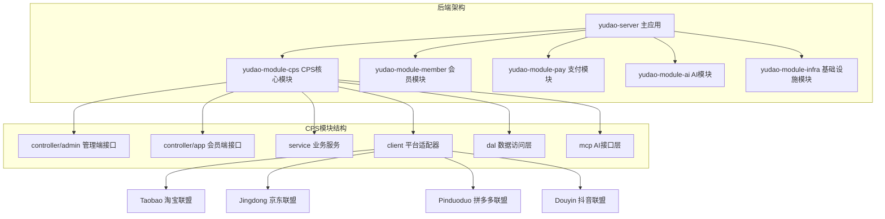

**图表来源**
- [AGENTS.md:14-57](file://AGENTS.md#L14-L57)

**章节来源**
- [AGENTS.md:14-57](file://AGENTS.md#L14-L57)
- [README.md:229-249](file://README.md#L229-L249)

## 核心组件

### 平台适配器（策略模式）

系统采用策略模式实现多平台适配器，每个平台实现统一的 `CpsPlatformClient` 接口：

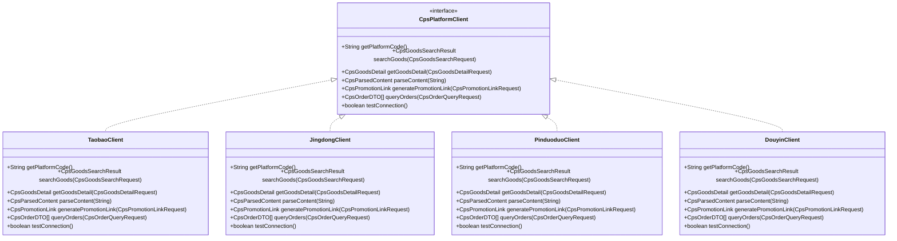

**图表来源**
- [AGENTS.md:145-157](file://AGENTS.md#L145-L157)

### MCP AI 接口层

系统提供基于 MCP（Model Context Protocol）的 AI 接口层，支持 JSON-RPC 2.0 over Streamable HTTP：

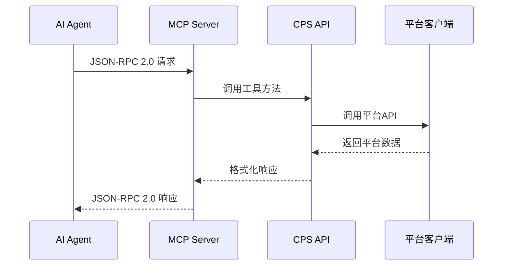

**图表来源**
- [AGENTS.md:161-168](file://AGENTS.md#L161-L168)

**章节来源**
- [AGENTS.md:141-181](file://AGENTS.md#L141-L181)

## 架构总览

系统采用分层架构设计，包含以下核心层次：

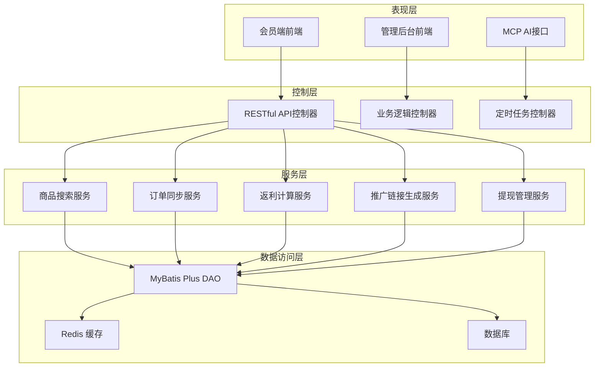

**图表来源**
- [AGENTS.md:68-81](file://AGENTS.md#L68-L81)

## 详细组件分析

### 商品搜索接口

#### 接口定义

| 接口 | 方法 | 路径 | 说明 |
|------|------|------|------|
| 商品搜索 | POST | `/app-api/cps/goods/search` | 关键词/链接/口令搜索 |

#### 请求参数

| 参数名 | 类型 | 必填 | 说明 |
|--------|------|------|------|
| keyword | String | 否 | 搜索关键词 |
| content | String | 否 | 商品链接或口令 |
| platform | String | 否 | 指定平台编码 |
| sortType | String | 否 | 排序类型 |
| pageNo | Integer | 否 | 页码，默认1 |
| pageSize | Integer | 否 | 每页数量，默认20 |

#### 响应格式

```json
{
  "code": 0,
  "msg": "success",
  "data": {
    "total": 100,
    "list": [
      {
        "itemId": "商品ID",
        "title": "商品标题",
        "price": 9900,
        "originPrice": 12900,
        "couponAmount": 3000,
        "commissionRate": 0.05,
        "imageUrl": "商品图片URL",
        "platform": "taobao",
        "rebateAmount": 495
      }
    ]
  }
}
```

#### 错误码

| 错误码 | 说明 |
|--------|------|
| 400 | 请求参数错误 |
| 500 | 服务器内部错误 |
| 503 | 平台API不可用 |

**章节来源**
- [CPS系统PRD文档.md:929](file://docs/CPS系统PRD文档.md#L929)

### 多平台比价接口

#### 接口定义

| 接口 | 方法 | 路径 | 说明 |
|------|------|------|------|
| 多平台比价 | POST | `/app-api/cps/goods/compare` | 跨平台比价 |

#### 请求参数

| 参数名 | 类型 | 必填 | 说明 |
|--------|------|------|------|
| keyword | String | 是 | 搜索关键词 |
| sortMode | String | 否 | 排序模式，默认"lowest_price" |

#### 响应格式

```json
{
  "code": 0,
  "msg": "success",
  "data": [
    {
      "platform": "taobao",
      "itemName": "iPhone 16 手机壳",
      "finalPrice": 2400,
      "rebateAmount": 240,
      "originalPrice": 2500,
      "couponAmount": 100
    },
    {
      "platform": "pinduoduo",
      "itemName": "iPhone 16 手机壳",
      "finalPrice": 2160,
      "rebateAmount": 216,
      "originalPrice": 2400,
      "couponAmount": 240
    }
  ]
}
```

#### 排序模式

| 模式 | 说明 |
|------|------|
| lowest_price | 实付价最低 |
| coupon_price | 券后价最低 |
| highest_rebate | 返利最高 |

**章节来源**
- [CPS系统PRD文档.md:930](file://docs/CPS系统PRD文档.md#L930)

### 推广链接生成接口

#### 接口定义

| 接口 | 方法 | 路径 | 说明 |
|------|------|------|------|
| 生成推广链接 | POST | `/app-api/cps/link/generate` | 转链 |

#### 请求参数

| 参数名 | 类型 | 必填 | 说明 |
|--------|------|------|------|
| itemId | String | 是 | 商品ID |
| platform | String | 是 | 平台编码 |
| pid | String | 否 | 推广位ID |

#### 响应格式

```json
{
  "code": 0,
  "msg": "success",
  "data": {
    "promotionUrl": "推广链接",
    "promotionCode": "淘口令",
    "shortUrl": "短链接"
  }
}
```

#### 平台差异

| 平台 | 推广链接类型 | 说明 |
|------|-------------|------|
| taobao | 淘口令 + 推广链接 | 优先返回淘口令 |
| jingdong | 短链接 + 长链接 | 返回两种格式 |
| pinduoduo | 推广链接 + 小程序路径 | 移动端优化 |

**章节来源**
- [CPS系统PRD文档.md:933](file://docs/CPS系统PRD文档.md#L933)

### 订单状态同步接口

#### 接口定义

| 接口 | 方法 | 路径 | 说明 |
|------|------|------|------|
| 我的订单列表 | GET | `/app-api/cps/order/page` | 分页查询 |
| 订单详情 | GET | `/app-api/cps/order/get` | 单笔订单 |

#### 订单状态流程

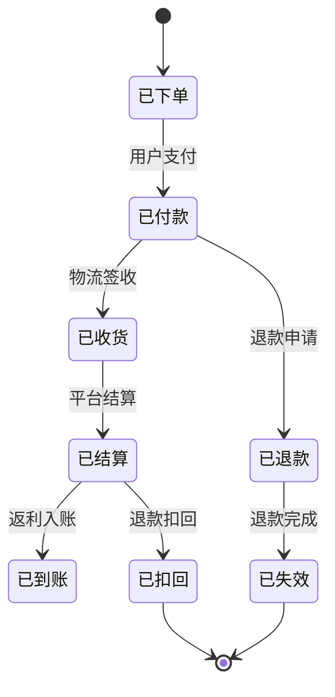

**图表来源**
- [AGENTS.md:175-181](file://AGENTS.md#L175-L181)

#### 订单状态映射

| 状态 | 说明 | 含义 |
|------|------|------|
| 1 | 已下单 | 用户已下单但未付款 |
| 2 | 已付款 | 用户已付款等待发货 |
| 3 | 已收货 | 物流已签收 |
| 4 | 已结算 | 平台已结算佣金 |
| 5 | 已到账 | 返利已入账到会员账户 |
| 6 | 已退款 | 发生退款交易 |
| 7 | 已失效 | 订单失效 |

**章节来源**
- [AGENTS.md:175-181](file://AGENTS.md#L175-L181)

### 返利计算接口

#### 接口定义

| 接口 | 方法 | 路径 | 说明 |
|------|------|------|------|
| 返利汇总 | GET | `/app-api/cps/rebate/summary` | 余额/待结算/累计 |
| 返利明细 | GET | `/app-api/cps/rebate/page` | 分页查询 |

#### 返利计算优先级

系统按以下顺序解析返利比例，命中即停止：

1. 会员个人专属配置（精确到平台）
2. 会员个人专属配置（全平台）
3. 会员等级 + 指定平台的组合配置
4. 会员等级的全平台配置
5. 指定平台的默认配置
6. 系统全局默认配置

#### 返利规则公式

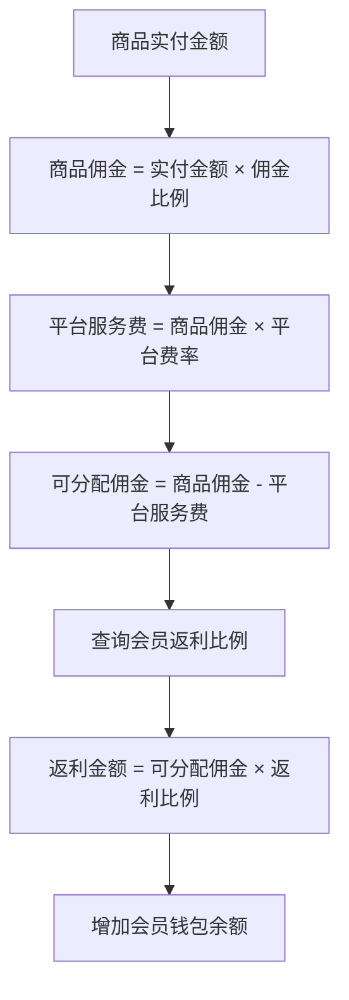

**图表来源**
- [CPS系统PRD文档.md:764-780](file://docs/CPS系统PRD文档.md#L764-L780)

**章节来源**
- [CPS系统PRD文档.md:760-791](file://docs/CPS系统PRD文档.md#L760-L791)

### 佣金结算接口

#### 接口定义

| 接口 | 方法 | 路径 | 说明 |
|------|------|------|------|
| 发起提现 | POST | `/app-api/cps/withdraw/create` | 提现申请 |
| 提现记录 | GET | `/app-api/cps/withdraw/page` | 分页查询 |

#### 提现规则

| 规则 | 说明 | 默认值 |
|------|------|--------|
| 最低提现金额 | 单次最低提现金额 | ¥1.00 |
| 最高提现金额 | 单次最高提现金额 | ¥5,000.00 |
| 每日提现次数 | 每日最多提现次数 | 3次 |
| 提现手续费 | 提现手续费 | 免费 |
| 预计到账时间 | 工作日预计到账时间 | T+1个工作日 |

#### 提现审核流程

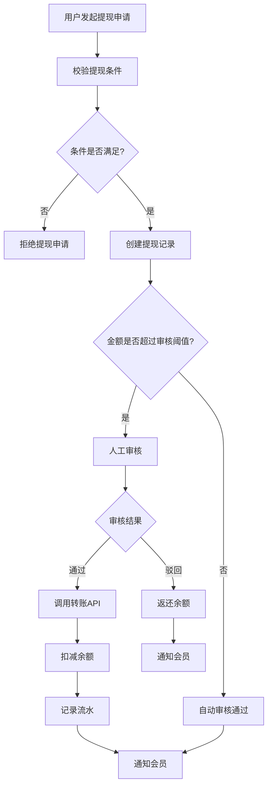

**图表来源**
- [CPS系统PRD文档.md:225-261](file://docs/CPS系统PRD文档.md#L225-L261)

**章节来源**
- [CPS系统PRD文档.md:512-552](file://docs/CPS系统PRD文档.md#L512-L552)

## 依赖关系分析

### 技术栈依赖

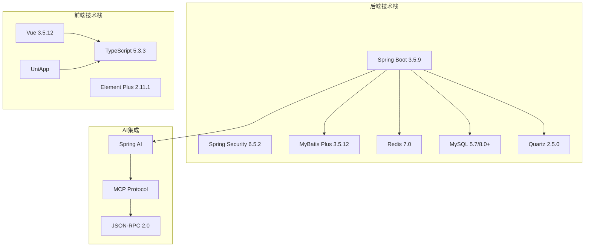

**图表来源**
- [AGENTS.md:68-81](file://AGENTS.md#L68-L81)

### 数据模型关系

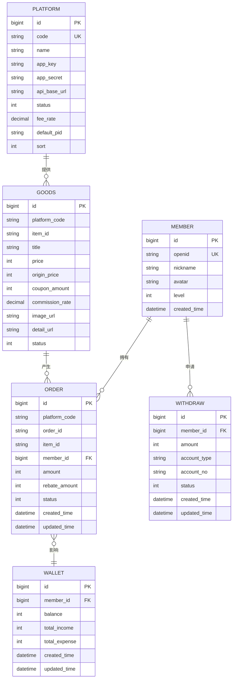

**图表来源**
- [AGENTS.md:206-212](file://AGENTS.md#L206-L212)

**章节来源**
- [AGENTS.md:68-81](file://AGENTS.md#L68-L81)

## 性能考虑

### 性能指标要求

| 指标 | 要求 | 说明 |
|------|------|------|
| 单平台搜索 | < 2秒（P99） | 搜索响应时间 |
| 多平台比价 | < 5秒（P99） | 并发查询响应时间 |
| 转链生成 | < 1秒 | 推广链接生成时间 |
| 订单同步延迟 | < 30分钟 | 订单状态更新延迟 |
| 返利入账 | 平台结算后24小时内 | 返利到账时间 |
| 搜索缓存命中 | < 200ms | 重复搜索响应时间 |

### 缓存策略

系统采用多层缓存策略：

1. **Redis 缓存**：商品信息、搜索结果、平台配置
2. **本地缓存**：热点数据、临时计算结果
3. **浏览器缓存**：静态资源、图片资源

### 并发处理

- **线程池配置**：平台API调用使用独立线程池
- **限流策略**：API请求限流、平台API频率限制
- **熔断机制**：平台API异常自动熔断

## 故障排除指南

### 常见错误处理

#### 平台API异常

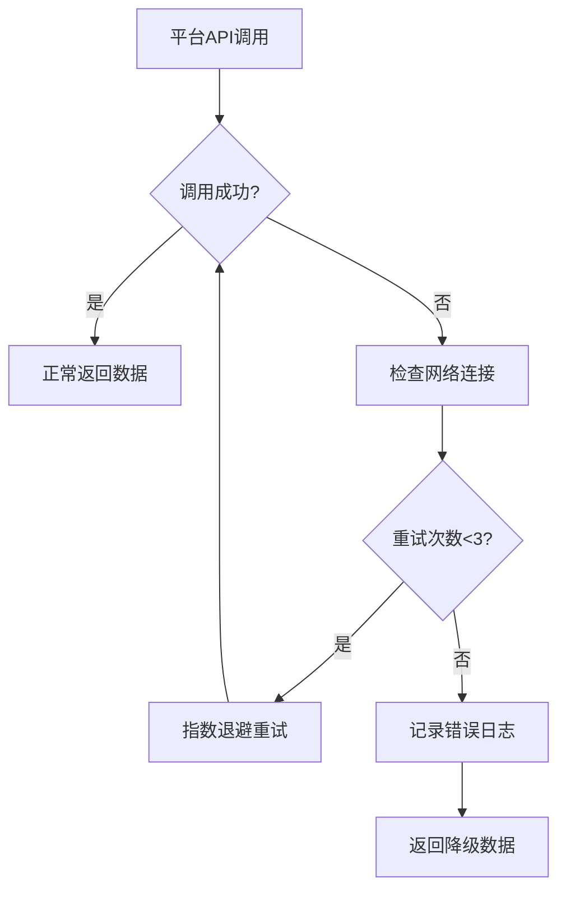

#### 数据一致性处理

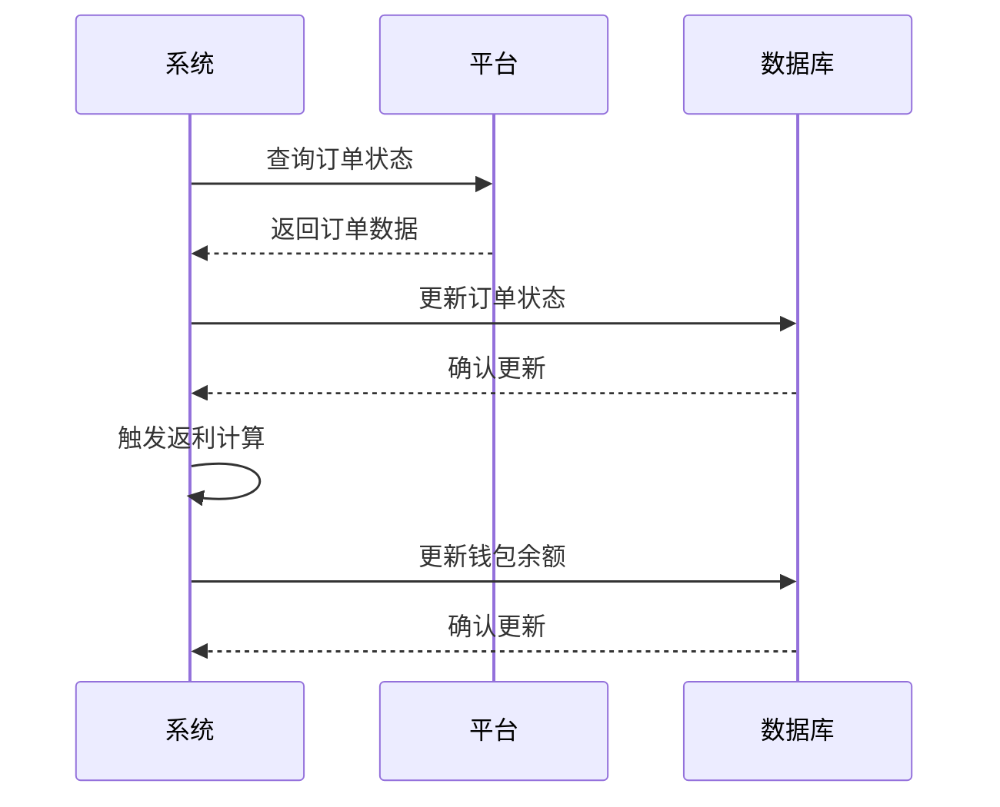

**图表来源**
- [CPS系统PRD文档.md:183-223](file://docs/CPS系统PRD文档.md#L183-L223)

### 监控指标

| 指标类型 | 监控内容 | 告警阈值 |
|----------|----------|----------|
| API响应时间 | 各接口响应时间 | > 2秒 |
| 平台可用性 | 平台API可用性 | < 95% |
| 订单同步率 | 订单同步成功率 | < 95% |
| 返利准确性 | 返利计算准确性 | < 99.9% |

**章节来源**
- [CPS系统PRD文档.md:852-879](file://docs/CPS系统PRD文档.md#L852-L879)

## 结论

AgenticCPS CPS 联盟返利系统通过采用先进的技术架构和 AI 自主编程范式，实现了从商品搜索、比价、推广链接生成到订单同步、返利结算的完整业务闭环。系统具有以下优势：

1. **技术先进性**：采用 Spring Boot、Vue 3、AI 集成等前沿技术栈
2. **架构合理性**：分层清晰、模块化程度高、易于扩展
3. **性能优异**：多平台并发处理、缓存优化、限流保护
4. **可靠性强**：完善的异常处理、熔断机制、监控告警
5. **智能化程度高**：AI Agent 集成、MCP 协议支持

该系统为个人创业者和小型工作室提供了完整的 CPS 返利解决方案，降低了技术门槛和开发成本，实现了真正的"开箱即用"。