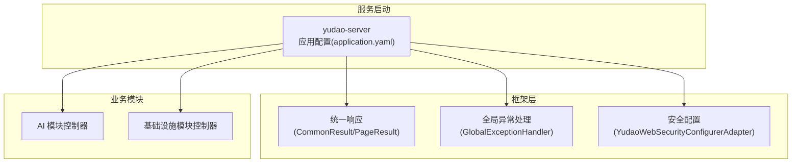
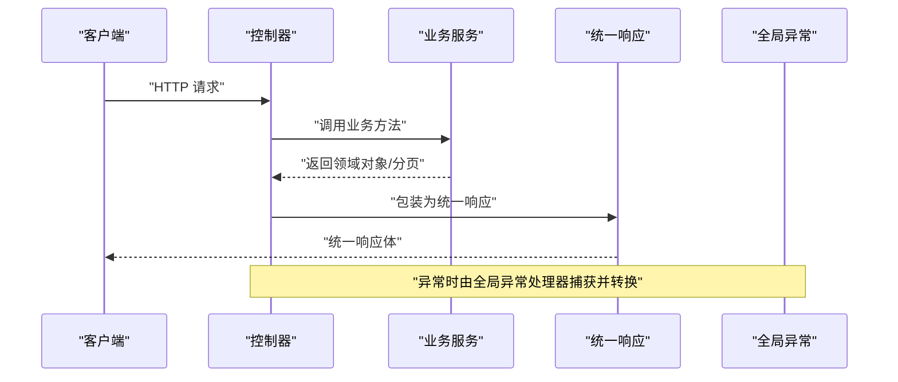
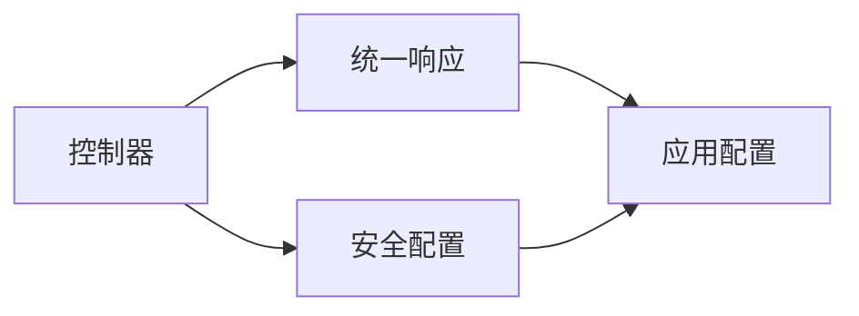

# RESTful API 接口

<cite>
**本文引用的文件**
- [application.yaml](file://backend/yudao-server/src/main/resources/application.yaml)
- [CommonResult.java](file://backend/yudao-framework/yudao-common/src/main/java/cn/iocoder/yudao/framework/common/pojo/CommonResult.java)
- [PageResult.java](file://backend/yudao-framework/yudao-common/src/main/java/cn/iocoder/yudao/framework/common/pojo/PageResult.java)
- [GlobalExceptionHandler.java](file://backend/yudao-framework/yudao-spring-boot-starter-web/src/main/java/cn/iocoder/yudao/framework/web/core/handler/GlobalExceptionHandler.java)
- [AiChatConversationController.java](file://backend/yudao-module-ai/src/main/java/cn/iocoder/ai/controller/admin/chat/AiChatConversationController.java)
- [AiChatMessageController.java](file://backend/yudao-module-ai/src/main/java/cn/iocoder/ai/controller/admin/chat/AiChatMessageController.java)
- [AiImageController.java](file://backend/yudao-module-ai/src/main/java/cn/iocoder/ai/controller/admin/image/AiImageController.java)
- [AiKnowledgeController.java](file://backend/yudao-module-ai/src/main/java/cn/iocoder/ai/controller/admin/knowledge/AiKnowledgeController.java)
- [AiKnowledgeDocumentController.java](file://backend/yudao-module-ai/src/main/java/cn/iocoder/ai/controller/admin/knowledge/AiKnowledgeDocumentController.java)
- [AiKnowledgeSegmentController.java](file://backend/yudao-module-ai/src/main/java/cn/iocoder/ai/controller/admin/knowledge/AiKnowledgeSegmentController.java)
- [AiMindMapController.java](file://backend/yudao-module-ai/src/main/java/cn/iocoder/ai/controller/admin/mindmap/AiMindMapController.java)
- [AiApiKeyController.java](file://backend/yudao-module-ai/src/main/java/cn/iocoder/ai/controller/admin/model/AiApiKeyController.java)
- [AiChatRoleController.java](file://backend/yudao-module-ai/src/main/java/cn/iocoder/ai/controller/admin/model/AiChatRoleController.java)
- [AiModelController.java](file://backend/yudao-module-ai/src/main/java/cn/iocoder/ai/controller/admin/model/AiModelController.java)
- [AiToolController.java](file://backend/yudao-module-ai/src/main/java/cn/iocoder/ai/controller/admin/model/AiToolController.java)
- [AiMusicController.java](file://backend/yudao-module-ai/src/main/java/cn/iocoder/ai/controller/admin/music/AiMusicController.java)
- [AiWorkflowController.java](file://backend/yudao-module-ai/src/main/java/cn/iocoder/ai/controller/admin/workflow/AiWorkflowController.java)
- [AiWriteController.java](file://backend/yudao-module-ai/src/main/java/cn/iocoder/ai/controller/admin/write/AiWriteController.java)
- [FileController.java](file://backend/yudao-module-infra/src/main/java/cn/iocoder/infra/controller/admin/file/FileController.java)
- [FileConfigController.java](file://backend/yudao-module-infra/src/main/java/cn/iocoder/infra/controller/admin/file/FileConfigController.java)
- [ConfigController.java](file://backend/yudao-module-infra/src/main/java/cn/iocoder/infra/controller/admin/config/ConfigController.java)
- [CodegenController.java](file://backend/yudao-module-infra/src/main/java/cn/iocoder/infra/controller/admin/codegen/CodegenController.java)
- [YudaoWebSecurityConfigurerAdapter.java](file://backend/yudao-framework/yudao-spring-boot-starter-security/src/main/java/cn/iocoder/yudao/framework/security/config/YudaoWebSecurityConfigurerAdapter.java)
</cite>

## 目录
1. [简介](#简介)
2. [项目结构](#项目结构)
3. [核心组件](#核心组件)
4. [架构总览](#架构总览)
5. [详细组件分析](#详细组件分析)
6. [依赖分析](#依赖分析)
7. [性能考虑](#性能考虑)
8. [故障排查指南](#故障排查指南)
9. [结论](#结论)
10. [附录](#附录)

## 简介
本文件面向 RESTful API 接口，系统性梳理后端控制器接口的设计规范与实现要点，覆盖以下方面：
- 统一响应格式与错误码
- 请求/响应数据结构与分页规范
- 接口版本管理、缓存策略、限流机制、安全防护
- 文件上传下载接口
- 权限控制与免登录白名单
- 接口调用示例与常见错误处理

## 项目结构
后端采用模块化架构，核心服务由 yudao-server 启动，各业务模块（如 AI、基础设施等）通过独立模块提供控制器接口。统一的响应封装、异常处理、安全配置位于框架层。

图表来源
- [application.yaml:1-362](file://backend/yudao-server/src/main/resources/application.yaml#L1-L362)
- [CommonResult.java](file://backend/yudao-framework/yudao-common/src/main/java/cn/iocoder/yudao/framework/common/pojo/CommonResult.java)
- [PageResult.java](file://backend/yudao-framework/yudao-common/src/main/java/cn/iocoder/yudao/framework/common/pojo/PageResult.java)
- [GlobalExceptionHandler.java:54-54](file://backend/yudao-framework/yudao-spring-boot-starter-web/src/main/java/cn/iocoder/yudao/framework/web/core/handler/GlobalExceptionHandler.java#L54-L54)
- [YudaoWebSecurityConfigurerAdapter.java:182-182](file://backend/yudao-framework/yudao-spring-boot-starter-security/src/main/java/cn/iocoder/yudao/framework/security/config/YudaoWebSecurityConfigurerAdapter.java#L182-L182)

章节来源
- [application.yaml:1-362](file://backend/yudao-server/src/main/resources/application.yaml#L1-L362)

## 核心组件
- 统一响应封装
  - 成功响应：包含 code、msg、data 字段，其中 data 可为对象、数组或分页结果
  - 分页响应：包含 total 与列表数据，便于前端分页展示
- 全局异常处理
  - 将业务异常转换为统一响应格式，确保前后端交互一致性
- 安全配置
  - 提供免登录白名单与权限拦截策略，特殊场景下可按注解配置免登录路径
- 配置中心与文件服务
  - 配置项集中管理，文件上传大小限制与存储策略在配置中定义

章节来源
- [CommonResult.java](file://backend/yudao-framework/yudao-common/src/main/java/cn/iocoder/yudao/framework/common/pojo/CommonResult.java)
- [PageResult.java](file://backend/yudao-framework/yudao-common/src/main/java/cn/iocoder/yudao/framework/common/pojo/PageResult.java)
- [GlobalExceptionHandler.java:54-54](file://backend/yudao-framework/yudao-spring-boot-starter-web/src/main/java/cn/iocoder/yudao/framework/web/core/handler/GlobalExceptionHandler.java#L54-L54)
- [application.yaml:11-16](file://backend/yudao-server/src/main/resources/application.yaml#L11-L16)
- [application.yaml:26-31](file://backend/yudao-server/src/main/resources/application.yaml#L26-L31)
- [YudaoWebSecurityConfigurerAdapter.java:182-182](file://backend/yudao-framework/yudao-spring-boot-starter-security/src/main/java/cn/iocoder/yudao/framework/security/config/YudaoWebSecurityConfigurerAdapter.java#L182-L182)

## 架构总览
后端通过 Spring MVC 暴露 REST 接口，控制器按业务域划分，统一经框架层进行响应封装与异常处理。安全层负责鉴权与放行策略，配置层集中管理运行参数。

图表来源
- [CommonResult.java](file://backend/yudao-framework/yudao-common/src/main/java/cn/iocoder/yudao/framework/common/pojo/CommonResult.java)
- [PageResult.java](file://backend/yudao-framework/yudao-common/src/main/java/cn/iocoder/yudao/framework/common/pojo/PageResult.java)
- [GlobalExceptionHandler.java:54-54](file://backend/yudao-framework/yudao-spring-boot-starter-web/src/main/java/cn/iocoder/yudao/framework/web/core/handler/GlobalExceptionHandler.java#L54-L54)

## 详细组件分析

### 统一响应与错误码
- 成功响应结构
  - 字段：code、msg、data
  - data 类型：对象、数组、分页对象
- 分页响应结构
  - 字段：total、list
- 错误码约定
  - 业务异常：由全局异常处理器转换为统一响应，确保前后端一致
  - 建议：错误码从 0 开始递增，预留负数区间给系统级错误

章节来源
- [CommonResult.java](file://backend/yudao-framework/yudao-common/src/main/java/cn/iocoder/yudao/framework/common/pojo/CommonResult.java)
- [PageResult.java](file://backend/yudao-framework/yudao-common/src/main/java/cn/iocoder/yudao/framework/common/pojo/PageResult.java)
- [GlobalExceptionHandler.java:54-54](file://backend/yudao-framework/yudao-spring-boot-starter-web/src/main/java/cn/iocoder/yudao/framework/web/core/handler/GlobalExceptionHandler.java#L54-L54)

### 文件上传下载接口
- 上传大小限制
  - 单文件最大：16MB
  - 总请求大小：32MB
- 控制器路径
  - 文件上传：/infra/file
  - 文件配置：/infra/file-config
- 下载接口
  - 建议：通过文件存储服务提供直链或签名下载链接

章节来源
- [application.yaml:14-16](file://backend/yudao-server/src/main/resources/application.yaml#L14-L16)
- [FileController.java:37-37](file://backend/yudao-module-infra/src/main/java/cn/iocoder/infra/controller/admin/file/FileController.java#L37-L37)
- [FileConfigController.java:25-25](file://backend/yudao-module-infra/src/main/java/cn/iocoder/infra/controller/admin/file/FileConfigController.java#L25-L25)

### 配置管理接口
- 接口路径：/infra/config
- 功能：提供配置项的增删改查，集中管理运行参数
- 建议：敏感配置使用加密存储与传输

章节来源
- [ConfigController.java:33-33](file://backend/yudao-module-infra/src/main/java/cn/iocoder/infra/controller/admin/config/ConfigController.java#L33-L33)

### 代码生成接口
- 接口路径：/infra/codegen
- 功能：根据数据库表生成前后端代码骨架
- 建议：结合模板类型与 VO 类型参数，控制生成范围

章节来源
- [CodegenController.java:41-41](file://backend/yudao-module-infra/src/main/java/cn/iocoder/infra/controller/admin/codegen/CodegenController.java#L41-L41)

### AI 模块接口族
- 会话管理：/ai/chat/conversation
- 消息管理：/ai/chat/message
- 图像生成：/ai/image
- 知识库：/ai/knowledge
- 知识文档：/ai/knowledge/document
- 知识片段：/ai/knowledge/segment
- 思维导图：/ai/mind-map
- 模型与工具：/ai/api-key、/ai/chat-role、/ai/model、/ai/tool
- 音乐生成：/ai/music
- 工作流：/ai/workflow
- 写作：/ai/write

说明
- 上述路径均为控制器声明的@RequestMapping前缀，具体接口需结合各控制器内的方法注解（如@GetMapping、@PostMapping等）确定
- 建议：为每个接口补充请求参数、响应结构、状态码与权限要求

章节来源
- [AiChatConversationController.java:33-33](file://backend/yudao-module-ai/src/main/java/cn/iocoder/ai/controller/admin/chat/AiChatConversationController.java#L33-L33)
- [AiChatMessageController.java:43-43](file://backend/yudao-module-ai/src/main/java/cn/iocoder/ai/controller/admin/chat/AiChatMessageController.java#L43-L43)
- [AiImageController.java:31-31](file://backend/yudao-module-ai/src/main/java/cn/iocoder/ai/controller/admin/image/AiImageController.java#L31-L31)
- [AiKnowledgeController.java:27-27](file://backend/yudao-module-ai/src/main/java/cn/iocoder/ai/controller/admin/knowledge/AiKnowledgeController.java#L27-L27)
- [AiKnowledgeDocumentController.java:23-23](file://backend/yudao-module-ai/src/main/java/cn/iocoder/ai/controller/admin/knowledge/AiKnowledgeDocumentController.java#L23-L23)
- [AiKnowledgeSegmentController.java:34-34](file://backend/yudao-module-ai/src/main/java/cn/iocoder/ai/controller/admin/knowledge/AiKnowledgeSegmentController.java#L34-L34)
- [AiMindMapController.java:25-25](file://backend/yudao-module-ai/src/main/java/cn/iocoder/ai/controller/admin/mindmap/AiMindMapController.java#L25-L25)
- [AiApiKeyController.java:27-27](file://backend/yudao-module-ai/src/main/java/cn/iocoder/ai/controller/admin/model/AiApiKeyController.java#L27-L27)
- [AiChatRoleController.java:29-29](file://backend/yudao-module-ai/src/main/java/cn/iocoder/ai/controller/admin/model/AiChatRoleController.java#L29-L29)
- [AiModelController.java:27-27](file://backend/yudao-module-ai/src/main/java/cn/iocoder/ai/controller/admin/model/AiModelController.java#L27-L27)
- [AiToolController.java:27-27](file://backend/yudao-module-ai/src/main/java/cn/iocoder/ai/controller/admin/model/AiToolController.java#L27-L27)
- [AiMusicController.java:24-24](file://backend/yudao-module-ai/src/main/java/cn/iocoder/ai/controller/admin/music/AiMusicController.java#L24-L24)
- [AiWorkflowController.java:21-21](file://backend/yudao-module-ai/src/main/java/cn/iocoder/ai/controller/admin/workflow/AiWorkflowController.java#L21-L21)
- [AiWriteController.java:25-25](file://backend/yudao-module-ai/src/main/java/cn/iocoder/ai/controller/admin/write/AiWriteController.java#L25-L25)

### 分页查询规范
- 响应结构：包含 total 与 list
- 建议：前端传入 page、size 参数，后端返回 total 与数据列表

章节来源
- [PageResult.java](file://backend/yudao-framework/yudao-common/src/main/java/cn/iocoder/yudao/framework/common/pojo/PageResult.java)

### 接口版本管理
- 建议：在 URL 中加入版本号（如 /v1/...），或通过请求头区分版本
- 当前仓库未发现显式的版本前缀路径，建议在新增接口时统一引入版本控制

[本节为通用规范说明，不直接分析具体文件]

### 缓存策略
- 缓存类型：Redis
- 过期时间：1 小时
- 建议：对热点数据设置合理 TTL，对读多写少的数据启用缓存

章节来源
- [application.yaml:27-31](file://backend/yudao-server/src/main/resources/application.yaml#L27-L31)

### 限流机制
- 当前配置未发现显式的限流策略
- 建议：在网关或控制器层引入限流（如令牌桶/滑动窗口），并结合 IP/用户维度进行限速

[本节为通用规范说明，不直接分析具体文件]

### 安全防护措施
- 免登录白名单：通过安全配置类的注解与路径匹配实现
- 特殊注解：未显式指定 method 的 @RequestMapping 将被视作需要免登录
- 建议：对敏感接口强制鉴权，对公开接口明确标注免登录范围

章节来源
- [YudaoWebSecurityConfigurerAdapter.java:182-182](file://backend/yudao-framework/yudao-spring-boot-starter-security/src/main/java/cn/iocoder/yudao/framework/security/config/YudaoWebSecurityConfigurerAdapter.java#L182-L182)

### 接口调用示例（模板）
- 请求示例
  - 方法：GET/POST/PUT/DELETE
  - 路径：/infra/config/{id}
  - 请求头：Content-Type: application/json
  - 请求体：根据接口定义
- 成功响应示例
  - 状态码：200
  - 响应体：{ "code": 0, "msg": "成功", "data": { "...": "..." } }
- 分页响应示例
  - data: { "total": 100, "list": [ { "...": "..." } ] }
- 错误响应示例
  - 状态码：200（统一响应），code 非 0
  - 响应体：{ "code": -1, "msg": "业务异常描述" }

章节来源
- [CommonResult.java](file://backend/yudao-framework/yudao-common/src/main/java/cn/iocoder/yudao/framework/common/pojo/CommonResult.java)
- [PageResult.java](file://backend/yudao-framework/yudao-common/src/main/java/cn/iocoder/yudao/framework/common/pojo/PageResult.java)

## 依赖分析
- 控制器依赖框架层的统一响应与异常处理
- 安全配置影响控制器的鉴权行为
- 配置层影响上传大小、缓存过期等运行参数

图表来源
- [CommonResult.java](file://backend/yudao-framework/yudao-common/src/main/java/cn/iocoder/yudao/framework/common/pojo/CommonResult.java)
- [GlobalExceptionHandler.java:54-54](file://backend/yudao-framework/yudao-spring-boot-starter-web/src/main/java/cn/iocoder/yudao/framework/web/core/handler/GlobalExceptionHandler.java#L54-L54)
- [YudaoWebSecurityConfigurerAdapter.java:182-182](file://backend/yudao-framework/yudao-spring-boot-starter-security/src/main/java/cn/iocoder/yudao/framework/security/config/YudaoWebSecurityConfigurerAdapter.java#L182-L182)
- [application.yaml:1-362](file://backend/yudao-server/src/main/resources/application.yaml#L1-L362)

## 性能考虑
- 缓存：对高频读取接口启用 Redis 缓存，设置合理 TTL
- 分页：大列表查询使用分页，避免一次性返回大量数据
- 上传：严格控制文件大小，避免内存溢出
- 异常：统一异常处理减少重复判断，提升稳定性

章节来源
- [application.yaml:27-31](file://backend/yudao-server/src/main/resources/application.yaml#L27-L31)
- [application.yaml:14-16](file://backend/yudao-server/src/main/resources/application.yaml#L14-L16)
- [GlobalExceptionHandler.java:54-54](file://backend/yudao-framework/yudao-spring-boot-starter-web/src/main/java/cn/iocoder/yudao/framework/web/core/handler/GlobalExceptionHandler.java#L54-L54)

## 故障排查指南
- 统一响应未按预期
  - 检查控制器是否正确返回数据对象或分页对象
  - 确认未抛出未捕获异常
- 异常未被捕获
  - 确认全局异常处理器已生效
- 上传失败
  - 检查单文件与总大小是否超过限制
- 缓存未生效
  - 检查缓存类型与过期时间配置

章节来源
- [CommonResult.java](file://backend/yudao-framework/yudao-common/src/main/java/cn/iocoder/yudao/framework/common/pojo/CommonResult.java)
- [PageResult.java](file://backend/yudao-framework/yudao-common/src/main/java/cn/iocoder/yudao/framework/common/pojo/PageResult.java)
- [GlobalExceptionHandler.java:54-54](file://backend/yudao-framework/yudao-spring-boot-starter-web/src/main/java/cn/iocoder/yudao/framework/web/core/handler/GlobalExceptionHandler.java#L54-L54)
- [application.yaml:14-16](file://backend/yudao-server/src/main/resources/application.yaml#L14-L16)
- [application.yaml:27-31](file://backend/yudao-server/src/main/resources/application.yaml#L27-L31)

## 结论
本项目通过统一响应、异常处理与安全配置，形成稳定的后端接口层。建议在后续迭代中完善接口文档、引入版本管理与限流策略，并对敏感接口进行更细粒度的权限控制与审计。

[本节为总结性内容，不直接分析具体文件]

## 附录

### 接口设计规范清单
- HTTP 方法：GET/POST/PUT/DELETE 明确标注
- URL 路径：模块前缀 + 资源路径，保持层级清晰
- 请求参数：必填/非必填、类型、范围约束
- 响应数据：成功/失败/分页三类结构
- 状态码：统一 200 返回，业务状态由 code 字段表达
- 权限控制：敏感接口强制登录，公开接口明确免登录范围
- 版本管理：建议引入 /v1、/v2 等版本前缀
- 缓存策略：热点数据启用缓存，设置合理 TTL
- 限流机制：建议在网关或控制器层引入限流
- 安全防护：敏感接口启用鉴权，白名单路径明确

[本节为通用规范说明，不直接分析具体文件]