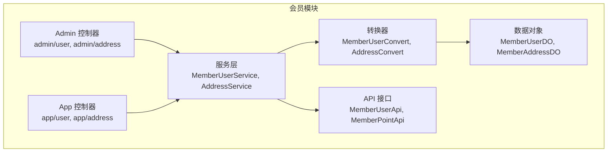
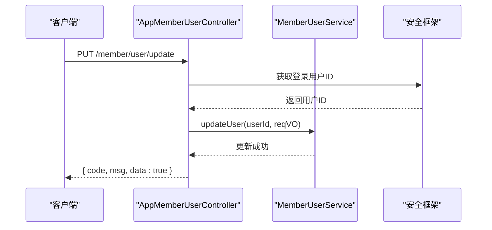
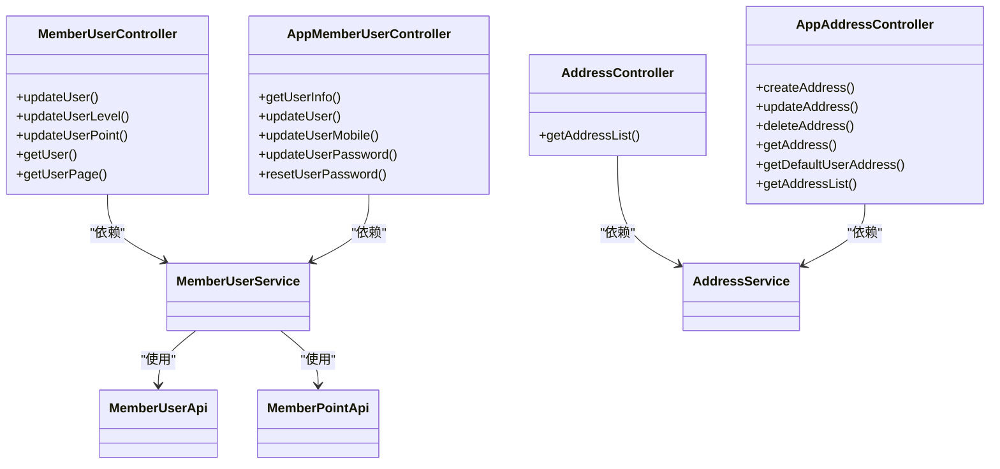

# 会员管理接口

<cite>
**本文引用的文件**
- [MemberUserApi.java](file://backend/yudao-module-member/src/main/java/cn/iocoder/yudao/module/member/api/user/MemberUserApi.java)
- [MemberPointApi.java](file://backend/yudao-module-member/src/main/java/cn/iocoder/yudao/module/member/api/point/MemberPointApi.java)
- [MemberUserController.java](file://backend/yudao-module-member/src/main/java/cn/iocoder/yudao/module/member/controller/admin/user/MemberUserController.java)
- [AppMemberUserController.java](file://backend/yudao-module-member/src/main/java/cn/iocoder/yudao/module/member/controller/app/user/AppMemberUserController.java)
- [MemberUserUpdateReqVO.java](file://backend/yudao-module-member/src/main/java/cn/iocoder/yudao/module/member/controller/admin/user/vo/MemberUserUpdateReqVO.java)
- [AppMemberUserUpdateReqVO.java](file://backend/yudao-module-member/src/main/java/cn/iocoder/yudao/module/member/controller/app/user/vo/AppMemberUserUpdateReqVO.java)
- [AddressController.java](file://backend/yudao-module-member/src/main/java/cn/iocoder/yudao/module/member/controller/admin/address/AddressController.java)
- [AppAddressController.java](file://backend/yudao-module-member/src/main/java/cn/iocoder/yudao/module/member/controller/app/address/AppAddressController.java)
</cite>

## 目录
1. [简介](#简介)
2. [项目结构](#项目结构)
3. [核心组件](#核心组件)
4. [架构总览](#架构总览)
5. [详细组件分析](#详细组件分析)
6. [依赖关系分析](#依赖关系分析)
7. [性能考虑](#性能考虑)
8. [故障排查指南](#故障排查指南)
9. [结论](#结论)

## 简介
本文件面向会员管理系统的 RESTful API 接口，覆盖用户注册、登录、个人信息管理、会员等级、积分管理、收货地址管理等能力。文档聚焦以下功能模块：
- 用户认证与登录：基于安全框架获取登录用户标识，支持应用端修改/重置密码、手机号绑定等流程。
- 个人信息管理：提供用户基本信息修改、头像/昵称/性别的更新接口。
- 会员等级：管理员可调整用户等级；应用端可查看当前等级信息。
- 积分管理：管理员可增减积分并记录流水；应用端可查询积分流水（通过通用积分 API）。
- 收货地址管理：应用端支持地址的创建、更新、删除、查询、设置默认地址等。

接口遵循统一返回体与权限控制策略，请求参数均包含数据校验规则，响应格式采用统一封装。

## 项目结构
会员管理相关代码主要位于后端 yudao-module-member 模块中，按“接口层（Controller）—服务层（Service）—数据对象（DO）—转换器（Convert）—VO/DTO”分层组织。接口按“管理后台”和“用户 APP”两类控制器划分，分别暴露不同权限范围的接口。

图表来源
- [MemberUserController.java:41-124](file://backend/yudao-module-member/src/main/java/cn/iocoder/yudao/module/member/controller/admin/user/MemberUserController.java#L41-L124)
- [AppMemberUserController.java:27-78](file://backend/yudao-module-member/src/main/java/cn/iocoder/yudao/module/member/controller/app/user/AppMemberUserController.java#L27-L78)
- [AddressController.java:27-42](file://backend/yudao-module-member/src/main/java/cn/iocoder/yudao/module/member/controller/admin/address/AddressController.java#L27-L42)
- [AppAddressController.java:27-76](file://backend/yudao-module-member/src/main/java/cn/iocoder/yudao/module/member/controller/app/address/AppAddressController.java#L27-L76)

章节来源
- [MemberUserController.java:41-124](file://backend/yudao-module-member/src/main/java/cn/iocoder/yudao/module/member/controller/admin/user/MemberUserController.java#L41-L124)
- [AppMemberUserController.java:27-78](file://backend/yudao-module-member/src/main/java/cn/iocoder/yudao/module/member/controller/app/user/AppMemberUserController.java#L27-L78)
- [AddressController.java:27-42](file://backend/yudao-module-member/src/main/java/cn/iocoder/yudao/module/member/controller/admin/address/AddressController.java#L27-L42)
- [AppAddressController.java:27-76](file://backend/yudao-module-member/src/main/java/cn/iocoder/yudao/module/member/controller/app/address/AppAddressController.java#L27-L76)

## 核心组件
- 管理后台会员用户控制器：提供用户信息查询、分页、更新、等级与积分调整等接口。
- 应用端会员用户控制器：提供用户信息查询、基本信息更新、手机号修改、密码修改/重置等接口。
- 管理后台地址控制器：提供按用户查询收货地址列表。
- 应用端地址控制器：提供地址的创建、更新、删除、详情、默认地址、列表查询。
- 会员用户 API：对外暴露用户信息查询能力（供其他模块使用）。
- 会员积分 API：对外暴露积分增加/减少能力（供其他模块使用）。

章节来源
- [MemberUserApi.java:16-68](file://backend/yudao-module-member/src/main/java/cn/iocoder/yudao/module/member/api/user/MemberUserApi.java#L16-L68)
- [MemberPointApi.java:12-36](file://backend/yudao-module-member/src/main/java/cn/iocoder/yudao/module/member/api/point/MemberPointApi.java#L12-L36)
- [MemberUserController.java:54-121](file://backend/yudao-module-member/src/main/java/cn/iocoder/yudao/module/member/controller/admin/user/MemberUserController.java#L54-L121)
- [AppMemberUserController.java:34-76](file://backend/yudao-module-member/src/main/java/cn/iocoder/yudao/module/member/controller/app/user/AppMemberUserController.java#L34-L76)
- [AddressController.java:32-39](file://backend/yudao-module-member/src/main/java/cn/iocoder/yudao/module/member/controller/admin/address/AddressController.java#L32-L39)
- [AppAddressController.java:32-73](file://backend/yudao-module-member/src/main/java/cn/iocoder/yudao/module/member/controller/app/address/AppAddressController.java#L32-L73)

## 架构总览
会员管理接口采用“控制器-服务-转换-持久化”的分层架构，统一返回体封装，权限通过注解进行控制。应用端接口通过安全框架获取当前登录用户 ID，实现“以用户为中心”的操作。

图表来源
- [AppMemberUserController.java:42-47](file://backend/yudao-module-member/src/main/java/cn/iocoder/yudao/module/member/controller/app/user/AppMemberUserController.java#L42-L47)

## 详细组件分析

### 用户认证与登录
- 登录态获取：应用端接口通过安全框架工具方法获取当前登录用户 ID，用于后续用户相关操作的身份识别。
- 密码修改/重置：提供修改密码与重置密码接口，满足用户主动修改与忘记密码场景。

章节来源
- [AppMemberUserController.java:36-76](file://backend/yudao-module-member/src/main/java/cn/iocoder/yudao/module/member/controller/app/user/AppMemberUserController.java#L36-L76)

### 个人信息管理
- 查询用户信息：应用端根据登录用户 ID 查询当前用户信息，并关联其会员等级名称。
- 修改基本信息：支持昵称、头像、性别的更新，字段具备必填与格式校验。
- 修改手机号：支持普通修改与基于微信小程序授权码的手机号修改。
- 修改/重置密码：提供修改密码与重置密码接口，满足不同场景需求。

请求参数与校验要点
- 昵称：必填
- 头像：URL 格式校验
- 性别：整型值

章节来源
- [AppMemberUserController.java:34-76](file://backend/yudao-module-member/src/main/java/cn/iocoder/yudao/module/member/controller/app/user/AppMemberUserController.java#L34-L76)
- [AppMemberUserUpdateReqVO.java:13-23](file://backend/yudao-module-member/src/main/java/cn/iocoder/yudao/module/member/controller/app/user/vo/AppMemberUserUpdateReqVO.java#L13-L23)

### 会员等级
- 管理员调整等级：提供更新会员用户等级接口，权限控制为“member:user:update-level”。
- 应用端展示等级：用户信息查询时，若用户存在等级 ID，则回显等级名称。

章节来源
- [MemberUserController.java:62-68](file://backend/yudao-module-member/src/main/java/cn/iocoder/yudao/module/member/controller/admin/user/MemberUserController.java#L62-L68)
- [MemberUserController.java:89-94](file://backend/yudao-module-member/src/main/java/cn/iocoder/yudao/module/member/controller/admin/user/MemberUserController.java#L89-L94)

### 积分管理
- 管理员增减积分：提供更新会员用户积分接口，内部通过积分记录服务创建积分流水，业务类型标记为“ADMIN”，业务编号记录操作人 ID。
- 积分 API：对外暴露积分增加/减少能力，参数包含用户 ID、积分数量（最小为 1）、业务类型与业务编号，便于其他模块扩展使用。

请求参数与校验要点
- 积分数量：最小为 1 的数值校验

章节来源
- [MemberUserController.java:70-77](file://backend/yudao-module-member/src/main/java/cn/iocoder/yudao/module/member/controller/admin/user/MemberUserController.java#L70-L77)
- [MemberPointApi.java:22-34](file://backend/yudao-module-member/src/main/java/cn/iocoder/yudao/module/member/api/point/MemberPointApi.java#L22-L34)

### 收货地址管理
- 管理后台：按用户 ID 查询该用户的收货地址列表。
- 应用端：
  - 创建地址：提交创建请求，返回新增地址编号。
  - 更新地址：提交更新请求。
  - 删除地址：按地址编号删除。
  - 查询单个地址：按地址编号查询详情。
  - 查询默认地址：返回当前用户的默认地址。
  - 查询地址列表：返回当前用户的所有地址列表。

章节来源
- [AddressController.java:32-39](file://backend/yudao-module-member/src/main/java/cn/iocoder/yudao/module/member/controller/admin/address/AddressController.java#L32-L39)
- [AppAddressController.java:32-73](file://backend/yudao-module-member/src/main/java/cn/iocoder/yudao/module/member/controller/app/address/AppAddressController.java#L32-L73)

### 权限控制与统一返回
- 权限注解：管理后台接口普遍使用权限注解进行访问控制，如“member:user:query”、“member:user:update”等。
- 统一返回体：所有接口返回统一的 CommonResult 包裹结构，包含状态码、消息与数据体。

章节来源
- [MemberUserController.java:56-100](file://backend/yudao-module-member/src/main/java/cn/iocoder/yudao/module/member/controller/admin/user/MemberUserController.java#L56-L100)
- [AddressController.java:35-35](file://backend/yudao-module-member/src/main/java/cn/iocoder/yudao/module/member/controller/admin/address/AddressController.java#L35-L35)
- [AppAddressController.java:34-50](file://backend/yudao-module-member/src/main/java/cn/iocoder/yudao/module/member/controller/app/address/AppAddressController.java#L34-L50)

## 依赖关系分析
- 控制器依赖服务层：Admin 与 App 控制器均注入对应的服务实现，完成业务逻辑处理。
- 服务层依赖转换器：服务层结果通过转换器映射为 VO/DTO，再由控制器返回。
- 服务层依赖 API 接口：如积分模块通过积分 API 进行积分变更与记录创建。

图表来源
- [MemberUserController.java:43-52](file://backend/yudao-module-member/src/main/java/cn/iocoder/yudao/module/member/controller/admin/user/MemberUserController.java#L43-L52)
- [AppMemberUserController.java:29-32](file://backend/yudao-module-member/src/main/java/cn/iocoder/yudao/module/member/controller/app/user/AppMemberUserController.java#L29-L32)
- [AddressController.java:29-30](file://backend/yudao-module-member/src/main/java/cn/iocoder/yudao/module/member/controller/admin/address/AddressController.java#L29-L30)
- [AppAddressController.java:29-30](file://backend/yudao-module-member/src/main/java/cn/iocoder/yudao/module/member/controller/app/address/AppAddressController.java#L29-L30)
- [MemberUserApi.java:16-68](file://backend/yudao-module-member/src/main/java/cn/iocoder/yudao/module/member/api/user/MemberUserApi.java#L16-L68)
- [MemberPointApi.java:12-36](file://backend/yudao-module-member/src/main/java/cn/iocoder/yudao/module/member/api/point/MemberPointApi.java#L12-L36)

## 性能考虑
- 分页查询：用户分页接口返回 PageResult，建议前端合理设置分页大小，避免一次性加载过多数据。
- 批量查询：用户 API 提供批量查询与 Map 转换能力，便于在多处场景复用，降低重复查询成本。
- 关联数据回显：用户分页时对标签、等级、分组进行一次性批量查询，减少多次数据库往返。

章节来源
- [MemberUserController.java:101-121](file://backend/yudao-module-member/src/main/java/cn/iocoder/yudao/module/member/controller/admin/user/MemberUserController.java#L101-L121)
- [MemberUserApi.java:40-43](file://backend/yudao-module-member/src/main/java/cn/iocoder/yudao/module/member/api/user/MemberUserApi.java#L40-L43)

## 故障排查指南
- 无权限访问：若返回权限不足，请确认当前登录账号是否具备相应权限（如“member:user:query”、“member:user:update”等）。
- 参数校验失败：请求参数不满足校验规则（如积分必须为正数、头像必须为 URL）会导致校验异常，请检查请求体字段。
- 用户不存在：查询用户信息时若用户不存在，接口会返回空数据，请确认用户 ID 是否正确。
- 地址不存在或非本人：应用端地址相关接口若传入非本人地址编号，可能导致更新/删除失败，请确认当前登录用户与地址归属关系。

章节来源
- [MemberUserController.java:85-87](file://backend/yudao-module-member/src/main/java/cn/iocoder/yudao/module/member/controller/admin/user/MemberUserController.java#L85-L87)
- [MemberPointApi.java:22-23](file://backend/yudao-module-member/src/main/java/cn/iocoder/yudao/module/member/api/point/MemberPointApi.java#L22-L23)
- [AppAddressController.java:48-50](file://backend/yudao-module-member/src/main/java/cn/iocoder/yudao/module/member/controller/app/address/AppAddressController.java#L48-L50)

## 结论
会员管理接口围绕“用户信息、等级、积分、地址”四大核心能力构建，采用清晰的分层与统一的返回体设计，配合权限注解确保访问安全。应用端与管理后台接口职责明确，既满足运营侧精细化管理，也兼顾终端用户的便捷操作。建议在实际接入时严格遵循参数校验与权限要求，并结合分页与批量查询优化性能。