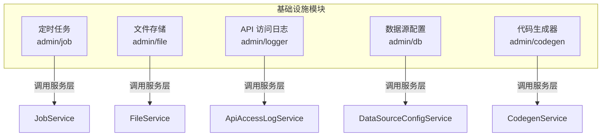
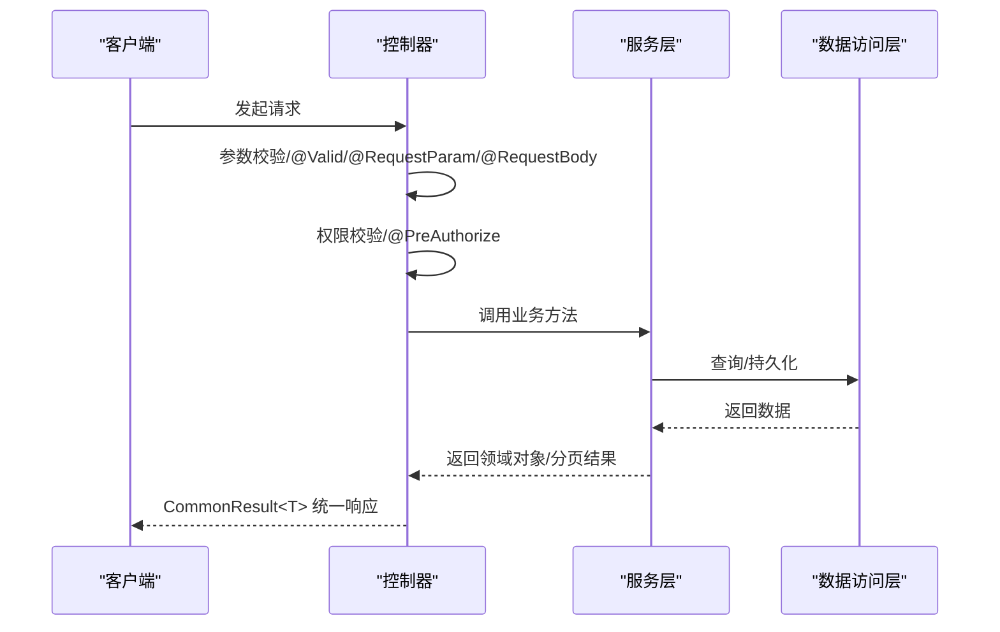
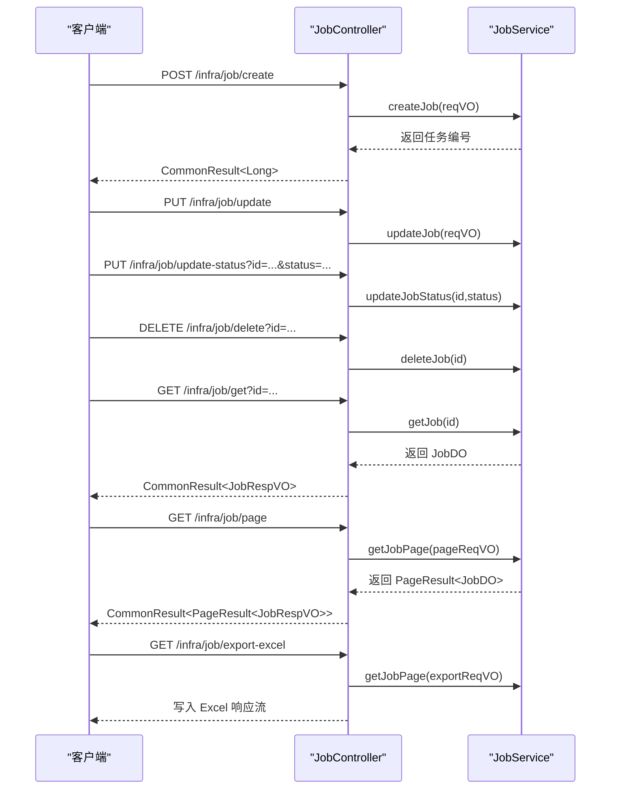
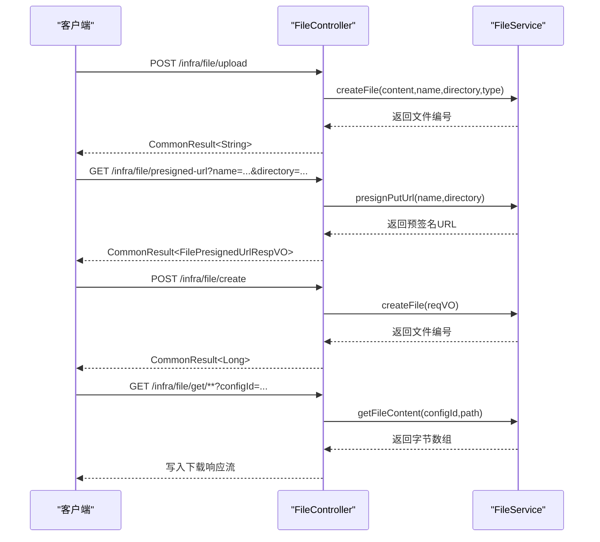
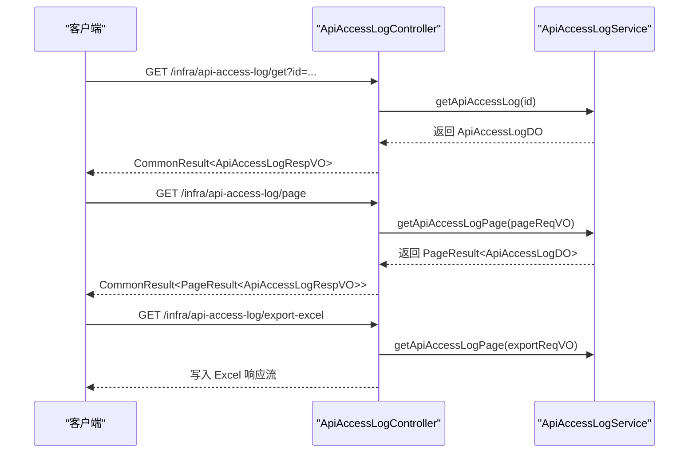
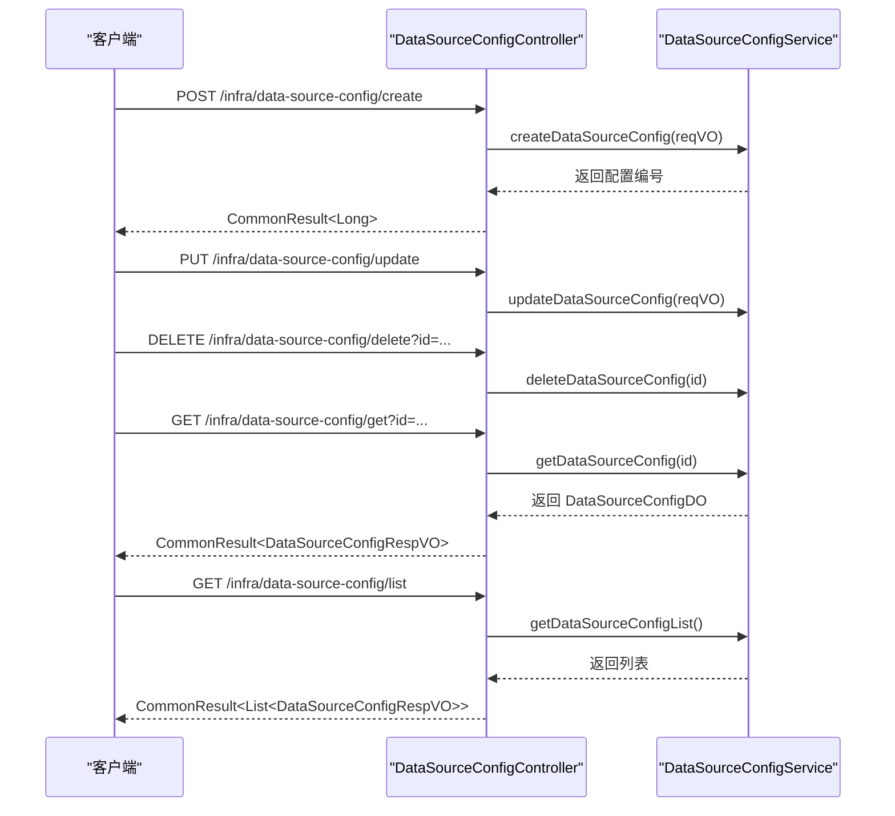
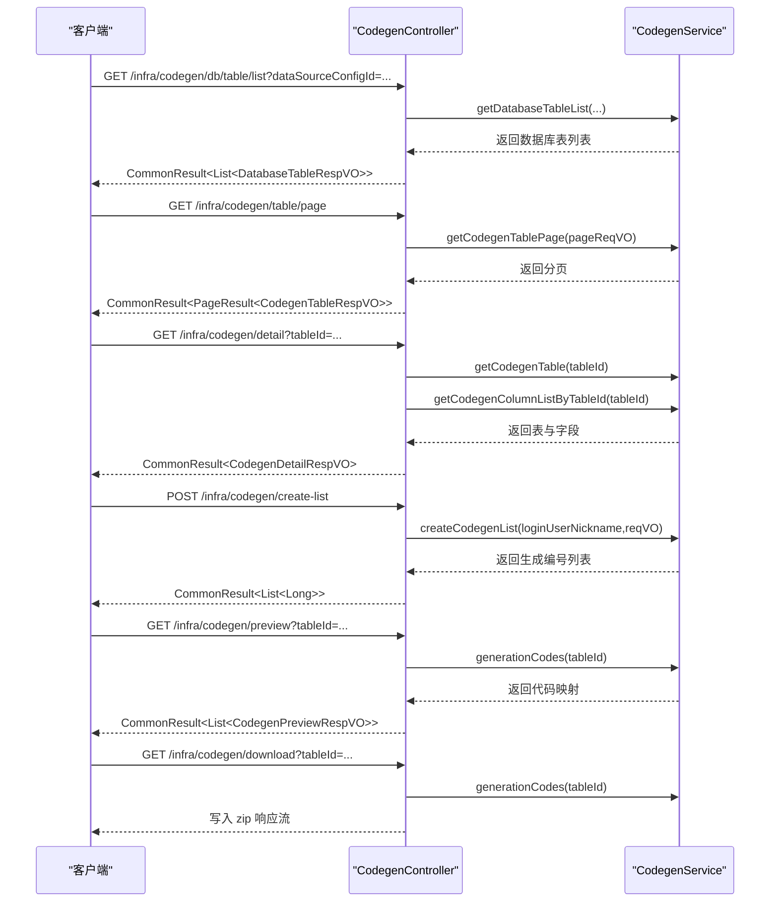
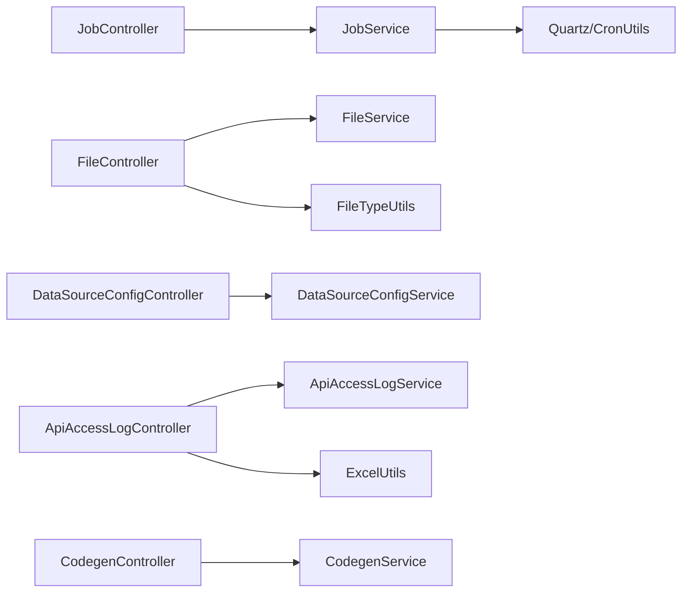

# 基础设施接口

<cite>
**本文引用的文件**
- [JobController.java](file://backend/yudao-module-infra/src/main/java/cn/iocoder/yudao/module/infra/controller/admin/job/JobController.java)
- [FileController.java](file://backend/yudao-module-infra/src/main/java/cn/iocoder/yudao/module/infra/controller/admin/file/FileController.java)
- [ApiAccessLogController.java](file://backend/yudao-module-infra/src/main/java/cn/iocoder/yudao/module/infra/controller/admin/logger/ApiAccessLogController.java)
- [DataSourceConfigController.java](file://backend/yudao-module-infra/src/main/java/cn/iocoder/yudao/module/infra/controller/admin/db/DataSourceConfigController.java)
- [CodegenController.java](file://backend/yudao-module-infra/src/main/java/cn/iocoder/yudao/module/infra/controller/admin/codegen/CodegenController.java)
</cite>

## 目录
1. [简介](#简介)
2. [项目结构](#项目结构)
3. [核心组件](#核心组件)
4. [架构总览](#架构总览)
5. [详细组件分析](#详细组件分析)
6. [依赖分析](#依赖分析)
7. [性能考虑](#性能考虑)
8. [故障排查指南](#故障排查指南)
9. [结论](#结论)
10. [附录](#附录)

## 简介
本文件面向基础设施模块的 RESTful API 接口，覆盖以下能力与接口设计规范：
- 定时任务：创建、更新、停启用、删除、批量删除、立即触发、同步、分页查询、导出、计算下 N 次执行时间
- 文件管理：后端直传、前端直传（预签名）、创建记录、删除、批量删除、下载、分页查询
- API 访问日志：查询单条、分页查询、导出 Excel
- 数据源配置：创建、更新、删除、批量删除、查询单条、查询列表
- 代码生成器：数据库表列表、表定义列表/分页、详情、批量创建、更新、从数据库同步、删除、批量删除、预览、打包下载
- 缓存管理：Redis 缓存操作接口（在本仓库中以通用框架形式存在，具体接口以实际实现为准）

以上接口均采用统一响应体封装，并通过权限注解进行访问控制。

## 项目结构
基础设施模块位于后端工程 yudao-module-infra 下，按功能域划分控制器包：
- 定时任务：admin/job
- 文件存储：admin/file
- 日志：admin/logger
- 数据源配置：admin/db
- 代码生成：admin/codegen

图表来源
- [JobController.java:35-159](file://backend/yudao-module-infra/src/main/java/cn/iocoder/yudao/module/infra/controller/admin/job/JobController.java#L35-L159)
- [FileController.java:36-138](file://backend/yudao-module-infra/src/main/java/cn/iocoder/yudao/module/infra/controller/admin/file/FileController.java#L36-L138)
- [ApiAccessLogController.java:32-72](file://backend/yudao-module-infra/src/main/java/cn/iocoder/yudao/module/infra/controller/admin/logger/ApiAccessLogController.java#L32-L72)
- [DataSourceConfigController.java:22-82](file://backend/yudao-module-infra/src/main/java/cn/iocoder/yudao/module/infra/controller/admin/db/DataSourceConfigController.java#L22-L82)
- [CodegenController.java:40-161](file://backend/yudao-module-infra/src/main/java/cn/iocoder/yudao/module/infra/controller/admin/codegen/CodegenController.java#L40-L161)

章节来源
- [JobController.java:35-159](file://backend/yudao-module-infra/src/main/java/cn/iocoder/yudao/module/infra/controller/admin/job/JobController.java#L35-L159)
- [FileController.java:36-138](file://backend/yudao-module-infra/src/main/java/cn/iocoder/yudao/module/infra/controller/admin/file/FileController.java#L36-L138)
- [ApiAccessLogController.java:32-72](file://backend/yudao-module-infra/src/main/java/cn/iocoder/yudao/module/infra/controller/admin/logger/ApiAccessLogController.java#L32-L72)
- [DataSourceConfigController.java:22-82](file://backend/yudao-module-infra/src/main/java/cn/iocoder/yudao/module/infra/controller/admin/db/DataSourceConfigController.java#L22-L82)
- [CodegenController.java:40-161](file://backend/yudao-module-infra/src/main/java/cn/iocoder/yudao/module/infra/controller/admin/codegen/CodegenController.java#L40-L161)

## 核心组件
- 统一响应体：所有接口返回 CommonResult<T>，包含 code、message、data 字段
- 权限控制：使用 @PreAuthorize 注解结合资源权限字符串进行细粒度授权
- 分页模型：PageResult<T> 支持分页查询
- 导出能力：部分接口支持导出 Excel，使用 ExcelUtils 写入响应流
- 定时任务：基于 Quartz，提供同步、触发、计算下 N 次执行时间等能力
- 文件存储：支持后端直传与前端直传两种模式，直传模式通过预签名 URL 生成
- 日志：API 访问日志记录接口调用信息，支持分页与导出
- 数据源：多数据源配置管理，支持查询与列表
- 代码生成：基于数据库表结构生成前后端代码，支持预览与打包下载

章节来源
- [JobController.java:44-156](file://backend/yudao-module-infra/src/main/java/cn/iocoder/yudao/module/infra/controller/admin/job/JobController.java#L44-L156)
- [FileController.java:46-135](file://backend/yudao-module-infra/src/main/java/cn/iocoder/yudao/module/infra/controller/admin/file/FileController.java#L46-L135)
- [ApiAccessLogController.java:41-69](file://backend/yudao-module-infra/src/main/java/cn/iocoder/yudao/module/infra/controller/admin/logger/ApiAccessLogController.java#L41-L69)
- [DataSourceConfigController.java:31-79](file://backend/yudao-module-infra/src/main/java/cn/iocoder/yudao/module/infra/controller/admin/db/DataSourceConfigController.java#L31-L79)
- [CodegenController.java:49-158](file://backend/yudao-module-infra/src/main/java/cn/iocoder/yudao/module/infra/controller/admin/codegen/CodegenController.java#L49-L158)

## 架构总览
基础设施模块接口遵循“控制器 -> 服务层 -> 数据访问层”的分层架构，控制器负责：
- 参数校验与权限控制
- 调用服务层业务方法
- 统一封装返回结果
- 导出场景写入响应流

图表来源
- [JobController.java:44-156](file://backend/yudao-module-infra/src/main/java/cn/iocoder/yudao/module/infra/controller/admin/job/JobController.java#L44-L156)
- [FileController.java:46-135](file://backend/yudao-module-infra/src/main/java/cn/iocoder/yudao/module/infra/controller/admin/file/FileController.java#L46-L135)
- [ApiAccessLogController.java:41-69](file://backend/yudao-module-infra/src/main/java/cn/iocoder/yudao/module/infra/controller/admin/logger/ApiAccessLogController.java#L41-L69)
- [DataSourceConfigController.java:31-79](file://backend/yudao-module-infra/src/main/java/cn/iocoder/yudao/module/infra/controller/admin/db/DataSourceConfigController.java#L31-L79)
- [CodegenController.java:49-158](file://backend/yudao-module-infra/src/main/java/cn/iocoder/yudao/module/infra/controller/admin/codegen/CodegenController.java#L49-L158)

## 详细组件分析

### 定时任务接口
- 接口前缀：/infra/job
- 主要能力：
  - 创建、更新、停启用、删除、批量删除
  - 立即触发、同步任务
  - 查询单条、分页查询
  - 导出 Excel
  - 计算下 N 次执行时间

图表来源
- [JobController.java:44-156](file://backend/yudao-module-infra/src/main/java/cn/iocoder/yudao/module/infra/controller/admin/job/JobController.java#L44-L156)

章节来源
- [JobController.java:44-156](file://backend/yudao-module-infra/src/main/java/cn/iocoder/yudao/module/infra/controller/admin/job/JobController.java#L44-L156)

### 文件管理接口
- 接口前缀：/infra/file
- 主要能力：
  - 后端直传：上传字节流并保存
  - 前端直传：生成预签名 URL；完成后创建记录
  - 删除、批量删除
  - 下载：根据配置编号与路径下载
  - 查询单条、分页查询

图表来源
- [FileController.java:46-127](file://backend/yudao-module-infra/src/main/java/cn/iocoder/yudao/module/infra/controller/admin/file/FileController.java#L46-L127)

章节来源
- [FileController.java:46-127](file://backend/yudao-module-infra/src/main/java/cn/iocoder/yudao/module/infra/controller/admin/file/FileController.java#L46-L127)

### API 访问日志接口
- 接口前缀：/infra/api-access-log
- 主要能力：
  - 查询单条、分页查询
  - 导出 Excel

图表来源
- [ApiAccessLogController.java:41-69](file://backend/yudao-module-infra/src/main/java/cn/iocoder/yudao/module/infra/controller/admin/logger/ApiAccessLogController.java#L41-L69)

章节来源
- [ApiAccessLogController.java:41-69](file://backend/yudao-module-infra/src/main/java/cn/iocoder/yudao/module/infra/controller/admin/logger/ApiAccessLogController.java#L41-L69)

### 数据源配置接口
- 接口前缀：/infra/data-source-config
- 主要能力：
  - 创建、更新、删除、批量删除
  - 查询单条、查询列表

图表来源
- [DataSourceConfigController.java:31-79](file://backend/yudao-module-infra/src/main/java/cn/iocoder/yudao/module/infra/controller/admin/db/DataSourceConfigController.java#L31-L79)

章节来源
- [DataSourceConfigController.java:31-79](file://backend/yudao-module-infra/src/main/java/cn/iocoder/yudao/module/infra/controller/admin/db/DataSourceConfigController.java#L31-L79)

### 代码生成器接口
- 接口前缀：/infra/codegen
- 主要能力：
  - 数据库表列表、表定义列表/分页、详情
  - 批量创建、更新、从数据库同步、删除、批量删除
  - 预览生成代码、打包下载

图表来源
- [CodegenController.java:49-158](file://backend/yudao-module-infra/src/main/java/cn/iocoder/yudao/module/infra/controller/admin/codegen/CodegenController.java#L49-L158)

章节来源
- [CodegenController.java:49-158](file://backend/yudao-module-infra/src/main/java/cn/iocoder/yudao/module/infra/controller/admin/codegen/CodegenController.java#L49-L158)

### 缓存管理接口
- 说明：缓存管理接口通常由通用框架提供，涵盖键值读写、过期设置、批量删除等基础能力。具体接口以实际实现为准，建议结合项目中的 Redis Starter 使用情况查阅相关控制器或服务层实现。

## 依赖分析
- 控制器依赖服务层接口，服务层依赖数据访问层
- 定时任务依赖 Quartz 工具类进行 Cron 表达式解析与下 N 次执行时间计算
- 文件下载依赖文件类型工具类进行响应头设置与附件输出
- 导出功能依赖 ExcelUtils 将分页结果写入响应流

图表来源
- [JobController.java:9,151-155:9-155](file://backend/yudao-module-infra/src/main/java/cn/iocoder/yudao/module/infra/controller/admin/job/JobController.java#L9-L155)
- [FileController.java:34,120-126:34-126](file://backend/yudao-module-infra/src/main/java/cn/iocoder/yudao/module/infra/controller/admin/file/FileController.java#L34-L126)
- [ApiAccessLogController.java:6,67-68:6-68](file://backend/yudao-module-infra/src/main/java/cn/iocoder/yudao/module/infra/controller/admin/logger/ApiAccessLogController.java#L6-L68)
- [CodegenController.java:38,150-157:38-157](file://backend/yudao-module-infra/src/main/java/cn/iocoder/yudao/module/infra/controller/admin/codegen/CodegenController.java#L38-L157)

章节来源
- [JobController.java:9,151-155:9-155](file://backend/yudao-module-infra/src/main/java/cn/iocoder/yudao/module/infra/controller/admin/job/JobController.java#L9-L155)
- [FileController.java:34,120-126:34-126](file://backend/yudao-module-infra/src/main/java/cn/iocoder/yudao/module/infra/controller/admin/file/FileController.java#L34-L126)
- [ApiAccessLogController.java:6,67-68:6-68](file://backend/yudao-module-infra/src/main/java/cn/iocoder/yudao/module/infra/controller/admin/logger/ApiAccessLogController.java#L6-L68)
- [CodegenController.java:38,150-157:38-157](file://backend/yudao-module-infra/src/main/java/cn/iocoder/yudao/module/infra/controller/admin/codegen/CodegenController.java#L38-L157)

## 性能考虑
- 分页导出：导出接口默认关闭分页大小限制，建议在大数据量场景下谨慎使用，必要时增加筛选条件或限制导出范围
- 文件下载：下载接口直接写入响应流，避免内存驻留大对象；前端直传模式可降低后端带宽压力
- 定时任务：下 N 次执行时间计算依赖 CronUtils，表达式复杂度越高，计算耗时越长；建议在管理端展示时限制 count 数量
- 代码生成：预览与下载涉及压缩打包，建议在低频场景使用，避免频繁触发

## 故障排查指南
- 权限不足：接口均带有 @PreAuthorize 注解，若返回无权限，请确认登录用户是否具备对应资源权限字符串
- 文件下载 404：当路径无效或文件不存在时，下载接口会返回 404；请检查 configId 与路径编码
- 导出异常：导出接口依赖 ExcelUtils，若浏览器无法打开文件，请检查导出参数与浏览器兼容性
- 定时任务异常：创建/更新/触发/同步可能抛出调度异常，需检查 Cron 表达式与任务实现

章节来源
- [FileController.java:121-126](file://backend/yudao-module-infra/src/main/java/cn/iocoder/yudao/module/infra/controller/admin/file/FileController.java#L121-L126)
- [ApiAccessLogController.java:61-68](file://backend/yudao-module-infra/src/main/java/cn/iocoder/yudao/module/infra/controller/admin/logger/ApiAccessLogController.java#L61-L68)
- [JobController.java:48-50,69-71,98-100,106-108:48-50](file://backend/yudao-module-infra/src/main/java/cn/iocoder/yudao/module/infra/controller/admin/job/JobController.java#L48-L50)

## 结论
基础设施模块的 RESTful 接口围绕“定时任务、文件管理、日志、配置、代码生成”五大能力域构建，采用统一响应体与权限控制，满足后台管理场景下的高可用与易维护需求。建议在生产环境中结合权限体系与审计日志完善安全策略，并对高频导出与生成操作进行容量评估与限流控制。

## 附录
- 统一响应体字段
  - code：状态码
  - message：提示信息
  - data：业务数据
- 常用权限字符串
  - 定时任务：infra:job:create, infra:job:update, infra:job:delete, infra:job:query, infra:job:export, infra:job:trigger
  - 文件存储：infra:file:query, infra:file:delete
  - API 访问日志：infra:api-access-log:query, infra:api-access-log:export
  - 数据源配置：infra:data-source-config:create, infra:data-source-config:update, infra:data-source-config:delete, infra:data-source-config:query
  - 代码生成器：infra:codegen:create, infra:codegen:update, infra:codegen:delete, infra:codegen:query, infra:codegen:preview, infra:codegen:download