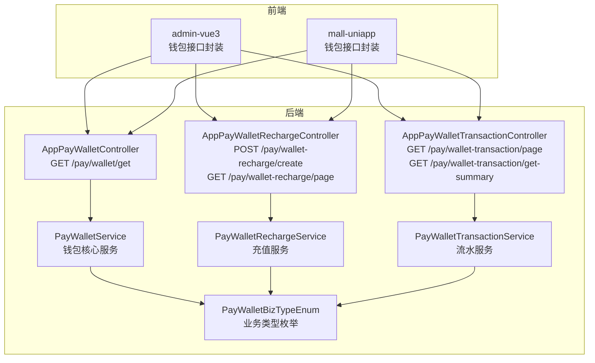
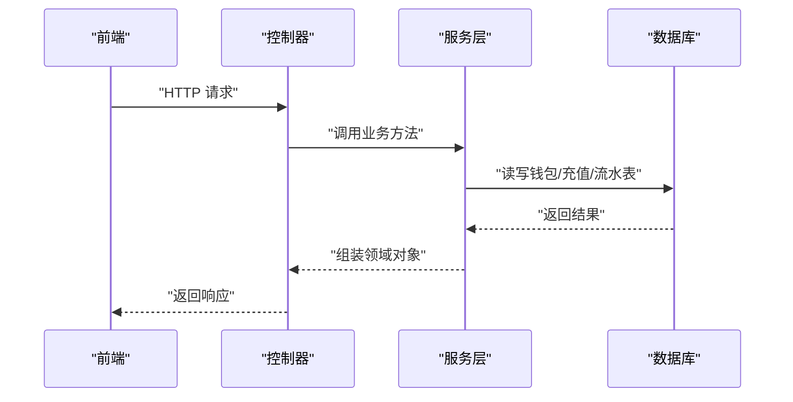
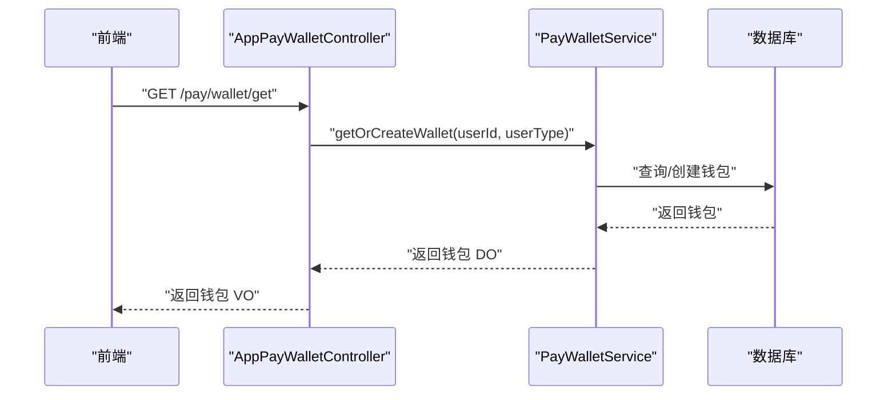
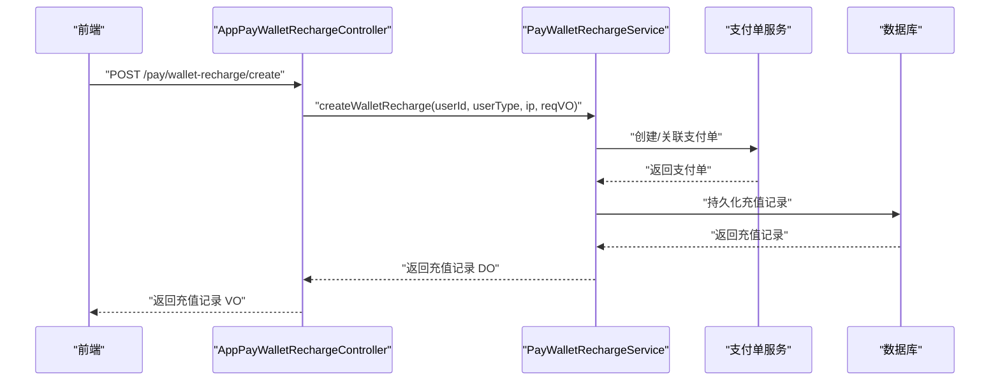
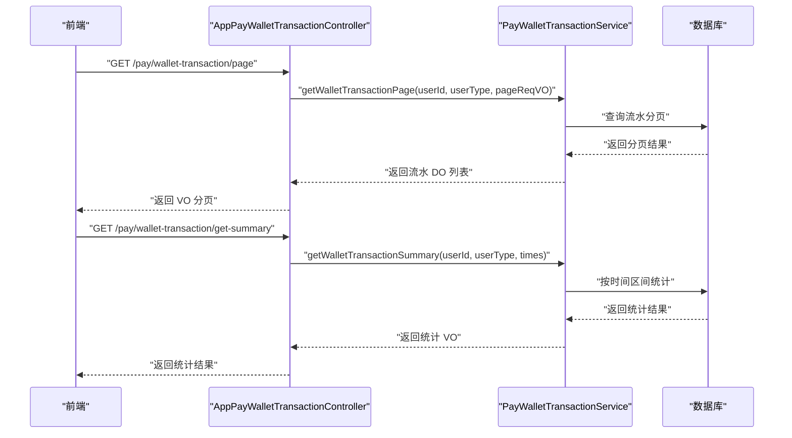
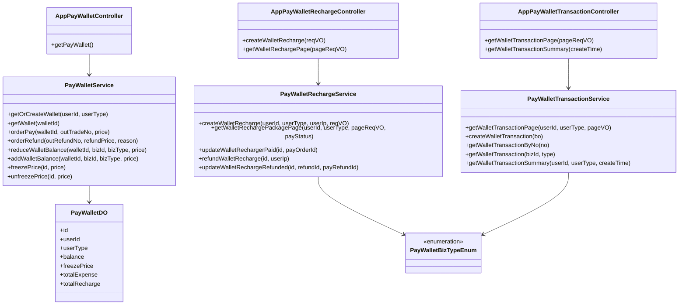

# 支付钱包接口

<cite>
**本文引用的文件**
- [AppPayWalletController.java](file://backend/yudao-module-pay/src/main/java/cn/iocoder/yudao/module/pay/controller/app/wallet/AppPayWalletController.java)
- [PayWalletService.java](file://backend/yudao-module-pay/src/main/java/cn/iocoder/yudao/module/pay/service/wallet/PayWalletService.java)
- [PayWalletDO.java](file://backend/yudao-module-pay/src/main/java/cn/iocoder/yudao/module/pay/dal/dataobject/wallet/PayWalletDO.java)
- [AppPayWalletRechargeController.java](file://backend/yudao-module-pay/src/main/java/cn/iocoder/yudao/module/pay/controller/app/wallet/AppPayWalletRechargeController.java)
- [PayWalletRechargeService.java](file://backend/yudao-module-pay/src/main/java/cn/iocoder/yudao/module/pay/service/wallet/PayWalletRechargeService.java)
- [AppPayWalletTransactionController.java](file://backend/yudao-module-pay/src/main/java/cn/iocoder/yudao/module/pay/controller/app/wallet/AppPayWalletTransactionController.java)
- [PayWalletTransactionService.java](file://backend/yudao-module-pay/src/main/java/cn/iocoder/yudao/module/pay/service/wallet/PayWalletTransactionService.java)
- [PayWalletBizTypeEnum.java](file://backend/yudao-module-pay/src/main/java/cn/iocoder/yudao/module/pay/enums/wallet/PayWalletBizTypeEnum.java)
- [前端钱包接口封装（admin-vue3）](file://frontend/admin-vue3/src/api/pay/wallet/balance/index.ts)
- [前端钱包接口封装（mall-uniapp）](file://frontend/mall-uniapp/sheep/api/pay/wallet.js)
</cite>

## 目录
1. [简介](#简介)
2. [项目结构](#项目结构)
3. [核心组件](#核心组件)
4. [架构总览](#架构总览)
5. [详细组件分析](#详细组件分析)
6. [依赖分析](#依赖分析)
7. [性能考虑](#性能考虑)
8. [故障排查指南](#故障排查指南)
9. [结论](#结论)
10. [附录](#附录)

## 简介
本文件为支付钱包系统的 RESTful API 接口设计与使用文档，覆盖钱包余额管理、充值、提现、转账、财务对账等核心功能。文档从接口定义、参数校验、安全认证、金额与手续费、状态流转、错误处理等方面进行系统化说明，并提供调用示例路径与最佳实践建议。

## 项目结构
钱包相关能力由后端支付模块提供，前端通过统一的 HTTP 客户端封装调用。核心结构如下：
- 后端模块：yudao-module-pay 提供钱包、充值、交易流水、转账等服务
- 前端模块：admin-vue3 与 mall-uniapp 提供钱包接口封装与调用

图表来源
- [AppPayWalletController.java:35-40](file://backend/yudao-module-pay/src/main/java/cn/iocoder/yudao/module/pay/controller/app/wallet/AppPayWalletController.java#L35-L40)
- [PayWalletService.java:14-99](file://backend/yudao-module-pay/src/main/java/cn/iocoder/yudao/module/pay/service/wallet/PayWalletService.java#L14-L99)
- [AppPayWalletRechargeController.java:49-70](file://backend/yudao-module-pay/src/main/java/cn/iocoder/yudao/module/pay/controller/app/wallet/AppPayWalletRechargeController.java#L49-L70)
- [PayWalletRechargeService.java:13-64](file://backend/yudao-module-pay/src/main/java/cn/iocoder/yudao/module/pay/service/wallet/PayWalletRechargeService.java#L13-L64)
- [AppPayWalletTransactionController.java:42-59](file://backend/yudao-module-pay/src/main/java/cn/iocoder/yudao/module/pay/controller/app/wallet/AppPayWalletTransactionController.java#L42-L59)
- [PayWalletTransactionService.java:20-74](file://backend/yudao-module-pay/src/main/java/cn/iocoder/yudao/module/pay/service/wallet/PayWalletTransactionService.java#L20-L74)
- [PayWalletBizTypeEnum.java:14-45](file://backend/yudao-module-pay/src/main/java/cn/iocoder/yudao/module/pay/enums/wallet/PayWalletBizTypeEnum.java#L14-L45)

章节来源
- [AppPayWalletController.java:1-43](file://backend/yudao-module-pay/src/main/java/cn/iocoder/yudao/module/pay/controller/app/wallet/AppPayWalletController.java#L1-L43)
- [AppPayWalletRechargeController.java:1-73](file://backend/yudao-module-pay/src/main/java/cn/iocoder/yudao/module/pay/controller/app/wallet/AppPayWalletRechargeController.java#L1-L73)
- [AppPayWalletTransactionController.java:1-62](file://backend/yudao-module-pay/src/main/java/cn/iocoder/yudao/module/pay/controller/app/wallet/AppPayWalletTransactionController.java#L1-L62)

## 核心组件
- 钱包控制器：提供钱包查询接口
- 充值控制器：提供充值创建与分页查询接口
- 交易流水控制器：提供流水分页与统计接口
- 服务层：封装钱包余额变动、充值、退款、流水创建等业务
- 数据对象：钱包实体，包含余额、冻结金额、累计收支等字段
- 业务类型枚举：定义充值、充值退款、支付、支付退款、余额调整、转账等业务类型

章节来源
- [PayWalletService.java:14-99](file://backend/yudao-module-pay/src/main/java/cn/iocoder/yudao/module/pay/service/wallet/PayWalletService.java#L14-L99)
- [PayWalletDO.java:15-59](file://backend/yudao-module-pay/src/main/java/cn/iocoder/yudao/module/pay/dal/dataobject/wallet/PayWalletDO.java#L15-L59)
- [PayWalletBizTypeEnum.java:14-45](file://backend/yudao-module-pay/src/main/java/cn/iocoder/yudao/module/pay/enums/wallet/PayWalletBizTypeEnum.java#L14-L45)

## 架构总览
钱包系统采用“控制器-服务-数据对象”分层架构，前端通过 HTTP 客户端调用后端接口；后端通过服务层协调钱包、充值、流水等模块完成业务处理。

图表来源
- [AppPayWalletController.java:35-40](file://backend/yudao-module-pay/src/main/java/cn/iocoder/yudao/module/pay/controller/app/wallet/AppPayWalletController.java#L35-L40)
- [AppPayWalletRechargeController.java:49-70](file://backend/yudao-module-pay/src/main/java/cn/iocoder/yudao/module/pay/controller/app/wallet/AppPayWalletRechargeController.java#L49-L70)
- [AppPayWalletTransactionController.java:42-59](file://backend/yudao-module-pay/src/main/java/cn/iocoder/yudao/module/pay/controller/app/wallet/AppPayWalletTransactionController.java#L42-L59)

## 详细组件分析

### 钱包账户查询接口
- 接口路径：GET /pay/wallet/get
- 功能：获取当前登录用户的钱包信息；若不存在则自动创建
- 认证：基于登录态（后端通过上下文获取登录用户 ID）
- 返回：钱包对象（包含余额、冻结金额、累计收支等）

图表来源
- [AppPayWalletController.java:35-40](file://backend/yudao-module-pay/src/main/java/cn/iocoder/yudao/module/pay/controller/app/wallet/AppPayWalletController.java#L35-L40)
- [PayWalletService.java:24-31](file://backend/yudao-module-pay/src/main/java/cn/iocoder/yudao/module/pay/service/wallet/PayWalletService.java#L24-L31)

章节来源
- [AppPayWalletController.java:35-40](file://backend/yudao-module-pay/src/main/java/cn/iocoder/yudao/module/pay/controller/app/wallet/AppPayWalletController.java#L35-L40)
- [PayWalletService.java:14-39](file://backend/yudao-module-pay/src/main/java/cn/iocoder/yudao/module/pay/service/wallet/PayWalletService.java#L14-L39)
- [PayWalletDO.java:15-59](file://backend/yudao-module-pay/src/main/java/cn/iocoder/yudao/module/pay/dal/dataobject/wallet/PayWalletDO.java#L15-L59)

### 余额充值接口
- 接口路径：POST /pay/wallet-recharge/create
- 功能：创建钱包充值记录（发起充值），生成充值单并绑定支付单
- 输入：充值金额、充值套餐等（具体字段以请求 VO 为准）
- 输出：充值记录对象（含支付单号等）
- 分页查询：GET /pay/wallet-recharge/page（返回充值记录分页，并拼接对应的支付单信息）

图表来源
- [AppPayWalletRechargeController.java:49-56](file://backend/yudao-module-pay/src/main/java/cn/iocoder/yudao/module/pay/controller/app/wallet/AppPayWalletRechargeController.java#L49-L56)
- [PayWalletRechargeService.java:24-25](file://backend/yudao-module-pay/src/main/java/cn/iocoder/yudao/module/pay/service/wallet/PayWalletRechargeService.java#L24-L25)

章节来源
- [AppPayWalletRechargeController.java:49-70](file://backend/yudao-module-pay/src/main/java/cn/iocoder/yudao/module/pay/controller/app/wallet/AppPayWalletRechargeController.java#L49-L70)
- [PayWalletRechargeService.java:13-64](file://backend/yudao-module-pay/src/main/java/cn/iocoder/yudao/module/pay/service/wallet/PayWalletRechargeService.java#L13-L64)

### 提现申请接口
- 当前仓库未提供“提现申请”的后端接口实现
- 前端存在相关封装（如 mall-uniapp 中的提现相关接口），但后端控制器与服务尚未在已读取文件中体现
- 建议：如需对接，请补充后端控制器与服务层实现，并遵循现有充值/流水的模式

章节来源
- [前端钱包接口封装（mall-uniapp）:1-49](file://frontend/mall-uniapp/sheep/api/pay/wallet.js#L1-L49)

### 提现审核接口
- 当前仓库未提供“提现审核”的后端接口实现
- 建议：如需对接，请新增控制器与服务层，支持审核状态变更与资金冻结/解冻流程

章节来源
- [前端钱包接口封装（mall-uniapp）:1-49](file://frontend/mall-uniapp/sheep/api/pay/wallet.js#L1-L49)

### 转账记录查询接口
- 当前仓库未提供“转账记录查询”的后端接口实现
- 业务类型枚举中包含转账类型，可用于后续扩展
- 建议：新增控制器与服务层，支持转账流水查询与统计

章节来源
- [PayWalletBizTypeEnum.java:14-45](file://backend/yudao-module-pay/src/main/java/cn/iocoder/yudao/module/pay/enums/wallet/PayWalletBizTypeEnum.java#L14-L45)

### 财务对账接口
- 当前仓库未提供“财务对账”的后端接口实现
- 可基于交易流水分页与统计接口进行二次开发，按时间范围聚合收入/支出
- 建议：新增控制器与服务层，支持按日期区间导出或查询汇总

章节来源
- [AppPayWalletTransactionController.java:51-59](file://backend/yudao-module-pay/src/main/java/cn/iocoder/yudao/module/pay/controller/app/wallet/AppPayWalletTransactionController.java#L51-L59)
- [PayWalletTransactionService.java:71-72](file://backend/yudao-module-pay/src/main/java/cn/iocoder/yudao/module/pay/service/wallet/PayWalletTransactionService.java#L71-L72)

### 钱包余额明细与统计
- 流水分页：GET /pay/wallet-transaction/page
- 流水统计：GET /pay/wallet-transaction/get-summary（按时间区间统计）
- 统计维度：可按业务类型、时间范围聚合

图表来源
- [AppPayWalletTransactionController.java:42-59](file://backend/yudao-module-pay/src/main/java/cn/iocoder/yudao/module/pay/controller/app/wallet/AppPayWalletTransactionController.java#L42-L59)
- [PayWalletTransactionService.java:29-72](file://backend/yudao-module-pay/src/main/java/cn/iocoder/yudao/module/pay/service/wallet/PayWalletTransactionService.java#L29-L72)

章节来源
- [AppPayWalletTransactionController.java:1-62](file://backend/yudao-module-pay/src/main/java/cn/iocoder/yudao/module/pay/controller/app/wallet/AppPayWalletTransactionController.java#L1-L62)
- [PayWalletTransactionService.java:1-75](file://backend/yudao-module-pay/src/main/java/cn/iocoder/yudao/module/pay/service/wallet/PayWalletTransactionService.java#L1-L75)

## 依赖分析
- 控制器依赖服务层，服务层依赖数据对象与枚举
- 前端通过统一 HTTP 客户端调用后端接口
- 充值流程涉及支付单服务的协作

图表来源
- [AppPayWalletController.java:32-33](file://backend/yudao-module-pay/src/main/java/cn/iocoder/yudao/module/pay/controller/app/wallet/AppPayWalletController.java#L32-L33)
- [PayWalletService.java:14-99](file://backend/yudao-module-pay/src/main/java/cn/iocoder/yudao/module/pay/service/wallet/PayWalletService.java#L14-L99)
- [PayWalletDO.java:15-59](file://backend/yudao-module-pay/src/main/java/cn/iocoder/yudao/module/pay/dal/dataobject/wallet/PayWalletDO.java#L15-L59)
- [AppPayWalletRechargeController.java:44-47](file://backend/yudao-module-pay/src/main/java/cn/iocoder/yudao/module/pay/controller/app/wallet/AppPayWalletRechargeController.java#L44-L47)
- [PayWalletRechargeService.java:13-64](file://backend/yudao-module-pay/src/main/java/cn/iocoder/yudao/module/pay/service/wallet/PayWalletRechargeService.java#L13-L64)
- [AppPayWalletTransactionController.java:39-40](file://backend/yudao-module-pay/src/main/java/cn/iocoder/yudao/module/pay/controller/app/wallet/AppPayWalletTransactionController.java#L39-L40)
- [PayWalletTransactionService.java:20-74](file://backend/yudao-module-pay/src/main/java/cn/iocoder/yudao/module/pay/service/wallet/PayWalletTransactionService.java#L20-L74)
- [PayWalletBizTypeEnum.java:14-45](file://backend/yudao-module-pay/src/main/java/cn/iocoder/yudao/module/pay/enums/wallet/PayWalletBizTypeEnum.java#L14-L45)

## 性能考虑
- 分页查询：优先使用分页参数，避免一次性加载大量数据
- 缓存策略：对高频查询的钱包余额可引入缓存，降低数据库压力
- 并发控制：余额变动需保证原子性与一致性，必要时使用数据库锁或分布式锁
- 日志与监控：对关键操作（充值、支付、退款、冻结/解冻）记录审计日志，便于对账与排障

## 故障排查指南
- 认证失败：确认前端是否携带登录态，后端是否正确解析登录用户信息
- 参数校验失败：检查请求体与分页参数是否符合 VO 定义
- 余额不足：在支付/扣减场景，需判断钱包余额与冻结金额是否满足条件
- 重复提交：对充值/退款等幂操作，需通过幂等键或业务单号去重
- 对账不平：核对流水类型、时间范围与金额单位（分），确保统计口径一致

## 结论
本钱包系统提供了钱包查询、充值、交易流水查询与统计的基础能力，提现、转账与财务对账等功能可在现有架构基础上扩展。建议在新增功能时复用现有的控制器-服务-数据对象分层设计，保持接口风格一致与业务逻辑清晰。

## 附录

### 接口调用示例（示例路径）
- 钱包查询
  - [GET /pay/wallet/get:35-40](file://backend/yudao-module-pay/src/main/java/cn/iocoder/yudao/module/pay/controller/app/wallet/AppPayWalletController.java#L35-L40)
  - 前端封装参考：
    - [admin-vue3 封装:19-22](file://frontend/admin-vue3/src/api/pay/wallet/balance/index.ts#L19-L22)
    - [mall-uniapp 封装:5-14](file://frontend/mall-uniapp/sheep/api/pay/wallet.js#L5-L14)
- 充值
  - [POST /pay/wallet-recharge/create:49-56](file://backend/yudao-module-pay/src/main/java/cn/iocoder/yudao/module/pay/controller/app/wallet/AppPayWalletRechargeController.java#L49-L56)
  - [GET /pay/wallet-recharge/page:58-70](file://backend/yudao-module-pay/src/main/java/cn/iocoder/yudao/module/pay/controller/app/wallet/AppPayWalletRechargeController.java#L58-L70)
  - 前端封装参考：
    - [mall-uniapp 封装:46-49](file://frontend/mall-uniapp/sheep/api/pay/wallet.js#L46-L49)
- 交易流水
  - [GET /pay/wallet-transaction/page:42-49](file://backend/yudao-module-pay/src/main/java/cn/iocoder/yudao/module/pay/controller/app/wallet/AppPayWalletTransactionController.java#L42-L49)
  - [GET /pay/wallet-transaction/get-summary:51-59](file://backend/yudao-module-pay/src/main/java/cn/iocoder/yudao/module/pay/controller/app/wallet/AppPayWalletTransactionController.java#L51-L59)
  - 前端封装参考：
    - [mall-uniapp 封装:15-33](file://frontend/mall-uniapp/sheep/api/pay/wallet.js#L15-L33)

### 参数与校验规则
- 登录态：后端通过上下文获取登录用户 ID 与用户类型
- 分页参数：PageParam（页码、每页大小）
- 时间参数：按指定格式传入时间数组（用于统计）
- 金额单位：统一为“分”，避免小数精度问题

### 安全与风控
- 认证：接口依赖登录态，禁止匿名访问
- 权限：根据用户类型区分会员/管理员权限
- 风控：对异常 IP、频繁请求、超大金额等行为进行拦截与告警

### 金额限制与手续费
- 金额限制：建议在服务层增加最小/最大金额校验
- 手续费：如需手续费，可在充值/转账场景中引入费率配置与计算逻辑

### 状态流转（示例）
- 充值：创建 -> 支付中 -> 已支付 -> 余额入账
- 提现：申请 -> 审核中 -> 审核通过 -> 打款中 -> 已打款/失败
- 转账：发起 -> 成功/失败 -> 产生转账流水