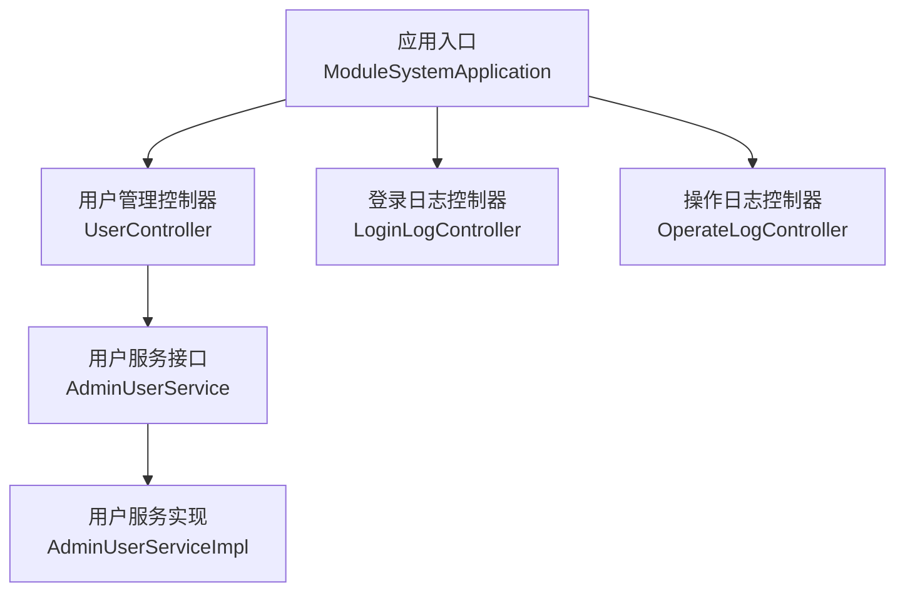
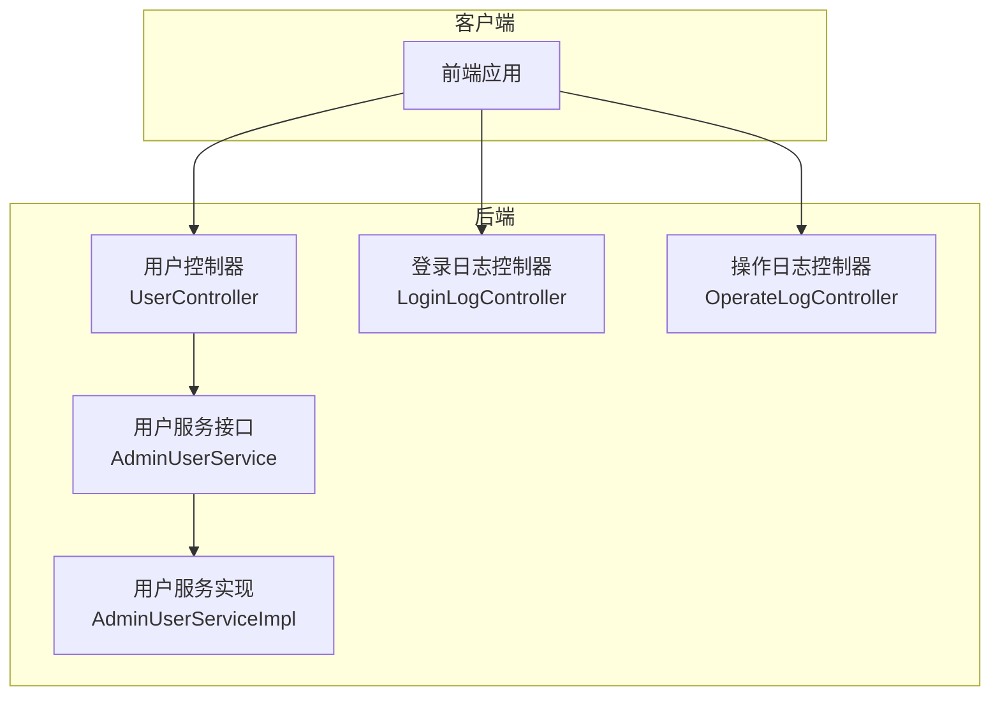
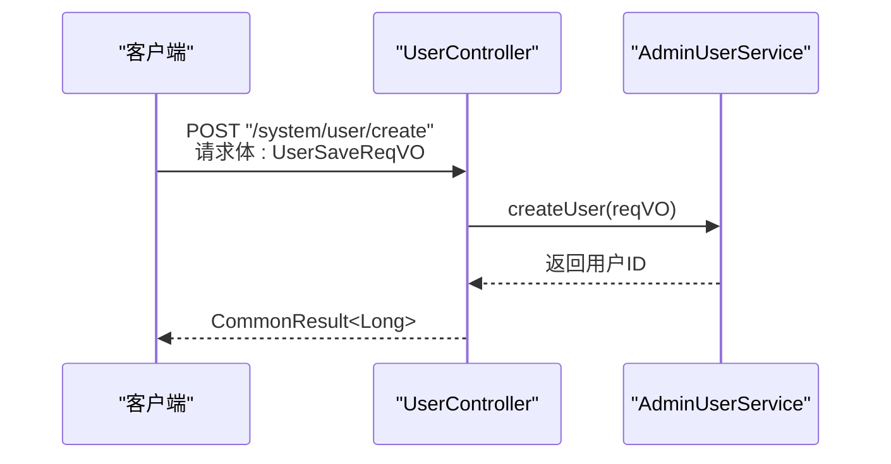
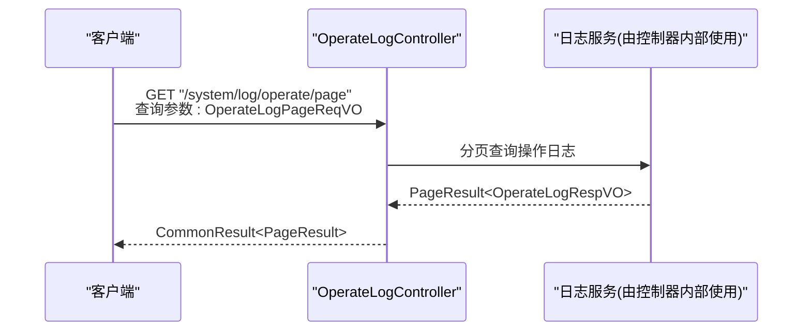
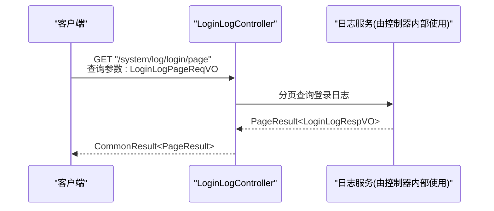
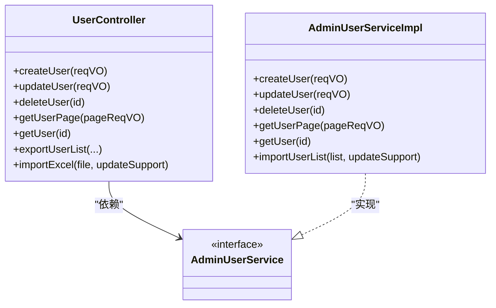

# 系统管理接口

<cite>
**本文引用的文件**
- [ModuleSystemApplication.java](file://backend/yudao-module-system/src/main/java/cn/iocoder/yudao/ModuleSystemApplication.java)
- [UserController.java](file://backend/yudao-module-system/src/main/java/cn/iocoder/yudao/module/system/controller/admin/user/UserController.java)
- [UserSaveReqVO.java](file://backend/yudao-module-system/src/main/java/cn/iocoder/yudao/module/system/controller/admin/user/vo/user/UserSaveReqVO.java)
- [LoginLogController.java](file://backend/yudao-module-system/src/main/java/cn/iocoder/yudao/module/system/controller/admin/logger/LoginLogController.java)
- [OperateLogController.java](file://backend/yudao-module-system/src/main/java/cn/iocoder/yudao/module/system/controller/admin/logger/OperateLogController.java)
- [LoginLogPageReqVO.java](file://backend/yudao-module-system/src/main/java/cn/iocoder/yudao/module/system/controller/admin/logger/vo/loginlog/LoginLogPageReqVO.java)
- [OperateLogPageReqVO.java](file://backend/yudao-module-system/src/main/java/cn/iocoder/yudao/module/system/controller/admin/logger/vo/operatelog/OperateLogPageReqVO.java)
- [AdminUserService.java](file://backend/yudao-module-system/src/main/java/cn/iocoder/yudao/module/system/service/user/AdminUserService.java)
- [AdminUserServiceImpl.java](file://backend/yudao-module-system/src/main/java/cn/iocoder/yudao/module/system/service/user/AdminUserServiceImpl.java)
</cite>

## 目录
1. [简介](#简介)
2. [项目结构](#项目结构)
3. [核心组件](#核心组件)
4. [架构总览](#架构总览)
5. [详细组件分析](#详细组件分析)
6. [依赖关系分析](#依赖关系分析)
7. [性能考虑](#性能考虑)
8. [故障排查指南](#故障排查指南)
9. [结论](#结论)
10. [附录](#附录)

## 简介
本文件面向系统管理模块的 RESTful API 接口，聚焦以下功能域：用户管理、角色权限、菜单管理、部门管理、字典管理、通知公告、操作日志与登录日志等。文档在不直接展示代码内容的前提下，通过“章节来源”与“图表来源”定位到具体实现文件，帮助开发者与测试人员快速理解接口设计、权限控制、数据权限与审计机制，并提供可复用的调用示例与最佳实践。

## 项目结构
系统管理模块位于后端工程中，入口应用类负责启动模块。用户管理相关控制器与服务层位于系统模块内，提供用户增删改查、状态变更、密码重置、导入导出、分页查询等能力；日志模块提供登录日志与操作日志的查询接口。

**图表来源**
- [ModuleSystemApplication.java:1-15](file://backend/yudao-module-system/src/main/java/cn/iocoder/yudao/ModuleSystemApplication.java#L1-L15)
- [UserController.java:1-182](file://backend/yudao-module-system/src/main/java/cn/iocoder/yudao/module/system/controller/admin/user/UserController.java#L1-L182)
- [AdminUserService.java](file://backend/yudao-module-system/src/main/java/cn/iocoder/yudao/module/system/service/user/AdminUserService.java)
- [AdminUserServiceImpl.java](file://backend/yudao-module-system/src/main/java/cn/iocoder/yudao/module/system/service/user/AdminUserServiceImpl.java)
- [LoginLogController.java](file://backend/yudao-module-system/src/main/java/cn/iocoder/yudao/module/system/controller/admin/logger/LoginLogController.java)
- [OperateLogController.java](file://backend/yudao-module-system/src/main/java/cn/iocoder/yudao/module/system/controller/admin/logger/OperateLogController.java)

**章节来源**
- [ModuleSystemApplication.java:1-15](file://backend/yudao-module-system/src/main/java/cn/iocoder/yudao/ModuleSystemApplication.java#L1-L15)

## 核心组件
- 应用入口：负责扫描并启动系统管理模块。
- 用户管理控制器：提供用户 CRUD、状态变更、密码重置、分页查询、导入导出、简单列表等接口。
- 日志控制器：提供登录日志与操作日志的分页查询接口。
- 用户服务：抽象用户业务逻辑，供控制器调用。

**章节来源**
- [UserController.java:1-182](file://backend/yudao-module-system/src/main/java/cn/iocoder/yudao/module/system/controller/admin/user/UserController.java#L1-L182)
- [AdminUserService.java](file://backend/yudao-module-system/src/main/java/cn/iocoder/yudao/module/system/service/user/AdminUserService.java)
- [AdminUserServiceImpl.java](file://backend/yudao-module-system/src/main/java/cn/iocoder/yudao/module/system/service/user/AdminUserServiceImpl.java)
- [LoginLogController.java](file://backend/yudao-module-system/src/main/java/cn/iocoder/yudao/module/system/controller/admin/logger/LoginLogController.java)
- [OperateLogController.java](file://backend/yudao-module-system/src/main/java/cn/iocoder/yudao/module/system/controller/admin/logger/OperateLogController.java)

## 架构总览
系统采用前后端分离架构，后端以 Spring Boot 提供 RESTful API，使用权限注解进行访问控制，结合操作日志与登录日志实现审计与追踪。

**图表来源**
- [UserController.java:1-182](file://backend/yudao-module-system/src/main/java/cn/iocoder/yudao/module/system/controller/admin/user/UserController.java#L1-L182)
- [LoginLogController.java](file://backend/yudao-module-system/src/main/java/cn/iocoder/yudao/module/system/controller/admin/logger/LoginLogController.java)
- [OperateLogController.java](file://backend/yudao-module-system/src/main/java/cn/iocoder/yudao/module/system/controller/admin/logger/OperateLogController.java)
- [AdminUserService.java](file://backend/yudao-module-system/src/main/java/cn/iocoder/yudao/module/system/service/user/AdminUserService.java)
- [AdminUserServiceImpl.java](file://backend/yudao-module-system/src/main/java/cn/iocoder/yudao/module/system/service/user/AdminUserServiceImpl.java)

## 详细组件分析

### 用户管理接口
- 接口范围：新增、修改、删除、批量删除、重置密码、修改状态、分页查询、详情查询、导出、导入模板、导入。
- 权限控制：基于注解进行授权，如“system:user:create/update/delete/query/export/import”等。
- 数据模型：请求参数对象包含用户基本信息、部门编号、岗位集合、联系方式、性别等；响应对象包含用户详情与部门信息拼接。
- 导入导出：支持 Excel 导入模板下载与批量导入，导出支持全量导出。

**图表来源**
- [UserController.java:49-55](file://backend/yudao-module-system/src/main/java/cn/iocoder/yudao/module/system/controller/admin/user/UserController.java#L49-L55)
- [UserSaveReqVO.java:1-81](file://backend/yudao-module-system/src/main/java/cn/iocoder/yudao/module/system/controller/admin/user/vo/user/UserSaveReqVO.java#L1-L81)
- [AdminUserService.java](file://backend/yudao-module-system/src/main/java/cn/iocoder/yudao/module/system/service/user/AdminUserService.java)

**章节来源**
- [UserController.java:49-182](file://backend/yudao-module-system/src/main/java/cn/iocoder/yudao/module/system/controller/admin/user/UserController.java#L49-L182)
- [UserSaveReqVO.java:17-81](file://backend/yudao-module-system/src/main/java/cn/iocoder/yudao/module/system/controller/admin/user/vo/user/UserSaveReqVO.java#L17-L81)

### 角色权限接口
- 设计要点：角色与权限的分配通常通过独立的控制器与服务实现，涉及角色 CRUD、权限赋予/回收、角色与用户的关联等。
- 权限控制：角色管理与权限分配接口需严格限制在管理员范围内，建议使用“system:role:*”或“system:permission:*”等细粒度权限。
- 数据权限：角色维度可结合部门/租户维度进行数据范围控制，确保用户只能操作授权范围内的数据。
- 审计与追踪：对角色与权限变更进行操作日志记录，便于审计。

[本节为概念性说明，不直接分析具体文件，故无“章节来源”]

### 菜单管理接口
- 设计要点：菜单树形结构接口用于构建前端导航，需返回层级关系清晰的菜单树，支持展开/折叠与权限过滤。
- 权限控制：菜单接口应结合当前用户权限进行过滤，避免越权访问。
- 数据权限：菜单树可按部门/租户维度进行裁剪，确保用户仅看到其可访问的菜单节点。
- 审计与追踪：菜单结构变更与权限映射变更需纳入操作日志。

[本节为概念性说明，不直接分析具体文件，故无“章节来源”]

### 部门管理接口
- 设计要点：部门层级管理接口支持树形结构查询、新增/修改/删除部门、移动部门等操作。
- 权限控制：部门管理接口建议使用“system:dept:*”权限，限制在具备部门管理权限的用户范围内。
- 数据权限：部门树可按用户所属部门进行裁剪，防止跨部门数据访问。
- 审计与追踪：部门新增/删除/移动等关键操作需记录操作日志。

[本节为概念性说明，不直接分析具体文件，故无“章节来源”]

### 字典管理接口
- 设计要点：字典数据查询接口支持按类型查询字典项列表，常用于前端下拉框与标签渲染。
- 权限控制：字典管理接口建议使用“system:dict:*”权限，确保只有授权用户可维护字典。
- 数据权限：字典数据通常无需复杂的数据权限控制，但需注意敏感字典项的可见性。
- 审计与追踪：字典项的增删改需记录操作日志。

[本节为概念性说明，不直接分析具体文件，故无“章节来源”]

### 通知公告接口
- 设计要点：通知公告发布接口支持新增/修改/删除/分页查询，常用于系统公告、消息推送等场景。
- 权限控制：建议使用“system:notice:*”权限，限制在具备公告发布权限的用户范围内。
- 数据权限：公告可按部门/角色/租户维度进行可见性控制。
- 审计与追踪：公告发布/撤回等操作需记录操作日志。

[本节为概念性说明，不直接分析具体文件，故无“章节来源”]

### 操作日志查询接口
- 设计要点：提供操作日志分页查询接口，支持按时间、操作人、模块、操作类型等条件筛选。
- 权限控制：日志查询接口建议使用“system:log:operate:query”等权限，防止越权查看他人操作记录。
- 数据权限：日志查询可按用户所属部门/租户进行范围限制，避免跨域查看。
- 审计与追踪：操作日志是安全审计的重要依据，需保证完整性与不可抵赖性。

**图表来源**
- [OperateLogController.java](file://backend/yudao-module-system/src/main/java/cn/iocoder/yudao/module/system/controller/admin/logger/OperateLogController.java)
- [OperateLogPageReqVO.java](file://backend/yudao-module-system/src/main/java/cn/iocoder/yudao/module/system/controller/admin/logger/vo/operatelog/OperateLogPageReqVO.java)

**章节来源**
- [OperateLogController.java](file://backend/yudao-module-system/src/main/java/cn/iocoder/yudao/module/system/controller/admin/logger/OperateLogController.java)
- [OperateLogPageReqVO.java](file://backend/yudao-module-system/src/main/java/cn/iocoder/yudao/module/system/controller/admin/logger/vo/operatelog/OperateLogPageReqVO.java)

### 登录日志查询接口
- 设计要点：提供登录日志分页查询接口，支持按用户名、登录结果、时间范围等条件筛选。
- 权限控制：登录日志查询接口建议使用“system:log:login:query”等权限，防止越权查看他人登录信息。
- 数据权限：登录日志可按用户所属部门/租户进行范围限制。
- 审计与追踪：登录日志是安全审计的关键证据，需保证日志的完整性与可追溯性。

**图表来源**
- [LoginLogController.java](file://backend/yudao-module-system/src/main/java/cn/iocoder/yudao/module/system/controller/admin/logger/LoginLogController.java)
- [LoginLogPageReqVO.java](file://backend/yudao-module-system/src/main/java/cn/iocoder/yudao/module/system/controller/admin/logger/vo/loginlog/LoginLogPageReqVO.java)

**章节来源**
- [LoginLogController.java](file://backend/yudao-module-system/src/main/java/cn/iocoder/yudao/module/system/controller/admin/logger/LoginLogController.java)
- [LoginLogPageReqVO.java](file://backend/yudao-module-system/src/main/java/cn/iocoder/yudao/module/system/controller/admin/logger/vo/loginlog/LoginLogPageReqVO.java)

## 依赖关系分析
- 控制器依赖服务接口，服务实现依赖数据访问层与工具组件。
- 权限注解与操作日志注解贯穿于控制器方法之上，形成统一的安全与审计策略。
- 响应对象通过转换器将领域对象与视图对象拼装，减少控制器中的数据处理逻辑。

**图表来源**
- [UserController.java:1-182](file://backend/yudao-module-system/src/main/java/cn/iocoder/yudao/module/system/controller/admin/user/UserController.java#L1-L182)
- [AdminUserService.java](file://backend/yudao-module-system/src/main/java/cn/iocoder/yudao/module/system/service/user/AdminUserService.java)
- [AdminUserServiceImpl.java](file://backend/yudao-module-system/src/main/java/cn/iocoder/yudao/module/system/service/user/AdminUserServiceImpl.java)

**章节来源**
- [UserController.java:1-182](file://backend/yudao-module-system/src/main/java/cn/iocoder/yudao/module/system/controller/admin/user/UserController.java#L1-L182)
- [AdminUserService.java](file://backend/yudao-module-system/src/main/java/cn/iocoder/yudao/module/system/service/user/AdminUserService.java)
- [AdminUserServiceImpl.java](file://backend/yudao-module-system/src/main/java/cn/iocoder/yudao/module/system/service/user/AdminUserServiceImpl.java)

## 性能考虑
- 分页查询：用户与日志接口均采用分页查询，避免一次性加载大量数据。
- 导出优化：导出时设置最大分页大小，避免内存溢出；必要时采用流式导出。
- 缓存与批量查询：对部门信息等静态数据进行批量查询与缓存，减少 N+1 查询。
- 并发控制：导入/导出等耗时操作建议异步化，避免阻塞主线程。

[本节提供通用指导，不直接分析具体文件，故无“章节来源”]

## 故障排查指南
- 权限不足：若出现 403/401，请检查当前用户是否具备对应权限标识（如 system:user:create）。
- 参数校验失败：请求参数不符合 VO 中的约束（如账号长度、邮箱格式、手机号等），请根据错误提示修正。
- 导入失败：确认上传文件格式与模板一致，且 updateSupport 参数符合预期。
- 日志查询为空：确认查询条件（时间范围、操作人、模块）是否过严，导致结果集为空。

**章节来源**
- [UserSaveReqVO.java:24-78](file://backend/yudao-module-system/src/main/java/cn/iocoder/yudao/module/system/controller/admin/user/vo/user/UserSaveReqVO.java#L24-L78)
- [UserController.java:168-182](file://backend/yudao-module-system/src/main/java/cn/iocoder/yudao/module/system/controller/admin/user/UserController.java#L168-L182)

## 结论
系统管理模块的接口设计遵循“控制器-服务-数据访问”的分层架构，配合权限注解与操作日志实现安全与审计。用户管理接口覆盖常见 CRUD 场景，日志模块提供登录与操作日志查询能力。建议在角色权限、菜单管理、部门管理、字典管理、通知公告等模块中延续相同的权限与审计策略，确保系统的安全性与可追溯性。

[本节为总结性内容，不直接分析具体文件，故无“章节来源”]

## 附录

### 接口调用示例（路径与方法）
- 用户新增
  - 方法：POST
  - 路径：/system/user/create
  - 权限：system:user:create
  - 请求体：UserSaveReqVO
- 用户修改
  - 方法：PUT
  - 路径：/system/user/update
  - 权限：system:user:update
  - 请求体：UserSaveReqVO
- 用户删除
  - 方法：DELETE
  - 路径：/system/user/delete?id=...
  - 权限：system:user:delete
- 用户分页查询
  - 方法：GET
  - 路径：/system/user/page
  - 权限：system:user:query
- 用户详情查询
  - 方法：GET
  - 路径：/system/user/get?id=...
  - 权限：system:user:query
- 用户导出
  - 方法：GET
  - 路径：/system/user/export-excel
  - 权限：system:user:export
- 用户导入模板
  - 方法：GET
  - 路径：/system/user/get-import-template
- 用户导入
  - 方法：POST
  - 路径：/system/user/import
  - 权限：system:user:import
  - 参数：file（Excel 文件）、updateSupport（是否允许更新）

**章节来源**
- [UserController.java:49-182](file://backend/yudao-module-system/src/main/java/cn/iocoder/yudao/module/system/controller/admin/user/UserController.java#L49-L182)
- [UserSaveReqVO.java:17-81](file://backend/yudao-module-system/src/main/java/cn/iocoder/yudao/module/system/controller/admin/user/vo/user/UserSaveReqVO.java#L17-L81)

### 权限控制与数据权限
- 权限注解：使用 @PreAuthorize 结合权限表达式，确保接口访问受控。
- 数据权限：建议在服务层或网关层引入数据权限过滤，按部门/租户/角色维度裁剪数据。
- 审计日志：对关键操作（新增/修改/删除/导入/导出）启用操作日志记录，保留审计证据。

**章节来源**
- [UserController.java:49-97](file://backend/yudao-module-system/src/main/java/cn/iocoder/yudao/module/system/controller/admin/user/UserController.java#L49-L97)
- [OperateLogController.java](file://backend/yudao-module-system/src/main/java/cn/iocoder/yudao/module/system/controller/admin/logger/OperateLogController.java)
- [LoginLogController.java](file://backend/yudao-module-system/src/main/java/cn/iocoder/yudao/module/system/controller/admin/logger/LoginLogController.java)