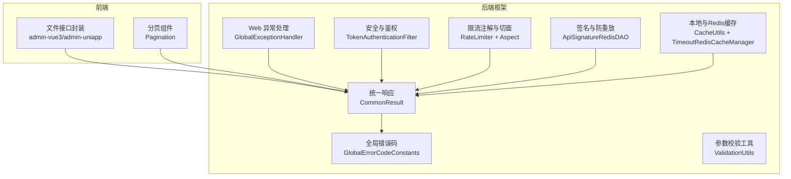
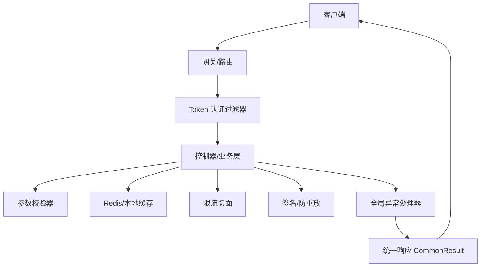
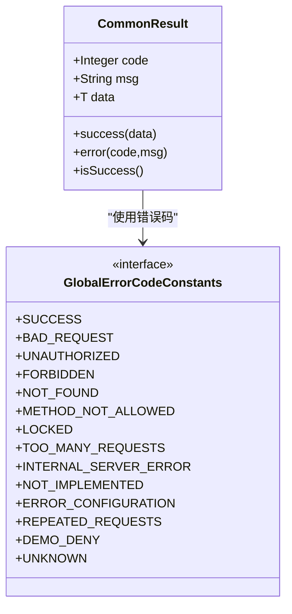
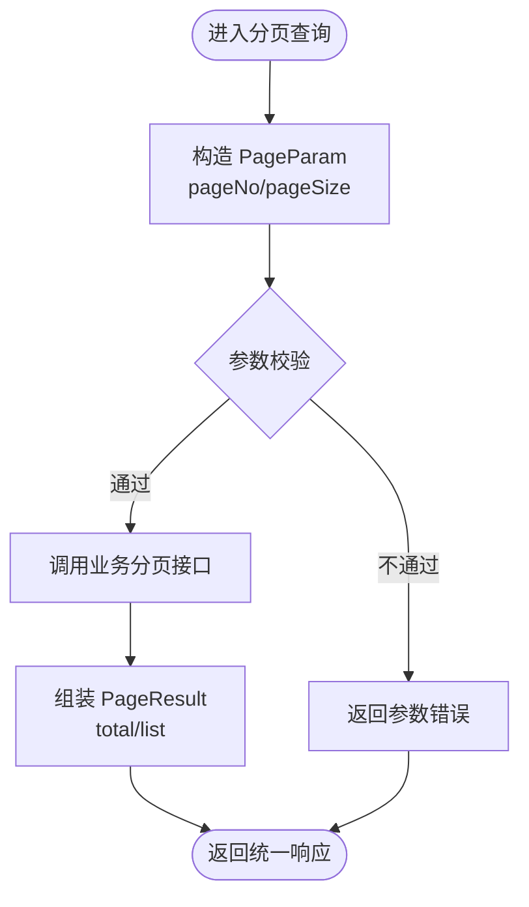
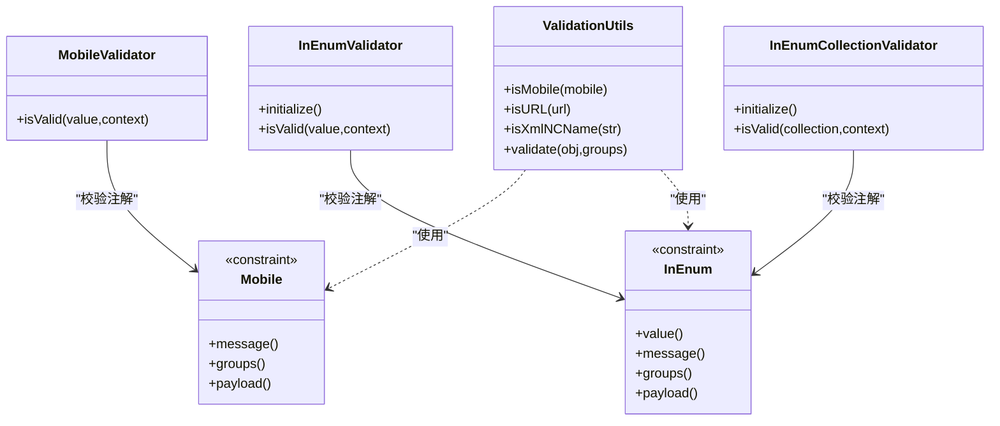
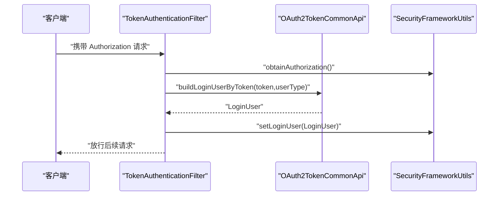
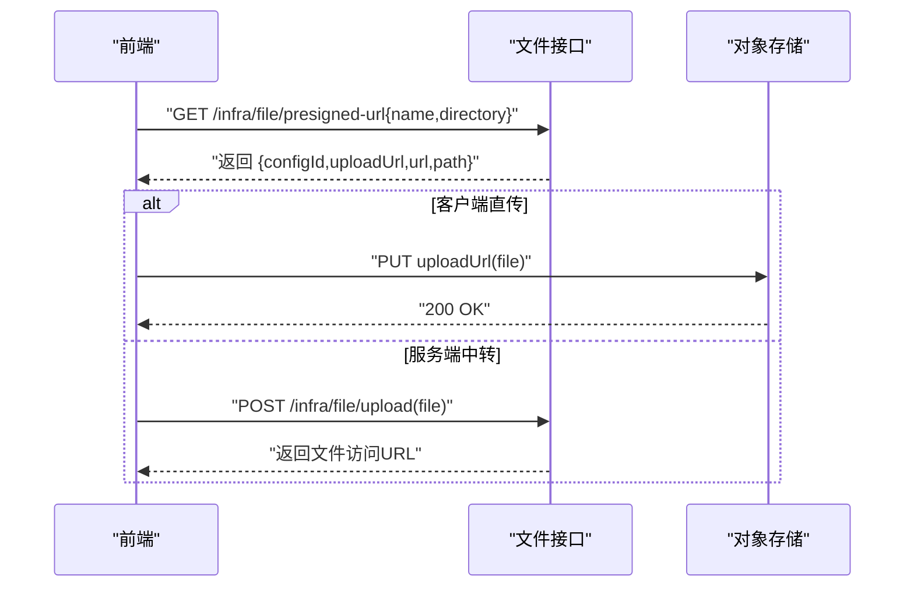
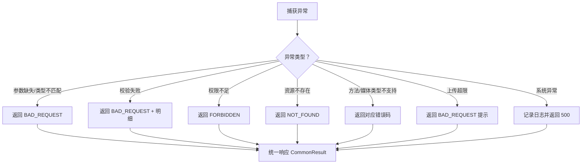
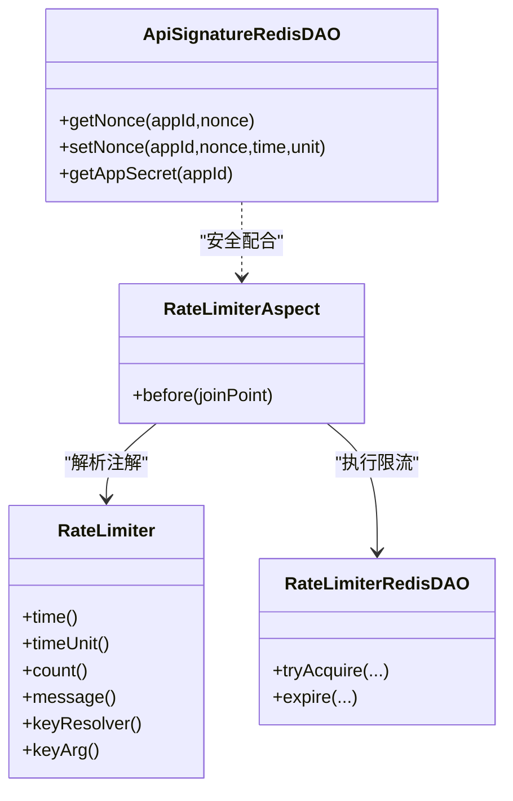
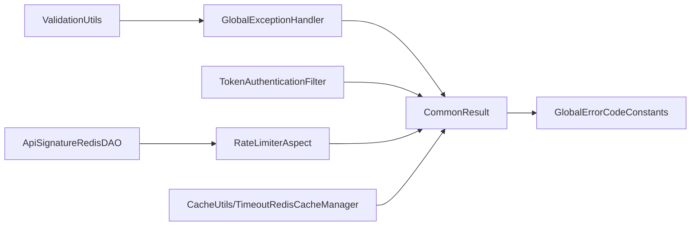

# 通用接口规范

<cite>
**本文引用的文件**
- [GlobalExceptionHandler.java](file://backend/yudao-framework/yudao-spring-boot-starter-web/src/main/java/cn/iocoder/yudao/framework/web/core/handler/GlobalExceptionHandler.java)
- [CommonResult.java](file://backend/yudao-framework/yudao-common/src/main/java/cn/iocoder/yudao/framework/common/pojo/CommonResult.java)
- [GlobalErrorCodeConstants.java](file://backend/yudao-framework/yudao-common/src/main/java/cn/iocoder/yudao/framework/common/exception/enums/GlobalErrorCodeConstants.java)
- [PageParam.java](file://backend/yudao-framework/yudao-common/src/main/java/cn/iocoder/yudao/framework/common/pojo/PageParam.java)
- [PageResult.java](file://backend/yudao-framework/yudao-common/src/main/java/cn/iocoder/yudao/framework/common/pojo/PageResult.java)
- [TokenAuthenticationFilter.java](file://backend/yudao-framework/yudao-spring-boot-starter-security/src/main/java/cn/iocoder/yudao/framework/security/core/filter/TokenAuthenticationFilter.java)
- [YudaoSecurityAutoConfiguration.java](file://backend/yudao-framework/yudao-spring-boot-starter-security/src/main/java/cn/iocoder/yudao/framework/security/config/YudaoSecurityAutoConfiguration.java)
- [LoginUserHandshakeInterceptor.java](file://backend/yudao-framework/yudao-spring-boot-starter-websocket/src/main/java/cn/iocoder/yudao/framework/websocket/core/security/LoginUserHandshakeInterceptor.java)
- [ValidationUtils.java](file://backend/yudao-framework/yudao-common/src/main/java/cn/iocoder/yudao/framework/common/util/validation/ValidationUtils.java)
- [Mobile.java](file://backend/yudao-framework/yudao-common/src/main/java/cn/iocoder/yudao/framework/common/validation/Mobile.java)
- [MobileValidator.java](file://backend/yudao-framework/yudao-common/src/main/java/cn/iocoder/yudao/framework/common/validation/MobileValidator.java)
- [InEnum.java](file://backend/yudao-framework/yudao-common/src/main/java/cn/iocoder/yudao/framework/common/validation/InEnum.java)
- [InEnumValidator.java](file://backend/yudao-framework/yudao-common/src/main/java/cn/iocoder/yudao/framework/common/validation/InEnumValidator.java)
- [InEnumCollectionValidator.java](file://backend/yudao-framework/yudao-common/src/main/java/cn/iocoder/yudao/framework/common/validation/InEnumCollectionValidator.java)
- [RateLimiter.java](file://backend/yudao-framework/yudao-spring-boot-starter-protection/src/main/java/cn/iocoder/yudao/framework/ratelimiter/core/annotation/RateLimiter.java)
- [RateLimiterAspect.java](file://backend/yudao-framework/yudao-spring-boot-starter-protection/src/main/java/cn/iocoder/yudao/framework/ratelimiter/core/aop/RateLimiterAspect.java)
- [RateLimiterRedisDAO.java](file://backend/yudao-framework/yudao-spring-boot-starter-protection/src/main/java/cn/iocoder/yudao/framework/ratelimiter/core/redis/RateLimiterRedisDAO.java)
- [ApiSignatureRedisDAO.java](file://backend/yudao-framework/yudao-spring-boot-starter-protection/src/main/java/cn/iocoder/yudao/framework/signature/core/redis/ApiSignatureRedisDAO.java)
- [CacheUtils.java](file://backend/yudao-framework/yudao-common/src/main/java/cn/iocoder/yudao/framework/common/util/cache/CacheUtils.java)
- [TimeoutRedisCacheManager.java](file://backend/yudao-framework/yudao-spring-boot-starter-redis/src/main/java/cn/iocoder/yudao/framework/redis/core/TimeoutRedisCacheManager.java)
- [index.ts（前端文件接口）](file://frontend/admin-vue3/src/api/infra/file/index.ts)
- [index.ts（前端文件配置接口）](file://frontend/admin-vue3/src/api/infra/fileConfig/index.ts)
- [uploadFile.ts（前端上传工具）](file://frontend/admin-uniapp/src/utils/uploadFile.ts)
- [index.ts（前端文件接口 uniapp）](file://frontend/admin-uniapp/src/api/infra/file/index.ts)
- [index.vue（前端分页组件）](file://frontend/admin-vue3/src/components/Pagination/index.vue)
- [helper.ts（前端表格索引辅助）](file://frontend/admin-vue3/src/components/Table/src/helper.ts)
- [index.ts（前端API访问日志接口）](file://frontend/admin-uniapp/src/api/infra/api-access-log/index.ts)
- [YudaoSwaggerAutoConfiguration.java](file://backend/yudao-framework/yudao-spring-boot-starter-web/src/main/java/cn/iocoder/yudao/framework/swagger/config/YudaoSwaggerAutoConfiguration.java)
- [Knife4jOpenApiCustomizer.java](file://backend/yudao-framework/yudao-spring-boot-starter-web/src/main/java/cn/iocoder/yudao/framework/swagger/config/Knife4jOpenApiCustomizer.java)
- [DtkApiResponse.java](file://agent_improvement/sdk_demo/dataoke-sdk-java/src/main/java/com/dtk/api/response/base/DtkApiResponse.java)
- [DtkPageResponse.java](file://agent_improvement/sdk_demo/dataoke-sdk-java/src/main/java/com/dtk/api/response/base/DtkPageResponse.java)
- [DtkDiffPageResponse.java](file://agent_improvement/sdk_demo/dataoke-sdk-java/src/main/java/com/dtk/api/response/base/DtkDiffPageResponse.java)
</cite>

## 目录
1. [简介](#简介)
2. [项目结构](#项目结构)
3. [核心组件](#核心组件)
4. [架构总览](#架构总览)
5. [详细组件分析](#详细组件分析)
6. [依赖分析](#依赖分析)
7. [性能考虑](#性能考虑)
8. [故障排查指南](#故障排查指南)
9. [结论](#结论)
10. [附录](#附录)

## 简介
本文件面向 AgenticCPS 项目的通用 RESTful API 接口规范，统一后端响应格式、错误码、分页查询、文件上传下载、权限认证、参数校验、异常处理、接口版本与缓存策略、限流与安全防护等，帮助前后端协同开发与维护。

## 项目结构
- 后端通用能力集中在 yudao-framework 模块，涵盖响应封装、异常处理、参数校验、鉴权、限流、签名、缓存等。
- 前端在 admin-vue3 与 admin-uniapp 中提供文件上传、分页组件、接口封装与工具函数。

图表来源
- [GlobalExceptionHandler.java:1-454](file://backend/yudao-framework/yudao-spring-boot-starter-web/src/main/java/cn/iocoder/yudao/framework/web/core/handler/GlobalExceptionHandler.java#L1-L454)
- [CommonResult.java:1-121](file://backend/yudao-framework/yudao-common/src/main/java/cn/iocoder/yudao/framework/common/pojo/CommonResult.java#L1-L121)
- [GlobalErrorCodeConstants.java:1-41](file://backend/yudao-framework/yudao-common/src/main/java/cn/iocoder/yudao/framework/common/exception/enums/GlobalErrorCodeConstants.java#L1-L41)
- [ValidationUtils.java:1-55](file://backend/yudao-framework/yudao-common/src/main/java/cn/iocoder/yudao/framework/common/util/validation/ValidationUtils.java#L1-L55)
- [TokenAuthenticationFilter.java:1-57](file://backend/yudao-framework/yudao-spring-boot-starter-security/src/main/java/cn/iocoder/yudao/framework/security/core/filter/TokenAuthenticationFilter.java#L1-L57)
- [RateLimiter.java:1-62](file://backend/yudao-framework/yudao-spring-boot-starter-protection/src/main/java/cn/iocoder/yudao/framework/ratelimiter/core/annotation/RateLimiter.java#L1-L62)
- [RateLimiterAspect.java:1-35](file://backend/yudao-framework/yudao-spring-boot-starter-protection/src/main/java/cn/iocoder/yudao/framework/ratelimiter/core/aop/RateLimiterAspect.java#L1-L35)
- [ApiSignatureRedisDAO.java:1-57](file://backend/yudao-framework/yudao-spring-boot-starter-protection/src/main/java/cn/iocoder/yudao/framework/signature/core/redis/ApiSignatureRedisDAO.java#L1-L57)
- [CacheUtils.java:1-61](file://backend/yudao-framework/yudao-common/src/main/java/cn/iocoder/yudao/framework/common/util/cache/CacheUtils.java#L1-L61)
- [TimeoutRedisCacheManager.java:1-34](file://backend/yudao-framework/yudao-spring-boot-starter-redis/src/main/java/cn/iocoder/yudao/framework/redis/core/TimeoutRedisCacheManager.java#L1-L34)
- [index.ts（前端文件接口）:1-46](file://frontend/admin-vue3/src/api/infra/file/index.ts#L1-L46)
- [index.vue（前端分页组件）:1-87](file://frontend/admin-vue3/src/components/Pagination/index.vue#L1-L87)

章节来源
- [GlobalExceptionHandler.java:1-454](file://backend/yudao-framework/yudao-spring-boot-starter-web/src/main/java/cn/iocoder/yudao/framework/web/core/handler/GlobalExceptionHandler.java#L1-L454)
- [CommonResult.java:1-121](file://backend/yudao-framework/yudao-common/src/main/java/cn/iocoder/yudao/framework/common/pojo/CommonResult.java#L1-L121)
- [GlobalErrorCodeConstants.java:1-41](file://backend/yudao-framework/yudao-common/src/main/java/cn/iocoder/yudao/framework/common/exception/enums/GlobalErrorCodeConstants.java#L1-L41)
- [index.ts（前端文件接口）:1-46](file://frontend/admin-vue3/src/api/infra/file/index.ts#L1-L46)
- [index.vue（前端分页组件）:1-87](file://frontend/admin-vue3/src/components/Pagination/index.vue#L1-L87)

## 核心组件
- 统一响应结构：所有接口返回统一的 CommonResult<T>，包含 code、msg、data 三要素。
- 全局错误码：遵循 HTTP 状态码语义，结合内部业务错误码，覆盖客户端错误、服务端错误、自定义错误。
- 分页规范：PageParam 与 PageResult 统一分页参数与返回结构，限制最大页大小，支持不分页导出场景。
- 参数校验：基于 Jakarta Bean Validation，提供常用注解与自定义校验器（手机号、枚举值等）。
- 异常处理：全局异常处理器将各类异常翻译为统一响应，记录异常日志，保障接口稳定性。
- 权限认证：基于 Token 的认证过滤器，支持 OAuth2 校验与模拟登录，WebSocket 通过握手拦截器注入登录用户。
- 限流与安全：注解式限流（RateLimiter），Redis 限流计数，签名防重放与随机数去重。
- 缓存策略：本地 Guava 缓存与 Redis 缓存管理器，支持自定义过期时间。

章节来源
- [CommonResult.java:1-121](file://backend/yudao-framework/yudao-common/src/main/java/cn/iocoder/yudao/framework/common/pojo/CommonResult.java#L1-L121)
- [GlobalErrorCodeConstants.java:1-41](file://backend/yudao-framework/yudao-common/src/main/java/cn/iocoder/yudao/framework/common/exception/enums/GlobalErrorCodeConstants.java#L1-L41)
- [PageParam.java:1-36](file://backend/yudao-framework/yudao-common/src/main/java/cn/iocoder/yudao/framework/common/pojo/PageParam.java#L1-L36)
- [PageResult.java:1-41](file://backend/yudao-framework/yudao-common/src/main/java/cn/iocoder/yudao/framework/common/pojo/PageResult.java#L1-L41)
- [ValidationUtils.java:1-55](file://backend/yudao-framework/yudao-common/src/main/java/cn/iocoder/yudao/framework/common/util/validation/ValidationUtils.java#L1-L55)
- [Mobile.java:1-28](file://backend/yudao-framework/yudao-common/src/main/java/cn/iocoder/yudao/framework/common/validation/Mobile.java#L1-L28)
- [MobileValidator.java:1-25](file://backend/yudao-framework/yudao-common/src/main/java/cn/iocoder/yudao/framework/common/validation/MobileValidator.java#L1-L25)
- [InEnum.java:1-35](file://backend/yudao-framework/yudao-common/src/main/java/cn/iocoder/yudao/framework/common/validation/InEnum.java#L1-L35)
- [InEnumValidator.java:1-43](file://backend/yudao-framework/yudao-common/src/main/java/cn/iocoder/yudao/framework/common/validation/InEnumValidator.java#L1-L43)
- [InEnumCollectionValidator.java:1-44](file://backend/yudao-framework/yudao-common/src/main/java/cn/iocoder/yudao/framework/common/validation/InEnumCollectionValidator.java#L1-L44)
- [GlobalExceptionHandler.java:1-454](file://backend/yudao-framework/yudao-spring-boot-starter-web/src/main/java/cn/iocoder/yudao/framework/web/core/handler/GlobalExceptionHandler.java#L1-L454)
- [TokenAuthenticationFilter.java:1-57](file://backend/yudao-framework/yudao-spring-boot-starter-security/src/main/java/cn/iocoder/yudao/framework/security/core/filter/TokenAuthenticationFilter.java#L1-L57)
- [YudaoSecurityAutoConfiguration.java:53-85](file://backend/yudao-framework/yudao-spring-boot-starter-security/src/main/java/cn/iocoder/yudao/framework/security/config/YudaoSecurityAutoConfiguration.java#L53-L85)
- [LoginUserHandshakeInterceptor.java:1-29](file://backend/yudao-framework/yudao-spring-boot-starter-websocket/src/main/java/cn/iocoder/yudao/framework/websocket/core/security/LoginUserHandshakeInterceptor.java#L1-L29)
- [RateLimiter.java:1-62](file://backend/yudao-framework/yudao-spring-boot-starter-protection/src/main/java/cn/iocoder/yudao/framework/ratelimiter/core/annotation/RateLimiter.java#L1-L62)
- [RateLimiterAspect.java:1-35](file://backend/yudao-framework/yudao-spring-boot-starter-protection/src/main/java/cn/iocoder/yudao/framework/ratelimiter/core/aop/RateLimiterAspect.java#L1-L35)
- [RateLimiterRedisDAO.java:43-66](file://backend/yudao-framework/yudao-spring-boot-starter-protection/src/main/java/cn/iocoder/yudao/framework/ratelimiter/core/redis/RateLimiterRedisDAO.java#L43-L66)
- [ApiSignatureRedisDAO.java:1-57](file://backend/yudao-framework/yudao-spring-boot-starter-protection/src/main/java/cn/iocoder/yudao/framework/signature/core/redis/ApiSignatureRedisDAO.java#L1-L57)
- [CacheUtils.java:1-61](file://backend/yudao-framework/yudao-common/src/main/java/cn/iocoder/yudao/framework/common/util/cache/CacheUtils.java#L1-L61)
- [TimeoutRedisCacheManager.java:1-34](file://backend/yudao-framework/yudao-spring-boot-starter-redis/src/main/java/cn/iocoder/yudao/framework/redis/core/TimeoutRedisCacheManager.java#L1-L34)

## 架构总览
后端通过统一响应与异常处理保证接口一致性；鉴权过滤器负责 Token 校验；参数校验器确保输入质量；限流与签名组件提升安全与稳定性；缓存策略兼顾性能与一致性。

图表来源
- [TokenAuthenticationFilter.java:1-57](file://backend/yudao-framework/yudao-spring-boot-starter-security/src/main/java/cn/iocoder/yudao/framework/security/core/filter/TokenAuthenticationFilter.java#L1-L57)
- [GlobalExceptionHandler.java:1-454](file://backend/yudao-framework/yudao-spring-boot-starter-web/src/main/java/cn/iocoder/yudao/framework/web/core/handler/GlobalExceptionHandler.java#L1-L454)
- [CommonResult.java:1-121](file://backend/yudao-framework/yudao-common/src/main/java/cn/iocoder/yudao/framework/common/pojo/CommonResult.java#L1-L121)
- [RateLimiterAspect.java:1-35](file://backend/yudao-framework/yudao-spring-boot-starter-protection/src/main/java/cn/iocoder/yudao/framework/ratelimiter/core/aop/RateLimiterAspect.java#L1-L35)
- [ApiSignatureRedisDAO.java:1-57](file://backend/yudao-framework/yudao-spring-boot-starter-protection/src/main/java/cn/iocoder/yudao/framework/signature/core/redis/ApiSignatureRedisDAO.java#L1-L57)
- [CacheUtils.java:1-61](file://backend/yudao-framework/yudao-common/src/main/java/cn/iocoder/yudao/framework/common/util/cache/CacheUtils.java#L1-L61)

## 详细组件分析

### 统一响应与错误码
- 响应结构：code（业务错误码）、msg（提示信息）、data（数据体）。成功时 code=0，msg 为空。
- 错误码：覆盖 4xx/5xx 语义与自定义业务错误，便于前端统一处理。
- 异常翻译：全局异常处理器将各类异常转换为统一响应，并记录异常日志。

图表来源
- [CommonResult.java:1-121](file://backend/yudao-framework/yudao-common/src/main/java/cn/iocoder/yudao/framework/common/pojo/CommonResult.java#L1-L121)
- [GlobalErrorCodeConstants.java:1-41](file://backend/yudao-framework/yudao-common/src/main/java/cn/iocoder/yudao/framework/common/exception/enums/GlobalErrorCodeConstants.java#L1-L41)

章节来源
- [CommonResult.java:1-121](file://backend/yudao-framework/yudao-common/src/main/java/cn/iocoder/yudao/framework/common/pojo/CommonResult.java#L1-L121)
- [GlobalErrorCodeConstants.java:1-41](file://backend/yudao-framework/yudao-common/src/main/java/cn/iocoder/yudao/framework/common/exception/enums/GlobalErrorCodeConstants.java#L1-L41)
- [GlobalExceptionHandler.java:1-454](file://backend/yudao-framework/yudao-spring-boot-starter-web/src/main/java/cn/iocoder/yudao/framework/web/core/handler/GlobalExceptionHandler.java#L1-L454)

### 分页查询规范
- 参数：pageNo（≥1）、pageSize（1~200，-1 表示不分页导出）。
- 返回：total（总量）、list（数据列表）。
- 前端分页组件：支持切换页大小与当前页，自动计算总页数与边界。

图表来源
- [PageParam.java:1-36](file://backend/yudao-framework/yudao-common/src/main/java/cn/iocoder/yudao/framework/common/pojo/PageParam.java#L1-L36)
- [PageResult.java:1-41](file://backend/yudao-framework/yudao-common/src/main/java/cn/iocoder/yudao/framework/common/pojo/PageResult.java#L1-L41)
- [index.vue（前端分页组件）:1-87](file://frontend/admin-vue3/src/components/Pagination/index.vue#L1-L87)

章节来源
- [PageParam.java:1-36](file://backend/yudao-framework/yudao-common/src/main/java/cn/iocoder/yudao/framework/common/pojo/PageParam.java#L1-L36)
- [PageResult.java:1-41](file://backend/yudao-framework/yudao-common/src/main/java/cn/iocoder/yudao/framework/common/pojo/PageResult.java#L1-L41)
- [index.vue（前端分页组件）:1-87](file://frontend/admin-vue3/src/components/Pagination/index.vue#L1-L87)

### 参数校验规则
- 内置校验：基于 ValidationUtils 与常用注解（如手机号、枚举值）。
- 自定义校验器：手机号格式、枚举值集合校验，支持空值默认通过。
- 前端配合：前端接口封装与表单校验联动，减少无效请求。

图表来源
- [ValidationUtils.java:1-55](file://backend/yudao-framework/yudao-common/src/main/java/cn/iocoder/yudao/framework/common/util/validation/ValidationUtils.java#L1-L55)
- [Mobile.java:1-28](file://backend/yudao-framework/yudao-common/src/main/java/cn/iocoder/yudao/framework/common/validation/Mobile.java#L1-L28)
- [MobileValidator.java:1-25](file://backend/yudao-framework/yudao-common/src/main/java/cn/iocoder/yudao/framework/common/validation/MobileValidator.java#L1-L25)
- [InEnum.java:1-35](file://backend/yudao-framework/yudao-common/src/main/java/cn/iocoder/yudao/framework/common/validation/InEnum.java#L1-L35)
- [InEnumValidator.java:1-43](file://backend/yudao-framework/yudao-common/src/main/java/cn/iocoder/yudao/framework/common/validation/InEnumValidator.java#L1-L43)
- [InEnumCollectionValidator.java:1-44](file://backend/yudao-framework/yudao-common/src/main/java/cn/iocoder/yudao/framework/common/validation/InEnumCollectionValidator.java#L1-L44)

章节来源
- [ValidationUtils.java:1-55](file://backend/yudao-framework/yudao-common/src/main/java/cn/iocoder/yudao/framework/common/util/validation/ValidationUtils.java#L1-L55)
- [Mobile.java:1-28](file://backend/yudao-framework/yudao-common/src/main/java/cn/iocoder/yudao/framework/common/validation/Mobile.java#L1-L28)
- [MobileValidator.java:1-25](file://backend/yudao-framework/yudao-common/src/main/java/cn/iocoder/yudao/framework/common/validation/MobileValidator.java#L1-L25)
- [InEnum.java:1-35](file://backend/yudao-framework/yudao-common/src/main/java/cn/iocoder/yudao/framework/common/validation/InEnum.java#L1-L35)
- [InEnumValidator.java:1-43](file://backend/yudao-framework/yudao-common/src/main/java/cn/iocoder/yudao/framework/common/validation/InEnumValidator.java#L1-L43)
- [InEnumCollectionValidator.java:1-44](file://backend/yudao-framework/yudao-common/src/main/java/cn/iocoder/yudao/framework/common/validation/InEnumCollectionValidator.java#L1-L44)

### 权限认证机制
- Token 认证：从请求头或参数提取 Authorization，构建 LoginUser 并注入上下文；支持模拟登录。
- WebSocket：握手阶段通过拦截器将 LoginUser 注入会话，保障实时通信鉴权。
- 安全配置：注册 TokenAuthenticationFilter 与 SecurityFrameworkService，启用 BCrypt 密码加密。

图表来源
- [TokenAuthenticationFilter.java:1-57](file://backend/yudao-framework/yudao-spring-boot-starter-security/src/main/java/cn/iocoder/yudao/framework/security/core/filter/TokenAuthenticationFilter.java#L1-L57)
- [YudaoSecurityAutoConfiguration.java:53-85](file://backend/yudao-framework/yudao-spring-boot-starter-security/src/main/java/cn/iocoder/yudao/framework/security/config/YudaoSecurityAutoConfiguration.java#L53-L85)
- [LoginUserHandshakeInterceptor.java:1-29](file://backend/yudao-framework/yudao-spring-boot-starter-websocket/src/main/java/cn/iocoder/yudao/framework/websocket/core/security/LoginUserHandshakeInterceptor.java#L1-L29)

章节来源
- [TokenAuthenticationFilter.java:1-57](file://backend/yudao-framework/yudao-spring-boot-starter-security/src/main/java/cn/iocoder/yudao/framework/security/core/filter/TokenAuthenticationFilter.java#L1-L57)
- [YudaoSecurityAutoConfiguration.java:53-85](file://backend/yudao-framework/yudao-spring-boot-starter-security/src/main/java/cn/iocoder/yudao/framework/security/config/YudaoSecurityAutoConfiguration.java#L53-L85)
- [LoginUserHandshakeInterceptor.java:1-29](file://backend/yudao-framework/yudao-spring-boot-starter-websocket/src/main/java/cn/iocoder/yudao/framework/websocket/core/security/LoginUserHandshakeInterceptor.java#L1-L29)

### 文件上传下载接口
- 预签名上传：后端返回预签名 URL 与文件路径，前端可直传至对象存储（S3）或后端中转。
- 后端上传：前端将文件以 multipart/form-data 提交，后端接收并持久化记录。
- 前端工具：支持客户端直传与服务端中转两种模式，按环境变量切换。

图表来源
- [index.ts（前端文件接口）:1-46](file://frontend/admin-vue3/src/api/infra/file/index.ts#L1-L46)
- [index.ts（前端文件接口 uniapp）:1-97](file://frontend/admin-uniapp/src/api/infra/file/index.ts#L1-L97)
- [uploadFile.ts（前端上传工具）:1-48](file://frontend/admin-uniapp/src/utils/uploadFile.ts#L1-L48)

章节来源
- [index.ts（前端文件接口）:1-46](file://frontend/admin-vue3/src/api/infra/file/index.ts#L1-L46)
- [index.ts（前端文件接口 uniapp）:1-97](file://frontend/admin-uniapp/src/api/infra/file/index.ts#L1-L97)
- [uploadFile.ts（前端上传工具）:1-48](file://frontend/admin-uniapp/src/utils/uploadFile.ts#L1-L48)

### 异常处理机制
- 全量兜底：覆盖参数缺失、类型不匹配、校验失败、权限不足、资源不存在、方法/媒体类型不支持、上传超限、系统异常等。
- 日志记录：异步记录异常日志，包含请求上下文、堆栈信息与追踪 ID，便于定位问题。

图表来源
- [GlobalExceptionHandler.java:1-454](file://backend/yudao-framework/yudao-spring-boot-starter-web/src/main/java/cn/iocoder/yudao/framework/web/core/handler/GlobalExceptionHandler.java#L1-L454)

章节来源
- [GlobalExceptionHandler.java:1-454](file://backend/yudao-framework/yudao-spring-boot-starter-web/src/main/java/cn/iocoder/yudao/framework/web/core/handler/GlobalExceptionHandler.java#L1-L454)

### 限流与安全防护
- 限流注解：支持按全局、用户、IP、服务节点、表达式等维度限流，超频返回 TOO_MANY_REQUESTS。
- Redis 限流：基于 RateLimiterRedisDAO 实现计数与过期控制。
- 签名与防重放：随机数去重（nonce）与密钥管理，防止重放攻击。

图表来源
- [RateLimiter.java:1-62](file://backend/yudao-framework/yudao-spring-boot-starter-protection/src/main/java/cn/iocoder/yudao/framework/ratelimiter/core/annotation/RateLimiter.java#L1-L62)
- [RateLimiterAspect.java:1-35](file://backend/yudao-framework/yudao-spring-boot-starter-protection/src/main/java/cn/iocoder/yudao/framework/ratelimiter/core/aop/RateLimiterAspect.java#L1-L35)
- [RateLimiterRedisDAO.java:43-66](file://backend/yudao-framework/yudao-spring-boot-starter-protection/src/main/java/cn/iocoder/yudao/framework/ratelimiter/core/redis/RateLimiterRedisDAO.java#L43-L66)
- [ApiSignatureRedisDAO.java:1-57](file://backend/yudao-framework/yudao-spring-boot-starter-protection/src/main/java/cn/iocoder/yudao/framework/signature/core/redis/ApiSignatureRedisDAO.java#L1-L57)

章节来源
- [RateLimiter.java:1-62](file://backend/yudao-framework/yudao-spring-boot-starter-protection/src/main/java/cn/iocoder/yudao/framework/ratelimiter/core/annotation/RateLimiter.java#L1-L62)
- [RateLimiterAspect.java:1-35](file://backend/yudao-framework/yudao-spring-boot-starter-protection/src/main/java/cn/iocoder/yudao/framework/ratelimiter/core/aop/RateLimiterAspect.java#L1-L35)
- [RateLimiterRedisDAO.java:43-66](file://backend/yudao-framework/yudao-spring-boot-starter-protection/src/main/java/cn/iocoder/yudao/framework/ratelimiter/core/redis/RateLimiterRedisDAO.java#L43-L66)
- [ApiSignatureRedisDAO.java:1-57](file://backend/yudao-framework/yudao-spring-boot-starter-protection/src/main/java/cn/iocoder/yudao/framework/signature/core/redis/ApiSignatureRedisDAO.java#L1-L57)

### 缓存策略
- 本地缓存：Guava LoadingCache，异步刷新，适合“全局/系统”类数据。
- Redis 缓存：支持 cacheNames#ttl 自定义过期时间，单位支持 d/h/m/s。
- 建议：敏感或与用户强关联的数据使用本地缓存，全局静态配置使用 Redis 缓存。

章节来源
- [CacheUtils.java:1-61](file://backend/yudao-framework/yudao-common/src/main/java/cn/iocoder/yudao/framework/common/util/cache/CacheUtils.java#L1-L61)
- [TimeoutRedisCacheManager.java:1-34](file://backend/yudao-framework/yudao-spring-boot-starter-redis/src/main/java/cn/iocoder/yudao/framework/redis/core/TimeoutRedisCacheManager.java#L1-L34)

### 接口版本管理与文档
- 接口版本：通过 Swagger/OpenAPI 自定义 operationId 与标签排序，便于版本演进与文档维护。
- 文档增强：Knife4j 支持扩展排序与分组，提升接口文档可读性。

章节来源
- [YudaoSwaggerAutoConfiguration.java:166-186](file://backend/yudao-framework/yudao-spring-boot-starter-web/src/main/java/cn/iocoder/yudao/framework/swagger/config/YudaoSwaggerAutoConfiguration.java#L166-L186)
- [Knife4jOpenApiCustomizer.java:84-113](file://backend/yudao-framework/yudao-spring-boot-starter-web/src/main/java/cn/iocoder/yudao/framework/swagger/config/Knife4jOpenApiCustomizer.java#L84-L113)

## 依赖分析
- 组件耦合：异常处理与响应封装为横切关注点，被各模块复用；鉴权与限流通过过滤器与切面接入。
- 外部依赖：Redis 用于限流与签名随机数；Swagger/Knife4j 用于接口文档；前端 axios/luch-request 用于 HTTP 请求。

图表来源
- [CommonResult.java:1-121](file://backend/yudao-framework/yudao-common/src/main/java/cn/iocoder/yudao/framework/common/pojo/CommonResult.java#L1-L121)
- [GlobalErrorCodeConstants.java:1-41](file://backend/yudao-framework/yudao-common/src/main/java/cn/iocoder/yudao/framework/common/exception/enums/GlobalErrorCodeConstants.java#L1-L41)
- [GlobalExceptionHandler.java:1-454](file://backend/yudao-framework/yudao-spring-boot-starter-web/src/main/java/cn/iocoder/yudao/framework/web/core/handler/GlobalExceptionHandler.java#L1-L454)
- [TokenAuthenticationFilter.java:1-57](file://backend/yudao-framework/yudao-spring-boot-starter-security/src/main/java/cn/iocoder/yudao/framework/security/core/filter/TokenAuthenticationFilter.java#L1-L57)
- [ValidationUtils.java:1-55](file://backend/yudao-framework/yudao-common/src/main/java/cn/iocoder/yudao/framework/common/util/validation/ValidationUtils.java#L1-L55)
- [RateLimiterAspect.java:1-35](file://backend/yudao-framework/yudao-spring-boot-starter-protection/src/main/java/cn/iocoder/yudao/framework/ratelimiter/core/aop/RateLimiterAspect.java#L1-L35)
- [ApiSignatureRedisDAO.java:1-57](file://backend/yudao-framework/yudao-spring-boot-starter-protection/src/main/java/cn/iocoder/yudao/framework/signature/core/redis/ApiSignatureRedisDAO.java#L1-L57)
- [CacheUtils.java:1-61](file://backend/yudao-framework/yudao-common/src/main/java/cn/iocoder/yudao/framework/common/util/cache/CacheUtils.java#L1-L61)

## 性能考虑
- 分页限制：pageSize 最大 200，避免一次性返回大量数据。
- 缓存策略：热点数据使用 Redis，非热点使用本地缓存，降低数据库压力。
- 限流策略：根据接口重要性选择用户级或 IP 级限流，防止突发流量冲击。
- 上传优化：大文件优先直传对象存储，减少后端带宽占用。

## 故障排查指南
- 统一响应查看：优先检查 code 与 msg，快速定位错误类型。
- 异常日志：通过 traceId 定位请求链路，核对异常堆栈与请求参数。
- 参数校验：确认必填字段、类型与范围是否符合要求。
- 权限问题：检查 Authorization 是否正确、用户是否存在、角色权限是否足够。
- 限流告警：关注 TOO_MANY_REQUESTS，评估限流阈值与维度配置。

章节来源
- [GlobalExceptionHandler.java:1-454](file://backend/yudao-framework/yudao-spring-boot-starter-web/src/main/java/cn/iocoder/yudao/framework/web/core/handler/GlobalExceptionHandler.java#L1-L454)

## 结论
通过统一响应、错误码、分页、参数校验、鉴权、限流与缓存等机制，系统实现了高一致性、高可用与高安全性的通用 RESTful 接口规范。建议在新增接口时严格遵循本文规范，确保前后端协作顺畅与系统稳定运行。

## 附录
- 前端分页与表格索引：Pagination 组件与 helper 辅助函数，确保序号与分页联动一致。
- 文件配置与测试：前端提供文件配置接口封装，支持测试配置连通性。
- 第三方 SDK 响应结构：参考 DtkApiResponse/DtkPageResponse/DtkDiffPageResponse，便于对接外部平台。

章节来源
- [index.vue（前端分页组件）:1-87](file://frontend/admin-vue3/src/components/Pagination/index.vue#L1-L87)
- [helper.ts（前端表格索引辅助）:1-8](file://frontend/admin-vue3/src/components/Table/src/helper.ts#L1-L8)
- [index.ts（前端文件配置接口）:1-55](file://frontend/admin-vue3/src/api/infra/fileConfig/index.ts#L1-L55)
- [DtkApiResponse.java:51-82](file://agent_improvement/sdk_demo/dataoke-sdk-java/src/main/java/com/dtk/api/response/base/DtkApiResponse.java#L51-L82)
- [DtkPageResponse.java:1-24](file://agent_improvement/sdk_demo/dataoke-sdk-java/src/main/java/com/dtk/api/response/base/DtkPageResponse.java#L1-L24)
- [DtkDiffPageResponse.java:1-26](file://agent_improvement/sdk_demo/dataoke-sdk-java/src/main/java/com/dtk/api/response/base/DtkDiffPageResponse.java#L1-L26)