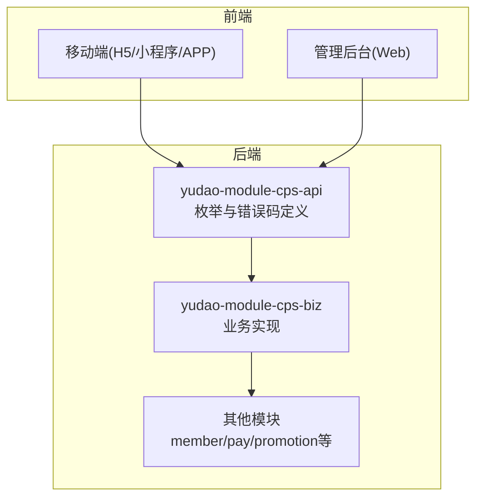
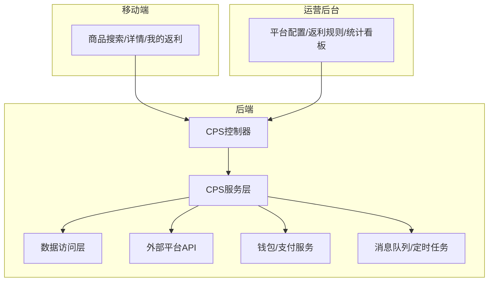
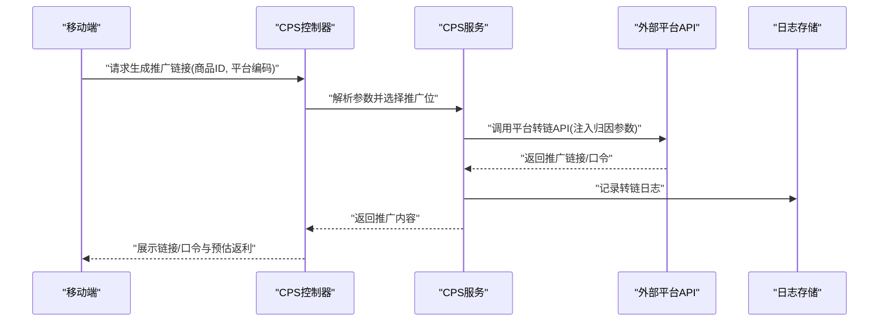
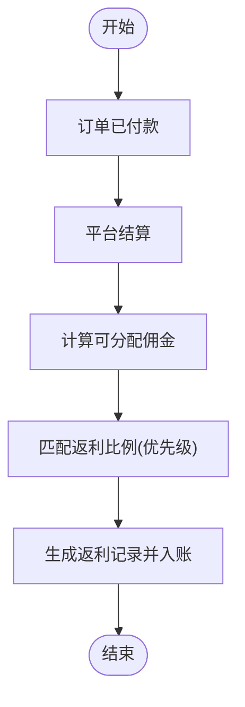
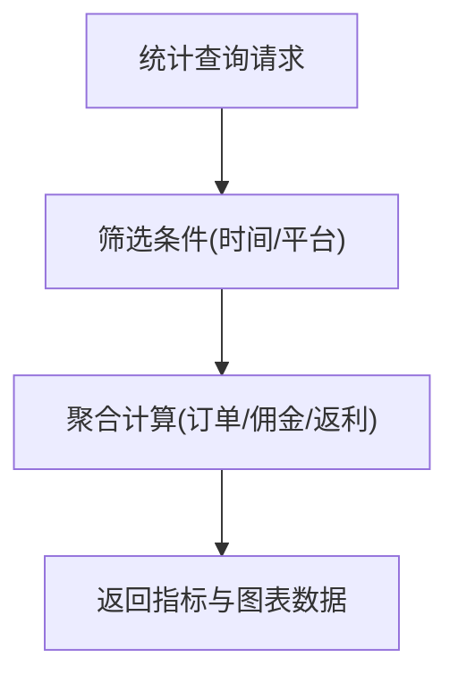
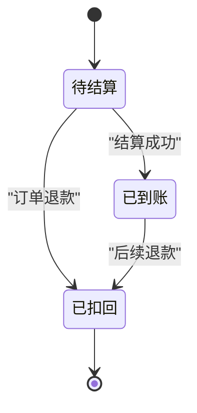
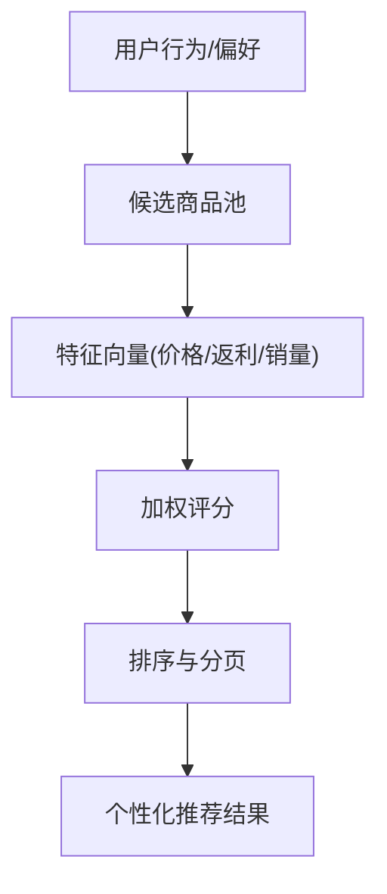
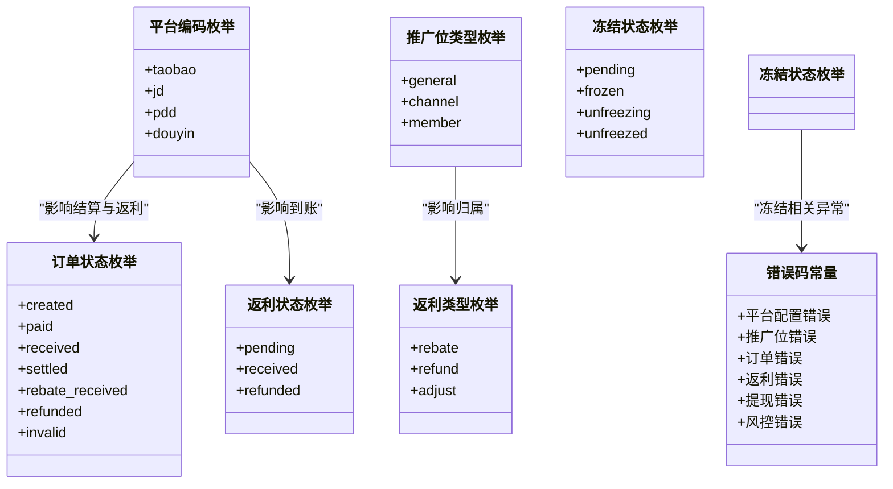

# CPS推广相关接口

<cite>
**本文引用的文件**
- [CPS系统PRD文档.md](file://docs/CPS系统PRD文档.md)
- [CpsAdzoneTypeEnum.java](file://backend/yudao-module-cps/yudao-module-cps-api/src/main/java/cn/iocoder/yudao/module/cps/enums/CpsAdzoneTypeEnum.java)
- [CpsErrorCodeConstants.java](file://backend/yudao-module-cps/yudao-module-cps-api/src/main/java/cn/iocoder/yudao/module/cps/enums/CpsErrorCodeConstants.java)
- [CpsFreezeStatusEnum.java](file://backend/yudao-module-cps/yudao-module-cps-api/src/main/java/cn/iocoder/yudao/module/cps/enums/CpsFreezeStatusEnum.java)
- [CpsOrderStatusEnum.java](file://backend/yudao-module-cps/yudao-module-cps-api/src/main/java/cn/iocoder/yudao/module/cps/enums/CpsOrderStatusEnum.java)
- [CpsPlatformCodeEnum.java](file://backend/yudao-module-cps/yudao-module-cps-api/src/main/java/cn/iocoder/yudao/module/cps/enums/CpsPlatformCodeEnum.java)
- [CpsRebateStatusEnum.java](file://backend/yudao-module-cps/yudao-module-cps-api/src/main/java/cn/iocoder/yudao/module/cps/enums/CpsRebateStatusEnum.java)
- [CpsRebateTypeEnum.java](file://backend/yudao-module-cps/yudao-module-cps-api/src/main/java/cn/iocoder/yudao/module/cps/enums/CpsRebateTypeEnum.java)
</cite>

## 目录
1. [简介](#简介)
2. [项目结构](#项目结构)
3. [核心组件](#核心组件)
4. [架构概览](#架构概览)
5. [详细组件分析](#详细组件分析)
6. [依赖分析](#依赖分析)
7. [性能考虑](#性能考虑)
8. [故障排查指南](#故障排查指南)
9. [结论](#结论)
10. [附录](#附录)

## 简介
本文件面向移动端CPS推广相关接口，围绕推广链接生成、佣金查询、推广统计、返利记录、推广商品推荐等核心能力进行系统化接口文档化。结合PRD中的业务流程与规则，明确接口设计要点、参数约定、有效期管理、佣金计算与发放条件、到账时间、统计口径、返利记录状态跟踪与异常处理、以及推荐算法与个性化展示的实现思路，并提供CPS业务特有的接口设计考虑与性能优化建议。

## 项目结构
CPS模块位于后端工程的 yudao-module-cps 子模块下，采用API/Biz分层，枚举类集中定义在 yudao-module-cps-api 模块中，用于统一状态、类型与错误码的定义。前端侧包含小程序/APP端与管理后台，分别承载会员端与运营端的功能入口。

**章节来源**
- [CPS系统PRD文档.md: 80-120:80-120](file://docs/CPS系统PRD文档.md#L80-L120)

## 核心组件
- 平台与推广位
  - 平台编码：淘宝、京东、拼多多、抖音等，用于区分不同CPS平台的转链与订单API差异。
  - 推广位类型：通用、渠道专属、用户专属，用于归属与结算规则。
- 订单生命周期
  - 订单状态：已下单、已付款、已收货、已结算、已到账、已退款、已失效。
- 返利生命周期
  - 返利状态：待结算、已到账、已扣回；返利类型：返利入账、返利扣回、系统调整。
- 错误码体系
  - 覆盖平台配置、推广位、订单、返利配置/记录、返利账户、提现、统计、MCP、转链、冻结、风控等模块的错误场景。

**章节来源**
- [CpsPlatformCodeEnum.java: 1-45:1-45](file://backend/yudao-module-cps/yudao-module-cps-api/src/main/java/cn/iocoder/yudao/module/cps/enums/CpsPlatformCodeEnum.java#L1-L45)
- [CpsAdzoneTypeEnum.java: 1-40:1-40](file://backend/yudao-module-cps/yudao-module-cps-api/src/main/java/cn/iocoder/yudao/module/cps/enums/CpsAdzoneTypeEnum.java#L1-L40)
- [CpsOrderStatusEnum.java: 1-48:1-48](file://backend/yudao-module-cps/yudao-module-cps-api/src/main/java/cn/iocoder/yudao/module/cps/enums/CpsOrderStatusEnum.java#L1-L48)
- [CpsRebateStatusEnum.java: 1-40:1-40](file://backend/yudao-module-cps/yudao-module-cps-api/src/main/java/cn/iocoder/yudao/module/cps/enums/CpsRebateStatusEnum.java#L1-L40)
- [CpsRebateTypeEnum.java: 1-40:1-40](file://backend/yudao-module-cps/yudao-module-cps-api/src/main/java/cn/iocoder/yudao/module/cps/enums/CpsRebateTypeEnum.java#L1-L40)
- [CpsErrorCodeConstants.java: 1-65:1-65](file://backend/yudao-module-cps/yudao-module-cps-api/src/main/java/cn/iocoder/yudao/module/cps/enums/CpsErrorCodeConstants.java#L1-L65)

## 架构概览
移动端CPS推广接口围绕“商品查询/比价—生成推广链接—订单同步与结算—返利入账—提现”闭环展开。前端通过API网关调用后端CPS服务，后端结合会员等级、平台配置与风控策略，完成佣金计算、返利分配与提现处理。

**章节来源**
- [CPS系统PRD文档.md: 183-223:183-223](file://docs/CPS系统PRD文档.md#L183-L223)

## 详细组件分析

### 推广链接生成接口
- 接口目标
  - 为选定商品生成带归因参数的推广链接，支持淘宝口令、京东短链、拼多多推广链接等格式。
- 生成规则
  - 平台差异化参数注入：淘宝(adzone_id+external_info)、京东(subUnionId映射)、拼多多(custom_parameters含uid)。
  - 推广位选择优先级：用户专属推广位 > 平台默认推广位。
  - 记录转链日志，便于审计与对账。
- 参数传递
  - 必填：商品ID、平台编码、会员标识。
  - 可选：推广位ID、渠道标识、自定义参数。
- 有效期管理
  - 由各平台决定，通常与平台活动周期一致；系统侧记录生成时间与平台过期时间，前端展示“预估返利”提示。
- 输出格式
  - 淘宝：优先返回淘口令及推广链接；京东：短链+长链；拼多多：推广链接+小程序路径。

**章节来源**
- [CPS系统PRD文档.md: 152-181:152-181](file://docs/CPS系统PRD文档.md#L152-L181)
- [CpsPlatformCodeEnum.java: 17-22:17-22](file://backend/yudao-module-cps/yudao-module-cps-api/src/main/java/cn/iocoder/yudao/module/cps/enums/CpsPlatformCodeEnum.java#L17-L22)
- [CpsAdzoneTypeEnum.java: 18-21:18-21](file://backend/yudao-module-cps/yudao-module-cps-api/src/main/java/cn/iocoder/yudao/module/cps/enums/CpsAdzoneTypeEnum.java#L18-L21)

### 佣金查询与发放条件
- 计算方式
  - 商品佣金 = 实付金额 × 平台佣金比例
  - 平台服务费 = 商品佣金 × 平台服务费率
  - 可分配佣金 = 商品佣金 − 平台服务费
  - 会员返利 = 可分配佣金 × 会员返利比例（优先级：个人 > 等级+平台 > 等级 > 平台 > 全局）
- 发放条件
  - 订单状态需达到“已结算”，系统方可进行返利分配。
- 到账时间
  - 下单到追踪：5~30分钟
  - 追踪到结算：平台结算周期（如淘宝日结、京东月结、拼多多约15工作日）
  - 结算到入账：系统配置的入账延迟（通常0~24小时）
  - 入账到可提现：即时

**章节来源**
- [CPS系统PRD文档.md: 760-800:760-800](file://docs/CPS系统PRD文档.md#L760-L800)
- [CpsOrderStatusEnum.java: 18-24:18-24](file://backend/yudao-module-cps/yudao-module-cps-api/src/main/java/cn/iocoder/yudao/module/cps/enums/CpsOrderStatusEnum.java#L18-L24)
- [CpsRebateStatusEnum.java: 18-21:18-21](file://backend/yudao-module-cps/yudao-module-cps-api/src/main/java/cn/iocoder/yudao/module/cps/enums/CpsRebateStatusEnum.java#L18-L21)

### 推广统计接口
- 统计维度
  - 订单量、佣金、返利、利润、待结算/已结算金额、活跃会员数等。
- 计算口径
  - 按日趋势、平台占比、TOP会员返利排行等。
- 接口设计要点
  - 支持按平台、时间范围筛选；
  - 提供汇总卡片与图表联动；
  - 后台看板实时刷新，支持导出。

**章节来源**
- [CPS系统PRD文档.md: 620-642:620-642](file://docs/CPS系统PRD文档.md#L620-L642)

### 返利记录接口
- 状态跟踪
  - 返利状态：待结算、已到账、已扣回；类型：返利入账、返利扣回、系统调整。
  - 退款场景：若订单发生退款，系统根据“返利已入账/未入账”分别执行扣减钱包余额或取消待结算记录。
- 异常处理
  - 对账不平、平台接口异常、风控拦截等情况需记录日志并告警；
  - 支持人工介入与系统重试机制。

**章节来源**
- [CpsRebateStatusEnum.java: 18-21:18-21](file://backend/yudao-module-cps/yudao-module-cps-api/src/main/java/cn/iocoder/yudao/module/cps/enums/CpsRebateStatusEnum.java#L18-L21)
- [CpsRebateTypeEnum.java: 18-21:18-21](file://backend/yudao-module-cps/yudao-module-cps-api/src/main/java/cn/iocoder/yudao/module/cps/enums/CpsRebateTypeEnum.java#L18-L21)
- [CPS系统PRD文档.md: 218-223:218-223](file://docs/CPS系统PRD文档.md#L218-L223)

### 推广商品推荐接口
- 推荐算法思路
  - 基于用户历史行为与偏好，结合商品热度、佣金比例、平台活动进行加权排序；
  - 支持“热销爆品”“高佣精选”“大额券”等频道化推荐。
- 个性化展示
  - 登录态展示预估返利，未登录态提示登录查看；
  - 支持收藏、降价提醒、分享海报等增强功能。

**章节来源**
- [CPS系统PRD文档.md: 290-303:290-303](file://docs/CPS系统PRD文档.md#L290-L303)

## 依赖分析
- 枚举与错误码
  - 平台编码、推广位类型、订单状态、返利状态/类型、冻结状态、错误码等集中定义，确保前后端一致性与可维护性。
- 外部平台集成
  - 通过平台编码区分转链与订单API差异，统一接入与异常处理。
- 服务耦合
  - CPS服务依赖钱包/支付服务进行余额变动与提现处理；依赖定时任务/消息队列进行订单同步与结算。

**章节来源**
- [CpsPlatformCodeEnum.java: 17-22:17-22](file://backend/yudao-module-cps/yudao-module-cps-api/src/main/java/cn/iocoder/yudao/module/cps/enums/CpsPlatformCodeEnum.java#L17-L22)
- [CpsAdzoneTypeEnum.java: 18-21:18-21](file://backend/yudao-module-cps/yudao-module-cps-api/src/main/java/cn/iocoder/yudao/module/cps/enums/CpsAdzoneTypeEnum.java#L18-L21)
- [CpsOrderStatusEnum.java: 18-25:18-25](file://backend/yudao-module-cps/yudao-module-cps-api/src/main/java/cn/iocoder/yudao/module/cps/enums/CpsOrderStatusEnum.java#L18-L25)
- [CpsRebateStatusEnum.java: 18-21:18-21](file://backend/yudao-module-cps/yudao-module-cps-api/src/main/java/cn/iocoder/yudao/module/cps/enums/CpsRebateStatusEnum.java#L18-L21)
- [CpsRebateTypeEnum.java: 18-21:18-21](file://backend/yudao-module-cps/yudao-module-cps-api/src/main/java/cn/iocoder/yudao/module/cps/enums/CpsRebateTypeEnum.java#L18-L21)
- [CpsFreezeStatusEnum.java: 18-22:18-22](file://backend/yudao-module-cps/yudao-module-cps-api/src/main/java/cn/iocoder/yudao/module/cps/enums/CpsFreezeStatusEnum.java#L18-L22)
- [CpsErrorCodeConstants.java: 12-64:12-64](file://backend/yudao-module-cps/yudao-module-cps-api/src/main/java/cn/iocoder/yudao/module/cps/enums/CpsErrorCodeConstants.java#L12-L64)

## 性能考虑
- 并发与异步
  - 商品搜索与比价采用并发查询多平台，减少首屏等待；订单同步采用定时任务与增量拉取，避免全量扫描。
- 缓存与热点
  - 商品详情与热门搜索结果使用缓存；推广位与返利规则配置做缓存更新策略。
- 限流与熔断
  - 对外部平台API设置限流与熔断，防止雪崩；对CPS接口进行接口级限流与黑白名单控制。
- 数据一致性
  - 订单状态变更与返利入账采用幂等设计与分布式锁，保证重复回调不重复计费。
- 移动端体验
  - 骨架屏与懒加载提升弱网体验；预估返利与真实返利分离，避免误导。

## 故障排查指南
- 常见错误与处理
  - 平台配置缺失/禁用：检查平台配置是否存在且启用，默认推广位是否正确。
  - 推广位不存在：校验推广位类型与所属关系，必要时回退至平台默认推广位。
  - 订单状态不合法：核对订单生命周期与平台结算节奏，避免提前结算。
  - 返利账户余额不足/冻结：检查账户状态与交易流水，及时解冻或补足。
  - 提现金额低于最低限额/次数超限：提示用户调整金额或等待次日额度。
  - MCP API Key无效/过期/禁用：检查权限级别与有效期，重新签发。
  - 转链被风控拦截：检查风控规则与用户行为，必要时人工审核。
- 日志与监控
  - 记录转链日志、订单同步日志、提现流水日志；关键节点埋点与告警阈值设置。

**章节来源**
- [CpsErrorCodeConstants.java: 13-64:13-64](file://backend/yudao-module-cps/yudao-module-cps-api/src/main/java/cn/iocoder/yudao/module/cps/enums/CpsErrorCodeConstants.java#L13-L64)
- [CPS系统PRD文档.md: 225-261:225-261](file://docs/CPS系统PRD文档.md#L225-L261)

## 结论
本文从PRD出发，系统梳理了移动端CPS推广相关接口的设计与实现要点，明确了推广链接生成规则、佣金计算与发放条件、统计口径、返利记录状态与异常处理、推荐算法与个性化展示，并提供了性能优化与故障排查建议。后续可在接口层面进一步细化参数校验、安全鉴权与审计日志，确保业务稳定与合规。

## 附录
- 术语
  - CPS：Cost Per Sale，按成交计费的联盟推广模式。
  - PID：推广位ID，用于归因与结算。
  - 预估返利：基于平台佣金与返利比例计算的预计收益，最终以实际结算为准。
- 参考
  - PRD中关于核心流程、规则与界面设计的详细描述。