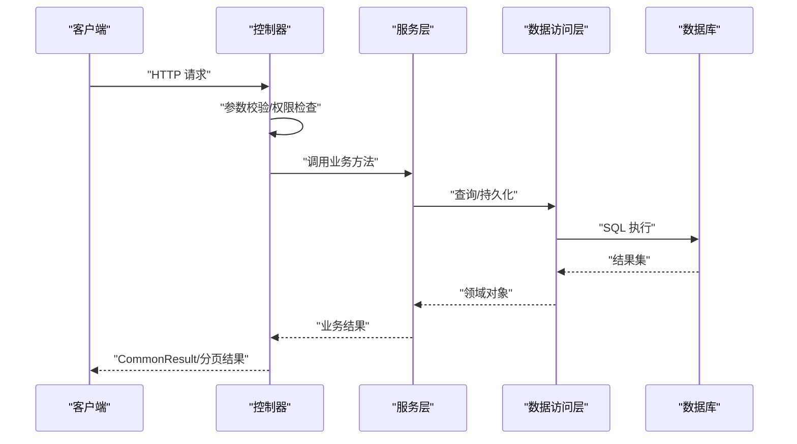
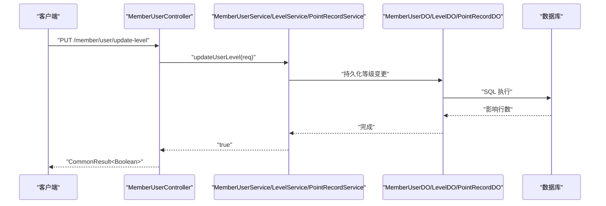
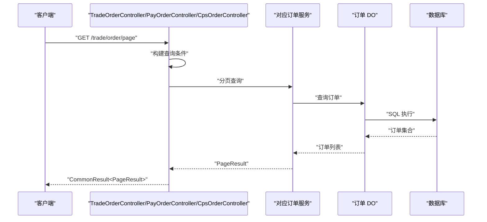
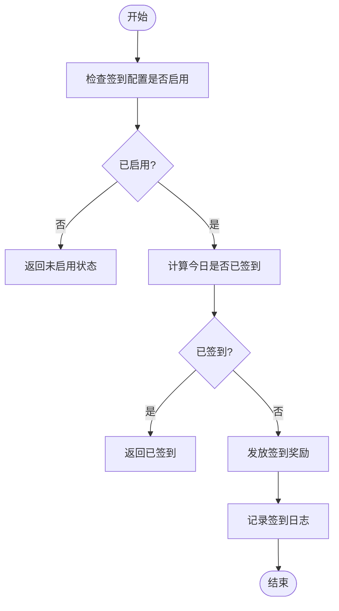
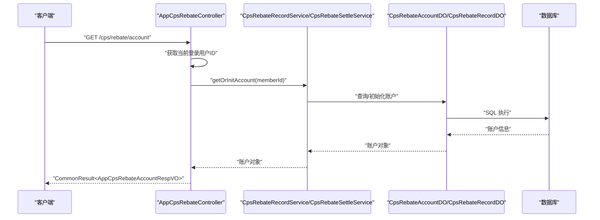
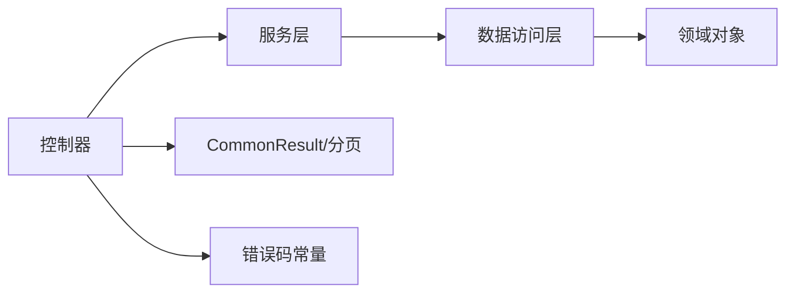

# 会员端 API

<cite>
**本文引用的文件**
- [MemberUserController.java](file://backend/yudao-module-member/src/main/java/cn/iocoder/yudao/module/member/controller/admin/user/MemberUserController.java)
- [MemberStatisticsController.java](file://backend/yudao-module-mall/yudao-module-statistics/src/main/java/cn/iocoder/yudao/module/statistics/controller/admin/member/MemberStatisticsController.java)
- [CpsOrderController.java](file://backend/yudao-module-cps/yudao-module-cps-biz/src/main/java/cn/iocoder/yudao/module/cps/controller/admin/order/CpsOrderController.java)
- [PayOrderController.java](file://backend/yudao-module-pay/src/main/java/cn/iocoder/yudao/module/pay/controller/admin/order/PayOrderController.java)
- [TradeOrderController.java](file://backend/yudao-module-trade/src/main/java/cn/iocoder/yudao/module/trade/controller/admin/order/TradeOrderController.java)
- [ProductSpuController.java](file://backend/yudao-module-mall/yudao-module-product/src/main/java/cn/iocoder/yudao/module/product/controller/admin/spu/ProductSpuController.java)
- [PromotionCouponController.java](file://backend/yudao-module-mall/yudao-module-promotion/src/main/java/cn/iocoder/yudao/module/promotion/controller/admin/coupon/PromotionCouponController.java)
- [MemberLevelController.java](file://backend/yudao-module-member/src/main/java/cn/iocoder/yudao/module/member/controller/admin/level/MemberLevelController.java)
- [MemberGroupController.java](file://backend/yudao-module-member/src/main/java/cn/iocoder/yudao/module/member/controller/admin/group/MemberGroupController.java)
- [MemberTagController.java](file://backend/yudao-module-member/src/main/java/cn/iocoder/yudao/module/member/controller/admin/tag/MemberTagController.java)
- [MemberPointRecordController.java](file://backend/yudao-module-member/src/main/java/cn/iocoder/yudao/module/member/controller/admin/point/MemberPointRecordController.java)
- [MemberSignInConfigController.java](file://backend/yudao-module-member/src/main/java/cn/iocoder/yudao/module/member/controller/admin/signin/MemberSignInConfigController.java)
- [MemberSignInRecordController.java](file://backend/yudao-module-member/src/main/java/cn/iocoder/yudao/module/member/controller/admin/signin/MemberSignInRecordController.java)
- [AiChatConversationController.java](file://backend/yudao-module-ai/src/main/java/cn/iocoder/yudao/module/ai/controller/admin/chat/AiChatConversationController.java)
- [AiChatMessageController.java](file://backend/yudao-module-ai/src/main/java/cn/iocoder/yudao/module/ai/controller/admin/chat/AiChatMessageController.java)
- [AiImageController.java](file://backend/yudao-module-ai/src/main/java/cn/iocoder/yudao/module/ai/controller/admin/image/AiImageController.java)
- [AiKnowledgeController.java](file://backend/yudao-module-ai/src/main/java/cn/iocoder/yudao/module/ai/controller/admin/knowledge/AiKnowledgeController.java)
- [AiKnowledgeDocumentController.java](file://backend/yudao-module-ai/src/main/java/cn/iocoder/yudao/module/ai/controller/admin/knowledge/AiKnowledgeDocumentController.java)
- [AiKnowledgeSegmentController.java](file://backend/yudao-module-ai/src/main/java/cn/iocoder/yudao/module/ai/controller/admin/knowledge/AiKnowledgeSegmentController.java)
- [AiMindMapController.java](file://backend/yudao-module-ai/src/main/java/cn/iocoder/yudao/module/ai/controller/admin/mindmap/AiMindMapController.java)
- [AiApiKeyController.java](file://backend/yudao-module-ai/src/main/java/cn/iocoder/yudao/module/ai/controller/admin/model/AiApiKeyController.java)
- [AiChatRoleController.java](file://backend/yudao-module-ai/src/main/java/cn/iocoder/yudao/module/ai/controller/admin/model/AiChatRoleController.java)
- [AiModelController.java](file://backend/yudao-module-ai/src/main/java/cn/iocoder/yudao/module/ai/controller/admin/model/AiModelController.java)
- [AiToolController.java](file://backend/yudao-module-ai/src/main/java/cn/iocoder/yudao/module/ai/controller/admin/model/AiToolController.java)
- [AiMusicController.java](file://backend/yudao-module-ai/src/main/java/cn/iocoder/yudao/module/ai/controller/admin/music/AiMusicController.java)
- [AiWorkflowController.java](file://backend/yudao-module-ai/src/main/java/cn/iocoder/yudao/module/ai/controller/admin/workflow/AiWorkflowController.java)
- [AiWriteController.java](file://backend/yudao-module-ai/src/main/java/cn/iocoder/yudao/module/ai/controller/admin/write/AiWriteController.java)
- [AppCpsRebateController.java](file://backend/yudao-module-cps/yudao-module-cps-biz/src/main/java/cn/iocoder/yudao/module/cps/controller/app/rebate/AppCpsRebateController.java)
- [CpsRebateConfigController.java](file://backend/yudao-module-cps/yudao-module-cps-biz/src/main/java/cn/iocoder/yudao/module/cps/controller/admin/rebate/CpsRebateConfigController.java)
- [CpsRebateRecordController.java](file://backend/yudao-module-cps/yudao-module-cps-biz/src/main/java/cn/iocoder/yudao/module/cps/controller/admin/rebate/CpsRebateRecordController.java)
- [CommonResult.java](file://backend/yudao-framework/yudao-common/src/main/java/cn/iocoder/yudao/framework/common/pojo/CommonResult.java)
- [PageResult.java](file://backend/yudao-framework/yudao-common/src/main/java/cn/iocoder/yudao/framework/common/pojo/PageResult.java)
- [WebFrameworkUtils.java](file://backend/yudao-framework/yudao-spring-boot-starter-web/src/main/java/cn/iocoder/yudao/framework/web/core/util/WebFrameworkUtils.java)
- [SecurityConstants.java](file://backend/yudao-framework/yudao-spring-boot-starter-security/src/main/java/cn/iocoder/yudao/framework/security/core/util/SecurityConstants.java)
- [ErrorCodeConstants.java](file://backend/yudao-module-mp/src/main/java/cn/iocoder/yudao/module/mp/enums/ErrorCodeConstants.java)
- [CpsErrorCodeConstants.java](file://backend/yudao-module-cps/yudao-module-cps-api/src/main/java/cn/iocoder/yudao/module/cps/enums/CpsErrorCodeConstants.java)
- [MemberUserDO.java](file://backend/yudao-module-member/src/main/java/cn/iocoder/yudao/module/member/dal/dataobject/user/MemberUserDO.java)
- [MemberLevelDO.java](file://backend/yudao-module-member/src/main/java/cn/iocoder/yudao/module/member/dal/dataobject/level/MemberLevelDO.java)
- [MemberGroupDO.java](file://backend/yudao-module-member/src/main/java/cn/iocoder/yudao/module/member/dal/dataobject/group/MemberGroupDO.java)
- [MemberTagDO.java](file://backend/yudao-module-member/src/main/java/cn/iocoder/yudao/module/member/dal/dataobject/tag/MemberTagDO.java)
- [MemberPointRecordDO.java](file://backend/yudao-module-member/src/main/java/cn/iocoder/yudao/module/member/dal/dataobject/point/MemberPointRecordDO.java)
- [MemberSignInConfigDO.java](file://backend/yudao-module-member/src/main/java/cn/iocoder/yudao/module/member/dal/dataobject/signin/MemberSignInConfigDO.java)
- [MemberSignInRecordDO.java](file://backend/yudao-module-member/src/main/java/cn/iocoder/yudao/module/member/dal/dataobject/signin/MemberSignInRecordDO.java)
- [AiChatConversationDO.java](file://backend/yudao-module-ai/src/main/java/cn/iocoder/yudao/module/ai/dal/dataobject/chat/AiChatConversationDO.java)
- [AiChatMessageDO.java](file://backend/yudao-module-ai/src/main/java/cn/iocoder/yudao/module/ai/dal/dataobject/chat/AiChatMessageDO.java)
- [AiImageDO.java](file://backend/yudao-module-ai/src/main/java/cn/iocoder/yudao/module/ai/dal/dataobject/image/AiImageDO.java)
- [AiKnowledgeDO.java](file://backend/yudao-module-ai/src/main/java/cn/iocoder/yudao/module/ai/dal/dataobject/knowledge/AiKnowledgeDO.java)
- [AiKnowledgeDocumentDO.java](file://backend/yudao-module-ai/src/main/java/cn/iocoder/yudao/module/ai/dal/dataobject/knowledge/AiKnowledgeDocumentDO.java)
- [AiKnowledgeSegmentDO.java](file://backend/yudao-module-ai/src/main/java/cn/iocoder/yudao/module/ai/dal/dataobject/knowledge/AiKnowledgeSegmentDO.java)
- [AiMindMapDO.java](file://backend/yudao-module-ai/src/main/java/cn/iocoder/yudao/module/ai/dal/dataobject/mindmap/AiMindMapDO.java)
- [AiApiKeyDO.java](file://backend/yudao-module-ai/src/main/java/cn/iocoder/yudao/module/ai/dal/dataobject/model/AiApiKeyDO.java)
- [AiChatRoleDO.java](file://backend/yudao-module-ai/src/main/java/cn/iocoder/yudao/module/ai/dal/dataobject/model/AiChatRoleDO.java)
- [AiModelDO.java](file://backend/yudao-module-ai/src/main/java/cn/iocoder/yudao/module/ai/dal/dataobject/model/AiModelDO.java)
- [AiToolDO.java](file://backend/yudao-module-ai/src/main/java/cn/iocoder/yudao/module/ai/dal/dataobject/model/AiToolDO.java)
- [AiMusicDO.java](file://backend/yudao-module-ai/src/main/java/cn/iocoder/yudao/module/ai/dal/dataobject/music/AiMusicDO.java)
- [AiWorkflowDO.java](file://backend/yudao-module-ai/src/main/java/cn/iocoder/yudao/module/ai/dal/dataobject/workflow/AiWorkflowDO.java)
- [AiWriteDO.java](file://backend/yudao-module-ai/src/main/java/cn/iocoder/yudao/module/ai/dal/dataobject/write/AiWriteDO.java)
</cite>

## 更新摘要
**变更内容**
- 更新会员端返利接口路径，从 `/app-api/cps/rebate` 标准化为 `/cps/rebate`
- 更新PRD文档中的接口路径说明
- 新增App端返利接口的详细说明

## 目录
1. [简介](#简介)
2. [项目结构](#项目结构)
3. [核心组件](#核心组件)
4. [架构总览](#架构总览)
5. [详细组件分析](#详细组件分析)
6. [依赖分析](#依赖分析)
7. [性能考虑](#性能考虑)
8. [故障排查指南](#故障排查指南)
9. [结论](#结论)
10. [附录](#附录)

## 简介
本文件为会员端 API 接口文档，聚焦移动端与小程序端的接口规范，覆盖商品搜索、推广链接生成、订单查询、用户认证、钱包管理、返利管理等核心功能。文档对每个接口提供请求参数、响应格式、认证方式与业务逻辑说明，并给出调用示例、错误处理与状态码说明。同时结合移动端特性，补充网络优化与用户体验相关的接口设计建议。

## 项目结构
后端采用模块化架构，会员相关能力主要分布在 member、mall、trade、pay、cps、ai 等模块中；前端包含 admin-uniapp、admin-vue3、mall-uniapp 等多端实现。会员端 API 主要通过 Spring MVC 控制器暴露，统一返回体使用 CommonResult，分页使用 PageResult。

```mermaid
graph TB
subgraph "会员模块"
MU["MemberUserController<br/>会员用户管理"]
ML["MemberLevelController<br/>会员等级"]
MG["MemberGroupController<br/>会员分组"]
MT["MemberTagController<br/>会员标签"]
MP["MemberPointRecordController<br/>积分记录"]
MS["MemberSignInConfigController<br/>签到配置"]
MR["MemberSignInRecordController<br/>签到记录"]
end
subgraph "商品与促销"
PS["ProductSpuController<br/>SPU 商品"]
PC["PromotionCouponController<br/>优惠券"]
end
subgraph "交易与支付"
TO["TradeOrderController<br/>交易订单"]
PO["PayOrderController<br/>支付订单"]
CO["CpsOrderController<br/>CPS 订单"]
end
subgraph "返利管理"
ARC["AppCpsRebateController<br/>App返利接口"]
CRC["CpsRebateConfigController<br/>返利配置"]
RCR["CpsRebateRecordController<br/>返利记录"]
end
subgraph "AI 能力"
AC["AiChatConversationController<br/>对话"]
AM["AiChatMessageController<br/>消息"]
AI["AiImageController<br/>图像生成"]
AK["AiKnowledgeController<br/>知识库"]
AD["AiKnowledgeDocumentController<br/>文档"]
AS["AiKnowledgeSegmentController<br/>分段"]
AMm["AiMindMapController<br/>思维导图"]
AA["AiApiKeyController<br/>密钥"]
AR["AiChatRoleController<br/>角色"]
AO["AiModelController<br/>模型"]
AT["AiToolController<br/>工具"]
AU["AiMusicController<br/>音乐"]
AW["AiWorkflowController<br/>工作流"]
AX["AiWriteController<br/>写作"]
end
MU --- ML
MU --- MG
MU --- MT
MU --- MP
MU --- MS
MU --- MR
MU --- PS
MU --- PC
MU --- TO
MU --- PO
MU --- CO
MU --- ARC
MU --- CRC
MU --- RCR
MU --- AC
MU --- AM
MU --- AI
MU --- AK
MU --- AD
MU --- AS
MU --- AMm
MU --- AA
MU --- AR
MU --- AO
MU --- AT
MU --- AU
MU --- AW
MU --- AX
```

**图表来源**
- [MemberUserController.java:41-124](file://backend/yudao-module-member/src/main/java/cn/iocoder/yudao/module/member/controller/admin/user/MemberUserController.java#L41-L124)
- [MemberLevelController.java](file://backend/yudao-module-member/src/main/java/cn/iocoder/yudao/module/member/controller/admin/level/MemberLevelController.java)
- [MemberGroupController.java](file://backend/yudao-module-member/src/main/java/cn/iocoder/yudao/module/member/controller/admin/group/MemberGroupController.java)
- [MemberTagController.java](file://backend/yudao-module-member/src/main/java/cn/iocoder/yudao/module/member/controller/admin/tag/MemberTagController.java)
- [MemberPointRecordController.java](file://backend/yudao-module-member/src/main/java/cn/iocoder/yudao/module/member/controller/admin/point/MemberPointRecordController.java)
- [MemberSignInConfigController.java](file://backend/yudao-module-member/src/main/java/cn/iocoder/yudao/module/member/controller/admin/signin/MemberSignInConfigController.java)
- [MemberSignInRecordController.java](file://backend/yudao-module-member/src/main/java/cn/iocoder/yudao/module/member/controller/admin/signin/MemberSignInRecordController.java)
- [ProductSpuController.java](file://backend/yudao-module-mall/yudao-module-product/src/main/java/cn/iocoder/yudao/module/product/controller/admin/spu/ProductSpuController.java)
- [PromotionCouponController.java](file://backend/yudao-module-mall/yudao-module-promotion/src/main/java/cn/iocoder/yudao/module/promotion/controller/admin/coupon/PromotionCouponController.java)
- [TradeOrderController.java](file://backend/yudao-module-trade/src/main/java/cn/iocoder/yudao/module/trade/controller/admin/order/TradeOrderController.java)
- [PayOrderController.java](file://backend/yudao-module-pay/src/main/java/cn/iocoder/yudao/module/pay/controller/admin/order/PayOrderController.java)
- [CpsOrderController.java](file://backend/yudao-module-cps/yudao-module-cps-biz/src/main/java/cn/iocoder/yudao/module/cps/controller/admin/order/CpsOrderController.java)
- [AppCpsRebateController.java](file://backend/yudao-module-cps/yudao-module-cps-biz/src/main/java/cn/iocoder/yudao/module/cps/controller/app/rebate/AppCpsRebateController.java)
- [CpsRebateConfigController.java](file://backend/yudao-module-cps/yudao-module-cps-biz/src/main/java/cn/iocoder/yudao/module/cps/controller/admin/rebate/CpsRebateConfigController.java)
- [CpsRebateRecordController.java](file://backend/yudao-module-cps/yudao-module-cps-biz/src/main/java/cn/iocoder/yudao/module/cps/controller/admin/rebate/CpsRebateRecordController.java)
- [AiChatConversationController.java](file://backend/yudao-module-ai/src/main/java/cn/iocoder/yudao/module/ai/controller/admin/chat/AiChatConversationController.java)
- [AiChatMessageController.java](file://backend/yudao-module-ai/src/main/java/cn/iocoder/yudao/module/ai/controller/admin/chat/AiChatMessageController.java)
- [AiImageController.java](file://backend/yudao-module-ai/src/main/java/cn/iocoder/yudao/module/ai/controller/admin/image/AiImageController.java)
- [AiKnowledgeController.java](file://backend/yudao-module-ai/src/main/java/cn/iocoder/yudao/module/ai/controller/admin/knowledge/AiKnowledgeController.java)
- [AiKnowledgeDocumentController.java](file://backend/yudao-module-ai/src/main/java/cn/iocoder/yudao/module/ai/controller/admin/knowledge/AiKnowledgeDocumentController.java)
- [AiKnowledgeSegmentController.java](file://backend/yudao-module-ai/src/main/java/cn/iocoder/yudao/module/ai/controller/admin/knowledge/AiKnowledgeSegmentController.java)
- [AiMindMapController.java](file://backend/yudao-module-ai/src/main/java/cn/iocoder/yudao/module/ai/controller/admin/mindmap/AiMindMapController.java)
- [AiApiKeyController.java](file://backend/yudao-module-ai/src/main/java/cn/iocoder/yudao/module/ai/controller/admin/model/AiApiKeyController.java)
- [AiChatRoleController.java](file://backend/yudao-module-ai/src/main/java/cn/iocoder/yudao/module/ai/controller/admin/model/AiChatRoleController.java)
- [AiModelController.java](file://backend/yudao-module-ai/src/main/java/cn/iocoder/yudao/module/ai/controller/admin/model/AiModelController.java)
- [AiToolController.java](file://backend/yudao-module-ai/src/main/java/cn/iocoder/yudao/module/ai/controller/admin/model/AiToolController.java)
- [AiMusicController.java](file://backend/yudao-module-ai/src/main/java/cn/iocoder/yudao/module/ai/controller/admin/music/AiMusicController.java)
- [AiWorkflowController.java](file://backend/yudao-module-ai/src/main/java/cn/iocoder/yudao/module/ai/controller/admin/workflow/AiWorkflowController.java)
- [AiWriteController.java](file://backend/yudao-module-ai/src/main/java/cn/iocoder/yudao/module/ai/controller/admin/write/AiWriteController.java)

**章节来源**
- [MemberUserController.java:41-124](file://backend/yudao-module-member/src/main/java/cn/iocoder/yudao/module/member/controller/admin/user/MemberUserController.java#L41-L124)

## 核心组件
- 统一返回体：所有接口返回 CommonResult 包裹的数据或分页结果 PageResult，便于前端统一处理。
- 分页支持：列表类接口普遍支持分页查询，返回 PageResult 结构。
- 认证与权限：基于 Spring Security 的注解进行权限控制，如 hasPermission。
- 登录上下文：通过 WebFrameworkUtils 获取当前登录用户 ID，用于审计与操作记录。

**章节来源**
- [CommonResult.java](file://backend/yudao-framework/yudao-common/src/main/java/cn/iocoder/yudao/framework/common/pojo/CommonResult.java)
- [PageResult.java](file://backend/yudao-framework/yudao-common/src/main/java/cn/iocoder/yudao/framework/common/pojo/PageResult.java)
- [WebFrameworkUtils.java](file://backend/yudao-framework/yudao-spring-boot-starter-web/src/main/java/cn/iocoder/yudao/framework/web/core/util/WebFrameworkUtils.java)
- [SecurityConstants.java](file://backend/yudao-framework/yudao-spring-boot-starter-security/src/main/java/cn/iocoder/yudao/framework/security/core/util/SecurityConstants.java)

## 架构总览
会员端 API 的典型调用链：客户端 → 控制器 → 服务层 → 数据访问层 → 数据库。控制器负责参数校验、权限检查与返回封装；服务层编排业务流程；DAO 层执行数据库操作。

**图表来源**
- [MemberUserController.java:54-96](file://backend/yudao-module-member/src/main/java/cn/iocoder/yudao/module/member/controller/admin/user/MemberUserController.java#L54-L96)
- [CommonResult.java](file://backend/yudao-framework/yudao-common/src/main/java/cn/iocoder/yudao/framework/common/pojo/CommonResult.java)
- [PageResult.java](file://backend/yudao-framework/yudao-common/src/main/java/cn/iocoder/yudao/framework/common/pojo/PageResult.java)

## 详细组件分析

### 会员用户管理
- 接口：更新会员用户、更新会员等级、更新会员积分、获取会员详情、获取会员分页列表
- 权限：需要相应权限标识，如 member:user:update、member:user:update-level、member:user:update-point、member:user:query
- 关键点：
  - 更新积分时，记录积分变动明细，业务类型标记为管理员操作，并关联当前登录用户 ID
  - 分页查询时，批量加载标签、等级、分组信息并回显名称

**图表来源**
- [MemberUserController.java:62-68](file://backend/yudao-module-member/src/main/java/cn/iocoder/yudao/module/member/controller/admin/user/MemberUserController.java#L62-L68)
- [MemberLevelDO.java](file://backend/yudao-module-member/src/main/java/cn/iocoder/yudao/module/member/dal/dataobject/level/MemberLevelDO.java)
- [MemberPointRecordDO.java](file://backend/yudao-module-member/src/main/java/cn/iocoder/yudao/module/member/dal/dataobject/point/MemberPointRecordDO.java)

**章节来源**
- [MemberUserController.java:54-121](file://backend/yudao-module-member/src/main/java/cn/iocoder/yudao/module/member/controller/admin/user/MemberUserController.java#L54-L121)

### 商品搜索（SPU）
- 接口：商品搜索与详情查询
- 建议参数：关键词、分类、价格区间、排序字段、分页参数
- 响应：分页返回商品列表，包含主图、标题、券后价、佣金比例等关键信息
- 移动端优化：支持懒加载、图片压缩、本地缓存策略

**章节来源**
- [ProductSpuController.java](file://backend/yudao-module-mall/yudao-module-product/src/main/java/cn/iocoder/yudao/module/product/controller/admin/spu/ProductSpuController.java)

### 推广链接生成
- 接口：根据商品 ID 生成推广链接
- 建议参数：商品 ID、推广位 ID、渠道标识
- 响应：短链或长链地址，包含追踪参数
- 注意：需校验推广位权限与商品有效性

**章节来源**
- [CpsOrderController.java](file://backend/yudao-module-cps/yudao-module-cps-biz/src/main/java/cn/iocoder/yudao/module/cps/controller/admin/order/CpsOrderController.java)
- [CpsErrorCodeConstants.java](file://backend/yudao-module-cps/yudao-module-cps-api/src/main/java/cn/iocoder/yudao/module/cps/enums/CpsErrorCodeConstants.java)

### 订单查询
- 接口：交易订单、支付订单、CPS 订单查询
- 建议参数：订单号、用户 ID、状态、时间范围、分页
- 响应：订单列表与详情，包含下单时间、应付金额、支付状态、佣金状态等
- 移动端优化：下拉刷新、上拉加载、空状态占位图

**图表来源**
- [TradeOrderController.java](file://backend/yudao-module-trade/src/main/java/cn/iocoder/yudao/module/trade/controller/admin/order/TradeOrderController.java)
- [PayOrderController.java](file://backend/yudao-module-pay/src/main/java/cn/iocoder/yudao/module/pay/controller/admin/order/PayOrderController.java)
- [CpsOrderController.java](file://backend/yudao-module-cps/yudao-module-cps-biz/src/main/java/cn/iocoder/yudao/module/cps/controller/admin/order/CpsOrderController.java)

**章节来源**
- [TradeOrderController.java](file://backend/yudao-module-trade/src/main/java/cn/iocoder/yudao/module/trade/controller/admin/order/TradeOrderController.java)
- [PayOrderController.java](file://backend/yudao-module-pay/src/main/java/cn/iocoder/yudao/module/pay/controller/admin/order/PayOrderController.java)
- [CpsOrderController.java](file://backend/yudao-module-cps/yudao-module-cps-biz/src/main/java/cn/iocoder/yudao/module/cps/controller/admin/order/CpsOrderController.java)

### 用户认证
- 方式：基于 Spring Security 的 Token 认证，使用 SecurityConstants 中定义的头部与令牌格式
- 常见头：Authorization: Bearer {token}
- 权限：接口通过注解声明所需权限，如 hasPermission
- 登录上下文：通过 WebFrameworkUtils 获取当前登录用户 ID，用于审计与操作记录

**章节来源**
- [SecurityConstants.java](file://backend/yudao-framework/yudao-spring-boot-starter-security/src/main/java/cn/iocoder/yudao/framework/security/core/util/SecurityConstants.java)
- [WebFrameworkUtils.java](file://backend/yudao-framework/yudao-spring-boot-starter-web/src/main/java/cn/iocoder/yudao/framework/web/core/util/WebFrameworkUtils.java)

### 钱包管理
- 功能：余额查询、明细查询、提现申请、账单汇总
- 建议参数：账户 ID、时间范围、类型、分页
- 响应：账户余额、流水列表、提现状态
- 移动端优化：离线缓存最近流水、余额数字动画、弱网提示

**章节来源**
- [MemberPointRecordController.java](file://backend/yudao-module-member/src/main/java/cn/iocoder/yudao/module/member/controller/admin/point/MemberPointRecordController.java)
- [MemberUserDO.java](file://backend/yudao-module-member/src/main/java/cn/iocoder/yudao/module/member/dal/dataobject/user/MemberUserDO.java)

### 会员等级与标签
- 等级：查询等级列表、设置等级规则、等级变更记录
- 标签：打标、去标、标签统计
- 分组：用户分组管理、分组规则
- 响应：等级/标签/分组实体列表与详情

**章节来源**
- [MemberLevelController.java](file://backend/yudao-module-member/src/main/java/cn/iocoder/yudao/module/member/controller/admin/level/MemberLevelController.java)
- [MemberTagController.java](file://backend/yudao-module-member/src/main/java/cn/iocoder/yudao/module/member/controller/admin/tag/MemberTagController.java)
- [MemberGroupController.java](file://backend/yudao-module-member/src/main/java/cn/iocoder/yudao/module/member/controller/admin/group/MemberGroupController.java)
- [MemberLevelDO.java](file://backend/yudao-module-member/src/main/java/cn/iocoder/yudao/module/member/dal/dataobject/level/MemberLevelDO.java)
- [MemberTagDO.java](file://backend/yudao-module-member/src/main/java/cn/iocoder/yudao/module/member/dal/dataobject/tag/MemberTagDO.java)
- [MemberGroupDO.java](file://backend/yudao-module-member/src/main/java/cn/iocoder/yudao/module/member/dal/dataobject/group/MemberGroupDO.java)

### 签到与积分
- 签到配置：开启/关闭签到、奖励规则
- 签到记录：查询某日签到状态、连续签到天数
- 积分记录：积分增减明细、业务类型、来源

**图表来源**
- [MemberSignInConfigController.java](file://backend/yudao-module-member/src/main/java/cn/iocoder/yudao/module/member/controller/admin/signin/MemberSignInConfigController.java)
- [MemberSignInRecordController.java](file://backend/yudao-module-member/src/main/java/cn/iocoder/yudao/module/member/controller/admin/signin/MemberSignInRecordController.java)
- [MemberSignInConfigDO.java](file://backend/yudao-module-member/src/main/java/cn/iocoder/yudao/module/member/dal/dataobject/signin/MemberSignInConfigDO.java)
- [MemberSignInRecordDO.java](file://backend/yudao-module-member/src/main/java/cn/iocoder/yudao/module/member/dal/dataobject/signin/MemberSignInRecordDO.java)

**章节来源**
- [MemberSignInConfigController.java](file://backend/yudao-module-member/src/main/java/cn/iocoder/yudao/module/member/controller/admin/signin/MemberSignInConfigController.java)
- [MemberSignInRecordController.java](file://backend/yudao-module-member/src/main/java/cn/iocoder/yudao/module/member/controller/admin/signin/MemberSignInRecordController.java)

### 返利管理（App端）
**更新** 返利接口路径已标准化为 `/cps/rebate`

- 接口：返利账户查询、返利记录分页查询
- 路径：`/cps/rebate/account`、`/cps/rebate/record/page`
- 权限：需要登录认证
- 关键点：
  - 返利账户包含累计返利总额、可用余额、冻结余额、已提现金额等信息
  - 返利记录包含平台编码、平台订单号、商品标题、订单金额、返利金额、返利类型、返利状态等
  - 自动初始化返利账户，确保会员首次使用时有账户信息

**图表来源**
- [AppCpsRebateController.java:44-50](file://backend/yudao-module-cps/yudao-module-cps-biz/src/main/java/cn/iocoder/yudao/module/cps/controller/app/rebate/AppCpsRebateController.java#L44-L50)
- [AppCpsRebateController.java:58-65](file://backend/yudao-module-cps/yudao-module-cps-biz/src/main/java/cn/iocoder/yudao/module/cps/controller/app/rebate/AppCpsRebateController.java#L58-L65)

**章节来源**
- [AppCpsRebateController.java](file://backend/yudao-module-cps/yudao-module-cps-biz/src/main/java/cn/iocoder/yudao/module/cps/controller/app/rebate/AppCpsRebateController.java)

### 返利配置管理（管理端）
- 接口：返利配置的创建、更新、删除、查询、分页查询、获取启用列表
- 路径：`/cps/rebate-config/*`
- 权限：需要相应管理权限
- 关键点：支持多维度返利配置，包括等级返利规则和会员专属返利

**章节来源**
- [CpsRebateConfigController.java](file://backend/yudao-module-cps/yudao-module-cps-biz/src/main/java/cn/iocoder/yudao/module/cps/controller/admin/rebate/CpsRebateConfigController.java)

### 返利记录管理（管理端）
- 接口：返利记录分页查询、详情查询、触发订单退款回扣
- 路径：`/cps/rebate-record/*`
- 权限：需要相应管理权限
- 关键点：支持手动触发退款回扣，确保订单取消或退货时的财务准确性

**章节来源**
- [CpsRebateRecordController.java](file://backend/yudao-module-cps/yudao-module-cps-biz/src/main/java/cn/iocoder/yudao/module/cps/controller/admin/rebate/CpsRebateRecordController.java)

### AI 能力（移动端可选）
- 对话：创建会话、发送消息、历史记录
- 图像：根据提示词生成图片
- 知识库：文档上传、分段索引、问答
- 模型：模型选择、参数配置
- 工具：外部工具集成
- 移动端优化：离线缓存常用对话、图片压缩上传、弱网重试

**章节来源**
- [AiChatConversationController.java](file://backend/yudao-module-ai/src/main/java/cn/iocoder/yudao/module/ai/controller/admin/chat/AiChatConversationController.java)
- [AiChatMessageController.java](file://backend/yudao-module-ai/src/main/java/cn/iocoder/yudao/module/ai/controller/admin/chat/AiChatMessageController.java)
- [AiImageController.java](file://backend/yudao-module-ai/src/main/java/cn/iocoder/yudao/module/ai/controller/admin/image/AiImageController.java)
- [AiKnowledgeController.java](file://backend/yudao-module-ai/src/main/java/cn/iocoder/yudao/module/ai/controller/admin/knowledge/AiKnowledgeController.java)
- [AiKnowledgeDocumentController.java](file://backend/yudao-module-ai/src/main/java/cn/iocoder/yudao/module/ai/controller/admin/knowledge/AiKnowledgeDocumentController.java)
- [AiKnowledgeSegmentController.java](file://backend/yudao-module-ai/src/main/java/cn/iocoder/yudao/module/ai/controller/admin/knowledge/AiKnowledgeSegmentController.java)
- [AiModelController.java](file://backend/yudao-module-ai/src/main/java/cn/iocoder/yudao/module/ai/controller/admin/model/AiModelController.java)
- [AiToolController.java](file://backend/yudao-module-ai/src/main/java/cn/iocoder/yudao/module/ai/controller/admin/model/AiToolController.java)

## 依赖分析
- 控制器依赖服务层，服务层依赖 DAO 与枚举/常量
- 统一返回体与分页结构贯穿各模块
- 错误码常量集中管理，便于前后端约定

**图表来源**
- [MemberUserController.java:43-52](file://backend/yudao-module-member/src/main/java/cn/iocoder/yudao/module/member/controller/admin/user/MemberUserController.java#L43-L52)
- [CommonResult.java](file://backend/yudao-framework/yudao-common/src/main/java/cn/iocoder/yudao/framework/common/pojo/CommonResult.java)
- [ErrorCodeConstants.java](file://backend/yudao-module-mp/src/main/java/cn/iocoder/yudao/module/mp/enums/ErrorCodeConstants.java)

**章节来源**
- [MemberUserController.java:43-52](file://backend/yudao-module-member/src/main/java/cn/iocoder/yudao/module/member/controller/admin/user/MemberUserController.java#L43-L52)

## 性能考虑
- 分页与过滤：优先在数据库侧完成分页与过滤，避免一次性返回大量数据
- 缓存策略：热点数据（商品详情、用户信息、返利账户）可引入 Redis 缓存，设置合理过期时间
- 网络优化：移动端建议启用 HTTP/2、GZIP 压缩、请求合并与防抖
- 图片优化：按屏幕密度提供多尺寸资源、懒加载、骨架屏
- 弱网处理：失败重试、降级策略、离线缓存

## 故障排查指南
- 常见错误码：参考各模块错误码常量，如微信模块、CPS 模块等
- 参数校验：接口入参需满足校验注解要求，否则返回参数错误
- 权限不足：未满足 hasPermission 条件时返回 403
- 业务异常：业务逻辑失败返回对应错误码与提示信息
- 日志定位：结合服务端日志与链路追踪，快速定位问题

**章节来源**
- [ErrorCodeConstants.java](file://backend/yudao-module-mp/src/main/java/cn/iocoder/yudao/module/mp/enums/ErrorCodeConstants.java)
- [CpsErrorCodeConstants.java](file://backend/yudao-module-cps/yudao-module-cps-api/src/main/java/cn/iocoder/yudao/module/cps/enums/CpsErrorCodeConstants.java)

## 结论
会员端 API 以模块化方式组织，统一的返回体与分页结构提升了跨端一致性。围绕商品搜索、推广链接、订单查询、认证与钱包管理、返利管理等核心场景提供了清晰的接口规范。最新的返利接口路径标准化为 `/cps/rebate`，统一了 App 端和管理端的接口风格。结合移动端特性，建议在缓存、网络与图片优化方面持续改进，以提升用户体验与稳定性。

## 附录
- 调用示例（更新）
  - 获取会员分页：GET /member/user/page?pageNo=1&pageSize=20
  - 更新会员等级：PUT /member/user/update-level { userId, levelId }
  - 订单分页：GET /trade/order/page?pageNo=1&pageSize=20&userId=1001
  - 生成推广链接：POST /cps/order/generate { goodsId, adzoneId }
  - 提现申请：POST /cps/withdraw/create { amount, bankCardId }
  - **返利账户查询**：GET /cps/rebate/account
  - **返利记录分页**：GET /cps/rebate/record/page?pageNo=1&pageSize=10
- 响应格式
  - 成功：CommonResult.success(data)
  - 分页：CommonResult.success(PageResult)
  - 失败：CommonResult.error(code, message)
- 认证方式
  - Authorization: Bearer {token}
  - 需具备相应权限标识
- **接口路径标准化**
  - App端返利接口：`/cps/rebate/account`、`/cps/rebate/record/page`
  - 管理端返利配置：`/cps/rebate-config/*`
  - 管理端返利记录：`/cps/rebate-record/*`