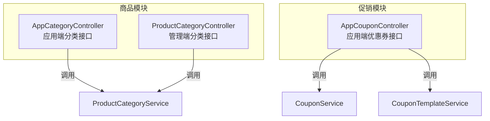
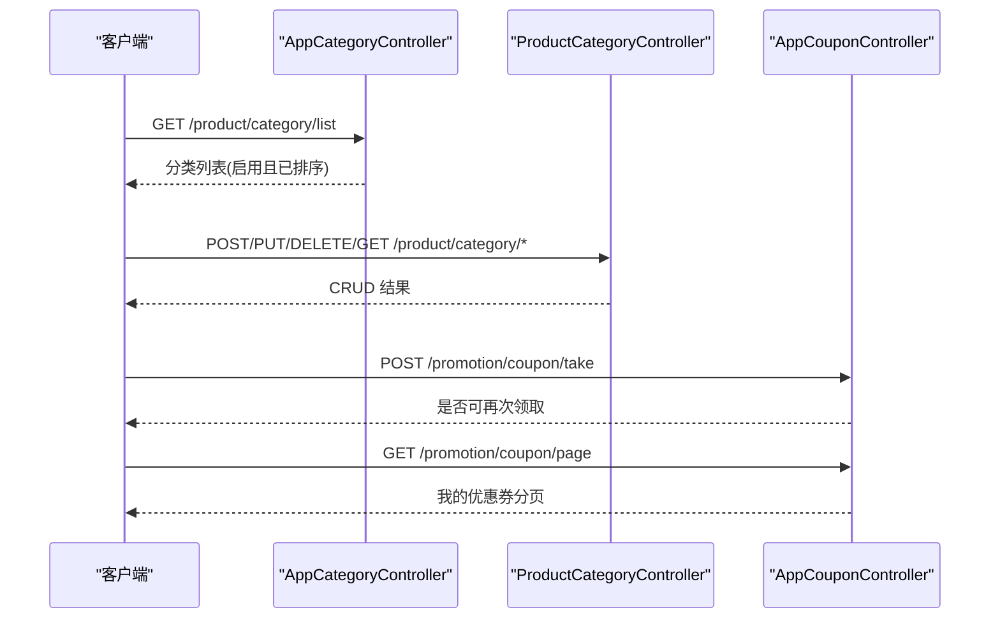
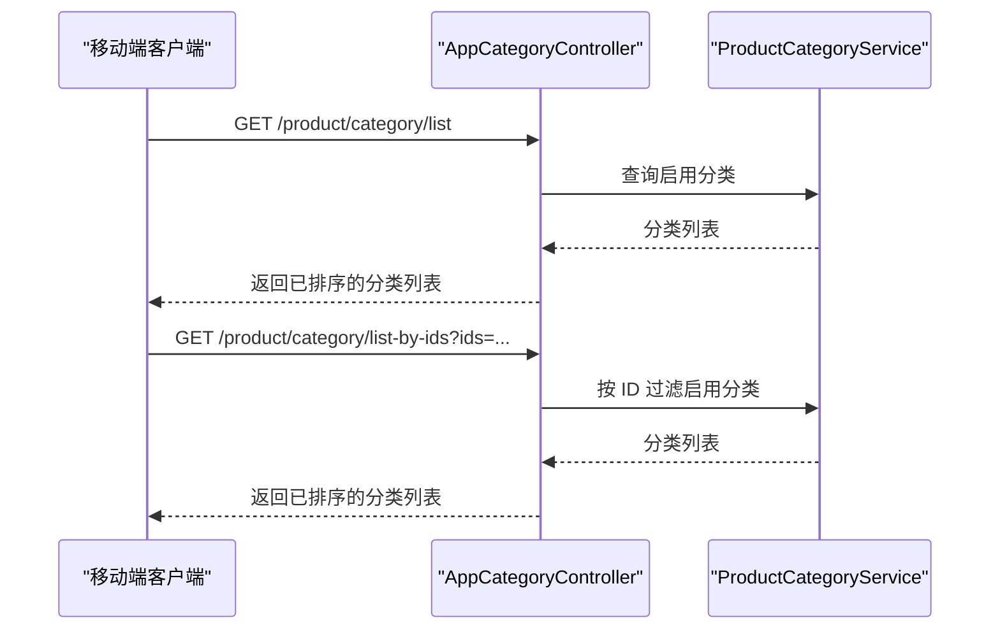
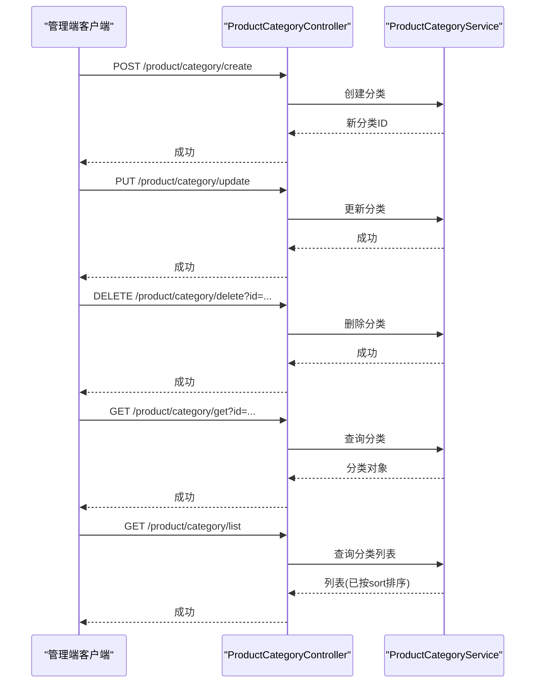
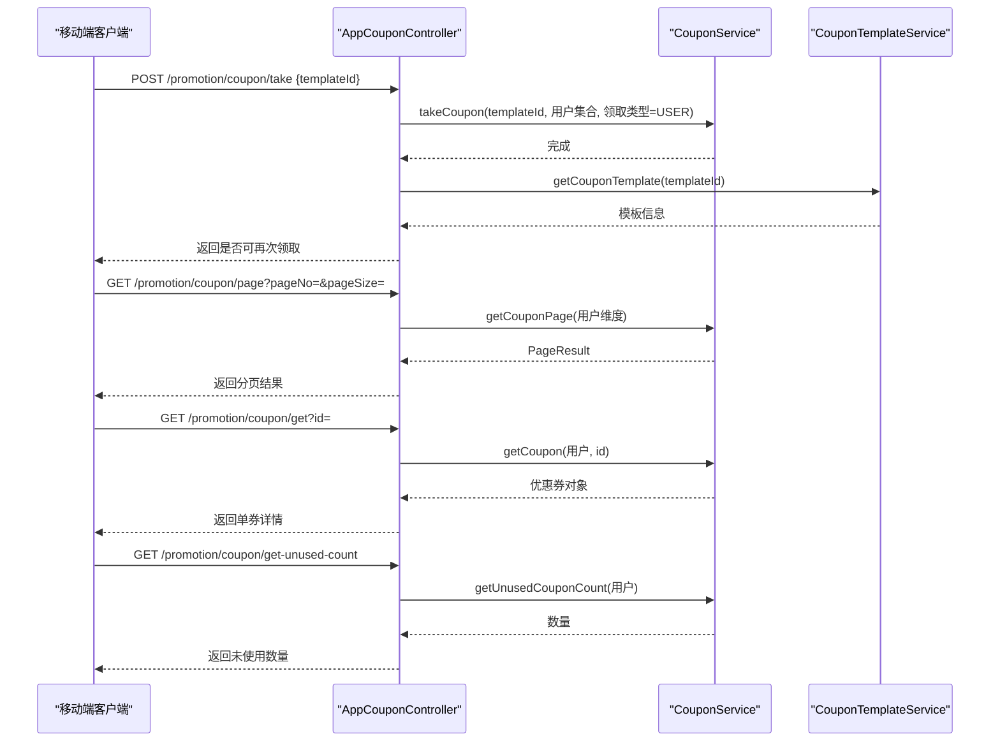
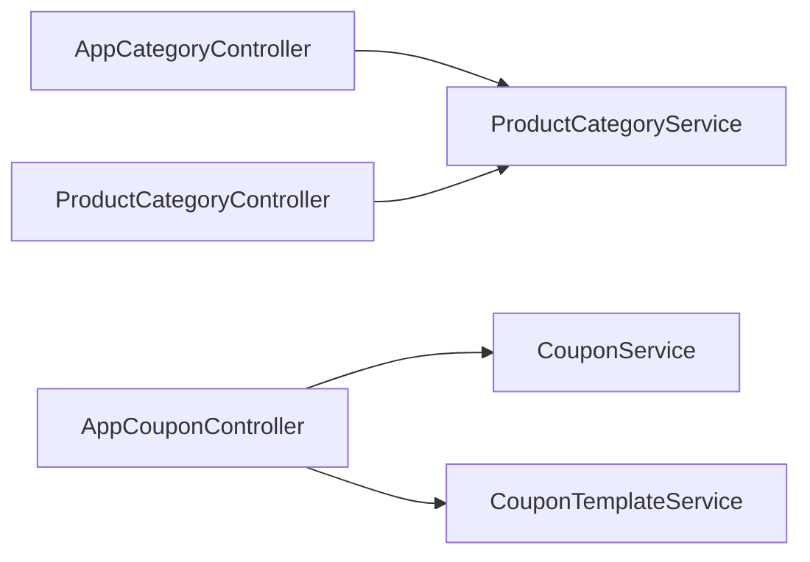

# 商品相关接口

<cite>
**本文档引用的文件**
- [AppCategoryController.java](file://backend/yudao-module-mall/yudao-module-product/src/main/java/.../app/category/AppCategoryController.java)
- [ProductCategoryController.java](file://backend/yudao-module-mall/yudao-module-product/src/main/java/.../admin/category/ProductCategoryController.java)
- [AppCouponController.java](file://backend/yudao-module-mall/yudao-module-promotion/src/main/java/.../app/coupon/AppCouponController.java)
</cite>

## 目录
1. [简介](#简介)
2. [项目结构](#项目结构)
3. [核心组件](#核心组件)
4. [架构总览](#架构总览)
5. [详细组件分析](#详细组件分析)
6. [依赖分析](#依赖分析)
7. [性能考虑](#性能考虑)
8. [故障排除指南](#故障排除指南)
9. [结论](#结论)

## 简介
本文件面向移动端与管理后台，系统性梳理商品相关接口，包括：
- 商品搜索：查询参数、排序规则、分页机制
- 商品详情：数据结构、图片展示、规格选择
- 商品分类：树形结构、启用状态、批量查询
- 促销活动：参与条件、优惠规则
- 优惠券：领取、使用、查询等业务逻辑

为便于不同技术背景读者理解，文档采用“概念+流程图+接口定义”的方式组织内容，并在涉及具体实现处提供“章节来源”以便追溯。

## 项目结构
商品相关能力主要分布在以下模块：
- 商品模块（product）：负责商品分类的管理与应用层接口
- 促销模块（promotion）：负责优惠券的模板、发放、核销等业务

图表来源
- [AppCategoryController.java:30-57](file://backend/yudao-module-mall/yudao-module-product/src/main/java/.../app/category/AppCategoryController.java#L30-L57)
- [ProductCategoryController.java:28-75](file://backend/yudao-module-mall/yudao-module-product/src/main/java/.../admin/category/ProductCategoryController.java#L28-L75)
- [AppCouponController.java:33-80](file://backend/yudao-module-mall/yudao-module-promotion/src/main/java/.../app/coupon/AppCouponController.java#L33-L80)

章节来源
- [AppCategoryController.java:30-57](file://backend/yudao-module-mall/yudao-module-product/src/main/java/.../app/category/AppCategoryController.java#L30-L57)
- [ProductCategoryController.java:28-75](file://backend/yudao-module-mall/yudao-module-product/src/main/java/.../admin/category/ProductCategoryController.java#L28-L75)
- [AppCouponController.java:33-80](file://backend/yudao-module-mall/yudao-module-promotion/src/main/java/.../app/coupon/AppCouponController.java#L33-L80)

## 核心组件
- 应用端商品分类接口：提供分类列表查询、按 ID 批量查询
- 管理端商品分类接口：提供创建、更新、删除、查询、列表等完整 CRUD 能力
- 应用端优惠券接口：提供领取、分页查询、单券查询、未使用数量统计

章节来源
- [AppCategoryController.java:35-55](file://backend/yudao-module-mall/yudao-module-product/src/main/java/.../app/category/AppCategoryController.java#L35-L55)
- [ProductCategoryController.java:33-73](file://backend/yudao-module-mall/yudao-module-product/src/main/java/.../admin/category/ProductCategoryController.java#L33-L73)
- [AppCouponController.java:40-78](file://backend/yudao-module-mall/yudao-module-promotion/src/main/java/.../app/coupon/AppCouponController.java#L40-L78)

## 架构总览
下图展示移动端与管理端商品分类、优惠券接口的调用关系与职责边界：

图表来源
- [AppCategoryController.java:35-55](file://backend/yudao-module-mall/yudao-module-product/src/main/java/.../app/category/AppCategoryController.java#L35-L55)
- [ProductCategoryController.java:33-73](file://backend/yudao-module-mall/yudao-module-product/src/main/java/.../admin/category/ProductCategoryController.java#L33-L73)
- [AppCouponController.java:40-78](file://backend/yudao-module-mall/yudao-module-promotion/src/main/java/.../app/coupon/AppCouponController.java#L40-L78)

## 详细组件分析

### 商品分类接口
- 接口目标：移动端展示可用分类，支持按 ID 列表批量查询
- 关键行为
  - 获取全部启用分类并按 sort 字段升序排列
  - 支持传入 ID 数组进行批量过滤
- 请求与响应要点
  - GET /product/category/list
    - 权限：允许所有用户访问
    - 响应：分类列表（启用且已排序）
  - GET /product/category/list-by-ids?ids=1&ids=2
    - 权限：允许所有用户访问
    - 参数：ids（分类编号数组）
    - 响应：对应 ID 的启用分类列表（已排序）

图表来源
- [AppCategoryController.java:35-55](file://backend/yudao-module-mall/yudao-module-product/src/main/java/.../app/category/AppCategoryController.java#L35-L55)

章节来源
- [AppCategoryController.java:35-55](file://backend/yudao-module-mall/yudao-module-product/src/main/java/.../app/category/AppCategoryController.java#L35-L55)

### 管理端商品分类接口
- 接口目标：后台对商品分类进行全量维护
- 关键行为
  - 创建、更新、删除、单个查询、列表查询
  - 列表按 sort 字段升序排列
- 权限控制：均需相应权限（如 product:category:create/update/query/delete）

图表来源
- [ProductCategoryController.java:33-73](file://backend/yudao-module-mall/yudao-module-product/src/main/java/.../admin/category/ProductCategoryController.java#L33-L73)

章节来源
- [ProductCategoryController.java:33-73](file://backend/yudao-module-mall/yudao-module-product/src/main/java/.../admin/category/ProductCategoryController.java#L33-L73)

### 优惠券接口
- 接口目标：移动端用户完成优惠券的领取、查询与统计
- 关键行为
  - 领取优惠券：根据模板编号领取，返回是否可再次领取
  - 我的优惠券分页：按用户维度分页查询
  - 单券查询：按用户与券编号查询
  - 未使用数量统计：按用户统计未使用数量
- 参考流程

图表来源
- [AppCouponController.java:40-78](file://backend/yudao-module-mall/yudao-module-promotion/src/main/java/.../app/coupon/AppCouponController.java#L40-L78)

章节来源
- [AppCouponController.java:40-78](file://backend/yudao-module-mall/yudao-module-promotion/src/main/java/.../app/coupon/AppCouponController.java#L40-L78)

## 依赖分析
- 控制器到服务层：各控制器通过资源注入调用对应 Service
- 服务层到数据层：Service 负责业务编排与校验，DAO 层负责数据持久化
- 依赖方向清晰，控制器仅承担路由与参数转换职责，耦合度低、内聚性强

图表来源
- [AppCategoryController.java:32-33](file://backend/yudao-module-mall/yudao-module-product/src/main/java/.../app/category/AppCategoryController.java#L32-L33)
- [ProductCategoryController.java:30-31](file://backend/yudao-module-mall/yudao-module-product/src/main/java/.../admin/category/ProductCategoryController.java#L30-L31)
- [AppCouponController.java:35-38](file://backend/yudao-module-mall/yudao-module-promotion/src/main/java/.../app/coupon/AppCouponController.java#L35-L38)

章节来源
- [AppCategoryController.java:32-33](file://backend/yudao-module-mall/yudao-module-product/src/main/java/.../app/category/AppCategoryController.java#L32-L33)
- [ProductCategoryController.java:30-31](file://backend/yudao-module-mall/yudao-module-product/src/main/java/.../admin/category/ProductCategoryController.java#L30-L31)
- [AppCouponController.java:35-38](file://backend/yudao-module-mall/yudao-module-promotion/src/main/java/.../app/coupon/AppCouponController.java#L35-L38)

## 性能考虑
- 分类查询：列表按 sort 升序返回，建议前端缓存启用分类树，减少重复请求
- 优惠券分页：建议合理设置分页大小，避免一次性加载过多数据
- 领取限制：后端会基于模板的领取上限判断是否可再次领取，前端应据此提示用户

## 故障排除指南
- 401 未授权：管理端接口需要登录态与相应权限，请确认登录与权限配置
- 403 拒绝访问：当前用户缺少 product:category:* 或 promotion:* 权限
- 404 资源不存在：查询的分类或优惠券不存在
- 400 参数错误：请求参数不合法（如 ID 缺失、格式错误）
- 业务异常：如超过领取上限、模板无效等，以通用结果中的错误码与消息为准

## 结论
本文档梳理了移动端与管理端的商品分类与优惠券接口，明确了请求路径、参数、响应与典型流程。实际开发中请结合通用返回结构与错误码进行集成，并遵循权限与安全策略。