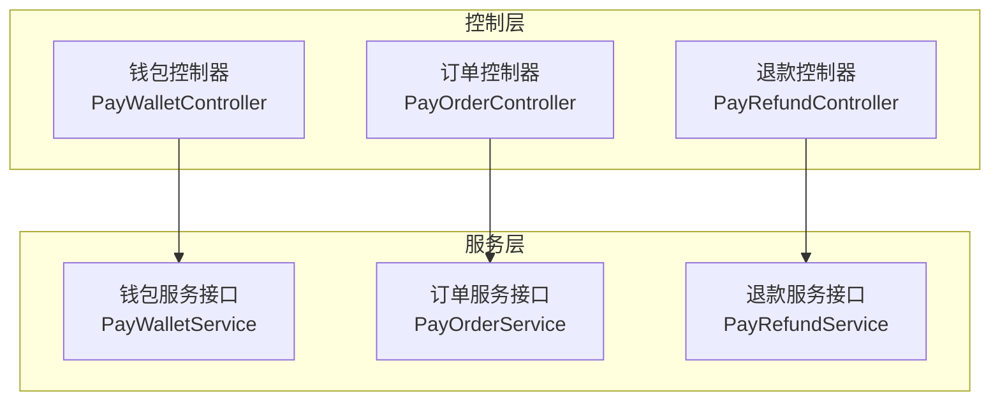
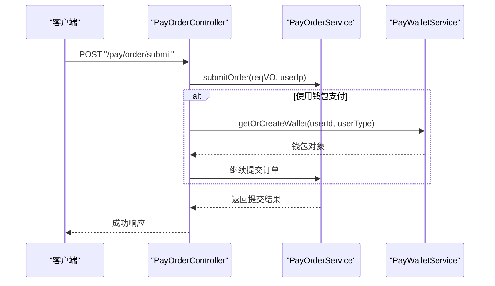
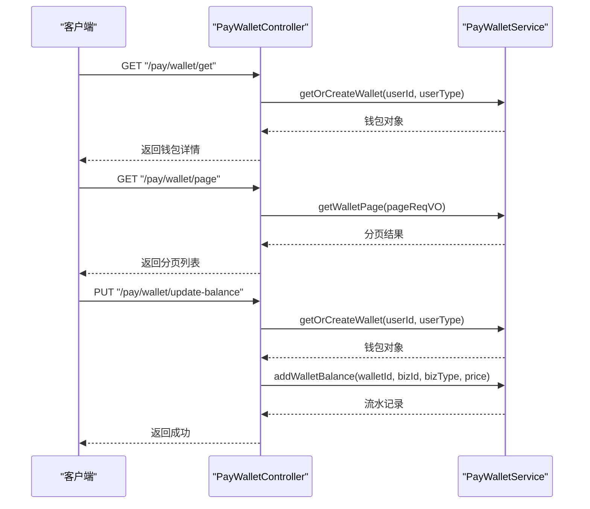
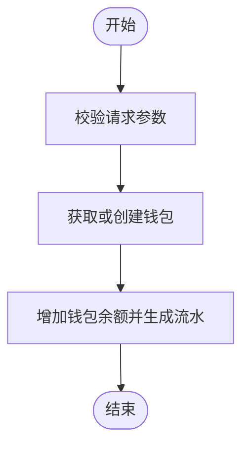
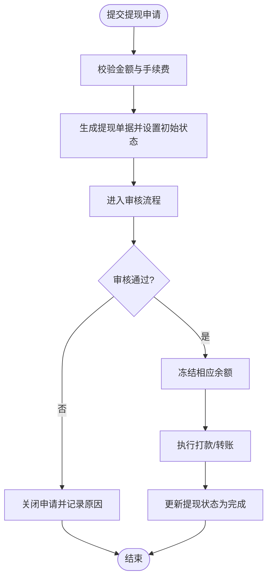
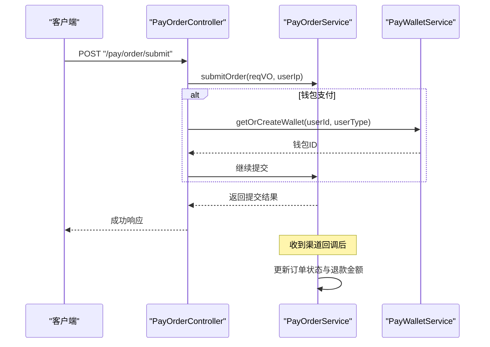
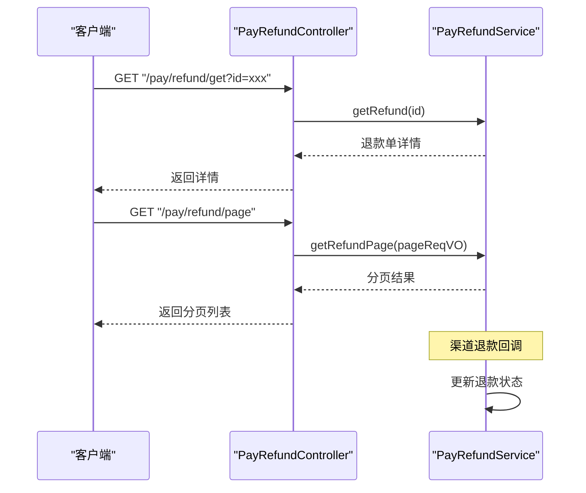
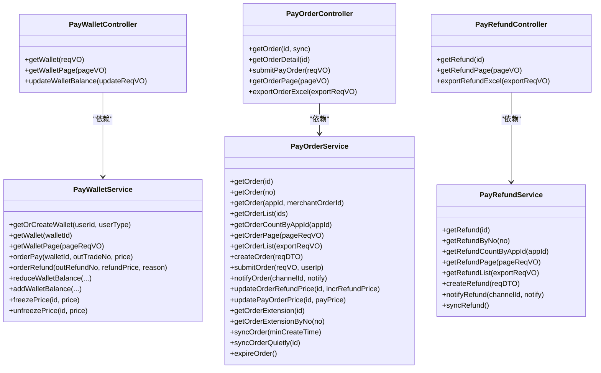

# 支付相关接口

<cite>
**本文档引用的文件**
- [PayWalletController.java](file://backend/yudao-module-pay/src/main/java/cn/iocoder/yudao/module/pay/controller/admin/wallet/PayWalletController.java)
- [PayOrderController.java](file://backend/yudao-module-pay/src/main/java/cn/iocoder/yudao/module/pay/controller/admin/order/PayOrderController.java)
- [PayRefundController.java](file://backend/yudao-module-pay/src/main/java/cn/iocoder/yudao/module/pay/controller/admin/refund/PayRefundController.java)
- [PayWalletService.java](file://backend/yudao-module-pay/src/main/java/cn/iocoder/yudao/module/pay/service/wallet/PayWalletService.java)
- [PayOrderService.java](file://backend/yudao-module-pay/src/main/java/cn/iocoder/yudao/module/pay/service/order/PayOrderService.java)
- [PayRefundService.java](file://backend/yudao-module-pay/src/main/java/cn/iocoder/yudao/module/pay/service/refund/PayRefundService.java)
</cite>

## 目录
1. [简介](#简介)
2. [项目结构](#项目结构)
3. [核心组件](#核心组件)
4. [架构总览](#架构总览)
5. [详细组件分析](#详细组件分析)
6. [依赖关系分析](#依赖关系分析)
7. [性能考虑](#性能考虑)
8. [故障排除指南](#故障排除指南)
9. [结论](#结论)

## 简介
本文件面向移动端与管理后台的支付相关接口，覆盖钱包管理、余额充值、提现申请、支付订单、退款处理等核心功能。文档从接口定义、数据流、处理逻辑、安全与风控规范等方面进行系统化说明，并提供可视化图示帮助理解。

## 项目结构
支付模块采用分层架构：控制层负责对外暴露REST接口，服务层封装业务逻辑，DAO层负责数据访问。钱包、订单、退款分别由独立的服务接口与控制器支撑，便于扩展与维护。

图表来源
- [PayWalletController.java:1-71](file://backend/yudao-module-pay/src/main/java/cn/iocoder/yudao/module/pay/controller/admin/wallet/PayWalletController.java#L1-L71)
- [PayOrderController.java:1-146](file://backend/yudao-module-pay/src/main/java/cn/iocoder/yudao/module/pay/controller/admin/order/PayOrderController.java#L1-L146)
- [PayRefundController.java:1-91](file://backend/yudao-module-pay/src/main/java/cn/iocoder/yudao/module/pay/controller/admin/refund/PayRefundController.java#L1-L91)
- [PayWalletService.java:1-100](file://backend/yudao-module-pay/src/main/java/cn/iocoder/yudao/module/pay/service/wallet/PayWalletService.java#L1-L100)
- [PayOrderService.java:1-168](file://backend/yudao-module-pay/src/main/java/cn/iocoder/yudao/module/pay/service/order/PayOrderService.java#L1-L168)
- [PayRefundService.java:1-83](file://backend/yudao-module-pay/src/main/java/cn/iocoder/yudao/module/pay/service/refund/PayRefundService.java#L1-L83)

章节来源
- [PayWalletController.java:1-71](file://backend/yudao-module-pay/src/main/java/cn/iocoder/yudao/module/pay/controller/admin/wallet/PayWalletController.java#L1-L71)
- [PayOrderController.java:1-146](file://backend/yudao-module-pay/src/main/java/cn/iocoder/yudao/module/pay/controller/admin/order/PayOrderController.java#L1-L146)
- [PayRefundController.java:1-91](file://backend/yudao-module-pay/src/main/java/cn/iocoder/yudao/module/pay/controller/admin/refund/PayRefundController.java#L1-L91)
- [PayWalletService.java:1-100](file://backend/yudao-module-pay/src/main/java/cn/iocoder/yudao/module/pay/service/wallet/PayWalletService.java#L1-L100)
- [PayOrderService.java:1-168](file://backend/yudao-module-pay/src/main/java/cn/iocoder/yudao/module/pay/service/order/PayOrderService.java#L1-L168)
- [PayRefundService.java:1-83](file://backend/yudao-module-pay/src/main/java/cn/iocoder/yudao/module/pay/service/refund/PayRefundService.java#L1-L83)

## 核心组件
- 钱包服务接口：提供钱包查询、余额增减、冻结解冻、交易流水等能力。
- 订单服务接口：提供订单创建、提交、同步、回调处理、退款金额更新等能力。
- 退款服务接口：提供退款申请、退款状态同步、回调处理等能力。
- 控制器：对上述服务进行HTTP接口封装，提供分页查询、详情拼装、Excel导出等功能。

章节来源
- [PayWalletService.java:14-99](file://backend/yudao-module-pay/src/main/java/cn/iocoder/yudao/module/pay/service/wallet/PayWalletService.java#L14-L99)
- [PayOrderService.java:24-167](file://backend/yudao-module-pay/src/main/java/cn/iocoder/yudao/module/pay/service/order/PayOrderService.java#L24-L167)
- [PayRefundService.java:17-82](file://backend/yudao-module-pay/src/main/java/cn/iocoder/yudao/module/pay/service/refund/PayRefundService.java#L17-L82)

## 架构总览
支付相关接口遵循“控制器-服务-数据访问”的分层设计，控制器负责参数校验、权限控制与响应封装，服务层负责业务编排与跨模块协作，DAO层负责持久化操作。

图表来源
- [PayOrderController.java:94-109](file://backend/yudao-module-pay/src/main/java/cn/iocoder/yudao/module/pay/controller/admin/order/PayOrderController.java#L94-L109)
- [PayOrderService.java:99-100](file://backend/yudao-module-pay/src/main/java/cn/iocoder/yudao/module/pay/service/order/PayOrderService.java#L99-L100)
- [PayWalletService.java:24](file://backend/yudao-module-pay/src/main/java/cn/iocoder/yudao/module/pay/service/wallet/PayWalletService.java#L24)

## 详细组件分析

### 钱包管理接口
- 功能范围
  - 查询用户钱包详情
  - 获取钱包分页列表
  - 更新用户余额（管理员）
- 关键流程
  - 查询详情：根据用户ID获取或创建钱包，返回钱包余额、冻结金额等信息。
  - 分页查询：支持按条件分页，返回钱包列表。
  - 余额调整：管理员可对用户余额进行增加或减少，同时生成对应业务流水。

图表来源
- [PayWalletController.java:37-70](file://backend/yudao-module-pay/src/main/java/cn/iocoder/yudao/module/pay/controller/admin/wallet/PayWalletController.java#L37-L70)
- [PayWalletService.java:24](file://backend/yudao-module-pay/src/main/java/cn/iocoder/yudao/module/pay/service/wallet/PayWalletService.java#L24)
- [PayWalletService.java:39](file://backend/yudao-module-pay/src/main/java/cn/iocoder/yudao/module/pay/service/wallet/PayWalletService.java#L39)
- [PayWalletService.java:80-81](file://backend/yudao-module-pay/src/main/java/cn/iocoder/yudao/module/pay/service/wallet/PayWalletService.java#L80-L81)

章节来源
- [PayWalletController.java:37-70](file://backend/yudao-module-pay/src/main/java/cn/iocoder/yudao/module/pay/controller/admin/wallet/PayWalletController.java#L37-L70)
- [PayWalletService.java:14-99](file://backend/yudao-module-pay/src/main/java/cn/iocoder/yudao/module/pay/service/wallet/PayWalletService.java#L14-L99)

### 余额充值接口
- 功能范围
  - 通过钱包余额充值，支持管理员手动调整余额。
- 设计要点
  - 充值通过“增加钱包余额”实现，记录业务流水，便于审计与对账。
  - 充值金额需为正数，业务类型区分“余额调整”。

图表来源
- [PayWalletController.java:53-68](file://backend/yudao-module-pay/src/main/java/cn/iocoder/yudao/module/pay/controller/admin/wallet/PayWalletController.java#L53-L68)
- [PayWalletService.java:80-81](file://backend/yudao-module-pay/src/main/java/cn/iocoder/yudao/module/pay/service/wallet/PayWalletService.java#L80-L81)

章节来源
- [PayWalletController.java:53-68](file://backend/yudao-module-pay/src/main/java/cn/iocoder/yudao/module/pay/controller/admin/wallet/PayWalletController.java#L53-L68)
- [PayWalletService.java:71-81](file://backend/yudao-module-pay/src/main/java/cn/iocoder/yudao/module/pay/service/wallet/PayWalletService.java#L71-L81)

### 提现申请接口
- 功能范围
  - 提现申请的提交、审核与状态流转。
- 设计要点
  - 提现金额限制与手续费计算应由业务规则统一约束。
  - 审核流程建议引入工作流引擎或状态机，确保合规与可追溯。
  - 提现成功后应进行资金冻结与解冻处理，避免重复提现。

说明
- 该图为概念性流程，具体实现需结合业务规则与风控策略。

### 订单支付接口
- 功能范围
  - 订单提交、支付渠道选择、安全验证、支付结果通知与状态同步。
- 关键流程
  - 提交订单：当使用钱包支付时，自动注入钱包标识，调用订单服务提交。
  - 支付渠道：支持多种支付渠道，订单服务负责与渠道交互。
  - 安全验证：控制器层进行参数校验与权限校验，服务层进行业务校验。
  - 结果通知：接收渠道回调，更新订单状态并处理退款金额。

图表来源
- [PayOrderController.java:94-109](file://backend/yudao-module-pay/src/main/java/cn/iocoder/yudao/module/pay/controller/admin/order/PayOrderController.java#L94-L109)
- [PayOrderService.java:99-108](file://backend/yudao-module-pay/src/main/java/cn/iocoder/yudao/module/pay/service/order/PayOrderService.java#L99-L108)

章节来源
- [PayOrderController.java:94-109](file://backend/yudao-module-pay/src/main/java/cn/iocoder/yudao/module/pay/controller/admin/order/PayOrderController.java#L94-L109)
- [PayOrderService.java:92-108](file://backend/yudao-module-pay/src/main/java/cn/iocoder/yudao/module/pay/service/order/PayOrderService.java#L92-L108)

### 退款处理接口
- 功能范围
  - 退款申请、退款状态同步、退款结果通知。
- 关键流程
  - 申请退款：根据订单状态与金额进行校验，生成退款单。
  - 状态同步：定期或被动同步渠道退款状态，更新本地状态。
  - 结果通知：接收渠道退款回调，完成资金退回与账务处理。

图表来源
- [PayRefundController.java:46-88](file://backend/yudao-module-pay/src/main/java/cn/iocoder/yudao/module/pay/controller/admin/refund/PayRefundController.java#L46-L88)
- [PayRefundService.java:25](file://backend/yudao-module-pay/src/main/java/cn/iocoder/yudao/module/pay/service/refund/PayRefundService.java#L25)
- [PayRefundService.java:49](file://backend/yudao-module-pay/src/main/java/cn/iocoder/yudao/module/pay/service/refund/PayRefundService.java#L49)
- [PayRefundService.java:73](file://backend/yudao-module-pay/src/main/java/cn/iocoder/yudao/module/pay/service/refund/PayRefundService.java#L73)

章节来源
- [PayRefundController.java:46-88](file://backend/yudao-module-pay/src/main/java/cn/iocoder/yudao/module/pay/controller/admin/refund/PayRefundController.java#L46-L88)
- [PayRefundService.java:17-82](file://backend/yudao-module-pay/src/main/java/cn/iocoder/yudao/module/pay/service/refund/PayRefundService.java#L17-L82)

## 依赖关系分析
- 控制器依赖服务接口：控制器通过资源注入使用服务接口，实现关注点分离。
- 服务间协作：订单服务在钱包支付场景下依赖钱包服务；退款服务与订单服务通过单据号与状态进行协同。
- 权限控制：控制器使用注解进行权限校验，确保接口访问安全。

图表来源
- [PayWalletController.java:34-35](file://backend/yudao-module-pay/src/main/java/cn/iocoder/yudao/module/pay/controller/admin/wallet/PayWalletController.java#L34-L35)
- [PayOrderController.java:52-57](file://backend/yudao-module-pay/src/main/java/cn/iocoder/yudao/module/pay/controller/admin/order/PayOrderController.java#L52-L57)
- [PayRefundController.java:41-44](file://backend/yudao-module-pay/src/main/java/cn/iocoder/yudao/module/pay/controller/admin/refund/PayRefundController.java#L41-L44)
- [PayWalletService.java:14-99](file://backend/yudao-module-pay/src/main/java/cn/iocoder/yudao/module/pay/service/wallet/PayWalletService.java#L14-L99)
- [PayOrderService.java:24-167](file://backend/yudao-module-pay/src/main/java/cn/iocoder/yudao/module/pay/service/order/PayOrderService.java#L24-L167)
- [PayRefundService.java:17-82](file://backend/yudao-module-pay/src/main/java/cn/iocoder/yudao/module/pay/service/refund/PayRefundService.java#L17-L82)

章节来源
- [PayWalletController.java:34-35](file://backend/yudao-module-pay/src/main/java/cn/iocoder/yudao/module/pay/controller/admin/wallet/PayWalletController.java#L34-L35)
- [PayOrderController.java:52-57](file://backend/yudao-module-pay/src/main/java/cn/iocoder/yudao/module/pay/controller/admin/order/PayOrderController.java#L52-L57)
- [PayRefundController.java:41-44](file://backend/yudao-module-pay/src/main/java/cn/iocoder/yudao/module/pay/controller/admin/refund/PayRefundController.java#L41-L44)
- [PayWalletService.java:14-99](file://backend/yudao-module-pay/src/main/java/cn/iocoder/yudao/module/pay/service/wallet/PayWalletService.java#L14-L99)
- [PayOrderService.java:24-167](file://backend/yudao-module-pay/src/main/java/cn/iocoder/yudao/module/pay/service/order/PayOrderService.java#L24-L167)
- [PayRefundService.java:17-82](file://backend/yudao-module-pay/src/main/java/cn/iocoder/yudao/module/pay/service/refund/PayRefundService.java#L17-L82)

## 性能考虑
- 分页查询：钱包与退款均提供分页接口，建议合理设置分页大小与排序字段，避免一次性加载过多数据。
- 导出优化：Excel导出前先进行空数据判断，避免生成空文件。
- 状态同步：订单与退款的状态同步建议采用定时任务或消息队列，降低实时同步带来的压力。
- 并发控制：余额增减与冻结解冻需保证原子性，必要时引入分布式锁或数据库层面的乐观锁。

## 故障排除指南
- 钱包不存在：当尝试更新余额时若钱包不存在，应抛出相应错误码并提示管理员检查用户状态。
- 订单状态异常：若订单处于等待支付状态且同步失败，建议重试或人工干预，避免与渠道回调并发冲突。
- 退款状态不一致：定期执行退款状态同步，确保本地状态与渠道状态一致；对异常状态进行告警与人工复核。

章节来源
- [PayWalletController.java:59-62](file://backend/yudao-module-pay/src/main/java/cn/iocoder/yudao/module/pay/controller/admin/wallet/PayWalletController.java#L59-L62)
- [PayOrderController.java:69-74](file://backend/yudao-module-pay/src/main/java/cn/iocoder/yudao/module/pay/controller/admin/order/PayOrderController.java#L69-L74)
- [PayRefundService.java:80](file://backend/yudao-module-pay/src/main/java/cn/iocoder/yudao/module/pay/service/refund/PayRefundService.java#L80)

## 结论
本文档梳理了支付模块的核心接口与处理流程，明确了钱包、订单、退款三类业务的职责边界与协作关系。建议在实际落地中补充提现申请的金额限制与手续费计算规则、完善风控策略与审计日志，并持续优化状态同步与导出性能，以保障系统的稳定性与可维护性。