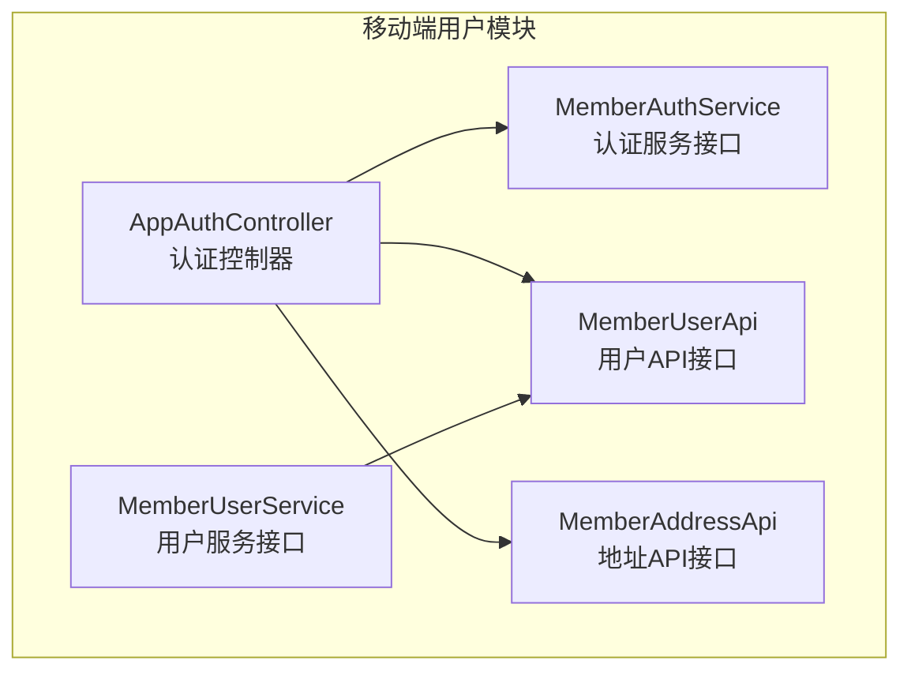
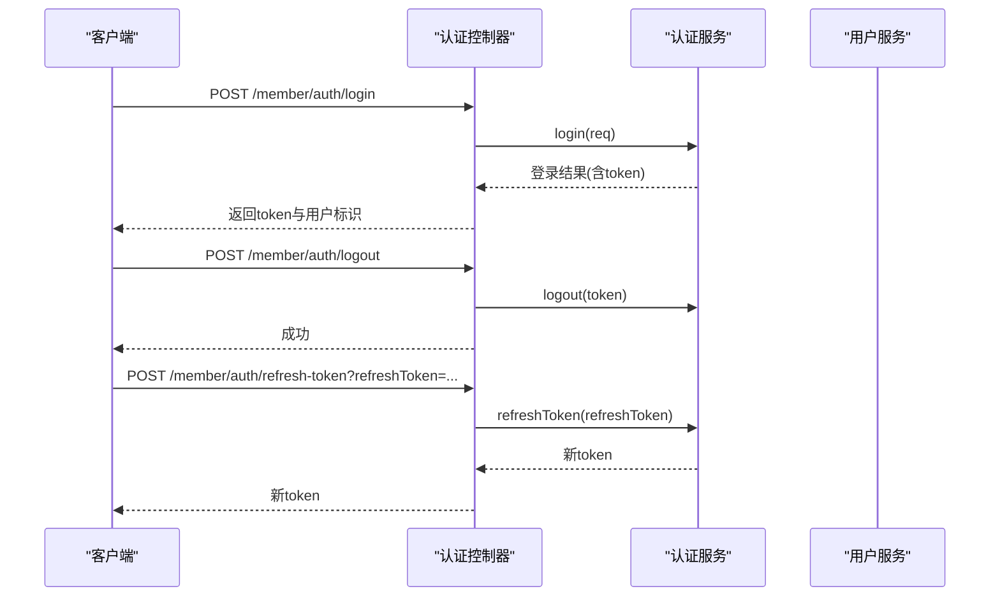
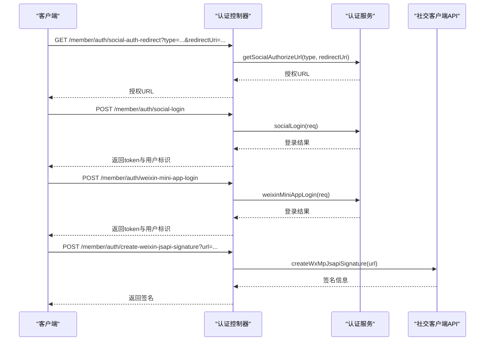
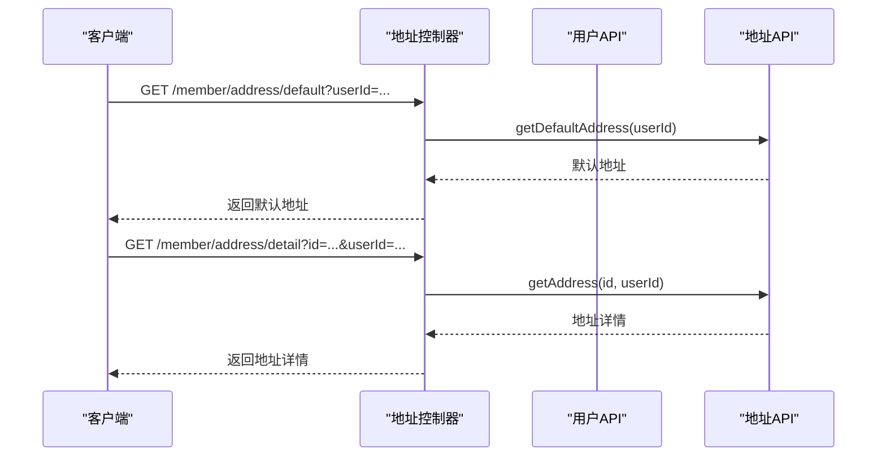
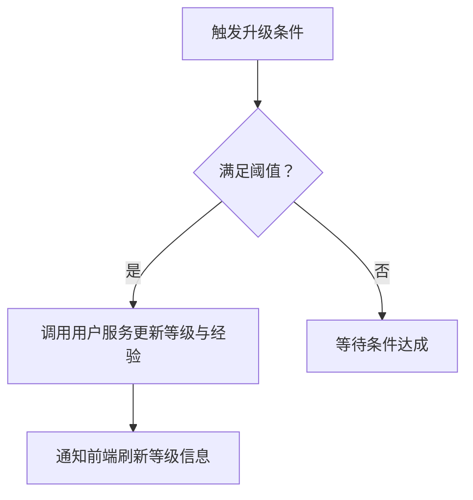
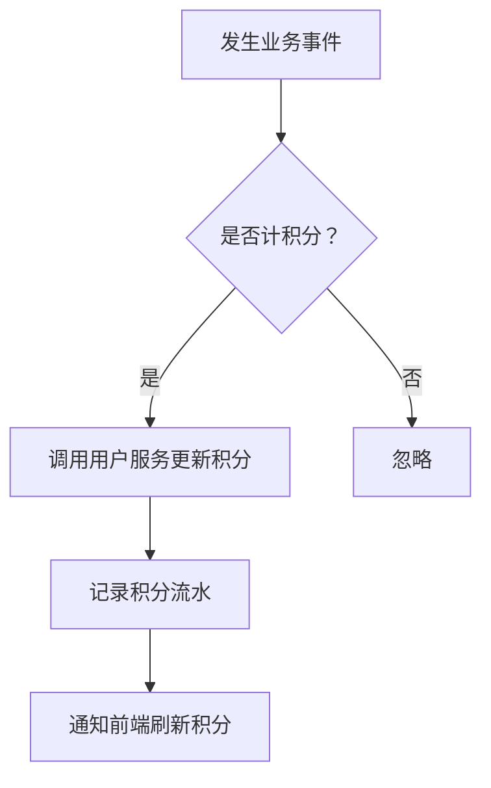
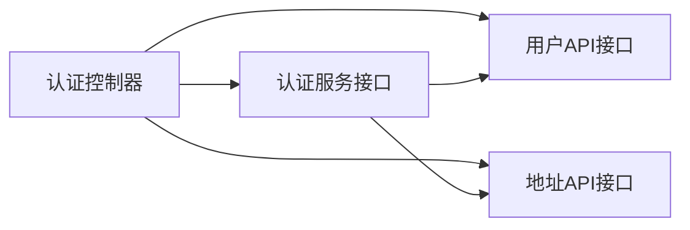

# 用户相关接口

<cite>
**本文引用的文件**
- [AppAuthController.java](file://backend/yudao-module-member/src/main/java/cn/iocoder/yudao/module/member/controller/app/auth/AppAuthController.java)
- [MemberAuthService.java](file://backend/yudao-module-member/src/main/java/cn/iocoder/ yudao/module/member/service/auth/MemberAuthService.java)
- [MemberUserApi.java](file://backend/yudao-module-member/src/main/java/cn/iocoder/yudao/module/member/api/user/MemberUserApi.java)
- [MemberUserService.java](file://backend/yudao-module-member/src/main/java/cn/iocoder/yudao/module/member/service/user/MemberUserService.java)
- [MemberAddressApi.java](file://backend/yudao-module-member/src/main/java/cn/iocoder/yudao/module/member/api/address/MemberAddressApi.java)
</cite>

## 目录
1. [简介](#简介)
2. [项目结构](#项目结构)
3. [核心组件](#核心组件)
4. [架构总览](#架构总览)
5. [详细组件分析](#详细组件分析)
6. [依赖分析](#依赖分析)
7. [性能考虑](#性能考虑)
8. [故障排查指南](#故障排查指南)
9. [结论](#结论)
10. [附录](#附录)

## 简介
本文件聚焦移动端用户相关接口，覆盖用户认证（登录、登出、令牌刷新、多种登录方式）、个人信息管理（基础资料与密码修改）、地址管理（查询与默认地址）、等级权益（等级与经验变更）、积分系统（积分更新）。同时给出数据安全与隐私保护的设计要点与最佳实践。

## 项目结构
用户相关能力主要位于后端 yudao-module-member 模块中，采用“控制器-服务-接口”分层：
- 控制器层：对外暴露 REST 接口，负责参数接收、鉴权注解与响应封装
- 服务层：实现业务逻辑，如登录、登出、令牌刷新、个人信息与地址查询等
- API 层：定义跨模块调用的 DTO 接口，便于系统内其他模块安全访问用户信息



图表来源
- [AppAuthController.java:1-136](file://backend/yudao-module-member/src/main/java/cn/iocoder/yudao/module/member/controller/app/auth/AppAuthController.java#L1-L136)
- [MemberAuthService.java:1-89](file://backend/yudao-module-member/src/main/java/cn/iocoder/yudao/module/member/service/auth/MemberAuthService.java#L1-L89)
- [MemberUserService.java:1-191](file://backend/yudao-module-member/src/main/java/cn/iocoder/yudao/module/member/service/user/MemberUserService.java#L1-L191)
- [MemberUserApi.java:1-69](file://backend/yudao-module-member/src/main/java/cn/iocoder/yudao/module/member/api/user/MemberUserApi.java#L1-L69)
- [MemberAddressApi.java:1-30](file://backend/yudao-module-member/src/main/java/cn/iocoder/yudao/module/member/api/address/MemberAddressApi.java#L1-L30)

章节来源
- [AppAuthController.java:1-136](file://backend/yudao-module-member/src/main/java/cn/iocoder/yudao/module/member/controller/app/auth/AppAuthController.java#L1-L136)
- [MemberAuthService.java:1-89](file://backend/yudao-module-member/src/main/java/cn/iocoder/yudao/module/member/service/auth/MemberAuthService.java#L1-L89)
- [MemberUserService.java:1-191](file://backend/yudao-module-member/src/main/java/cn/iocoder/yudao/module/member/service/user/MemberUserService.java#L1-L191)
- [MemberUserApi.java:1-69](file://backend/yudao-module-member/src/main/java/cn/iocoder/yudao/module/member/api/user/MemberUserApi.java#L1-L69)
- [MemberAddressApi.java:1-30](file://backend/yudao-module-member/src/main/java/cn/iocoder/yudao/module/member/api/address/MemberAddressApi.java#L1-L30)

## 核心组件
- 认证控制器：提供登录、登出、令牌刷新、短信验证码、社交登录、微信小程序一键登录、微信 JS SDK 签名等接口
- 认证服务：实现登录、登出、刷新令牌、发送/校验短信验证码、社交授权 URL 生成、微信小程序一键登录等
- 用户服务：提供用户信息查询、基础资料更新、密码修改/重置、手机号修改、等级与经验变更、积分更新等
- 用户 API：面向系统内其他模块的安全查询接口
- 地址 API：面向系统内其他模块的地址查询接口（含默认地址）

章节来源
- [AppAuthController.java:45-133](file://backend/yudao-module-member/src/main/java/cn/iocoder/yudao/module/member/controller/app/auth/AppAuthController.java#L45-L133)
- [MemberAuthService.java:14-88](file://backend/yudao-module-member/src/main/java/cn/iocoder/yudao/module/member/service/auth/MemberAuthService.java#L14-L88)
- [MemberUserService.java:20-191](file://backend/yudao-module-member/src/main/java/cn/iocoder/yudao/module/member/service/user/MemberUserService.java#L20-L191)
- [MemberUserApi.java:16-68](file://backend/yudao-module-member/src/main/java/cn/iocoder/yudao/module/member/api/user/MemberUserApi.java#L16-L68)
- [MemberAddressApi.java:10-29](file://backend/yudao-module-member/src/main/java/cn/iocoder/yudao/module/member/api/address/MemberAddressApi.java#L10-L29)

## 架构总览
移动端用户接口遵循“控制器-服务-DAO/DTO”的分层架构，控制器负责请求入口与响应封装，服务层编排业务流程，API 层提供安全的跨模块查询能力。



图表来源
- [AppAuthController.java:45-70](file://backend/yudao-module-member/src/main/java/cn/iocoder/yudao/module/member/controller/app/auth/AppAuthController.java#L45-L70)
- [MemberAuthService.java:14-88](file://backend/yudao-module-member/src/main/java/cn/iocoder/yudao/module/member/service/auth/MemberAuthService.java#L14-L88)

## 详细组件分析

### 认证接口
- 登录
  - 方法：POST /member/auth/login
  - 功能：账号密码登录，返回登录结果（含访问令牌与用户标识）
  - 权限：允许未登录访问
- 登出
  - 方法：POST /member/auth/logout
  - 功能：基于请求头中的令牌执行登出
  - 权限：允许未登录访问
- 刷新令牌
  - 方法：POST /member/auth/refresh-token
  - 参数：refreshToken（刷新令牌）
  - 功能：刷新访问令牌
  - 权限：允许未登录访问
- 短信登录与验证码
  - 方法：POST /member/auth/sms-login
  - 方法：POST /member/auth/send-sms-code
  - 方法：POST /member/auth/validate-sms-code
  - 功能：手机 + 验证码登录、发送验证码、校验验证码
  - 权限：允许未登录访问
- 社交登录
  - 方法：GET /member/auth/social-auth-redirect
  - 方法：POST /member/auth/social-login
  - 功能：社交授权跳转与快捷登录
  - 权限：允许未登录访问
- 微信小程序一键登录
  - 方法：POST /member/auth/weixin-mini-app-login
  - 功能：使用小程序授权码一键登录
  - 权限：允许未登录访问
- 微信 JS SDK 签名
  - 方法：POST /member/auth/create-weixin-jsapi-signature
  - 功能：生成微信 JS SDK 初始化所需签名
  - 权限：允许未登录访问



图表来源
- [AppAuthController.java:99-133](file://backend/yudao-module-member/src/main/java/cn/iocoder/yudao/module/member/controller/app/auth/AppAuthController.java#L99-L133)
- [MemberAuthService.java:62-53](file://backend/yudao-module-member/src/main/java/cn/iocoder/yudao/module/member/service/auth/MemberAuthService.java#L62-L53)

章节来源
- [AppAuthController.java:45-133](file://backend/yudao-module-member/src/main/java/cn/iocoder/yudao/module/member/controller/app/auth/AppAuthController.java#L45-L133)
- [MemberAuthService.java:14-88](file://backend/yudao-module-member/src/main/java/cn/iocoder/yudao/module/member/service/auth/MemberAuthService.java#L14-L88)

### 个人信息管理
- 基础信息更新
  - 方法：PUT（需在控制器中定义）用于更新用户昵称、性别、生日、头像等
  - 权限：仅登录用户可操作
  - 字段校验：建议对昵称长度、生日格式、头像 URL 进行校验
- 手机号修改（验证码）
  - 方法：PUT（需在控制器中定义）用于基于验证码修改手机号
  - 权限：仅登录用户可操作
- 手机号修改（微信小程序）
  - 方法：PUT（需在控制器中定义）用于基于微信授权码修改手机号
  - 权限：仅登录用户可操作
- 密码修改
  - 方法：PUT（需在控制器中定义）用于修改登录密码
  - 权限：仅登录用户可操作
- 忘记密码
  - 方法：POST（需在控制器中定义）用于重置登录密码
  - 权限：允许未登录访问（需配合验证码或微信授权）

```mermaid
flowchart TD
Start(["进入个人信息管理"]) --> ChooseOp{"选择操作"}
ChooseOp --> |基础信息更新| UpdateInfo["调用用户服务更新信息"]
ChooseOp --> |手机号修改(验证码)| UpdateMobileSMS["发送/校验验证码并更新手机号"]
ChooseOp --> |手机号修改(微信)| UpdateMobileWX["微信授权码校验并更新手机号"]
ChooseOp --> |密码修改| UpdatePwd["校验旧密码并更新新密码"]
ChooseOp --> |忘记密码| ResetPwd["重置密码"]
UpdateInfo --> End(["完成"])
UpdateMobileSMS --> End
UpdateMobileWX --> End
UpdatePwd --> End
ResetPwd --> End
```

图表来源
- [MemberUserService.java:86-122](file://backend/yudao-module-member/src/main/java/cn/iocoder/yudao/module/member/service/user/MemberUserService.java#L86-L122)

章节来源
- [MemberUserService.java:86-122](file://backend/yudao-module-member/src/main/java/cn/iocoder/yudao/module/member/service/user/MemberUserService.java#L86-L122)

### 地址管理
- 查询单个地址
  - 方法：GET（需在控制器中定义）用于按地址 ID 与用户 ID 查询
  - 权限：仅登录用户可操作
- 查询默认地址
  - 方法：GET（需在控制器中定义）用于按用户 ID 查询默认地址
  - 权限：仅登录用户可操作
- 设置默认地址
  - 方法：PUT（需在控制器中定义）用于设置某地址为默认
  - 权限：仅登录用户可操作
- 新增/编辑/删除地址
  - 方法：POST/PUT/DELETE（需在控制器中定义）用于地址的增删改
  - 权限：仅登录用户可操作



图表来源
- [MemberAddressApi.java:19-27](file://backend/yudao-module-member/src/main/java/cn/iocoder/yudao/module/member/api/address/MemberAddressApi.java#L19-L27)

章节来源
- [MemberAddressApi.java:10-29](file://backend/yudao-module-member/src/main/java/cn/iocoder/yudao/module/member/api/address/MemberAddressApi.java#L10-L29)

### 等级权益
- 等级与经验变更
  - 方法：PUT（需在控制器中定义）用于更新用户等级与经验
  - 权限：仅登录用户可操作
  - 触发条件：消费金额、签到天数、邀请人数等（由业务策略决定）
- 特权内容
  - 不同等级享有不同折扣、运费券、专属客服等特权（由业务配置决定）



图表来源
- [MemberUserService.java:149-155](file://backend/yudao-module-member/src/main/java/cn/iocoder/yudao/module/member/service/user/MemberUserService.java#L149-L155)

章节来源
- [MemberUserService.java:149-155](file://backend/yudao-module-member/src/main/java/cn/iocoder/yudao/module/member/service/user/MemberUserService.java#L149-L155)

### 积分系统
- 积分更新
  - 方法：PUT（需在控制器中定义）用于增加/减少用户积分
  - 权限：仅登录用户可操作
  - 规则：签到、购买、评价、邀请等行为产生积分（由业务策略决定）
- 积分明细查询
  - 方法：GET（需在控制器中定义）用于查询积分变动明细
  - 权限：仅登录用户可操作



图表来源
- [MemberUserService.java:182-188](file://backend/yudao-module-member/src/main/java/cn/iocoder/yudao/module/member/service/user/MemberUserService.java#L182-L188)

章节来源
- [MemberUserService.java:182-188](file://backend/yudao-module-member/src/main/java/cn/iocoder/yudao/module/member/service/user/MemberUserService.java#L182-L188)

## 依赖分析
- 控制器依赖服务接口，服务接口依赖 DAO/DTO，API 接口提供跨模块安全查询
- 认证控制器同时依赖社交客户端 API，用于微信 JS SDK 签名



图表来源
- [AppAuthController.java:36-43](file://backend/yudao-module-member/src/main/java/cn/iocoder/yudao/module/member/controller/app/auth/AppAuthController.java#L36-L43)
- [MemberAuthService.java:14-88](file://backend/yudao-module-member/src/main/java/cn/iocoder/yudao/module/member/service/auth/MemberAuthService.java#L14-L88)
- [MemberUserApi.java:16-68](file://backend/yudao-module-member/src/main/java/cn/iocoder/yudao/module/member/api/user/MemberUserApi.java#L16-L68)
- [MemberAddressApi.java:10-29](file://backend/yudao-module-member/src/main/java/cn/iocoder/yudao/module/member/api/address/MemberAddressApi.java#L10-L29)

章节来源
- [AppAuthController.java:36-43](file://backend/yudao-module-member/src/main/java/cn/iocoder/yudao/module/member/controller/app/auth/AppAuthController.java#L36-L43)
- [MemberAuthService.java:14-88](file://backend/yudao-module-member/src/main/java/cn/iocoder/yudao/module/member/service/auth/MemberAuthService.java#L14-L88)
- [MemberUserApi.java:16-68](file://backend/yudao-module-member/src/main/java/cn/iocoder/yudao/module/member/api/user/MemberUserApi.java#L16-L68)
- [MemberAddressApi.java:10-29](file://backend/yudao-module-member/src/main/java/cn/iocoder/yudao/module/member/api/address/MemberAddressApi.java#L10-L29)

## 性能考虑
- 登录与令牌刷新：建议使用短 TTL 的访问令牌与长 TTL 的刷新令牌，结合缓存与限流控制
- 短信验证码：限制发送频率与校验次数，避免短信轰炸
- 头像上传：建议采用 CDN 与缩略图策略，降低带宽与存储压力
- 地址查询：默认地址应缓存，减少数据库查询
- 等级与积分：批量更新时采用事务与异步处理，避免阻塞主流程

## 故障排查指南
- 登录失败
  - 检查账号密码是否正确，确认账户状态正常
  - 若使用短信登录，检查验证码是否过期或错误次数过多
- 令牌无效
  - 确认请求头携带的令牌是否正确，是否已过期
  - 使用刷新令牌接口获取新令牌
- 地址查询为空
  - 确认用户 ID 与地址 ID 是否匹配
  - 检查默认地址是否设置
- 积分更新异常
  - 检查业务事件是否触发积分计算
  - 核对积分流水记录

## 结论
本接口体系以认证为核心，围绕登录、登出、令牌管理构建安全边界；以用户服务与 API 为桥梁，支撑个人信息、地址、等级与积分等核心能力。建议在生产环境中强化参数校验、限流与日志审计，并完善异常处理与监控告警。

## 附录
- 数据安全与隐私保护
  - 传输加密：强制 HTTPS
  - 敏感字段：密码、手机号、地址信息等严格脱敏展示与日志脱敏
  - 存储加密：密码使用强哈希算法，敏感数据按需加密
  - 权限控制：所有涉及用户数据的接口均需登录态校验
  - 日志与审计：记录关键操作与异常，保留最小必要日志
  - 隐私合规：遵循最小必要原则，明确用户同意与撤回机制