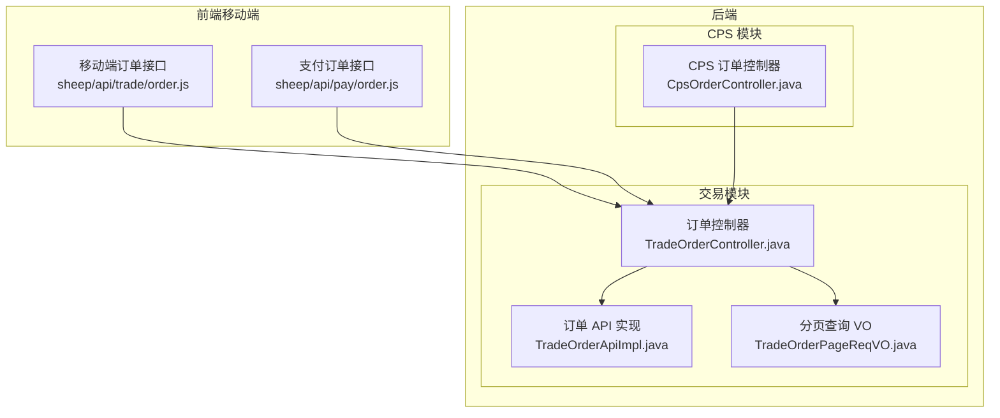
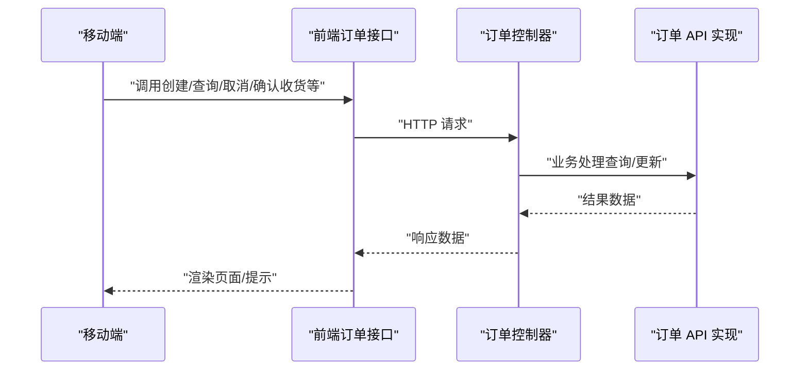
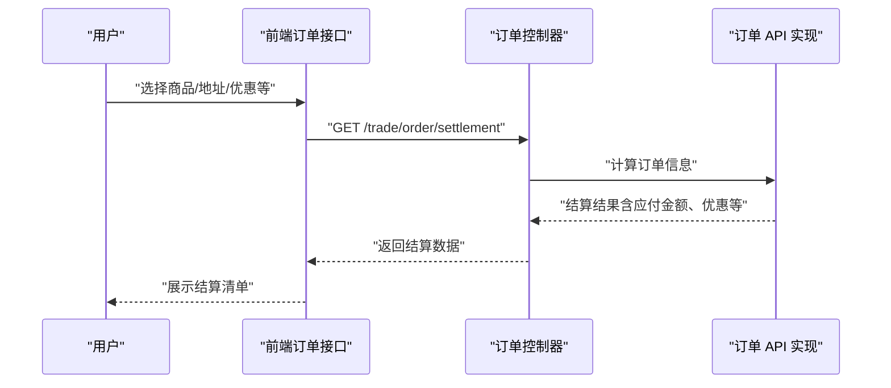
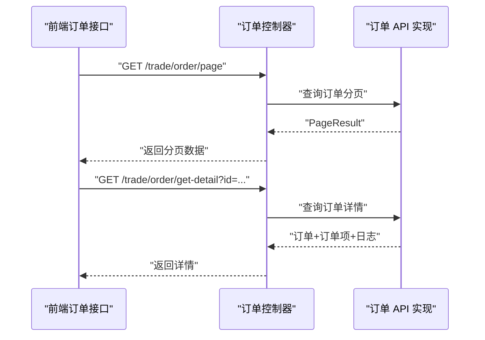
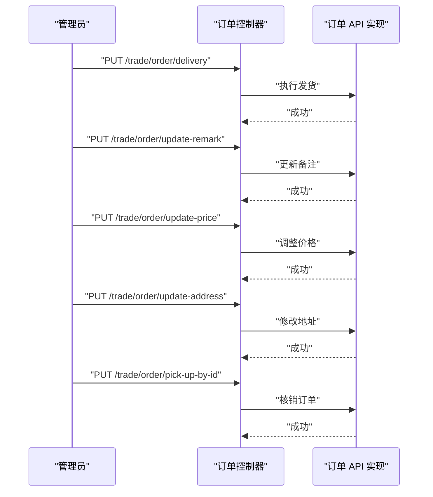
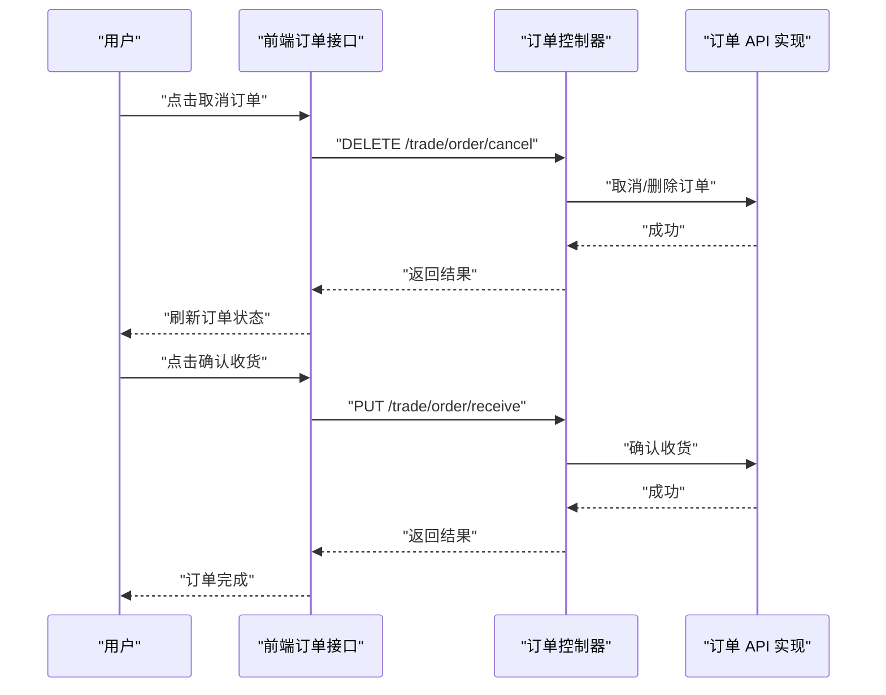
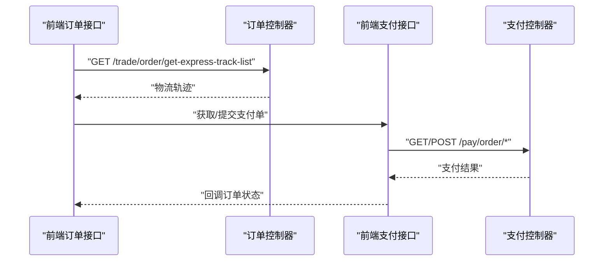
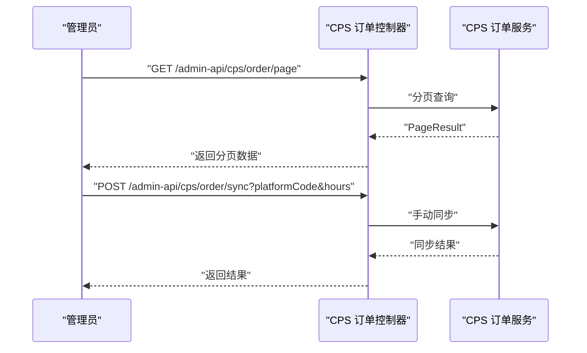
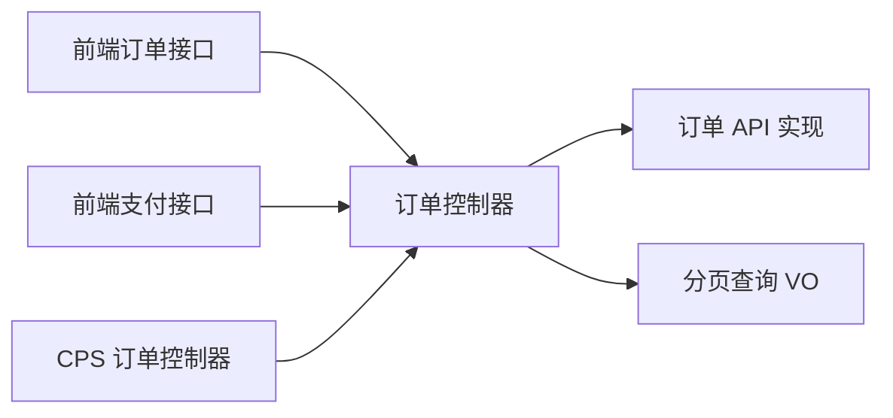

# 订单相关接口

<cite>
**本文引用的文件**
- [TradeOrderController.java](file://backend/yudao-module-mall/yudao-module-trade/src/main/java/cn/iocoder/yudao/module/trade/controller/admin/order/TradeOrderController.java)
- [TradeOrderApiImpl.java](file://backend/yudao-module-mall/yudao-module-trade/src/main/java/cn/iocoder/yudao/module/trade/api/order/TradeOrderApiImpl.java)
- [CpsOrderController.java](file://backend/yudao-module-cps/yudao-module-cps-biz/src/main/java/cn/iocoder/yudao/module/cps/controller/admin/order/CpsOrderController.java)
- [TradeOrderPageReqVO.java](file://backend/yudao-module-mall/yudao-module-trade/src/main/java/cn/iocoder/yudao/module/trade/controller/admin/order/vo/TradeOrderPageReqVO.java)
- [order.js（移动端）](file://frontend/mall-uniapp/sheep/api/trade/order.js)
- [order.js（支付）](file://frontend/mall-uniapp/sheep/api/pay/order.js)
</cite>

## 目录
1. [简介](#简介)
2. [项目结构](#项目结构)
3. [核心组件](#核心组件)
4. [架构总览](#架构总览)
5. [详细组件分析](#详细组件分析)
6. [依赖分析](#依赖分析)
7. [性能考虑](#性能考虑)
8. [故障排查指南](#故障排查指南)
9. [结论](#结论)
10. [附录](#附录)

## 简介
本文件聚焦移动端与管理后台的订单相关接口，覆盖订单创建、结算、查询、状态管理、取消、确认收货、核销、物流轨迹等能力。文档从接口定义、参数说明、调用流程、状态流转、权限控制与错误处理等方面进行系统化梳理，并提供可视化图示帮助理解。

## 项目结构
后端采用模块化设计，订单相关能力主要分布在“交易模块”和“CPS 模块”，前端通过统一的请求封装调用后端接口。

图表来源
- [TradeOrderController.java:1-170](file://backend/yudao-module-mall/yudao-module-trade/src/main/java/cn/iocoder/yudao/module/trade/controller/admin/order/TradeOrderController.java#L1-L170)
- [TradeOrderApiImpl.java:1-44](file://backend/yudao-module-mall/yudao-module-trade/src/main/java/cn/iocoder/yudao/module/trade/api/order/TradeOrderApiImpl.java#L1-L44)
- [TradeOrderPageReqVO.java:1-65](file://backend/yudao-module-mall/yudao-module-trade/src/main/java/cn/iocoder/yudao/module/trade/controller/admin/order/vo/TradeOrderPageReqVO.java#L1-L65)
- [CpsOrderController.java:1-64](file://backend/yudao-module-cps/yudao-module-cps-biz/src/main/java/cn/iocoder/yudao/module/cps/controller/admin/order/CpsOrderController.java#L1-L64)
- [order.js（移动端）:1-169](file://frontend/mall-uniapp/sheep/api/trade/order.js#L1-L169)
- [order.js（支付）:1-27](file://frontend/mall-uniapp/sheep/api/pay/order.js#L1-L27)

章节来源
- [TradeOrderController.java:1-170](file://backend/yudao-module-mall/yudao-module-trade/src/main/java/cn/iocoder/yudao/module/trade/controller/admin/order/TradeOrderController.java#L1-L170)
- [TradeOrderApiImpl.java:1-44](file://backend/yudao-module-mall/yudao-module-trade/src/main/java/cn/iocoder/yudao/module/trade/api/order/TradeOrderApiImpl.java#L1-L44)
- [TradeOrderPageReqVO.java:1-65](file://backend/yudao-module-mall/yudao-module-trade/src/main/java/cn/iocoder/yudao/module/trade/controller/admin/order/vo/TradeOrderPageReqVO.java#L1-L65)
- [CpsOrderController.java:1-64](file://backend/yudao-module-cps/yudao-module-cps-biz/src/main/java/cn/iocoder/yudao/module/cps/controller/admin/order/CpsOrderController.java#L1-L64)
- [order.js（移动端）:1-169](file://frontend/mall-uniapp/sheep/api/trade/order.js#L1-L169)
- [order.js（支付）:1-27](file://frontend/mall-uniapp/sheep/api/pay/order.js#L1-L27)

## 核心组件
- 订单控制器（管理后台）
  - 提供订单分页、详情、统计、发货、备注、改价、改地址、核销、物流轨迹等接口。
- 订单 API 实现
  - 对外暴露订单查询与取消等能力，供其他模块或服务使用。
- 分页查询 VO
  - 定义订单查询所需的筛选条件（如订单号、用户、状态、时间范围、终端来源等）。
- 前端订单接口封装
  - 封装移动端订单创建、结算、查询、取消、确认收货、物流轨迹等请求方法。
- 前端支付订单接口封装
  - 获取支付单、提交支付单等支付相关操作。

章节来源
- [TradeOrderController.java:52-167](file://backend/yudao-module-mall/yudao-module-trade/src/main/java/cn/iocoder/yudao/module/trade/controller/admin/order/TradeOrderController.java#L52-L167)
- [TradeOrderApiImpl.java:28-42](file://backend/yudao-module-mall/yudao-module-trade/src/main/java/cn/iocoder/yudao/module/trade/api/order/TradeOrderApiImpl.java#L28-L42)
- [TradeOrderPageReqVO.java:17-64](file://backend/yudao-module-mall/yudao-module-trade/src/main/java/cn/iocoder/yudao/module/trade/controller/admin/order/vo/TradeOrderPageReqVO.java#L17-L64)
- [order.js（移动端）:4-166](file://frontend/mall-uniapp/sheep/api/trade/order.js#L4-L166)
- [order.js（支付）:3-24](file://frontend/mall-uniapp/sheep/api/pay/order.js#L3-L24)

## 架构总览
移动端通过前端封装调用后端订单接口，后端控制器协调查询与更新服务，最终落库并返回结果。CPS 订单控制器用于后台管理 CPS 平台订单的分页、详情与手动同步。

图表来源
- [TradeOrderController.java:52-167](file://backend/yudao-module-mall/yudao-module-trade/src/main/java/cn/iocoder/yudao/module/trade/controller/admin/order/TradeOrderController.java#L52-L167)
- [TradeOrderApiImpl.java:28-42](file://backend/yudao-module-mall/yudao-module-trade/src/main/java/cn/iocoder/yudao/module/trade/api/order/TradeOrderApiImpl.java#L28-L42)
- [order.js（移动端）:4-166](file://frontend/mall-uniapp/sheep/api/trade/order.js#L4-L166)

## 详细组件分析

### 订单创建与结算（移动端）
- 接口目标
  - 商品选择、数量设置、地址选择、优惠券、活动等参与结算，生成可支付订单。
- 关键流程
  - 前端将 items 数组转换为表单参数，移除无效字段，发起 GET 结算请求。
  - 后端根据传入参数计算应付金额、运费、优惠等，返回结算信息。
- 参数要点
  - 商品明细 items：包含 skuId、count，以及可选 cartId。
  - 地址 addressId、自提 pickUpStoreId、收件人 receiverName、receiverMobile。
  - 优惠券 couponId、活动 combinationActivityId/combinationHeadId、seckillActivityId、pointActivityId。
  - 配送方式 deliveryType。
- 调用示例（路径）
  - [settlementOrder 方法:6-61](file://frontend/mall-uniapp/sheep/api/trade/order.js#L6-L61)
  - [getSettlementProduct 方法:63-73](file://frontend/mall-uniapp/sheep/api/trade/order.js#L63-L73)

图表来源
- [order.js（移动端）:6-61](file://frontend/mall-uniapp/sheep/api/trade/order.js#L6-L61)
- [TradeOrderController.java:52-167](file://backend/yudao-module-mall/yudao-module-trade/src/main/java/cn/iocoder/yudao/module/trade/controller/admin/order/TradeOrderController.java#L52-L167)
- [TradeOrderApiImpl.java:28-42](file://backend/yudao-module-mall/yudao-module-trade/src/main/java/cn/iocoder/yudao/module/trade/api/order/TradeOrderApiImpl.java#L28-L42)

章节来源
- [order.js（移动端）:6-73](file://frontend/mall-uniapp/sheep/api/trade/order.js#L6-L73)
- [TradeOrderController.java:52-167](file://backend/yudao-module-mall/yudao-module-trade/src/main/java/cn/iocoder/yudao/module/trade/controller/admin/order/TradeOrderController.java#L52-L167)
- [TradeOrderApiImpl.java:28-42](file://backend/yudao-module-mall/yudao-module-trade/src/main/java/cn/iocoder/yudao/module/trade/api/order/TradeOrderApiImpl.java#L28-L42)

### 订单查询（移动端与管理后台）
- 移动端查询
  - 支持分页查询与订单数量统计，按订单状态、用户、时间等筛选。
  - 调用示例（路径）
    - [getOrderPage 方法:97-106](file://frontend/mall-uniapp/sheep/api/trade/order.js#L97-L106)
    - [getOrderCount 方法:148-157](file://frontend/mall-uniapp/sheep/api/trade/order.js#L148-L157)
- 管理后台查询
  - 提供分页、统计、详情、物流轨迹、核销码查询等。
  - 调用示例（路径）
    - [getOrderPage 方法:52-71](file://backend/yudao-module-mall/yudao-module-trade/src/main/java/cn/iocoder/yudao/module/trade/controller/admin/order/TradeOrderController.java#L52-L71)
    - [getOrderDetail 方法:80-99](file://backend/yudao-module-mall/yudao-module-trade/src/main/java/cn/iocoder/yudao/module/trade/controller/admin/order/TradeOrderController.java#L80-L99)
    - [getOrderSummary 方法:73-78](file://backend/yudao-module-mall/yudao-module-trade/src/main/java/cn/iocoder/yudao/module/trade/controller/admin/order/TradeOrderController.java#L73-L78)
    - [getOrderExpressTrackList 方法:101-108](file://backend/yudao-module-mall/yudao-module-trade/src/main/java/cn/iocoder/yudao/module/trade/controller/admin/order/TradeOrderController.java#L101-L108)
    - [getByPickUpVerifyCode 方法:160-167](file://backend/yudao-module-mall/yudao-module-trade/src/main/java/cn/iocoder/yudao/module/trade/controller/admin/order/TradeOrderController.java#L160-L167)

图表来源
- [order.js（移动端）:97-106](file://frontend/mall-uniapp/sheep/api/trade/order.js#L97-L106)
- [TradeOrderController.java:52-99](file://backend/yudao-module-mall/yudao-module-trade/src/main/java/cn/iocoder/yudao/module/trade/controller/admin/order/TradeOrderController.java#L52-L99)
- [TradeOrderApiImpl.java:29-36](file://backend/yudao-module-mall/yudao-module-trade/src/main/java/cn/iocoder/yudao/module/trade/api/order/TradeOrderApiImpl.java#L29-L36)

章节来源
- [order.js（移动端）:97-157](file://frontend/mall-uniapp/sheep/api/trade/order.js#L97-L157)
- [TradeOrderController.java:52-167](file://backend/yudao-module-mall/yudao-module-trade/src/main/java/cn/iocoder/yudao/module/trade/controller/admin/order/TradeOrderController.java#L52-L167)
- [TradeOrderApiImpl.java:29-36](file://backend/yudao-module-mall/yudao-module-trade/src/main/java/cn/iocoder/yudao/module/trade/api/order/TradeOrderApiImpl.java#L29-L36)

### 订单状态管理（发货、备注、改价、改地址、核销）
- 发货
  - 管理员执行发货，填写物流信息后完成发货。
  - 调用示例（路径）
    - [deliveryOrder 方法:110-116](file://backend/yudao-module-mall/yudao-module-trade/src/main/java/cn/iocoder/yudao/module/trade/controller/admin/order/TradeOrderController.java#L110-L116)
- 备注
  - 更新订单备注。
  - 调用示例（路径）
    - [updateOrderRemark 方法:118-124](file://backend/yudao-module-mall/yudao-module-trade/src/main/java/cn/iocoder/yudao/module/trade/controller/admin/order/TradeOrderController.java#L118-L124)
- 改价
  - 调整订单价格。
  - 调用示例（路径）
    - [updateOrderPrice 方法:126-132](file://backend/yudao-module-mall/yudao-module-trade/src/main/java/cn/iocoder/yudao/module/trade/controller/admin/order/TradeOrderController.java#L126-L132)
- 改地址
  - 修改收货地址。
  - 调用示例（路径）
    - [updateOrderAddress 方法:134-140](file://backend/yudao-module-mall/yudao-module-trade/src/main/java/cn/iocoder/yudao/module/trade/controller/admin/order/TradeOrderController.java#L134-L140)
- 核销
  - 管理员核销订单（按订单号或核销码）。
  - 调用示例（路径）
    - [pickUpOrderById 方法:142-149](file://backend/yudao-module-mall/yudao-module-trade/src/main/java/cn/iocoder/yudao/module/trade/controller/admin/order/TradeOrderController.java#L142-L149)
    - [pickUpOrderByVerifyCode 方法:151-158](file://backend/yudao-module-mall/yudao-module-trade/src/main/java/cn/iocoder/yudao/module/trade/controller/admin/order/TradeOrderController.java#L151-L158)
    - [getByPickUpVerifyCode 方法:160-167](file://backend/yudao-module-mall/yudao-module-trade/src/main/java/cn/iocoder/yudao/module/trade/controller/admin/order/TradeOrderController.java#L160-L167)

图表来源
- [TradeOrderController.java:110-158](file://backend/yudao-module-mall/yudao-module-trade/src/main/java/cn/iocoder/yudao/module/trade/controller/admin/order/TradeOrderController.java#L110-L158)
- [TradeOrderApiImpl.java:38-42](file://backend/yudao-module-mall/yudao-module-trade/src/main/java/cn/iocoder/yudao/module/trade/api/order/TradeOrderApiImpl.java#L38-L42)

章节来源
- [TradeOrderController.java:110-167](file://backend/yudao-module-mall/yudao-module-trade/src/main/java/cn/iocoder/yudao/module/trade/controller/admin/order/TradeOrderController.java#L110-L167)
- [TradeOrderApiImpl.java:38-42](file://backend/yudao-module-mall/yudao-module-trade/src/main/java/cn/iocoder/yudao/module/trade/api/order/TradeOrderApiImpl.java#L38-L42)

### 订单取消与确认收货（移动端）
- 取消订单
  - 用户删除订单或在特定状态下取消已支付订单。
  - 调用示例（路径）
    - [cancelOrder 方法:118-126](file://frontend/mall-uniapp/sheep/api/trade/order.js#L118-L126)
    - [cancelPaidOrder 方法（服务层）:39-41](file://backend/yudao-module-mall/yudao-module-trade/src/main/java/cn/iocoder/yudao/module/trade/api/order/TradeOrderApiImpl.java#L39-L41)
- 确认收货
  - 用户确认收货，触发订单完成。
  - 调用示例（路径）
    - [receiveOrder 方法:108-116](file://frontend/mall-uniapp/sheep/api/trade/order.js#L108-L116)

图表来源
- [order.js（移动端）:118-126](file://frontend/mall-uniapp/sheep/api/trade/order.js#L118-L126)
- [TradeOrderController.java:108-116](file://backend/yudao-module-mall/yudao-module-trade/src/main/java/cn/iocoder/yudao/module/trade/controller/admin/order/TradeOrderController.java#L108-L116)
- [TradeOrderApiImpl.java:39-41](file://backend/yudao-module-mall/yudao-module-trade/src/main/java/cn/iocoder/yudao/module/trade/api/order/TradeOrderApiImpl.java#L39-L41)

章节来源
- [order.js（移动端）:108-126](file://frontend/mall-uniapp/sheep/api/trade/order.js#L108-L126)
- [TradeOrderController.java:108-116](file://backend/yudao-module-mall/yudao-module-trade/src/main/java/cn/iocoder/yudao/module/trade/controller/admin/order/TradeOrderController.java#L108-L116)
- [TradeOrderApiImpl.java:39-41](file://backend/yudao-module-mall/yudao-module-trade/src/main/java/cn/iocoder/yudao/module/trade/api/order/TradeOrderApiImpl.java#L39-L41)

### 物流轨迹与支付对接
- 物流轨迹
  - 查询订单物流轨迹。
  - 调用示例（路径）
    - [getOrderExpressTrackList 方法:101-108](file://backend/yudao-module-mall/yudao-module-trade/src/main/java/cn/iocoder/yudao/module/trade/controller/admin/order/TradeOrderController.java#L101-L108)
    - [前端调用:138-146](file://frontend/mall-uniapp/sheep/api/trade/order.js#L138-L146)
- 支付对接
  - 获取支付单、提交支付单。
  - 调用示例（路径）
    - [getOrder 方法:5-15](file://frontend/mall-uniapp/sheep/api/pay/order.js#L5-L15)
    - [submitOrder 方法:17-23](file://frontend/mall-uniapp/sheep/api/pay/order.js#L17-L23)

图表来源
- [TradeOrderController.java:101-108](file://backend/yudao-module-mall/yudao-module-trade/src/main/java/cn/iocoder/yudao/module/trade/controller/admin/order/TradeOrderController.java#L101-L108)
- [order.js（移动端）:138-146](file://frontend/mall-uniapp/sheep/api/trade/order.js#L138-L146)
- [order.js（支付）:5-23](file://frontend/mall-uniapp/sheep/api/pay/order.js#L5-L23)

章节来源
- [TradeOrderController.java:101-108](file://backend/yudao-module-mall/yudao-module-trade/src/main/java/cn/iocoder/yudao/module/trade/controller/admin/order/TradeOrderController.java#L101-L108)
- [order.js（移动端）:138-146](file://frontend/mall-uniapp/sheep/api/trade/order.js#L138-L146)
- [order.js（支付）:5-23](file://frontend/mall-uniapp/sheep/api/pay/order.js#L5-L23)

### CPS 订单管理（管理后台）
- 分页与详情
  - 获取 CPS 订单分页与详情。
  - 调用示例（路径）
    - [getOrderPage 方法:35-41](file://backend/yudao-module-cps/yudao-module-cps-biz/src/main/java/cn/iocoder/yudao/module/cps/controller/admin/order/CpsOrderController.java#L35-L41)
    - [getOrder 方法:43-50](file://backend/yudao-module-cps/yudao-module-cps-biz/src/main/java/cn/iocoder/yudao/module/cps/controller/admin/order/CpsOrderController.java#L43-L50)
- 手动同步
  - 指定平台与时间窗口手动拉取订单。
  - 调用示例（路径）
    - [manualSync 方法:52-61](file://backend/yudao-module-cps/yudao-module-cps-biz/src/main/java/cn/iocoder/yudao/module/cps/controller/admin/order/CpsOrderController.java#L52-L61)

图表来源
- [CpsOrderController.java:35-61](file://backend/yudao-module-cps/yudao-module-cps-biz/src/main/java/cn/iocoder/yudao/module/cps/controller/admin/order/CpsOrderController.java#L35-L61)

章节来源
- [CpsOrderController.java:35-61](file://backend/yudao-module-cps/yudao-module-cps-biz/src/main/java/cn/iocoder/yudao/module/cps/controller/admin/order/CpsOrderController.java#L35-L61)

## 依赖分析
- 前端到后端
  - 移动端通过统一请求封装调用后端订单与支付接口。
- 控制器到服务
  - 订单控制器依赖查询与更新服务，负责鉴权与参数校验。
- API 实现
  - 对外暴露订单查询与取消能力，供内部模块复用。

图表来源
- [order.js（移动端）:1-169](file://frontend/mall-uniapp/sheep/api/trade/order.js#L1-L169)
- [order.js（支付）:1-27](file://frontend/mall-uniapp/sheep/api/pay/order.js#L1-L27)
- [TradeOrderController.java:1-170](file://backend/yudao-module-mall/yudao-module-trade/src/main/java/cn/iocoder/yudao/module/trade/controller/admin/order/TradeOrderController.java#L1-L170)
- [TradeOrderApiImpl.java:1-44](file://backend/yudao-module-mall/yudao-module-trade/src/main/java/cn/iocoder/yudao/module/trade/api/order/TradeOrderApiImpl.java#L1-L44)
- [TradeOrderPageReqVO.java:1-65](file://backend/yudao-module-mall/yudao-module-trade/src/main/java/cn/iocoder/yudao/module/trade/controller/admin/order/vo/TradeOrderPageReqVO.java#L1-L65)
- [CpsOrderController.java:1-64](file://backend/yudao-module-cps/yudao-module-cps-biz/src/main/java/cn/iocoder/yudao/module/cps/controller/admin/order/CpsOrderController.java#L1-L64)

章节来源
- [TradeOrderController.java:1-170](file://backend/yudao-module-mall/yudao-module-trade/src/main/java/cn/iocoder/yudao/module/trade/controller/admin/order/TradeOrderController.java#L1-L170)
- [TradeOrderApiImpl.java:1-44](file://backend/yudao-module-mall/yudao-module-trade/src/main/java/cn/iocoder/yudao/module/trade/api/order/TradeOrderApiImpl.java#L1-L44)
- [TradeOrderPageReqVO.java:1-65](file://backend/yudao-module-mall/yudao-module-trade/src/main/java/cn/iocoder/yudao/module/trade/controller/admin/order/vo/TradeOrderPageReqVO.java#L1-L65)
- [CpsOrderController.java:1-64](file://backend/yudao-module-cps/yudao-module-cps-biz/src/main/java/cn/iocoder/yudao/module/cps/controller/admin/order/CpsOrderController.java#L1-L64)
- [order.js（移动端）:1-169](file://frontend/mall-uniapp/sheep/api/trade/order.js#L1-L169)
- [order.js（支付）:1-27](file://frontend/mall-uniapp/sheep/api/pay/order.js#L1-L27)

## 性能考虑
- 分页查询
  - 使用 PageParam 进行分页，避免一次性加载大量订单数据。
- 批量用户信息
  - 后端聚合用户 ID，批量查询用户信息，减少多次远程调用。
- 参数精简
  - 前端仅传递有效字段，减少后端解析负担。
- 缓存与异步
  - 物流轨迹与支付结果建议结合缓存与异步更新策略，提升用户体验。

## 故障排查指南
- 权限不足
  - 管理后台接口均带有权限注解，若返回无权限，请检查登录用户角色与权限配置。
- 参数校验失败
  - 分页查询 VO 中包含枚举校验与手机号格式校验，确保传参符合要求。
- 订单不存在
  - 查询详情或核销时，若订单为空，需提示用户刷新或检查订单号。
- 支付异常
  - 支付单获取失败或提交失败时，检查支付渠道与订单状态是否匹配。

章节来源
- [TradeOrderController.java:52-167](file://backend/yudao-module-mall/yudao-module-trade/src/main/java/cn/iocoder/yudao/module/trade/controller/admin/order/TradeOrderController.java#L52-L167)
- [TradeOrderPageReqVO.java:17-64](file://backend/yudao-module-mall/yudao-module-trade/src/main/java/cn/iocoder/yudao/module/trade/controller/admin/order/vo/TradeOrderPageReqVO.java#L17-L64)
- [order.js（移动端）:1-169](file://frontend/mall-uniapp/sheep/api/trade/order.js#L1-L169)
- [order.js（支付）:1-27](file://frontend/mall-uniapp/sheep/api/pay/order.js#L1-L27)

## 结论
本文档对移动端与管理后台的订单相关接口进行了系统化梳理，覆盖了创建、结算、查询、状态管理、取消、确认收货、核销与物流轨迹等关键能力。通过清晰的接口定义、参数说明与调用流程，有助于前后端协作与问题定位。后续可在权限细化、缓存优化与异常处理方面持续改进。

## 附录
- 接口调用示例（路径）
  - [settlementOrder 方法:6-61](file://frontend/mall-uniapp/sheep/api/trade/order.js#L6-L61)
  - [getOrderPage 方法:97-106](file://frontend/mall-uniapp/sheep/api/trade/order.js#L97-L106)
  - [getOrderDetail 方法:83-95](file://frontend/mall-uniapp/sheep/api/trade/order.js#L83-L95)
  - [receiveOrder 方法:108-116](file://frontend/mall-uniapp/sheep/api/trade/order.js#L108-L116)
  - [cancelOrder 方法:118-126](file://frontend/mall-uniapp/sheep/api/trade/order.js#L118-L126)
  - [getOrderExpressTrackList 方法:138-146](file://frontend/mall-uniapp/sheep/api/trade/order.js#L138-L146)
  - [getOrder 方法（支付）:5-15](file://frontend/mall-uniapp/sheep/api/pay/order.js#L5-L15)
  - [submitOrder 方法（支付）:17-23](file://frontend/mall-uniapp/sheep/api/pay/order.js#L17-L23)
  - [getOrderPage 方法（管理后台）:52-71](file://backend/yudao-module-mall/yudao-module-trade/src/main/java/cn/iocoder/yudao/module/trade/controller/admin/order/TradeOrderController.java#L52-L71)
  - [getOrderDetail 方法（管理后台）:80-99](file://backend/yudao-module-mall/yudao-module-trade/src/main/java/cn/iocoder/yudao/module/trade/controller/admin/order/TradeOrderController.java#L80-L99)
  - [manualSync 方法（CPS）:52-61](file://backend/yudao-module-cps/yudao-module-cps-biz/src/main/java/cn/iocoder/yudao/module/cps/controller/admin/order/CpsOrderController.java#L52-L61)