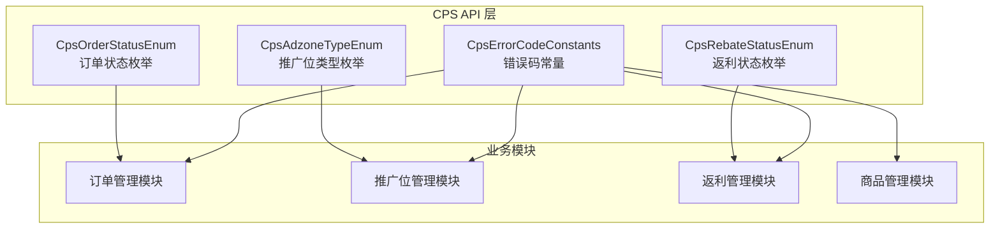
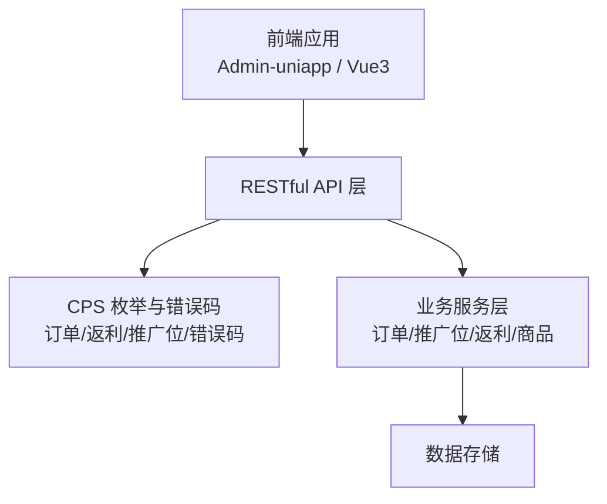
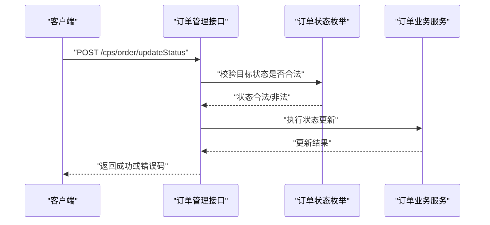
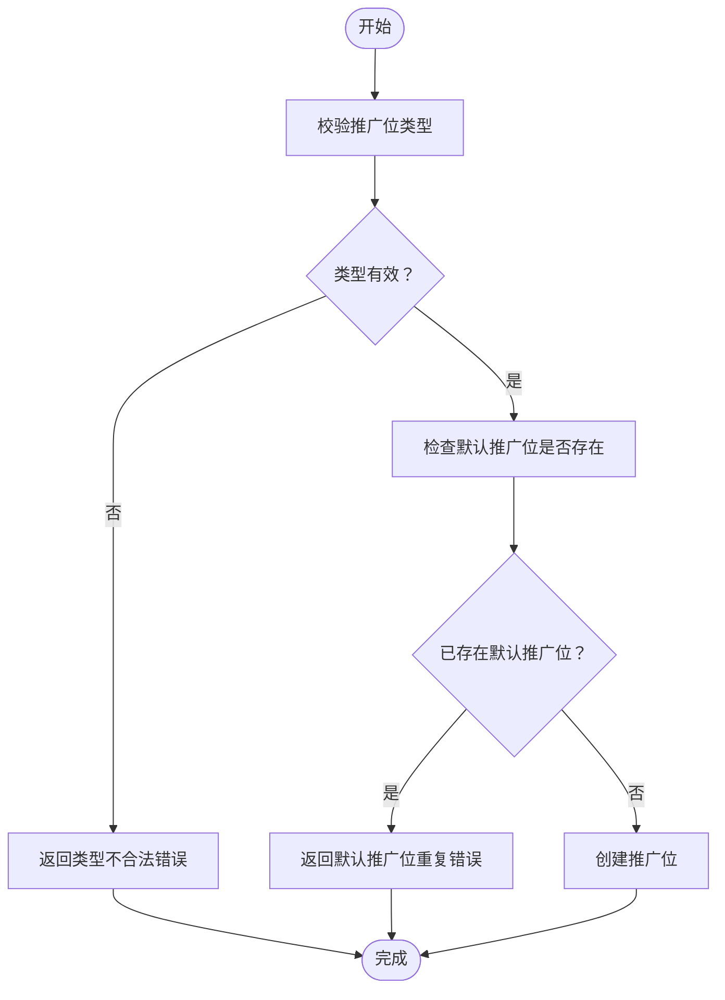
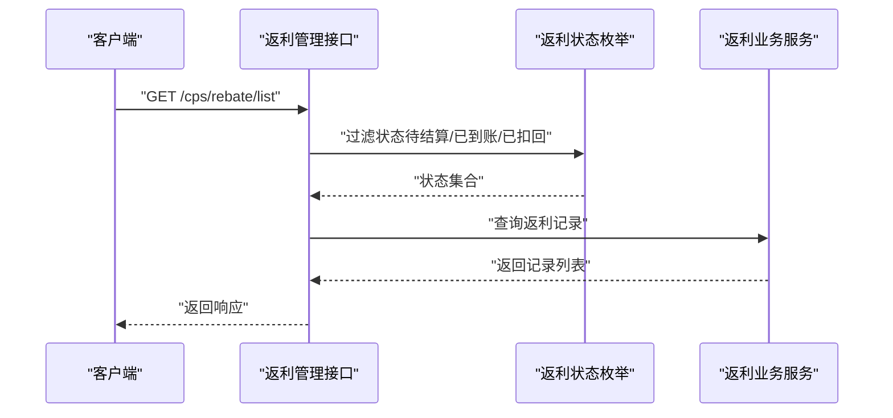
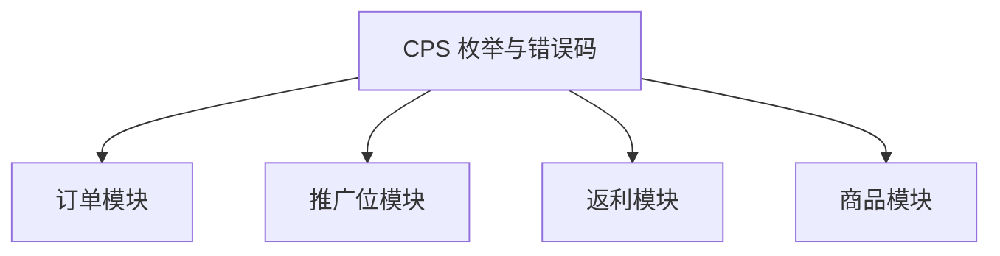

# CPS 业务管理 API

<cite>
**本文引用的文件**
- [CpsOrderStatusEnum.java](file://backend/yudao-module-cps/yudao-module-cps-api/src/main/java/cn/iocoder/yudao/module/cps/enums/CpsOrderStatusEnum.java)
- [CpsRebateStatusEnum.java](file://backend/yudao-module-cps/yudao-module-cps-api/src/main/java/cn/iocoder/yudao/module/cps/enums/CpsRebateStatusEnum.java)
- [CpsAdzoneTypeEnum.java](file://backend/yudao-module-cps/yudao-module-cps-api/src/main/java/cn/iocoder/yudao/module/cps/enums/CpsAdzoneTypeEnum.java)
- [CpsErrorCodeConstants.java](file://backend/yudao-module-cps/yudao-module-cps-api/src/main/java/cn/iocoder/yudao/module/cps/enums/CpsErrorCodeConstants.java)
</cite>

## 目录
1. [简介](#简介)
2. [项目结构](#项目结构)
3. [核心组件](#核心组件)
4. [架构总览](#架构总览)
5. [详细组件分析](#详细组件分析)
6. [依赖分析](#依赖分析)
7. [性能考虑](#性能考虑)
8. [故障排除指南](#故障排除指南)
9. [结论](#结论)
10. [附录](#附录)

## 简介
本文件为 CPS 业务管理系统的接口文档，聚焦于订单管理、商品管理、推广位管理与返利管理等核心业务接口。文档基于仓库中现有的枚举与错误码定义，梳理了订单状态、返利状态、推广位类型以及错误码体系，并通过统一的 RESTful 设计规范，给出各模块的请求参数、响应结构、错误码处理与调用示例，帮助开发者快速理解并集成 CPS 业务流程。

## 项目结构
CPS 模块位于后端工程中，采用多模块分层设计，核心能力由 API 层的枚举与错误码支撑，业务逻辑在对应业务模块中实现。当前仓库中已提供的文件主要集中在 API 层，用于定义状态、类型与错误码常量，便于前后端统一约定。

**图表来源**
- [CpsOrderStatusEnum.java:1-48](file://backend/yudao-module-cps/yudao-module-cps-api/src/main/java/cn/iocoder/yudao/module/cps/enums/CpsOrderStatusEnum.java#L1-L48)
- [CpsRebateStatusEnum.java:1-40](file://backend/yudao-module-cps/yudao-module-cps-api/src/main/java/cn/iocoder/yudao/module/cps/enums/CpsRebateStatusEnum.java#L1-L40)
- [CpsAdzoneTypeEnum.java:1-40](file://backend/yudao-module-cps/yudao-module-cps-api/src/main/java/cn/iocoder/yudao/module/cps/enums/CpsAdzoneTypeEnum.java#L1-L40)
- [CpsErrorCodeConstants.java:1-65](file://backend/yudao-module-cps/yudao-module-cps-api/src/main/java/cn/iocoder/yudao/module/cps/enums/CpsErrorCodeConstants.java#L1-L65)

**章节来源**
- [CpsOrderStatusEnum.java:1-48](file://backend/yudao-module-cps/yudao-module-cps-api/src/main/java/cn/iocoder/yudao/module/cps/enums/CpsOrderStatusEnum.java#L1-L48)
- [CpsRebateStatusEnum.java:1-40](file://backend/yudao-module-cps/yudao-module-cps-api/src/main/java/cn/iocoder/yudao/module/cps/enums/CpsRebateStatusEnum.java#L1-L40)
- [CpsAdzoneTypeEnum.java:1-40](file://backend/yudao-module-cps/yudao-module-cps-api/src/main/java/cn/iocoder/yudao/module/cps/enums/CpsAdzoneTypeEnum.java#L1-L40)
- [CpsErrorCodeConstants.java:1-65](file://backend/yudao-module-cps/yudao-module-cps-api/src/main/java/cn/iocoder/yudao/module/cps/enums/CpsErrorCodeConstants.java#L1-L65)

## 核心组件
本节对订单状态、返利状态、推广位类型与错误码进行深入解析，明确其在 RESTful 接口中的使用方式与约束。

- 订单状态枚举：定义了从“已下单”到“已到账/已失效”的完整生命周期状态，用于订单查询与状态更新接口。
- 返利状态枚举：定义了“待结算”“已到账”“已扣回”的返利状态，用于返利记录与结算接口。
- 推广位类型枚举：定义了“通用”“渠道专属”“用户专属”的推广位类型，用于推广位创建与查询接口。
- 错误码常量：按模块划分错误域，覆盖平台配置、推广位、订单、返利配置、返利记录、返利账户、提现、统计、MCP、转链、冻结、风控等场景。

**章节来源**
- [CpsOrderStatusEnum.java:16-25](file://backend/yudao-module-cps/yudao-module-cps-api/src/main/java/cn/iocoder/yudao/module/cps/enums/CpsOrderStatusEnum.java#L16-L25)
- [CpsRebateStatusEnum.java:16-21](file://backend/yudao-module-cps/yudao-module-cps-api/src/main/java/cn/iocoder/yudao/module/cps/enums/CpsRebateStatusEnum.java#L16-L21)
- [CpsAdzoneTypeEnum.java:16-21](file://backend/yudao-module-cps/yudao-module-cps-api/src/main/java/cn/iocoder/yudao/module/cps/enums/CpsAdzoneTypeEnum.java#L16-L21)
- [CpsErrorCodeConstants.java:10-64](file://backend/yudao-module-cps/yudao-module-cps-api/src/main/java/cn/iocoder/yudao/module/cps/enums/CpsErrorCodeConstants.java#L10-L64)

## 架构总览
下图展示了 CPS 业务在系统中的位置与关键交互：前端通过 RESTful API 调用后端服务；后端根据 API 层的枚举与错误码进行状态校验与错误返回；业务模块负责具体的数据处理与持久化。

**图表来源**
- [CpsOrderStatusEnum.java:1-48](file://backend/yudao-module-cps/yudao-module-cps-api/src/main/java/cn/iocoder/yudao/module/cps/enums/CpsOrderStatusEnum.java#L1-L48)
- [CpsRebateStatusEnum.java:1-40](file://backend/yudao-module-cps/yudao-module-cps-api/src/main/java/cn/iocoder/yudao/module/cps/enums/CpsRebateStatusEnum.java#L1-L40)
- [CpsAdzoneTypeEnum.java:1-40](file://backend/yudao-module-cps/yudao-module-cps-api/src/main/java/cn/iocoder/yudao/module/cps/enums/CpsAdzoneTypeEnum.java#L1-L40)
- [CpsErrorCodeConstants.java:1-65](file://backend/yudao-module-cps/yudao-module-cps-api/src/main/java/cn/iocoder/yudao/module/cps/enums/CpsErrorCodeConstants.java#L1-L65)

## 详细组件分析

### 订单管理接口
订单管理涉及订单查询与状态更新两大类接口。基于订单状态枚举，接口应支持按状态过滤、状态变更与批量更新。

- 接口目标
  - 订单查询：支持按订单号、平台、时间范围、状态等条件筛选。
  - 状态更新：支持将订单从“已下单”推进至“已付款/已收货/已结算/已到账/已失效”。

- 请求参数
  - 查询参数：订单号、平台编码、开始/结束时间、状态列表、分页参数。
  - 更新参数：订单号、目标状态（必须为合法状态）、操作人标识。

- 响应结构
  - 列表响应：包含订单基础信息、平台信息、佣金与返利信息、状态与时间戳。
  - 单条响应：包含订单详情与状态流转历史。

- 错误码
  - 订单不存在：参见错误码常量中“订单不存在”。
  - 订单状态不合法：参见错误码常量中“订单状态不合法”。

**图表来源**
- [CpsOrderStatusEnum.java:16-25](file://backend/yudao-module-cps/yudao-module-cps-api/src/main/java/cn/iocoder/yudao/module/cps/enums/CpsOrderStatusEnum.java#L16-L25)
- [CpsErrorCodeConstants.java:21-25](file://backend/yudao-module-cps/yudao-module-cps-api/src/main/java/cn/iocoder/yudao/module/cps/enums/CpsErrorCodeConstants.java#L21-L25)

**章节来源**
- [CpsOrderStatusEnum.java:16-25](file://backend/yudao-module-cps/yudao-module-cps-api/src/main/java/cn/iocoder/yudao/module/cps/enums/CpsOrderStatusEnum.java#L16-L25)
- [CpsErrorCodeConstants.java:21-25](file://backend/yudao-module-cps/yudao-module-cps-api/src/main/java/cn/iocoder/yudao/module/cps/enums/CpsErrorCodeConstants.java#L21-L25)

### 商品管理接口
商品管理接口负责商品信息的维护与查询，包括商品上下架、价格更新、佣金比例调整等。

- 接口目标
  - 商品查询：支持按商品ID、标题、分类、状态等条件筛选。
  - 商品维护：支持新增、修改、上下架与批量更新。

- 请求参数
  - 查询参数：商品ID、关键词、分类、状态、分页。
  - 维护参数：商品基础信息、价格、佣金比例、库存、图片URL等。

- 响应结构
  - 列表响应：商品基础信息、价格区间、佣金比例、状态与时间戳。
  - 单条响应：商品详情与历史变更记录。

- 错误码
  - 可结合“统计记录不存在”等通用错误码进行扩展。

**章节来源**
- [CpsErrorCodeConstants.java:44-45](file://backend/yudao-module-cps/yudao-module-cps-api/src/main/java/cn/iocoder/yudao/module/cps/enums/CpsErrorCodeConstants.java#L44-L45)

### 推广位管理接口
推广位管理接口负责推广位的创建、查询与类型管理，支持通用、渠道专属与用户专属三种类型。

- 接口目标
  - 推广位查询：支持按平台、类型、状态、创建时间等条件筛选。
  - 推广位维护：支持创建默认推广位、修改类型与状态。

- 请求参数
  - 查询参数：平台编码、类型、状态、分页。
  - 维护参数：平台编码、推广位名称、类型（通用/渠道专属/用户专属）、备注。

- 响应结构
  - 列表响应：推广位ID、平台、类型、状态、创建时间。
  - 单条响应：推广位详情与绑定关系。

- 错误码
  - 推广位不存在：参见错误码常量中“推广位不存在”。
  - 默认推广位已存在：参见错误码常量中“平台已存在默认推广位”。

**图表来源**
- [CpsAdzoneTypeEnum.java:16-21](file://backend/yudao-module-cps/yudao-module-cps-api/src/main/java/cn/iocoder/yudao/module/cps/enums/CpsAdzoneTypeEnum.java#L16-L21)
- [CpsErrorCodeConstants.java:17-20](file://backend/yudao-module-cps/yudao-module-cps-api/src/main/java/cn/iocoder/yudao/module/cps/enums/CpsErrorCodeConstants.java#L17-L20)

**章节来源**
- [CpsAdzoneTypeEnum.java:16-21](file://backend/yudao-module-cps/yudao-module-cps-api/src/main/java/cn/iocoder/yudao/module/cps/enums/CpsAdzoneTypeEnum.java#L16-L21)
- [CpsErrorCodeConstants.java:17-20](file://backend/yudao-module-cps/yudao-module-cps-api/src/main/java/cn/iocoder/yudao/module/cps/enums/CpsErrorCodeConstants.java#L17-L20)

### 返利管理接口
返利管理接口涵盖返利配置、返利记录与返利账户管理，支持返利计算、状态更新与提现申请。

- 接口目标
  - 返利配置：设置不同等级与平台的返利比例。
  - 返利记录：查询返利明细、状态与结算情况。
  - 返利账户：查询可用余额、冻结金额与提现申请。

- 请求参数
  - 配置参数：等级、平台编码、返利比例、生效时间。
  - 记录参数：订单号、推广位ID、状态、分页。
  - 账户参数：账户ID、提现金额、银行信息、验证码。

- 响应结构
  - 配置响应：配置ID、等级、平台、比例、状态。
  - 记录响应：订单号、推广位、返利金额、状态、结算时间。
  - 账户响应：账户ID、可用余额、冻结余额、累计收入。

- 错误码
  - 返利配置不存在/重复：参见错误码常量中“返利配置不存在/重复”。
  - 返利记录不存在：参见错误码常量中“返利记录不存在”。
  - 返利账户不存在/余额不足/已冻结：参见错误码常量中“返利账户相关错误”。

**图表来源**
- [CpsRebateStatusEnum.java:16-21](file://backend/yudao-module-cps/yudao-module-cps-api/src/main/java/cn/iocoder/yudao/module/cps/enums/CpsRebateStatusEnum.java#L16-L21)
- [CpsErrorCodeConstants.java:26-36](file://backend/yudao-module-cps/yudao-module-cps-api/src/main/java/cn/iocoder/yudao/module/cps/enums/CpsErrorCodeConstants.java#L26-L36)

**章节来源**
- [CpsRebateStatusEnum.java:16-21](file://backend/yudao-module-cps/yudao-module-cps-api/src/main/java/cn/iocoder/yudao/module/cps/enums/CpsRebateStatusEnum.java#L16-L21)
- [CpsErrorCodeConstants.java:26-36](file://backend/yudao-module-cps/yudao-module-cps-api/src/main/java/cn/iocoder/yudao/module/cps/enums/CpsErrorCodeConstants.java#L26-L36)

## 依赖分析
CPS 枚举与错误码作为 API 层的核心契约，被各业务模块共享使用，形成低耦合高内聚的接口设计。

**图表来源**
- [CpsOrderStatusEnum.java:1-48](file://backend/yudao-module-cps/yudao-module-cps-api/src/main/java/cn/iocoder/yudao/module/cps/enums/CpsOrderStatusEnum.java#L1-L48)
- [CpsRebateStatusEnum.java:1-40](file://backend/yudao-module-cps/yudao-module-cps-api/src/main/java/cn/iocoder/yudao/module/cps/enums/CpsRebateStatusEnum.java#L1-L40)
- [CpsAdzoneTypeEnum.java:1-40](file://backend/yudao-module-cps/yudao-module-cps-api/src/main/java/cn/iocoder/yudao/module/cps/enums/CpsAdzoneTypeEnum.java#L1-L40)
- [CpsErrorCodeConstants.java:1-65](file://backend/yudao-module-cps/yudao-module-cps-api/src/main/java/cn/iocoder/yudao/module/cps/enums/CpsErrorCodeConstants.java#L1-L65)

**章节来源**
- [CpsOrderStatusEnum.java:1-48](file://backend/yudao-module-cps/yudao-module-cps-api/src/main/java/cn/iocoder/yudao/module/cps/enums/CpsOrderStatusEnum.java#L1-L48)
- [CpsRebateStatusEnum.java:1-40](file://backend/yudao-module-cps/yudao-module-cps-api/src/main/java/cn/iocoder/yudao/module/cps/enums/CpsRebateStatusEnum.java#L1-L40)
- [CpsAdzoneTypeEnum.java:1-40](file://backend/yudao-module-cps/yudao-module-cps-api/src/main/java/cn/iocoder/yudao/module/cps/enums/CpsAdzoneTypeEnum.java#L1-L40)
- [CpsErrorCodeConstants.java:1-65](file://backend/yudao-module-cps/yudao-module-cps-api/src/main/java/cn/iocoder/yudao/module/cps/enums/CpsErrorCodeConstants.java#L1-L65)

## 性能考虑
- 状态枚举与错误码集中管理：减少重复定义，提升一致性与可维护性。
- 分页与条件过滤：订单与返利列表查询建议使用分页与精确条件，避免全量扫描。
- 缓存策略：对常用配置（如返利比例、推广位默认值）可引入缓存以降低数据库压力。
- 批量操作：对状态批量更新与记录批量查询，建议采用异步或批处理方式提升吞吐。

## 故障排除指南
- 订单状态更新失败
  - 检查目标状态是否在订单状态枚举范围内。
  - 核对订单是否存在且未失效。
  - 参考错误码：订单不存在、订单状态不合法。

- 推广位创建失败
  - 检查推广位类型是否合法。
  - 确认平台是否已存在默认推广位。
  - 参考错误码：推广位不存在、平台已存在默认推广位。

- 返利账户异常
  - 核对账户是否存在与状态正常。
  - 检查可用余额是否充足。
  - 参考错误码：返利账户不存在、可用余额不足、账户已冻结。

- 提现申请异常
  - 核对提现金额是否满足最低限额。
  - 检查当日提现次数是否超限。
  - 参考错误码：提现状态不合法、提现金额低于最低限额、今日提现次数已达上限。

**章节来源**
- [CpsErrorCodeConstants.java:17-43](file://backend/yudao-module-cps/yudao-module-cps-api/src/main/java/cn/iocoder/yudao/module/cps/enums/CpsErrorCodeConstants.java#L17-L43)

## 结论
本文档基于现有枚举与错误码定义，构建了 CPS 业务管理的接口蓝图，明确了订单、商品、推广位与返利四大模块的接口边界与数据流转关系。后续可在该基础上完善控制器与服务层的具体实现细节，并补充接口调用示例与更详尽的响应结构说明。

## 附录
- 接口调用示例（示意）
  - 订单状态更新
    - 方法：POST
    - 路径：/cps/order/updateStatus
    - 请求体：包含订单号与目标状态（必须为合法状态）
    - 响应：成功或错误码
  - 推广位创建
    - 方法：POST
    - 路径：/cps/adzone/create
    - 请求体：包含平台编码、推广位名称、类型
    - 响应：成功或错误码
  - 返利记录查询
    - 方法：GET
    - 路径：/cps/rebate/list
    - 查询参数：订单号、推广位ID、状态、分页
    - 响应：记录列表