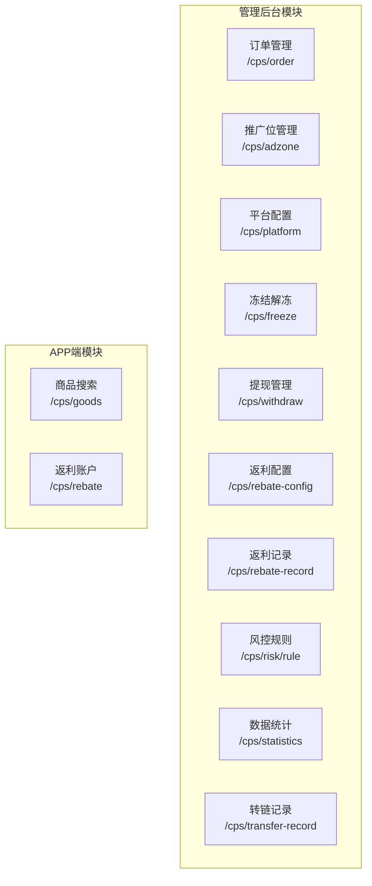

# CPS 业务管理 API

<cite>
**本文引用的文件**
- [CpsOrderController.java](file://backend/yudao-module-cps/yudao-module-cps-biz/src/main/java/cn/iocoder/yudao/module/cps/controller/admin/order/CpsOrderController.java)
- [CpsAdzoneController.java](file://backend/yudao-module-cps/yudao-module-cps-biz/src/main/java/cn/iocoder/yudao/module/cps/controller/admin/adzone/CpsAdzoneController.java)
- [CpsPlatformController.java](file://backend/yudao-module-cps/yudao-module-cps-biz/src/main/java/cn/iocoder/yudao/module/cps/controller/admin/platform/CpsPlatformController.java)
- [CpsFreezeController.java](file://backend/yudao-module-cps/yudao-module-cps-biz/src/main/java/cn/iocoder/yudao/module/cps/controller/admin/freeze/CpsFreezeController.java)
- [CpsWithdrawController.java](file://backend/yudao-module-cps/yudao-module-cps-biz/src/main/java/cn/iocoder/yudao/module/cps/controller/admin/withdraw/CpsWithdrawController.java)
- [CpsRebateConfigController.java](file://backend/yudao-module-cps/yudao-module-cps-biz/src/main/java/cn/iocoder/yudao/module/cps/controller/admin/rebate/CpsRebateConfigController.java)
- [CpsRebateRecordController.java](file://backend/yudao-module-cps/yudao-module-cps-biz/src/main/java/cn/iocoder/yudao/module/cps/controller/admin/rebate/CpsRebateRecordController.java)
- [CpsRiskRuleController.java](file://backend/yudao-module-cps/yudao-module-cps-biz/src/main/java/cn/iocoder/yudao/module/cps/controller/admin/risk/CpsRiskRuleController.java)
- [CpsStatisticsController.java](file://backend/yudao-module-cps/yudao-module-cps-biz/src/main/java/cn/iocoder/yudao/module/cps/controller/admin/statistics/CpsStatisticsController.java)
- [CpsTransferRecordController.java](file://backend/yudao-module-cps/yudao-module-cps-biz/src/main/java/cn/iocoder/yudao/module/cps/controller/admin/transfer/CpsTransferRecordController.java)
- [AppCpsGoodsController.java](file://backend/yudao-module-cps/yudao-module-cps-biz/src/main/java/cn/iocoder/yudao/module/cps/controller/app/goods/AppCpsGoodsController.java)
- [AppCpsRebateController.java](file://backend/yudao-module-cps/yudao-module-cps-biz/src/main/java/cn/iocoder/yudao/module/cps/controller/app/rebate/AppCpsRebateController.java)
- [CpsOrderStatusEnum.java](file://backend/yudao-module-cps/yudao-module-cps-api/src/main/java/cn/iocoder/yudao/module/cps/enums/CpsOrderStatusEnum.java)
- [CpsRebateStatusEnum.java](file://backend/yudao-module-cps/yudao-module-cps-api/src/main/java/cn/iocoder/yudao/module/cps/enums/CpsRebateStatusEnum.java)
- [CpsAdzoneTypeEnum.java](file://backend/yudao-module-cps/yudao-module-cps-api/src/main/java/cn/iocoder/yudao/module/cps/enums/CpsAdzoneTypeEnum.java)
- [CpsErrorCodeConstants.java](file://backend/yudao-module-cps/yudao-module-cps-api/src/main/java/cn/iocoder/yudao/module/cps/enums/CpsErrorCodeConstants.java)
</cite>

## 更新摘要
**所做更改**
- 更新了管理后台API路径标准化的变更，包括所有CPS模块的接口路径前缀统一为 `/cps/` 前缀
- 更新了接口调用示例，反映新的标准化路径格式
- 补充了完整的管理后台API接口清单和权限控制说明
- 更新了错误码处理和接口文档结构

## 目录
1. [简介](#简介)
2. [管理后台API路径标准化](#管理后台api路径标准化)
3. [核心模块接口](#核心模块接口)
4. [订单管理接口](#订单管理接口)
5. [推广位管理接口](#推广位管理接口)
6. [平台配置管理接口](#平台配置管理接口)
7. [冻结解冻管理接口](#冻结解冻管理接口)
8. [提现管理接口](#提现管理接口)
9. [返利配置管理接口](#返利配置管理接口)
10. [返利记录管理接口](#返利记录管理接口)
11. [风控规则管理接口](#风控规则管理接口)
12. [数据统计接口](#数据统计接口)
13. [转链记录管理接口](#转链记录管理接口)
14. [APP端接口](#app端接口)
15. [错误码处理](#错误码处理)
16. [接口调用示例](#接口调用示例)
17. [权限控制说明](#权限控制说明)

## 简介
本文档为 CPS 业务管理系统管理后台的完整 API 接口文档，基于最新的管理后台API路径标准化变更，详细文档化订单管理、商品管理、推广位管理、平台配置、冻结解冻、提现管理、返利管理、风控规则、数据统计和转链记录等核心业务接口。文档涵盖了所有管理后台接口的请求参数、响应数据结构、权限控制和错误码处理，帮助开发者快速理解和集成 CPS 业务流程。

## 管理后台API路径标准化
根据最新的管理后台API路径标准化变更，所有CPS模块的接口路径前缀统一为 `/cps/` 前缀，确保接口命名的一致性和规范性：

- 订单管理：`/cps/order`
- 推广位管理：`/cps/adzone`
- 平台配置：`/cps/platform`
- 冻结解冻：`/cps/freeze`
- 提现管理：`/cps/withdraw`
- 返利配置：`/cps/rebate-config`
- 返利记录：`/cps/rebate-record`
- 风控规则：`/cps/risk/rule`
- 数据统计：`/cps/statistics`
- 转链记录：`/cps/transfer-record`

## 核心模块接口
CPS系统采用模块化设计，每个功能模块都有独立的控制器和完整的CRUD接口：



**图表来源**
- [CpsOrderController.java:28](file://backend/yudao-module-cps/yudao-module-cps-biz/src/main/java/cn/iocoder/yudao/module/cps/controller/admin/order/CpsOrderController.java#L28)
- [CpsAdzoneController.java:26](file://backend/yudao-module-cps/yudao-module-cps-biz/src/main/java/cn/iocoder/yudao/module/cps/controller/admin/adzone/CpsAdzoneController.java#L26)
- [CpsPlatformController.java:26](file://backend/yudao-module-cps/yudao-module-cps-biz/src/main/java/cn/iocoder/yudao/module/cps/controller/admin/platform/CpsPlatformController.java#L26)
- [CpsFreezeController.java:30](file://backend/yudao-module-cps/yudao-module-cps-biz/src/main/java/cn/iocoder/yudao/module/cps/controller/admin/freeze/CpsFreezeController.java#L30)
- [CpsWithdrawController.java:28](file://backend/yudao-module-cps/yudao-module-cps-biz/src/main/java/cn/iocoder/yudao/module/cps/controller/admin/withdraw/CpsWithdrawController.java#L28)
- [CpsRebateConfigController.java:31](file://backend/yudao-module-cps/yudao-module-cps-biz/src/main/java/cn/iocoder/yudao/module/cps/controller/admin/rebate/CpsRebateConfigController.java#L31)
- [CpsRebateRecordController.java:28](file://backend/yudao-module-cps/yudao-module-cps-biz/src/main/java/cn/iocoder/yudao/module/cps/controller/admin/rebate/CpsRebateRecordController.java#L28)
- [CpsRiskRuleController.java:31](file://backend/yudao-module-cps/yudao-module-cps-biz/src/main/java/cn/iocoder/yudao/module/cps/controller/admin/risk/CpsRiskRuleController.java#L31)
- [CpsStatisticsController.java:35](file://backend/yudao-module-cps/yudao-module-cps-biz/src/main/java/cn/iocoder/yudao/module/cps/controller/admin/statistics/CpsStatisticsController.java#L35)
- [CpsTransferRecordController.java:29](file://backend/yudao-module-cps/yudao-module-cps-biz/src/main/java/cn/iocoder/yudao/module/cps/controller/admin/transfer/CpsTransferRecordController.java#L29)
- [AppCpsGoodsController.java:30](file://backend/yudao-module-cps/yudao-module-cps-biz/src/main/java/cn/iocoder/yudao/module/cps/controller/app/goods/AppCpsGoodsController.java#L30)
- [AppCpsRebateController.java:32](file://backend/yudao-module-cps/yudao-module-cps-biz/src/main/java/cn/iocoder/yudao/module/cps/controller/app/rebate/AppCpsRebateController.java#L32)

## 订单管理接口
订单管理接口负责订单的查询、详情获取和手动同步功能。

### 接口列表
- **获取订单分页**：`GET /cps/order/page`
- **获取订单详情**：`GET /cps/order/get?id={id}`
- **手动触发订单同步**：`POST /cps/order/sync`

### 请求参数
- **分页查询**：支持订单号、平台编码、时间范围、状态等条件筛选
- **详情查询**：必需参数 `id`（订单ID）
- **手动同步**：必需参数 `platformCode`（平台编码），可选参数 `hours`（追溯小时数，默认2）

### 响应结构
```json
{
  "code": 0,
  "msg": "成功",
  "data": {
    "list": [
      {
        "id": 1,
        "orderSn": "202401010001",
        "platformCode": "taobao",
        "status": 2,
        "createTime": "2024-01-01 10:00:00"
      }
    ],
    "total": 1
  }
}
```

**章节来源**
- [CpsOrderController.java:35-61](file://backend/yudao-module-cps/yudao-module-cps-biz/src/main/java/cn/iocoder/yudao/module/cps/controller/admin/order/CpsOrderController.java#L35-L61)

## 推广位管理接口
推广位管理接口负责推广位的创建、更新、删除、查询和平台关联查询。

### 接口列表
- **创建推广位**：`POST /cps/adzone/create`
- **更新推广位**：`PUT /cps/adzone/update`
- **删除推广位**：`DELETE /cps/adzone/delete?id={id}`
- **获取推广位**：`GET /cps/adzone/get?id={id}`
- **获取推广位分页**：`GET /cps/adzone/page`
- **获取平台推广位列表**：`GET /cps/adzone/list-by-platform?platformCode={platformCode}`

### 请求参数
- **创建/更新**：推广位基本信息（名称、类型、平台编码等）
- **删除**：必需参数 `id`（推广位ID）
- **详情查询**：必需参数 `id`（推广位ID）
- **平台查询**：必需参数 `platformCode`（平台编码）

### 响应结构
```json
{
  "code": 0,
  "msg": "成功",
  "data": {
    "id": 1,
    "name": "默认推广位",
    "type": 1,
    "platformCode": "taobao",
    "createTime": "2024-01-01 10:00:00"
  }
}
```

**章节来源**
- [CpsAdzoneController.java:33-81](file://backend/yudao-module-cps/yudao-module-cps-biz/src/main/java/cn/iocoder/yudao/module/cps/controller/admin/adzone/CpsAdzoneController.java#L33-L81)

## 平台配置管理接口
平台配置接口负责CPS平台的配置管理，包括平台信息维护和状态控制。

### 接口列表
- **创建平台配置**：`POST /cps/platform/create`
- **更新平台配置**：`PUT /cps/platform/update`
- **删除平台配置**：`DELETE /cps/platform/delete?id={id}`
- **获取平台配置**：`GET /cps/platform/get?id={id}`
- **获取平台配置分页**：`GET /cps/platform/page`
- **获取已启用平台列表**：`GET /cps/platform/list-enabled`

### 请求参数
- **创建/更新**：平台配置信息（编码、名称、API密钥等）
- **删除**：必需参数 `id`（平台ID）
- **详情查询**：必需参数 `id`（平台ID）

### 响应结构
```json
{
  "code": 0,
  "msg": "成功",
  "data": {
    "id": 1,
    "code": "taobao",
    "name": "淘宝",
    "enabled": true,
    "createTime": "2024-01-01 10:00:00"
  }
}
```

**章节来源**
- [CpsPlatformController.java:33-80](file://backend/yudao-module-cps/yudao-module-cps-biz/src/main/java/cn/iocoder/yudao/module/cps/controller/admin/platform/CpsPlatformController.java#L33-L80)

## 冻结解冻管理接口
冻结解冻接口提供冻结配置的CRUD管理和冻结记录的查询及手动解冻功能。

### 接口列表
- **创建冻结配置**：`POST /cps/freeze/config/create`
- **更新冻结配置**：`PUT /cps/freeze/config/update`
- **删除冻结配置**：`DELETE /cps/freeze/config/delete?id={id}`
- **获取冻结配置分页**：`GET /cps/freeze/config/page`
- **获取冻结记录分页**：`GET /cps/freeze/record/page`
- **手动解冻**：`PUT /cps/freeze/record/manual-unfreeze?id={id}`

### 请求参数
- **配置管理**：冻结规则配置（阈值、时间、状态等）
- **记录查询**：冻结记录分页参数
- **手动解冻**：必需参数 `id`（冻结记录ID）

### 响应结构
```json
{
  "code": 0,
  "msg": "成功",
  "data": {
    "id": 1,
    "configId": 1,
    "memberId": 1001,
    "amount": 100.00,
    "status": 1,
    "createTime": "2024-01-01 10:00:00"
  }
}
```

**章节来源**
- [CpsFreezeController.java:39-90](file://backend/yudao-module-cps/yudao-module-cps-biz/src/main/java/cn/iocoder/yudao/module/cps/controller/admin/freeze/CpsFreezeController.java#L39-L90)

## 提现管理接口
提现管理接口负责提现申请的审核和状态管理。

### 接口列表
- **提现申请分页查询**：`GET /cps/withdraw/page`
- **获取提现申请详情**：`GET /cps/withdraw/get?id={id}`
- **审核通过提现申请**：`PUT /cps/withdraw/approve?id={id}&reviewNote={note}`
- **驳回提现申请**：`PUT /cps/withdraw/reject?id={id}&reviewNote={note}`

### 请求参数
- **分页查询**：提现申请分页参数
- **详情查询**：必需参数 `id`（提现ID）
- **审核通过**：必需参数 `id`（提现ID），可选参数 `reviewNote`（审核意见）
- **驳回**：必需参数 `id`（提现ID），必需参数 `reviewNote`（审核意见）

### 响应结构
```json
{
  "code": 0,
  "msg": "成功",
  "data": true
}
```

**章节来源**
- [CpsWithdrawController.java:35-73](file://backend/yudao-module-cps/yudao-module-cps-biz/src/main/java/cn/iocoder/yudao/module/cps/controller/admin/withdraw/CpsWithdrawController.java#L35-L73)

## 返利配置管理接口
返利配置接口负责不同等级和平台的返利比例配置管理。

### 接口列表
- **创建返利配置**：`POST /cps/rebate-config/create`
- **更新返利配置**：`PUT /cps/rebate-config/update`
- **删除返利配置**：`DELETE /cps/rebate-config/delete?id={id}`
- **获取返利配置详情**：`GET /cps/rebate-config/get?id={id}`
- **获取返利配置分页**：`GET /cps/rebate-config/page`
- **获取已启用返利配置列表**：`GET /cps/rebate-config/list-enabled`

### 请求参数
- **创建/更新**：返利配置信息（等级、平台编码、返利比例等）
- **删除**：必需参数 `id`（配置ID）
- **详情查询**：必需参数 `id`（配置ID）

### 响应结构
```json
{
  "code": 0,
  "msg": "成功",
  "data": {
    "id": 1,
    "level": 1,
    "platformCode": "taobao",
    "rate": 0.15,
    "enabled": true,
    "createTime": "2024-01-01 10:00:00"
  }
}
```

**章节来源**
- [CpsRebateConfigController.java:38-85](file://backend/yudao-module-cps/yudao-module-cps-biz/src/main/java/cn/iocoder/yudao/module/cps/controller/admin/rebate/CpsRebateConfigController.java#L38-L85)

## 返利记录管理接口
返利记录接口负责返利明细的查询和订单退款回扣处理。

### 接口列表
- **获取返利记录分页**：`GET /cps/rebate-record/page`
- **获取返利记录详情**：`GET /cps/rebate-record/get?id={id}`
- **触发订单退款回扣**：`POST /cps/rebate-record/reverse?orderId={orderId}`

### 请求参数
- **分页查询**：返利记录分页参数
- **详情查询**：必需参数 `id`（返利记录ID）
- **退款回扣**：必需参数 `orderId`（订单ID）

### 响应结构
```json
{
  "code": 0,
  "msg": "成功",
  "data": {
    "id": 1,
    "orderId": 1001,
    "adzoneId": 1,
    "amount": 15.00,
    "status": 2,
    "createTime": "2024-01-01 10:00:00"
  }
}
```

**章节来源**
- [CpsRebateRecordController.java:35-59](file://backend/yudao-module-cps/yudao-module-cps-biz/src/main/java/cn/iocoder/yudao/module/cps/controller/admin/rebate/CpsRebateRecordController.java#L35-L59)

## 风控规则管理接口
风控规则接口提供频率限制和黑名单的CRUD管理功能。

### 接口列表
- **创建风控规则**：`POST /cps/risk/rule/create`
- **更新风控规则**：`PUT /cps/risk/rule/update`
- **删除风控规则**：`DELETE /cps/risk/rule/delete?id={id}`
- **获取风控规则分页**：`GET /cps/risk/rule/page`

### 请求参数
- **创建/更新**：风控规则配置（类型、阈值、时间窗口等）
- **删除**：必需参数 `id`（规则ID）
- **分页查询**：风控规则分页参数

### 响应结构
```json
{
  "code": 0,
  "msg": "成功",
  "data": {
    "id": 1,
    "ruleType": 1,
    "threshold": 100,
    "timeWindow": 3600,
    "action": "blacklist",
    "createTime": "2024-01-01 10:00:00"
  }
}
```

**章节来源**
- [CpsRiskRuleController.java:38-69](file://backend/yudao-module-cps/yudao-module-cps-biz/src/main/java/cn/iocoder/yudao/module/cps/controller/admin/risk/CpsRiskRuleController.java#L38-L69)

## 数据统计接口
数据统计接口提供运营看板、趋势图表和平台占比统计功能。

### 接口列表
- **运营数据看板**：`GET /cps/statistics/dashboard`
- **趋势图表数据**：`GET /cps/statistics/trend?startDate={date}&endDate={date}&platformCode={code}`
- **平台占比统计**：`GET /cps/statistics/platform-summary?startDate={date}&endDate={date}`

### 请求参数
- **看板**：无需参数
- **趋势数据**：必需参数 `startDate`、`endDate`，可选参数 `platformCode`（默认全平台）
- **平台统计**：必需参数 `startDate`、`endDate`

### 响应结构
```json
{
  "code": 0,
  "msg": "成功",
  "data": {
    "totalOrders": 100,
    "totalCommission": 1000.00,
    "totalRebate": 150.00,
    "totalProfit": 850.00,
    "conversionRate": 0.05
  }
}
```

**章节来源**
- [CpsStatisticsController.java:42-72](file://backend/yudao-module-cps/yudao-module-cps-biz/src/main/java/cn/iocoder/yudao/module/cps/controller/admin/statistics/CpsStatisticsController.java#L42-L72)

## 转链记录管理接口
转链记录接口负责推广链接生成记录的查询管理。

### 接口列表
- **转链记录分页查询**：`GET /cps/transfer-record/page`

### 请求参数
- **分页查询**：转链记录分页参数

### 响应结构
```json
{
  "code": 0,
  "msg": "成功",
  "data": {
    "list": [
      {
        "id": 1,
        "goodsId": 1001,
        "adzoneId": 1,
        "platformCode": "taobao",
        "shortUrl": "https://t.cn/xxxx",
        "createTime": "2024-01-01 10:00:00"
      }
    ],
    "total": 1
  }
}
```

**章节来源**
- [CpsTransferRecordController.java:36-43](file://backend/yudao-module-cps/yudao-module-cps-biz/src/main/java/cn/iocoder/yudao/module/cps/controller/admin/transfer/CpsTransferRecordController.java#L36-L43)

## APP端接口
APP端接口为用户端提供商品搜索和返利功能。

### 商品搜索与转链接口
- **商品搜索**：`GET /cps/goods/search`
- **生成推广链接**：`POST /cps/goods/link`

### 返利账户接口
- **获取我的返利账户**：`GET /cps/rebate/account`
- **获取我的返利记录分页**：`GET /cps/rebate/record/page`

### 请求参数
- **商品搜索**：关键词、分页、排序、价格区间等
- **生成链接**：商品ID、推广位ID、平台编码等
- **账户查询**：无需参数
- **返利记录**：分页参数（pageNo、pageSize）

**章节来源**
- [AppCpsGoodsController.java:37-91](file://backend/yudao-module-cps/yudao-module-cps-biz/src/main/java/cn/iocoder/yudao/module/cps/controller/app/goods/AppCpsGoodsController.java#L37-L91)
- [AppCpsRebateController.java:44-65](file://backend/yudao-module-cps/yudao-module-cps-biz/src/main/java/cn/iocoder/yudao/module/cps/controller/app/rebate/AppCpsRebateController.java#L44-L65)

## 错误码处理
CPS系统采用统一的错误码处理机制，所有接口遵循相同的错误响应格式：

```json
{
  "code": 1001,
  "msg": "订单不存在",
  "data": null
}
```

### 错误码分类
- **通用错误**：1000-1999（如参数验证失败、权限不足）
- **订单相关**：2000-2999（订单不存在、状态不合法）
- **推广位相关**：3000-3999（推广位不存在、默认推广位重复）
- **返利相关**：4000-4999（返利配置不存在、账户余额不足）
- **平台相关**：5000-5999（平台配置错误、API调用失败）

**章节来源**
- [CpsErrorCodeConstants.java:17-43](file://backend/yudao-module-cps/yudao-module-cps-api/src/main/java/cn/iocoder/yudao/module/cps/enums/CpsErrorCodeConstants.java#L17-L43)

## 接口调用示例

### 订单管理调用示例
```bash
# 获取订单分页
curl -X GET "http://localhost:8080/cps/order/page?pageNo=1&pageSize=10"

# 获取订单详情
curl -X GET "http://localhost:8080/cps/order/get?id=1"

# 手动同步订单
curl -X POST "http://localhost:8080/cps/order/sync?platformCode=taobao&hours=2"
```

### 推广位管理调用示例
```bash
# 创建推广位
curl -X POST "http://localhost:8080/cps/adzone/create" \
  -H "Content-Type: application/json" \
  -d '{"name":"默认推广位","platformCode":"taobao","type":1}'

# 获取推广位分页
curl -X GET "http://localhost:8080/cps/adzone/page?pageNo=1&pageSize=10"
```

### 提现管理调用示例
```bash
# 审核通过提现申请
curl -X PUT "http://localhost:8080/cps/withdraw/approve?id=1&reviewNote=审核通过"

# 获取提现申请详情
curl -X GET "http://localhost:8080/cps/withdraw/get?id=1"
```

### 返利记录管理调用示例
```bash
# 获取返利记录分页
curl -X GET "http://localhost:8080/cps/rebate-record/page?pageNo=1&pageSize=10"

# 触发订单退款回扣
curl -X POST "http://localhost:8080/cps/rebate-record/reverse?orderId=1001"
```

## 权限控制说明
所有管理后台接口都实现了细粒度的权限控制，使用Spring Security的注解进行权限验证：

### 权限前缀
- `cps:order:*` - 订单管理权限
- `cps:adzone:*` - 推广位管理权限  
- `cps:platform:*` - 平台配置权限
- `cps:freeze-config:*` - 冻结配置权限
- `cps:freeze-record:*` - 冻结记录权限
- `cps:withdraw:*` - 提现管理权限
- `cps:rebate-config:*` - 返利配置权限
- `cps:rebate-record:*` - 返利记录权限
- `cps:risk-rule:*` - 风控规则权限
- `cps:statistics:*` - 数据统计权限
- `cps:transfer-record:*` - 转链记录权限

### 权限注解示例
```java
@PreAuthorize("@ss.hasPermission('cps:order:query')")
public CommonResult<PageResult<CpsOrderRespVO>> getOrderPage(@Valid CpsOrderPageReqVO pageReqVO)
```

**章节来源**
- [CpsOrderController.java:37](file://backend/yudao-module-cps/yudao-module-cps-biz/src/main/java/cn/iocoder/yudao/module/cps/controller/admin/order/CpsOrderController.java#L37)
- [CpsAdzoneController.java:35](file://backend/yudao-module-cps/yudao-module-cps-biz/src/main/java/cn/iocoder/yudao/module/cps/controller/admin/adzone/CpsAdzoneController.java#L35)
- [CpsPlatformController.java:35](file://backend/yudao-module-cps/yudao-module-cps-biz/src/main/java/cn/iocoder/yudao/module/cps/controller/admin/platform/CpsPlatformController.java#L35)
- [CpsFreezeController.java:41](file://backend/yudao-module-cps/yudao-module-cps-biz/src/main/java/cn/iocoder/yudao/module/cps/controller/admin/freeze/CpsFreezeController.java#L41)
- [CpsWithdrawController.java:56](file://backend/yudao-module-cps/yudao-module-cps-biz/src/main/java/cn/iocoder/yudao/module/cps/controller/admin/withdraw/CpsWithdrawController.java#L56)
- [CpsRebateConfigController.java:40](file://backend/yudao-module-cps/yudao-module-cps-biz/src/main/java/cn/iocoder/yudao/module/cps/controller/admin/rebate/CpsRebateConfigController.java#L40)
- [CpsRebateRecordController.java:55](file://backend/yudao-module-cps/yudao-module-cps-biz/src/main/java/cn/iocoder/yudao/module/cps/controller/admin/rebate/CpsRebateRecordController.java#L55)
- [CpsRiskRuleController.java:40](file://backend/yudao-module-cps/yudao-module-cps-biz/src/main/java/cn/iocoder/yudao/module/cps/controller/admin/risk/CpsRiskRuleController.java#L40)
- [CpsStatisticsController.java:44](file://backend/yudao-module-cps/yudao-module-cps-biz/src/main/java/cn/iocoder/yudao/module/cps/controller/admin/statistics/CpsStatisticsController.java#L44)
- [CpsTransferRecordController.java:38](file://backend/yudao-module-cps/yudao-module-cps-biz/src/main/java/cn/iocoder/yudao/module/cps/controller/admin/transfer/CpsTransferRecordController.java#L38)