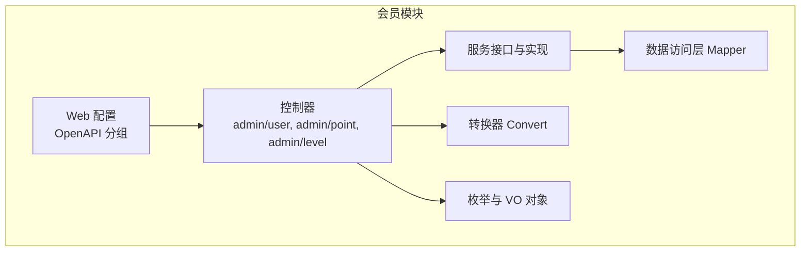
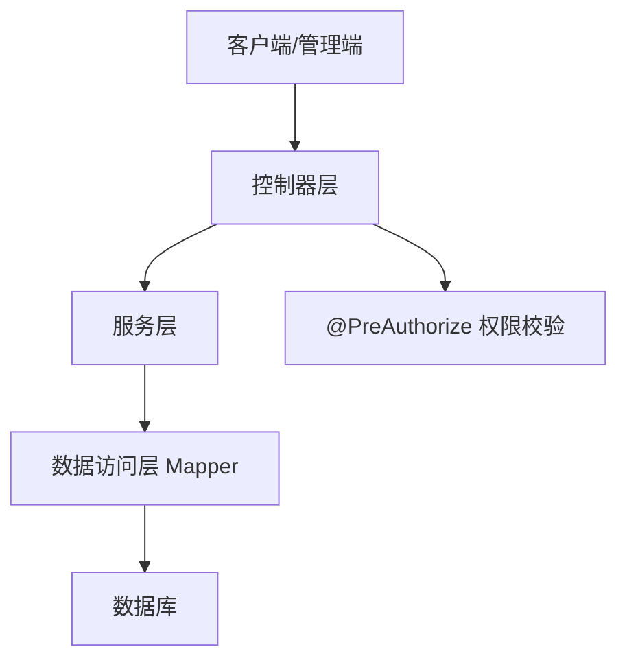
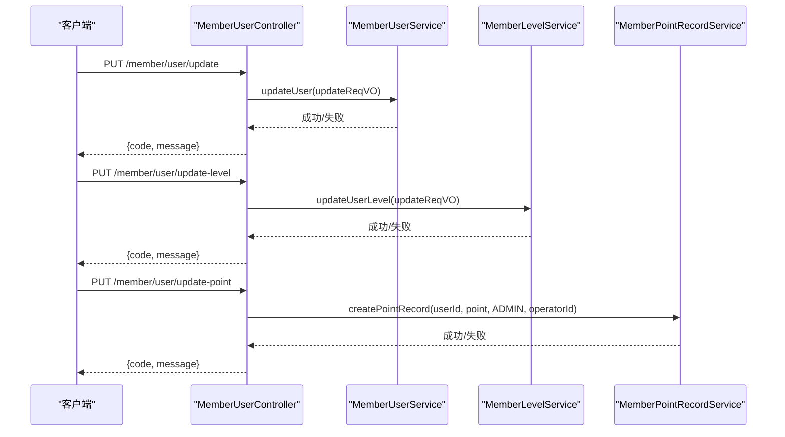
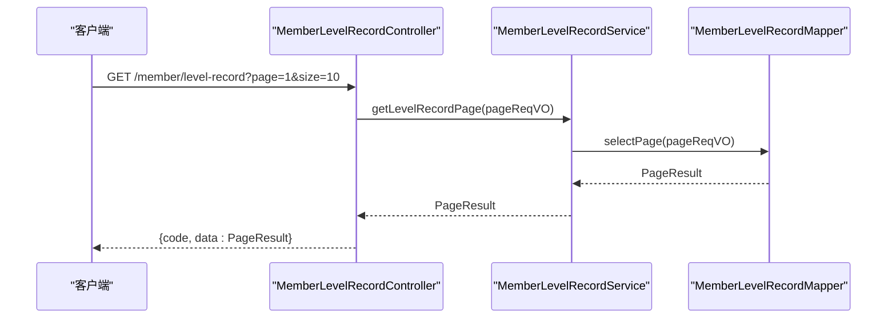
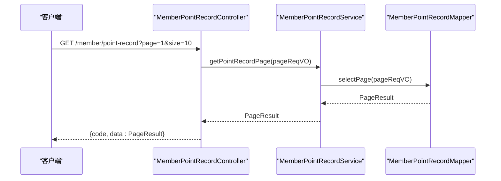
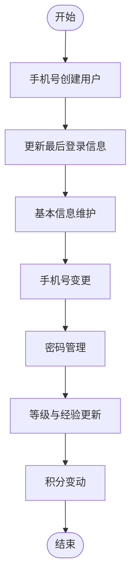
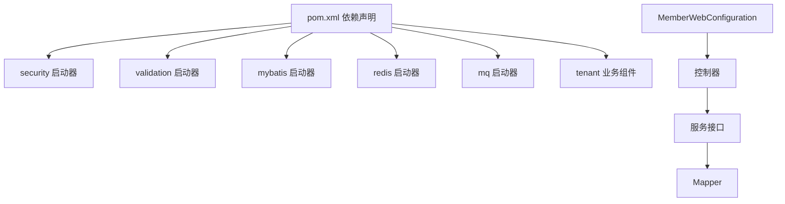

# 会员管理 API

<cite>
**本文档引用的文件**
- [MemberUserController.java](file://backend/yudao-module-member/src/main/java/cn/iocoder/yudao/module/member/controller/admin/user/MemberUserController.java)
- [MemberPointRecordController.java](file://backend/yudao-module-member/src/main/java/cn/iocoder/yudao/module/member/controller/admin/point/MemberPointRecordController.java)
- [MemberLevelRecordController.java](file://backend/yudao-module-member/src/main/java/cn/iocoder/yudao/module/member/controller/admin/level/MemberLevelRecordController.java)
- [MemberExperienceRecordController.java](file://backend/yudao-module-member/src/main/java/cn/iocoder/yudao/module/member/controller/admin/level/MemberExperienceRecordController.java)
- [MemberUserService.java](file://backend/yudao-module-member/src/main/java/cn/iocoder/yudao/module/member/service/user/MemberUserService.java)
- [MemberPointRecordService.java](file://backend/yudao-module-member/src/main/java/cn/iocoder/yudao/module/member/service/point/MemberPointRecordService.java)
- [MemberLevelService.java](file://backend/yudao-module-member/src/main/java/cn/iocoder/yudao/module/member/service/level/MemberLevelService.java)
- [MemberLevelRecordService.java](file://backend/yudao-module-member/src/main/java/cn/iocoder/yudao/module/member/service/level/MemberLevelRecordService.java)
- [MemberWebConfiguration.java](file://backend/yudao-module-member/src/main/java/cn/iocoder/yudao/module/member/framework/web/config/MemberWebConfiguration.java)
- [package-info.java](file://backend/yudao-module-member/src/main/java/cn/iocoder/yudao/module/member/package-info.java)
- [pom.xml](file://backend/yudao-module-member/pom.xml)
- [ruoyi-vue-pro.sql](file://backend/sql/postgresql/ruoyi-vue-pro.sql)
</cite>

## 目录
1. [简介](#简介)
2. [项目结构](#项目结构)
3. [核心组件](#核心组件)
4. [架构总览](#架构总览)
5. [详细组件分析](#详细组件分析)
6. [依赖关系分析](#依赖关系分析)
7. [性能考虑](#性能考虑)
8. [故障排除指南](#故障排除指南)
9. [结论](#结论)

## 简介
本文件为会员管理 API 的完整技术文档，覆盖用户管理、等级管理、积分管理与经验记录等会员相关能力。文档面向后端开发者与测试人员，提供接口定义、数据模型、权限控制、错误处理与最佳实践建议，并附带关键流程图与时序图，帮助快速理解与集成。

## 项目结构
会员模块位于 backend/yudao-module-member，采用按功能域划分的包结构，包含控制器、服务层、数据访问层、转换器与枚举等。模块通过 SpringDoc OpenAPI 进行接口文档分组，URL 前缀统一为 /member/，避免与其他模块冲突。



图表来源
- [MemberUserController.java:1-124](file://backend/yudao-module-member/src/main/java/cn/iocoder/yudao/module/member/controller/admin/user/MemberUserController.java#L1-L124)
- [MemberPointRecordController.java:1-25](file://backend/yudao-module-member/src/main/java/cn/iocoder/yudao/module/member/controller/admin/point/MemberPointRecordController.java#L1-L25)
- [MemberLevelRecordController.java:1-28](file://backend/yudao-module-member/src/main/java/cn/iocoder/yudao/module/member/controller/admin/level/MemberLevelRecordController.java#L1-L28)
- [MemberExperienceRecordController.java:1-26](file://backend/yudao-module-member/src/main/java/cn/iocoder/yudao/module/member/controller/admin/level/MemberExperienceRecordController.java#L1-L26)
- [MemberWebConfiguration.java:1-24](file://backend/yudao-module-member/src/main/java/cn/iocoder/yudao/module/member/framework/web/config/MemberWebConfiguration.java#L1-L24)

章节来源
- [package-info.java:1-9](file://backend/yudao-module-member/src/main/java/cn/iocoder/yudao/module/member/package-info.java#L1-L9)
- [MemberWebConfiguration.java:1-24](file://backend/yudao-module-member/src/main/java/cn/iocoder/yudao/module/member/framework/web/config/MemberWebConfiguration.java#L1-L24)

## 核心组件
- 控制器层：提供 RESTful 接口，负责请求参数接收、权限校验与响应封装。
- 服务层：封装业务逻辑，协调领域对象与数据访问层。
- 数据访问层：基于 MyBatis，提供分页查询、插入与更新操作。
- 转换器：负责 DO/VO/DTO 之间的数据映射。
- 枚举与 VO：定义业务类型、请求/响应参数结构与校验规则。

章节来源
- [MemberUserController.java:1-124](file://backend/yudao-module-member/src/main/java/cn/iocoder/yudao/module/member/controller/admin/user/MemberUserController.java#L1-L124)
- [MemberPointRecordController.java:1-25](file://backend/yudao-module-member/src/main/java/cn/iocoder/yudao/module/member/controller/admin/point/MemberPointRecordController.java#L1-L25)
- [MemberLevelRecordController.java:1-28](file://backend/yudao-module-member/src/main/java/cn/iocoder/yudao/module/member/controller/admin/level/MemberLevelRecordController.java#L1-L28)
- [MemberExperienceRecordController.java:1-26](file://backend/yudao-module-member/src/main/java/cn/iocoder/yudao/module/member/controller/admin/level/MemberExperienceRecordController.java#L1-L26)

## 架构总览
会员模块遵循典型的分层架构，控制器层通过注解进行权限控制，调用服务层完成业务处理，服务层通过 Mapper 访问数据库。OpenAPI 分组确保接口文档清晰可读。



图表来源
- [MemberUserController.java:54-77](file://backend/yudao-module-member/src/main/java/cn/iocoder/yudao/module/member/controller/admin/user/MemberUserController.java#L54-L77)
- [MemberPointRecordController.java:1-25](file://backend/yudao-module-member/src/main/java/cn/iocoder/yudao/module/member/controller/admin/point/MemberPointRecordController.java#L1-L25)
- [MemberLevelRecordController.java:1-28](file://backend/yudao-module-member/src/main/java/cn/iocoder/yudao/module/member/controller/admin/level/MemberLevelRecordController.java#L1-L28)
- [MemberExperienceRecordController.java:1-26](file://backend/yudao-module-member/src/main/java/cn/iocoder/yudao/module/member/controller/admin/level/MemberExperienceRecordController.java#L1-L26)

## 详细组件分析

### 用户管理接口
- 接口概览
  - 更新会员用户：PUT /member/user/update
  - 更新会员用户等级：PUT /member/user/update-level
  - 更新会员用户积分：PUT /member/user/update-point
  - 获取单个会员用户：GET /member/user/get?id={id}
  - 获取会员用户分页：GET /member/user/page

- 权限控制
  - 使用 @PreAuthorize 进行权限校验，如 member:user:update、member:user:update-level、member:user:update-point、member:user:query。

- 数据模型与流程
  - 用户信息维护：调用 MemberUserService.updateUser，支持昵称、头像、性别、标签等字段更新。
  - 等级变更：调用 MemberLevelService.updateUserLevel，触发等级记录与经验变动。
  - 积分变更：调用 MemberPointRecordService.createPointRecord，记录积分变动明细。



图表来源
- [MemberUserController.java:54-77](file://backend/yudao-module-member/src/main/java/cn/iocoder/yudao/module/member/controller/admin/user/MemberUserController.java#L54-L77)
- [MemberUserService.java:133-138](file://backend/yudao-module-member/src/main/java/cn/iocoder/yudao/module/member/service/user/MemberUserService.java#L133-L138)
- [MemberLevelService.java:1-47](file://backend/yudao-module-member/src/main/java/cn/iocoder/yudao/module/member/service/level/MemberLevelService.java#L1-L47)
- [MemberPointRecordService.java:33-42](file://backend/yudao-module-member/src/main/java/cn/iocoder/yudao/module/member/service/point/MemberPointRecordService.java#L33-L42)

章节来源
- [MemberUserController.java:54-121](file://backend/yudao-module-member/src/main/java/cn/iocoder/yudao/module/member/controller/admin/user/MemberUserController.java#L54-L121)
- [MemberUserService.java:133-146](file://backend/yudao-module-member/src/main/java/cn/iocoder/yudao/module/member/service/user/MemberUserService.java#L133-L146)

### 等级管理接口
- 接口概览
  - 会员等级记录分页：GET /member/level-record
  - 会员经验记录分页：GET /member/experience-record

- 权限控制
  - 使用 @PreAuthorize 进行权限校验，如 member:level:query、member:level:create 等。

- 数据模型与流程
  - 等级记录：MemberLevelRecordController 调用 MemberLevelRecordService 获取分页记录。
  - 经验记录：MemberExperienceRecordController 调用 MemberExperienceRecordService 获取分页记录。



图表来源
- [MemberLevelRecordController.java:1-28](file://backend/yudao-module-member/src/main/java/cn/iocoder/yudao/module/member/controller/admin/level/MemberLevelRecordController.java#L1-L28)
- [MemberLevelRecordService.java:1-37](file://backend/yudao-module-member/src/main/java/cn/iocoder/yudao/module/member/service/level/MemberLevelRecordService.java#L1-L37)

章节来源
- [MemberLevelRecordController.java:1-28](file://backend/yudao-module-member/src/main/java/cn/iocoder/yudao/module/member/controller/admin/level/MemberLevelRecordController.java#L1-L28)
- [MemberExperienceRecordController.java:1-26](file://backend/yudao-module-member/src/main/java/cn/iocoder/yudao/module/member/controller/admin/level/MemberExperienceRecordController.java#L1-L26)

### 积分管理接口
- 接口概览
  - 管理员查询积分记录分页：GET /member/point-record

- 权限控制
  - 使用 @PreAuthorize 进行权限校验，如 member:point:query。

- 数据模型与流程
  - 管理端分页查询：MemberPointRecordController 调用 MemberPointRecordService.getPointRecordPage。
  - 会员端分页查询：MemberPointRecordService.getPointRecordPage(userId, pageReqVO)。
  - 积分变动：MemberPointRecordService.createPointRecord(userId, point, bizType, bizId)。



图表来源
- [MemberPointRecordController.java:1-25](file://backend/yudao-module-member/src/main/java/cn/iocoder/yudao/module/member/controller/admin/point/MemberPointRecordController.java#L1-L25)
- [MemberPointRecordService.java:1-42](file://backend/yudao-module-member/src/main/java/cn/iocoder/yudao/module/member/service/point/MemberPointRecordService.java#L1-L42)

章节来源
- [MemberPointRecordController.java:1-25](file://backend/yudao-module-member/src/main/java/cn/iocoder/yudao/module/member/controller/admin/point/MemberPointRecordController.java#L1-L25)
- [MemberPointRecordService.java:1-42](file://backend/yudao-module-member/src/main/java/cn/iocoder/yudao/module/member/service/point/MemberPointRecordService.java#L1-L42)

### 数据模型与业务流程

#### 用户数据模型
- 关键字段：用户标识、昵称、头像、手机、性别、等级、经验、标签、分组、注册终端、登录信息等。
- 关系：用户与等级、标签、分组存在多对一或一对多关系；积分记录与用户存在一对多关系。

```mermaid
erDiagram
MEMBER_USER {
bigint id PK
string nickname
string avatar
string mobile
integer gender
bigint group_id FK
bigint level_id FK
integer experience
json tag_ids
integer terminal
string last_login_ip
datetime last_login_time
datetime create_time
datetime update_time
}
MEMBER_LEVEL {
bigint id PK
string name
integer requirement
integer status
datetime create_time
datetime update_time
}
MEMBER_TAG {
bigint id PK
string name
integer color
datetime create_time
datetime update_time
}
MEMBER_GROUP {
bigint id PK
string name
datetime create_time
datetime update_time
}
MEMBER_POINT_RECORD {
bigint id PK
bigint user_id FK
integer point
integer biz_type
string biz_id
datetime create_time
}
MEMBER_USER }o--|| MEMBER_LEVEL : "属于"
MEMBER_USER }o--o|| MEMBER_GROUP : "属于"
MEMBER_USER }o--o|| MEMBER_TAG : "拥有多个"
MEMBER_USER ||--o{ MEMBER_POINT_RECORD : "产生记录"
```

图表来源
- [MemberUserController.java:8-16](file://backend/yudao-module-member/src/main/java/cn/iocoder/yudao/module/member/controller/admin/user/MemberUserController.java#L8-L16)
- [MemberPointRecordController.java:5-11](file://backend/yudao-module-member/src/main/java/cn/iocoder/yudao/module/member/controller/admin/point/MemberPointRecordController.java#L5-L11)

#### 用户生命周期管理流程
- 注册与登录：基于手机号创建用户，更新最后登录信息。
- 基本信息维护：支持昵称、头像、性别等字段更新。
- 手机号变更：支持短信验证码与微信授权两种方式。
- 密码管理：支持重置与校验。
- 等级与经验：根据经验值动态调整等级，记录等级变更日志。
- 积分管理：支持管理员手动增减积分与业务场景自动记账。



图表来源
- [MemberUserService.java:38-122](file://backend/yudao-module-member/src/main/java/cn/iocoder/yudao/module/member/service/user/MemberUserService.java#L38-L122)
- [MemberLevelService.java:1-47](file://backend/yudao-module-member/src/main/java/cn/iocoder/yudao/module/member/service/level/MemberLevelService.java#L1-L47)
- [MemberPointRecordService.java:33-42](file://backend/yudao-module-member/src/main/java/cn/iocoder/yudao/module/member/service/point/MemberPointRecordService.java#L33-L42)

章节来源
- [MemberUserService.java:1-191](file://backend/yudao-module-member/src/main/java/cn/iocoder/yudao/module/member/service/user/MemberUserService.java#L1-L191)
- [MemberLevelService.java:1-47](file://backend/yudao-module-member/src/main/java/cn/iocoder/yudao/module/member/service/level/MemberLevelService.java#L1-L47)
- [MemberPointRecordService.java:1-42](file://backend/yudao-module-member/src/main/java/cn/iocoder/yudao/module/member/service/point/MemberPointRecordService.java#L1-L42)

## 依赖关系分析
- 模块依赖：会员模块依赖系统模块与基础设施模块，以及安全、校验、MyBatis、Redis、消息队列等启动器。
- 控制器依赖：控制器通过 @Resource 注入服务层接口，服务层再依赖 Mapper。
- OpenAPI 分组：通过 MemberWebConfiguration 将会员模块接口归入 member 分组，便于文档聚合。



图表来源
- [pom.xml:20-83](file://backend/yudao-module-member/pom.xml#L20-L83)
- [MemberWebConfiguration.java:1-24](file://backend/yudao-module-member/src/main/java/cn/iocoder/yudao/module/member/framework/web/config/MemberWebConfiguration.java#L1-L24)

章节来源
- [pom.xml:1-87](file://backend/yudao-module-member/pom.xml#L1-L87)
- [MemberWebConfiguration.java:1-24](file://backend/yudao-module-member/src/main/java/cn/iocoder/yudao/module/member/framework/web/config/MemberWebConfiguration.java#L1-L24)

## 性能考虑
- 分页查询：所有列表接口均使用 PageResult，建议合理设置分页大小与排序字段，避免一次性加载过多数据。
- 批量查询：用户分页时会批量获取标签、等级、分组信息，注意避免 N+1 查询问题，可通过预加载或合并查询优化。
- 缓存策略：结合 Redis 启动器，对热点用户信息与配置进行缓存，降低数据库压力。
- 并发控制：积分与等级变更涉及原子性，建议使用数据库事务与版本号控制，防止超扣或重复升级。

## 故障排除指南
- 权限不足：若返回权限校验失败，请确认当前账号是否具备 member:* 权限。
- 参数校验失败：检查请求体字段类型与必填项，确保符合 VO 定义。
- 数据不存在：用户查询为空或等级/标签缺失时，需先创建基础数据。
- 积分不足：管理员手动调整积分前，应确保用户账户状态正常且余额充足。

章节来源
- [MemberUserController.java:54-77](file://backend/yudao-module-member/src/main/java/cn/iocoder/yudao/module/member/controller/admin/user/MemberUserController.java#L54-L77)
- [MemberPointRecordService.java:33-42](file://backend/yudao-module-member/src/main/java/cn/iocoder/yudao/module/member/service/point/MemberPointRecordService.java#L33-L42)

## 结论
会员管理 API 提供了完善的用户、等级、积分与经验记录的管理能力，接口设计遵循 RESTful 规范，配合权限控制与 OpenAPI 文档分组，便于前后端协作与运维管理。建议在生产环境中结合缓存与事务控制，持续优化分页与批量查询性能，并完善异常监控与告警机制。