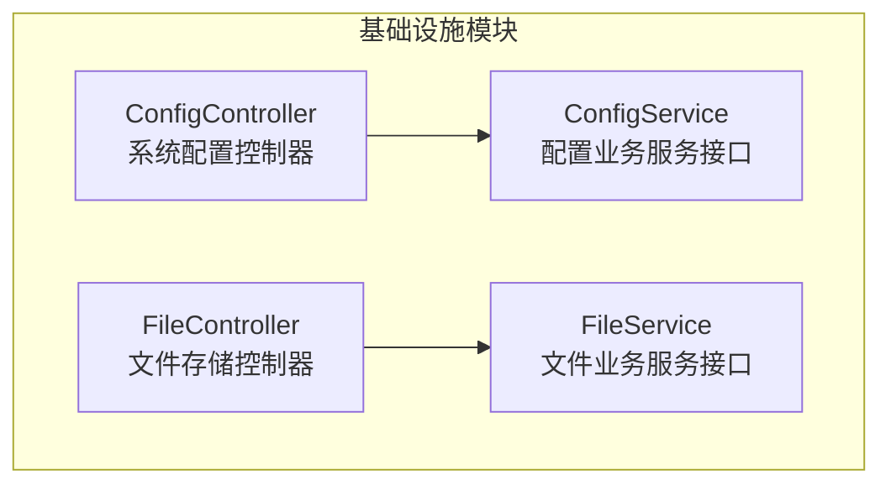
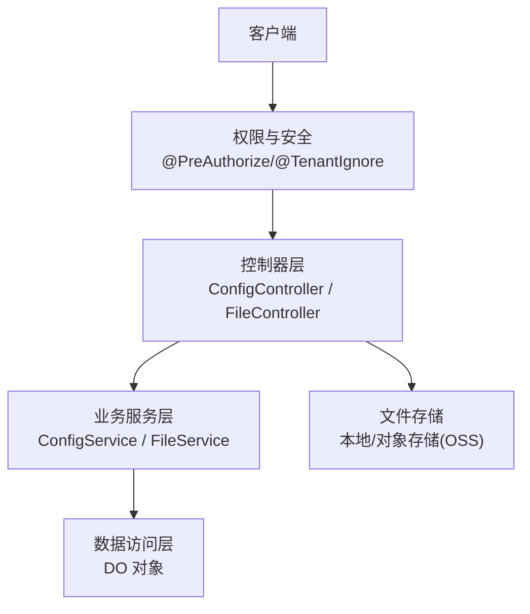
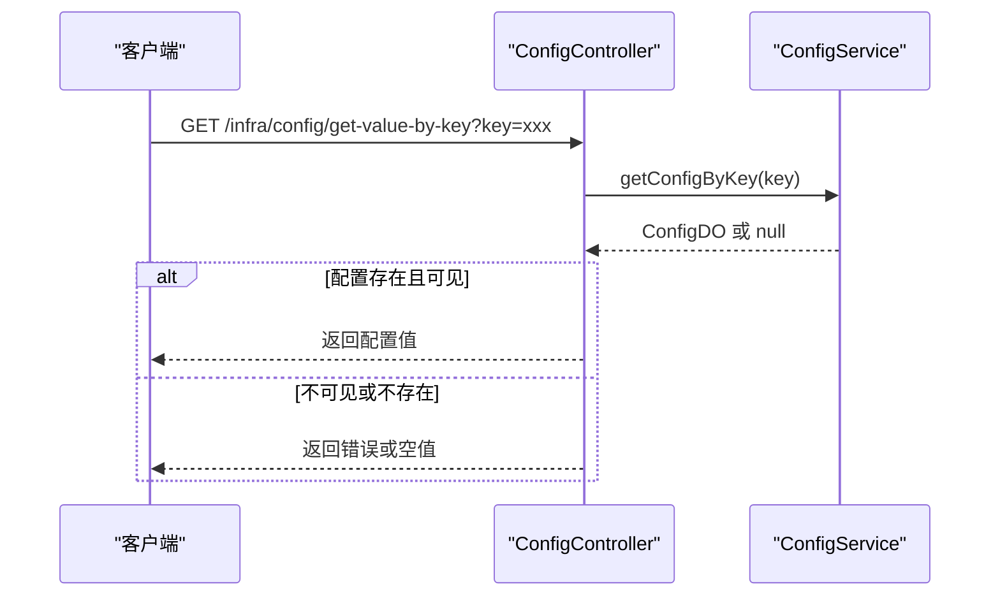
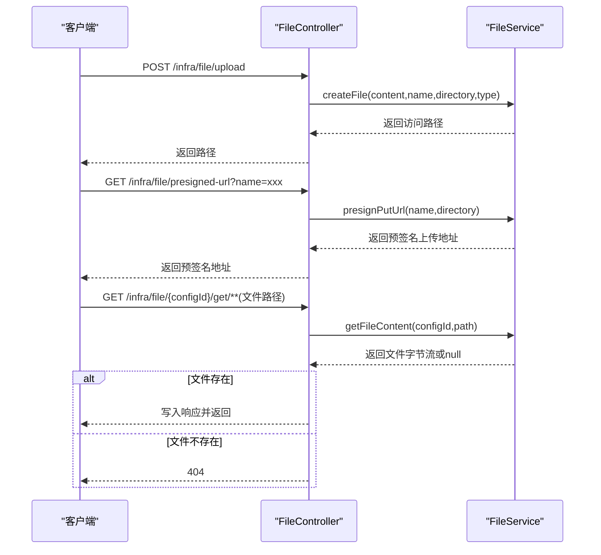
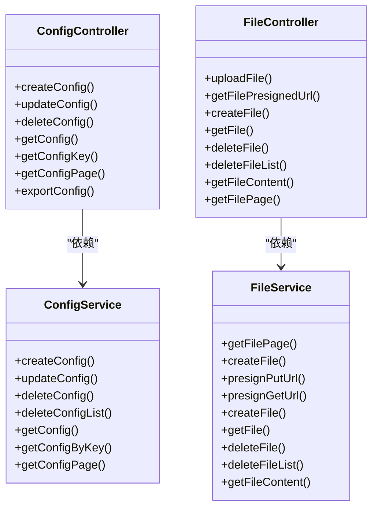

# 基础设施管理 API

<cite>
**本文档引用的文件**
- [ConfigController.java](file://backend/yudao-module-infra/src/main/java/cn/iocoder/yudao/module/infra/controller/admin/config/ConfigController.java)
- [FileController.java](file://backend/yudao-module-infra/src/main/java/cn/iocoder/yudao/module/infra/controller/admin/file/FileController.java)
- [ConfigService.java](file://backend/yudao-module-infra/src/main/java/cn/iocoder/yudao/module/infra/service/config/ConfigService.java)
- [FileService.java](file://backend/yudao-module-infra/src/main/java/cn/iocoder/yudao/module/infra/service/file/FileService.java)
</cite>

## 目录
1. [简介](#简介)
2. [项目结构](#项目结构)
3. [核心组件](#核心组件)
4. [架构总览](#架构总览)
5. [详细组件分析](#详细组件分析)
6. [依赖关系分析](#依赖关系分析)
7. [性能考虑](#性能考虑)
8. [故障排除指南](#故障排除指南)
9. [结论](#结论)

## 简介
本文件为基础设施管理 API 的技术文档，覆盖以下基础设施能力：
- 系统配置管理：参数配置的增删改查、分页查询与导出
- 文件管理：文件上传、下载、删除、分页查询；支持后端直传与前端直连 OSS 的两种上传模式
- 定时任务管理：基于 Quartz 的任务调度管理（通过框架启动）
- 代码生成：基于模板的代码自动生成（通过框架启动）

同时，文档说明了文件存储策略、任务执行监控机制以及基础设施层的服务发现与负载均衡策略。

## 项目结构
基础设施模块位于后端 yudao-module-infra 中，采用按功能域划分的包结构：
- controller.admin.config：系统配置管理控制器
- controller.admin.file：文件存储控制器
- service.config：配置业务服务接口
- service.file：文件业务服务接口
- dal.dataobject.config：配置数据对象
- dal.dataobject.file：文件数据对象
- framework.*：基础设施框架组件（如文件直链、Excel 导出等）

图表来源
- [ConfigController.java:36-118](file://backend/yudao-module-infra/src/main/java/cn/iocoder/yudao/module/infra/controller/admin/config/ConfigController.java#L36-L118)
- [FileController.java:41-138](file://backend/yudao-module-infra/src/main/java/cn/iocoder/yudao/module/infra/controller/admin/file/FileController.java#L41-L138)
- [ConfigService.java:16-72](file://backend/yudao-module-infra/src/main/java/cn/iocoder/yudao/module/infra/service/config/ConfigService.java#L16-L72)
- [FileService.java:17-90](file://backend/yudao-module-infra/src/main/java/cn/iocoder/yudao/module/infra/service/file/FileService.java#L17-L90)

章节来源
- [ConfigController.java:32-36](file://backend/yudao-module-infra/src/main/java/cn/iocoder/yudao/module/infra/controller/admin/config/ConfigController.java#L32-L36)
- [FileController.java:36-41](file://backend/yudao-module-infra/src/main/java/cn/iocoder/yudao/module/infra/controller/admin/file/FileController.java#L36-L41)

## 核心组件
- 系统配置管理控制器：提供配置的创建、更新、删除、单个查询、键值查询、分页查询与导出
- 文件存储控制器：提供文件上传（后端直传/前端直连）、预签名上传链接、文件记录创建、下载、删除、分页查询
- 配置业务服务接口：定义配置的增删改查与分页查询契约
- 文件业务服务接口：定义文件的上传、预签名、下载、删除与分页查询契约

章节来源
- [ConfigController.java:41-118](file://backend/yudao-module-infra/src/main/java/cn/iocoder/yudao/module/infra/controller/admin/config/ConfigController.java#L41-L118)
- [FileController.java:46-138](file://backend/yudao-module-infra/src/main/java/cn/iocoder/yudao/module/infra/controller/admin/file/FileController.java#L46-L138)
- [ConfigService.java:16-72](file://backend/yudao-module-infra/src/main/java/cn/iocoder/yudao/module/infra/service/config/ConfigService.java#L16-L72)
- [FileService.java:17-90](file://backend/yudao-module-infra/src/main/java/cn/iocoder/yudao/module/infra/service/file/FileService.java#L17-L90)

## 架构总览
基础设施 API 采用典型的分层架构：
- 控制器层：暴露 RESTful 接口，负责请求处理与权限控制
- 业务服务层：封装领域逻辑，协调数据访问与外部集成
- 数据访问层：通过 DO 对象与数据库交互（由框架统一管理）
- 基础设施框架：提供文件直链、Excel 导出、安全鉴权、租户隔离等通用能力

图表来源
- [ConfigController.java:36-118](file://backend/yudao-module-infra/src/main/java/cn/iocoder/yudao/module/infra/controller/admin/config/ConfigController.java#L36-L118)
- [FileController.java:41-138](file://backend/yudao-module-infra/src/main/java/cn/iocoder/yudao/module/infra/controller/admin/file/FileController.java#L41-L138)
- [ConfigService.java:16-72](file://backend/yudao-module-infra/src/main/java/cn/iocoder/yudao/module/infra/service/config/ConfigService.java#L16-L72)
- [FileService.java:17-90](file://backend/yudao-module-infra/src/main/java/cn/iocoder/yudao/module/infra/service/file/FileService.java#L17-L90)

## 详细组件分析

### 系统配置管理 API
- 接口概览
  - 创建配置：POST /infra/config/create
  - 更新配置：PUT /infra/config/update
  - 删除配置：DELETE /infra/config/delete?id={id}
  - 批量删除：DELETE /infra/config/delete-list?ids={id1,id2,...}
  - 查询配置：GET /infra/config/get?id={id}
  - 键值查询：GET /infra/config/get-value-by-key?key={key}
  - 分页查询：GET /infra/config/page
  - 导出配置：GET /infra/config/export-excel

- 关键行为
  - 键值查询对可见性进行控制，不可见配置不返回值
  - 导出使用 Excel 工具输出到响应流
  - 权限注解确保仅授权用户可执行相应操作

图表来源
- [ConfigController.java:82-94](file://backend/yudao-module-infra/src/main/java/cn/iocoder/yudao/module/infra/controller/admin/config/ConfigController.java#L82-L94)
- [ConfigService.java:55-61](file://backend/yudao-module-infra/src/main/java/cn/iocoder/yudao/module/infra/service/config/ConfigService.java#L55-L61)

章节来源
- [ConfigController.java:41-118](file://backend/yudao-module-infra/src/main/java/cn/iocoder/yudao/module/infra/controller/admin/config/ConfigController.java#L41-L118)
- [ConfigService.java:16-72](file://backend/yudao-module-infra/src/main/java/cn/iocoder/yudao/module/infra/service/config/ConfigService.java#L16-L72)

### 文件存储 API
- 接口概览
  - 后端直传：POST /infra/file/upload
  - 获取预签名上传地址：GET /infra/file/presigned-url?name={file}&directory={dir}
  - 记录前端直传文件：POST /infra/file/create
  - 下载文件：GET /infra/file/{configId}/get/**（路径参数）
  - 查询文件：GET /infra/file/get?id={id}
  - 删除文件：DELETE /infra/file/delete?id={id}
  - 批量删除：DELETE /infra/file/delete-list?ids={id1,id2,...}
  - 分页查询：GET /infra/file/page

- 关键行为
  - 支持后端直传（服务端接收字节流）与前端直连对象存储两种模式
  - 下载接口支持中文路径解码与 404 处理
  - 租户忽略注解用于跨租户文件访问场景

图表来源
- [FileController.java:46-127](file://backend/yudao-module-infra/src/main/java/cn/iocoder/yudao/module/infra/controller/admin/file/FileController.java#L46-L127)
- [FileService.java:36-87](file://backend/yudao-module-infra/src/main/java/cn/iocoder/yudao/module/infra/service/file/FileService.java#L36-L87)

章节来源
- [FileController.java:46-138](file://backend/yudao-module-infra/src/main/java/cn/iocoder/yudao/module/infra/controller/admin/file/FileController.java#L46-L138)
- [FileService.java:17-90](file://backend/yudao-module-infra/src/main/java/cn/iocoder/yudao/module/infra/service/file/FileService.java#L17-L90)

### 定时任务管理 API
- 说明
  - 基于 Quartz 的任务调度管理通过框架启动，提供任务的创建、暂停、恢复、删除与执行监控
  - 任务执行状态可通过监控端点与日志进行观测
  - 任务持久化与集群部署由框架统一处理

[本节为概念性说明，不直接分析具体文件]

### 代码生成 API
- 说明
  - 基于模板的代码自动生成能力通过框架启动，支持快速生成基础 CRUD 代码
  - 生成结果可直接集成到现有工程中，减少重复开发工作量

[本节为概念性说明，不直接分析具体文件]

## 依赖关系分析
- 控制器与服务
  - ConfigController 依赖 ConfigService
  - FileController 依赖 FileService
- 服务接口职责清晰，便于替换实现与扩展
- 控制器层仅负责请求映射与权限控制，业务逻辑集中在服务层

图表来源
- [ConfigController.java:36-118](file://backend/yudao-module-infra/src/main/java/cn/iocoder/yudao/module/infra/controller/admin/config/ConfigController.java#L36-L118)
- [ConfigService.java:16-72](file://backend/yudao-module-infra/src/main/java/cn/iocoder/yudao/module/infra/service/config/ConfigService.java#L16-L72)
- [FileController.java:41-138](file://backend/yudao-module-infra/src/main/java/cn/iocoder/yudao/module/infra/controller/admin/file/FileController.java#L41-L138)
- [FileService.java:17-90](file://backend/yudao-module-infra/src/main/java/cn/iocoder/yudao/module/infra/service/file/FileService.java#L17-L90)

## 性能考虑
- 文件下载优化
  - 使用预签名直链方式可降低服务端带宽压力，适合大文件与高并发场景
  - 后端直传适合敏感文件与需要服务端校验的场景
- 配置查询
  - 键值查询对不可见配置进行保护，避免敏感信息泄露
- 分页与导出
  - 导出接口设置分页上限以防止内存溢出
- 任务调度
  - 建议合理设置任务粒度与并发度，结合监控端点观察执行耗时与失败率

[本节提供一般性指导，不直接分析具体文件]

## 故障排除指南
- 文件下载 404
  - 检查路径参数是否正确传递与解码
  - 确认文件在指定配置编号下是否存在
- 预签名地址无效
  - 核对文件名与目录参数
  - 检查对象存储凭证与桶权限
- 配置键值查询异常
  - 不可见配置不会返回值，请确认配置可见性
- 导出失败
  - 确认导出分页大小限制与 Excel 工具可用性

章节来源
- [FileController.java:101-127](file://backend/yudao-module-infra/src/main/java/cn/iocoder/yudao/module/infra/controller/admin/file/FileController.java#L101-L127)
- [ConfigController.java:82-94](file://backend/yudao-module-infra/src/main/java/cn/iocoder/yudao/module/infra/controller/admin/config/ConfigController.java#L82-L94)

## 结论
基础设施管理 API 提供了完善的系统配置与文件管理能力，并通过框架支持定时任务与代码生成。其分层设计清晰、职责明确，具备良好的扩展性与安全性。建议在生产环境中结合预签名直链与监控端点，持续优化性能与稳定性。