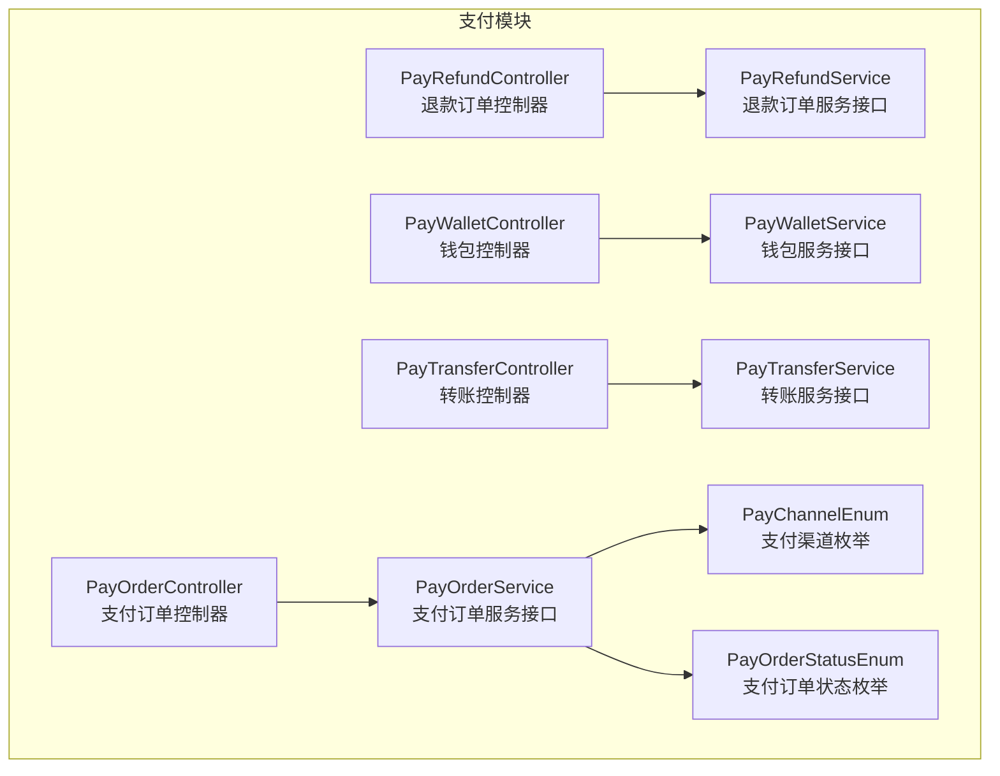
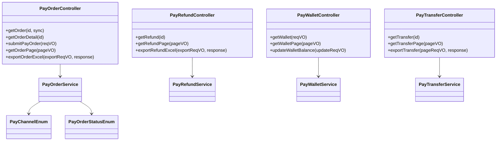
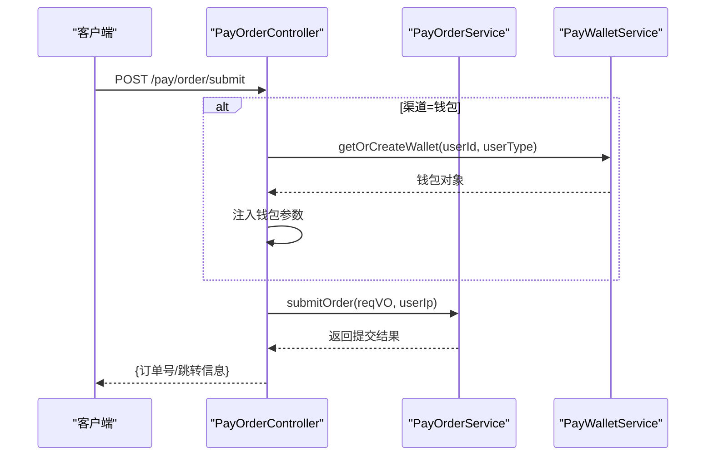
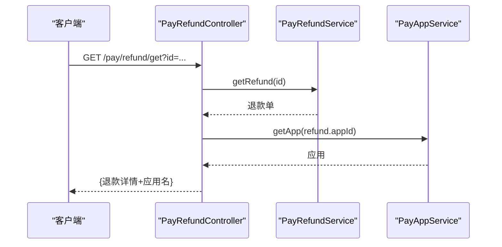
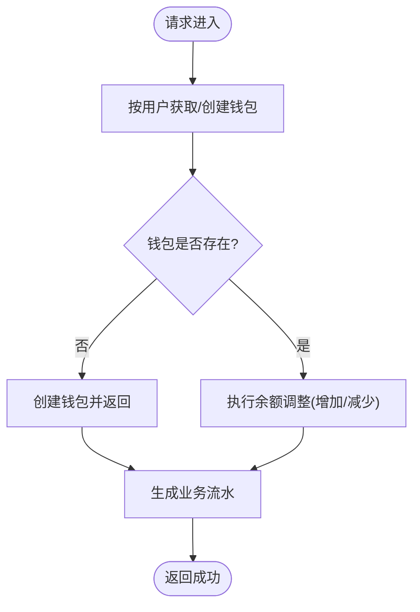
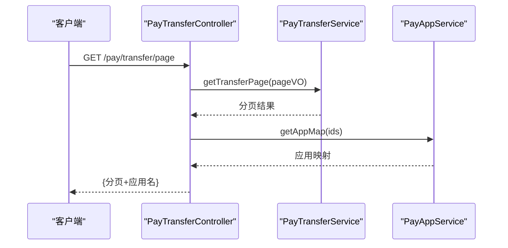
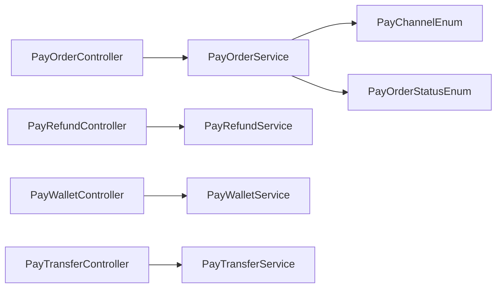

# 支付管理 API

<cite>
**本文引用的文件**
- [PayOrderController.java](file://backend/yudao-module-pay/src/main/java/cn/iocoder/yudao/module/pay/controller/admin/order/PayOrderController.java)
- [PayRefundController.java](file://backend/yudao-module-pay/src/main/java/cn/iocoder/yudao/module/pay/controller/admin/refund/PayRefundController.java)
- [PayWalletController.java](file://backend/yudao-module-pay/src/main/java/cn/iocoder/yudao/module/pay/controller/admin/wallet/PayWalletController.java)
- [PayTransferController.java](file://backend/yudao-module-pay/src/main/java/cn/iocoder/yudao/module/pay/controller/admin/transfer/PayTransferController.java)
- [PayOrderService.java](file://backend/yudao-module-pay/src/main/java/cn/iocoder/yudao/module/pay/service/order/PayOrderService.java)
- [PayRefundService.java](file://backend/yudao-module-pay/src/main/java/cn/iocoder/yudao/module/pay/service/refund/PayRefundService.java)
- [PayWalletService.java](file://backend/yudao-module-pay/src/main/java/cn/iocoder/yudao/module/pay/service/wallet/PayWalletService.java)
- [PayTransferService.java](file://backend/yudao-module-pay/src/main/java/cn/iocoder/yudao/module/pay/service/transfer/PayTransferService.java)
- [PayChannelEnum.java](file://backend/yudao-module-pay/src/main/java/cn/iocoder/yudao/module/pay/enums/PayChannelEnum.java)
- [PayOrderStatusEnum.java](file://backend/yudao-module-pay/src/main/java/cn/iocoder/yudao/module/pay/enums/order/PayOrderStatusEnum.java)
</cite>

## 目录
1. [简介](#简介)
2. [项目结构](#项目结构)
3. [核心组件](#核心组件)
4. [架构总览](#架构总览)
5. [详细组件分析](#详细组件分析)
6. [依赖分析](#依赖分析)
7. [性能考虑](#性能考虑)
8. [故障排查指南](#故障排查指南)
9. [结论](#结论)
10. [附录](#附录)

## 简介
本文件面向支付管理模块的 RESTful API，覆盖支付订单管理、退款管理、钱包管理和转账打款等核心能力。内容包括：
- 支付订单：创建、提交、状态查询与同步、导出
- 退款订单：查询、分页、导出
- 钱包：余额查询、余额调整、交易流水
- 转账：转账单查询、分页、导出
- 安全与保障：权限控制、幂等与一致性策略、异常处理建议
- 流程图与序列图：支付、退款、钱包、转账的关键流程示意

## 项目结构
支付模块采用“控制器-服务-数据对象”分层设计，控制器负责对外暴露 REST API，服务层编排业务逻辑，枚举定义状态与渠道类型。

图表来源
- [PayOrderController.java:46-146](file://backend/yudao-module-pay/src/main/java/cn/iocoder/yudao/module/pay/controller/admin/order/PayOrderController.java#L46-L146)
- [PayRefundController.java:35-91](file://backend/yudao-module-pay/src/main/java/cn/iocoder/yudao/module/pay/controller/admin/refund/PayRefundController.java#L35-L91)
- [PayWalletController.java:27-71](file://backend/yudao-module-pay/src/main/java/cn/iocoder/yudao/module/pay/controller/admin/wallet/PayWalletController.java#L27-L71)
- [PayTransferController.java:34-92](file://backend/yudao-module-pay/src/main/java/cn/iocoder/yudao/module/pay/controller/admin/transfer/PayTransferController.java#L34-L92)
- [PayOrderService.java:24-168](file://backend/yudao-module-pay/src/main/java/cn/iocoder/yudao/module/pay/service/order/PayOrderService.java#L24-L168)
- [PayRefundService.java:17-83](file://backend/yudao-module-pay/src/main/java/cn/iocoder/yudao/module/pay/service/refund/PayRefundService.java#L17-L83)
- [PayWalletService.java:14-100](file://backend/yudao-module-pay/src/main/java/cn/iocoder/yudao/module/pay/service/wallet/PayWalletService.java#L14-L100)
- [PayTransferService.java:16-71](file://backend/yudao-module-pay/src/main/java/cn/iocoder/yudao/module/pay/service/transfer/PayTransferService.java#L16-L71)
- [PayChannelEnum.java:16-68](file://backend/yudao-module-pay/src/main/java/cn/iocoder/yudao/module/pay/enums/PayChannelEnum.java#L16-L68)
- [PayOrderStatusEnum.java:15-85](file://backend/yudao-module-pay/src/main/java/cn/iocoder/yudao/module/pay/enums/order/PayOrderStatusEnum.java#L15-L85)

章节来源
- [PayOrderController.java:46-146](file://backend/yudao-module-pay/src/main/java/cn/iocoder/yudao/module/pay/controller/admin/order/PayOrderController.java#L46-L146)
- [PayRefundController.java:35-91](file://backend/yudao-module-pay/src/main/java/cn/iocoder/yudao/module/pay/controller/admin/refund/PayRefundController.java#L35-L91)
- [PayWalletController.java:27-71](file://backend/yudao-module-pay/src/main/java/cn/iocoder/yudao/module/pay/controller/admin/wallet/PayWalletController.java#L27-L71)
- [PayTransferController.java:34-92](file://backend/yudao-module-pay/src/main/java/cn/iocoder/yudao/module/pay/controller/admin/transfer/PayTransferController.java#L34-L92)

## 核心组件
- 支付订单控制器：提供订单查询、详情拼接、提交支付、分页与导出等接口；支持钱包支付场景自动注入钱包参数。
- 退款控制器：提供退款订单查询、分页与导出。
- 钱包控制器：提供钱包余额查询、分页与余额调整（人工入账/出账）。
- 转账控制器：提供转账单查询、分页与导出。
- 服务接口：定义各模块核心业务契约，如创建订单、提交支付、同步状态、钱包增减、转账创建与同步等。

章节来源
- [PayOrderController.java:46-146](file://backend/yudao-module-pay/src/main/java/cn/iocoder/yudao/module/pay/controller/admin/order/PayOrderController.java#L46-L146)
- [PayRefundController.java:35-91](file://backend/yudao-module-pay/src/main/java/cn/iocoder/yudao/module/pay/controller/admin/refund/PayRefundController.java#L35-L91)
- [PayWalletController.java:27-71](file://backend/yudao-module-pay/src/main/java/cn/iocoder/yudao/module/pay/controller/admin/wallet/PayWalletController.java#L27-L71)
- [PayTransferController.java:34-92](file://backend/yudao-module-pay/src/main/java/cn/iocoder/yudao/module/pay/controller/admin/transfer/PayTransferController.java#L34-L92)
- [PayOrderService.java:24-168](file://backend/yudao-module-pay/src/main/java/cn/iocoder/yudao/module/pay/service/order/PayOrderService.java#L24-L168)
- [PayRefundService.java:17-83](file://backend/yudao-module-pay/src/main/java/cn/iocoder/yudao/module/pay/service/refund/PayRefundService.java#L17-L83)
- [PayWalletService.java:14-100](file://backend/yudao-module-pay/src/main/java/cn/iocoder/yudao/module/pay/service/wallet/PayWalletService.java#L14-L100)
- [PayTransferService.java:16-71](file://backend/yudao-module-pay/src/main/java/cn/iocoder/yudao/module/pay/service/transfer/PayTransferService.java#L16-L71)

## 架构总览
支付模块遵循“控制器-服务-枚举”的分层架构，控制器通过服务接口编排业务，服务接口定义统一的业务契约，枚举提供状态与渠道常量，确保接口稳定与可扩展。

图表来源
- [PayOrderController.java:46-146](file://backend/yudao-module-pay/src/main/java/cn/iocoder/yudao/module/pay/controller/admin/order/PayOrderController.java#L46-L146)
- [PayRefundController.java:35-91](file://backend/yudao-module-pay/src/main/java/cn/iocoder/yudao/module/pay/controller/admin/refund/PayRefundController.java#L35-L91)
- [PayWalletController.java:27-71](file://backend/yudao-module-pay/src/main/java/cn/iocoder/yudao/module/pay/controller/admin/wallet/PayWalletController.java#L27-L71)
- [PayTransferController.java:34-92](file://backend/yudao-module-pay/src/main/java/cn/iocoder/yudao/module/pay/controller/admin/transfer/PayTransferController.java#L34-L92)
- [PayOrderService.java:24-168](file://backend/yudao-module-pay/src/main/java/cn/iocoder/yudao/module/pay/service/order/PayOrderService.java#L24-L168)
- [PayRefundService.java:17-83](file://backend/yudao-module-pay/src/main/java/cn/iocoder/yudao/module/pay/service/refund/PayRefundService.java#L17-L83)
- [PayWalletService.java:14-100](file://backend/yudao-module-pay/src/main/java/cn/iocoder/yudao/module/pay/service/wallet/PayWalletService.java#L14-L100)
- [PayTransferService.java:16-71](file://backend/yudao-module-pay/src/main/java/cn/iocoder/yudao/module/pay/service/transfer/PayTransferService.java#L16-L71)
- [PayChannelEnum.java:16-68](file://backend/yudao-module-pay/src/main/java/cn/iocoder/yudao/module/pay/enums/PayChannelEnum.java#L16-L68)
- [PayOrderStatusEnum.java:15-85](file://backend/yudao-module-pay/src/main/java/cn/iocoder/yudao/module/pay/enums/order/PayOrderStatusEnum.java#L15-L85)

## 详细组件分析

### 支付订单管理
- 查询订单
  - GET /pay/order/get?id={id}&sync={sync}
  - 功能：根据订单编号查询；当 sync=true 且订单处于等待支付状态时，触发静默同步并刷新状态。
  - 权限：pay:order:query
- 订单详情
  - GET /pay/order/get-detail?id={id}
  - 功能：拼接应用与扩展信息返回详情。
  - 权限：pay:order:query
- 提交支付
  - POST /pay/order/submit
  - 功能：提交支付订单，若渠道为钱包则自动注入钱包参数；返回提交结果。
  - 权限：无需显式权限注解（登录态由框架校验）
- 订单分页
  - GET /pay/order/page
  - 功能：分页查询并拼接应用名称。
  - 权限：pay:order:query
- 导出订单
  - GET /pay/order/export-excel
  - 功能：导出 Excel，空数据时输出空表头。
  - 权限：pay:order:export

图表来源
- [PayOrderController.java:94-109](file://backend/yudao-module-pay/src/main/java/cn/iocoder/yudao/module/pay/controller/admin/order/PayOrderController.java#L94-L109)
- [PayOrderService.java:99-100](file://backend/yudao-module-pay/src/main/java/cn/iocoder/yudao/module/pay/service/order/PayOrderService.java#L99-L100)
- [PayWalletService.java](file://backend/yudao-module-pay/src/main/java/cn/iocoder/yudao/module/pay/service/wallet/PayWalletService.java#L24)

章节来源
- [PayOrderController.java:59-143](file://backend/yudao-module-pay/src/main/java/cn/iocoder/yudao/module/pay/controller/admin/order/PayOrderController.java#L59-L143)
- [PayOrderService.java:24-168](file://backend/yudao-module-pay/src/main/java/cn/iocoder/yudao/module/pay/service/order/PayOrderService.java#L24-L168)

### 退款管理
- 查询退款
  - GET /pay/refund/get?id={id}
  - 功能：根据退款编号查询，拼接应用信息。
  - 权限：pay:refund:query
- 退款分页
  - GET /pay/refund/page
  - 功能：分页查询并拼接应用映射。
  - 权限：pay:refund:query
- 导出退款
  - GET /pay/refund/export-excel
  - 功能：导出 Excel。
  - 权限：pay:refund:export

图表来源
- [PayRefundController.java:46-59](file://backend/yudao-module-pay/src/main/java/cn/iocoder/yudao/module/pay/controller/admin/refund/PayRefundController.java#L46-L59)
- [PayRefundService.java:24-25](file://backend/yudao-module-pay/src/main/java/cn/iocoder/yudao/module/pay/service/refund/PayRefundService.java#L24-L25)
- [PayAppService.java](file://backend/yudao-module-pay/src/main/java/cn/iocoder/yudao/module/pay/service/app/PayAppService.java)

章节来源
- [PayRefundController.java:46-88](file://backend/yudao-module-pay/src/main/java/cn/iocoder/yudao/module/pay/controller/admin/refund/PayRefundController.java#L46-L88)
- [PayRefundService.java:17-83](file://backend/yudao-module-pay/src/main/java/cn/iocoder/yudao/module/pay/service/refund/PayRefundService.java#L17-L83)

### 钱包管理
- 查询钱包
  - GET /pay/wallet/get
  - 功能：按用户与用户类型获取或创建钱包并返回余额明细。
  - 权限：pay:wallet:query
- 钱包分页
  - GET /pay/wallet/page
  - 功能：分页查询钱包列表。
  - 权限：pay:wallet:query
- 调整余额
  - PUT /pay/wallet/update-balance
  - 功能：对钱包进行余额调整（人工入账/出账），内部以业务流水记录。
  - 权限：pay:wallet:update-balance

图表来源
- [PayWalletController.java:37-68](file://backend/yudao-module-pay/src/main/java/cn/iocoder/yudao/module/pay/controller/admin/wallet/PayWalletController.java#L37-L68)
- [PayWalletService.java:24-81](file://backend/yudao-module-pay/src/main/java/cn/iocoder/yudao/module/pay/service/wallet/PayWalletService.java#L24-L81)

章节来源
- [PayWalletController.java:37-70](file://backend/yudao-module-pay/src/main/java/cn/iocoder/yudao/module/pay/controller/admin/wallet/PayWalletController.java#L37-L70)
- [PayWalletService.java:14-100](file://backend/yudao-module-pay/src/main/java/cn/iocoder/yudao/module/pay/service/wallet/PayWalletService.java#L14-L100)

### 转账打款
- 查询转账单
  - GET /pay/transfer/get?id={id}
  - 功能：根据转账单编号查询，拼接应用名称。
  - 权限：pay:transfer:query
- 转账分页
  - GET /pay/transfer/page
  - 功能：分页查询并拼接应用名称。
  - 权限：pay:transfer:query
- 导出转账
  - GET /pay/transfer/export-excel
  - 功能：导出 Excel。
  - 权限：pay:transfer:export

图表来源
- [PayTransferController.java:63-76](file://backend/yudao-module-pay/src/main/java/cn/iocoder/yudao/module/pay/controller/admin/transfer/PayTransferController.java#L63-L76)
- [PayTransferService.java:46-46](file://backend/yudao-module-pay/src/main/java/cn/iocoder/yudao/module/pay/service/transfer/PayTransferService.java#L46-L46)
- [PayAppService.java](file://backend/yudao-module-pay/src/main/java/cn/iocoder/yudao/module/pay/service/app/PayAppService.java)

章节来源
- [PayTransferController.java:45-89](file://backend/yudao-module-pay/src/main/java/cn/iocoder/yudao/module/pay/controller/admin/transfer/PayTransferController.java#L45-L89)
- [PayTransferService.java:16-71](file://backend/yudao-module-pay/src/main/java/cn/iocoder/yudao/module/pay/service/transfer/PayTransferService.java#L16-L71)

## 依赖分析
- 控制器依赖服务接口，服务接口不反向依赖控制器，保持清晰的单向依赖。
- 支付订单服务依赖支付渠道与订单状态枚举，用于判断渠道类型与状态流转。
- 控制器间无直接耦合，均通过各自服务接口交互，降低耦合度。

图表来源
- [PayOrderController.java:46-146](file://backend/yudao-module-pay/src/main/java/cn/iocoder/yudao/module/pay/controller/admin/order/PayOrderController.java#L46-L146)
- [PayRefundController.java:35-91](file://backend/yudao-module-pay/src/main/java/cn/iocoder/yudao/module/pay/controller/admin/refund/PayRefundController.java#L35-L91)
- [PayWalletController.java:27-71](file://backend/yudao-module-pay/src/main/java/cn/iocoder/yudao/module/pay/controller/admin/wallet/PayWalletController.java#L27-L71)
- [PayTransferController.java:34-92](file://backend/yudao-module-pay/src/main/java/cn/iocoder/yudao/module/pay/controller/admin/transfer/PayTransferController.java#L34-L92)
- [PayOrderService.java:24-168](file://backend/yudao-module-pay/src/main/java/cn/iocoder/yudao/module/pay/service/order/PayOrderService.java#L24-L168)
- [PayRefundService.java:17-83](file://backend/yudao-module-pay/src/main/java/cn/iocoder/yudao/module/pay/service/refund/PayRefundService.java#L17-L83)
- [PayWalletService.java:14-100](file://backend/yudao-module-pay/src/main/java/cn/iocoder/yudao/module/pay/service/wallet/PayWalletService.java#L14-L100)
- [PayTransferService.java:16-71](file://backend/yudao-module-pay/src/main/java/cn/iocoder/yudao/module/pay/service/transfer/PayTransferService.java#L16-L71)
- [PayChannelEnum.java:16-68](file://backend/yudao-module-pay/src/main/java/cn/iocoder/yudao/module/pay/enums/PayChannelEnum.java#L16-L68)
- [PayOrderStatusEnum.java:15-85](file://backend/yudao-module-pay/src/main/java/cn/iocoder/yudao/module/pay/enums/order/PayOrderStatusEnum.java#L15-L85)

章节来源
- [PayOrderService.java:24-168](file://backend/yudao-module-pay/src/main/java/cn/iocoder/yudao/module/pay/service/order/PayOrderService.java#L24-L168)
- [PayRefundService.java:17-83](file://backend/yudao-module-pay/src/main/java/cn/iocoder/yudao/module/pay/service/refund/PayRefundService.java#L17-L83)
- [PayWalletService.java:14-100](file://backend/yudao-module-pay/src/main/java/cn/iocoder/yudao/module/pay/service/wallet/PayWalletService.java#L14-L100)
- [PayTransferService.java:16-71](file://backend/yudao-module-pay/src/main/java/cn/iocoder/yudao/module/pay/service/transfer/PayTransferService.java#L16-L71)

## 性能考虑
- 分页导出：导出接口默认设置最大页大小，避免一次性拉取过多数据；建议前端分批导出或限制时间范围。
- 同步策略：订单与退款提供静默同步方法，避免并发回调与主动同步互相干扰导致异常。
- 缓存与聚合：控制器在分页时批量获取应用映射，减少多次查询；建议在服务层引入缓存提升高频查询性能。
- 幂等性：提交支付与余额调整应结合业务单号实现幂等，防止重复扣款或重复入账。

## 故障排查指南
- 订单状态异常
  - 现象：等待支付订单长时间未变更
  - 处理：调用订单同步接口，检查渠道回调与本地状态是否一致
  - 参考
    - [PayOrderController.java:69-74](file://backend/yudao-module-pay/src/main/java/cn/iocoder/yudao/module/pay/controller/admin/order/PayOrderController.java#L69-L74)
    - [PayOrderService.java:148-158](file://backend/yudao-module-pay/src/main/java/cn/iocoder/yudao/module/pay/service/order/PayOrderService.java#L148-L158)
- 钱包余额不正确
  - 现象：余额与流水不匹配
  - 处理：核对业务流水类型与金额方向；必要时通过余额调整接口进行补差
  - 参考
    - [PayWalletController.java:53-68](file://backend/yudao-module-pay/src/main/java/cn/iocoder/yudao/module/pay/controller/admin/wallet/PayWalletController.java#L53-L68)
    - [PayWalletService.java:68-81](file://backend/yudao-module-pay/src/main/java/cn/iocoder/yudao/module/pay/service/wallet/PayWalletService.java#L68-L81)
- 退款状态不同步
  - 现象：退款已成功但系统仍显示处理中
  - 处理：触发退款同步接口，确认渠道返回与系统状态一致
  - 参考
    - [PayRefundService.java:79-80](file://backend/yudao-module-pay/src/main/java/cn/iocoder/yudao/module/pay/service/refund/PayRefundService.java#L79-L80)

章节来源
- [PayOrderController.java:69-74](file://backend/yudao-module-pay/src/main/java/cn/iocoder/yudao/module/pay/controller/admin/order/PayOrderController.java#L69-L74)
- [PayOrderService.java:148-158](file://backend/yudao-module-pay/src/main/java/cn/iocoder/yudao/module/pay/service/order/PayOrderService.java#L148-L158)
- [PayWalletController.java:53-68](file://backend/yudao-module-pay/src/main/java/cn/iocoder/yudao/module/pay/controller/admin/wallet/PayWalletController.java#L53-L68)
- [PayWalletService.java:68-81](file://backend/yudao-module-pay/src/main/java/cn/iocoder/yudao/module/pay/service/wallet/PayWalletService.java#L68-L81)
- [PayRefundService.java:79-80](file://backend/yudao-module-pay/src/main/java/cn/iocoder/yudao/module/pay/service/refund/PayRefundService.java#L79-L80)

## 结论
本支付模块通过清晰的分层设计与完善的枚举体系，提供了支付订单、退款、钱包与转账的完整 API 能力。配合权限控制与同步策略，可在保证资金安全的同时满足高并发场景下的稳定性需求。建议在生产环境中进一步完善幂等与缓存策略，并持续监控渠道回调与系统状态一致性。

## 附录

### 支付流程接口一览
- 支付订单
  - GET /pay/order/get
  - GET /pay/order/get-detail
  - POST /pay/order/submit
  - GET /pay/order/page
  - GET /pay/order/export-excel
- 退款订单
  - GET /pay/refund/get
  - GET /pay/refund/page
  - GET /pay/refund/export-excel
- 钱包
  - GET /pay/wallet/get
  - GET /pay/wallet/page
  - PUT /pay/wallet/update-balance
- 转账
  - GET /pay/transfer/get
  - GET /pay/transfer/page
  - GET /pay/transfer/export-excel

章节来源
- [PayOrderController.java:59-143](file://backend/yudao-module-pay/src/main/java/cn/iocoder/yudao/module/pay/controller/admin/order/PayOrderController.java#L59-L143)
- [PayRefundController.java:46-88](file://backend/yudao-module-pay/src/main/java/cn/iocoder/yudao/module/pay/controller/admin/refund/PayRefundController.java#L46-L88)
- [PayWalletController.java:37-70](file://backend/yudao-module-pay/src/main/java/cn/iocoder/yudao/module/pay/controller/admin/wallet/PayWalletController.java#L37-L70)
- [PayTransferController.java:45-89](file://backend/yudao-module-pay/src/main/java/cn/iocoder/yudao/module/pay/controller/admin/transfer/PayTransferController.java#L45-L89)