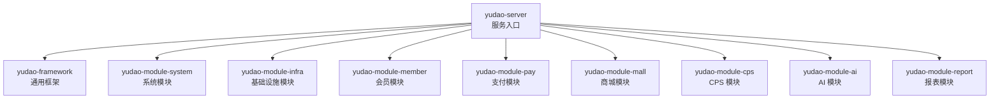
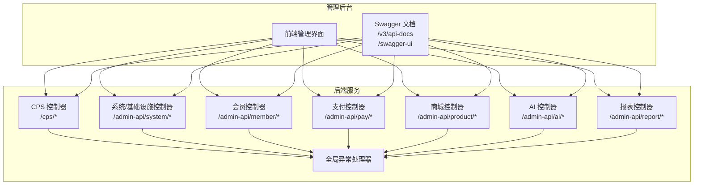
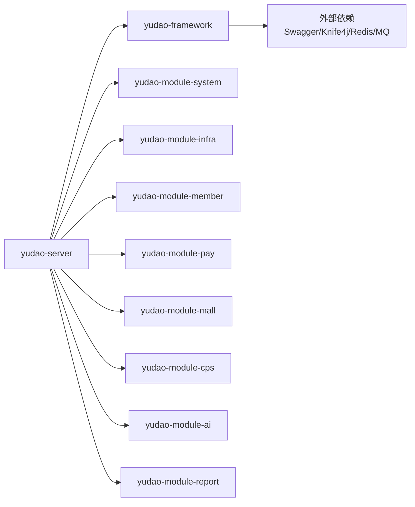

# 管理后台 API

<cite>
**本文引用的文件**
- [application.yaml](file://backend/yudao-server/src/main/resources/application.yaml)
- [pom.xml](file://backend/pom.xml)
- [GlobalExceptionHandler.java](file://backend/yudao-framework/yudao-spring-boot-starter-web/src/main/java/cn/iocoder/yudao/framework/web/core/handler/GlobalExceptionHandler.java)
- [CpsOrderController.java](file://backend/yudao-module-cps/yudao-module-cps-biz/src/main/java/cn/iocoder/yudao/module/cps/controller/admin/order/CpsOrderController.java)
- [CpsRebateRecordController.java](file://backend/yudao-module-cps/yudao-module-cps-biz/src/main/java/cn/iocoder/yudao/module/cps/controller/admin/rebate/CpsRebateRecordController.java)
- [CpsAdzoneController.java](file://backend/yudao-module-cps/yudao-module-cps-biz/src/main/java/cn/iocoder/yudao/module/cps/controller/admin/adzone/CpsAdzoneController.java)
- [CpsFreezeController.java](file://backend/yudao-module-cps/yudao-module-cps-biz/src/main/java/cn/iocoder/yudao/module/cps/controller/admin/freeze/CpsFreezeController.java)
- [CpsPlatformController.java](file://backend/yudao-module-cps/yudao-module-cps-biz/src/main/java/cn/iocoder/yudao/module/cps/controller/admin/platform/CpsPlatformController.java)
- [CpsRiskRuleController.java](file://backend/yudao-module-cps/yudao-module-cps-biz/src/main/java/cn/iocoder/yudao/module/cps/controller/admin/risk/CpsRiskRuleController.java)
</cite>

## 目录
1. [简介](#简介)
2. [项目结构](#项目结构)
3. [核心组件](#核心组件)
4. [架构总览](#架构总览)
5. [详细组件分析](#详细组件分析)
6. [依赖分析](#依赖分析)
7. [性能考虑](#性能考虑)
8. [故障排查指南](#故障排查指南)
9. [结论](#结论)
10. [附录](#附录)

## 简介
本文件为管理后台 API 接口文档，聚焦于 CPS 订单管理、商品管理、返利管理、会员管理、支付管理、系统管理等模块的 RESTful 接口。文档覆盖：
- 接口方法与路径
- 请求参数与响应格式
- 认证方式与权限控制
- 错误码与状态码说明
- 接口测试方法、Swagger 文档集成与自动化测试建议
- 安全策略、数据验证规则与性能优化建议

说明：
- 本仓库采用多模块聚合工程，管理后台接口集中在各业务模块的 admin 控制器中，统一前缀为 /cps。
- Swagger 文档已内置，可通过 /v3/api-docs 与 /swagger-ui 访问。

## 项目结构
后端采用 Maven 多模块结构，核心模块如下：
- yudao-server：服务主模块，负责启动与配置聚合
- yudao-framework：通用框架模块，包含安全、Web、监控、消息队列等基础设施
- yudao-module-*：业务模块，如系统、基础设施、会员、支付、CPS、AI、报表等
- yudao-dependencies：统一依赖版本管理

**图表来源**
- [pom.xml:10-25](file://backend/pom.xml#L10-L25)

**章节来源**
- [pom.xml:10-25](file://backend/pom.xml#L10-L25)

## 核心组件
- 接口文档与网关
  - Swagger 文档：/v3/api-docs
  - Swagger UI：/swagger-ui
- 全局异常处理：统一返回结构与错误码
- 认证与安全
  - 管理后台统一前缀 /cps
  - API 加密开关与算法配置
  - 放行 URL 列表（如微信开放平台回调）
- 多租户
  - 多租户开关与忽略 URL 列表

**章节来源**
- [application.yaml:39-49](file://backend/yudao-server/src/main/resources/application.yaml#L39-L49)
- [application.yaml:281-290](file://backend/yudao-server/src/main/resources/application.yaml#L281-L290)
- [application.yaml:319-331](file://backend/yudao-server/src/main/resources/application.yaml#L319-L331)
- [GlobalExceptionHandler.java](file://backend/yudao-framework/yudao-spring-boot-starter-web/src/main/java/cn/iocoder/yudao/framework/web/core/handler/GlobalExceptionHandler.java#L54)

## 架构总览
管理后台接口遵循统一前缀 /cps，由各业务模块控制器实现具体路由。全局异常处理器确保错误响应一致。Swagger 提供在线接口文档与调试能力。

**图表来源**
- [application.yaml:39-49](file://backend/yudao-server/src/main/resources/application.yaml#L39-L49)
- [CpsOrderController.java:26-27](file://backend/yudao-module-cps/yudao-module-cps-biz/src/main/java/cn/iocoder/yudao/module/cps/controller/admin/order/CpsOrderController.java#L26-L27)
- [CpsRebateRecordController.java:26-27](file://backend/yudao-module-cps/yudao-module-cps-biz/src/main/java/cn/iocoder/yudao/module/cps/controller/admin/rebate/CpsRebateRecordController.java#L26-L27)

## 详细组件分析

### CPS 订单管理
- 控制器路径前缀：/cps/order
- 典型接口
  - 获取订单分页
    - 方法：GET
    - 路径：/cps/order/page
    - 认证：需要管理员令牌
    - 权限：@PreAuthorize("@ss.hasPermission('cps:order:query')")（示例注解，实际以代码为准）
    - 请求参数：分页、筛选条件（如订单号、状态、时间范围等）
    - 响应：分页结果，包含订单详情
  - 订单详情
    - 方法：GET
    - 路径：/cps/order/get
    - 认证：需要管理员令牌
    - 权限：@PreAuthorize("@ss.hasPermission('cps:order:query')")（示例注解）
    - 响应：订单对象
  - 手动触发订单同步
    - 方法：POST
    - 路径：/cps/order/sync
    - 认证：需要管理员令牌
    - 权限：@PreAuthorize("@ss.hasPermission('cps:order:sync')")（示例注解）
    - 请求：平台编码、追溯小时数
    - 响应：同步结果字符串
- 错误码与状态码
  - 400：参数校验失败
  - 401：未认证或令牌无效
  - 403：权限不足
  - 500：服务器内部错误
- 安全策略
  - 所有接口均受统一认证与权限注解保护
  - API 加密可选开启（AES/RSA），见配置项
- 性能建议
  - 列表查询建议使用索引字段筛选
  - 分页大小限制在合理范围（如 100）

**章节来源**
- [CpsOrderController.java:26-27](file://backend/yudao-module-cps/yudao-module-cps-biz/src/main/java/cn/iocoder/yudao/module/cps/controller/admin/order/CpsOrderController.java#L26-L27)

### CPS 返利记录管理
- 控制器路径前缀：/cps/rebate-record
- 典型接口
  - 获取返利记录分页
    - 方法：GET
    - 路径：/cps/rebate-record/page
    - 认证：需要管理员令牌
    - 权限：@PreAuthorize("@ss.hasPermission('cps:rebate-record:query')")（示例注解）
    - 请求参数：分页、筛选（如会员 ID、状态、时间范围）
    - 响应：分页结果，包含返利明细
  - 返利记录详情
    - 方法：GET
    - 路径：/cps/rebate-record/get
    - 认证：需要管理员令牌
    - 权限：@PreAuthorize("@ss.hasPermission('cps:rebate-record:query')")（示例注解）
    - 响应：返利记录对象
  - 触发订单退款回扣
    - 方法：POST
    - 路径：/cps/rebate-record/reverse
    - 认证：需要管理员令牌
    - 权限：@PreAuthorize("@ss.hasPermission('cps:rebate-record:reverse')")（示例注解）
    - 请求：订单 ID
    - 响应：布尔成功标志
- 错误码与状态码
  - 400/401/403/500（同上）

**章节来源**
- [CpsRebateRecordController.java:26-27](file://backend/yudao-module-cps/yudao-module-cps-biz/src/main/java/cn/iocoder/yudao/module/cps/controller/admin/rebate/CpsRebateRecordController.java#L26-L27)

### CPS 广告位管理
- 控制器路径前缀：/cps/adzone
- 典型接口
  - 创建推广位
    - 方法：POST
    - 路径：/cps/adzone/create
    - 权限：@PreAuthorize("@ss.hasPermission('cps:adzone:create')")（示例注解）
  - 更新推广位
    - 方法：PUT
    - 路径：/cps/adzone/update
    - 权限：@PreAuthorize("@ss.hasPermission('cps:adzone:update')")（示例注解）
  - 删除推广位
    - 方法：DELETE
    - 路径：/cps/adzone/delete
    - 权限：@PreAuthorize("@ss.hasPermission('cps:adzone:delete')")（示例注解）
  - 获取推广位详情
    - 方法：GET
    - 路径：/cps/adzone/get
    - 权限：@PreAuthorize("@ss.hasPermission('cps:adzone:query')")（示例注解）
  - 获取推广位分页
    - 方法：GET
    - 路径：/cps/adzone/page
    - 权限：@PreAuthorize("@ss.hasPermission('cps:adzone:query')")（示例注解）
  - 按平台获取推广位列表
    - 方法：GET
    - 路径：/cps/adzone/list-by-platform
    - 权限：@PreAuthorize("@ss.hasPermission('cps:adzone:query')")（示例注解）
- 错误码与状态码
  - 400/401/403/500（同上）

**章节来源**
- [CpsAdzoneController.java:24-27](file://backend/yudao-module-cps/yudao-module-cps-biz/src/main/java/cn/iocoder/yudao/module/cps/controller/admin/adzone/CpsAdzoneController.java#L24-L27)

### CPS 冻结/解冻管理
- 控制器路径前缀：/cps/freeze
- 典型接口
  - 创建冻结配置
    - 方法：POST
    - 路径：/cps/freeze/config/create
    - 权限：@PreAuthorize("@ss.hasPermission('cps:freeze-config:create')")（示例注解）
  - 更新冻结配置
    - 方法：PUT
    - 路径：/cps/freeze/config/update
    - 权限：@PreAuthorize("@ss.hasPermission('cps:freeze-config:update')")（示例注解）
  - 删除冻结配置
    - 方法：DELETE
    - 路径：/cps/freeze/config/delete
    - 权限：@PreAuthorize("@ss.hasPermission('cps:freeze-config:delete')")（示例注解）
  - 获取冻结配置分页
    - 方法：GET
    - 路径：/cps/freeze/config/page
    - 权限：@PreAuthorize("@ss.hasPermission('cps:freeze-config:query')")（示例注解）
  - 获取冻结记录分页
    - 方法：GET
    - 路径：/cps/freeze/record/page
    - 权限：@PreAuthorize("@ss.hasPermission('cps:freeze-record:query')")（示例注解）
  - 手动解冻指定记录
    - 方法：PUT
    - 路径：/cps/freeze/record/manual-unfreeze
    - 权限：@PreAuthorize("@ss.hasPermission('cps:freeze-record:unfreeze')")（示例注解）
- 错误码与状态码
  - 400/401/403/500（同上）

**章节来源**
- [CpsFreezeController.java:28-31](file://backend/yudao-module-cps/yudao-module-cps-biz/src/main/java/cn/iocoder/yudao/module/cps/controller/admin/freeze/CpsFreezeController.java#L28-L31)

### CPS 平台管理
- 控制器路径前缀：/cps/platform
- 典型接口
  - 创建平台配置
    - 方法：POST
    - 路径：/cps/platform/create
    - 权限：@PreAuthorize("@ss.hasPermission('cps:platform:create')")（示例注解）
  - 更新平台配置
    - 方法：PUT
    - 路径：/cps/platform/update
    - 权限：@PreAuthorize("@ss.hasPermission('cps:platform:update')")（示例注解）
  - 删除平台配置
    - 方法：DELETE
    - 路径：/cps/platform/delete
    - 权限：@PreAuthorize("@ss.hasPermission('cps:platform:delete')")（示例注解）
  - 获取平台配置详情
    - 方法：GET
    - 路径：/cps/platform/get
    - 权限：@PreAuthorize("@ss.hasPermission('cps:platform:query')")（示例注解）
  - 获取平台配置分页
    - 方法：GET
    - 路径：/cps/platform/page
    - 权限：@PreAuthorize("@ss.hasPermission('cps:platform:query')")（示例注解）
  - 获取已启用的平台列表
    - 方法：GET
    - 路径：/cps/platform/list-enabled
    - 权限：@PreAuthorize("@ss.hasPermission('cps:platform:query')")（示例注解）
- 错误码与状态码
  - 400/401/403/500（同上）

**章节来源**
- [CpsPlatformController.java:24-27](file://backend/yudao-module-cps/yudao-module-cps-biz/src/main/java/cn/iocoder/yudao/module/cps/controller/admin/platform/CpsPlatformController.java#L24-L27)

### CPS 风控规则管理
- 控制器路径前缀：/cps/risk/rule
- 典型接口
  - 创建风控规则
    - 方法：POST
    - 路径：/cps/risk/rule/create
    - 权限：@PreAuthorize("@ss.hasPermission('cps:risk-rule:create')")（示例注解）
  - 更新风控规则
    - 方法：PUT
    - 路径：/cps/risk/rule/update
    - 权限：@PreAuthorize("@ss.hasPermission('cps:risk-rule:update')")（示例注解）
  - 删除风控规则
    - 方法：DELETE
    - 路径：/cps/risk/rule/delete
    - 权限：@PreAuthorize("@ss.hasPermission('cps:risk-rule:delete')")（示例注解）
  - 获取风控规则分页
    - 方法：GET
    - 路径：/cps/risk/rule/page
    - 权限：@PreAuthorize("@ss.hasPermission('cps:risk-rule:query')")（示例注解）
- 错误码与状态码
  - 400/401/403/500（同上）

**章节来源**
- [CpsRiskRuleController.java:29-32](file://backend/yudao-module-cps/yudao-module-cps-biz/src/main/java/cn/iocoder/yudao/module/cps/controller/admin/risk/CpsRiskRuleController.java#L29-L32)

### 系统管理（示例：用户/菜单/角色）
- 控制器路径前缀：/admin-api/system/*
- 典型接口
  - 用户管理
    - 方法：GET/POST/PUT/DELETE
    - 路径：/admin-api/system/user/*
    - 权限：@PreAuthorize("@ss.hasPermission('system:user:*')")（示例注解）
  - 菜单管理
    - 方法：GET/POST/PUT/DELETE
    - 路径：/admin-api/system/menu/*
    - 权限：@PreAuthorize("@ss.hasPermission('system:menu:*')")（示例注解）
  - 角色管理
    - 方法：GET/POST/PUT/DELETE
    - 路径：/admin-api/system/role/*
    - 权限：@PreAuthorize("@ss.hasPermission('system:role:*')")（示例注解）
- 错误码与状态码
  - 400/401/403/500（同上）

### 支付管理（示例：支付单/退款）
- 控制器路径前缀：/admin-api/pay/*
- 典型接口
  - 支付单列表
    - 方法：GET
    - 路径：/admin-api/pay/order/list
    - 权限：@PreAuthorize("@ss.hasPermission('pay:order:list')")（示例注解）
  - 退款处理
    - 方法：POST
    - 路径：/admin-api/pay/refund/process
    - 权限：@PreAuthorize("@ss.hasPermission('pay:refund:process')")（示例注解）
- 错误码与状态码
  - 400/401/403/500（同上）

### 商品管理（示例：商品/分类/库存）
- 控制器路径前缀：/admin-api/product/*
- 典型接口
  - 商品列表
    - 方法：GET
    - 路径：/admin-api/product/list
    - 权限：@PreAuthorize("@ss.hasPermission('product:list')")（示例注解）
  - 商品上下架
    - 方法：POST
    - 路径：/admin-api/product/status/update
    - 权限：@PreAuthorize("@ss.hasPermission('product:update')")（示例注解）
- 错误码与状态码
  - 400/401/403/500（同上）

### 会员管理（示例：会员列表/等级/积分）
- 控制器路径前缀：/admin-api/member/*
- 典型接口
  - 会员列表
    - 方法：GET
    - 路径：/admin-api/member/list
    - 权限：@PreAuthorize("@ss.hasPermission('member:list')")（示例注解）
  - 会员等级调整
    - 方法：POST
    - 路径：/admin-api/member/level/update
    - 权限：@PreAuthorize("@ss.hasPermission('member:update')")（示例注解）
- 错误码与状态码
  - 400/401/403/500（同上）

### 报表与 AI 管理（示例：知识库/工作流）
- 控制器路径前缀：/admin-api/report/* 与 /admin-api/ai/*
- 典型接口
  - 知识库文档列表
    - 方法：GET
    - 路径：/admin-api/report/knowledge/document/list
    - 权限：@PreAuthorize("@ss.hasPermission('report:knowledge:*')")（示例注解）
  - AI 工作流管理
    - 方法：GET/POST/PUT/DELETE
    - 路径：/admin-api/ai/workflow/*
    - 权限：@PreAuthorize("@ss.hasPermission('ai:workflow:*')")（示例注解）
- 错误码与状态码
  - 400/401/403/500（同上）

## 依赖分析
- 模块耦合
  - yudao-server 聚合各模块，不直接依赖业务逻辑
  - yudao-framework 为所有模块提供通用能力（Web、安全、监控、消息队列等）
  - 业务模块之间低耦合，通过 API 前缀隔离
- 外部依赖
  - Swagger/Knife4j：接口文档与调试
  - 多租户、安全、加密、消息队列等能力由框架模块提供

**图表来源**
- [pom.xml:10-25](file://backend/pom.xml#L10-L25)
- [application.yaml:39-49](file://backend/yudao-server/src/main/resources/application.yaml#L39-L49)

**章节来源**
- [pom.xml:10-25](file://backend/pom.xml#L10-L25)

## 性能考虑
- 分页与筛选
  - 列表接口建议使用分页参数，避免一次性返回大量数据
  - 对高频查询字段建立数据库索引
- 缓存与异步
  - 合理使用 Redis 缓存热点数据
  - 对耗时操作采用消息队列异步处理（如导出、报表统计）
- 接口幂等
  - 对写操作建议引入幂等键，防止重复提交
- 监控与追踪
  - 使用框架提供的链路追踪与监控能力，定位慢接口

## 故障排查指南
- 统一错误响应
  - 全局异常处理器将异常转换为统一格式，便于前端与测试定位问题
- 常见问题
  - 401 未认证：检查令牌有效性与过期时间
  - 403 权限不足：确认用户角色与权限点
  - 400 参数错误：核对请求体与路径参数
  - 500 服务器错误：查看后端日志与堆栈
- Swagger 调试
  - 通过 /swagger-ui 或 /v3/api-docs 在线调试接口，快速定位问题

**章节来源**
- [GlobalExceptionHandler.java](file://backend/yudao-framework/yudao-spring-boot-starter-web/src/main/java/cn/iocoder/yudao/framework/web/core/handler/GlobalExceptionHandler.java#L54)

## 结论
本管理后台 API 以多模块架构组织，统一前缀与安全策略保障了接口的一致性与安全性。通过 Swagger 文档与全局异常处理，提升了开发与运维效率。建议在生产环境中启用 API 加密、完善权限校验与审计日志，并结合缓存与异步机制优化性能。

## 附录

### 接口测试方法
- 在线测试
  - Swagger UI：/swagger-ui
  - 接口文档：/v3/api-docs
- Postman/HTTP 客户端
  - 使用 /cps 前缀构造请求
  - 设置认证头（如 Authorization）与必要请求头
- 自动化测试
  - 建议使用接口测试框架（如 REST Assured、TestNG/JUnit）编写用例
  - 覆盖正向与边界场景，重点校验鉴权、权限与数据一致性

### Swagger 文档集成
- 配置项
  - api-docs.enabled：开启接口文档
  - swagger-ui.enabled：开启 Swagger UI
  - knife4j.enable：增强文档体验
- 访问地址
  - /v3/api-docs
  - /swagger-ui

**章节来源**
- [application.yaml:39-49](file://backend/yudao-server/src/main/resources/application.yaml#L39-L49)

### 安全策略与数据验证
- 认证与放行
  - 管理后台统一前缀 /cps
  - 放行 URL 列表（如微信开放平台回调）
- API 加密
  - 可选 AES/RSA 加密，按需开启
- 多租户
  - 多租户开关与忽略 URL 列表，避免对特定接口生效
- 数据验证
  - 建议在控制器层使用参数校验注解（如 @Valid），并在全局异常中统一处理

**章节来源**
- [application.yaml:281-290](file://backend/yudao-server/src/main/resources/application.yaml#L281-L290)
- [application.yaml:319-331](file://backend/yudao-server/src/main/resources/application.yaml#L319-L331)