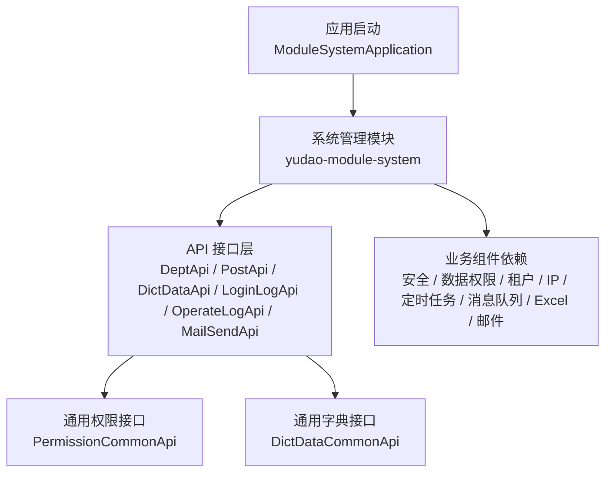
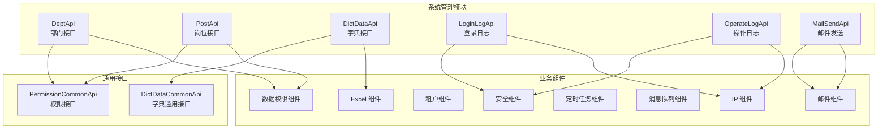
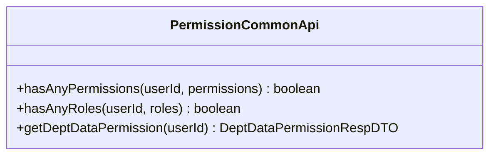
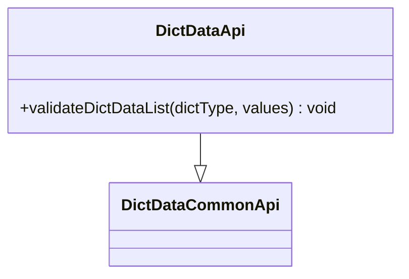
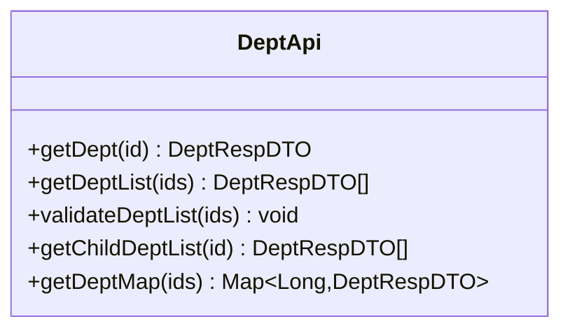
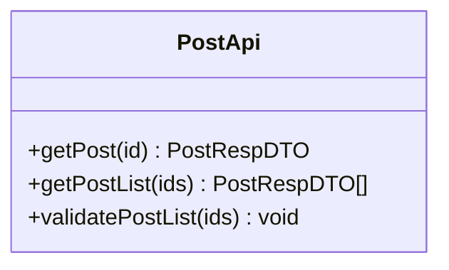
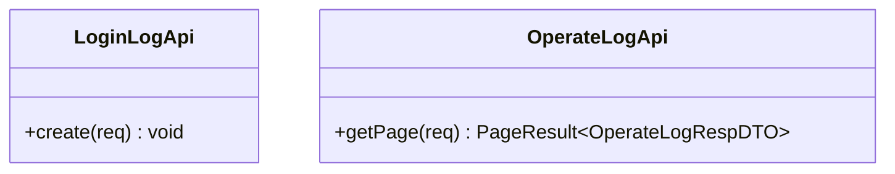
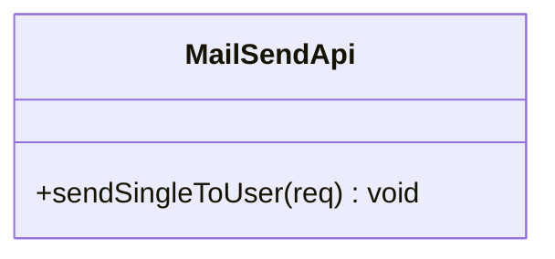
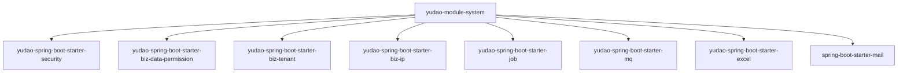

# 系统管理 API

<cite>
**本文引用的文件**
- [ModuleSystemApplication.java](file://backend/yudao-module-system/src/main/java/cn/iocoder/yudao/ModuleSystemApplication.java)
- [pom.xml](file://backend/yudao-module-system/pom.xml)
- [DeptApi.java](file://backend/yudao-module-system/src/main/java/cn/iocoder/yudao/module/system/api/dept/DeptApi.java)
- [PostApi.java](file://backend/yudao-module-system/src/main/java/cn/iclassic/yudao/module/system/api/dept/PostApi.java)
- [DictDataApi.java](file://backend/yudao-module-system/src/main/java/cn/iclassic/yudao/module/system/api/dict/DictDataApi.java)
- [PermissionCommonApi.java](file://backend/yudao-framework/yudao-common/src/main/java/cn/iclassic/yudao/framework/common/biz/system/permission/PermissionCommonApi.java)
- [DictDataCommonApi.java](file://backend/yudao-framework/yudao-common/src/main/java/cn/iclassic/yudao/framework/common/biz/system/dict/DictDataCommonApi.java)
- [LoginLogApi.java](file://backend/yudao-module-system/src/main/java/cn/iclassic/yudao/module/system/api/logger/LoginLogApi.java)
- [OperateLogApi.java](file://backend/yudao-module-system/src/main/java/cn/iclassic/yudao/module/system/api/logger/OperateLogApi.java)
- [MailSendApi.java](file://backend/yudao-module-system/src/main/java/cn/iclassic/yudao/module/system/api/mail/MailSendApi.java)
</cite>

## 目录
1. [简介](#简介)
2. [项目结构](#项目结构)
3. [核心组件](#核心组件)
4. [架构总览](#架构总览)
5. [详细组件分析](#详细组件分析)
6. [依赖关系分析](#依赖关系分析)
7. [性能考虑](#性能考虑)
8. [故障排查指南](#故障排查指南)
9. [结论](#结论)

## 简介
本文件面向系统管理模块的 RESTful API 接口，聚焦菜单管理、角色管理、用户管理与数据字典等系统配置能力。结合项目中已提供的权限与数据字典通用接口，给出统一的系统权限控制接口说明、RBAC 权限模型实现思路与安全管理策略，并解释系统配置项与业务规则。

说明：
- 当前仓库中系统管理模块以 API 接口定义为主，具体控制器实现未在已提供路径中出现；本文基于现有接口定义进行系统性梳理与说明。
- 若需获取控制器实现细节，请在后端工程中补充对应模块的 controller 层代码路径。

## 项目结构
系统管理模块位于后端工程的 yudao-module-system 中，采用“接口 + 业务组件”的分层设计：
- 接口层：对外暴露的 API 接口定义（如部门、岗位、字典、日志、邮件等）
- 业务层：基于通用框架组件（安全、数据权限、租户、IP、定时任务、消息队列等）实现系统能力
- 应用入口：ModuleSystemApplication 启动类

图表来源
- [ModuleSystemApplication.java](file://backend/yudao-module-system/src/main/java/cn/iclassic/yudao/ModuleSystemApplication.java)
- [pom.xml](file://backend/yudao-module-system/pom.xml)
- [DeptApi.java](file://backend/yudao-module-system/src/main/java/cn/iclassic/yudao/module/system/api/dept/DeptApi.java)
- [PostApi.java](file://backend/yudao-module-system/src/main/java/cn/iclassic/yudao/module/system/api/dept/PostApi.java)
- [DictDataApi.java](file://backend/yudao-module-system/src/main/java/cn/iclassic/yudao/module/system/api/dict/DictDataApi.java)
- [PermissionCommonApi.java](file://backend/yudao-framework/yudao-common/src/main/java/cn/iclassic/yudao/framework/common/biz/system/permission/PermissionCommonApi.java)
- [DictDataCommonApi.java](file://backend/yudao-framework/yudao-common/src/main/java/cn/iclassic/yudao/framework/common/biz/system/dict/DictDataCommonApi.java)
- [LoginLogApi.java](file://backend/yudao-module-system/src/main/java/cn/iclassic/yudao/module/system/api/logger/LoginLogApi.java)
- [OperateLogApi.java](file://backend/yudao-module-system/src/main/java/cn/iclassic/yudao/module/system/api/logger/OperateLogApi.java)
- [MailSendApi.java](file://backend/yudao-module-system/src/main/java/cn/iclassic/yudao/module/system/api/mail/MailSendApi.java)

章节来源
- [ModuleSystemApplication.java](file://backend/yudao-module-system/src/main/java/cn/iclassic/yudao/ModuleSystemApplication.java)
- [pom.xml](file://backend/yudao-module-system/pom.xml)

## 核心组件
- 权限接口：PermissionCommonApi 提供用户权限与角色判断、部门数据权限查询能力，支撑 RBAC 权限模型
- 数据字典接口：DictDataCommonApi 与 DictDataApi 提供字典数据的通用与校验能力
- 部门接口：DeptApi 提供部门信息查询、批量校验与子部门查询
- 岗位接口：PostApi 提供岗位信息查询与校验
- 日志接口：LoginLogApi 与 OperateLogApi 提供登录与操作日志能力
- 邮件接口：MailSendApi 提供邮件发送能力

章节来源
- [PermissionCommonApi.java](file://backend/yudao-framework/yudao-common/src/main/java/cn/iclassic/yudao/framework/common/biz/system/permission/PermissionCommonApi.java)
- [DictDataCommonApi.java](file://backend/yudao-framework/yudao-common/src/main/java/cn/iclassic/yudao/framework/common/biz/system/dict/DictDataCommonApi.java)
- [DictDataApi.java](file://backend/yudao-module-system/src/main/java/cn/iclassic/yudao/module/system/api/dict/DictDataApi.java)
- [DeptApi.java](file://backend/yudao-module-system/src/main/java/cn/iclassic/yudao/module/system/api/dept/DeptApi.java)
- [PostApi.java](file://backend/yudao-module-system/src/main/java/cn/iclassic/yudao/module/system/api/dept/PostApi.java)
- [LoginLogApi.java](file://backend/yudao-module-system/src/main/java/cn/iclassic/yudao/module/system/api/logger/LoginLogApi.java)
- [OperateLogApi.java](file://backend/yudao-module-system/src/main/java/cn/iclassic/yudao/module/system/api/logger/OperateLogApi.java)
- [MailSendApi.java](file://backend/yudao-module-system/src/main/java/cn/iclassic/yudao/module/system/api/mail/MailSendApi.java)

## 架构总览
系统管理模块通过通用接口与业务组件协同工作，形成统一的系统配置与权限控制能力：

图表来源
- [DeptApi.java](file://backend/yudao-module-system/src/main/java/cn/iclassic/yudao/module/system/api/dept/DeptApi.java)
- [PostApi.java](file://backend/yudao-module-system/src/main/java/cn/iclassic/yudao/module/system/api/dept/PostApi.java)
- [DictDataApi.java](file://backend/yudao-module-system/src/main/java/cn/iclassic/yudao/module/system/api/dict/DictDataApi.java)
- [PermissionCommonApi.java](file://backend/yudao-framework/yudao-common/src/main/java/cn/iclassic/yudao/framework/common/biz/system/permission/PermissionCommonApi.java)
- [DictDataCommonApi.java](file://backend/yudao-framework/yudao-common/src/main/java/cn/iclassic/yudao/framework/common/biz/system/dict/DictDataCommonApi.java)
- [LoginLogApi.java](file://backend/yudao-module-system/src/main/java/cn/iclassic/yudao/module/system/api/logger/LoginLogApi.java)
- [OperateLogApi.java](file://backend/yudao-module-system/src/main/java/cn/iclassic/yudao/module/system/api/logger/OperateLogApi.java)
- [MailSendApi.java](file://backend/yudao-module-system/src/main/java/cn/iclassic/yudao/module/system/api/mail/MailSendApi.java)
- [pom.xml](file://backend/yudao-module-system/pom.xml)

## 详细组件分析

### 权限接口（RBAC 权限模型）
- 功能要点
  - 用户权限判断：支持任一权限满足即通过
  - 用户角色判断：支持任一角色满足即通过
  - 部门数据权限：返回用户可访问的数据范围
- 使用场景
  - 控制菜单显示与按钮级权限
  - 实施数据隔离（按部门维度）
  - 组合式权限校验（权限与角色并存）

图表来源
- [PermissionCommonApi.java](file://backend/yudao-framework/yudao-common/src/main/java/cn/iclassic/yudao/framework/common/biz/system/permission/PermissionCommonApi.java)

章节来源
- [PermissionCommonApi.java](file://backend/yudao-framework/yudao-common/src/main/java/cn/iclassic/yudao/framework/common/biz/system/permission/PermissionCommonApi.java)

### 数据字典接口
- 功能要点
  - 通用字典能力：继承通用字典接口
  - 字典数据校验：按类型校验值集合的有效性
- 使用场景
  - 下拉选择、状态枚举、系统参数映射
  - 业务字段取值约束与一致性保障

图表来源
- [DictDataCommonApi.java](file://backend/yudao-framework/yudao-common/src/main/java/cn/iclassic/yudao/framework/common/biz/system/dict/DictDataCommonApi.java)
- [DictDataApi.java](file://backend/yudao-module-system/src/main/java/cn/iclassic/yudao/module/system/api/dict/DictDataApi.java)

章节来源
- [DictDataCommonApi.java](file://backend/yudao-framework/yudao-common/src/main/java/cn/iclassic/yudao/framework/common/biz/system/dict/DictDataCommonApi.java)
- [DictDataApi.java](file://backend/yudao-module-system/src/main/java/cn/iclassic/yudao/module/system/api/dict/DictDataApi.java)

### 部门接口
- 功能要点
  - 单个/批量部门查询
  - 部门有效性校验（存在性与启用状态）
  - 子部门递归查询
  - 将结果转换为 Map 便于快速索引
- 使用场景
  - 用户所属部门绑定
  - 菜单与数据权限的部门维度关联
  - 组织架构树渲染

图表来源
- [DeptApi.java](file://backend/yudao-module-system/src/main/java/cn/iclassic/yudao/module/system/api/dept/DeptApi.java)

章节来源
- [DeptApi.java](file://backend/yudao-module-system/src/main/java/cn/iclassic/yudao/module/system/api/dept/DeptApi.java)

### 岗位接口
- 功能要点
  - 岗位信息查询与校验
  - 支持与用户、部门联动
- 使用场景
  - 用户岗位绑定与权限计算
  - 职务层级与薪酬体系映射

图表来源
- [PostApi.java](file://backend/yudao-module-system/src/main/java/cn/iclassic/yudao/module/system/api/dept/PostApi.java)

章节来源
- [PostApi.java](file://backend/yudao-module-system/src/main/java/cn/iclassic/yudao/module/system/api/dept/PostApi.java)

### 日志接口
- 登录日志（LoginLogApi）
  - 记录用户登录行为，支持创建请求 DTO
- 操作日志（OperateLogApi）
  - 记录用户操作轨迹，支持分页查询与响应 DTO

图表来源
- [LoginLogApi.java](file://backend/yudao-module-system/src/main/java/cn/iclassic/yudao/module/system/api/logger/LoginLogApi.java)
- [OperateLogApi.java](file://backend/yudao-module-system/src/main/java/cn/iclassic/yudao/module/system/api/logger/OperateLogApi.java)

章节来源
- [LoginLogApi.java](file://backend/yudao-module-system/src/main/java/cn/iclassic/yudao/module/system/api/logger/LoginLogApi.java)
- [OperateLogApi.java](file://backend/yudao-module-system/src/main/java/cn/iclassic/yudao/module/system/api/logger/OperateLogApi.java)

### 邮件接口
- 功能要点
  - 单用户邮件发送能力
- 使用场景
  - 系统通知、验证码发送、运营邮件

图表来源
- [MailSendApi.java](file://backend/yudao-module-system/src/main/java/cn/iclassic/yudao/module/system/api/mail/MailSendApi.java)

章节来源
- [MailSendApi.java](file://backend/yudao-module-system/src/main/java/cn/iclassic/yudao/module/system/api/mail/MailSendApi.java)

## 依赖关系分析
系统管理模块通过 Maven 依赖引入多种业务组件，支撑权限控制、数据权限、租户隔离、IP 限制、定时任务、消息队列、Excel 导出与邮件发送等能力。

图表来源
- [pom.xml](file://backend/yudao-module-system/pom.xml)

章节来源
- [pom.xml](file://backend/yudao-module-system/pom.xml)

## 性能考虑
- 批量查询优化：优先使用批量查询接口（如部门列表、岗位列表），减少多次往返
- 缓存策略：对常用字典与静态配置进行缓存，降低数据库压力
- 分页与过滤：日志与列表查询建议使用分页与条件过滤，避免全量加载
- 并发与事务：权限与数据字典校验应尽量无锁化或短事务，避免阻塞

## 故障排查指南
- 权限校验失败
  - 检查用户是否拥有任一目标权限或角色
  - 核对部门数据权限范围是否覆盖目标数据
- 字典校验异常
  - 确认字典类型与值集合是否正确
  - 检查字典状态是否启用
- 部门/岗位无效
  - 核对 ID 是否存在且启用
  - 检查是否存在循环引用或非法父子关系
- 日志查询无结果
  - 检查时间范围与关键字过滤条件
  - 确认分页参数是否合理
- 邮件发送失败
  - 检查 SMTP 配置与收件人邮箱
  - 关注异步发送异常与重试策略

## 结论
系统管理模块通过统一的 API 接口与丰富的业务组件，构建了完善的系统配置与权限控制体系。基于权限接口与数据字典接口，可实现细粒度的 RBAC 权限模型与灵活的系统参数维护。建议在实际开发中遵循“批量查询优先、缓存先行、分页过滤”的原则，确保接口性能与稳定性。