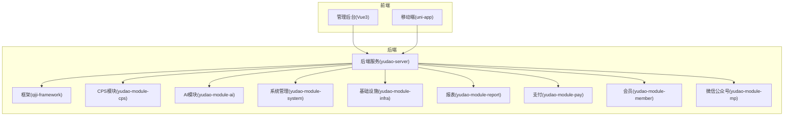
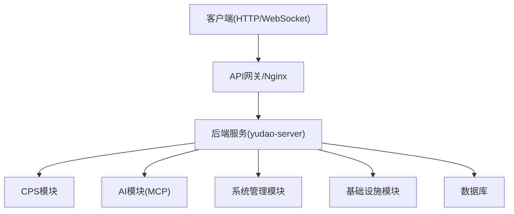
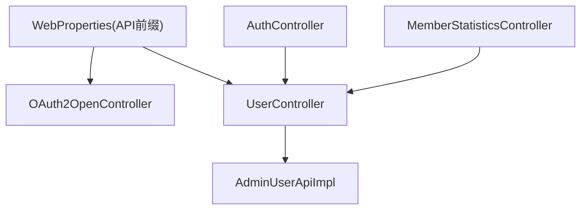

# API接口文档

<cite>
**本文引用的文件**
- [README.md](file://README.md)
- [CPS系统PRD文档.md](file://docs/CPS系统PRD文档.md)
- [WebProperties.java](file://backend/qiji-framework/qiji-spring-boot-starter-web/src/main/java/com/qiji/cps/framework/web/config/WebProperties.java)
- [OAuth2OpenController.java](file://backend/qiji-module-system/src/main/java/com/qiji/cps/module/system/controller/admin/oauth2/OAuth2OpenController.java)
- [UserController.java](file://backend/qiji-module-system/src/main/java/com/qiji/cps/module/system/controller/admin/user/UserController.java)
- [AdminUserApiImpl.java](file://backend/qiji-module-system/src/main/java/com/qiji/cps/module/system/api/user/AdminUserApiImpl.java)
- [AuthController.java](file://backend/qiji-module-system/src/main/java/com/qiji/cps/module/system/controller/admin/auth/AuthController.java)
- [MemberStatisticsController.java](file://backend/qiji-module-mall/qiji-module-statistics/src/main/java/com/qiji/cps/module/statistics/controller/admin/member/MemberStatisticsController.java)
- [ruoyi-vue-pro.sql（MySQL）](file://backend/sql/mysql/ruoyi-vue-pro.sql)
- [index.ts（用户API）](file://frontend/admin-uniapp/src/api/system/user/index.ts)
</cite>

## 目录
1. [简介](#简介)
2. [项目结构](#项目结构)
3. [核心组件](#核心组件)
4. [架构总览](#架构总览)
5. [详细组件分析](#详细组件分析)
6. [依赖关系分析](#依赖关系分析)
7. [性能考量](#性能考量)
8. [故障排查指南](#故障排查指南)
9. [结论](#结论)
10. [附录](#附录)

## 简介
本文件面向AgenticCPS平台的API接口，涵盖CPS商品搜索、订单查询、返利计算、推广链接生成等核心REST接口；MCP AI工具调用、Agent管理、会话管理、配置管理等协议规范；以及管理后台的用户管理、权限控制、系统配置、数据统计等接口。文档提供HTTP方法、URL模式、请求响应模式、认证方法、协议规范、消息格式、事件类型、实时交互模式、错误处理策略、安全考虑、速率限制、版本信息、常见用例、客户端实现指南、性能优化技巧及调试监控方法。

## 项目结构
AgenticCPS采用前后端分离架构，后端基于Spring Boot 3.5.9，前端包含Vue3管理后台与uni-app移动端。CPS核心模块位于yudao-module-cps，AI模块位于yudao-module-ai，系统管理位于yudao-module-system，基础设施位于yudao-module-infra，报表位于yudao-module-report，支付位于yudao-module-pay，会员中心位于yudao-module-member，微信公众号位于yudao-module-mp。

**图表来源**
- [README.md: 229-249:229-249](file://README.md#L229-L249)

**章节来源**
- [README.md: 267-302:267-302](file://README.md#L267-L302)
- [README.md: 229-249:229-249](file://README.md#L229-L249)

## 核心组件
- API前缀与路由：后端通过WebProperties配置API前缀与Controller包扫描规则，确保Nginx可统一转发到/api/*。
- OAuth2开放接口：提供外部应用调用的OAuth2 Open接口，用于授权与令牌管理。
- 系统管理接口：用户管理、权限控制、菜单与角色、登录日志、操作日志等。
- 统计分析接口：会员统计、地区分布、性别分布、终端分布、用户数量对比等。
- MCP AI接口：AI工具调用、Agent管理、会话管理、配置管理等。

**章节来源**
- [WebProperties.java: 38-66:38-66](file://backend/qiji-framework/qiji-spring-boot-starter-web/src/main/java/com/qiji/cps/framework/web/config/WebProperties.java#L38-L66)
- [OAuth2OpenController.java: 46-48:46-48](file://backend/qiji-module-system/src/main/java/com/qiji/cps/module/system/controller/admin/oauth2/OAuth2OpenController.java#L46-L48)
- [UserController.java: 1-26:1-26](file://backend/qiji-module-system/src/main/java/com/qiji/cps/module/system/controller/admin/user/UserController.java#L1-L26)
- [MemberStatisticsController.java: 75-102:75-102](file://backend/qiji-module-mall/qiji-module-statistics/src/main/java/com/qiji/cps/module/statistics/controller/admin/member/MemberStatisticsController.java#L75-L102)

## 架构总览
后端服务通过统一的API前缀对外提供REST接口，系统管理模块负责用户、权限、菜单、日志等；CPS模块负责商品搜索、订单查询、返利计算、推广链接生成；AI模块提供MCP协议支持；基础设施模块提供缓存、消息队列、监控等能力；前端通过HTTP与WebSocket与后端交互。

**图表来源**
- [WebProperties.java: 38-66:38-66](file://backend/qiji-framework/qiji-spring-boot-starter-web/src/main/java/com/qiji/cps/framework/web/config/WebProperties.java#L38-L66)
- [README.md: 229-249:229-249](file://README.md#L229-L249)

## 详细组件分析

### 1. CPS平台API接口

#### 1.1 商品搜索接口
- HTTP方法：GET/POST
- URL模式：/cps/goods/search
- 请求参数：
  - keyword：关键词
  - platform：平台编码（可选）
  - priceMin/priceMax：价格区间（可选）
  - sortBy：排序字段（价格/返利/销量）
  - page/size：分页
- 响应格式：CommonResult<List<GoodsItem>>
- 认证：登录态（会员用户）
- 说明：支持单平台查询与多平台聚合，返回预估返利金额与商品详情。

**章节来源**
- [CPS系统PRD文档.md: 378-416:378-416](file://docs/CPS系统PRD文档.md#L378-L416)

#### 1.2 多平台比价接口
- HTTP方法：GET/POST
- URL模式：/cps/goods/compare
- 请求参数：
  - keyword：关键词
  - filters：筛选条件（平台、优惠券、价格区间）
  - mode：比价模式（实付最低/券后价最低/返利最高）
- 响应格式：CommonResult<CompareResult>
- 认证：登录态（会员用户）
- 说明：并发查询启用平台，计算实付价格并排序。

**章节来源**
- [CPS系统PRD文档.md: 417-448:417-448](file://docs/CPS系统PRD文档.md#L417-L448)

#### 1.3 推广链接生成接口
- HTTP方法：POST
- URL模式：/cps/link/generate
- 请求参数：
  - platform：平台编码
  - goodsId：商品ID
  - pid：推广位ID（可选）
- 响应格式：CommonResult<LinkInfo>
- 认证：登录态（会员用户）
- 说明：注入用户归因参数，调用平台转链API，返回推广链接与口令。

**章节来源**
- [CPS系统PRD文档.md: 449-480:449-480](file://docs/CPS系统PRD文档.md#L449-L480)

#### 1.4 订单查询接口
- HTTP方法：GET
- URL模式：/cps/order/list
- 请求参数：
  - status：订单状态（可选）
  - startTime/endTime：时间范围（可选）
  - page/size：分页
- 响应格式：CommonResult<PageResult<Order>>
- 认证：登录态（会员用户）
- 说明：查询CPS订单列表与详情，追踪返利状态。

**章节来源**
- [CPS系统PRD文档.md: 481-506:481-506](file://docs/CPS系统PRD文档.md#L481-L506)

#### 1.5 返利汇总接口
- HTTP方法：GET
- URL模式：/cps/rebate/summary
- 请求参数：无
- 响应格式：CommonResult<RebateSummary>
- 认证：登录态（会员用户）
- 说明：展示可提现余额、待结算金额、累计收入。

**章节来源**
- [CPS系统PRD文档.md: 512-552:512-552](file://docs/CPS系统PRD文档.md#L512-L552)

#### 1.6 返利明细接口
- HTTP方法：GET
- URL模式：/cps/rebate/detail
- 请求参数：
  - page/size：分页
- 响应格式：CommonResult<PageResult<RebateDetail>>
- 认证：登录态（会员用户）
- 说明：查看返利收支明细记录。

**章节来源**
- [CPS系统PRD文档.md: 512-552:512-552](file://docs/CPS系统PRD文档.md#L512-L552)

#### 1.7 提现申请接口
- HTTP方法：POST
- URL模式：/cps/withdraw/apply
- 请求参数：
  - amount：提现金额
  - accountType：账户类型（支付宝/微信）
  - accountNo：账户号
- 响应格式：CommonResult<Boolean>
- 认证：登录态（会员用户）
- 说明：校验余额与限额，创建提现申请记录。

**章节来源**
- [CPS系统PRD文档.md: 553-552:553-552](file://docs/CPS系统PRD文档.md#L553-L552)

#### 1.8 提现记录接口
- HTTP方法：GET
- URL模式：/cps/withdraw/list
- 请求参数：
  - page/size：分页
- 响应格式：CommonResult<PageResult<WithdrawRecord>>
- 认证：登录态（会员用户）
- 说明：查看历史提现记录与状态。

**章节来源**
- [CPS系统PRD文档.md: 553-552:553-552](file://docs/CPS系统PRD文档.md#L553-L552)

### 2. MCP AI接口

#### 2.1 协议规范与消息格式
- 协议：MCP（Model Context Protocol）
- 方法：tools/call、resources/get、events/subscribe
- 消息格式：JSON对象，包含method、params、id等字段
- 事件类型：tool_result、resource_update、notification
- 实时交互：通过WebSocket订阅事件，支持心跳与重连

**章节来源**
- [README.md: 185-199:185-199](file://README.md#L185-L199)

#### 2.2 AI工具调用接口
- 工具列表：
  - cps_search_goods：商品搜索
  - cps_compare_prices：多平台比价
  - cps_generate_link：推广链接生成
  - cps_query_orders：订单查询
  - cps_get_rebate_summary：返利汇总
- 调用方式：MCP tools/call，传入name与arguments
- 响应：tool_result，包含结构化结果与推荐说明

**章节来源**
- [README.md: 200-209:200-209](file://README.md#L200-L209)

#### 2.3 Agent管理接口
- 功能：管理MCP Server运行状态、查看连接的AI Agent
- URL模式：/mcp/agent/status、/mcp/agent/list
- 认证：管理后台登录态
- 说明：支持查看Agent连接数、状态、统计分析

**章节来源**
- [CPS系统PRD文档.md: 694-716:694-716](file://docs/CPS系统PRD文档.md#L694-L716)

#### 2.4 会话管理接口
- 功能：聊天管理、会话查询、会话删除
- URL模式：/ai/chat/manager、/ai/chat/conversation/query、/ai/chat/conversation/delete
- 权限：ai:chat-conversation:query、ai:chat-conversation:delete
- 说明：菜单权限在数据库中初始化，支持查询与删除会话

**章节来源**
- [ruoyi-vue-pro.sql（MySQL）: 2209-2211:2209-2211](file://backend/sql/mysql/ruoyi-vue-pro.sql#L2209-L2211)

#### 2.5 配置管理接口
- 功能：MCP API Key管理、Tools配置、Resources管理、Prompts管理、访问日志、统计分析
- URL模式：/mcp/config/apikey、/mcp/config/tools、/mcp/config/resources、/mcp/config/prompts、/mcp/log/access、/mcp/stats
- 认证：管理后台登录态
- 说明：支持权限级别配置、限流规则、使用统计与性能指标

**章节来源**
- [CPS系统PRD文档.md: 717-757:717-757](file://docs/CPS系统PRD文档.md#L717-L757)

### 3. 管理后台API接口

#### 3.1 用户管理接口
- 用户列表：GET /system/user/list
- 用户详情：GET /system/user/get/{id}
- 用户新增/更新：POST/PUT /system/user/save
- 修改密码：PUT /system/user/update-password
- 修改状态：PUT /system/user/update-status
- 分配角色：POST /system/permission/assign-user-role
- 获取用户精简列表：GET /system/user/simple-list
- 认证：管理后台登录态
- 权限：system:user:*（根据具体接口）

**章节来源**
- [UserController.java: 1-26:1-26](file://backend/qiji-module-system/src/main/java/com/qiji/cps/module/system/controller/admin/user/UserController.java#L1-L26)
- [index.ts（用户API）: 51-72:51-72](file://frontend/admin-uniapp/src/api/system/user/index.ts#L51-L72)

#### 3.2 权限控制接口
- 角色管理：GET/POST/PUT /system/role/*
- 菜单管理：GET/POST/PUT /system/menu/*
- 权限分配：POST /system/permission/assign-user-role
- 获取用户角色：GET /system/permission/list-user-roles?userId={id}
- 认证：管理后台登录态
- 权限：system:role:*, system:menu:*, system:permission:*

**章节来源**
- [UserController.java: 1-26:1-26](file://backend/qiji-module-system/src/main/java/com/qiji/cps/module/system/controller/admin/user/UserController.java#L1-L26)

#### 3.3 系统配置接口
- OAuth2客户端管理：GET/POST/PUT /system/oauth2/client/*
- 系统参数配置：GET/POST/PUT /system/config/*
- 认证：管理后台登录态
- 权限：system:oauth2:*, system:config:*

**章节来源**
- [OAuth2OpenController.java: 46-48:46-48](file://backend/qiji-module-system/src/main/java/com/qiji/cps/module/system/controller/admin/oauth2/OAuth2OpenController.java#L46-L48)

#### 3.4 数据统计接口
- 会员统计：按省份、性别、终端统计列表
- 用户数量对比：DataComparisonRespVO<MemberCountRespVO>
- URL模式：/statistics/member/area-statistics-list、/statistics/member/sex-statistics-list、/statistics/member/terminal-statistics-list、/statistics/member/user-count-comparison
- 认证：管理后台登录态
- 权限：statistics:member:query

**章节来源**
- [MemberStatisticsController.java: 75-102:75-102](file://backend/qiji-module-mall/qiji-module-statistics/src/main/java/com/qiji/cps/module/statistics/controller/admin/member/MemberStatisticsController.java#L75-L102)

### 4. 认证与安全

#### 4.1 认证方法
- 管理后台：基于Spring Security的登录认证，支持用户名密码登录与OAuth2令牌
- 前端：Cookie/JWT令牌，后端通过SecurityFilterChain拦截校验
- OAuth2：提供开放接口，支持第三方应用授权与令牌刷新

**章节来源**
- [AuthController.java: 1-24:1-24](file://backend/qiji-module-system/src/main/java/com/qiji/cps/module/system/controller/admin/auth/AuthController.java#L1-L24)
- [OAuth2OpenController.java: 46-48:46-48](file://backend/qiji-module-system/src/main/java/com/qiji/cps/module/system/controller/admin/oauth2/OAuth2OpenController.java#L46-L48)

#### 4.2 安全考虑
- 数据权限：@DataPermission注解控制数据访问范围
- 权限控制：@PreAuthorize基于RBAC权限矩阵
- 参数校验：Swagger注解与Bean Validation
- 日志审计：登录日志、操作日志、API访问日志

**章节来源**
- [AdminUserApiImpl.java: 28-37:28-37](file://backend/qiji-module-system/src/main/java/com/qiji/cps/module/system/api/user/AdminUserApiImpl.java#L28-L37)

### 5. 错误处理与版本信息

#### 5.1 错误处理策略
- 统一响应：CommonResult<T>封装错误码与消息
- 全局异常：ServiceExceptionUtil.exception0抛出业务异常
- 参数校验：@Valid与Swagger参数注解
- 限流熔断：基于注解与限流组件（未在本节展开）

**章节来源**
- [OAuth2OpenController.java: 39-43:39-43](file://backend/qiji-module-system/src/main/java/com/qiji/cps/module/system/controller/admin/oauth2/OAuth2OpenController.java#L39-L43)

#### 5.2 版本信息
- 后端：Spring Boot 3.5.9、Spring AI 1.1.2
- 前端：Vue 3 + Element Plus、uni-app
- 数据库：MySQL/Oracle/PG/SQLServer/达梦/人大金仓/GaussDB/openGauss
- 监控：SkyWalking链路追踪、Actuator监控端点

**章节来源**
- [README.md: 286-302:286-302](file://README.md#L286-L302)

## 依赖关系分析

**图表来源**
- [WebProperties.java: 38-66:38-66](file://backend/qiji-framework/qiji-spring-boot-starter-web/src/main/java/com/qiji/cps/framework/web/config/WebProperties.java#L38-L66)
- [OAuth2OpenController.java: 46-48:46-48](file://backend/qiji-module-system/src/main/java/com/qiji/cps/module/system/controller/admin/oauth2/OAuth2OpenController.java#L46-L48)
- [UserController.java: 1-26:1-26](file://backend/qiji-module-system/src/main/java/com/qiji/cps/module/system/controller/admin/user/UserController.java#L1-L26)
- [AdminUserApiImpl.java: 28-37:28-37](file://backend/qiji-module-system/src/main/java/com/qiji/cps/module/system/api/user/AdminUserApiImpl.java#L28-L37)
- [AuthController.java: 1-24:1-24](file://backend/qiji-module-system/src/main/java/com/qiji/cps/module/system/controller/admin/auth/AuthController.java#L1-L24)
- [MemberStatisticsController.java: 75-102:75-102](file://backend/qiji-module-mall/qiji-module-statistics/src/main/java/com/qiji/cps/module/statistics/controller/admin/member/MemberStatisticsController.java#L75-L102)

**章节来源**
- [WebProperties.java: 38-66:38-66](file://backend/qiji-framework/qiji-spring-boot-starter-web/src/main/java/com/qiji/cps/framework/web/config/WebProperties.java#L38-L66)
- [OAuth2OpenController.java: 46-48:46-48](file://backend/qiji-module-system/src/main/java/com/qiji/cps/module/system/controller/admin/oauth2/OAuth2OpenController.java#L46-L48)
- [UserController.java: 1-26:1-26](file://backend/qiji-module-system/src/main/java/com/qiji/cps/module/system/controller/admin/user/UserController.java#L1-L26)
- [AdminUserApiImpl.java: 28-37:28-37](file://backend/qiji-module-system/src/main/java/com/qiji/cps/module/system/api/user/AdminUserApiImpl.java#L28-L37)
- [AuthController.java: 1-24:1-24](file://backend/qiji-module-system/src/main/java/com/qiji/cps/module/system/controller/admin/auth/AuthController.java#L1-L24)
- [MemberStatisticsController.java: 75-102:75-102](file://backend/qiji-module-mall/qiji-module-statistics/src/main/java/com/qiji/cps/module/statistics/controller/admin/member/MemberStatisticsController.java#L75-L102)

## 性能考量
- 搜索性能：单平台搜索P99 < 2秒，多平台比价P99 < 5秒
- 转链生成：< 1秒
- 订单同步延迟：< 30分钟
- 返利入账：平台结算后24小时内
- MCP Tool调用：< 3秒（搜索类）/< 1秒（查询类）

**章节来源**
- [README.md: 369-379:369-379](file://README.md#L369-L379)

## 故障排查指南
- API前缀配置：检查WebProperties.prefix与controller包路径
- OAuth2连通性：使用平台连通测试接口验证AppKey/Secret/API地址
- 权限问题：确认用户角色与菜单权限，检查@PreAuthorize注解
- 日志审计：查看登录日志、操作日志、API访问日志、MCP访问日志
- 数据权限：检查@DataPermission注解与数据权限规则

**章节来源**
- [WebProperties.java: 38-66:38-66](file://backend/qiji-framework/qiji-spring-boot-starter-web/src/main/java/com/qiji/cps/framework/web/config/WebProperties.java#L38-L66)
- [OAuth2OpenController.java: 46-48:46-48](file://backend/qiji-module-system/src/main/java/com/qiji/cps/module/system/controller/admin/oauth2/OAuth2OpenController.java#L46-L48)
- [ruoyi-vue-pro.sql（MySQL）: 2209-2211:2209-2211](file://backend/sql/mysql/ruoyi-vue-pro.sql#L2209-L2211)

## 结论
AgenticCPS提供了完善的CPS平台API与MCP AI接口，结合管理后台的用户管理、权限控制、系统配置与数据统计能力，形成从搜索、比价、推广到订单、返利、提现的完整闭环。通过统一的API前缀、严格的认证与权限控制、完善的日志审计与监控，确保系统在高并发场景下的稳定性与安全性。

## 附录

### A. 常见用例
- 会员端：商品搜索与比价、生成推广链接、查看订单与返利、申请提现
- 管理后台：CPS平台配置、返利规则配置、订单管理、提现审核、数据看板
- MCP：AI Agent通过工具调用实现导购与返利查询

**章节来源**
- [CPS系统PRD文档.md: 265-374:265-374](file://docs/CPS系统PRD文档.md#L265-L374)
- [README.md: 185-209:185-209](file://README.md#L185-L209)

### B. 客户端实现指南
- 前端：使用HTTP客户端封装，统一处理鉴权头与错误响应
- WebSocket：建立MCP事件订阅通道，处理tool_result与notification
- 限流：根据API Key限流配置进行请求节流

**章节来源**
- [index.ts（用户API）: 51-72:51-72](file://frontend/admin-uniapp/src/api/system/user/index.ts#L51-L72)

### C. 性能优化技巧
- 缓存热点数据：商品信息、推广链接、统计报表
- 并发查询：多平台比价采用异步并发调用
- 分页与排序：合理设置分页大小与排序字段
- 监控与告警：利用Actuator与SkyWalking进行性能监控

**章节来源**
- [README.md: 369-379:369-379](file://README.md#L369-L379)

### D. 协议特定调试工具与监控方法
- MCP调试：使用WebSocket客户端订阅事件，查看tool_result与资源更新
- 监控：Actuator端点暴露健康检查与指标，SkyWalking进行链路追踪
- 日志：集中化日志收集，支持关键字检索与聚合分析

**章节来源**
- [README.md: 301-302:301-302](file://README.md#L301-L302)