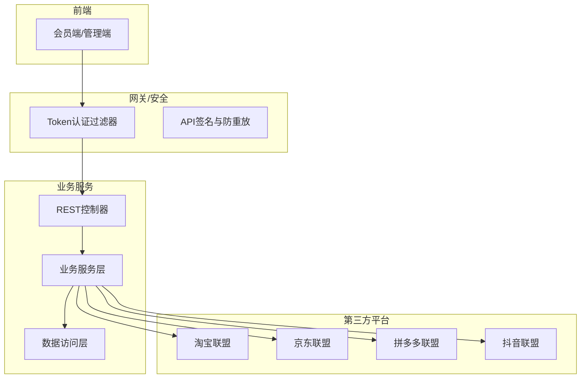
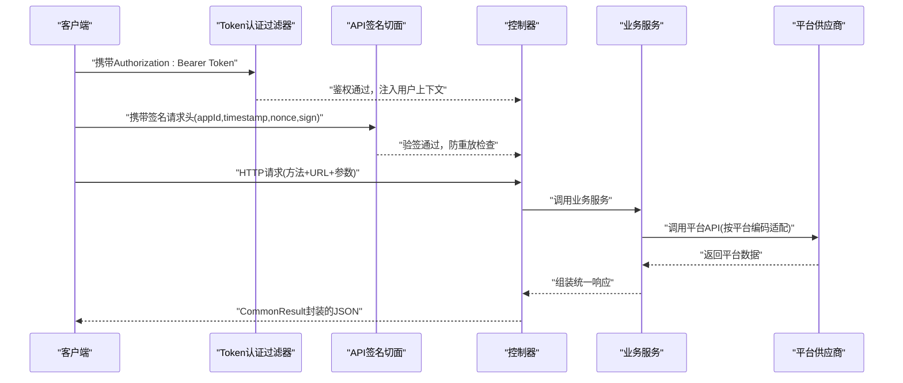
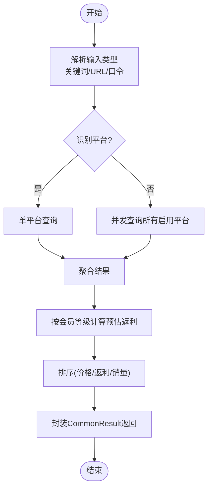
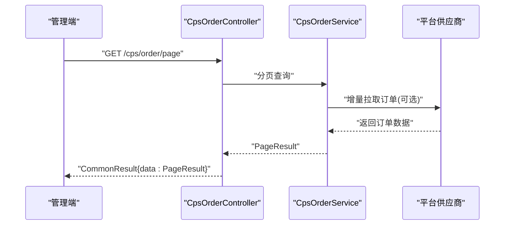
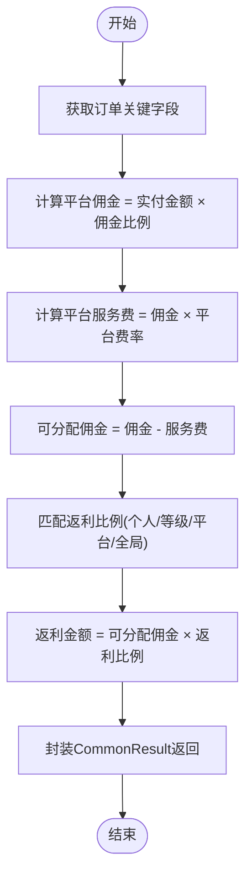
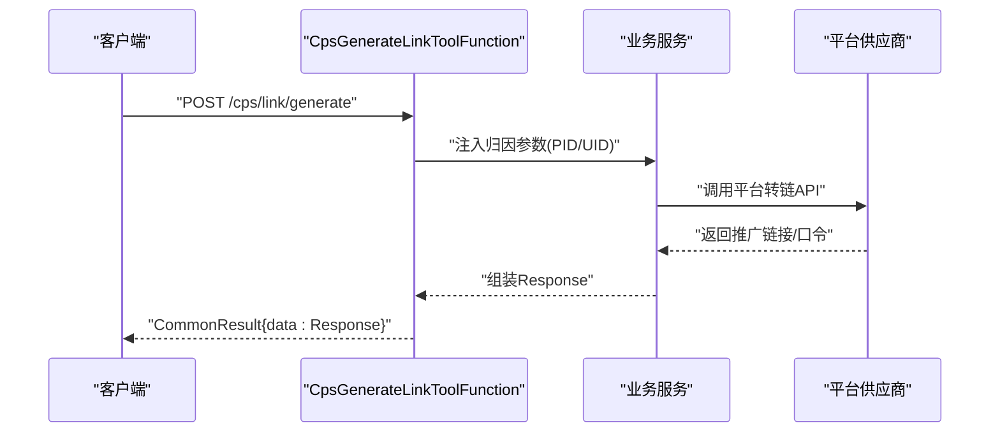
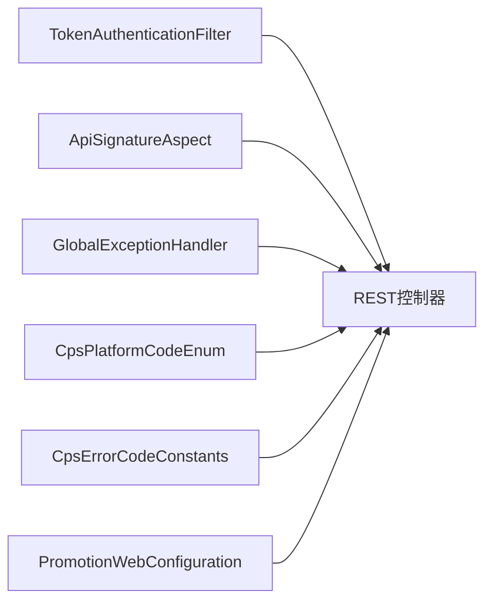

# CPS平台API

<cite>
**本文引用的文件**
- [CPS系统PRD文档.md](file://docs/CPS系统PRD文档.md)
- [CpsOrderController.java](file://backend/qiji-module-cps/qiji-module-cps-biz/src/main/java/com/qiji/cps/module/cps/controller/admin/order/CpsOrderController.java)
- [CpsAdzoneController.java](file://backend/qiji-module-cps/qiji-module-cps-biz/src/main/java/com/qiji/cps/module/cps/controller/admin/adzone/CpsAdzoneController.java)
- [CpsPlatformController.java](file://backend/qiji-module-cps/qiji-module-cps-biz/src/main/java/com/qiji/cps/module/cps/controller/admin/platform/CpsPlatformController.java)
- [CpsErrorCodeConstants.java](file://backend/qiji-module-cps/qiji-module-cps-api/src/main/java/com/qiji/cps/module/cps/enums/CpsErrorCodeConstants.java)
- [CpsPlatformCodeEnum.java](file://backend/qiji-module-cps/qiji-module-cps-api/src/main/java/com/qiji/cps/module/cps/enums/CpsPlatformCodeEnum.java)
- [ApiSignatureAspect.java](file://backend/qiji-framework/qiji-spring-boot-starter-protection/src/main/java/com/qiji/cps/framework/signature/core/aop/ApiSignatureAspect.java)
- [ApiSignatureRedisDAO.java](file://backend/qiji-framework/qiji-spring-boot-starter-protection/src/main/java/com/qiji/cps/framework/signature/core/redis/ApiSignatureRedisDAO.java)
- [QijiApiSignatureAutoConfiguration.java](file://backend/qiji-framework/qiji-spring-boot-starter-protection/src/main/java/com/qiji/cps/framework/signature/config/QijiApiSignatureAutoConfiguration.java)
- [TokenAuthenticationFilter.java](file://backend/qiji-framework/qiji-spring-boot-starter-security/src/main/java/com/qiji/cps/framework/security/core/filter/TokenAuthenticationFilter.java)
- [GlobalExceptionHandler.java](file://backend/qiji-framework/qiji-spring-boot-starter-web/src/main/java/com/qiji/cps/framework/web/core/handler/GlobalExceptionHandler.java)
- [PromotionWebConfiguration.java](file://backend/qiji-module-mall/qiji-module-promotion/src/main/java/com/qiji/cps/module/promotion/framework/web/config/PromotionWebConfiguration.java)
- [CpsGoodsItem.java](file://backend/qiji-module-cps/qiji-module-cps-biz/src/main/java/com/qiji/cps/module/cps/client/dto/CpsGoodsItem.java)
- [DtkPddVendorClient.java](file://backend/qiji-module-cps/qiji-module-cps-biz/src/main/java/com/qiji/cps/module/cps/client/dataoke/DtkPddVendorClient.java)
- [HdkPddVendorClient.java](file://backend/qiji-module-cps/qiji-module-cps-biz/src/main/java/com/qiji/cps/module/cps/client/haodanku/HdkPddVendorClient.java)
- [CpsGenerateLinkToolFunction.java](file://backend/qiji-module-cps/qiji-module-cps-biz/src/main/java/com/qiji/cps/module/cps/mcp/tool/CpsGenerateLinkToolFunction.java)
- [DtkApiResponse.java](file://agent_improvement/sdk_demo/dataoke-sdk-java/src/main/java/com/dtk/api/response/base/DtkApiResponse.java)
- [CpsRebateConfigController.http](file://backend/qiji-module-cps/qiji-module-cps-biz/src/main/java/com/qiji/cps/module/cps/controller/admin/rebate/CpsRebateConfigController.http)
</cite>

## 目录
1. [简介](#简介)
2. [项目结构](#项目结构)
3. [核心组件](#核心组件)
4. [架构总览](#架构总览)
5. [详细组件分析](#详细组件分析)
6. [依赖分析](#依赖分析)
7. [性能考虑](#性能考虑)
8. [故障排查指南](#故障排查指南)
9. [结论](#结论)
10. [附录](#附录)

## 简介
本文件为CPS平台API的详细RESTful接口文档，覆盖商品搜索、订单查询、返利计算、推广链接生成四大核心能力。文档面向开发者与集成方，提供HTTP方法、URL模式、请求参数、响应格式、认证与安全机制、参数校验、错误码说明、多平台适配差异、SDK与curl示例、性能优化与最佳实践等内容。

## 项目结构
CPS平台后端采用模块化分层架构，核心模块包括：
- 模块划分：CPS业务模块、推广模块、订单模块、支付模块、AI/MCP模块、基础设施模块等
- 控制器层：各模块提供REST控制器，统一返回CommonResult封装
- 安全与保护：基于Spring Security的Token过滤器、基于Redis的签名防重放与验签
- 文档与分组：基于OpenAPI/Swagger的模块分组配置
- 平台适配：抽象供应商客户端，针对不同平台（淘宝、京东、拼多多、抖音）进行差异化处理

**章节来源**
- [PromotionWebConfiguration.java:1-24](file://backend/qiji-module-mall/qiji-module-promotion/src/main/java/com/qiji/cps/module/promotion/framework/web/config/PromotionWebConfiguration.java#L1-L24)

## 核心组件
- 认证与授权
  - 基于Bearer Token的OAuth2访问令牌，由TokenAuthenticationFilter负责校验与上下文注入
  - 基于注解的API签名与防重放，通过ApiSignatureAspect拦截并校验请求头参数
- 错误处理
  - GlobalExceptionHandler统一捕获异常，转换为CommonResult标准响应
- 平台与枚举
  - 平台编码枚举定义支持平台：淘宝、京东、拼多多、抖音等
  - 错误码常量集中定义，便于前后端一致化处理
- 数据模型
  - 商品信息DTO统一字段，屏蔽平台差异
- SDK与示例
  - 提供大淘客Java SDK响应结构参考

**章节来源**
- [TokenAuthenticationFilter.java:1-31](file://backend/qiji-framework/qiji-spring-boot-starter-security/src/main/java/com/qiji/cps/framework/security/core/filter/TokenAuthenticationFilter.java#L1-L31)
- [ApiSignatureAspect.java:1-87](file://backend/qiji-framework/qiji-spring-boot-starter-protection/src/main/java/com/qiji/cps/framework/signature/core/aop/ApiSignatureAspect.java#L1-L87)
- [ApiSignatureRedisDAO.java:1-57](file://backend/qiji-framework/qiji-spring-boot-starter-protection/src/main/java/com/qiji/cps/framework/signature/core/redis/ApiSignatureRedisDAO.java#L1-L57)
- [QijiApiSignatureAutoConfiguration.java:1-28](file://backend/qiji-framework/qiji-spring-boot-starter-protection/src/main/java/com/qiji/cps/framework/signature/config/QijiApiSignatureAutoConfiguration.java#L1-L28)
- [GlobalExceptionHandler.java:1-26](file://backend/qiji-framework/qiji-spring-boot-starter-web/src/main/java/com/qiji/cps/framework/web/core/handler/GlobalExceptionHandler.java#L1-L26)
- [CpsPlatformCodeEnum.java:1-47](file://backend/qiji-module-cps/qiji-module-cps-api/src/main/java/com/qiji/cps/module/cps/enums/CpsPlatformCodeEnum.java#L1-L47)
- [CpsErrorCodeConstants.java:1-69](file://backend/qiji-module-cps/qiji-module-cps-api/src/main/java/com/qiji/cps/module/cps/enums/CpsErrorCodeConstants.java#L1-L69)
- [CpsGoodsItem.java:1-92](file://backend/qiji-module-cps/qiji-module-cps-biz/src/main/java/com/qiji/cps/module/cps/client/dto/CpsGoodsItem.java#L1-L92)
- [DtkApiResponse.java:1-52](file://agent_improvement/sdk_demo/dataoke-sdk-java/src/main/java/com/dtk/api/response/base/DtkApiResponse.java#L1-L52)

## 架构总览
CPS平台API遵循“统一认证 + 统一错误处理 + 平台适配”的设计原则。前端通过Token访问受保护接口；后端通过签名与防重放保障安全性；业务层对多平台差异进行抽象与适配；最终统一返回标准响应体。

**图表来源**
- [TokenAuthenticationFilter.java:1-31](file://backend/qiji-framework/qiji-spring-boot-starter-security/src/main/java/com/qiji/cps/framework/security/core/filter/TokenAuthenticationFilter.java#L1-L31)
- [ApiSignatureAspect.java:1-87](file://backend/qiji-framework/qiji-spring-boot-starter-protection/src/main/java/com/qiji/cps/framework/signature/core/aop/ApiSignatureAspect.java#L1-L87)
- [CpsPlatformCodeEnum.java:1-47](file://backend/qiji-module-cps/qiji-module-cps-api/src/main/java/com/qiji/cps/module/cps/enums/CpsPlatformCodeEnum.java#L1-L47)

## 详细组件分析

### 商品搜索接口
- 接口目标
  - 支持关键词搜索、URL/口令解析、多平台并发查询与聚合
  - 返回统一的商品列表，包含预估返利
- HTTP方法与URL
  - GET/POST均可用于搜索（具体端点以实际控制器为准）
  - 建议：GET用于简单查询，POST用于复杂筛选与并发搜索
- 请求参数
  - 关键词/URL/口令识别
  - 平台筛选、分页参数、排序字段
- 响应格式
  - 统一包装为CommonResult，data为商品列表
  - 商品字段参考CpsGoodsItem，屏蔽平台差异
- 平台适配要点
  - 价格单位与佣金率换算（如拼多多价格单位为分）
  - 商品主图、标题、店铺、销量、券后价、佣金比例、品牌等字段映射
- 示例
  - curl示例（占位，实际请替换为真实域名与Token）
    - GET /cps/goods/search?keyword=手机&pageNo=1&pageSize=20
    - POST /cps/goods/search
      - 请求体：包含keyword、filters、platforms等
  - SDK参考
    - 大淘客Java SDK响应结构参考DtkApiResponse

**图表来源**
- [CpsGoodsItem.java:1-92](file://backend/qiji-module-cps/qiji-module-cps-biz/src/main/java/com/qiji/cps/module/cps/client/dto/CpsGoodsItem.java#L1-L92)
- [DtkPddVendorClient.java:1-42](file://backend/qiji-module-cps/qiji-module-cps-biz/src/main/java/com/qiji/cps/module/cps/client/dataoke/DtkPddVendorClient.java#L1-L42)
- [HdkPddVendorClient.java:127-155](file://backend/qiji-module-cps/qiji-module-cps-biz/src/main/java/com/qiji/cps/module/cps/client/haodanku/HdkPddVendorClient.java#L127-L155)

**章节来源**
- [CpsGoodsItem.java:1-92](file://backend/qiji-module-cps/qiji-module-cps-biz/src/main/java/com/qiji/cps/module/cps/client/dto/CpsGoodsItem.java#L1-L92)
- [DtkPddVendorClient.java:1-42](file://backend/qiji-module-cps/qiji-module-cps-biz/src/main/java/com/qiji/cps/module/cps/client/dataoke/DtkPddVendorClient.java#L1-L42)
- [HdkPddVendorClient.java:127-155](file://backend/qiji-module-cps/qiji-module-cps-biz/src/main/java/com/qiji/cps/module/cps/client/haodanku/HdkPddVendorClient.java#L127-L155)
- [DtkApiResponse.java:1-52](file://agent_improvement/sdk_demo/dataoke-sdk-java/src/main/java/com/dtk/api/response/base/DtkApiResponse.java#L1-L52)

### 订单查询接口
- 接口目标
  - 管理后台分页查询CPS订单，支持按平台、状态、时间范围筛选
- HTTP方法与URL
  - GET /cps/order/page
  - GET /cps/order/get?id={id}
  - POST /cps/order/sync?platformCode={code}&hours={n}
- 请求参数
  - 分页参数、平台编码、订单状态、起止时间
  - 手动同步参数：platformCode、hours
- 响应格式
  - CommonResult包裹PageResult或单个订单详情
- 安全与权限
  - 需要“cps:order:query”权限
- 示例
  - GET /cps/order/page?pageNo=1&pageSize=20&platformCode=taobao&status=paid
  - POST /cps/order/sync?platformCode=pdd&hours=2

**图表来源**
- [CpsOrderController.java:1-64](file://backend/qiji-module-cps/qiji-module-cps-biz/src/main/java/com/qiji/cps/module/cps/controller/admin/order/CpsOrderController.java#L1-L64)

**章节来源**
- [CpsOrderController.java:1-64](file://backend/qiji-module-cps/qiji-module-cps-biz/src/main/java/com/qiji/cps/module/cps/controller/admin/order/CpsOrderController.java#L1-L64)

### 返利计算接口
- 接口目标
  - 基于订单实付金额、平台佣金比例、平台服务费率、会员返利比例计算返利
- HTTP方法与URL
  - POST /cps/rebate/calculate（建议）
  - 或在订单结算流程中自动触发
- 请求参数
  - 订单ID或订单关键字段（实付金额、佣金比例、平台服务费率、会员等级/平台配置）
- 响应格式
  - CommonResult包裹返利计算结果（可分配佣金、返利比例、返利金额、平台利润等）
- 平台适配
  - 平台服务费率不同（如淘宝日结、京东月结、拼多多约15个工作日）
  - 入账延迟与结算周期配置
- 示例
  - POST /cps/rebate/calculate
    - 请求体：订单金额、平台编码、会员等级、平台服务费率等

**图表来源**
- [CPS系统PRD文档.md:760-800](file://docs/CPS系统PRD文档.md#L760-L800)

**章节来源**
- [CPS系统PRD文档.md:760-800](file://docs/CPS系统PRD文档.md#L760-L800)

### 推广链接生成接口
- 接口目标
  - 生成带归因参数的推广链接/淘口令/短链，支持多平台差异化
- HTTP方法与URL
  - POST /cps/link/generate
- 请求参数
  - platformCode、goodsId、memberId（可选，从上下文推断）
  - 归因参数：淘宝adzone_id+external_info、京东subUnionId、拼多多custom_parameters
- 响应格式
  - CommonResult包裹Response对象（shortUrl、longUrl、tpwd、mobileUrl、actualPrice、commissionRate、commissionAmount、couponInfo、error）
- 平台适配
  - 淘宝：优先返回淘口令与推广链接
  - 京东：返回短链与长链
  - 拼多多：返回推广链接与小程序路径
- 示例
  - POST /cps/link/generate
    - 请求体：{platformCode:"taobao", goodsId:"xxx", memberId:123}

**图表来源**
- [CpsGenerateLinkToolFunction.java:64-106](file://backend/qiji-module-cps/qiji-module-cps-biz/src/main/java/com/qiji/cps/module/cps/mcp/tool/CpsGenerateLinkToolFunction.java#L64-L106)

**章节来源**
- [CpsGenerateLinkToolFunction.java:64-106](file://backend/qiji-module-cps/qiji-module-cps-biz/src/main/java/com/qiji/cps/module/cps/mcp/tool/CpsGenerateLinkToolFunction.java#L64-L106)

### 平台配置与返利配置接口
- 平台配置
  - POST /cps/platform/create、PUT /cps/platform/update、DELETE /cps/platform/delete
  - GET /cps/platform/get?id=、GET /cps/platform/page、GET /cps/platform/list-enabled
- 返利配置
  - GET/POST/PUT/DELETE /cps/rebate-config/*
  - 支持按平台、状态、优先级筛选
- 权限
  - 需要相应权限：cps:platform:create/update/query/delete 等

**章节来源**
- [CpsPlatformController.java:1-83](file://backend/qiji-module-cps/qiji-module-cps-biz/src/main/java/com/qiji/cps/module/cps/controller/admin/platform/CpsPlatformController.java#L1-L83)
- [CpsAdzoneController.java:1-84](file://backend/qiji-module-cps/qiji-module-cps-biz/src/main/java/com/qiji/cps/module/cps/controller/admin/adzone/CpsAdzoneController.java#L1-L84)
- [CpsRebateConfigController.http:50-86](file://backend/qiji-module-cps/qiji-module-cps-biz/src/main/java/com/qiji/cps/module/cps/controller/admin/rebate/CpsRebateConfigController.http#L50-L86)

## 依赖分析
- 认证与安全
  - TokenAuthenticationFilter：校验Bearer Token，注入登录用户上下文
  - ApiSignatureAspect：拦截带@ApiSignature注解的方法，校验签名与nonce防重放
  - ApiSignatureRedisDAO：基于Redis存储nonce与appSecret
  - GlobalExceptionHandler：统一异常处理，标准化错误响应
- 平台与枚举
  - CpsPlatformCodeEnum：统一平台编码
  - CpsErrorCodeConstants：统一错误码
- 文档与分组
  - PromotionWebConfiguration：OpenAPI分组(promotion)

**图表来源**
- [TokenAuthenticationFilter.java:1-31](file://backend/qiji-framework/qiji-spring-boot-starter-security/src/main/java/com/qiji/cps/framework/security/core/filter/TokenAuthenticationFilter.java#L1-L31)
- [ApiSignatureAspect.java:1-87](file://backend/qiji-framework/qiji-spring-boot-starter-protection/src/main/java/com/qiji/cps/framework/signature/core/aop/ApiSignatureAspect.java#L1-L87)
- [ApiSignatureRedisDAO.java:1-57](file://backend/qiji-framework/qiji-spring-boot-starter-protection/src/main/java/com/qiji/cps/framework/signature/core/redis/ApiSignatureRedisDAO.java#L1-L57)
- [GlobalExceptionHandler.java:1-26](file://backend/qiji-framework/qiji-spring-boot-starter-web/src/main/java/com/qiji/cps/framework/web/core/handler/GlobalExceptionHandler.java#L1-L26)
- [CpsPlatformCodeEnum.java:1-47](file://backend/qiji-module-cps/qiji-module-cps-api/src/main/java/com/qiji/cps/module/cps/enums/CpsPlatformCodeEnum.java#L1-L47)
- [CpsErrorCodeConstants.java:1-69](file://backend/qiji-module-cps/qiji-module-cps-api/src/main/java/com/qiji/cps/module/cps/enums/CpsErrorCodeConstants.java#L1-L69)
- [PromotionWebConfiguration.java:1-24](file://backend/qiji-module-mall/qiji-module-promotion/src/main/java/com/qiji/cps/module/promotion/framework/web/config/PromotionWebConfiguration.java#L1-L24)

**章节来源**
- [TokenAuthenticationFilter.java:1-31](file://backend/qiji-framework/qiji-spring-boot-starter-security/src/main/java/com/qiji/cps/framework/security/core/filter/TokenAuthenticationFilter.java#L1-L31)
- [ApiSignatureAspect.java:1-87](file://backend/qiji-framework/qiji-spring-boot-starter-protection/src/main/java/com/qiji/cps/framework/signature/core/aop/ApiSignatureAspect.java#L1-L87)
- [ApiSignatureRedisDAO.java:1-57](file://backend/qiji-framework/qiji-spring-boot-starter-protection/src/main/java/com/qiji/cps/framework/signature/core/redis/ApiSignatureRedisDAO.java#L1-L57)
- [GlobalExceptionHandler.java:1-26](file://backend/qiji-framework/qiji-spring-boot-starter-web/src/main/java/com/qiji/cps/framework/web/core/handler/GlobalExceptionHandler.java#L1-L26)
- [CpsPlatformCodeEnum.java:1-47](file://backend/qiji-module-cps/qiji-module-cps-api/src/main/java/com/qiji/cps/module/cps/enums/CpsPlatformCodeEnum.java#L1-L47)
- [CpsErrorCodeConstants.java:1-69](file://backend/qiji-module-cps/qiji-module-cps-api/src/main/java/com/qiji/cps/module/cps/enums/CpsErrorCodeConstants.java#L1-L69)
- [PromotionWebConfiguration.java:1-24](file://backend/qiji-module-mall/qiji-module-promotion/src/main/java/com/qiji/cps/module/promotion/framework/web/config/PromotionWebConfiguration.java#L1-L24)

## 性能考虑
- 并发搜索与聚合
  - 多平台并发查询，优先返回已到结果，减少等待时间
  - 对超时平台返回“暂时无法查询”，提升用户体验
- 缓存与限流
  - 对热点搜索与商品详情使用缓存，合理设置TTL
  - 对API供应商接口进行限流与熔断
- 订单同步
  - 定时任务每5分钟增量同步，避免频繁全量拉取
  - 支持手动同步，按平台与小时窗口控制
- 推广链接生成
  - 预热PID与平台配置，降低首次生成延迟
  - 对平台转链接口进行异步化与重试

[本节为通用性能建议，无需特定文件引用]

## 故障排查指南
- 认证失败
  - 检查Authorization头是否为Bearer Token，Token是否有效
  - 确认用户登录状态与权限
- 签名验签失败
  - 检查请求头是否包含appId、timestamp、nonce、sign
  - 确认timestamp在允许范围内，nonce未重复使用
  - 确认appSecret配置正确
- 参数校验异常
  - 关注GlobalExceptionHandler返回的错误码与message
  - 常见错误：参数缺失、格式不正确、超出范围
- 平台接口异常
  - 检查平台配置（AppKey/AppSecret/API地址）
  - 查看平台返回状态与错误信息
- 订单同步异常
  - 检查手动同步参数与平台编码
  - 关注平台结算周期与入账延迟

**章节来源**
- [TokenAuthenticationFilter.java:1-31](file://backend/qiji-framework/qiji-spring-boot-starter-security/src/main/java/com/qiji/cps/framework/security/core/filter/TokenAuthenticationFilter.java#L1-L31)
- [ApiSignatureAspect.java:1-87](file://backend/qiji-framework/qiji-spring-boot-starter-protection/src/main/java/com/qiji/cps/framework/signature/core/aop/ApiSignatureAspect.java#L1-L87)
- [GlobalExceptionHandler.java:1-26](file://backend/qiji-framework/qiji-spring-boot-starter-web/src/main/java/com/qiji/cps/framework/web/core/handler/GlobalExceptionHandler.java#L1-L26)
- [CpsErrorCodeConstants.java:1-69](file://backend/qiji-module-cps/qiji-module-cps-api/src/main/java/com/qiji/cps/module/cps/enums/CpsErrorCodeConstants.java#L1-L69)

## 结论
本文档提供了CPS平台API的完整REST接口说明，涵盖商品搜索、订单查询、返利计算、推广链接生成等核心能力。通过统一认证、签名与防重放、统一错误处理与平台适配，确保接口在多平台环境下的一致性与可靠性。建议在生产环境中结合缓存、限流、异步化与可观测性手段持续优化性能与稳定性。

[本节为总结性内容，无需特定文件引用]

## 附录

### 认证与安全机制
- Token认证
  - Authorization: Bearer {access_token}
  - 由TokenAuthenticationFilter校验并注入用户上下文
- API签名与防重放
  - 请求头必需字段：appId、timestamp、nonce、sign
  - sign为服务端按约定规则生成的SHA-256摘要
  - nonce写入Redis并设置TTL，防止重复请求
- 错误码
  - 统一使用CpsErrorCodeConstants中的错误码，便于前后端一致化处理

**章节来源**
- [TokenAuthenticationFilter.java:1-31](file://backend/qiji-framework/qiji-spring-boot-starter-security/src/main/java/com/qiji/cps/framework/security/core/filter/TokenAuthenticationFilter.java#L1-L31)
- [ApiSignatureAspect.java:1-87](file://backend/qiji-framework/qiji-spring-boot-starter-protection/src/main/java/com/qiji/cps/framework/signature/core/aop/ApiSignatureAspect.java#L1-L87)
- [ApiSignatureRedisDAO.java:1-57](file://backend/qiji-framework/qiji-spring-boot-starter-protection/src/main/java/com/qiji/cps/framework/signature/core/redis/ApiSignatureRedisDAO.java#L1-L57)
- [CpsErrorCodeConstants.java:1-69](file://backend/qiji-module-cps/qiji-module-cps-api/src/main/java/com/qiji/cps/module/cps/enums/CpsErrorCodeConstants.java#L1-L69)

### 多平台适配要点
- 平台编码
  - taobao、jd、pdd、douyin等
- 价格与佣金单位
  - 拼多多价格单位为分，需除以100转换为元；佣金率可能需除以10
- 推广链接输出
  - 淘宝：优先淘口令与推广链接
  - 京东：短链与长链
  - 拼多多：推广链接与小程序路径

**章节来源**
- [CpsPlatformCodeEnum.java:1-47](file://backend/qiji-module-cps/qiji-module-cps-api/src/main/java/com/qiji/cps/module/cps/enums/CpsPlatformCodeEnum.java#L1-L47)
- [DtkPddVendorClient.java:1-42](file://backend/qiji-module-cps/qiji-module-cps-biz/src/main/java/com/qiji/cps/module/cps/client/dataoke/DtkPddVendorClient.java#L1-L42)
- [HdkPddVendorClient.java:127-155](file://backend/qiji-module-cps/qiji-module-cps-biz/src/main/java/com/qiji/cps/module/cps/client/haodanku/HdkPddVendorClient.java#L127-L155)

### 数据模型与响应格式
- 商品信息DTO
  - goodsId、platformCode、title、mainPic、originalPrice、actualPrice、couponPrice、commissionRate、commissionAmount、monthSales、shopName、shopType、itemLink、brandName、goodsSign
- SDK响应参考
  - DtkApiResponse：包含time、code、msg、data，isSuccess判断

**章节来源**
- [CpsGoodsItem.java:1-92](file://backend/qiji-module-cps/qiji-module-cps-biz/src/main/java/com/qiji/cps/module/cps/client/dto/CpsGoodsItem.java#L1-L92)
- [DtkApiResponse.java:1-52](file://agent_improvement/sdk_demo/dataoke-sdk-java/src/main/java/com/dtk/api/response/base/DtkApiResponse.java#L1-L52)

### 示例与最佳实践
- curl示例（占位）
  - GET /cps/order/page?pageNo=1&pageSize=20&platformCode=taobao&status=paid
  - POST /cps/order/sync?platformCode=pdd&hours=2
  - POST /cps/link/generate
- SDK使用
  - 参考大淘客Java SDK的响应结构与字段含义
- 最佳实践
  - 使用POST进行复杂查询与并发搜索
  - 合理设置分页大小与排序字段
  - 对高频接口进行缓存与限流
  - 订单同步采用增量拉取与定时任务

**章节来源**
- [CpsOrderController.java:1-64](file://backend/qiji-module-cps/qiji-module-cps-biz/src/main/java/com/qiji/cps/module/cps/controller/admin/order/CpsOrderController.java#L1-L64)
- [CpsGenerateLinkToolFunction.java:64-106](file://backend/qiji-module-cps/qiji-module-cps-biz/src/main/java/com/qiji/cps/module/cps/mcp/tool/CpsGenerateLinkToolFunction.java#L64-L106)
- [DtkApiResponse.java:1-52](file://agent_improvement/sdk_demo/dataoke-sdk-java/src/main/java/com/dtk/api/response/base/DtkApiResponse.java#L1-L52)