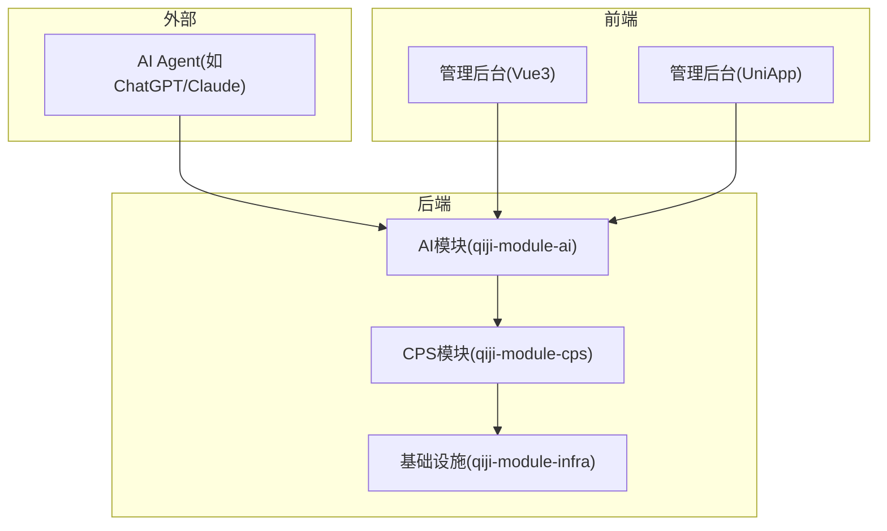
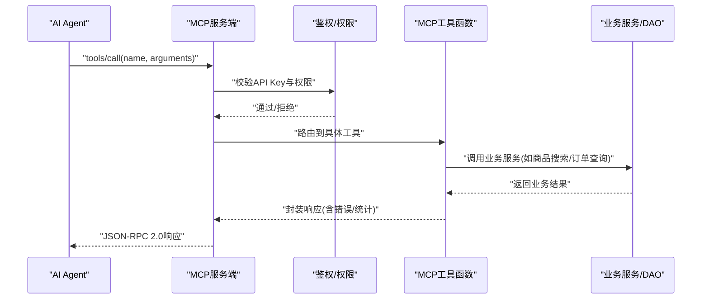
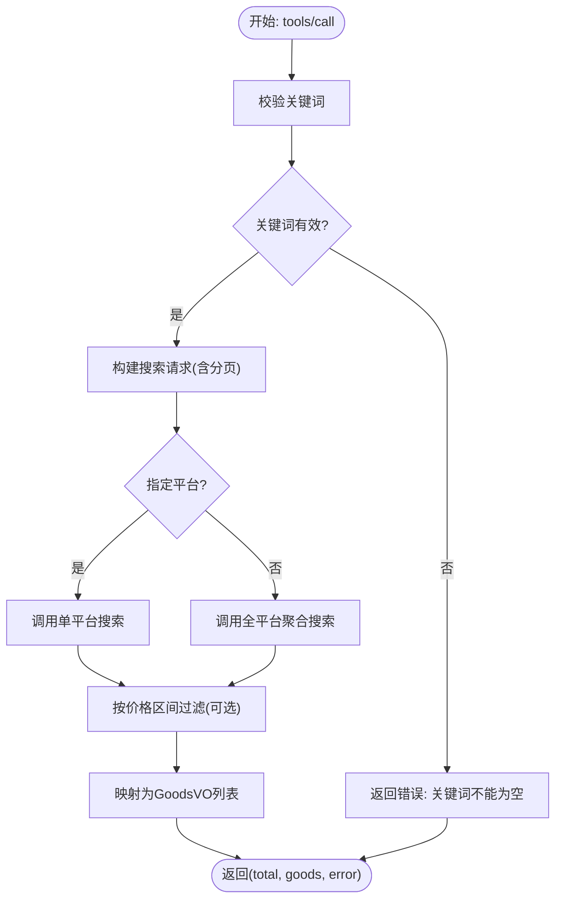
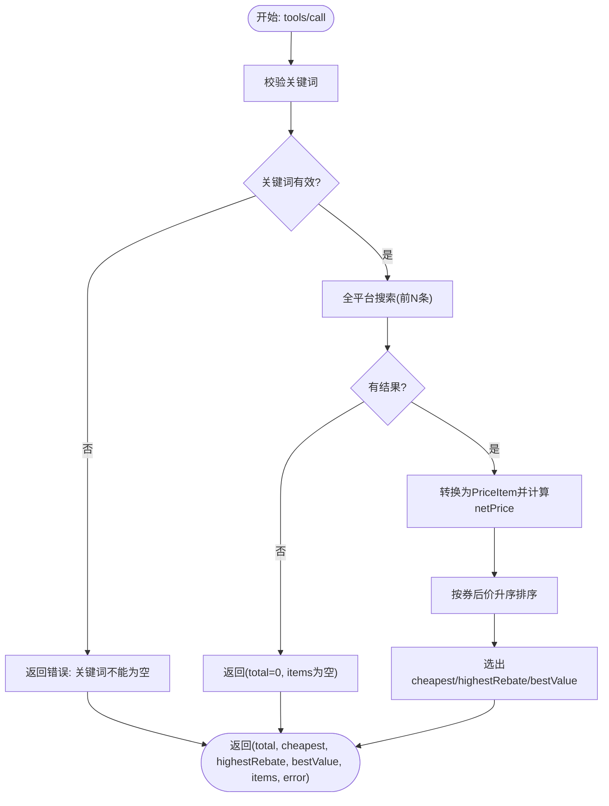
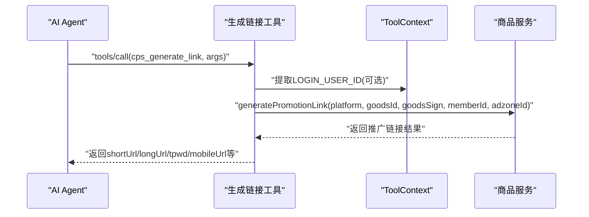
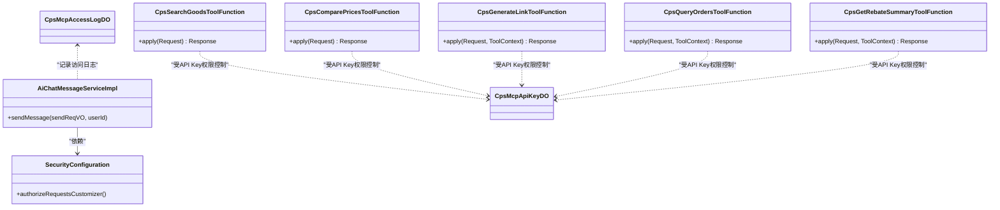

# MCP AI接口

<cite>
**本文引用的文件**
- [README.md](file://README.md)
- [AGENTS.md](file://AGENTS.md)
- [AiChatMessageServiceImpl.java](file://backend/qiji-module-ai/src/main/java/com/qiji/cps/module/ai/service/chat/AiChatMessageServiceImpl.java)
- [SecurityConfiguration.java](file://backend/qiji-module-ai/src/main/java/com/qiji/cps/module/ai/framework/security/config/SecurityConfiguration.java)
- [CpsSearchGoodsToolFunction.java](file://backend/qiji-module-cps/qiji-module-cps-biz/src/main/java/com/qiji/cps/module/cps/mcp/tool/CpsSearchGoodsToolFunction.java)
- [CpsComparePricesToolFunction.java](file://backend/qiji-module-cps/qiji-module-cps-biz/src/main/java/com/qiji/cps/module/cps/mcp/tool/CpsComparePricesToolFunction.java)
- [CpsGenerateLinkToolFunction.java](file://backend/qiji-module-cps/qiji-module-cps-biz/src/main/java/com/qiji/cps/module/cps/mcp/tool/CpsGenerateLinkToolFunction.java)
- [CpsQueryOrdersToolFunction.java](file://backend/qiji-module-cps/qiji-module-cps-biz/src/main/java/com/qiji/cps/module/cps/mcp/tool/CpsQueryOrdersToolFunction.java)
- [CpsGetRebateSummaryToolFunction.java](file://backend/qiji-module-cps/qiji-module-cps-biz/src/main/java/com/qiji/cps/module/cps/mcp/tool/CpsGetRebateSummaryToolFunction.java)
- [CpsMcpApiKeyDO.java](file://backend/qiji-module-cps/qiji-module-cps-biz/src/main/java/com/qiji/cps/module/cps/dal/dataobject/mcp/CpsMcpApiKeyDO.java)
- [CpsMcpAccessLogDO.java](file://backend/qiji-module-cps/qiji-module-cps-biz/src/main/java/com/qiji/cps/module/cps/dal/dataobject/mcp/CpsMcpAccessLogDO.java)
- [CpsMcpApiKeyMapper.java](file://backend/qiji-module-cps/qiji-module-cps-biz/src/main/java/com/qiji/cps/module/cps/dal/mysql/mcp/CpsMcpApiKeyMapper.java)
- [CpsMcpAccessLogMapper.java](file://backend/qiji-module-cps/qiji-module-cps-biz/src/main/java/com/qiji/cps/module/cps/dal/mysql/mcp/CpsMcpAccessLogMapper.java)
- [CPS系统PRD文档.md](file://docs/CPS系统PRD文档.md)
</cite>

## 目录
1. [简介](#简介)
2. [项目结构](#项目结构)
3. [核心组件](#核心组件)
4. [架构总览](#架构总览)
5. [详细组件分析](#详细组件分析)
6. [依赖关系分析](#依赖关系分析)
7. [性能考虑](#性能考虑)
8. [故障排查指南](#故障排查指南)
9. [结论](#结论)
10. [附录](#附录)

## 简介
本文件面向MCP（Model Context Protocol）AI接口的协议与实现，系统性阐述AI工具调用接口、Agent管理接口、会话管理接口、配置管理接口的协议规范、消息格式、事件类型与实时交互模式。重点覆盖5个开箱即用的AI工具函数：商品搜索工具、比价工具、链接生成工具、订单查询工具、返利汇总工具的调用方式、参数格式与返回结果；并提供MCP协议的消息传递机制、状态管理、错误处理、超时重试策略、AI代理配置示例、工具函数开发指南、内存管理系统使用说明、性能优化建议、协议交互示例、调试工具使用方法与监控指标配置。

## 项目结构
- 后端模块
  - qiji-module-ai：AI聊天与MCP协议接入层
  - qiji-module-cps：CPS业务模块，包含MCP工具实现与数据访问层
  - qiji-module-infra：基础设施与公共能力
- 前端模块
  - admin-vue3、admin-uniapp：管理后台与移动端前端
- 文档与规范
  - README.md：项目总体介绍与MCP协议概览
  - AGENTS.md：MCP协议细节与实现要点
  - CPS系统PRD文档.md：后台管理、API Key、Tools配置与访问日志

**章节来源**
- [README.md:185-210](file://README.md#L185-L210)
- [AGENTS.md:182-205](file://AGENTS.md#L182-L205)

## 核心组件
- MCP协议接入层
  - 基于Spring AI MCP Server，支持SSE与可流式HTTP传输
  - 安全配置开放MCP端点访问，结合API Key鉴权与权限控制
- AI聊天服务
  - 负责会话校验、历史消息加载、模型校验与MCP客户端编排
- MCP工具函数
  - 商品搜索、跨平台比价、推广链接生成、订单查询、返利汇总
- 数据与日志
  - API Key管理、访问日志、订单与返利数据持久化

**章节来源**
- [AiChatMessageServiceImpl.java:140-150](file://backend/qiji-module-ai/src/main/java/com/qiji/cps/module/ai/service/chat/AiChatMessageServiceImpl.java#L140-L150)
- [SecurityConfiguration.java:25-42](file://backend/qiji-module-ai/src/main/java/com/qiji/cps/module/ai/framework/security/config/SecurityConfiguration.java#L25-L42)

## 架构总览
MCP协议通过统一入口接收AI Agent的工具调用请求，经API Key鉴权与权限校验后，路由到对应工具函数执行业务逻辑，并返回结构化结果。会话与上下文通过ToolContext传递，确保订单归因与用户态一致性。

**图表来源**
- [AGENTS.md:182-188](file://AGENTS.md#L182-L188)
- [CpsSearchGoodsToolFunction.java:120-177](file://backend/qiji-module-cps/qiji-module-cps-biz/src/main/java/com/qiji/cps/module/cps/mcp/tool/CpsSearchGoodsToolFunction.java#L120-L177)
- [CpsGenerateLinkToolFunction.java:97-142](file://backend/qiji-module-cps/qiji-module-cps-biz/src/main/java/com/qiji/cps/module/cps/mcp/tool/CpsGenerateLinkToolFunction.java#L97-L142)

**章节来源**
- [AGENTS.md:182-188](file://AGENTS.md#L182-L188)

## 详细组件分析

### MCP协议与消息传递机制
- 传输协议
  - Streamable HTTP(JSON-RPC 2.0)
  - SSE端点与消息端点开放访问
- 终端与鉴权
  - 统一端点：/mcp/cps
  - API Key管理：权限级别(public/member/admin)、限流配置、状态开关
  - 访问日志：脱敏记录、耗时统计、来源IP、用户ID关联
- 上下文传递
  - ToolContext携带当前登录用户ID，用于订单归因与用户态查询

**章节来源**
- [AGENTS.md:182-188](file://AGENTS.md#L182-L188)
- [CPS系统PRD文档.md:700-757](file://docs/CPS系统PRD文档.md#L700-L757)

### 商品搜索工具（cps_search_goods）
- 功能概述
  - 在淘宝/京东/拼多多/抖音平台搜索商品，支持平台筛选与价格区间过滤
- 调用方式
  - method: tools/call
  - name: cps_search_goods
- 请求参数
  - keyword: 关键词（必填）
  - platform_code: 平台编码（可选）
  - page_size: 每页数量（默认10，最大20）
  - price_min: 最低价格（可选）
  - price_max: 最高价格（可选）
- 返回结果
  - total: 结果总数
  - goods: 商品列表（含平台编码、标题、主图、原价、券后价、优惠券金额、佣金比例、预估佣金、月销量、店铺名称、goodsSign等）
  - error: 错误信息（成功为null）

**图表来源**
- [CpsSearchGoodsToolFunction.java:37-118](file://backend/qiji-module-cps/qiji-module-cps-biz/src/main/java/com/qiji/cps/module/cps/mcp/tool/CpsSearchGoodsToolFunction.java#L37-L118)

**章节来源**
- [CpsSearchGoodsToolFunction.java:21-177](file://backend/qiji-module-cps/qiji-module-cps-biz/src/main/java/com/qiji/cps/module/cps/mcp/tool/CpsSearchGoodsToolFunction.java#L21-L177)

### 比价工具（cps_compare_prices）
- 功能概述
  - 跨平台搜索同一关键词，按券后价、返利金额、净价（券后价-返利）排序，推荐最优购买方案
- 调用方式
  - method: tools/call
  - name: cps_compare_prices
- 请求参数
  - keyword: 关键词（必填）
  - top_n: 参与比价的前N条结果（默认5，最大10）
- 返回结果
  - total: 参与比价的商品总数
  - cheapest: 价格最低的商品
  - highestRebate: 返利最高的商品
  - bestValue: 综合最优（净价最低）
  - items: 按券后价升序的完整列表
  - error: 错误信息

**图表来源**
- [CpsComparePricesToolFunction.java:39-111](file://backend/qiji-module-cps/qiji-module-cps-biz/src/main/java/com/qiji/cps/module/cps/mcp/tool/CpsComparePricesToolFunction.java#L39-L111)

**章节来源**
- [CpsComparePricesToolFunction.java:22-176](file://backend/qiji-module-cps/qiji-module-cps-biz/src/main/java/com/qiji/cps/module/cps/mcp/tool/CpsComparePricesToolFunction.java#L22-L176)

### 链接生成工具（cps_generate_link）
- 功能概述
  - 为指定商品生成带返利追踪的推广链接，支持短链、长链、口令、移动端链接等格式
- 调用方式
  - method: tools/call
  - name: cps_generate_link
  - 通过ToolContext获取当前登录用户ID，无需在请求中传入member_id
- 请求参数
  - platform_code: 平台编码（必填）
  - goods_id: 平台商品ID（必填）
  - goods_sign: 商品goodsSign（拼多多必填，其他可选）
  - member_id: 会员ID（可选，未传则从ToolContext提取）
  - adzone_id: 推广位ID（可选）
- 返回结果
  - shortUrl: 推广短链接（优先）
  - longUrl: 推广长链接
  - tpwd: 淘宝口令
  - mobileUrl: 移动端链接（拼多多）
  - actualPrice: 券后价
  - commissionRate: 佣金比例
  - commissionAmount: 预估佣金
  - couponInfo: 券信息描述
  - error: 错误信息

**图表来源**
- [CpsGenerateLinkToolFunction.java:39-95](file://backend/qiji-module-cps/qiji-module-cps-biz/src/main/java/com/qiji/cps/module/cps/mcp/tool/CpsGenerateLinkToolFunction.java#L39-L95)

**章节来源**
- [CpsGenerateLinkToolFunction.java:19-142](file://backend/qiji-module-cps/qiji-module-cps-biz/src/main/java/com/qiji/cps/module/cps/mcp/tool/CpsGenerateLinkToolFunction.java#L19-L142)

### 订单查询工具（cps_query_orders）
- 功能概述
  - 查询当前登录会员的CPS联盟返利订单列表，支持平台与状态筛选、分页
- 调用方式
  - method: tools/call
  - name: cps_query_orders
  - 通过ToolContext获取当前登录用户ID
- 请求参数
  - platform_code: 平台编码（可选）
  - order_status: 订单状态（可选）
  - page_no: 页码（默认1）
  - page_size: 每页数量（默认10，最大20）
- 返回结果
  - total: 总记录数
  - orders: 订单列表（含平台编码、平台订单号、商品标题、主图、券后价、预估返利、实际返利、订单状态、返利入账时间、创建时间）
  - error: 错误信息

**章节来源**
- [CpsQueryOrdersToolFunction.java:25-169](file://backend/qiji-module-cps/qiji-module-cps-biz/src/main/java/com/qiji/cps/module/cps/mcp/tool/CpsQueryOrdersToolFunction.java#L25-L169)

### 返利汇总工具（cps_get_rebate_summary）
- 功能概述
  - 查询当前登录会员的返利账户汇总信息：可用余额、冻结余额、累计返利总额、已提现金额、账户状态，以及最近N条返利记录
- 调用方式
  - method: tools/call
  - name: cps_get_rebate_summary
  - 通过ToolContext获取当前登录用户ID
- 请求参数
  - recent_count: 最近N条记录（默认5，最大20）
- 返回结果
  - availableBalance: 可用余额
  - frozenBalance: 冻结余额
  - totalRebate: 累计返利总额
  - withdrawnAmount: 已提现金额
  - accountStatus: 账户状态(normal/frozen)
  - recentRecords: 最近返利记录列表（含商品标题、平台编码、返利金额、返利类型、返利状态、创建时间）
  - error: 错误信息

**章节来源**
- [CpsGetRebateSummaryToolFunction.java:24-162](file://backend/qiji-module-cps/qiji-module-cps-biz/src/main/java/com/qiji/cps/module/cps/mcp/tool/CpsGetRebateSummaryToolFunction.java#L24-L162)

### Agent管理接口与会话管理接口
- Agent管理
  - API Key管理：创建、更新、删除、权限级别、限流配置、状态开关、使用统计
  - Tools配置：查看工具列表、配置访问权限、查看使用统计与性能指标、配置参数默认值与限制
  - 访问日志：按时间、API Key、Tool/Resource、用户ID、响应状态筛选
- 会话管理
  - 会话校验：校验对话存在与归属
  - 历史消息：加载历史消息用于上下文
  - 模型校验：校验所选模型可用性
  - MCP客户端编排：根据配置注入McpSyncClient与ToolCallbackResolver

**章节来源**
- [CPS系统PRD文档.md:700-757](file://docs/CPS系统PRD文档.md#L700-L757)
- [AiChatMessageServiceImpl.java:140-150](file://backend/qiji-module-ai/src/main/java/com/qiji/cps/module/ai/service/chat/AiChatMessageServiceImpl.java#L140-L150)

### 配置管理接口
- API Key配置
  - 字段：名称、值、权限级别、限流配置、状态、备注
  - 权限级别：public/member/admin
  - 限流：每分钟/小时/天最大请求数
- Tools参数配置
  - 默认值与限制：如page_size/top_n/recent_count等
  - 访问统计与性能指标：调用次数、平均耗时、错误率

**章节来源**
- [CPS系统PRD文档.md:700-734](file://docs/CPS系统PRD文档.md#L700-L734)

## 依赖关系分析

**图表来源**
- [CpsSearchGoodsToolFunction.java:28-30](file://backend/qiji-module-cps/qiji-module-cps-biz/src/main/java/com/qiji/cps/module/cps/mcp/tool/CpsSearchGoodsToolFunction.java#L28-L30)
- [CpsComparePricesToolFunction.java:30-32](file://backend/qiji-module-cps/qiji-module-cps-biz/src/main/java/com/qiji/cps/module/cps/mcp/tool/CpsComparePricesToolFunction.java#L30-L32)
- [CpsGenerateLinkToolFunction.java:27-29](file://backend/qiji-module-cps/qiji-module-cps-biz/src/main/java/com/qiji/cps/module/cps/mcp/tool/CpsGenerateLinkToolFunction.java#L27-L29)
- [CpsQueryOrdersToolFunction.java:33-35](file://backend/qiji-module-cps/qiji-module-cps-biz/src/main/java/com/qiji/cps/module/cps/mcp/tool/CpsQueryOrdersToolFunction.java#L33-L35)
- [CpsGetRebateSummaryToolFunction.java:32-34](file://backend/qiji-module-cps/qiji-module-cps-biz/src/main/java/com/qiji/cps/module/cps/mcp/tool/CpsGetRebateSummaryToolFunction.java#L32-L34)
- [SecurityConfiguration.java:25-42](file://backend/qiji-module-ai/src/main/java/com/qiji/cps/module/ai/framework/security/config/SecurityConfiguration.java#L25-L42)
- [AiChatMessageServiceImpl.java:140-150](file://backend/qiji-module-ai/src/main/java/com/qiji/cps/module/ai/service/chat/AiChatMessageServiceImpl.java#L140-L150)

**章节来源**
- [CpsMcpApiKeyMapper.java](file://backend/qiji-module-cps/qiji-module-cps-biz/src/main/java/com/qiji/cps/module/cps/dal/mysql/mcp/CpsMcpApiKeyMapper.java)
- [CpsMcpAccessLogMapper.java](file://backend/qiji-module-cps/qiji-module-cps-biz/src/main/java/com/qiji/cps/module/cps/dal/mysql/mcp/CpsMcpAccessLogMapper.java)

## 性能考虑
- 搜索与比价
  - 单平台搜索P99 < 2秒，跨平台比价P99 < 5秒
  - 比价工具按券后价排序，避免重复网络请求
- 链接生成
  - 转链生成P99 < 1秒
- 订单同步
  - 增量同步，每5分钟一次，延迟<30分钟
- MCP工具调用
  - 搜索类<3秒，查询类<1秒
- 缓存与限流
  - 建议对热门关键词与商品ID进行缓存
  - 基于API Key的限流策略，防止滥用

[本节为通用性能指导，无需特定文件引用]

## 故障排查指南
- 常见错误
  - 关键词为空：返回“关键词不能为空”
  - 转链失败：检查商品ID、goodsSign、平台编码与会员ID
  - 未登录：工具函数需从ToolContext提取用户ID，否则返回“未登录或无法获取用户信息，请先登录”
  - 查询失败：捕获异常并返回“XXX失败：错误信息”
- 日志与审计
  - 访问日志记录：请求时间、API Key、Tool/Resource、输入参数（脱敏）、响应状态、耗时、用户ID、IP地址
  - 建议开启详细日志，定位慢查询与异常
- 安全与权限
  - 确认API Key权限级别与限流配置
  - 检查SecurityConfiguration对MCP端点的放行

**章节来源**
- [CpsSearchGoodsToolFunction.java:120-177](file://backend/qiji-module-cps/qiji-module-cps-biz/src/main/java/com/qiji/cps/module/cps/mcp/tool/CpsSearchGoodsToolFunction.java#L120-L177)
- [CpsGenerateLinkToolFunction.java:97-142](file://backend/qiji-module-cps/qiji-module-cps-biz/src/main/java/com/qiji/cps/module/cps/mcp/tool/CpsGenerateLinkToolFunction.java#L97-L142)
- [CpsQueryOrdersToolFunction.java:120-169](file://backend/qiji-module-cps/qiji-module-cps-biz/src/main/java/com/qiji/cps/module/cps/mcp/tool/CpsQueryOrdersToolFunction.java#L120-L169)
- [CpsGetRebateSummaryToolFunction.java:107-162](file://backend/qiji-module-cps/qiji-module-cps-biz/src/main/java/com/qiji/cps/module/cps/mcp/tool/CpsGetRebateSummaryToolFunction.java#L107-L162)
- [CPS系统PRD文档.md:735-757](file://docs/CPS系统PRD文档.md#L735-L757)

## 结论
MCP AI接口以标准化协议与工具函数为核心，实现了从商品搜索、跨平台比价到推广链接生成、订单与返利查询的一体化闭环。通过API Key与权限控制、访问日志与审计、安全放行策略与性能指标，平台既保证了易用性与安全性，也为扩展与治理提供了清晰路径。开发者可基于现有工具函数快速接入AI Agent，实现“零代码”的CPS能力集成。

[本节为总结性内容，无需特定文件引用]

## 附录

### 协议交互示例
- 商品搜索
  - 请求：tools/call，name=cps_search_goods，arguments包含keyword、platform_code、page_size、price_min、price_max
  - 响应：total、goods列表、error
- 跨平台比价
  - 请求：tools/call，name=cps_compare_prices，arguments包含keyword、top_n
  - 响应：total、cheapest、highestRebate、bestValue、items、error
- 生成推广链接
  - 请求：tools/call，name=cps_generate_link，arguments包含platform_code、goods_id、goods_sign、member_id/adzone_id
  - 响应：shortUrl/longUrl/tpwd/mobileUrl、actualPrice、commissionRate、commissionAmount、couponInfo、error
- 订单查询
  - 请求：tools/call，name=cps_query_orders，arguments包含platform_code、order_status、page_no、page_size
  - 响应：total、orders列表、error
- 返利汇总
  - 请求：tools/call，name=cps_get_rebate_summary，arguments包含recent_count
  - 响应：availableBalance/frozenBalance/totalRebate/withdrawnAmount/accountStatus、recentRecords、error

**章节来源**
- [README.md:189-209](file://README.md#L189-L209)

### 调试工具与监控指标
- 调试工具
  - 使用HTTP客户端发送tools/call请求，观察响应结构与错误信息
  - 通过管理后台查看API Key使用统计与Tools调用次数
- 监控指标
  - 搜索类工具P99 < 3秒，查询类工具P99 < 1秒
  - 订单同步延迟<30分钟，返利入账24小时内
  - 访问日志：按API Key、Tool、状态、耗时统计

**章节来源**
- [README.md:369-379](file://README.md#L369-L379)
- [CPS系统PRD文档.md:852-879](file://docs/CPS系统PRD文档.md#L852-L879)

### 工具函数开发指南
- 命名与职责
  - 工具函数命名：cps_xxx，职责单一，参数与返回值结构化
- 参数校验
  - 必填参数校验，非法参数返回明确错误信息
- 上下文使用
  - 订单相关工具通过ToolContext提取用户ID，避免在请求中暴露
- 错误处理
  - 捕获异常并返回“失败：错误信息”，保持响应一致性
- 性能优化
  - 合理分页与过滤，避免超大结果集
  - 对热点数据进行缓存，结合限流策略

**章节来源**
- [CpsSearchGoodsToolFunction.java:120-177](file://backend/qiji-module-cps/qiji-module-cps-biz/src/main/java/com/qiji/cps/module/cps/mcp/tool/CpsSearchGoodsToolFunction.java#L120-L177)
- [CpsComparePricesToolFunction.java:113-176](file://backend/qiji-module-cps/qiji-module-cps-biz/src/main/java/com/qiji/cps/module/cps/mcp/tool/CpsComparePricesToolFunction.java#L113-L176)
- [CpsGenerateLinkToolFunction.java:97-142](file://backend/qiji-module-cps/qiji-module-cps-biz/src/main/java/com/qiji/cps/module/cps/mcp/tool/CpsGenerateLinkToolFunction.java#L97-L142)
- [CpsQueryOrdersToolFunction.java:120-169](file://backend/qiji-module-cps/qiji-module-cps-biz/src/main/java/com/qiji/cps/module/cps/mcp/tool/CpsQueryOrdersToolFunction.java#L120-L169)
- [CpsGetRebateSummaryToolFunction.java:107-162](file://backend/qiji-module-cps/qiji-module-cps-biz/src/main/java/com/qiji/cps/module/cps/mcp/tool/CpsGetRebateSummaryToolFunction.java#L107-L162)