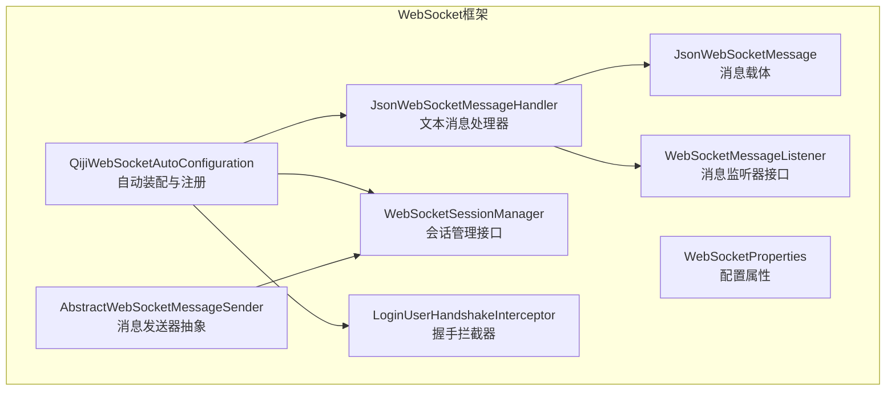
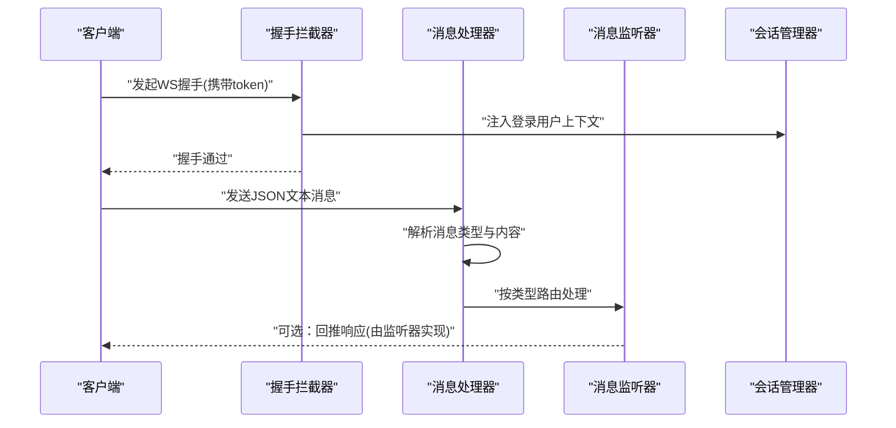
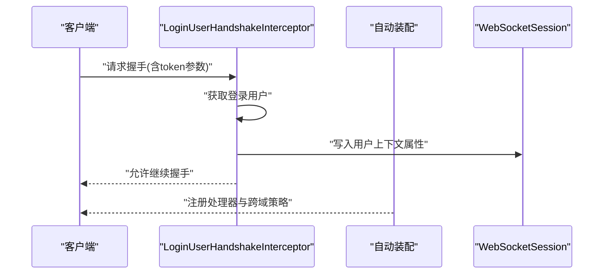
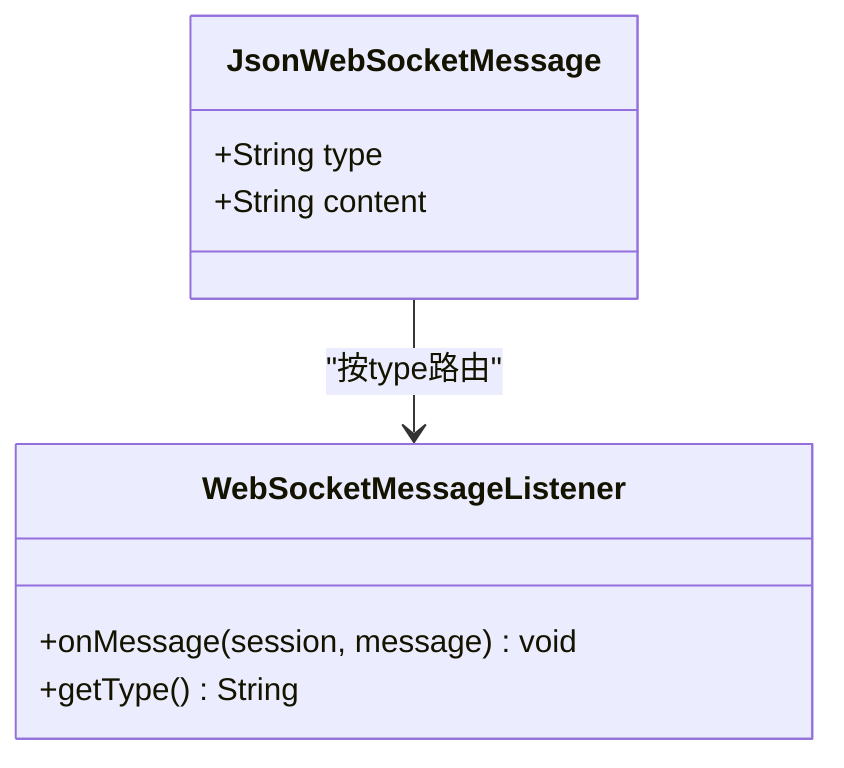
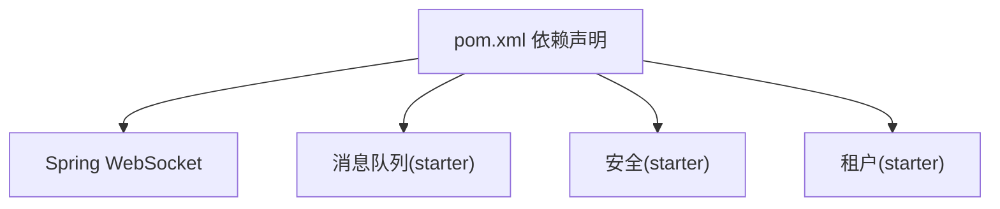

# WebSocket实时通信API

<cite>
**本文引用的文件**
- [QijiWebSocketAutoConfiguration.java](file://backend/qiji-framework/qiji-spring-boot-starter-websocket/src/main/java/com/qiji/cps/framework/websocket/config/QijiWebSocketAutoConfiguration.java)
- [WebSocketProperties.java](file://backend/qiji-framework/qiji-spring-boot-starter-websocket/src/main/java/com/qiji/cps/framework/websocket/config/WebSocketProperties.java)
- [JsonWebSocketMessageHandler.java](file://backend/qiji-framework/qiji-spring-boot-starter-websocket/src/main/java/com/qiji/cps/framework/websocket/core/handler/JsonWebSocketMessageHandler.java)
- [JsonWebSocketMessage.java](file://backend/qiji-framework/qiji-spring-boot-starter-websocket/src/main/java/com/qiji/cps/framework/websocket/core/message/JsonWebSocketMessage.java)
- [WebSocketMessageListener.java](file://backend/qiji-framework/qiji-spring-boot-starter-websocket/src/main/java/com/qiji/cps/framework/websocket/core/listener/WebSocketMessageListener.java)
- [WebSocketSessionManager.java](file://backend/qiji-framework/qiji-spring-boot-starter-websocket/src/main/java/com/qiji/cps/framework/websocket/core/session/WebSocketSessionManager.java)
- [LoginUserHandshakeInterceptor.java](file://backend/qiji-framework/qiji-spring-boot-starter-websocket/src/main/java/com/qiji/cps/framework/websocket/core/security/LoginUserHandshakeInterceptor.java)
- [AbstractWebSocketMessageSender.java](file://backend/qiji-framework/qiji-spring-boot-starter-websocket/src/main/java/com/qiji/cps/framework/websocket/core/sender/AbstractWebSocketMessageSender.java)
- [pom.xml](file://backend/qiji-framework/qiji-spring-boot-starter-websocket/pom.xml)
</cite>

## 目录
1. [简介](#简介)
2. [项目结构](#项目结构)
3. [核心组件](#核心组件)
4. [架构总览](#架构总览)
5. [详细组件分析](#详细组件分析)
6. [依赖关系分析](#依赖关系分析)
7. [性能考量](#性能考量)
8. [故障排查指南](#故障排查指南)
9. [结论](#结论)
10. [附录](#附录)

## 简介
本文件为 AgenticCPS 项目的 WebSocket 实时通信 API 提供系统化协议文档。内容覆盖连接建立流程、消息格式规范、事件类型定义、实时交互模式；并针对系统监控、文件传输、消息推送等典型场景给出连接管理与消息处理建议。同时包含心跳检测机制、断线重连策略、消息确认机制的设计思路与实现要点，以及与 RESTful API 的差异、适用场景、最佳实践与故障排查方法。

## 项目结构
WebSocket 模块位于后端框架层，采用自动装配方式集成 Spring WebSocket，并通过多种消息发送器实现跨节点广播能力。核心文件组织如下：
- 配置与自动装配：QijiWebSocketAutoConfiguration、WebSocketProperties
- 消息处理：JsonWebSocketMessageHandler、JsonWebSocketMessage
- 监听器接口：WebSocketMessageListener
- 会话管理：WebSocketSessionManager
- 安全握手：LoginUserHandshakeInterceptor
- 消息发送器抽象：AbstractWebSocketMessageSender
- 依赖声明：pom.xml



**图表来源**
- [QijiWebSocketAutoConfiguration.java:47-78](file://backend/qiji-framework/qiji-spring-boot-starter-websocket/src/main/java/com/qiji/cps/framework/websocket/config/QijiWebSocketAutoConfiguration.java#L47-L78)
- [JsonWebSocketMessageHandler.java:31-83](file://backend/qiji-framework/qiji-spring-boot-starter-websocket/src/main/java/com/qiji/cps/framework/websocket/core/handler/JsonWebSocketMessageHandler.java#L31-L83)
- [JsonWebSocketMessage.java:14-29](file://backend/qiji-framework/qiji-spring-boot-starter-websocket/src/main/java/com/qiji/cps/framework/websocket/core/message/JsonWebSocketMessage.java#L14-L29)
- [WebSocketMessageListener.java:13-31](file://backend/qiji-framework/qiji-spring-boot-starter-websocket/src/main/java/com/qiji/cps/framework/websocket/core/listener/WebSocketMessageListener.java#L13-L31)
- [WebSocketSessionManager.java:12-53](file://backend/qiji-framework/qiji-spring-boot-starter-websocket/src/main/java/com/qiji/cps/framework/websocket/core/session/WebSocketSessionManager.java#L12-L53)
- [LoginUserHandshakeInterceptor.java:24-42](file://backend/qiji-framework/qiji-spring-boot-starter-websocket/src/main/java/com/qiji/cps/framework/websocket/core/security/LoginUserHandshakeInterceptor.java#L24-L42)
- [AbstractWebSocketMessageSender.java:25-106](file://backend/qiji-framework/qiji-spring-boot-starter-websocket/src/main/java/com/qiji/cps/framework/websocket/core/sender/AbstractWebSocketMessageSender.java#L25-L106)

**章节来源**
- [QijiWebSocketAutoConfiguration.java:47-78](file://backend/qiji-framework/qiji-spring-boot-starter-websocket/src/main/java/com/qiji/cps/framework/websocket/config/QijiWebSocketAutoConfiguration.java#L47-L78)
- [pom.xml:19-71](file://backend/qiji-framework/qiji-spring-boot-starter-websocket/pom.xml#L19-L71)

## 核心组件
- 自动装配与注册：负责注册 WebSocket 处理器、握手拦截器、会话管理器及多种消息发送器（本地/Redis/RocketMQ/Kafka/RabbitMQ），并允许通过配置禁用或切换发送器类型。
- 消息处理：基于 JSON 文本消息，解析为统一消息载体，按消息类型路由至对应监听器。
- 监听器接口：定义消息类型与处理方法，便于扩展不同业务事件。
- 会话管理：提供按用户类型/用户ID/会话ID获取会话的能力，支撑定向推送与广播。
- 握手拦截：在握手阶段注入登录用户信息，确保会话具备身份上下文。
- 消息发送器：抽象统一发送入口，内部完成会话筛选与逐个发送，包含基础校验与日志记录。

**章节来源**
- [QijiWebSocketAutoConfiguration.java:49-181](file://backend/qiji-framework/qiji-spring-boot-starter-websocket/src/main/java/com/qiji/cps/framework/websocket/config/QijiWebSocketAutoConfiguration.java#L49-L181)
- [JsonWebSocketMessageHandler.java:31-83](file://backend/qiji-framework/qiji-spring-boot-starter-websocket/src/main/java/com/qiji/cps/framework/websocket/core/handler/JsonWebSocketMessageHandler.java#L31-L83)
- [WebSocketMessageListener.java:13-31](file://backend/qiji-framework/qiji-spring-boot-starter-websocket/src/main/java/com/qiji/cps/framework/websocket/core/listener/WebSocketMessageListener.java#L13-L31)
- [WebSocketSessionManager.java:12-53](file://backend/qiji-framework/qiji-spring-boot-starter-websocket/src/main/java/com/qiji/cps/framework/websocket/core/session/WebSocketSessionManager.java#L12-L53)
- [LoginUserHandshakeInterceptor.java:24-42](file://backend/qiji-framework/qiji-spring-boot-starter-websocket/src/main/java/com/qiji/cps/framework/websocket/core/security/LoginUserHandshakeInterceptor.java#L24-L42)
- [AbstractWebSocketMessageSender.java:25-106](file://backend/qiji-framework/qiji-spring-boot-starter-websocket/src/main/java/com/qiji/cps/framework/websocket/core/sender/AbstractWebSocketMessageSender.java#L25-L106)

## 架构总览
WebSocket 服务由自动装配统一注册，消息从客户端进入处理器，按类型分发到监听器；服务端可通过多种消息发送器向指定或广播会话推送消息。安全方面在握手阶段注入登录用户上下文，会话管理器支持按用户维度筛选。



**图表来源**
- [LoginUserHandshakeInterceptor.java:26-34](file://backend/qiji-framework/qiji-spring-boot-starter-websocket/src/main/java/com/qiji/cps/framework/websocket/core/security/LoginUserHandshakeInterceptor.java#L26-L34)
- [JsonWebSocketMessageHandler.java:44-81](file://backend/qiji-framework/qiji-spring-boot-starter-websocket/src/main/java/com/qiji/cps/framework/websocket/core/handler/JsonWebSocketMessageHandler.java#L44-L81)
- [WebSocketMessageListener.java:13-31](file://backend/qiji-framework/qiji-spring-boot-starter-websocket/src/main/java/com/qiji/cps/framework/websocket/core/listener/WebSocketMessageListener.java#L13-L31)

## 详细组件分析

### 连接建立与握手
- 握手拦截器在握手前从当前认证上下文中提取登录用户，并将其写入会话属性，便于后续消息处理时识别用户身份。
- 自动装配注册 WebSocket 处理器与跨域策略，允许任意源访问，简化前端接入。



**图表来源**
- [LoginUserHandshakeInterceptor.java:26-34](file://backend/qiji-framework/qiji-spring-boot-starter-websocket/src/main/java/com/qiji/cps/framework/websocket/core/security/LoginUserHandshakeInterceptor.java#L26-L34)
- [QijiWebSocketAutoConfiguration.java:49-59](file://backend/qiji-framework/qiji-spring-boot-starter-websocket/src/main/java/com/qiji/cps/framework/websocket/config/QijiWebSocketAutoConfiguration.java#L49-L59)

**章节来源**
- [LoginUserHandshakeInterceptor.java:24-42](file://backend/qiji-framework/qiji-spring-boot-starter-websocket/src/main/java/com/qiji/cps/framework/websocket/core/security/LoginUserHandshakeInterceptor.java#L24-L42)
- [QijiWebSocketAutoConfiguration.java:49-59](file://backend/qiji-framework/qiji-spring-boot-starter-websocket/src/main/java/com/qiji/cps/framework/websocket/config/QijiWebSocketAutoConfiguration.java#L49-L59)

### 消息格式与事件类型
- 消息载体为 JSON 结构，包含类型与内容两部分。处理器依据类型进行路由，类型为空或无法解析时记录错误并丢弃。
- 监听器接口定义了消息类型标识与处理方法，业务侧通过实现该接口扩展事件类型。



**图表来源**
- [JsonWebSocketMessage.java:14-29](file://backend/qiji-framework/qiji-spring-boot-starter-websocket/src/main/java/com/qiji/cps/framework/websocket/core/message/JsonWebSocketMessage.java#L14-L29)
- [WebSocketMessageListener.java:13-31](file://backend/qiji-framework/qiji-spring-boot-starter-websocket/src/main/java/com/qiji/cps/framework/websocket/core/listener/WebSocketMessageListener.java#L13-L31)

**章节来源**
- [JsonWebSocketMessageHandler.java:44-81](file://backend/qiji-framework/qiji-spring-boot-starter-websocket/src/main/java/com/qiji/cps/framework/websocket/core/handler/JsonWebSocketMessageHandler.java#L44-L81)
- [JsonWebSocketMessage.java:14-29](file://backend/qiji-framework/qiji-spring-boot-starter-websocket/src/main/java/com/qiji/cps/framework/websocket/core/message/JsonWebSocketMessage.java#L14-L29)
- [WebSocketMessageListener.java:13-31](file://backend/qiji-framework/qiji-spring-boot-starter-websocket/src/main/java/com/qiji/cps/framework/websocket/core/listener/WebSocketMessageListener.java#L13-L31)

### 心跳检测机制
- 处理器对长度为4且内容为“ping”的文本消息进行特殊处理，直接返回“pong”，作为心跳应答。
- 建议前端周期性发送“ping”并监听“pong”，超时未收到则触发断线重连。

```mermaid
flowchart TD
Start(["收到文本消息"]) --> LenCheck{"长度==4且内容==\"ping\"?"}
LenCheck --> |是| SendPong["发送\"pong\""]
LenCheck --> |否| ParseMsg["解析JSON消息"]
SendPong --> End(["结束"])
ParseMsg --> Route["按type路由监听器"]
Route --> End
```

**图表来源**
- [JsonWebSocketMessageHandler.java:50-54](file://backend/qiji-framework/qiji-spring-boot-starter-websocket/src/main/java/com/qiji/cps/framework/websocket/core/handler/JsonWebSocketMessageHandler.java#L50-L54)

**章节来源**
- [JsonWebSocketMessageHandler.java:50-54](file://backend/qiji-framework/qiji-spring-boot-starter-websocket/src/main/java/com/qiji/cps/framework/websocket/core/handler/JsonWebSocketMessageHandler.java#L50-L54)

### 断线重连策略
- 前端应在连接断开或心跳超时后，按指数退避策略重试连接；重连成功后重新订阅所需主题或房间。
- 服务端保持会话管理器中的会话列表，断线后及时移除失效会话，避免重复投递。

**章节来源**
- [WebSocketSessionManager.java:12-53](file://backend/qiji-framework/qiji-spring-boot-starter-websocket/src/main/java/com/qiji/cps/framework/websocket/core/session/WebSocketSessionManager.java#L12-L53)

### 消息确认机制
- 当前实现未内置消息确认字段。可在业务层面约定：发送方记录待确认消息ID，接收方在处理完成后回推一条带确认ID的确认消息，发送方据此标记完成。
- 或采用幂等设计：监听器对重复消息进行去重处理，结合消息ID与业务状态实现最终一致性。

**章节来源**
- [AbstractWebSocketMessageSender.java:83-104](file://backend/qiji-framework/qiji-spring-boot-starter-websocket/src/main/java/com/qiji/cps/framework/websocket/core/sender/AbstractWebSocketMessageSender.java#L83-L104)

### 不同场景的连接管理与消息处理
- 系统监控：按用户类型或用户ID定向推送监控告警；使用会话管理器筛选目标会话。
- 文件传输：按会话ID精准投递进度与结果；注意大文件分片与断点续传需在应用层实现。
- 消息推送：按用户维度广播或定向推送；结合租户隔离避免跨租户广播。

**章节来源**
- [AbstractWebSocketMessageSender.java:53-74](file://backend/qiji-framework/qiji-spring-boot-starter-websocket/src/main/java/com/qiji/cps/framework/websocket/core/sender/AbstractWebSocketMessageSender.java#L53-L74)
- [WebSocketSessionManager.java:34-52](file://backend/qiji-framework/qiji-spring-boot-starter-websocket/src/main/java/com/qiji/cps/framework/websocket/core/session/WebSocketSessionManager.java#L34-L52)

### 与RESTful API的区别、适用场景与最佳实践
- 区别：WebSocket面向长连接、双向实时通信；REST面向短连接、请求-响应模型。
- 适用场景：实时聊天、在线协作、系统监控、文件传输、游戏等。
- 最佳实践：统一消息格式与类型、实现心跳与重连、控制并发连接数、做好鉴权与限流、关注内存与GC压力。

**章节来源**
- [JsonWebSocketMessageHandler.java:44-81](file://backend/qiji-framework/qiji-spring-boot-starter-websocket/src/main/java/com/qiji/cps/framework/websocket/core/handler/JsonWebSocketMessageHandler.java#L44-L81)
- [AbstractWebSocketMessageSender.java:83-104](file://backend/qiji-framework/qiji-spring-boot-starter-websocket/src/main/java/com/qiji/cps/framework/websocket/core/sender/AbstractWebSocketMessageSender.java#L83-L104)

## 依赖关系分析
WebSocket 模块依赖 Spring WebSocket 与消息队列生态，支持本地与多 MQ 广播。自动装配中按配置启用不同发送器类型，并创建相应的消费者。



**图表来源**
- [pom.xml:19-71](file://backend/qiji-framework/qiji-spring-boot-starter-websocket/pom.xml#L19-L71)

**章节来源**
- [pom.xml:19-71](file://backend/qiji-framework/qiji-spring-boot-starter-websocket/pom.xml#L19-L71)

## 性能考量
- 连接数与内存：合理设置最大连接数与消息缓冲区大小，避免内存溢出。
- 序列化开销：统一使用高效序列化方案；避免频繁创建对象。
- 广播策略：优先使用本地广播或轻量级 MQ 广播，减少跨节点网络开销。
- 心跳频率：根据网络质量调整心跳间隔，降低带宽占用。
- GC 压力：避免在消息处理中产生大量临时对象，必要时复用对象池。

[本节为通用指导，无需列出具体文件来源]

## 故障排查指南
- 握手失败：检查是否携带 token 参数、跨域策略是否允许、拦截器是否正确注入用户上下文。
- 消息无法到达：确认消息类型是否正确、监听器是否注册、会话是否仍处于打开状态。
- 心跳异常：前端未发送“ping”或未监听“pong”，或网络延迟导致误判超时。
- 广播越权：检查租户隔离逻辑与会话筛选条件。

**章节来源**
- [LoginUserHandshakeInterceptor.java:26-34](file://backend/qiji-framework/qiji-spring-boot-starter-websocket/src/main/java/com/qiji/cps/framework/websocket/core/security/LoginUserHandshakeInterceptor.java#L26-L34)
- [JsonWebSocketMessageHandler.java:56-81](file://backend/qiji-framework/qiji-spring-boot-starter-websocket/src/main/java/com/qiji/cps/framework/websocket/core/handler/JsonWebSocketMessageHandler.java#L56-L81)
- [AbstractWebSocketMessageSender.java:83-104](file://backend/qiji-framework/qiji-spring-boot-starter-websocket/src/main/java/com/qiji/cps/framework/websocket/core/sender/AbstractWebSocketMessageSender.java#L83-L104)

## 结论
本 WebSocket 实时通信 API 提供了清晰的连接建立流程、统一的消息格式与类型路由、完善的会话管理与安全握手机制，并支持多种消息发送器以满足不同广播需求。通过心跳与重连策略、并发连接限制与性能优化建议，可构建稳定高效的实时通信能力。建议在实际业务中结合自身场景完善消息确认、幂等与限流等机制。

[本节为总结性内容，无需列出具体文件来源]

## 附录

### 配置项与默认值
- 连接路径：默认 “/ws”
- 消息发送器类型：默认 “local”

**章节来源**
- [WebSocketProperties.java:20-32](file://backend/qiji-framework/qiji-spring-boot-starter-websocket/src/main/java/com/qiji/cps/framework/websocket/config/WebSocketProperties.java#L20-L32)

### 前端连接与消息收发示例（步骤说明）
- 连接：使用 ws://host:port/ws?token=xxx 建立连接，确保跨域允许。
- 心跳：周期性发送“ping”，监听“pong”。
- 发送：构造包含 type 与 content 的 JSON 对象，发送至服务器。
- 接收：监听服务器推送的 JSON 消息，按 type 分发处理。
- 错误处理：捕获连接异常与消息解析异常，执行断线重连。
- 状态监听：监听连接 open/close/error 事件，更新 UI 状态。

**章节来源**
- [QijiWebSocketAutoConfiguration.java:53-58](file://backend/qiji-framework/qiji-spring-boot-starter-websocket/src/main/java/com/qiji/cps/framework/websocket/config/QijiWebSocketAutoConfiguration.java#L53-L58)
- [JsonWebSocketMessageHandler.java:50-54](file://backend/qiji-framework/qiji-spring-boot-starter-websocket/src/main/java/com/qiji/cps/framework/websocket/core/handler/JsonWebSocketMessageHandler.java#L50-L54)
- [JsonWebSocketMessageHandler.java:56-81](file://backend/qiji-framework/qiji-spring-boot-starter-websocket/src/main/java/com/qiji/cps/framework/websocket/core/handler/JsonWebSocketMessageHandler.java#L56-L81)