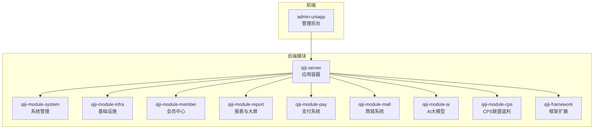
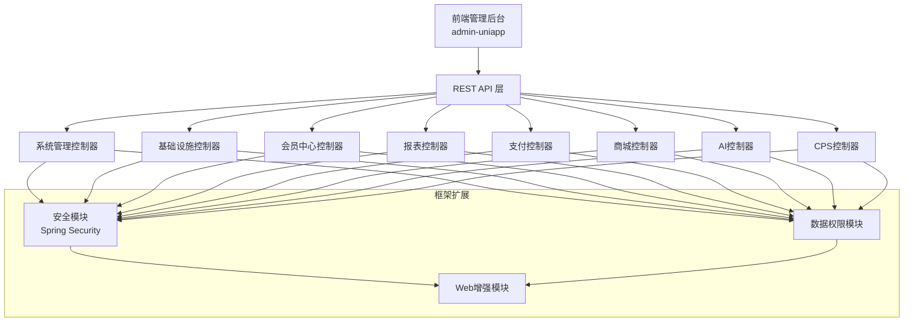
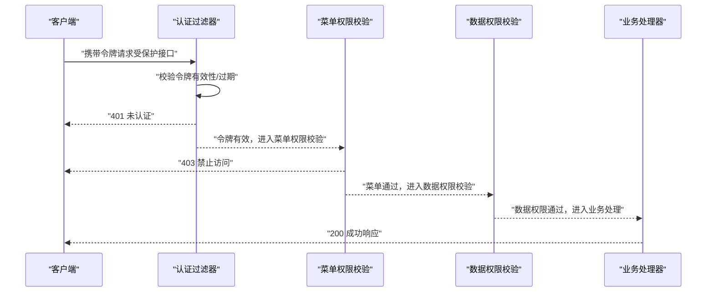
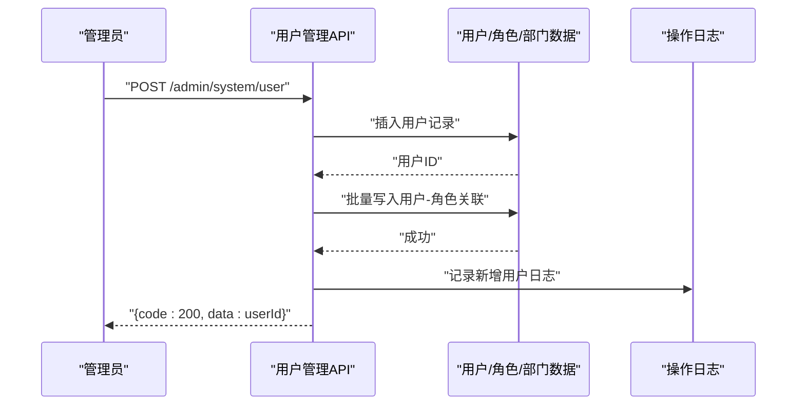
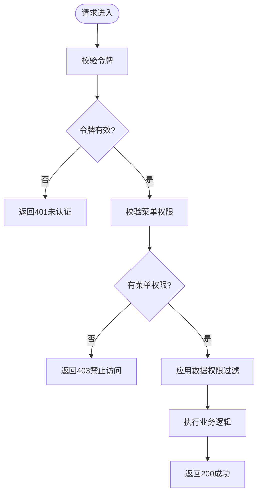
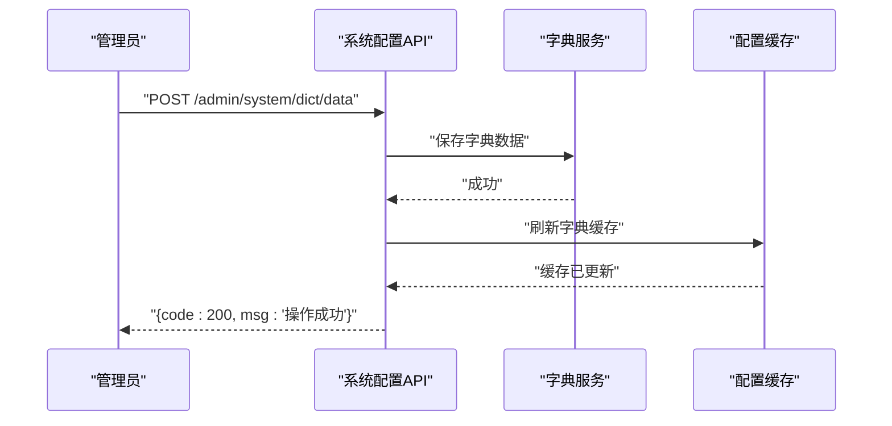
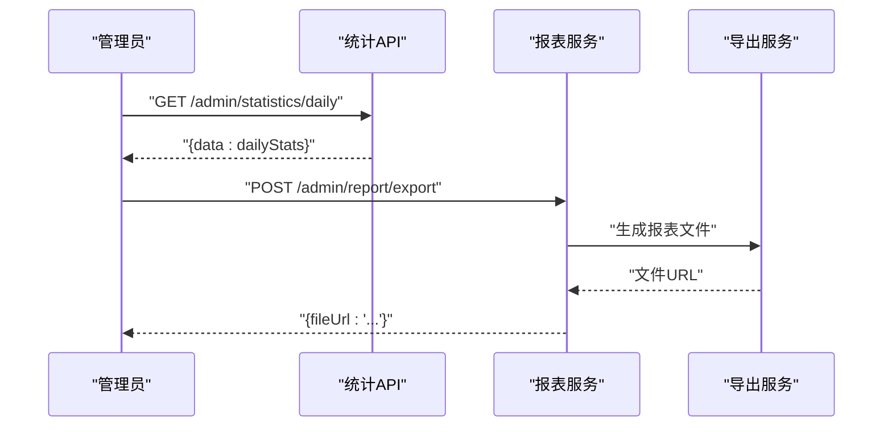
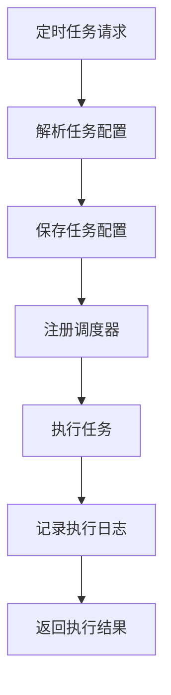
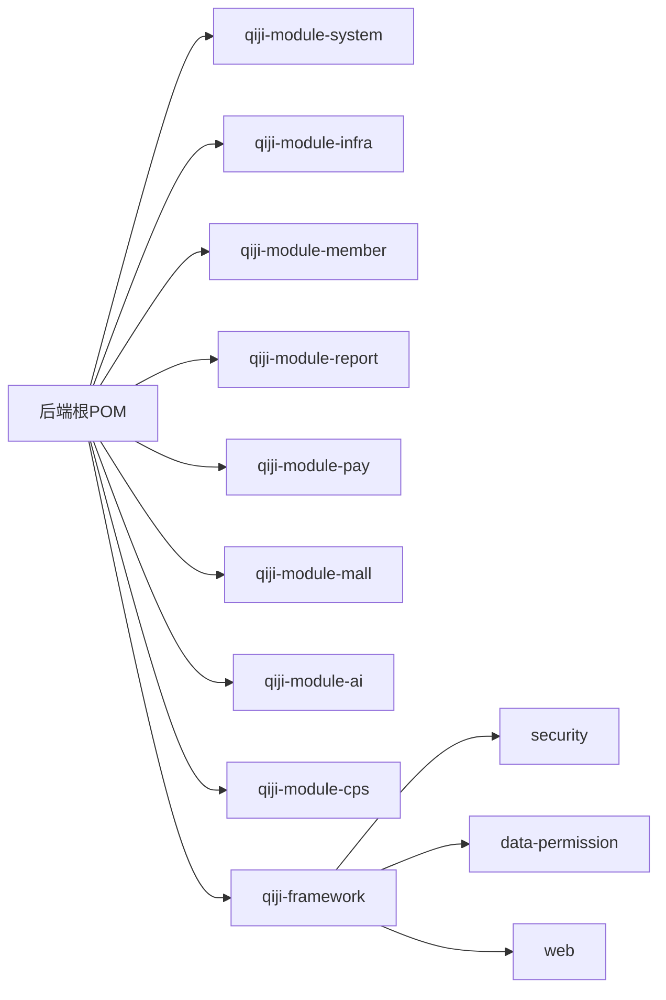

# 管理后台API

<cite>
**本文引用的文件**
- [后端根POM](file://backend/pom.xml)
- [项目说明](file://backend/README.md)
- [qiji-module-system 模块POM](file://backend/qiji-module-system/pom.xml)
- [qiji-module-system 模块源码入口](file://backend/qiji-module-system/src/main/java/com/qiji/cps/module/system)
- [qiji-module-infra 模块POM](file://backend/qiji-module-infra/pom.xml)
- [qiji-module-infra 模块源码入口](file://backend/qiji-module-infra/src/main/java/com/qiji/cps/module/infra)
- [qiji-module-member 模块POM](file://backend/qiji-module-member/pom.xml)
- [qiji-module-member 模块源码入口](file://backend/qiji-module-member/src/main/java/com/qiji/cps/module/member)
- [qiji-module-report 模块POM](file://backend/qiji-module-report/pom.xml)
- [qiji-module-report 模块源码入口](file://backend/qiji-module-report/src/main/java/com/qiji/cps/module/report)
- [qiji-module-mp 模块POM](file://backend/qiji-module-mp/pom.xml)
- [qiji-module-mp 模块源码入口](file://backend/qiji-module-mp/src/main/java/com/qiji/cps/module/mp)
- [qiji-module-pay 模块POM](file://backend/qiji-module-pay/pom.xml)
- [qiji-module-pay 模块源码入口](file://backend/qiji-module-pay/src/main/java/com/qiji/cps/module/pay)
- [qiji-module-mall 模块POM](file://backend/qiji-module-mall/pom.xml)
- [qiji-module-mall 模块源码入口](file://backend/qiji-module-mall/src/main/java/com/qiji/cps/module/mall)
- [qiji-module-ai 模块POM](file://backend/qiji-module-ai/pom.xml)
- [qiji-module-ai 模块源码入口](file://backend/qiji-module-ai/src/main/java/com/qiji/cps/module/ai)
- [qiji-module-cps 模块POM](file://backend/qiji-module-cps/pom.xml)
- [qiji-module-cps 模块源码入口](file://backend/qiji-module-cps/src/main/java/com/qiji/cps/module/cps)
- [qiji-framework 安全模块POM](file://backend/qiji-framework/qiji-spring-boot-starter-security/pom.xml)
- [qiji-framework 安全模块源码入口](file://backend/qiji-framework/qiji-spring-boot-starter-security/src/main/java/com/qiji/cps/framework/security)
- [qiji-framework 数据权限模块POM](file://backend/qiji-framework/qiji-spring-boot-starter-biz-data-permission/pom.xml)
- [qiji-framework 数据权限模块源码入口](file://backend/qiji-framework/qiji-spring-boot-starter-biz-data-permission/src/main/java/com/qiji/cps/framework/datapermission)
- [qiji-framework Web模块POM](file://backend/qiji-framework/qiji-spring-boot-starter-web/pom.xml)
- [qiji-framework Web模块源码入口](file://backend/qiji-framework/qiji-spring-boot-starter-web/src/main/java/com/qiji/cps/framework/web)
- [qiji-server 模块POM](file://backend/qiji-server/pom.xml)
- [qiji-server 源码入口](file://backend/qiji-server/src/main/java/com/qiji/cps/server)
- [前端系统管理页面](file://frontend/admin-uniapp/src/pages-system)
- [前端基础设施页面](file://frontend/admin-uniapp/src/pages-infra)
- [前端会员中心页面](file://frontend/admin-uniapp/src/pages-member)
- [前端报表页面](file://frontend/admin-uniapp/src/pages-report)
- [前端支付页面](file://frontend/admin-uniapp/src/pages-pay)
- [前端商城页面](file://frontend/admin-uniapp/src/pages-mall)
- [前端AI页面](file://frontend/admin-uniapp/src/pages-ai)
- [前端CPS页面](file://frontend/admin-uniapp/src/pages-cps)
</cite>

## 目录
1. [简介](#简介)
2. [项目结构](#项目结构)
3. [核心组件](#核心组件)
4. [架构总览](#架构总览)
5. [详细组件分析](#详细组件分析)
6. [依赖关系分析](#依赖关系分析)
7. [性能考虑](#性能考虑)
8. [故障排除指南](#故障排除指南)
9. [结论](#结论)
10. [附录](#附录)

## 简介
本文件为管理后台API的详细RESTful接口文档，覆盖用户管理、权限控制、系统配置、数据统计等核心功能域。文档基于仓库中的模块化架构与框架扩展，结合前端页面与后端模块映射，提供接口定义、参数说明、响应格式、状态码、认证授权机制、权限验证流程、数据过滤规则、分页查询规范，并包含调用示例、错误处理示例、批量操作示例与数据导出示例。

## 项目结构
AgenticCPS采用多模块Maven工程组织，后端以Spring Boot为基础，系统管理、基础设施、会员中心、报表、支付、商城、AI、CPS等模块分别独立管理；前端采用Vue3/UniApp实现管理后台界面。系统通过qiji-framework提供安全、缓存、权限、多租户、数据权限等通用能力。

**图表来源**
- [后端根POM:10-25](file://backend/pom.xml#L10-L25)
- [qiji-server 模块POM](file://backend/qiji-server/pom.xml)
- [qiji-module-system 模块POM](file://backend/qiji-module-system/pom.xml)
- [qiji-module-infra 模块POM](file://backend/qiji-module-infra/pom.xml)
- [qiji-module-member 模块POM](file://backend/qiji-module-member/pom.xml)
- [qiji-module-report 模块POM](file://backend/qiji-module-report/pom.xml)
- [qiji-module-pay 模块POM](file://backend/qiji-module-pay/pom.xml)
- [qiji-module-mall 模块POM](file://backend/qiji-module-mall/pom.xml)
- [qiji-module-ai 模块POM](file://backend/qiji-module-ai/pom.xml)
- [qiji-module-cps 模块POM](file://backend/qiji-module-cps/pom.xml)

**章节来源**
- [后端根POM:10-25](file://backend/pom.xml#L10-L25)
- [项目说明:261-296](file://backend/README.md#L261-L296)

## 核心组件
- 系统管理模块：提供用户、角色、菜单、部门、字典、日志等管理接口，支撑权限控制与系统配置。
- 基础设施模块：提供定时任务、文件服务、消息队列、监控等运维能力。
- 会员中心模块：提供会员管理、等级体系、积分签到、标签分组等会员相关接口。
- 报表与大屏模块：提供数据报表设计器、图形报表、大屏设计器、打印设计器等可视化能力。
- 支付系统模块：提供支付宝/微信支付、退款、钱包、转账等支付相关接口。
- 商城系统模块：提供商品、促销、订单、售后等电商相关接口。
- AI大模型模块：提供聊天、图像生成、知识库、工作流等AI能力。
- CPS联盟返利模块：提供多平台CPS接入、商品搜索、订单追踪、返利结算等核心业务接口。
- 框架扩展：提供安全、缓存、权限、多租户、数据权限、Web增强、Excel导出、作业调度、监控、消息队列等通用能力。

**章节来源**
- [项目说明:245-258](file://backend/README.md#L245-L258)
- [qiji-module-system 模块POM](file://backend/qiji-module-system/pom.xml)
- [qiji-module-infra 模块POM](file://backend/qiji-module-infra/pom.xml)
- [qiji-module-member 模块POM](file://backend/qiji-module-member/pom.xml)
- [qiji-module-report 模块POM](file://backend/qiji-module-report/pom.xml)
- [qiji-module-pay 模块POM](file://backend/qiji-module-pay/pom.xml)
- [qiji-module-mall 模块POM](file://backend/qiji-module-mall/pom.xml)
- [qiji-module-ai 模块POM](file://backend/qiji-module-ai/pom.xml)
- [qiji-module-cps 模块POM](file://backend/qiji-module-cps/pom.xml)

## 架构总览
管理后台API采用分层架构：前端通过HTTP请求调用后端REST接口，后端模块化拆分，通过框架扩展提供统一的安全、权限、数据过滤、分页查询等能力。认证采用Spring Security，权限控制基于菜单/按钮/数据权限，数据权限通过数据权限注解与拦截器实现。

**图表来源**
- [qiji-framework 安全模块源码入口](file://backend/qiji-framework/qiji-spring-boot-starter-security/src/main/java/com/qiji/cps/framework/security)
- [qiji-framework 数据权限模块源码入口](file://backend/qiji-framework/qiji-spring-boot-starter-biz-data-permission/src/main/java/com/qiji/cps/framework/datapermission)
- [qiji-framework Web模块源码入口](file://backend/qiji-framework/qiji-spring-boot-starter-web/src/main/java/com/qiji/cps/framework/web)
- [前端系统管理页面](file://frontend/admin-uniapp/src/pages-system)
- [前端基础设施页面](file://frontend/admin-uniapp/src/pages-infra)
- [前端会员中心页面](file://frontend/admin-uniapp/src/pages-member)
- [前端报表页面](file://frontend/admin-uniapp/src/pages-report)
- [前端支付页面](file://frontend/admin-uniapp/src/pages-pay)
- [前端商城页面](file://frontend/admin-uniapp/src/pages-mall)
- [前端AI页面](file://frontend/admin-uniapp/src/pages-ai)
- [前端CPS页面](file://frontend/admin-uniapp/src/pages-cps)

## 详细组件分析

### 认证与授权机制
- 认证：基于Spring Security，支持JWT令牌认证与会话认证，前端在登录成功后获取令牌并存储于本地，后续请求携带令牌访问受保护接口。
- 授权：基于菜单权限、按钮权限与数据权限三层控制。菜单权限控制页面/接口可见性；按钮权限控制操作按钮可用性；数据权限控制数据范围（如部门/租户/自定义维度）。
- 权限验证流程：请求进入后经Security过滤器，校验令牌有效性与过期；随后根据请求路径匹配菜单权限；最后执行数据权限过滤与业务权限校验。

**图表来源**
- [qiji-framework 安全模块源码入口](file://backend/qiji-framework/qiji-spring-boot-starter-security/src/main/java/com/qiji/cps/framework/security)
- [qiji-framework 数据权限模块源码入口](file://backend/qiji-framework/qiji-spring-boot-starter-biz-data-permission/src/main/java/com/qiji/cps/framework/datapermission)

**章节来源**
- [项目说明:284-296](file://backend/README.md#L284-L296)
- [qiji-framework 安全模块POM](file://backend/qiji-framework/qiji-spring-boot-starter-security/pom.xml)
- [qiji-framework 数据权限模块POM](file://backend/qiji-framework/qiji-spring-boot-starter-biz-data-permission/pom.xml)

### 用户管理接口
- 用户增删改查、角色分配、权限设置
- 请求方法与路径：GET/POST/PUT/DELETE /admin/system/user/*
- 请求参数：用户名、昵称、邮箱、手机号、部门ID、角色ID数组、状态、备注等
- 响应结构：分页结果包含用户列表、总条数；单个用户详情包含基本信息、角色列表、部门信息
- 状态码：200 成功、400 参数错误、401 未认证、403 禁止访问、500 服务器错误
- 示例：新增用户、批量删除、重置密码、分配角色、导出用户列表

**图表来源**
- [qiji-module-system 模块源码入口](file://backend/qiji-module-system/src/main/java/com/qiji/cps/module/system)
- [前端系统管理页面](file://frontend/admin-uniapp/src/pages-system/user)

**章节来源**
- [qiji-module-system 模块POM](file://backend/qiji-module-system/pom.xml)
- [前端系统管理页面](file://frontend/admin-uniapp/src/pages-system/user)

### 权限控制接口
- 菜单权限：菜单/按钮/页面可见性控制
- 按钮权限：操作按钮可用性控制
- 数据权限：部门/租户/自定义维度的数据范围过滤
- 请求方法与路径：GET/POST/PUT/DELETE /admin/system/menu/*、/admin/system/role/*
- 请求参数：菜单名称、类型、路径、权限标识、数据权限规则等
- 响应结构：菜单树结构、角色详情（含菜单/权限集合）
- 状态码：200 成功、400 参数错误、401 未认证、403 禁止访问、500 服务器错误
- 示例：新增菜单、更新权限标识、设置数据权限规则、导出权限配置

**图表来源**
- [qiji-framework 安全模块源码入口](file://backend/qiji-framework/qiji-spring-boot-starter-security/src/main/java/com/qiji/cps/framework/security)
- [qiji-framework 数据权限模块源码入口](file://backend/qiji-framework/qiji-spring-boot-starter-biz-data-permission/src/main/java/com/qiji/cps/framework/datapermission)

**章节来源**
- [qiji-module-system 模块POM](file://backend/qiji-module-system/pom.xml)
- [前端系统管理页面](file://frontend/admin-uniapp/src/pages-system/menu)
- [前端系统管理页面](file://frontend/admin-uniapp/src/pages-system/role)

### 系统配置接口
- 参数配置：系统参数增删改查、批量更新
- 字典管理：字典类型与字典数据的增删改查、导入导出
- 配置管理：租户配置、应用配置等
- 请求方法与路径：GET/POST/PUT/DELETE /admin/system/config/*、/admin/system/dict/*
- 请求参数：参数键值、参数名称、参数类型、字典类型、字典标签、字典键值等
- 响应结构：参数列表、字典类型列表、字典数据列表
- 状态码：200 成功、400 参数错误、401 未认证、403 禁止访问、500 服务器错误
- 示例：新增参数、批量更新字典、导出字典数据

**图表来源**
- [qiji-module-system 模块源码入口](file://backend/qiji-module-system/src/main/java/com/qiji/cps/module/system)
- [前端系统管理页面](file://frontend/admin-uniapp/src/pages-system/dict)

**章节来源**
- [qiji-module-system 模块POM](file://backend/qiji-module-system/pom.xml)
- [前端系统管理页面](file://frontend/admin-uniapp/src/pages-system/config)
- [前端系统管理页面](file://frontend/admin-uniapp/src/pages-system/dict)

### 数据统计接口
- 运营数据：订单、佣金、返利、利润等实时统计
- 业务指标：转化率、客单价、复购率等关键指标
- 报表数据：支持导出Excel、PDF等格式
- 请求方法与路径：GET /admin/statistics/*、/admin/report/*
- 请求参数：统计维度（时间区间、平台、商品类目）、筛选条件、导出格式
- 响应结构：指标数值、趋势图表数据、明细列表
- 状态码：200 成功、400 参数错误、401 未认证、403 禁止访问、500 服务器错误
- 示例：导出运营日报、生成销售趋势图、批量导出报表

**图表来源**
- [qiji-module-report 模块源码入口](file://backend/qiji-module-report/src/main/java/com/qiji/cps/module/report)
- [qiji-module-statistics 模块源码入口](file://backend/qiji-module-statistics/src/main/java/com/qiji/cps/module/statistics)

**章节来源**
- [qiji-module-report 模块POM](file://backend/qiji-module-report/pom.xml)
- [qiji-module-statistics 模块POM](file://backend/qiji-module-statistics/pom.xml)
- [前端报表页面](file://frontend/admin-uniapp/src/pages-report)

### 基础设施接口
- 定时任务：任务增删改查、执行、暂停/恢复、批量操作
- 文件服务：文件上传、下载、删除、分页列表
- 消息队列：消息发送、消费、死信处理
- 监控：JVM监控、链路追踪、日志中心
- 请求方法与路径：GET/POST/PUT/DELETE /admin/infra/job/*、/admin/infra/file/*、/admin/monitor/*
- 请求参数：任务名称、表达式、状态、文件元数据、查询条件等
- 响应结构：任务列表、文件列表、监控指标
- 状态码：200 成功、400 参数错误、401 未认证、403 禁止访问、500 服务器错误
- 示例：新增定时任务、批量删除文件、导出监控日志

**图表来源**
- [qiji-module-infra 模块源码入口](file://backend/qiji-module-infra/src/main/java/com/qiji/cps/module/infra)
- [qiji-framework 作业调度模块POM](file://backend/qiji-framework/qiji-spring-boot-starter-job/pom.xml)

**章节来源**
- [qiji-module-infra 模块POM](file://backend/qiji-module-infra/pom.xml)
- [前端基础设施页面](file://frontend/admin-uniapp/src/pages-infra/job)
- [前端基础设施页面](file://frontend/admin-uniapp/src/pages-infra/file)

### 会员中心接口
- 会员管理：会员增删改查、等级体系、积分签到、标签分组
- 请求方法与路径：GET/POST/PUT/DELETE /admin/member/*
- 请求参数：会员姓名、手机号、等级ID、标签数组、积分变动等
- 响应结构：会员列表、会员详情、等级与标签枚举
- 状态码：200 成功、400 参数错误、401 未认证、403 禁止访问、500 服务器错误
- 示例：批量导入会员、导出会员数据、设置会员等级

**章节来源**
- [qiji-module-member 模块POM](file://backend/qiji-module-member/pom.xml)
- [前端会员中心页面](file://frontend/admin-uniapp/src/pages-member)

### 支付系统接口
- 支付管理：支付订单、退款、钱包、转账
- 请求方法与路径：GET/POST/PUT/DELETE /admin/pay/*
- 请求参数：商户订单号、支付渠道、金额、退款原因、转账对象等
- 响应结构：支付订单列表、退款记录、钱包流水
- 状态码：200 成功、400 参数错误、401 未认证、403 禁止访问、500 服务器错误
- 示例：批量退款、导出支付流水、转账记录查询

**章节来源**
- [qiji-module-pay 模块POM](file://backend/qiji-module-pay/pom.xml)
- [前端支付页面](file://frontend/admin-uniapp/src/pages-pay)

### 商城系统接口
- 商品管理：商品增删改查、分类、品牌
- 促销管理：优惠券、满减、限时折扣
- 订单管理：订单查询、发货、售后
- 请求方法与路径：GET/POST/PUT/DELETE /admin/mall/*
- 请求参数：商品名称、分类ID、促销规则、订单状态等
- 响应结构：商品列表、促销活动、订单详情
- 状态码：200 成功、400 参数错误、401 未认证、403 禁止访问、500 服务器错误
- 示例：批量上架商品、导出订单报表、处理售后申请

**章节来源**
- [qiji-module-mall 模块POM](file://backend/qiji-module-mall/pom.xml)
- [前端商城页面](file://frontend/admin-uniapp/src/pages-mall)

### AI大模型接口
- 聊天：文本对话、历史记录
- 图像生成：提示词、风格、尺寸
- 知识库：文档上传、问答、检索
- 工作流：流程编排、节点执行
- 请求方法与路径：GET/POST/PUT/DELETE /admin/ai/*
- 请求参数：提示词、模型参数、知识库ID、流程定义等
- 响应结构：对话结果、生成图片、知识库条目、流程实例
- 状态码：200 成功、400 参数错误、401 未认证、403 禁止访问、500 服务器错误
- 示例：生成营销文案、上传知识库文档、导出对话历史

**章节来源**
- [qiji-module-ai 模块POM](file://backend/qiji-module-ai/pom.xml)
- [前端AI页面](file://frontend/admin-uniapp/src/pages-ai)

### CPS联盟返利接口
- 平台接入：淘宝/京东/拼多多/抖音联盟
- 商品搜索：关键词搜索、链接解析、跨平台比价
- 订单追踪：查询、转链、下单、结算、入账
- 提现管理：支付宝/微信提现，审核流程
- MCP工具：AI Agent直连工具
- 请求方法与路径：GET/POST/PUT/DELETE /admin/cps/*
- 请求参数：平台编码、商品关键词、订单号、提现金额、Agent工具参数等
- 响应结构：商品列表、订单详情、返利汇总、提现记录
- 状态码：200 成功、400 参数错误、401 未认证、403 禁止访问、500 服务器错误
- 示例：批量同步订单、导出返利报表、调用MCP工具

**章节来源**
- [qiji-module-cps 模块POM](file://backend/qiji-module-cps/pom.xml)
- [前端CPS页面](file://frontend/admin-uniapp/src/pages-cps)

## 依赖关系分析
后端模块间通过Maven聚合管理，qiji-server作为应用容器聚合各业务模块；框架扩展模块为业务模块提供通用能力。前端通过HTTP与后端交互，页面与控制器形成一一对应关系。

**图表来源**
- [后端根POM:10-25](file://backend/pom.xml#L10-L25)
- [qiji-framework 安全模块POM](file://backend/qiji-framework/qiji-spring-boot-starter-security/pom.xml)
- [qiji-framework 数据权限模块POM](file://backend/qiji-framework/qiji-spring-boot-starter-biz-data-permission/pom.xml)
- [qiji-framework Web模块POM](file://backend/qiji-framework/qiji-spring-boot-starter-web/pom.xml)

**章节来源**
- [后端根POM:10-25](file://backend/pom.xml#L10-L25)

## 性能考虑
- 分页查询：默认每页大小限制，避免一次性返回大量数据；支持排序与筛选条件组合。
- 缓存策略：热点数据使用Redis缓存，配置变更与字典数据定期刷新。
- 并发控制：接口幂等设计，防止重复提交；批量操作采用异步处理与进度反馈。
- 监控与追踪：集成SkyWalking链路追踪与Actuator监控端点，便于定位性能瓶颈。
- 导出优化：大数据量导出采用分批写入与流式输出，避免内存溢出。

## 故障排除指南
- 认证失败：检查令牌是否正确携带、是否过期、是否被吊销。
- 权限不足：确认菜单权限与数据权限规则是否正确配置，是否存在部门/租户范围限制。
- 参数错误：核对必填字段、数据类型与长度限制，参考接口文档的参数定义。
- 导出失败：检查文件存储路径权限、磁盘空间、导出模板是否存在。
- 性能问题：启用慢查询日志，分析SQL执行计划，必要时添加索引或优化查询条件。

## 结论
本管理后台API基于模块化架构与框架扩展，提供了完善的用户管理、权限控制、系统配置、数据统计等功能域接口。通过统一的认证授权机制与数据权限过滤，确保系统安全性与数据隔离。配合前端页面与后端模块映射，能够满足管理后台的日常运维与业务管理需求。

## 附录
- 客户端集成指南：前端采用Vue3/UniApp，通过Axios封装HTTP请求，统一处理令牌与错误；建议使用拦截器统一注入令牌与处理401/403。
- 版本兼容性：后端基于Spring Boot 3.5.9，Java 17/21，前端Node.js 16+；数据库支持MySQL 5.7/8.0+。
- 接口安全：启用HTTPS、参数校验、防重放攻击、敏感信息脱敏、日志审计。