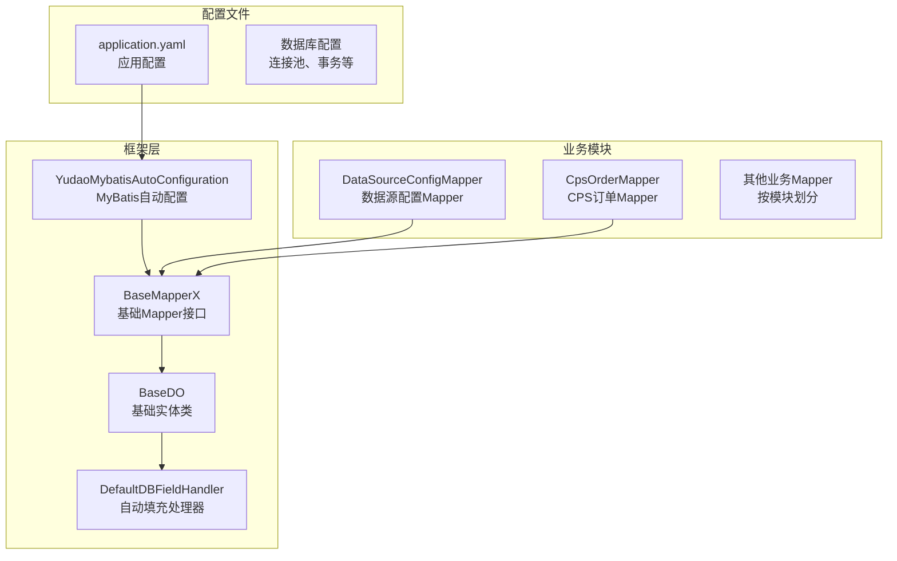
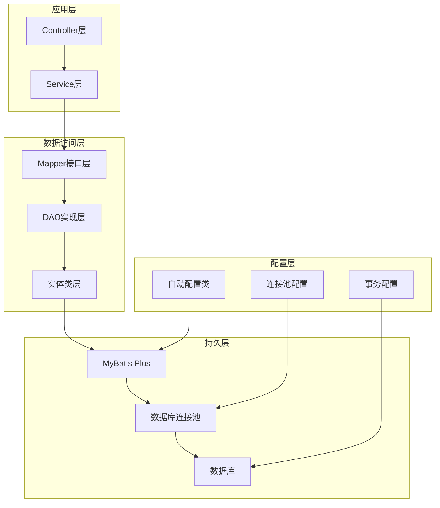
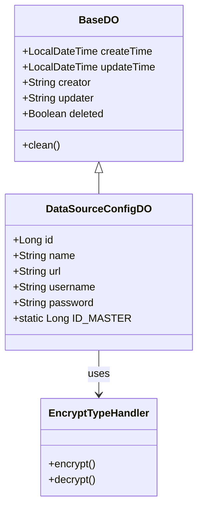
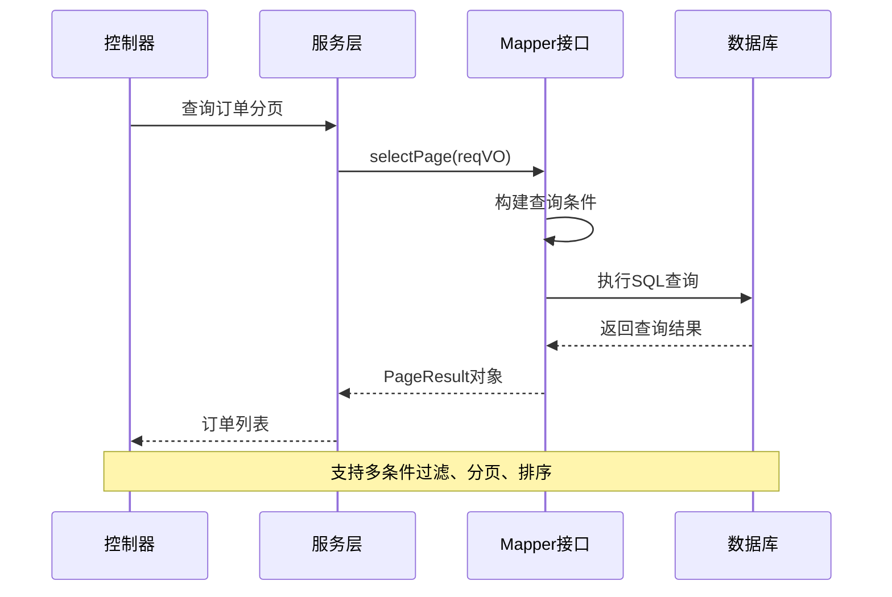
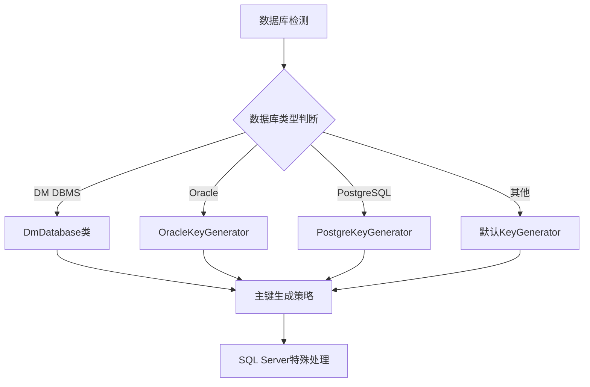
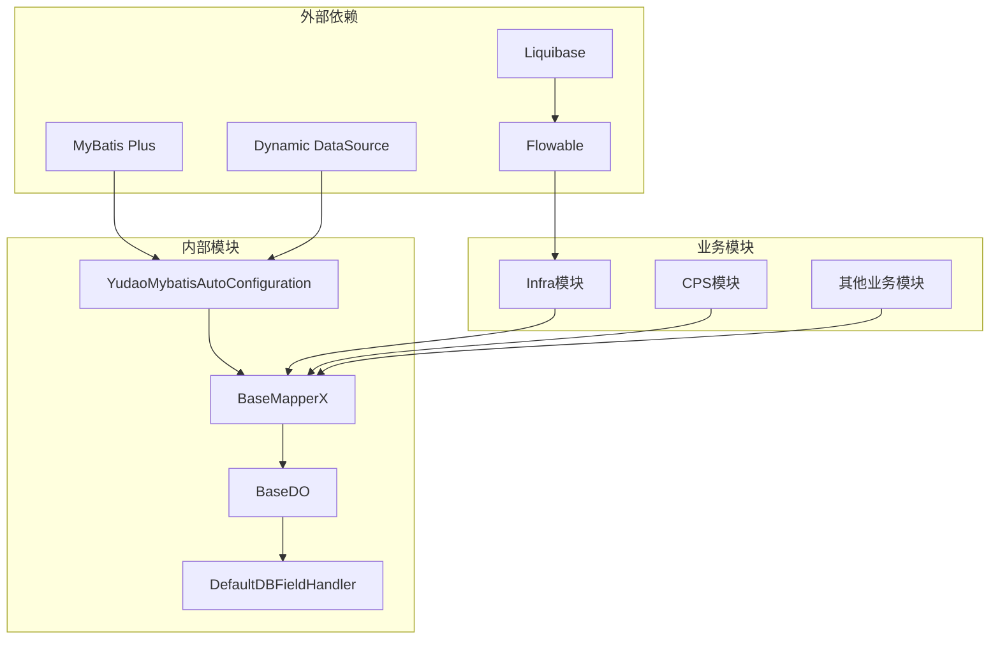

# 数据库访问层

<cite>
**本文档引用的文件**
- [YudaoMybatisAutoConfiguration.java](file://backend/yudao-framework/yudao-spring-boot-starter-mybatis/src/main/java/cn/iocoder/yudao/framework/mybatis/config/YudaoMybatisAutoConfiguration.java)
- [BaseMapperX.java](file://backend/yudao-framework/yudao-spring-boot-starter-mybatis/src/main/java/cn/iocoder/yudao/framework/mybatis/core/mapper/BaseMapperX.java)
- [BaseDO.java](file://backend/yudao-framework/yudao-spring-boot-starter-mybatis/src/main/java/cn/iocoder/yudao/framework/mybatis/core/dataobject/BaseDO.java)
- [DefaultDBFieldHandler.java](file://backend/yudao-framework/yudao-spring-boot-starter-mybatis/src/main/java/cn/iocoder/yudao/framework/mybatis/core/handler/DefaultDBFieldHandler.java)
- [application.yaml](file://backend/yudao-server/src/main/resources/application.yaml)
- [DataSourceConfigMapper.java](file://backend/yudao-module-infra/src/main/java/cn/iocoder/yudao/module/infra/dal/mysql/db/DataSourceConfigMapper.java)
- [DataSourceConfigDO.java](file://backend/yudao-module-infra/src/main/java/cn/iocoder/yudao/module/infra/dal/dataobject/db/DataSourceConfigDO.java)
- [CpsOrderMapper.java](file://backend/yudao-module-cps/yudao-module-cps-biz/src/main/java/cn/iocoder/yudao/module/cps/dal/mysql/order/CpsOrderMapper.java)
- [DmDatabase.java](file://backend/sql/dm/flowable-patch/src/main/java/liquibase/database/core/DmDatabase.java)
- [AbstractEngineConfiguration.java](file://backend/sql/dm/flowable-patch/src/main/java/org/flowable/common/engine/impl/AbstractEngineConfiguration.java)
</cite>

## 目录
1. [简介](#简介)
2. [项目结构](#项目结构)
3. [核心组件](#核心组件)
4. [架构概览](#架构概览)
5. [详细组件分析](#详细组件分析)
6. [依赖分析](#依赖分析)
7. [性能考虑](#性能考虑)
8. [故障排除指南](#故障排除指南)
9. [结论](#结论)

## 简介

AgenticCPS项目采用基于MyBatis Plus的数据库访问层架构，通过统一的基础设施模块提供标准化的数据访问能力。该数据库访问层实现了以下关键特性：

- **统一的CRUD操作**：基于BaseMapperX接口提供丰富的数据访问方法
- **智能分页查询**：支持多种分页参数和排序方式
- **多数据源支持**：通过动态数据源实现读写分离和多数据源管理
- **逻辑删除**：内置逻辑删除支持，确保数据安全
- **自动填充**：统一的创建和更新时间、操作员信息填充
- **多数据库兼容**：支持MySQL、Oracle、PostgreSQL等多种数据库

## 项目结构

数据库访问层主要分布在以下模块中：

**图表来源**
- [YudaoMybatisAutoConfiguration.java:1-96](file://backend/yudao-framework/yudao-spring-boot-starter-mybatis/src/main/java/cn/iocoder/yudao/framework/mybatis/config/YudaoMybatisAutoConfiguration.java#L1-L96)
- [BaseMapperX.java:1-250](file://backend/yudao-framework/yudao-spring-boot-starter-mybatis/src/main/java/cn/iocoder/yudao/framework/mybatis/core/mapper/BaseMapperX.java#L1-L250)

**章节来源**
- [YudaoMybatisAutoConfiguration.java:1-96](file://backend/yudao-framework/yudao-spring-boot-starter-mybatis/src/main/java/cn/iocoder/yudao/framework/mybatis/config/YudaoMybatisAutoConfiguration.java#L1-L96)
- [application.yaml:66-82](file://backend/yudao-server/src/main/resources/application.yaml#L66-L82)

## 核心组件

### MyBatis自动配置

YudaoMybatisAutoConfiguration类负责整个数据库访问层的初始化配置：

- **Mapper扫描**：自动扫描指定包下的所有Mapper接口
- **分页插件**：集成MyBatis Plus分页插件
- **KeyGenerator**：根据不同数据库类型选择合适的主键生成策略
- **JacksonTypeHandler**：自定义JSON类型处理器

### 基础Mapper接口

BaseMapperX接口扩展了MyBatis Plus的基础功能：

- **分页查询**：支持多种分页参数和排序方式
- **批量操作**：提供批量插入、更新、删除方法
- **条件查询**：支持多种查询条件组合
- **Join查询**：集成MyBatis Plus Join支持复杂关联查询

### 基础实体类

BaseDO类定义了所有实体的通用字段：

- **时间字段**：创建时间、更新时间自动管理
- **操作员字段**：创建者、更新者信息自动填充
- **逻辑删除**：deleted字段支持软删除
- **序列化控制**：避免不必要的序列化字段

**章节来源**
- [BaseMapperX.java:26-250](file://backend/yudao-framework/yudao-spring-boot-starter-mybatis/src/main/java/cn/iocoder/yudao/framework/mybatis/core/mapper/BaseMapperX.java#L26-L250)
- [BaseDO.java:14-67](file://backend/yudao-framework/yudao-spring-boot-starter-mybatis/src/main/java/cn/iocoder/yudao/framework/mybatis/core/dataobject/BaseDO.java#L14-L67)

## 架构概览

数据库访问层的整体架构设计如下：

**图表来源**
- [YudaoMybatisAutoConfiguration.java:34-95](file://backend/yudao-framework/yudao-spring-boot-starter-mybatis/src/main/java/cn/iocoder/yudao/framework/mybatis/config/YudaoMybatisAutoConfiguration.java#L34-L95)
- [application.yaml:66-82](file://backend/yudao-server/src/main/resources/application.yaml#L66-L82)

## 详细组件分析

### 数据源配置管理

数据源配置模块提供了完整的数据源管理能力：

#### 数据源配置实体类

DataSourceConfigDO类定义了数据源的基本信息：

**图表来源**
- [BaseDO.java:24-67](file://backend/yudao-framework/yudao-spring-boot-starter-mybatis/src/main/java/cn/iocoder/yudao/framework/mybatis/core/dataobject/BaseDO.java#L24-L67)
- [DataSourceConfigDO.java:20-50](file://backend/yudao-module-infra/src/main/java/cn/iocoder/yudao/module/infra/dal/dataobject/db/DataSourceConfigDO.java#L20-L50)

#### 数据源配置Mapper

DataSourceConfigMapper继承自BaseMapperX，提供标准的CRUD操作：

- **标准CRUD**：继承自BaseMapperX的所有基础操作
- **自定义查询**：根据业务需求扩展特定查询方法
- **批量操作**：支持批量插入、更新、删除

**章节来源**
- [DataSourceConfigMapper.java:1-15](file://backend/yudao-module-infra/src/main/java/cn/iocoder/yudao/module/infra/dal/mysql/db/DataSourceConfigMapper.java#L1-L15)
- [DataSourceConfigDO.java:1-50](file://backend/yudao-module-infra/src/main/java/cn/iocoder/yudao/module/infra/dal/dataobject/db/DataSourceConfigDO.java#L1-L50)

### CPS订单管理

CPS订单模块展示了复杂业务场景下的数据访问模式：

#### 订单查询流程

**图表来源**
- [CpsOrderMapper.java:24-33](file://backend/yudao-module-cps/yudao-module-cps-biz/src/main/java/cn/iocoder/yudao/module/cps/dal/mysql/order/CpsOrderMapper.java#L24-L33)

#### 订单统计查询

CpsOrderMapper提供了专门的统计查询方法：

- **待结算订单查询**：支持批量获取待处理订单
- **会员订单查询**：按会员ID查询个人订单记录
- **日统计查询**：按日期统计各平台订单数据
- **实时看板**：提供实时数据汇总功能

**章节来源**
- [CpsOrderMapper.java:45-77](file://backend/yudao-module-cps/yudao-module-cps-biz/src/main/java/cn/iocoder/yudao/module/cps/dal/mysql/order/CpsOrderMapper.java#L45-L77)

### 多数据库支持

系统通过多种方式支持不同的数据库类型：

#### DM数据库适配

**图表来源**
- [DmDatabase.java:41-80](file://backend/sql/dm/flowable-patch/src/main/java/liquibase/database/core/DmDatabase.java#L41-L80)
- [AbstractEngineConfiguration.java:411](file://backend/sql/dm/flowable-patch/src/main/java/org/flowable/common/engine/impl/AbstractEngineConfiguration.java#L411)

**章节来源**
- [DmDatabase.java:36-414](file://backend/sql/dm/flowable-patch/src/main/java/liquibase/database/core/DmDatabase.java#L36-L414)
- [AbstractEngineConfiguration.java:404-413](file://backend/sql/dm/flowable-patch/src/main/java/org/flowable/common/engine/impl/AbstractEngineConfiguration.java#L404-L413)

## 依赖分析

数据库访问层的依赖关系如下：

**图表来源**
- [YudaoMybatisAutoConfiguration.java:1-96](file://backend/yudao-framework/yudao-spring-boot-starter-mybatis/src/main/java/cn/iocoder/yudao/framework/mybatis/config/YudaoMybatisAutoConfiguration.java#L1-L96)
- [application.yaml:66-82](file://backend/yudao-server/src/main/resources/application.yaml#L66-L82)

**章节来源**
- [YudaoMybatisAutoConfiguration.java:34-95](file://backend/yudao-framework/yudao-spring-boot-starter-mybatis/src/main/java/cn/iocoder/yudao/framework/mybatis/config/YudaoMybatisAutoConfiguration.java#L34-L95)
- [application.yaml:66-82](file://backend/yudao-server/src/main/resources/application.yaml#L66-L82)

## 性能考虑

数据库访问层在性能方面采用了多项优化措施：

### 连接池配置

应用配置文件中包含了详细的连接池设置：

- **最大活跃连接数**：控制同时使用的数据库连接数量
- **最大空闲连接数**：维护空闲连接池的大小
- **最大等待时间**：限制获取连接的最大等待时间
- **心跳检测**：定期检测连接的有效性

### 查询优化

- **分页查询**：支持大数据量的分页处理
- **批量操作**：提供批量插入、更新、删除优化
- **条件查询**：支持灵活的查询条件组合
- **SQL缓存**：利用JsqlParser缓存提升解析性能

### 事务管理

- **自动事务**：基于Spring的声明式事务管理
- **连接池事务**：通过连接池管理事务边界
- **异常回滚**：自动处理数据库操作异常

## 故障排除指南

### 常见问题及解决方案

#### 数据库连接问题

**问题症状**：应用启动时报数据库连接错误

**排查步骤**：
1. 检查数据库连接URL配置
2. 验证用户名和密码正确性
3. 确认数据库服务正常运行
4. 检查网络连接和防火墙设置

**解决方案**：
- 更新application.yaml中的数据库配置
- 验证数据库驱动版本兼容性
- 检查连接池配置参数

#### SQL执行问题

**问题症状**：执行SQL时报语法错误或参数绑定错误

**排查步骤**：
1. 检查Mapper接口中的SQL注解
2. 验证参数类型和数量
3. 确认数据库方言支持
4. 查看SQL日志输出

**解决方案**：
- 修改SQL语句语法
- 调整参数映射关系
- 更新数据库驱动版本

#### 性能问题

**问题症状**：查询响应时间过长

**排查步骤**：
1. 分析慢查询日志
2. 检查索引使用情况
3. 评估查询计划
4. 监控数据库负载

**解决方案**：
- 添加适当的数据库索引
- 优化查询条件和排序
- 调整分页参数
- 考虑查询缓存策略

**章节来源**
- [application.yaml:66-82](file://backend/yudao-server/src/main/resources/application.yaml#L66-L82)
- [YudaoMybatisAutoConfiguration.java:47-54](file://backend/yudao-framework/yudao-spring-boot-starter-mybatis/src/main/java/cn/iocoder/yudao/framework/mybatis/config/YudaoMybatisAutoConfiguration.java#L47-L54)

## 结论

AgenticCPS项目的数据库访问层通过以下特点实现了高效、可靠的数据库操作：

1. **标准化架构**：统一的BaseMapperX接口提供了标准化的数据访问能力
2. **智能化配置**：自动配置类简化了MyBatis Plus的集成和配置
3. **多数据库支持**：通过动态数据源和KeyGenerator实现了多数据库兼容
4. **性能优化**：连接池、SQL缓存、批量操作等技术提升了整体性能
5. **安全保障**：逻辑删除、自动填充、事务管理等机制确保了数据安全

该数据库访问层为整个系统的数据持久化提供了坚实的基础，支持了复杂的业务场景和高并发访问需求。通过持续的优化和改进，能够满足不断增长的业务需求和技术挑战。