# 前端 API 集成

<cite>
**本文档引用的文件**
- [frontend/admin-uniapp/package.json](file://frontend/admin-uniapp/package.json)
- [frontend/admin-vue3/package.json](file://frontend/admin-vue3/package.json)
- [frontend/mall-uniapp/package.json](file://frontend/mall-uniapp/package.json)
- [frontend/admin-uniapp/vite.config.ts](file://frontend/admin-uniapp/vite.config.ts)
- [frontend/admin-vue3/vite.config.ts](file://frontend/admin-vue3/vite.config.ts)
- [frontend/admin-uniapp/env/.env.development](file://frontend/admin-uniapp/env/.env.development)
- [frontend/admin-uniapp/env/.env.production](file://frontend/admin-uniapp/env/.env.production)
- [frontend/admin-vue3/build/vite/index.ts](file://frontend/admin-vue3/build/vite/index.ts)
- [frontend/admin-vue3/src/config/axios/index.ts](file://frontend/admin-vue3/src/config/axios/index.ts)
- [frontend/admin-vue3/src/config/axios/service.ts](file://frontend/admin-vue3/src/config/axios/service.ts)
- [frontend/mall-uniapp/sheep/request/index.js](file://frontend/mall-uniapp/sheep/request/index.js)
- [frontend/mall-uniapp/sheep/config/index.js](file://frontend/mall-uniapp/sheep/config/index.js)
- [frontend/mall-uniapp/sheep/api/index.js](file://frontend/mall-uniapp/sheep/api/index.js)
</cite>

## 目录
1. [简介](#简介)
2. [项目结构](#项目结构)
3. [核心组件](#核心组件)
4. [架构概览](#架构概览)
5. [详细组件分析](#详细组件分析)
6. [依赖关系分析](#依赖关系分析)
7. [性能考虑](#性能考虑)
8. [故障排除指南](#故障排除指南)
9. [结论](#结论)

## 简介

本文档深入分析 AgenticCPS 项目中的前端 API 集成方案。该项目包含三个主要前端应用：Admin UniApp 管理后台、Vue3 管理系统和 Mall UniApp 商城应用。每个应用都实现了独立的 API 集成策略，涵盖了请求拦截、响应处理、认证管理、错误处理等多个方面。

项目采用现代化的前端技术栈，包括 Vite 构建工具、TypeScript 类型系统、Pinia 状态管理等，为不同平台（H5、小程序、App）提供了统一的 API 访问接口。

## 项目结构

AgenticCPS 项目采用多应用架构，每个前端应用都有其独特的 API 集成方式：

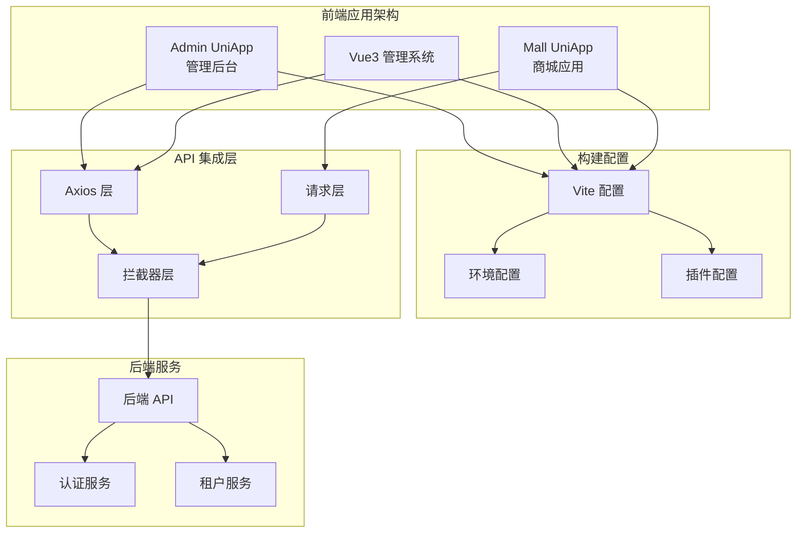

**图表来源**
- [frontend/admin-uniapp/vite.config.ts:33-213](file://frontend/admin-uniapp/vite.config.ts#L33-L213)
- [frontend/admin-vue3/vite.config.ts:15-88](file://frontend/admin-vue3/vite.config.ts#L15-L88)

**章节来源**
- [frontend/admin-uniapp/package.json:1-194](file://frontend/admin-uniapp/package.json#L1-L194)
- [frontend/admin-vue3/package.json:1-160](file://frontend/admin-vue3/package.json#L1-L160)
- [frontend/mall-uniapp/package.json:1-104](file://frontend/mall-uniapp/package.json#L1-L104)

## 核心组件

### 请求拦截器系统

每个前端应用都实现了强大的请求拦截器系统，用于处理认证、租户管理、错误处理等功能：

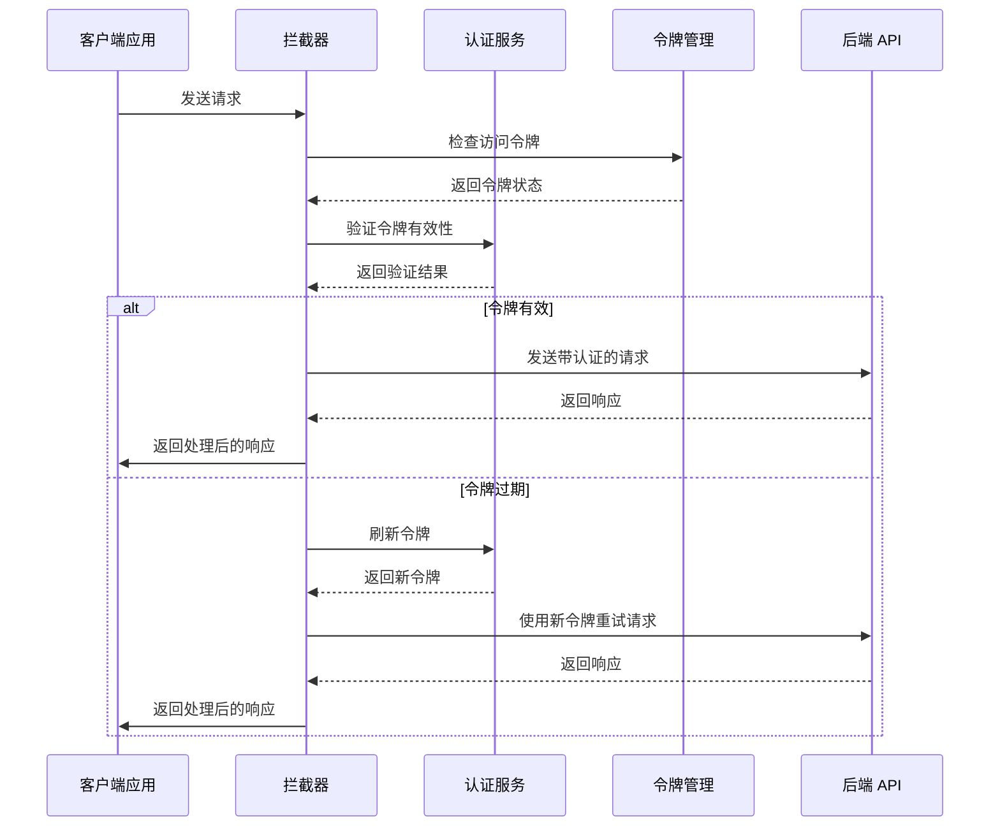

**图表来源**
- [frontend/admin-vue3/src/config/axios/service.ts:154-196](file://frontend/admin-vue3/src/config/axios/service.ts#L154-L196)
- [frontend/mall-uniapp/sheep/request/index.js:225-275](file://frontend/mall-uniapp/sheep/request/index.js#L225-L275)

### 环境配置管理系统

项目实现了灵活的环境配置系统，支持开发、测试、生产等多环境部署：

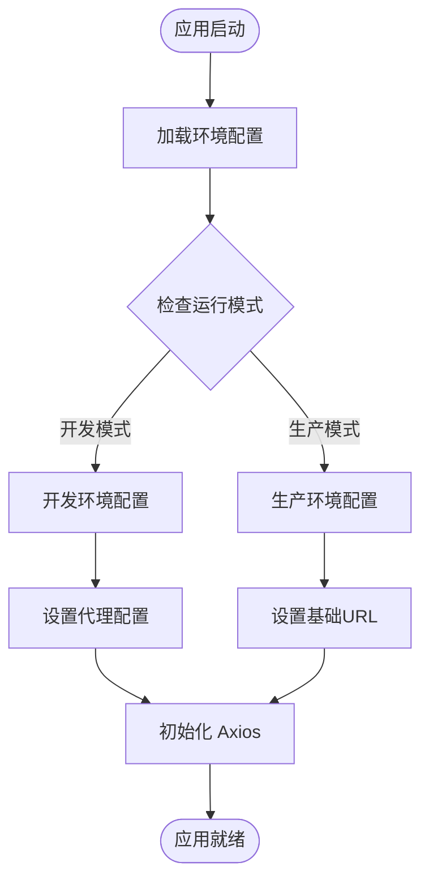

**图表来源**
- [frontend/admin-uniapp/env/.env.development:1-10](file://frontend/admin-uniapp/env/.env.development#L1-L10)
- [frontend/admin-uniapp/env/.env.production:1-10](file://frontend/admin-uniapp/env/.env.production#L1-L10)

**章节来源**
- [frontend/admin-vue3/src/config/axios/index.ts:1-48](file://frontend/admin-vue3/src/config/axios/index.ts#L1-L48)
- [frontend/mall-uniapp/sheep/config/index.js:1-32](file://frontend/mall-uniapp/sheep/config/index.js#L1-L32)

## 架构概览

### 多平台 API 集成架构

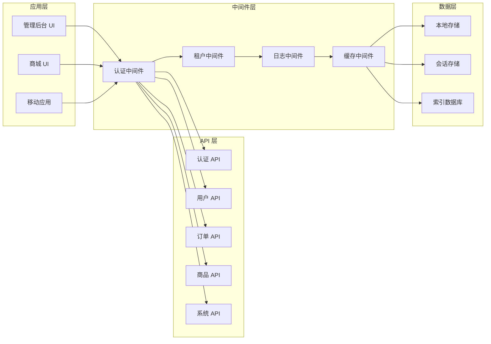

**图表来源**
- [frontend/admin-vue3/src/config/axios/service.ts:38-47](file://frontend/admin-vue3/src/config/axios/service.ts#L38-L47)
- [frontend/mall-uniapp/sheep/request/index.js:50-67](file://frontend/mall-uniapp/sheep/request/index.js#L50-L67)

### 请求生命周期管理

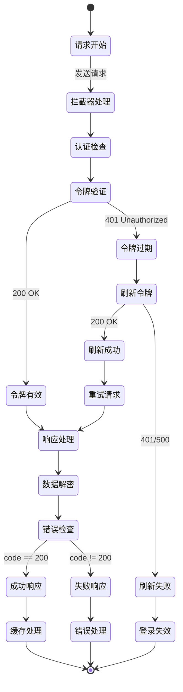

**图表来源**
- [frontend/admin-vue3/src/config/axios/service.ts:111-241](file://frontend/admin-vue3/src/config/axios/service.ts#L111-L241)
- [frontend/mall-uniapp/sheep/request/index.js:112-220](file://frontend/mall-uniapp/sheep/request/index.js#L112-L220)

## 详细组件分析

### Admin UniApp API 集成

Admin UniApp 采用了基于 Vite 的现代化构建配置，实现了灵活的 API 集成方案：

#### Vite 构建配置分析

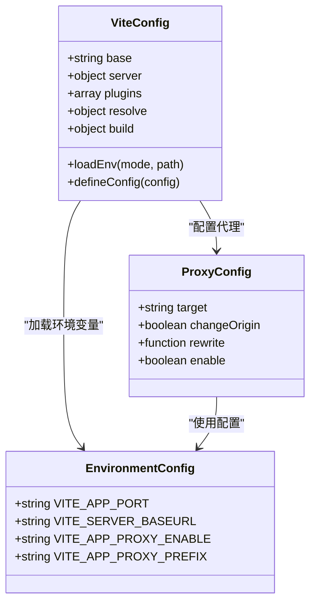

**图表来源**
- [frontend/admin-uniapp/vite.config.ts:64-213](file://frontend/admin-uniapp/vite.config.ts#L64-L213)
- [frontend/admin-uniapp/env/.env.development:8-10](file://frontend/admin-uniapp/env/.env.development#L8-L10)

#### 请求拦截器实现

Admin UniApp 的请求拦截器实现了完整的认证和错误处理机制：

**章节来源**
- [frontend/admin-uniapp/vite.config.ts:185-200](file://frontend/admin-uniapp/vite.config.ts#L185-L200)
- [frontend/admin-uniapp/env/.env.development:1-10](file://frontend/admin-uniapp/env/.env.development#L1-L10)

### Vue3 管理系统 API 集成

Vue3 管理系统采用了更加完善的 Axios 集成方案，包含了完整的认证、租户管理和错误处理机制：

#### Axios 配置架构

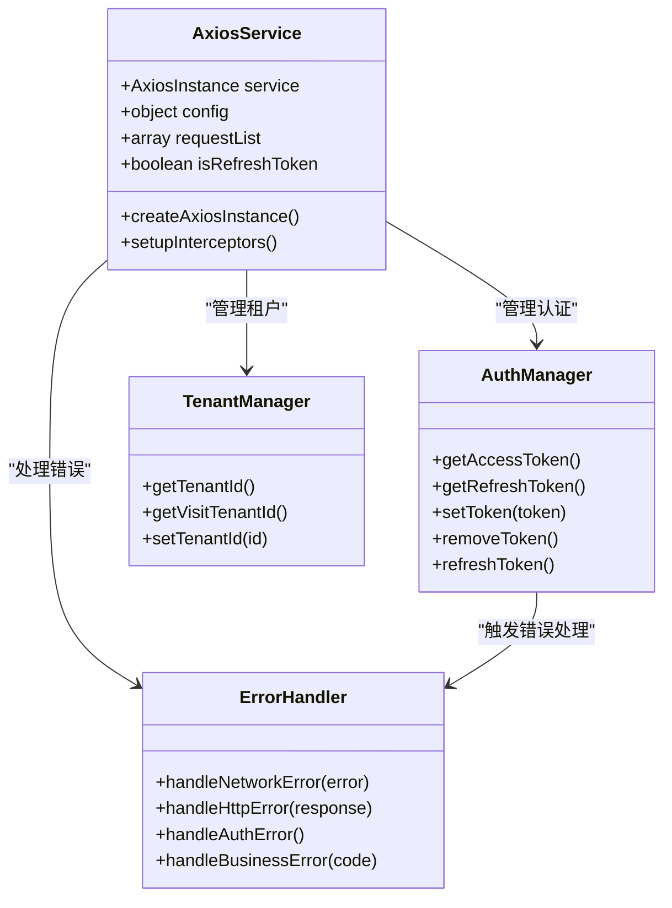

**图表来源**
- [frontend/admin-vue3/src/config/axios/service.ts:38-47](file://frontend/admin-vue3/src/config/axios/service.ts#L38-L47)
- [frontend/admin-vue3/src/config/axios/index.ts:1-48](file://frontend/admin-vue3/src/config/axios/index.ts#L1-L48)

#### 错误处理机制

Vue3 系统实现了多层次的错误处理机制：

**章节来源**
- [frontend/admin-vue3/src/config/axios/service.ts:110-241](file://frontend/admin-vue3/src/config/axios/service.ts#L110-L241)

### Mall UniApp API 集成

Mall UniApp 采用了基于 luch-request 的轻量级请求封装，针对小程序平台进行了专门优化：

#### 请求封装设计

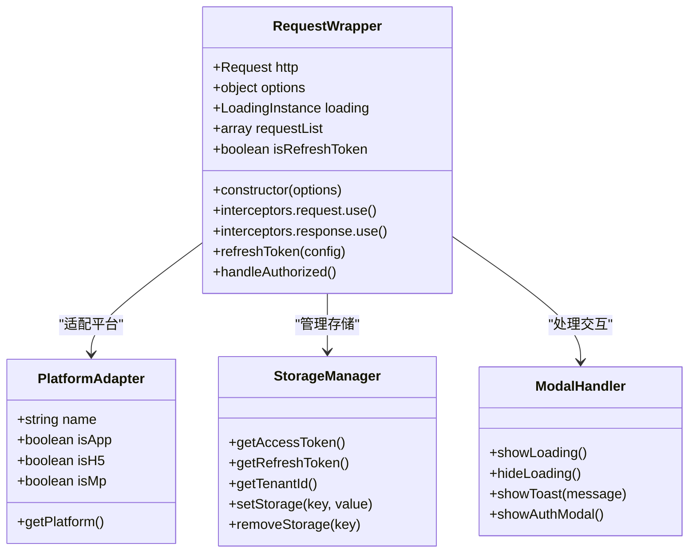

**图表来源**
- [frontend/mall-uniapp/sheep/request/index.js:14-31](file://frontend/mall-uniapp/sheep/request/index.js#L14-L31)
- [frontend/mall-uniapp/sheep/request/index.js:50-67](file://frontend/mall-uniapp/sheep/request/index.js#L50-L67)

#### 平台特定配置

Mall UniApp 针对不同平台实现了特定的配置优化：

**章节来源**
- [frontend/mall-uniapp/sheep/request/index.js:59-66](file://frontend/mall-uniapp/sheep/request/index.js#L59-L66)
- [frontend/mall-uniapp/sheep/request/index.js:291-304](file://frontend/mall-uniapp/sheep/request/index.js#L291-L304)

## 依赖关系分析

### 技术栈依赖图

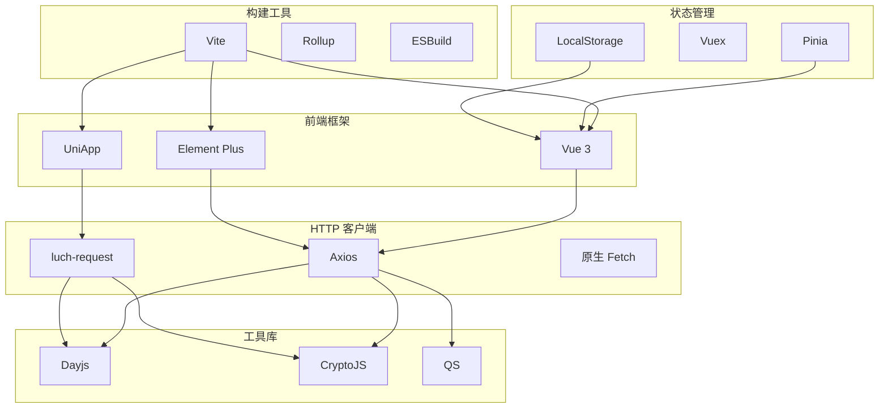

**图表来源**
- [frontend/admin-uniapp/package.json:99-127](file://frontend/admin-uniapp/package.json#L99-L127)
- [frontend/admin-vue3/package.json:27-84](file://frontend/admin-vue3/package.json#L27-L84)
- [frontend/mall-uniapp/package.json:90-98](file://frontend/mall-uniapp/package.json#L90-L98)

### API 集成依赖关系

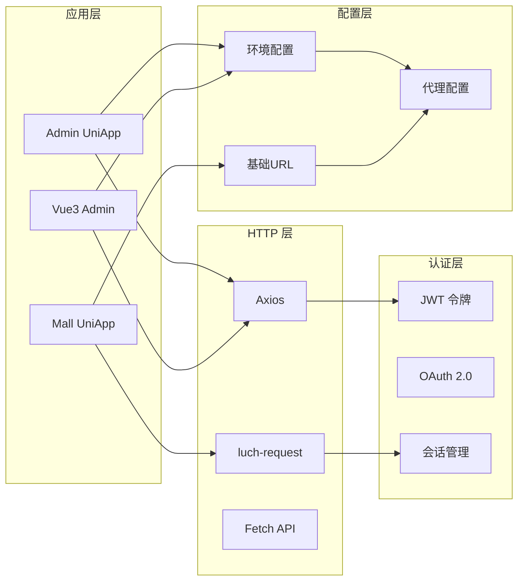

**图表来源**
- [frontend/admin-vue3/src/config/axios/service.ts:20-47](file://frontend/admin-vue3/src/config/axios/service.ts#L20-L47)
- [frontend/mall-uniapp/sheep/config/index.js:5-22](file://frontend/mall-uniapp/sheep/config/index.js#L5-L22)

**章节来源**
- [frontend/admin-uniapp/package.json:178-189](file://frontend/admin-uniapp/package.json#L178-L189)
- [frontend/admin-vue3/package.json:155-158](file://frontend/admin-vue3/package.json#L155-L158)

## 性能考虑

### 请求优化策略

项目在不同平台上采用了针对性的性能优化策略：

#### 缓存策略

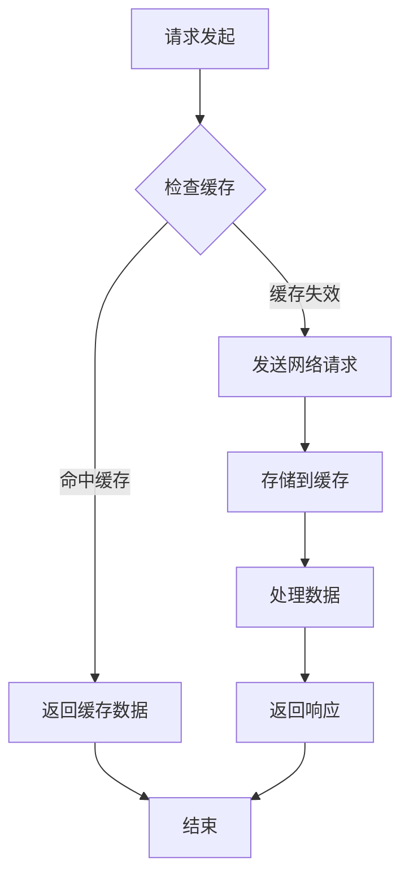

#### 并发请求管理

项目实现了智能的并发请求管理机制，避免重复请求和资源浪费。

### 构建优化

#### 代码分割

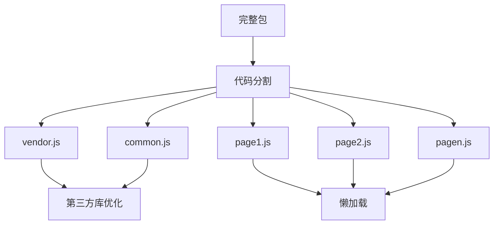

**图表来源**
- [frontend/admin-vue3/vite.config.ts:76-84](file://frontend/admin-vue3/vite.config.ts#L76-L84)

## 故障排除指南

### 常见问题诊断

#### 认证相关问题

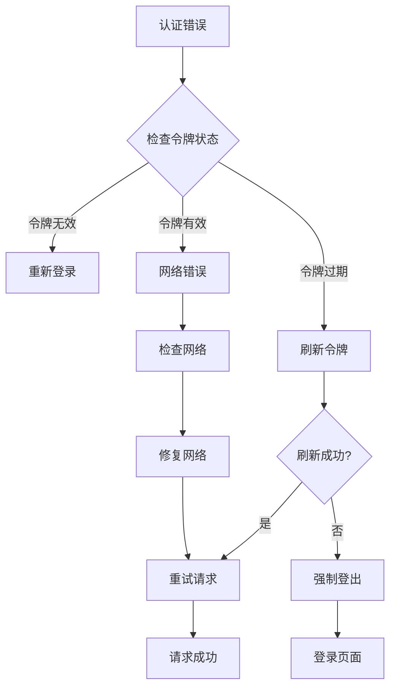

#### 网络请求问题

针对不同平台的网络请求问题，项目提供了相应的诊断和解决方案：

**章节来源**
- [frontend/admin-vue3/src/config/axios/service.ts:227-241](file://frontend/admin-vue3/src/config/axios/service.ts#L227-L241)
- [frontend/mall-uniapp/sheep/request/index.js:156-220](file://frontend/mall-uniapp/sheep/request/index.js#L156-L220)

### 调试工具使用

项目集成了多种调试工具来帮助开发者快速定位和解决问题：

## 结论

AgenticCPS 项目的前端 API 集成展现了现代前端开发的最佳实践。通过三个不同应用的差异化实现，项目成功地平衡了功能完整性、性能优化和用户体验。

### 主要优势

1. **多平台适配**：针对 H5、小程序、App 等不同平台提供了专门的优化方案
2. **完整的认证体系**：实现了令牌管理、刷新机制、错误处理等完整流程
3. **灵活的配置管理**：支持多环境部署和动态配置切换
4. **性能优化**：采用了代码分割、缓存策略、并发管理等优化技术

### 技术亮点

- **现代化构建工具**：Vite 提供了快速的开发体验和高效的构建性能
- **类型安全**：TypeScript 确保了代码质量和开发效率
- **状态管理**：Pinia 提供了简洁高效的状态管理方案
- **插件生态**：丰富的插件生态系统支持各种开发需求

### 未来改进方向

1. **监控和日志**：增强应用性能监控和错误追踪能力
2. **测试覆盖**：提高单元测试和集成测试的覆盖率
3. **文档完善**：补充 API 文档和开发指南
4. **自动化部署**：优化 CI/CD 流程和部署策略

通过持续的技术演进和最佳实践的应用，AgenticCPS 的前端 API 集成方案为类似项目提供了优秀的参考模板。