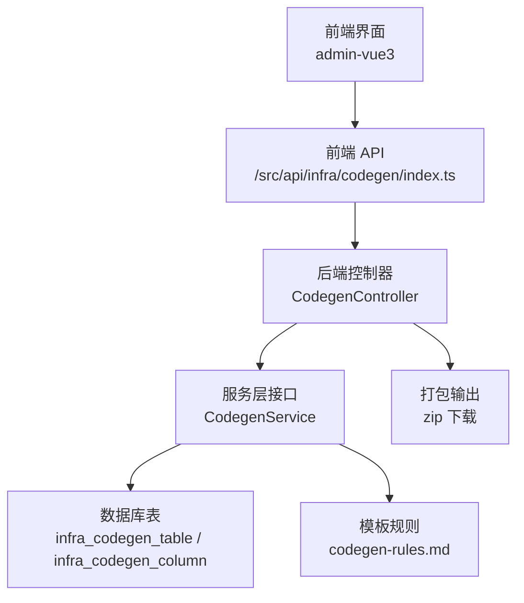
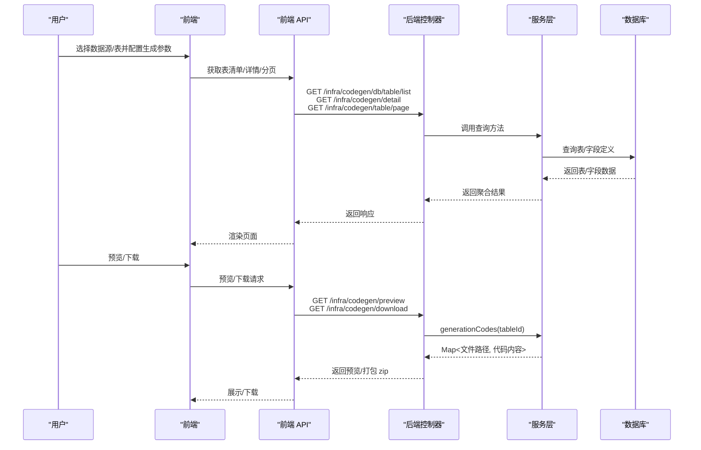
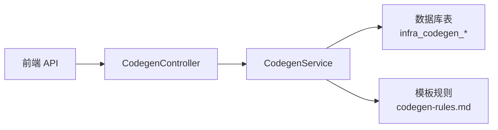

# 代码生成器

<cite>
**本文引用的文件**
- [CodegenController.java](file://backend/yudao-module-infra/src/main/java/cn/iocoder/yudao/module/infra/controller/admin/codegen/CodegenController.java)
- [CodegenService.java](file://backend/yudao-module-infra/src/main/java/cn/iocoder/yudao/module/infra/service/codegen/CodegenService.java)
- [codegen-rules.md](file://agent_improvement/memory/codegen-rules.md)
- [index.ts](file://frontend/admin-vue3/src/api/infra/codegen/index.ts)
- [ruoyi-vue-pro.sql（MySQL）](file://backend/sql/mysql/ruoyi-vue-pro.sql)
- [ruoyi-vue-pro.sql（Kingbase）](file://backend/sql/kingbase/ruoyi-vue-pro.sql)
- [BaseMapperX.java](file://backend/yudao-framework/yudao-spring-boot-starter-mybatis/src/main/java/cn/iocoder/yudao/framework/mybatis/core/mapper/BaseMapperX.java)
</cite>

## 目录
1. [简介](#简介)
2. [项目结构](#项目结构)
3. [核心组件](#核心组件)
4. [架构总览](#架构总览)
5. [详细组件分析](#详细组件分析)
6. [依赖分析](#依赖分析)
7. [性能考虑](#性能考虑)
8. [故障排查指南](#故障排查指南)
9. [结论](#结论)
10. [附录](#附录)

## 简介
本文件面向后端与前端开发者，系统化阐述“一键 CRUD 代码生成器”的实现原理与使用方法。内容覆盖：
- 数据库表结构解析与字段映射
- 模板引擎使用与前后端代码生成策略
- 配置项与模板定制化机制
- 批量代码生成流程
- 与 MyBatis Plus 的集成方式、命名规范转换、字段类型映射规则
- 使用示例、配置参数说明与自定义模板开发指南

## 项目结构
代码生成器由“后端控制器 + 服务层 + 前端 API + 模板规则 + 数据库表结构”共同组成，形成“表定义 → 预览/下载 → 生成代码”的完整闭环。

图表来源
- [CodegenController.java:40-161](file://backend/yudao-module-infra/src/main/java/cn/iocoder/yudao/module/infra/controller/admin/codegen/CodegenController.java#L40-L161)
- [index.ts:1-112](file://frontend/admin-vue3/src/api/infra/codegen/index.ts#L1-L112)
- [codegen-rules.md:1-788](file://agent_improvement/memory/codegen-rules.md#L1-L788)
- [ruoyi-vue-pro.sql（MySQL）:155-177](file://backend/sql/mysql/ruoyi-vue-pro.sql#L155-L177)

章节来源
- [CodegenController.java:40-161](file://backend/yudao-module-infra/src/main/java/cn/iocoder/yudao/module/infra/controller/admin/codegen/CodegenController.java#L40-L161)
- [index.ts:1-112](file://frontend/admin-vue3/src/api/infra/codegen/index.ts#L1-L112)
- [codegen-rules.md:1-788](file://agent_improvement/memory/codegen-rules.md#L1-L788)
- [ruoyi-vue-pro.sql（MySQL）:155-177](file://backend/sql/mysql/ruoyi-vue-pro.sql#L155-L177)

## 核心组件
- 后端控制器：提供表定义查询、分页、详情、创建/更新/同步/删除、预览与下载等接口。
- 服务层接口：定义生成流程契约，包括表/字段获取、生成代码、数据库表清单等。
- 前端 API：封装与后端交互的 HTTP 请求，支持列表、分页、预览、下载等。
- 模板规则：定义 Java/前端代码生成的层级结构、命名规范、模板变量与映射。
- 数据库表：存储“表定义 + 字段定义 + 生成配置 + 前端类型”。

章节来源
- [CodegenController.java:40-161](file://backend/yudao-module-infra/src/main/java/cn/iocoder/yudao/module/infra/controller/admin/codegen/CodegenController.java#L40-L161)
- [CodegenService.java:1-109](file://backend/yudao-module-infra/src/main/java/cn/iocoder/yudao/module/infra/service/codegen/CodegenService.java#L1-L109)
- [index.ts:1-112](file://frontend/admin-vue3/src/api/infra/codegen/index.ts#L1-L112)
- [codegen-rules.md:1-788](file://agent_improvement/memory/codegen-rules.md#L1-L788)
- [ruoyi-vue-pro.sql（MySQL）:155-177](file://backend/sql/mysql/ruoyi-vue-pro.sql#L155-L177)

## 架构总览
从“数据库表结构”到“生成代码”的整体流程如下：

图表来源
- [CodegenController.java:49-158](file://backend/yudao-module-infra/src/main/java/cn/iocoder/yudao/module/infra/controller/admin/codegen/CodegenController.java#L49-L158)
- [index.ts:59-112](file://frontend/admin-vue3/src/api/infra/codegen/index.ts#L59-L112)
- [CodegenService.java:90-108](file://backend/yudao-module-infra/src/main/java/cn/iocoder/yudao/module/infra/service/codegen/CodegenService.java#L90-L108)

## 详细组件分析

### 后端控制器（CodegenController）
职责与关键点：
- 提供数据库表清单、表定义列表/分页、详情、创建/更新/同步/删除、预览与下载等接口。
- 预览接口直接返回生成后的代码映射；下载接口将代码打包为 zip 并输出附件。
- 使用权限注解控制操作权限，确保安全访问。

章节来源
- [CodegenController.java:49-158](file://backend/yudao-module-infra/src/main/java/cn/iocoder/yudao/module/infra/controller/admin/codegen/CodegenController.java#L49-L158)

### 服务层接口（CodegenService）
职责与关键点：
- 定义生成流程契约：创建/更新/同步/删除表定义；获取表/字段列表；执行生成；获取数据库表清单。
- generationCodes(tableId) 返回 Map<文件路径, 代码内容>，用于预览与下载。

章节来源
- [CodegenService.java:14-108](file://backend/yudao-module-infra/src/main/java/cn/iocoder/yudao/module/infra/service/codegen/CodegenService.java#L14-L108)

### 前端 API（admin-vue3）
职责与关键点：
- 封装所有与后端交互的请求，包括：获取表清单、分页、详情、创建/更新/同步/删除、预览、下载。
- 下载采用二进制流写入浏览器本地文件，便于快速获取生成的代码包。

章节来源
- [index.ts:59-112](file://frontend/admin-vue3/src/api/infra/codegen/index.ts#L59-L112)

### 模板规则（codegen-rules.md）
职责与关键点：
- 定义 Java/前端代码生成的层级结构、命名规范、模板变量与映射。
- 明确 DO/Mapper/Service/Controller/VO 的生成规范与查询条件操作符。
- 提供多种前端模板（Vue3 Element Plus/Vben/Vben5/Antd、UniApp）及变量映射表。

章节来源
- [codegen-rules.md:1-788](file://agent_improvement/memory/codegen-rules.md#L1-L788)

### 数据库表结构
职责与关键点：
- infra_codegen_table：存储表定义与生成配置（模板类型、前端类型、模块/业务名、类名、作者、父子菜单等）。
- infra_codegen_column：存储字段定义与生成配置（字段名、类型、注释、Java 类型/字段、HTML 类型、字典类型、操作开关等）。

章节来源
- [ruoyi-vue-pro.sql（MySQL）:155-177](file://backend/sql/mysql/ruoyi-vue-pro.sql#L155-L177)
- [ruoyi-vue-pro.sql（Kingbase）:236-254](file://backend/sql/kingbase/ruoyi-vue-pro.sql#L236-L254)

### 与 MyBatis Plus 的集成
- 通过 BaseMapperX 扩展基础 Mapper，提供分页查询、条件构造器等能力，简化 Service 层实现。
- DO 注解与序列配置适配不同数据库（如 Oracle/PG/Kingbase/DB2/H2），保证主键与序列兼容。

章节来源
- [BaseMapperX.java:28-28](file://backend/yudao-framework/yudao-spring-boot-starter-mybatis/src/main/java/cn/iocoder/yudao/framework/mybatis/core/mapper/BaseMapperX.java#L28-L28)

## 依赖分析
- 控制器依赖服务层接口，服务层依赖数据库表结构与模板规则。
- 前端通过 API 与控制器交互，下载时依赖后端打包逻辑。
- 生成流程耦合度低，便于扩展新模板与前端类型。

图表来源
- [CodegenController.java:46-47](file://backend/yudao-module-infra/src/main/java/cn/iocoder/yudao/module/infra/controller/admin/codegen/CodegenController.java#L46-L47)
- [CodegenService.java:1-109](file://backend/yudao-module-infra/src/main/java/cn/iocoder/yudao/module/infra/service/codegen/CodegenService.java#L1-L109)
- [index.ts:1-112](file://frontend/admin-vue3/src/api/infra/codegen/index.ts#L1-L112)
- [codegen-rules.md:1-788](file://agent_improvement/memory/codegen-rules.md#L1-L788)

## 性能考虑
- 预览与下载均在服务端生成代码并返回，建议对生成结果进行缓存以降低重复生成开销。
- 大批量表生成时，建议采用异步任务与进度反馈，避免阻塞接口。
- 前端预览仅返回文件路径与代码内容，不进行持久化，减少 IO 压力。

## 故障排查指南
- 无法获取数据库表清单：检查数据源配置编号与表名/注释筛选条件。
- 预览为空：确认表定义与字段定义是否完整，模板变量是否缺失。
- 下载失败：检查后端打包逻辑与响应头设置，确保二进制流正确输出。
- 权限不足：确认控制器上的权限注解与用户授权状态。

章节来源
- [CodegenController.java:49-158](file://backend/yudao-module-infra/src/main/java/cn/iocoder/yudao/module/infra/controller/admin/codegen/CodegenController.java#L49-L158)
- [index.ts:59-112](file://frontend/admin-vue3/src/api/infra/codegen/index.ts#L59-L112)

## 结论
该代码生成器以“表定义 + 模板规则”为核心，结合后端服务与前端 API，实现了从数据库表到前后端代码的一键生成。通过清晰的契约与可扩展的模板机制，开发者可以快速落地标准 CRUD 与复杂场景（树表、主子表、多前端模板），并按需定制命名规范与字段映射。

## 附录

### 一键 CRUD 代码生成流程（步骤详解）
- 步骤 1：选择数据源配置，获取数据库表清单并筛选目标表。
- 步骤 2：基于所选表创建/同步表与字段定义，完善模板类型、前端类型、模块/业务名、类名、作者等配置。
- 步骤 3：填写字段属性（Java 类型、HTML 类型、字典类型、操作开关等）。
- 步骤 4：点击“预览”，查看生成的文件路径与代码内容。
- 步骤 5：点击“下载”，后端将代码打包为 zip 并下载至本地。

章节来源
- [CodegenController.java:92-158](file://backend/yudao-module-infra/src/main/java/cn/iocoder/yudao/module/infra/controller/admin/codegen/CodegenController.java#L92-L158)
- [index.ts:59-112](file://frontend/admin-vue3/src/api/infra/codegen/index.ts#L59-L112)
- [codegen-rules.md:1-788](file://agent_improvement/memory/codegen-rules.md#L1-L788)

### 配置选项与参数说明
- 表定义配置
  - 数据源配置编号：用于区分不同数据库实例。
  - 模板类型：通用/树表/ERP 主表。
  - 前端类型：Element Plus/Vben/Vben5/Antd/UniApp。
  - 模块名、业务名、类名、类注释、作者。
  - 父菜单编号、树表父子字段、主子表关联字段与一对多标记。
- 字段定义配置
  - 字段名、数据类型、注释、Java 类型/字段、HTML 类型、字典类型。
  - 操作开关：创建/更新/列表/列表条件/列表结果。
  - 示例值、排序位置等。

章节来源
- [ruoyi-vue-pro.sql（MySQL）:155-177](file://backend/sql/mysql/ruoyi-vue-pro.sql#L155-L177)
- [ruoyi-vue-pro.sql（Kingbase）:236-254](file://backend/sql/kingbase/ruoyi-vue-pro.sql#L236-L254)
- [codegen-rules.md:307-325](file://agent_improvement/memory/codegen-rules.md#L307-L325)

### 模板定制化机制
- 模板变量：类名、业务名、模块名、权限前缀、主键字段/类型、树表字段等。
- 前端模板：提供 Element Plus/Vben/Vben5/Antd、UniApp 多套模板，支持 API/页面/表单/组件生成。
- Java 模板：按层级结构生成 Controller/Service/ServiceImpl/Mapper/DO/VO，并内置查询条件与分页逻辑。

章节来源
- [codegen-rules.md:327-788](file://agent_improvement/memory/codegen-rules.md#L327-L788)

### 命名规范转换与字段类型映射
- 命名规范：模块名 module-{name}、业务名小写中划线、类名 PascalCase、变量名 camelCase、包路径小写点分隔、HTTP 路径小写下划线。
- 字段类型映射：后端类型与前端 HTML 组件映射表，便于生成对应表单项与渲染逻辑。

章节来源
- [codegen-rules.md:31-788](file://agent_improvement/memory/codegen-rules.md#L31-L788)

### 自定义模板开发指南
- 在模板规则中新增模板变量与层级结构，确保生成的文件路径与代码内容符合预期。
- 针对特定前端框架（如 Vben5 Antd），参考现有模板编写对应 API/页面/组件模板。
- 对 Java 侧生成，遵循 DO/Mapper/Service/Controller/VO 的规范，保持查询条件与分页逻辑一致。

章节来源
- [codegen-rules.md:1-788](file://agent_improvement/memory/codegen-rules.md#L1-L788)