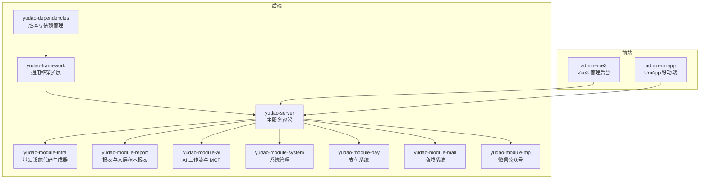
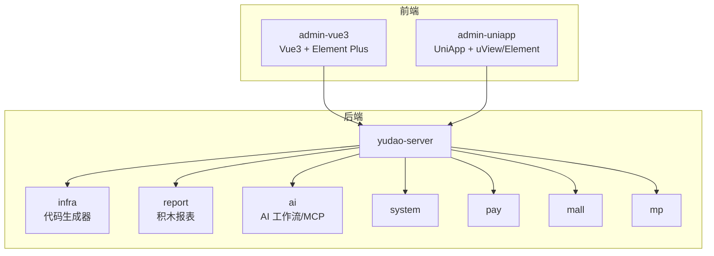
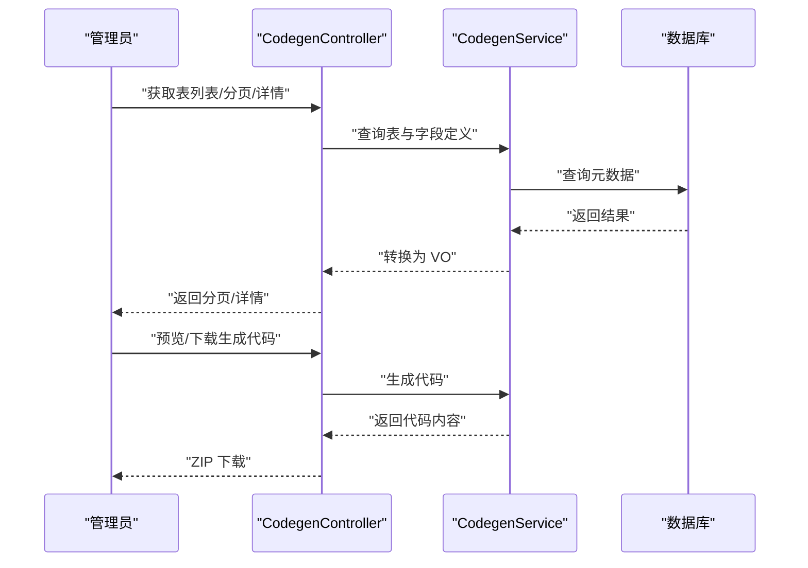
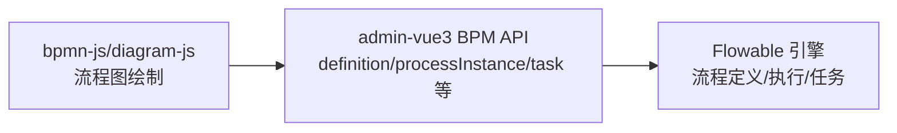
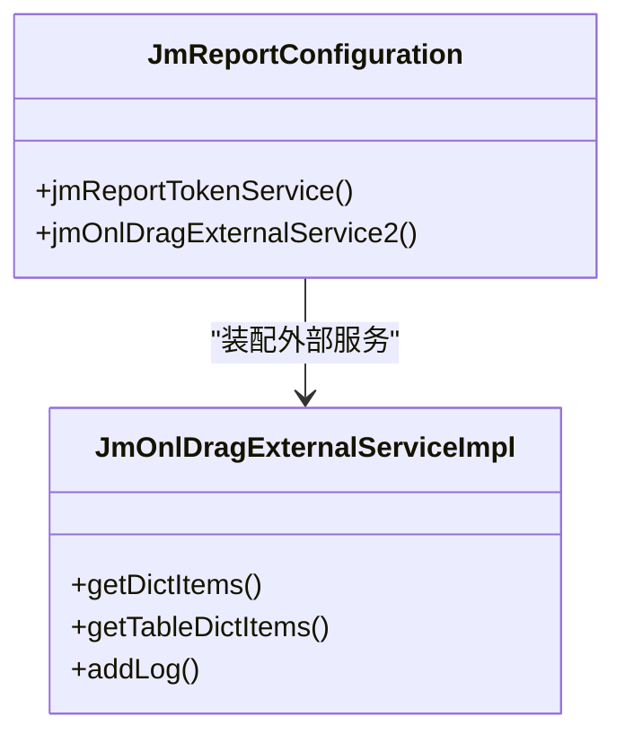
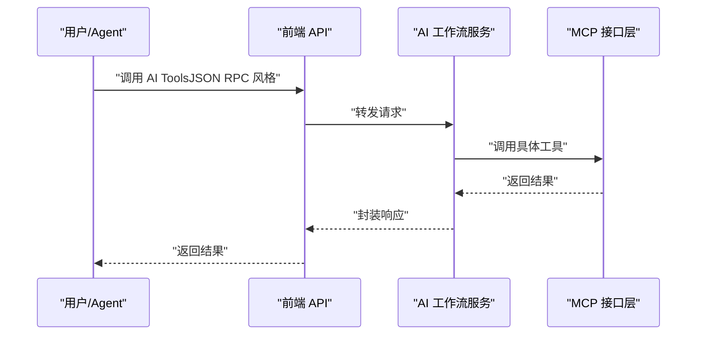
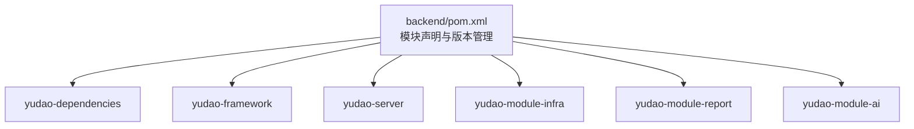

# 低代码开发平台

<cite>
**本文引用的文件**
- [pom.xml](file://backend/pom.xml)
- [README.md](file://README.md)
- [package.json](file://frontend/admin-vue3/package.json)
- [CodegenController.java](file://backend/yudao-module-infra/src/main/java/cn/iocoder/yudao/module/infra/controller/admin/codegen/CodegenController.java)
- [JmReportConfiguration.java](file://backend/yudao-module-report/src/main/java/cn/iocoder/yudao/module/report/framework/jmreport/config/JmReportConfiguration.java)
- [JmOnlDragExternalServiceImpl.java](file://backend/yudao-module-report/src/main/java/cn/iocoder/yudao/module/report/framework/jmreport/core/service/JmOnlDragExternalServiceImpl.java)
</cite>

## 目录
1. [简介](#简介)
2. [项目结构](#项目结构)
3. [核心组件](#核心组件)
4. [架构总览](#架构总览)
5. [详细组件分析](#详细组件分析)
6. [依赖关系分析](#依赖关系分析)
7. [性能考虑](#性能考虑)
8. [故障排查指南](#故障排查指南)
9. [结论](#结论)
10. [附录](#附录)

## 简介
本文件面向低代码开发平台的技术文档，围绕“代码生成器的一键 CRUD 生成”、“可视化工作流的拖拽设计”、“报表设计器的数据可视化能力”展开，同时解释 Flowable 工作流引擎的集成实现、报表设计器的组件库设计、大屏设计器的可视化布局能力，并覆盖平台架构、扩展机制与性能优化策略。文档以仓库现有实现为依据，结合前端依赖与后端模块，给出可操作的使用指南、配置示例与最佳实践。

## 项目结构
项目采用前后端分离的多模块 Maven 结构，后端以 Spring Boot 3.5.9 为核心，前端包含 Vue3 管理后台与 UniApp 移动端。平台模块化清晰，低代码相关能力主要分布在基础设施模块（代码生成器）、报表模块（积木报表集成）与 AI 模块（工作流与 MCP 集成）。

**图表来源**
- [pom.xml:10-24](file://backend/pom.xml#L10-L24)
- [README.md:267-284](file://README.md#L267-L284)

**章节来源**
- [pom.xml:10-24](file://backend/pom.xml#L10-L24)
- [README.md:267-284](file://README.md#L267-L284)

## 核心组件
- 代码生成器：基于数据库表结构一键生成前后端代码、SQL、Swagger 文档与单元测试，覆盖单表、树表、主子表三种模式。
- 可视化工作流：基于 Flowable 引擎，提供在线拖拽设计审批流程的能力。
- 报表设计器：集成积木报表（JimuReport），提供数据报表、图形报表、大屏设计器与打印设计。
- 扩展机制：通过模块化与 SPI 扩展点（如报表外部服务实现）实现能力扩展。
- 性能优化：通过缓存、异步任务、数据库索引与前端打包优化等手段保障性能。

**章节来源**
- [README.md:147-210](file://README.md#L147-L210)

## 架构总览
平台采用“后端微模块 + 前端多端”的架构。后端以 yudao-server 为容器，按领域拆分为多个 Module；前端提供 Vue3 管理后台与 UniApp 移动端。低代码能力通过模块化扩展与第三方组件集成实现。

**图表来源**
- [pom.xml:10-24](file://backend/pom.xml#L10-L24)
- [README.md:267-284](file://README.md#L267-L284)

## 详细组件分析

### 代码生成器：一键 CRUD 生成
- 能力概述
  - 输入：数据库表结构
  - 输出：Java 控制器/服务/映射/实体/视图对象、Vue3 前端页面（列表/表单/详情）、SQL 建表脚本、Swagger 文档、单元测试代码
  - 支持：单表、树表、主子表
- 核心接口
  - 获取数据库表列表、分页、详情
  - 基于表结构创建/更新/同步/删除代码生成定义
  - 预览与下载生成的代码（ZIP）
- 关键控制器
  - CodegenController 提供上述接口，使用权限注解控制访问

**图表来源**
- [CodegenController.java:49-161](file://backend/yudao-module-infra/src/main/java/cn/iocoder/yudao/module/infra/controller/admin/codegen/CodegenController.java#L49-L161)

**章节来源**
- [README.md:151-166](file://README.md#L151-L166)
- [CodegenController.java:49-161](file://backend/yudao-module-infra/src/main/java/cn/iocoder/yudao/module/infra/controller/admin/codegen/CodegenController.java#L49-L161)

### 可视化工作流：拖拽设计业务流程
- 能力概述
  - 基于 Flowable 工作流引擎，提供在线拖拽设计审批流程
  - 支持提现审核、返利结算审批、平台接入流程等
- 集成要点
  - 后端模块化组织，前端提供 BPMN/流程定义、任务、监听器等 API
  - 前端依赖包含 bpmn-js、diagram-js、camunda-bpmn-moddle 等，支持流程图绘制与属性面板
- 使用路径
  - 前端：src/api/bpm 下的分类、定义、实例、任务、表达式、监听器等 API
  - 前端页面：pages-bpm 下的流程相关页面与工具

**图表来源**
- [package.json:42-48](file://frontend/admin-vue3/package.json#L42-L48)
- [README.md:167-175](file://README.md#L167-L175)

**章节来源**
- [README.md:167-175](file://README.md#L167-L175)
- [package.json:42-48](file://frontend/admin-vue3/package.json#L42-L48)

### 报表设计器：数据可视化与大屏布局
- 能力概述
  - 数据报表设计器：拖拽字段生成数据报表，支持导出 Excel、PDF
  - 图形报表设计器：柱状图、折线图、饼图等数十种图表组件
  - 大屏设计器：全屏数据大屏，内置几十种可视化组件
  - 打印设计器：拖拽设计打印模板，支持条形码、二维码
- 集成实现
  - 通过积木报表（JimuReport）集成，后端配置类扫描并注册 Token 服务与外部拖拽扩展服务
  - 外部扩展服务实现字典项与日志等能力，便于报表设计器与系统权限/安全联动

**图表来源**
- [JmReportConfiguration.java:20-37](file://backend/yudao-module-report/src/main/java/cn/iocoder/yudao/module/report/framework/jmreport/config/JmReportConfiguration.java#L20-L37)
- [JmOnlDragExternalServiceImpl.java:21-68](file://backend/yudao-module-report/src/main/java/cn/iocoder/yudao/module/report/framework/jmreport/core/service/JmOnlDragExternalServiceImpl.java#L21-L68)

**章节来源**
- [README.md:176-184](file://README.md#L176-L184)
- [JmReportConfiguration.java:20-37](file://backend/yudao-module-report/src/main/java/cn/iocoder/yudao/module/report/framework/jmreport/config/JmReportConfiguration.java#L20-L37)
- [JmOnlDragExternalServiceImpl.java:21-68](file://backend/yudao-module-report/src/main/java/cn/iocoder/yudao/module/report/framework/jmreport/core/service/JmOnlDragExternalServiceImpl.java#L21-L68)

### AI 工作流与 MCP 集成
- 能力概述
  - 基于 AI 模块提供工作流与 MCP（Model Context Protocol）能力，支持 AI Agent 零代码接入
  - 提供 5 个开箱即用的 AI Tools：商品搜索、多平台比价、推广链接生成、订单查询、返利汇总
- 使用路径
  - 前端：src/api/bpm 下的模型、表达式、监听器等 API
  - 后端：AI 工作流相关控制器、服务与数据对象

**图表来源**
- [README.md:185-209](file://README.md#L185-L209)

**章节来源**
- [README.md:185-209](file://README.md#L185-L209)

## 依赖关系分析
- 后端模块依赖
  - yudao-dependencies：统一版本与依赖管理
  - yudao-framework：安全、缓存、权限、多租户等通用能力
  - yudao-server：模块容器
  - yudao-module-infra：基础设施（含代码生成器）
  - yudao-module-report：报表与大屏
  - yudao-module-ai：AI 工作流与 MCP
- 前端依赖
  - admin-vue3：@form-create/designer、bpmn-js、diagram-js、echarts、sortablejs 等，支撑低代码表单、流程图、可视化与拖拽排序

**图表来源**
- [pom.xml:10-24](file://backend/pom.xml#L10-L24)

**章节来源**
- [pom.xml:10-24](file://backend/pom.xml#L10-L24)
- [package.json:27-83](file://frontend/admin-vue3/package.json#L27-L83)

## 性能考虑
- 响应时间目标
  - 单平台搜索：<2 秒（P99）
  - 多平台比价：<5 秒（P99）
  - 转链生成：<1 秒
  - 订单同步延迟：<30 分钟
  - 返利入账：平台结算后 24 小时内
  - MCP Tool 调用：搜索类 <3 秒，查询类 <1 秒
- 优化方向
  - 后端：缓存热点数据、异步处理耗时任务、数据库索引优化、分页与条件查询优化
  - 前端：Vite 构建优化、按需加载、组件懒加载、图片与资源压缩
  - 报表：分页与分段渲染、图表懒加载、字典项缓存

**章节来源**
- [README.md:332-342](file://README.md#L332-L342)

## 故障排查指南
- 代码生成器
  - 现象：生成代码预览为空或下载失败
  - 排查：确认表定义存在且字段定义完整；检查权限与登录用户昵称；查看生成服务日志
- 报表设计器
  - 现象：大屏/报表空白或组件不显示
  - 排查：确认积木报表外部服务实现已注册；检查 Token 服务与权限接口；核对字典项与日志接口是否可用
- 工作流
  - 现象：流程图无法保存或执行异常
  - 排查：检查 BPMN 文件合法性、流程定义版本、任务监听器与表达式配置；确认前端依赖与属性面板正常

**章节来源**
- [JmReportConfiguration.java:20-37](file://backend/yudao-module-report/src/main/java/cn/iocoder/yudao/module/report/framework/jmreport/config/JmReportConfiguration.java#L20-L37)
- [JmOnlDragExternalServiceImpl.java:21-68](file://backend/yudao-module-report/src/main/java/cn/iocoder/yudao/module/report/framework/jmreport/core/service/JmOnlDragExternalServiceImpl.java#L21-L68)

## 结论
本低代码平台通过模块化架构与第三方组件集成，实现了“一键 CRUD 生成”“可视化工作流拖拽”“报表与大屏设计器”的核心能力。依托 Flowable 与积木报表，平台在业务流程与数据可视化方面具备高扩展性；配合 AI MCP 能力，进一步降低接入与扩展成本。建议在生产环境中重点关注缓存、异步与前端构建优化，确保满足平台性能目标。

## 附录
- 快速开始
  - 环境要求：JDK 17/21、MySQL、Redis、Maven、Node.js
  - 启动步骤：导入数据库脚本，编译后运行主类，访问管理后台
- 使用指南
  - 代码生成器：在“代码生成”页面选择数据源与表，创建定义后预览/下载
  - 工作流：在 BPM 页面设计流程图，配置节点与监听器，发布后发起流程
  - 报表设计器：在报表模块创建项目，拖拽组件生成数据/图形/大屏报表
- 最佳实践
  - 优先使用代码生成器生成基础 CRUD，再进行定制扩展
  - 报表设计遵循分页与缓存策略，避免一次性加载大量数据
  - 工作流节点尽量原子化，配合监听器与表达式实现业务规则

**章节来源**
- [README.md:305-342](file://README.md#L305-L342)