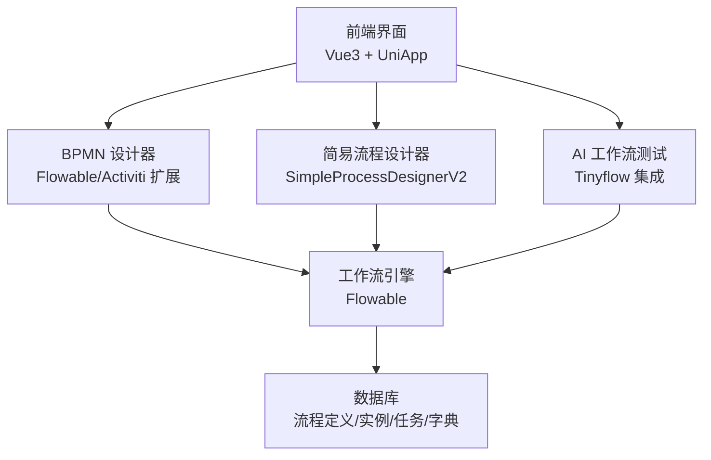
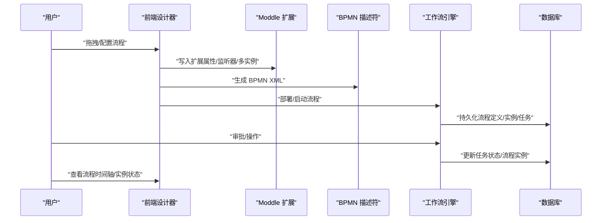
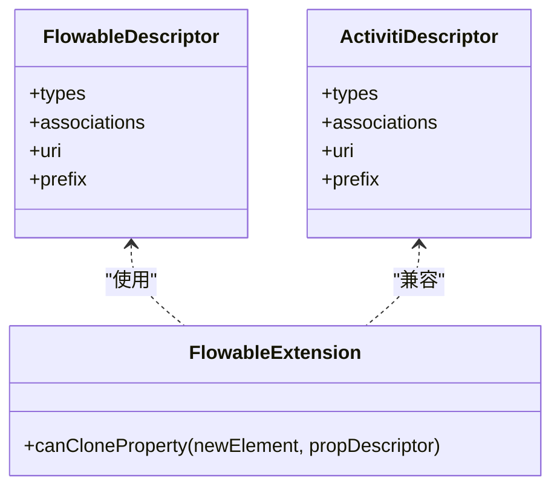
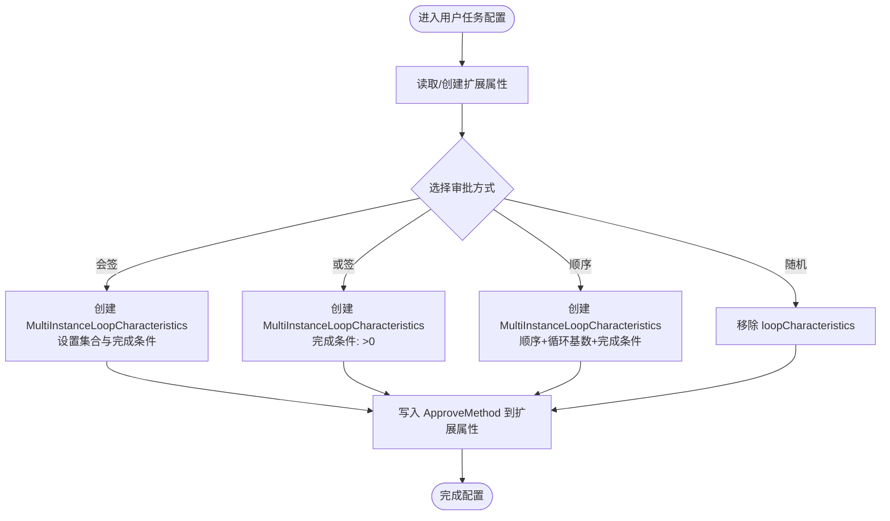
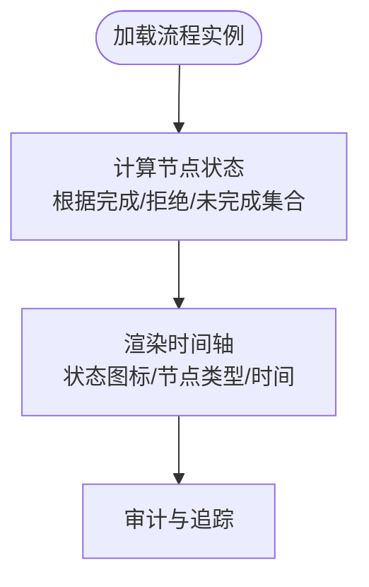
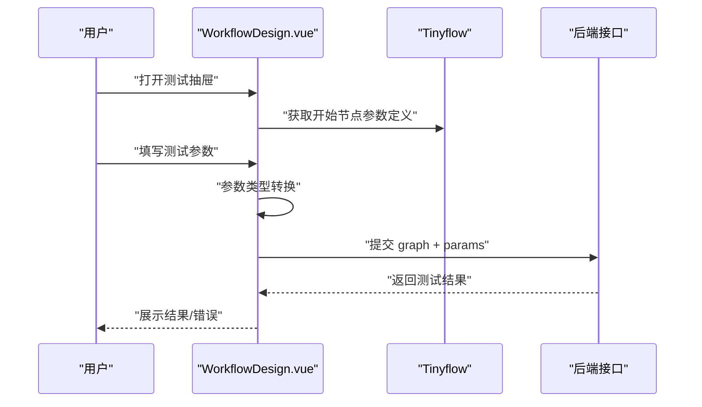
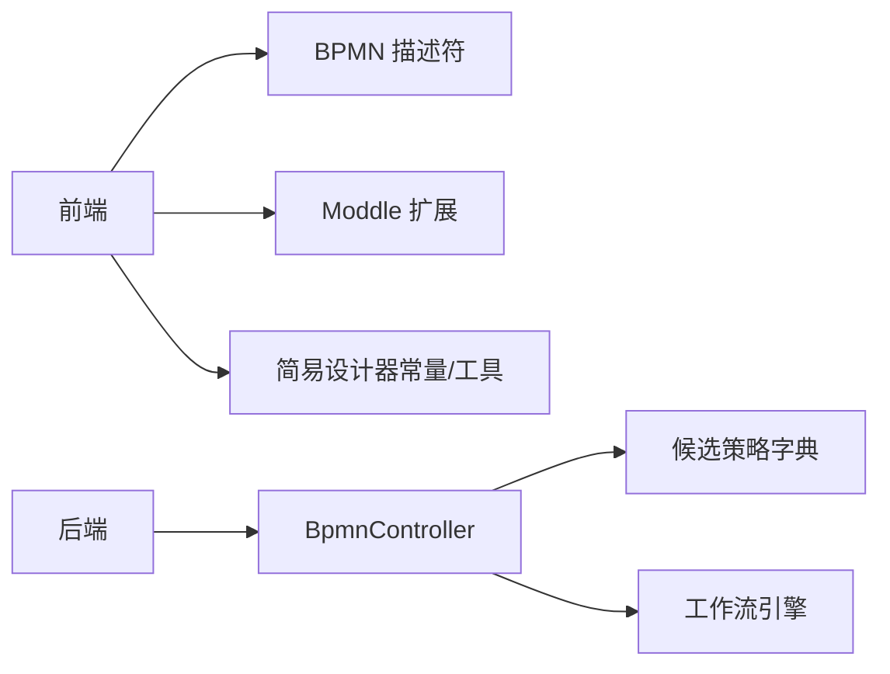

# 可视化工作流

<cite>
**本文引用的文件**
- [flowableDescriptor.json](file://frontend/admin-vue3/src/components/bpmnProcessDesigner/package/designer/plugins/descriptor/flowableDescriptor.json)
- [activitiDescriptor.json](file://frontend/admin-vue3/src/components/bpmnProcessDesigner/package/designer/plugins/descriptor/activitiDescriptor.json)
- [flowableExtension.js](file://frontend/admin-vue3/src/components/bpmnProcessDesigner/package/designer/plugins/extension-moddle/flowable/flowableExtension.js)
- [index.js](file://frontend/admin-vue3/src/components/bpmnProcessDesigner/package/designer/plugins/extension-moddle/flowable/index.js)
- [ElementMultiInstance.vue](file://frontend/admin-vue3/src/components/bpmnProcessDesigner/package/penal/multi-instance/ElementMultiInstance.vue)
- [UserTaskCustomConfig.vue](file://frontend/admin-vue3/src/components/bpmnProcessDesigner/package/penal/custom-config/components/UserTaskCustomConfig.vue)
- [ProcessInstanceTimeline.vue](file://frontend/admin-vue3/src/views/bpm/processInstance/detail/ProcessInstanceTimeline.vue)
- [ProcessInstanceSimpleViewer.vue](file://frontend/admin-vue3/src/views/bpm/processInstance/detail/ProcessInstanceSimpleViewer.vue)
- [SimpleProcessDesignerV2 源码](file://frontend/admin-vue3/src/components/SimpleProcessDesignerV2/src/)
- [SimpleProcessDesignerV2 常量定义](file://frontend/admin-vue3/src/components/SimpleProcessDesignerV2/src/consts.ts)
- [SimpleProcessDesignerV2 工具函数](file://frontend/admin-vue3/src/components/SimpleProcessDesignerV2/src/utils.ts)
- [SimpleProcessDesignerV2 导出入口](file://frontend/admin-vue3/src/components/SimpleProcessDesignerV2/src/index.ts)
- [BpmnController.java](file://backend/yudao-module-system/src/main/java/cn/iocoder/yudao/module/system/controller/basics/BpmnController.java)
- [ruoyi-vue-pro.sql (MySQL)](file://backend/sql/mysql/ruoyi-vue-pro.sql)
- [ruoyi-vue-pro.sql (PostgreSQL)](file://backend/sql/postgresql/ruoyi-vue-pro.sql)
- [ruoyi-vue-pro.sql (SQLServer)](file://backend/sql/sqlserver/ruoyi-vue-pro.sql)
- [WorkflowDesign.vue](file://frontend/admin-vue3/src/views/ai/workflow/form/WorkflowDesign.vue)
- [Tinyflow 错误提示](file://frontend/admin-vue3/src/components/Tinyflow/ui/index.js)
- [README.md](file://frontend/admin-vue3/README.md)
</cite>

## 目录
1. [引言](#引言)
2. [项目结构](#项目结构)
3. [核心组件](#核心组件)
4. [架构总览](#架构总览)
5. [详细组件分析](#详细组件分析)
6. [依赖分析](#依赖分析)
7. [性能考虑](#性能考虑)
8. [故障排查指南](#故障排查指南)
9. [结论](#结论)
10. [附录](#附录)

## 引言
本文件面向企业级可视化工作流系统的技术文档，围绕 Flowable 工作流引擎在本项目中的集成实现、BPMN 2.0 标准支持、流程设计器的拖拽交互、审批流程配置管理、任务分配策略、流程监控与追踪、以及性能优化与最佳实践展开。文档以“前端设计器 + 后端引擎”的双栈视角，结合仓库中的实际代码与资源，帮助开发者快速理解并构建复杂的审批流程。

## 项目结构
本项目采用前后端分离架构，前端包含两类设计器：
- BPMN 2.0 设计器：基于 Flowable/Activiti 扩展的 BPMN 描述符与 Moddle 扩展，支持复杂流程编排与多实例、监听器等高级特性。
- 仿钉钉/飞书简易流程设计器：面向业务人员的低代码流程编排，内置节点类型、审批策略、超时与拒绝处理等配置项。

后端提供工作流引擎能力与数据支撑，包含流程定义、流程实例、任务管理、候选策略字典等。

图表来源
- [README.md:116-131](file://frontend/admin-vue3/README.md#L116-L131)
- [SimpleProcessDesignerV2 导出入口:1-5](file://frontend/admin-vue3/src/components/SimpleProcessDesignerV2/src/index.ts#L1-L5)

章节来源
- [README.md:116-131](file://frontend/admin-vue3/README.md#L116-L131)

## 核心组件
- BPMN 设计器与 Moddle 扩展
  - 通过 Flowable/Activiti 描述符与扩展模块，支持异步、监听器、输入输出、多实例、扩展属性等 BPMN 2.0 能力。
  - 支持在用户任务上配置审批类型、审批人策略、超时/拒绝处理、按钮权限、签名与审批意见等。
- 简易流程设计器（SimpleProcessDesignerV2）
  - 内置节点类型（开始/结束、审批、抄送、延迟器、触发器、子流程、条件/分支等），支持审批方式（会签/或签/顺序/随机）、候选人策略、超时/拒绝/空审批人处理、监听器与表单权限等。
- 流程实例查看与时间轴
  - 提供流程实例的可视化查看与审批节点时间轴，支持状态图标、时间标注与节点类型区分。
- AI 工作流测试（Tinyflow）
  - 基于 Tinyflow 的可视化流程测试，支持参数定义与类型转换、测试执行与结果展示。

章节来源
- [flowableDescriptor.json:1-1494](file://frontend/admin-vue3/src/components/bpmnProcessDesigner/package/designer/plugins/descriptor/flowableDescriptor.json#L1-L1494)
- [activitiDescriptor.json:1-1005](file://frontend/admin-vue3/src/components/bpmnProcessDesigner/package/designer/plugins/descriptor/activitiDescriptor.json#L1-L1005)
- [flowableExtension.js:1-84](file://frontend/admin-vue3/src/components/bpmnProcessDesigner/package/designer/plugins/extension-moddle/flowable/flowableExtension.js#L1-L84)
- [ElementMultiInstance.vue:334-421](file://frontend/admin-vue3/src/components/bpmnProcessDesigner/package/penal/multi-instance/ElementMultiInstance.vue#L334-L421)
- [UserTaskCustomConfig.vue:255-294](file://frontend/admin-vue3/src/components/bpmnProcessDesigner/package/penal/custom-config/components/UserTaskCustomConfig.vue#L255-L294)
- [ProcessInstanceTimeline.vue:197-318](file://frontend/admin-vue3/src/views/bpm/processInstance/detail/ProcessInstanceTimeline.vue#L197-L318)
- [ProcessInstanceSimpleViewer.vue:70-107](file://frontend/admin-vue3/src/views/bpm/processInstance/detail/ProcessInstanceSimpleViewer.vue#L70-L107)
- [SimpleProcessDesignerV2 源码](file://frontend/admin-vue3/src/components/SimpleProcessDesignerV2/src/)
- [WorkflowDesign.vue:67-162](file://frontend/admin-vue3/src/views/ai/workflow/form/WorkflowDesign.vue#L67-L162)
- [Tinyflow 错误提示:4895-4908](file://frontend/admin-vue3/src/components/Tinyflow/ui/index.js#L4895-L4908)

## 架构总览
系统从前端设计器出发，将流程模型保存为 BPMN XML；后端工作流引擎解析并执行流程，依据候选策略与监听器完成任务分配与流转；流程实例状态通过时间轴与查看器呈现，便于审计与追踪。

图表来源
- [flowableDescriptor.json:1-1494](file://frontend/admin-vue3/src/components/bpmnProcessDesigner/package/designer/plugins/descriptor/flowableDescriptor.json#L1-L1494)
- [flowableExtension.js:1-84](file://frontend/admin-vue3/src/components/bpmnProcessDesigner/package/designer/plugins/extension-moddle/flowable/flowableExtension.js#L1-L84)
- [ElementMultiInstance.vue:334-421](file://frontend/admin-vue3/src/components/bpmnProcessDesigner/package/penal/multi-instance/ElementMultiInstance.vue#L334-L421)
- [UserTaskCustomConfig.vue:255-294](file://frontend/admin-vue3/src/components/bpmnProcessDesigner/package/penal/custom-config/components/UserTaskCustomConfig.vue#L255-L294)

## 详细组件分析

### BPMN 2.0 标准与扩展支持
- 描述符与类型
  - Flowable/Activiti 描述符定义了扩展类型（如 AsyncCapable、JobPriorized、FormSupported、Assignable、CallActivity、ServiceTaskLike、DmnCapable、ExternalCapable、TaskPriorized、Properties、Property、Connector、InputOutput、Field、ExecutionListener 等），覆盖异步执行、监听器、输入输出、外部任务、任务优先级、扩展属性等。
- Moddle 扩展
  - 通过扩展模块限制属性克隆与放置合法性，确保 Connector、Field、FailedJobRetryTimeCycle 等仅放置在允许的 BPMN 元素上，提升模型一致性与可执行性。

图表来源
- [flowableDescriptor.json:1-1494](file://frontend/admin-vue3/src/components/bpmnProcessDesigner/package/designer/plugins/descriptor/flowableDescriptor.json#L1-L1494)
- [activitiDescriptor.json:1-1005](file://frontend/admin-vue3/src/components/bpmnProcessDesigner/package/designer/plugins/descriptor/activitiDescriptor.json#L1-L1005)
- [flowableExtension.js:1-84](file://frontend/admin-vue3/src/components/bpmnProcessDesigner/package/designer/plugins/extension-moddle/flowable/flowableExtension.js#L1-L84)

章节来源
- [flowableDescriptor.json:1-1494](file://frontend/admin-vue3/src/components/bpmnProcessDesigner/package/designer/plugins/descriptor/flowableDescriptor.json#L1-L1494)
- [activitiDescriptor.json:1-1005](file://frontend/admin-vue3/src/components/bpmnProcessDesigner/package/designer/plugins/descriptor/activitiDescriptor.json#L1-L1005)
- [flowableExtension.js:1-84](file://frontend/admin-vue3/src/components/bpmnProcessDesigner/package/designer/plugins/extension-moddle/flowable/flowableExtension.js#L1-L84)

### 流程设计器的拖拽交互与配置
- 多实例与审批方式
  - 在用户任务节点上根据审批方式（会签/或签/顺序/随机）动态生成 MultiInstanceLoopCharacteristics 与 completionCondition，并将 ApproveMethod 写入扩展属性，确保引擎可正确解析多人审批策略。
- 用户任务自定义配置
  - 支持审批类型（人工/自动通过/自动拒绝）、审批人与发起人相同处理、签名与审批意见、扩展属性读取与创建等，保证配置可持久化到 BPMN 模型。

图表来源
- [ElementMultiInstance.vue:334-421](file://frontend/admin-vue3/src/components/bpmnProcessDesigner/package/penal/multi-instance/ElementMultiInstance.vue#L334-L421)
- [UserTaskCustomConfig.vue:255-294](file://frontend/admin-vue3/src/components/bpmnProcessDesigner/package/penal/custom-config/components/UserTaskCustomConfig.vue#L255-L294)

章节来源
- [ElementMultiInstance.vue:334-421](file://frontend/admin-vue3/src/components/bpmnProcessDesigner/package/penal/multi-instance/ElementMultiInstance.vue#L334-L421)
- [UserTaskCustomConfig.vue:255-294](file://frontend/admin-vue3/src/components/bpmnProcessDesigner/package/penal/custom-config/components/UserTaskCustomConfig.vue#L255-L294)

### 审批流程的配置管理
- 候选策略与任务分配
  - 候选策略枚举覆盖角色、部门成员/负责人、岗位、用户、用户组、表单字段、表达式等多种来源；配合 CandidateStrategy 与 CandidateParam 字段，支持灵活的任务候选人群体。
- 超时/拒绝/空审批人处理
  - 超时处理支持提醒、自动同意、自动拒绝；拒绝处理支持终止流程或退回指定节点；空审批人处理支持自动通过/拒绝、指定用户、转交管理员。
- 监听器与按钮权限
  - 支持任务创建/指派/完成监听器（HTTP 请求参数定义），以及审批按钮权限（通过/拒绝/转办/委派/加签/退回/抄送）。

章节来源
- [SimpleProcessDesignerV2 常量定义:141-203](file://frontend/admin-vue3/src/components/SimpleProcessDesignerV2/src/consts.ts#L141-L203)
- [SimpleProcessDesignerV2 常量定义:296-340](file://frontend/admin-vue3/src/components/SimpleProcessDesignerV2/src/consts.ts#L296-L340)
- [SimpleProcessDesignerV2 常量定义:541-605](file://frontend/admin-vue3/src/components/SimpleProcessDesignerV2/src/consts.ts#L541-L605)

### 流程节点类型与网关配置
- 节点类型
  - 包含开始用户节点、用户任务节点、抄送节点、办理人节点、延迟器节点、触发器节点、子流程节点、条件节点、排他/并行/包容/路由分支节点等。
- 网关与分支
  - 排他网关（条件分支）、并行网关（并行分支）、包容网关（包容分支）、路由分支（多条件分流）等，配合条件表达式或规则组实现复杂分支逻辑。
- 条件节点
  - 支持条件表达式与规则组两种配置方式，规则组支持“且/或”组合与多条比较运算符。

章节来源
- [SimpleProcessDesignerV2 常量定义:5-67](file://frontend/admin-vue3/src/components/SimpleProcessDesignerV2/src/consts.ts#L5-L67)
- [SimpleProcessDesignerV2 常量定义:390-414](file://frontend/admin-vue3/src/components/SimpleProcessDesignerV2/src/consts.ts#L390-L414)
- [SimpleProcessDesignerV2 常量定义:474-517](file://frontend/admin-vue3/src/components/SimpleProcessDesignerV2/src/consts.ts#L474-L517)

### 工作流启动机制与任务分配策略
- 启动机制
  - 通过前端设计器生成 BPMN XML 并部署至工作流引擎；后端控制器负责接收部署与启动请求，创建流程实例。
- 任务分配策略
  - 候选策略字典（角色、部门成员/负责人、用户、用户组、发起人自选/本人/部门负责人等）与候选参数（如用户 ID、岗位 ID、表达式）共同决定任务候选人群体。
- 监听器与回调
  - 任务生命周期监听器可通过 HTTP 请求参数（固定值/表单）向外部系统回调，实现与业务系统的解耦集成。

章节来源
- [BpmnController.java](file://backend/yudao-module-system/src/main/java/cn/iocoder/yudao/module/system/controller/basics/BpmnController.java)
- [ruoyi-vue-pro.sql (MySQL):561-563](file://backend/sql/mysql/ruoyi-vue-pro.sql#L561-L563)
- [ruoyi-vue-pro.sql (PostgreSQL):830-833](file://backend/sql/postgresql/ruoyi-vue-pro.sql#L830-L833)
- [ruoyi-vue-pro.sql (SQLServer):2287-2295](file://backend/sql/sqlserver/ruoyi-vue-pro.sql#L2287-L2295)
- [SimpleProcessDesignerV2 常量定义:275-294](file://frontend/admin-vue3/src/components/SimpleProcessDesignerV2/src/consts.ts#L275-L294)

### 流程监控与追踪
- 实例查看器
  - 根据流程实例的活动状态（未开始/进行中/已批准/已拒绝/取消/退回/委派中/审批通过中）与完成/拒绝/未完成任务集合，计算节点状态并渲染。
- 时间轴
  - 基于审批节点信息绘制时间线，支持状态图标、节点类型图标、时间标注与头像右下角状态小图标，便于审计与追踪。

图表来源
- [ProcessInstanceSimpleViewer.vue:70-107](file://frontend/admin-vue3/src/views/bpm/processInstance/detail/ProcessInstanceSimpleViewer.vue#L70-L107)
- [ProcessInstanceTimeline.vue:197-318](file://frontend/admin-vue3/src/views/bpm/processInstance/detail/ProcessInstanceTimeline.vue#L197-L318)

章节来源
- [ProcessInstanceSimpleViewer.vue:70-107](file://frontend/admin-vue3/src/views/bpm/processInstance/detail/ProcessInstanceSimpleViewer.vue#L70-L107)
- [ProcessInstanceTimeline.vue:197-318](file://frontend/admin-vue3/src/views/bpm/processInstance/detail/ProcessInstanceTimeline.vue#L197-L318)

### AI 工作流测试（Tinyflow）
- 参数定义与类型转换
  - 从开始节点提取参数定义，对测试参数进行类型转换（字符串/数值/布尔等），确保传入引擎的数据格式正确。
- 测试执行
  - 将流程图 JSON 与参数发送至后端接口，返回测试结果，支持错误提示与加载状态。

图表来源
- [WorkflowDesign.vue:67-162](file://frontend/admin-vue3/src/views/ai/workflow/form/WorkflowDesign.vue#L67-L162)
- [Tinyflow 错误提示:4895-4908](file://frontend/admin-vue3/src/components/Tinyflow/ui/index.js#L4895-L4908)

章节来源
- [WorkflowDesign.vue:67-162](file://frontend/admin-vue3/src/views/ai/workflow/form/WorkflowDesign.vue#L67-L162)
- [Tinyflow 错误提示:4895-4908](file://frontend/admin-vue3/src/components/Tinyflow/ui/index.js#L4895-L4908)

## 依赖分析
- 前端依赖
  - 设计器依赖描述符与扩展模块，确保 BPMN 元素与扩展属性合法；简易设计器依赖常量与工具函数，统一节点类型、审批策略与配置项。
- 后端依赖
  - 工作流引擎依赖数据库中的流程定义与候选策略字典；控制器负责流程部署与启动。

图表来源
- [flowableDescriptor.json:1-1494](file://frontend/admin-vue3/src/components/bpmnProcessDesigner/package/designer/plugins/descriptor/flowableDescriptor.json#L1-L1494)
- [flowableExtension.js:1-84](file://frontend/admin-vue3/src/components/bpmnProcessDesigner/package/designer/plugins/extension-moddle/flowable/flowableExtension.js#L1-L84)
- [SimpleProcessDesignerV2 常量定义:1-903](file://frontend/admin-vue3/src/components/SimpleProcessDesignerV2/src/consts.ts#L1-L903)
- [BpmnController.java](file://backend/yudao-module-system/src/main/java/cn/iocoder/yudao/module/system/controller/basics/BpmnController.java)
- [ruoyi-vue-pro.sql (MySQL):561-563](file://backend/sql/mysql/ruoyi-vue-pro.sql#L561-L563)

章节来源
- [flowableDescriptor.json:1-1494](file://frontend/admin-vue3/src/components/bpmnProcessDesigner/package/designer/plugins/descriptor/flowableDescriptor.json#L1-L1494)
- [flowableExtension.js:1-84](file://frontend/admin-vue3/src/components/bpmnProcessDesigner/package/designer/plugins/extension-moddle/flowable/flowableExtension.js#L1-L84)
- [SimpleProcessDesignerV2 常量定义:1-903](file://frontend/admin-vue3/src/components/SimpleProcessDesignerV2/src/consts.ts#L1-L903)
- [BpmnController.java](file://backend/yudao-module-system/src/main/java/cn/iocoder/yudao/module/system/controller/basics/BpmnController.java)
- [ruoyi-vue-pro.sql (MySQL):561-563](file://backend/sql/mysql/ruoyi-vue-pro.sql#L561-L563)

## 性能考虑
- 模型复杂度控制
  - 合理使用并行/包容/路由分支，避免过度嵌套与深层条件判断，减少引擎解析与执行成本。
- 多实例策略
  - 会签/或签/顺序审批在大规模候选人群体下需谨慎评估并发与完成条件，避免长时间阻塞。
- 监听器与回调
  - 监听器应尽量异步化，避免阻塞流程引擎线程；对外部回调设置超时与重试策略。
- 数据库与索引
  - 候选策略字典与流程实例查询应建立合理索引，保障高并发下的查询性能。

## 故障排查指南
- Tinyflow 错误
  - 若出现 Provider 缺失、样式未加载等问题，检查 Provider 注入与样式引入；若 Handle/Edge 类型缺失，确认节点/边类型定义位置与缓存。
- BPMN 模型问题
  - 若扩展属性放置非法，检查扩展模块对 Connector/Field/FailedJobRetryTimeCycle 的放置限制；确保 MultiInstanceLoopCharacteristics 与 completionCondition 配置一致。
- 流程实例状态异常
  - 检查实例查看器的状态计算逻辑与任务集合（完成/拒绝/未完成）是否正确；核对时间轴渲染映射。

章节来源
- [Tinyflow 错误提示:4895-4908](file://frontend/admin-vue3/src/components/Tinyflow/ui/index.js#L4895-L4908)
- [flowableExtension.js:42-80](file://frontend/admin-vue3/src/components/bpmnProcessDesigner/package/designer/plugins/extension-moddle/flowable/flowableExtension.js#L42-L80)
- [ProcessInstanceSimpleViewer.vue:70-107](file://frontend/admin-vue3/src/views/bpm/processInstance/detail/ProcessInstanceSimpleViewer.vue#L70-L107)

## 结论
本项目通过 BPMN 2.0 与 Flowable/Activiti 扩展的深度融合，结合简易流程设计器与 AI 工作流测试能力，为企业提供了从流程设计、配置管理、任务分配到监控追踪的完整闭环。依托候选策略字典与丰富的监听器/按钮权限配置，系统能够灵活适配各类审批场景，并通过合理的性能与故障排查策略保障生产环境稳定运行。

## 附录
- 常用配置项速查
  - 候选策略：角色/部门成员/负责人/岗位/用户/用户组/发起人自选/表单字段/表达式
  - 审批方式：顺序/会签/或签/随机
  - 超时处理：提醒/自动同意/自动拒绝
  - 拒绝处理：终止流程/退回指定节点
  - 空审批人处理：自动通过/自动拒绝/指定用户/转交管理员
  - 监听器：任务创建/指派/完成（HTTP 请求参数）